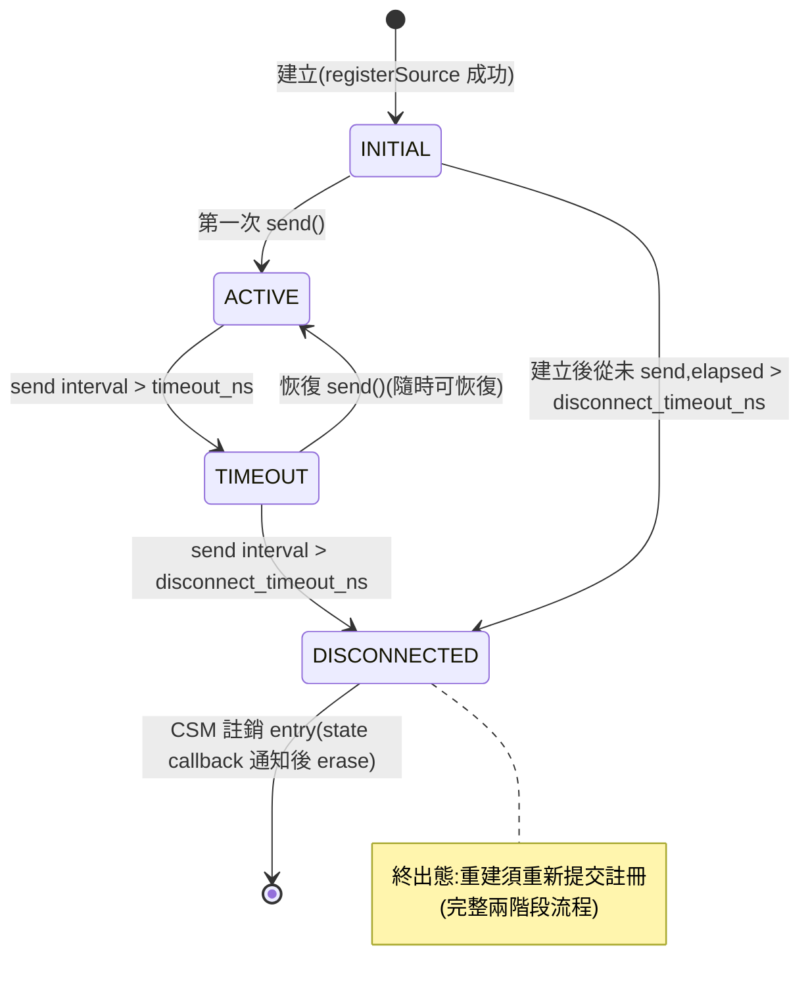
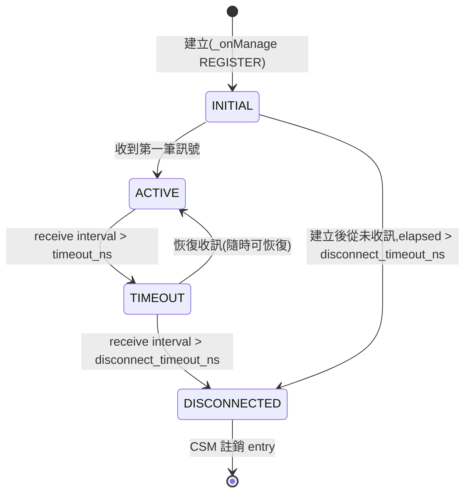
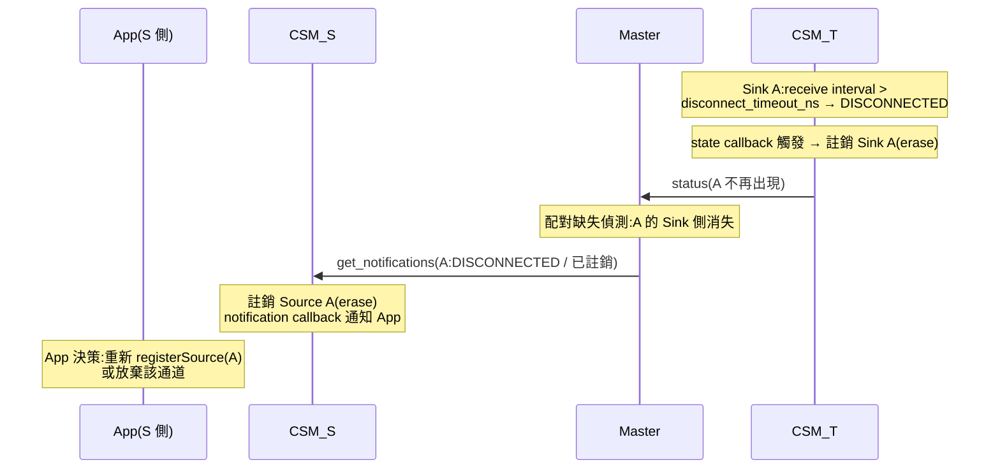
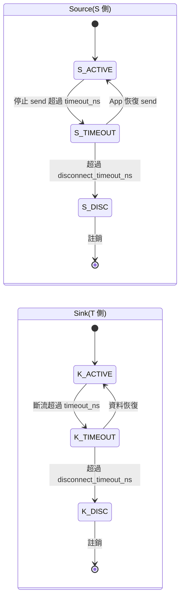
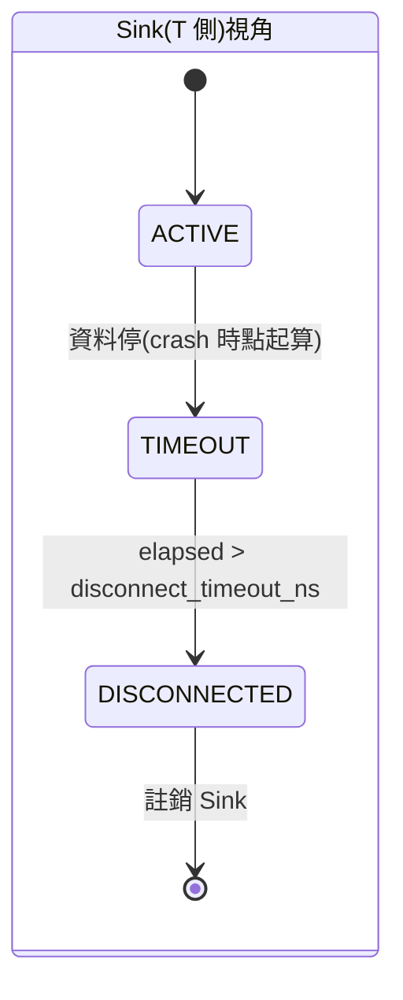
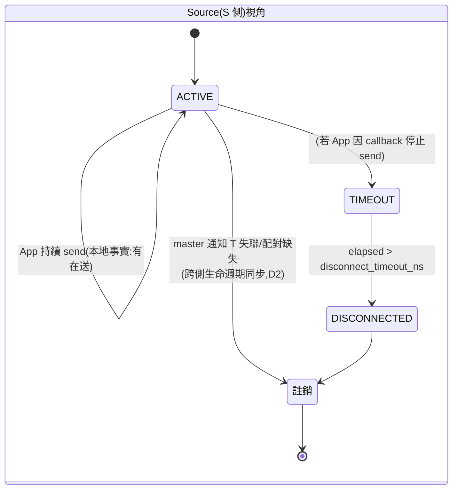
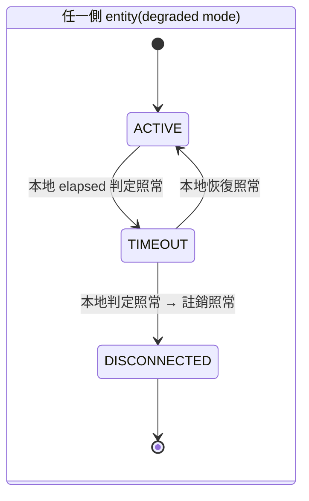

# 討論稿:TIMEOUT / DISCONNECTED 狀態定義與錯誤模式行為(v0.1.0)

> 目的:確認新提出的狀態語意(send/receive 活動自驅 + DISCONNECTED 即註銷),
> 分析其對現行設計(r1_design_draft.md v1.0.1)的衝擊,並針對各錯誤模式繪製狀態機,
> 供裁決後回寫正式文件。
> 術語沿用正式文件 §0.1。

---

## 1. 新語意定義

### 1.1 預期流程(本次提案)

| 階段 | Source | Sink |
|---|---|---|
| 生成 | INITIAL | INITIAL |
| 第一次 `send()` 呼叫後 | ACTIVE | — |
| 收到第一筆訊號後 | — | ACTIVE |
| send interval > `timeout_ns` | TIMEOUT | — |
| receive interval > `timeout_ns` | — | TIMEOUT |
| interval > `disconnect_timeout_ns` | DISCONNECTED | DISCONNECTED |

- **TIMEOUT:隨時可恢復**——恢復 send / 收到訊號即回 ACTIVE,entry 保留,無任何成本。
- **DISCONNECTED:即註銷**——Sink 端 CSM 註銷該配對 entry(移除 Sink);
  Source 端 CSM 對應移除 Source;恢復必須重新提交註冊(完整兩階段流程)。

### 1.2 與現行 v1.0.1 的差異

| 面向 | v1.0.1 現行 | 本提案 |
|---|---|---|
| Source(topic)的活動來源 | 無(send 不算活動);狀態完全由 master 通知注入,tick 跳過自身 checkTimeout | **send 呼叫本身即活動**(`reportActivity()`);自身 elapsed 直接參與雙閾值判定 |
| Source 狀態語意 | 「通道對側可達性」(依賴 master) | 「本端發送活動節律」(純本地、自驅) |
| DISCONNECTED 語意 | 休眠態:entry 與 transport 保留、等待重連(reportActivity → INITIAL) | **終出態:註銷 entry**,重建須重新註冊 |
| 休眠重註冊規則(§8.3,v0.6.0/v1.0.0) | 必要(crash 重啟撞休眠 entry) | **不再需要**——DISCONNECTED entry 已被移除,重註冊面對的是空位 |
| 不穩定連線的緩衝 | DISCONNECTED 休眠吸收 | **TIMEOUT 階段吸收**(隨時恢復);`disconnect_timeout_ns` 設定為「確認死亡」的長閾值 |
| master crash 對狀態的影響 | topic Source 判定凍結(活性來源消失,§12 #1) | **零影響**(兩側皆自驅) |

### 1.3 分析:本提案的得失

**得**:

1. 狀態機語意單純:每個 entity 的狀態只由**本地可觀測事實**(自己的 send/receive
   時間戳)決定,無外部注入路徑;master 通知降級為預警與清理同步,不是狀態來源。
2. v1.0.1 的三個補丁機制整組消失:topic Source 跳過 checkTimeout 的特例、
   對側 ACTIVE 通知連續注入兩次的補丁、休眠重註冊規則(含 TIMEOUT/mode 擴充條件)。
3. §12 未決 #1(master SPOF 下 topic Source 無活性來源)與 #5(休眠 entry GC)
   自然消解:狀態自驅不依賴 master;DISCONNECTED 即註銷,無永久休眠 entry 可回收。
4. my_note FSM #3 的原始動機(避免頻繁 add/remove)仍被滿足,只是承擔者從
   DISCONNECTED 休眠改為 **TIMEOUT 可恢復區間**:短暫不穩定在 TIMEOUT 震盪,
   entry 全程保留;只有超過長閾值的「確認死亡」才付出 add/remove 成本。

**失(需接受或緩解)**:

1. Source(topic)狀態不再反映對側可達性——App 持續 send、對側整個消失時,
   Source 仍顯示 ACTIVE。通道健康的告知改走 notification callback(§4.2 錯誤模式 M4)。
2. DISCONNECTED 後重建成本 = 完整重新註冊(兩階段 + 服務往返)。
   `disconnect_timeout_ns` 的預設值應顯著大於 `timeout_ns`(例如 5–10 倍),
   確保只有真正的長期死亡才觸發。
3. DISCONNECTED → 註銷之間存在短暫可觀測窗口(state callback 觸發 → erase),
   Handle 於註銷後失效——此語意與 v1.0.1 的 Handle 失效規則一致,無新增複雜度。

### 1.4 FSM #3 歷史註記

my_note FSM #3(v0.3.0 採納)提出 DISCONNECTED → INITIAL 重連以避免頻繁
add/remove。本提案將該關注點移轉至 TIMEOUT 區間承擔,DISCONNECTED 回歸
「確認死亡 → 註銷」。若本提案採納,FSM #3 於正式文件中改記為
「由 TIMEOUT 可恢復區間實現」。

---

## 2. 基礎狀態機(新語意)

### 2.1 Source(send 活動自驅)

### 2.2 Sink(receive 活動自驅)

- 兩張圖同構;差別僅在活動事件的來源(send 呼叫 vs 訊號到達)。
- `timeout_ns = 0` / `disconnect_timeout_ns = 0` 的停用變體(正式文件 §2.3.1
  變體 B/C/D)結構不變,對應邊消失;forced `disconnect()` 邊(全變體保留)
  改為直接進入註銷流程。
- service 模式 Source 額外保留:send 成功 response → 活動;response 逾時 →
  記 TIMEOUT(與自身 send interval 判定並存,取較嚴者)。

### 2.3 註銷的跨側同步(取代休眠重連)

任一側 entity 進入 DISCONNECTED 時:

- 兩側 map 最終一致,無孤兒、無殭屍(§0.1)。
- 對側的註銷是**entry 生命週期同步**,不是狀態注入——本地狀態機仍只由本地事實驅動。
- 重新註冊的觸發者:預設由 App 決策(收到 callback);
  是否提供 CSM 自動重註冊選項(retry 參數)列為裁決項 D4。

---

## 3. 錯誤模式與狀態機

### M1:資料流中斷(App 停止 send / 通道劣化)

雙側各自沿基礎狀態機推進,節奏由各自的 elapsed 決定:

- App 停止 send:兩側幾乎同步走完整鏈(elapsed 起點相同,誤差一個傳輸延遲)。
- 通道劣化(App 有 send、Sink 收不到,如 DDS 故障):Source 停在 ACTIVE
  (本地事實:有在送),Sink 走 TIMEOUT → DISCONNECTED → 註銷 → 跨側同步
  註銷 Source(§2.3)。Source 側 App 由 notification callback 得知。
- TIMEOUT 階段恢復:任一側恢復活動即回 ACTIVE,另一側隨資料恢復跟上,零成本。

### M2:Source CSM crash

時序:

1. S crash:資料與 master heartbeat 同時停止。
2. T 側 Sink 依本地 elapsed 走 TIMEOUT → DISCONNECTED → 註銷(本地判定,唯一決策源)。
3. master 於 heartbeat 逾時判定 S 失聯 → 通知 T「S 的 entities 異常」——
   依裁決項 D1(建議:視為 **TIMEOUT 預警**),T 可將尚未逾時的 Sink 提前標
   TIMEOUT(加速),但**不**直接標 DISCONNECTED(不繞過 disconnect 閾值)。
4. S 重啟:本地 map 為空;T 側對應 entry 已註銷(空位)或仍在 TIMEOUT。
   - 已註銷 → 重新註冊走全新流程,天然成立(**無需休眠重註冊規則**)。
   - 仍在 TIMEOUT(重啟快於 disconnect 閾值)→ 同名非 DISCONNECTED entry 的
     REGISTER 處理:裁決項 D3(建議:TIMEOUT entry 允許同 controller/channel/
     type/mode 的重註冊直接沿用——即 v1.0.0 規則的簡化版,僅剩 TIMEOUT 一種情況)。

### M3:Sink CSM crash

1. T crash:T 側全部 Sink 隨行程消失(無註銷流程,直接不存在)。
2. S 側 Source 的 send 活動不受影響 → 停留 ACTIVE(新語意的已知取捨,§1.3 失 1)。
3. master 判定 T 失聯 → 通知 S。S 的處理 = 裁決項 D1 + D2:
   - D1(狀態):標 TIMEOUT(預警)而非 DISCONNECTED。
   - D2(生命週期):T 重啟後 master 觀測到「配對 Sink 不存在」(status 對帳,
     正式文件 §12 #3)→ 通知 S 註銷 Source → App 重新註冊。
4. service 模式差異:S 的下一次 send 直接 response 逾時 → 自主記 TIMEOUT,
   不依賴 master(較 topic 模式快一個通知週期)。

### M4:CSM Master crash

- **entity 狀態零影響**(裁決項 D1 的 master 部分,建議:既非 TIMEOUT 亦非
  DISCONNECTED):新語意下兩側狀態皆為本地自驅,master 只承載預警與生命週期
  同步;其失聯只表示「跨側同步暫停」。
- degraded 期間的缺口:跨側註銷同步延遲(單側註銷後,對側要等 master 回線
  才被同步)——期間對側 entity 依自身 elapsed 大概率也已走到 DISCONNECTED,
  實際不一致窗口有限。
- master 回線:re-register + 首輪 status 基準(不觸發通知風暴)→ 對帳補發
  缺失同步。

### M5:master 恢復後的對帳

不涉及狀態機變化;master 以首輪 status 重建 entries 快取後,比對配對完整性:
「Source 存在、配對 Sink 消失」或反之 → 補發 M3 步驟 3 之生命週期同步通知。
即正式文件 §12 #3 的對帳機制,在新語意下從「未決」升級為**必要元件**
(取代休眠重連,成為 crash 後回收的唯一路徑)。

---

## 4. 裁決項

| # | 問題 | 建議 | 理由 |
|---|---|---|---|
| D1 | 對側 CSM crash(master 失聯通知)→ 本地配對 entities 標 TIMEOUT 還是 DISCONNECTED? | **TIMEOUT** | DISCONNECTED 具註銷副作用,其判定應保持唯一決策源(本地 elapsed > disconnect 閾值)。master 通知作為加速預警(提前進 TIMEOUT);若對側快速重啟,TIMEOUT → ACTIVE 零成本恢復;若真死亡,本地計時自然走到 DISCONNECTED。避免 master 的 600ms 級失聯判定繞過秒級 disconnect 閾值造成過早註銷 |
| D2 | Sink CSM crash 後,S 側 Source 的註銷由誰觸發? | master 對帳(§12 #3)偵測配對缺失 → 通知 S 註銷 | Source 自身 send 自驅不會逾時;需要外部事實(配對已不存在)觸發生命週期同步。對帳在新語意下為必要元件 |
| D3 | 同名 **TIMEOUT** entry 的重註冊(對側快速重啟,本地尚未註銷)? | 允許:controller/channel/type/mode 一致 → 沿用 entry 轉 INITIAL | v1.0.0 休眠重註冊規則的簡化殘留(僅剩 TIMEOUT 一種情況);拒絕會迫使等待 disconnect 閾值走完,拉長恢復時間 |
| D4 | DISCONNECTED 註銷後的重新註冊由誰發起? | 預設 App(notification callback 告知);可選 CSM 自動重試(`ManagerOptions.autoReregister`,預設關) | 重新註冊是否恰當屬應用層決策(通道可能已無意義);自動重試作為便利選項 |
| D5 | master crash 期間單側註銷、對側未同步的窗口 | 接受(對側大概率自行走到 DISCONNECTED);master 回線後對帳補收 | 窗口有限;引入額外同步機制不符成本 |

---

## 5. 採納後對正式文件的修訂範圍(預估)

- §2.3 / §2.3.1:狀態機重繪(DISCONNECTED 改終出態 + 註銷出口);變體圖同步。
- §2.5:liveness 表改為雙側自驅;master 角色改預警 + 生命週期同步 + 對帳。
- §4 `LivenessState`:reportActivity 於 DISCONNECTED 的重連轉移刪除;
  epoch/CAS 機制不變。
- §5 Source:send(topic)改記活動;刪除「topic 跳過 checkTimeout」特例;
  S 表測試改寫。
- §6 Sink:刪除休眠收訊重連;K8 改寫。
- §8 CSM:休眠重註冊規則縮減為 D3;新增註銷流程與 D2/D4;
  `_onGetNotifications` 簡化(刪連續注入兩次補丁)。
- §9 Master:對帳從未決升為必要元件(§12 #3 結案)。
- §12:#1、#5 消解;#3 結案;#8(forced disconnect)語意改「強制進入註銷流程」。
- 附錄 A:六組合的 b/c/d/e 情境全面改寫。
