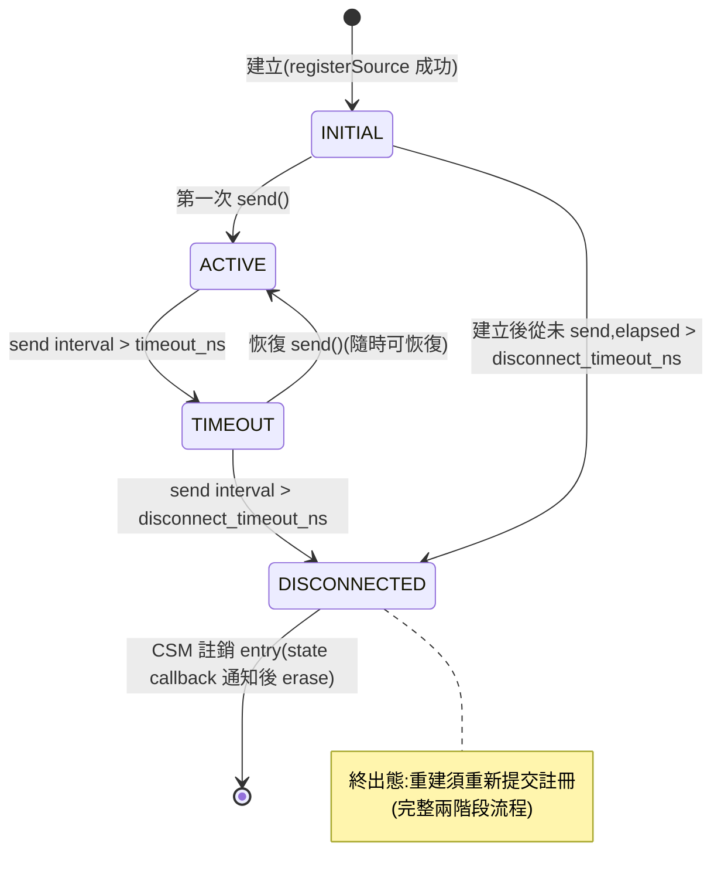
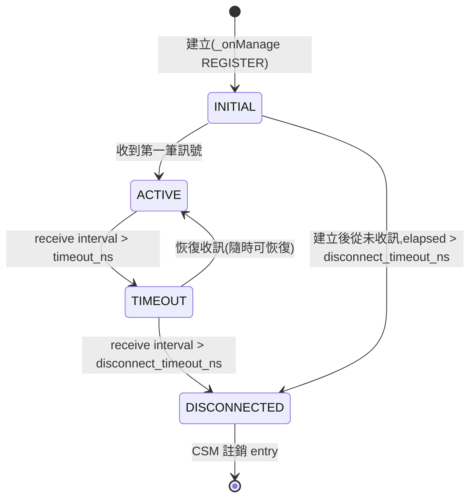
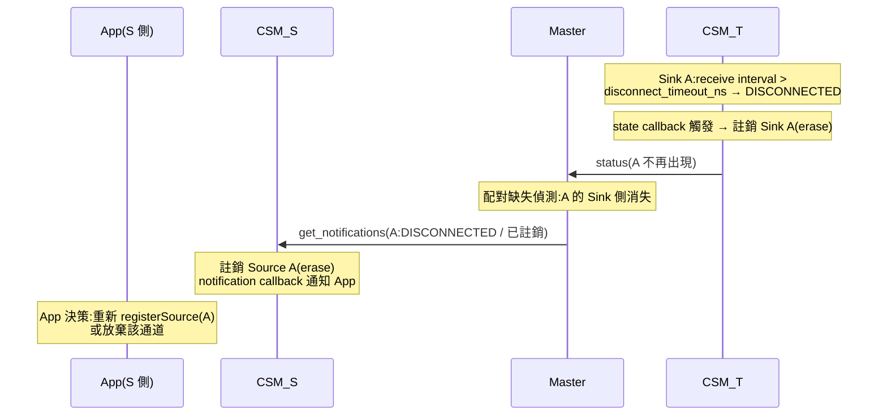
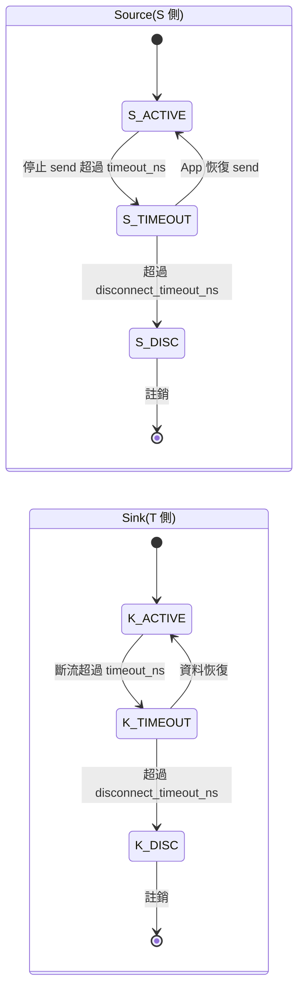
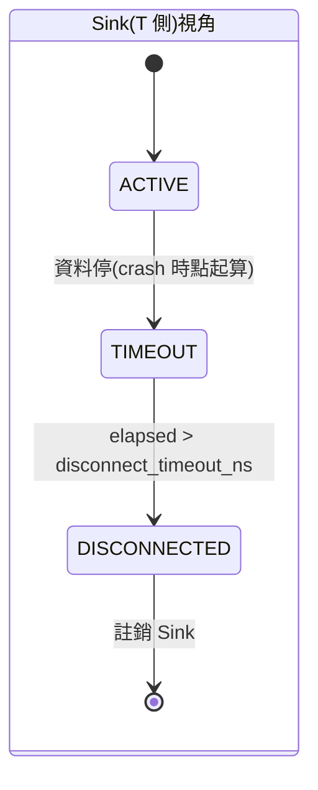
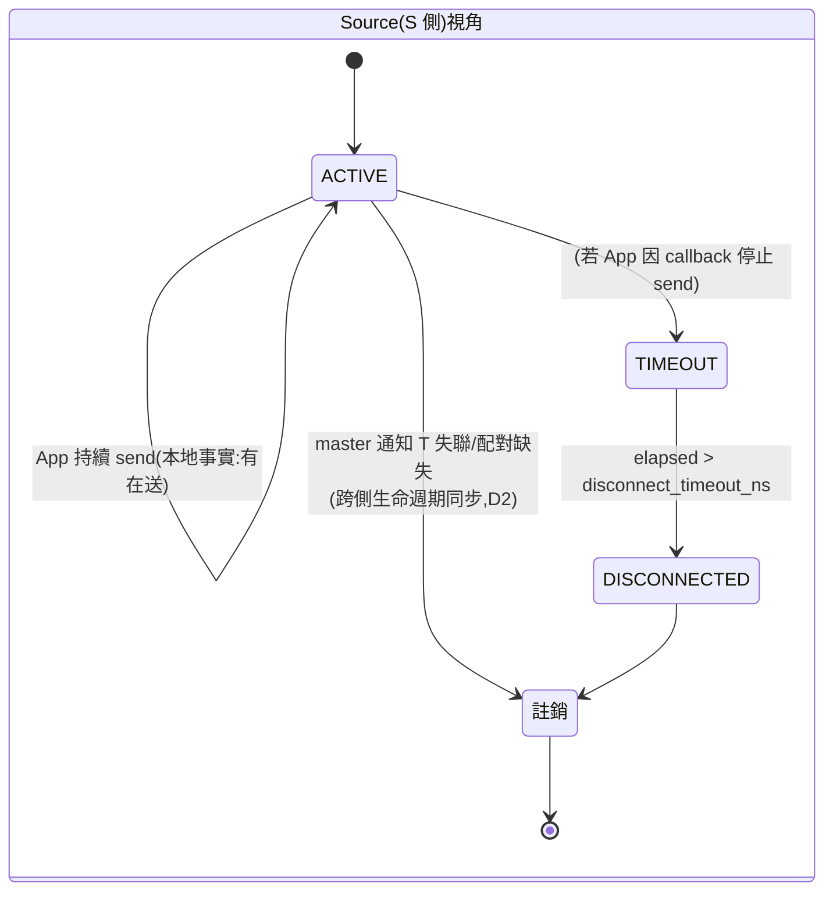
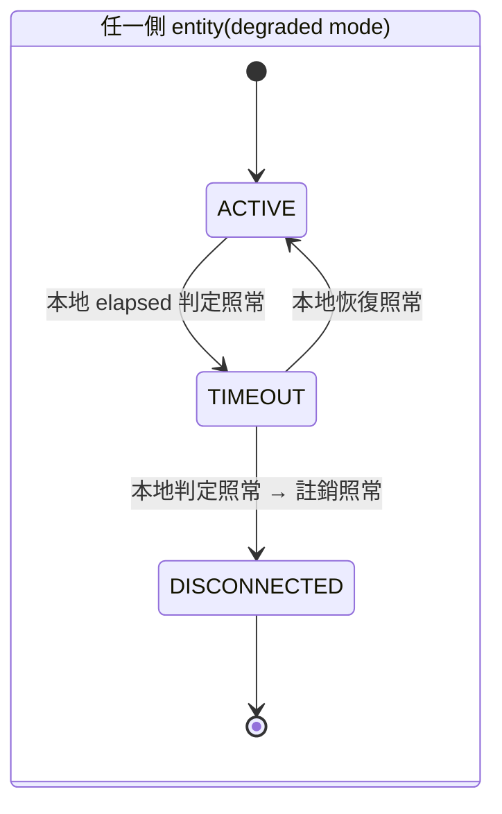
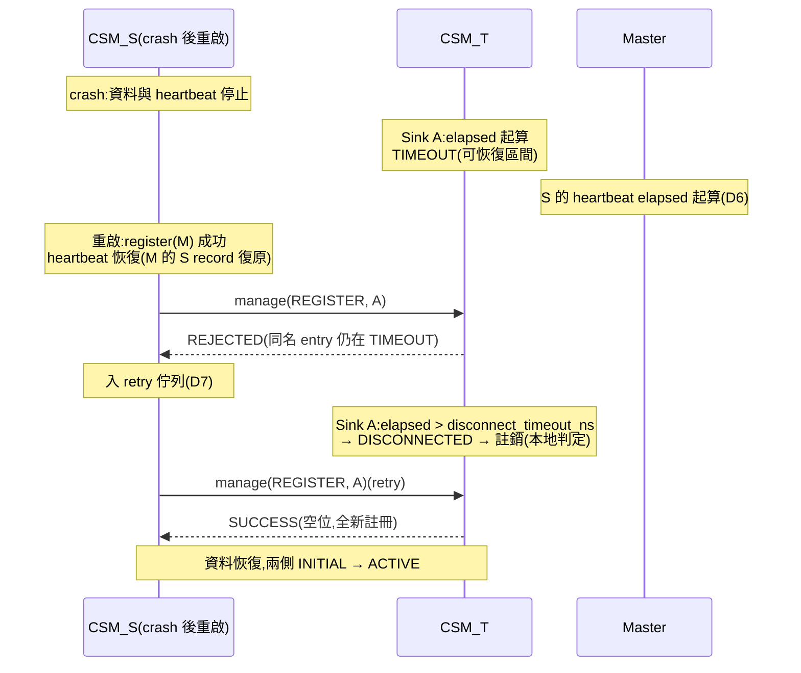
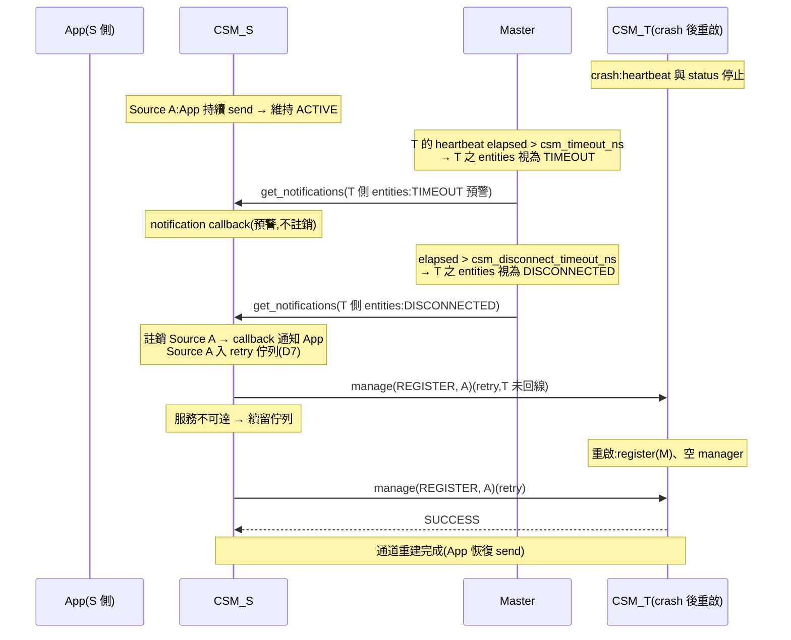
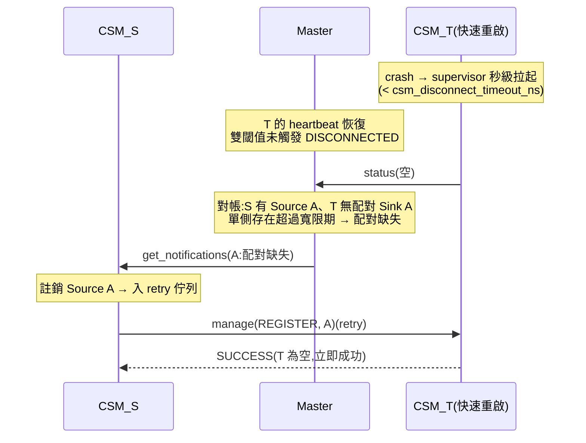

# 討論稿:TIMEOUT / DISCONNECTED 狀態定義與錯誤模式行為(v0.3.0)

> 目的:確認新提出的狀態語意(send/receive 活動自驅 + DISCONNECTED 即註銷),
> 分析其對現行設計(r1_design_draft.md v1.0.1)的衝擊,並針對各錯誤模式繪製狀態機,
> 供裁決後回寫正式文件。
> 術語沿用正式文件 §0.1。

---

## 1. 新語意定義

### 1.1 預期流程(本次提案)

| 階段 | Source | Sink |
|---|---|---|
| 生成 | INITIAL | INITIAL |
| 第一次 `send()` 呼叫後 | ACTIVE | — |
| 收到第一筆訊號後 | — | ACTIVE |
| send interval > `timeout_ns` | TIMEOUT | — |
| receive interval > `timeout_ns` | — | TIMEOUT |
| interval > `disconnect_timeout_ns` | DISCONNECTED | DISCONNECTED |

- **TIMEOUT:隨時可恢復**——恢復 send / 收到訊號即回 ACTIVE,entry 保留,無任何成本。
- **DISCONNECTED:即註銷**——Sink 端 CSM 註銷該配對 entry(移除 Sink);
  Source 端 CSM 對應移除 Source;恢復必須重新提交註冊(完整兩階段流程)。

### 1.2 與現行 v1.0.1 的差異

| 面向 | v1.0.1 現行 | 本提案 |
|---|---|---|
| Source(topic)的活動來源 | 無(send 不算活動);狀態完全由 master 通知注入,tick 跳過自身 checkTimeout | **send 呼叫本身即活動**(`reportActivity()`);自身 elapsed 直接參與雙閾值判定 |
| Source 狀態語意 | 「通道對側可達性」(依賴 master) | 「本端發送活動節律」(純本地、自驅) |
| DISCONNECTED 語意 | 休眠態:entry 與 transport 保留、等待重連(reportActivity → INITIAL) | **終出態:註銷 entry**,重建須重新註冊 |
| 休眠重註冊規則(§8.3,v0.6.0/v1.0.0) | 必要(crash 重啟撞休眠 entry) | **不再需要**——DISCONNECTED entry 已被移除,重註冊面對的是空位 |
| 不穩定連線的緩衝 | DISCONNECTED 休眠吸收 | **TIMEOUT 階段吸收**(隨時恢復);`disconnect_timeout_ns` 設定為「確認死亡」的長閾值 |
| master crash 對狀態的影響 | topic Source 判定凍結(活性來源消失,§12 #1) | **零影響**(兩側皆自驅) |

### 1.3 分析:本提案的得失

**得**:

1. 狀態機語意單純:每個 entity 的狀態只由**本地可觀測事實**(自己的 send/receive
   時間戳)決定,無外部注入路徑;master 通知降級為預警與清理同步,不是狀態來源。
2. v1.0.1 的三個補丁機制整組消失:topic Source 跳過 checkTimeout 的特例、
   對側 ACTIVE 通知連續注入兩次的補丁、休眠重註冊規則(含 TIMEOUT/mode 擴充條件)。
3. §12 未決 #1(master SPOF 下 topic Source 無活性來源)與 #5(休眠 entry GC)
   自然消解:狀態自驅不依賴 master;DISCONNECTED 即註銷,無永久休眠 entry 可回收。
4. my_note FSM #3 的原始動機(避免頻繁 add/remove)仍被滿足,只是承擔者從
   DISCONNECTED 休眠改為 **TIMEOUT 可恢復區間**:短暫不穩定在 TIMEOUT 震盪,
   entry 全程保留;只有超過長閾值的「確認死亡」才付出 add/remove 成本。

**失(需接受或緩解)**:

1. Source(topic)狀態不再反映對側可達性——App 持續 send、對側整個消失時,
   Source 仍顯示 ACTIVE。通道健康的告知改走 notification callback(§4.2 錯誤模式 M4)。
2. DISCONNECTED 後重建成本 = 完整重新註冊(兩階段 + 服務往返)。
   `disconnect_timeout_ns` 的預設值應顯著大於 `timeout_ns`(例如 5–10 倍),
   確保只有真正的長期死亡才觸發。
3. DISCONNECTED → 註銷之間存在短暫可觀測窗口(state callback 觸發 → erase),
   Handle 於註銷後失效——此語意與 v1.0.1 的 Handle 失效規則一致,無新增複雜度。

### 1.4 FSM #3 歷史註記

my_note FSM #3(v0.3.0 採納)提出 DISCONNECTED → INITIAL 重連以避免頻繁
add/remove。本提案將該關注點移轉至 TIMEOUT 區間承擔,DISCONNECTED 回歸
「確認死亡 → 註銷」。若本提案採納,FSM #3 於正式文件中改記為
「由 TIMEOUT 可恢復區間實現」。

---

## 2. 基礎狀態機(新語意)

### 2.1 Source(send 活動自驅)



### 2.2 Sink(receive 活動自驅)



- 兩張圖同構;差別僅在活動事件的來源(send 呼叫 vs 訊號到達)。
- `timeout_ns = 0` / `disconnect_timeout_ns = 0` 的停用變體(正式文件 §2.3.1
  變體 B/C/D)結構不變,對應邊消失;forced `disconnect()` 邊(全變體保留)
  改為直接進入註銷流程。
- service 模式 Source 額外保留:send 成功 response → 活動;response 逾時 →
  記 TIMEOUT(與自身 send interval 判定並存,取較嚴者)。

### 2.3 註銷的跨側同步(取代休眠重連)

任一側 entity 進入 DISCONNECTED 時:



- 兩側 map 最終一致,無孤兒、無殭屍(§0.1)。
- 對側的註銷是**entry 生命週期同步**,不是狀態注入——本地狀態機仍只由本地事實驅動。
- 重新註冊的觸發者:預設由 App 決策(收到 callback);
  是否提供 CSM 自動重註冊選項(retry 參數)列為裁決項 D4。

### 2.4 狀態推進的職責劃分(v0.3.0,已裁決 D8)

Entities(Source/Sink)**不自行推進狀態機**,職責縮減為三件事:

| 角色 | 職責 |
|---|---|
| Entity(Source/Sink) | 1. **記錄**觸發次數與時間(send 呼叫 / receive callback,hot path 原子寫入);2. 提供**計算 status 的 function**(純計算,不改動狀態);3. 提供**更新狀態 function**(由 CSM 呼叫寫入) |
| CSM | tick 時對每個管理的 entity:呼叫計算 function → 結果記錄於 **CSM 自身的 table** → 呼叫 entity 的更新狀態 function;DISCONNECTED 結果一併觸發註銷流程 |

介面草案:

```cpp
// Entity 側(Source/Sink 共通;applyStatus 為 CSM 專用 friend 通道)
void recordActivity(int64_t nowNs);            // hot path:send()/收訊 callback 內呼叫
EntityStatus calcStatus(int64_t nowNs) const;  // 純計算:記錄 + info 閾值 → {state, rateHz}
void applyStatus(ControlSignalState s);        // CSM 呼叫:寫入狀態,old != new 時 fire state callback
ControlSignalState getState() const;           // 讀取最後一次 applyStatus 的結果
```

CSM tick 流程:

```
for (entity : entities) {
    st = entity->calcStatus(now);        // 1. 計算(entity 提供)
    table[ctrl].lastStatus = st;         // 2. 記錄於 CSM 自身 table
    entity->applyStatus(st.state);       // 3. 寫回 entity(+ state callback)
    if (st.state == DISCONNECTED) 註銷流程(§2.3);
}
publish ManagerStatus(table);
```

**並發模型的重大簡化**:

- 狀態變數的**唯一寫者是 CSM tick**(單執行緒序列化);hot path 只寫時間戳與
  計數(單調遞增,relaxed atomic 即足)。
- 正式文件 §4.2 的 **epoch CAS 機制不再必要**——stale-TIMEOUT 競態的根源是
  「多執行緒併發寫狀態」(收訊路徑 reportActivity vs 檢查路徑 checkTimeout),
  單寫者模型下該競態在結構上不存在。`LivenessState` 退化為:
  記錄欄位(atomic 時間戳 + RateRecorder)+ 純計算函數 + 單一 atomic 狀態,
  類別可大幅簡化或併入 entity 本體。
- state callback 一律於 CSM tick 執行緒(mgmtGroup)觸發,執行緒來源單一,
  使用者 callback 的並發約束更簡單。
- tick 讀取 lastActivity 與 hot path 寫入的交錯:最多使當次判定晚一個 tick
  修正,無害(下一 tick 讀到新值即回正)。

**取捨(需接受)**:狀態更新粒度 = tick 週期(`statusIntervalMs`,預設 200ms)。
第一次 send / 收訊後,狀態於下一個 tick 才由 INITIAL 轉 ACTIVE;`read()` 的
「僅 ACTIVE 回 true」與 state callback 同樣以 tick 粒度反應。監控語意下可接受;
資料層的即時性不受影響(訊息到達本身即為 App 的即時回饋)。

- `forced disconnect()` 同樣收斂到 CSM:呼叫路徑改為 CSM 直接
  `applyStatus(DISCONNECTED)` + 註銷,無並發寫者問題。
- service 模式 send 的 response 結果(成功/逾時)同樣**只記錄**
  (lastResponseNs、失敗計數);`send()` 的回傳值即時反映當次結果
  (API 層回饋),狀態機推進仍統一於 tick。calcStatus 將 response 記錄
  納入計算(response 逾時計為活動中斷)。

---

## 3. 錯誤模式與狀態機

### M1:資料流中斷(App 停止 send / 通道劣化)

雙側各自沿基礎狀態機推進,節奏由各自的 elapsed 決定:



- App 停止 send:兩側幾乎同步走完整鏈(elapsed 起點相同,誤差一個傳輸延遲)。
- 通道劣化(App 有 send、Sink 收不到,如 DDS 故障):Source 停在 ACTIVE
  (本地事實:有在送),Sink 走 TIMEOUT → DISCONNECTED → 註銷 → 跨側同步
  註銷 Source(§2.3)。Source 側 App 由 notification callback 得知。
- TIMEOUT 階段恢復:任一側恢復活動即回 ACTIVE,另一側隨資料恢復跟上,零成本。

### M2:Source CSM crash



時序:

1. S crash:資料與 master heartbeat 同時停止。
2. T 側 Sink 依本地 elapsed 走 TIMEOUT → DISCONNECTED → 註銷(本地判定,唯一決策源)。
3. master 於 heartbeat 逾時判定 S 失聯 → 通知 T「S 的 entities 異常」——
   依裁決項 D1(建議:視為 **TIMEOUT 預警**),T 可將尚未逾時的 Sink 提前標
   TIMEOUT(加速),但**不**直接標 DISCONNECTED(不繞過 disconnect 閾值)。
4. S 重啟:本地 map 為空;T 側對應 entry 已註銷(空位)或仍在 TIMEOUT。
   - 已註銷 → 重新註冊走全新流程,天然成立(**無需休眠重註冊規則**)。
   - 仍在 TIMEOUT(重啟快於 disconnect 閾值)→ 同名非 DISCONNECTED entry 的
     REGISTER 處理:裁決項 D3(建議:TIMEOUT entry 允許同 controller/channel/
     type/mode 的重註冊直接沿用——即 v1.0.0 規則的簡化版,僅剩 TIMEOUT 一種情況)。

### M3:Sink CSM crash



1. T crash:T 側全部 Sink 隨行程消失(無註銷流程,直接不存在)。
2. S 側 Source 的 send 活動不受影響 → 停留 ACTIVE(新語意的已知取捨,§1.3 失 1)。
3. master 判定 T 失聯 → 通知 S。S 的處理 = 裁決項 D1 + D2:
   - D1(狀態):標 TIMEOUT(預警)而非 DISCONNECTED。
   - D2(生命週期):T 重啟後 master 觀測到「配對 Sink 不存在」(status 對帳,
     正式文件 §12 #3)→ 通知 S 註銷 Source → App 重新註冊。
4. service 模式差異:S 的下一次 send 直接 response 逾時 → 自主記 TIMEOUT,
   不依賴 master(較 topic 模式快一個通知週期)。

### M4:CSM Master crash



- **entity 狀態零影響**(裁決項 D1 的 master 部分,建議:既非 TIMEOUT 亦非
  DISCONNECTED):新語意下兩側狀態皆為本地自驅,master 只承載預警與生命週期
  同步;其失聯只表示「跨側同步暫停」。
- degraded 期間的缺口:跨側註銷同步延遲(單側註銷後,對側要等 master 回線
  才被同步)——期間對側 entity 依自身 elapsed 大概率也已走到 DISCONNECTED,
  實際不一致窗口有限。
- master 回線:re-register + 首輪 status 基準(不觸發通知風暴)→ 對帳補發
  缺失同步。

### M5:master 恢復後的對帳

不涉及狀態機變化;master 以首輪 status 重建 entries 快取後,比對配對完整性:
「Source 存在、配對 Sink 消失」或反之 → 補發 M3 步驟 3 之生命週期同步通知。
即正式文件 §12 #3 的對帳機制,在新語意下從「未決」升級為**必要元件**
(取代休眠重連,成為 crash 後回收的唯一路徑)。

---

## 4. 裁決結果(v0.2.0 更新:D1–D4 已裁決,新增 D6/D7)

| # | 問題 | 裁決 | 說明 |
|---|---|---|---|
| D1 | 對側 CSM 失聯(網路不穩)→ 本地配對 entities 的狀態 | **TIMEOUT**(已裁決) | 網路不穩造成 heartbeat 失聯 → TIMEOUT,可恢復;網路恢復後繼續工作,無註銷成本 |
| D2 | Sink CSM crash 後 Source 側如何得知並重建 | **master 雙閾值判定 + 通知註銷 + retry 重建**(已裁決,見 D6/D7) | master 判 T 失聯超過 disconnect 閾值 → 通知 S「對方 entities DISCONNECTED」→ S 註銷 Source → retry 重新註冊直到 T 重啟接受 |
| D3 | 同名 TIMEOUT entry 的重註冊沿用規則 | **否決;採 retry-until-success**(已裁決) | 重複註冊被拒即重試,待對方 entry 依本地 elapsed 走到 DISCONNECTED 註銷後,重試自然成功。以時間換取協定簡單性,無需任何特殊沿用規則 |
| D4 | 重新註冊的發起者 | **CSM 內建 retry 機制**(已裁決;細節見 D7) | 「Source CSM 重啟後需嘗試重新註冊直到成功」「S 重新註冊直到對方重啟成功」——retry 由 CSM 執行,App 經 callback 得知結果 |
| D5 | master crash 期間單側註銷、對側未同步的窗口 | 接受;master 回線後對帳補收 | 維持原建議 |
| D6 | **CSM–master heartbeat 雙閾值**(本輪新提案) | **採納**:CSM 向 master 註冊時傳入 `csm_timeout_ns` 與 `csm_disconnect_timeout_ns`;master 以 polling 檢查各 CSM 的 heartbeat elapsed——超過 timeout → 該 CSM 全部 entities 視為 TIMEOUT(預警通知配對方);超過 disconnect timeout → 視為 DISCONNECTED(通知配對方註銷 + 觸發 retry) | CSM 級失聯與 entity 級同構的雙閾值語意:TIMEOUT 吸收網路抖動、DISCONNECTED 確認死亡。`CsmRegister.srv` 增列兩欄位 |
| D8 | 狀態推進職責劃分 | **已裁決**(§2.4):entity 僅記錄 + 純計算 + 被動接受狀態;CSM 為唯一狀態推進者,計算結果記於 CSM table 後寫回 entity | 單寫者模型;epoch CAS 機制廢除,LivenessState 大幅簡化;狀態粒度 = tick 週期 |
| D7 | retry 機制細節 | **待定案**(方向已定,參數待議) | 建議:CSM 維護 pending-register 佇列,tick 驅動重試(間隔 = `statusIntervalMs` 之整數倍,預設 5 倍;無上限,App 可經 unregister 取消);首次 `registerSource()` 同步嘗試,失敗依 info 之 `auto_retry` 旗標(或 ManagerOptions 預設)入佇列;每次結果經 notification callback 回報 |

### 4.1 殘餘缺口:Sink CSM 快速重啟(雙閾值不觸發)

D6 處理「T 失聯足夠久」的情況;若 T 在 `csm_disconnect_timeout_ns` 內快速重啟
(supervisor 秒級拉起),master 的 T record 恢復、不會發出 DISCONNECTED 通知——
但 T 的註冊資料已全部遺失:S 的 Source 持續 send、資料落空,S 無從察覺。

此情況唯一的偵測者是 **master 對帳**(status 配對缺失偵測,正式文件 §12 #3):
master 於 T 回線後的 status 中發現「S 有 Source A、T 無配對 Sink A」→
通知 S「配對缺失」→ S 註銷 Source A 並進 retry(對 T 重新註冊,T 為空、立即成功)。

結論:**D6 雙閾值(慢死亡)與 master 對帳(快重啟)互補,兩者皆為必要元件**。
對帳實作:master 收到 status 後,對每個 entry 檢查配對是否存在;
「單側存在超過寬限期(建議 2 × statusInterval,容忍註冊傳播延遲)」→ 發配對缺失通知。

---

## 5. 錯誤模式收斂時序(v0.2.0,retry 機制)

### 5.1 M2:Source CSM crash 重啟 → retry 直到對方註銷



- 收斂上限 = T 的 `disconnect_timeout_ns` + 一個 retry 間隔。
- 若 S 失聯已超過 `csm_disconnect_timeout_ns`(重啟慢),master 先通知 T
  「S entities DISCONNECTED」→ T 提前註銷 → S 重啟後首次註冊即成功(更快)。

### 5.2 M3:Sink CSM crash → master 雙閾值通知 → 註銷 + retry



- Source 無法自動復原的問題由 D6 + D7 解決:master 的 CSM 級 DISCONNECTED
  判定觸發註銷,retry 佇列負責重建,全程無需 App 介入(App 僅收 callback)。

### 5.3 M3′:Sink CSM 快速重啟(§4.1 對帳路徑)



---

## 6. 採納後對正式文件的修訂範圍(v0.2.0 更新)

- §2.3 / §2.3.1:狀態機重繪(DISCONNECTED 改終出態 + 註銷出口);變體圖同步。
- §2.5:liveness 表改為雙側自驅;master 角色 = CSM 級雙閾值判定(D6)+
  預警/註銷通知 + 對帳(§4.1);`CsmRegister.srv` 增 `csm_timeout_ns`、
  `csm_disconnect_timeout_ns` 欄位。
- §4 `LivenessState`:重寫為單寫者模型(D8)——刪 DISCONNECTED → INITIAL 重連轉移、**刪 epoch CAS 機制**(競態根源已被職責劃分結構性消除);介面改為 recordActivity / calcStatus(純計算)/ applyStatus(CSM 專用);並發測試組(L7/L8/L11 等)改寫為單寫者語意驗證。
- §5 Source:send 只記錄(recordActivity),不改狀態;刪「topic 跳過 checkTimeout」特例;service response 結果改記錄制;測試表改寫。
- §6 Sink:`_store()` 只記錄 + 存訊息 + 喚醒 + user callback,不改狀態;刪休眠收訊重連;K8 改寫。
- §8 CSM:tick 重寫為 calcStatus → table → applyStatus → 註銷 判定鏈(D8);刪休眠重註冊規則(D3 否決);新增 **pending-register retry 佇列**(D7)、
  註銷流程與跨側同步;`_onGetNotifications` 處理 TIMEOUT 預警 / DISCONNECTED 註銷 /
  配對缺失三類通知。
- §9 Master:tick 增 CSM 級雙閾值 polling(D6)與對帳(配對缺失偵測 + 寬限期);
  CM 測試組改寫。
- §12:#1、#5 消解;#3 結案(對帳為必要元件);#8 語意改「強制進入註銷流程」;
  新增 retry 參數細節(D7)待定項。
- 附錄 A:六組合的 b/c/d/e 情境全面改寫(retry 收斂時序取代休眠重連)。
