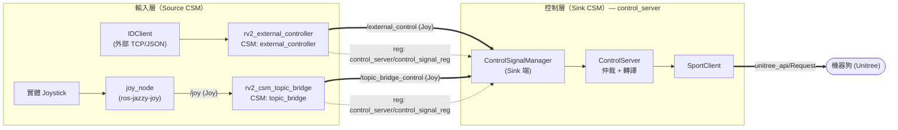
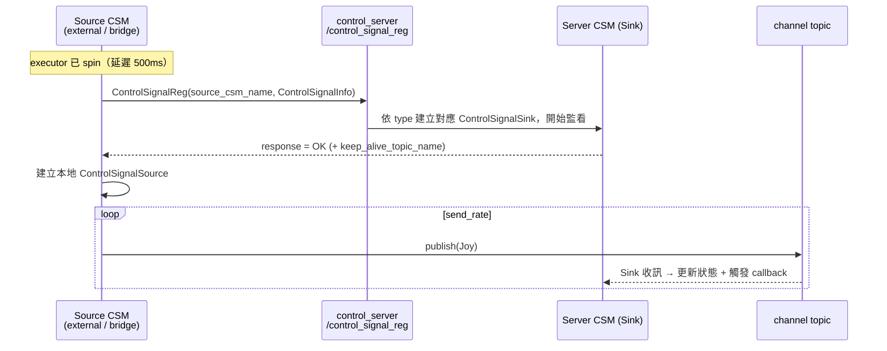
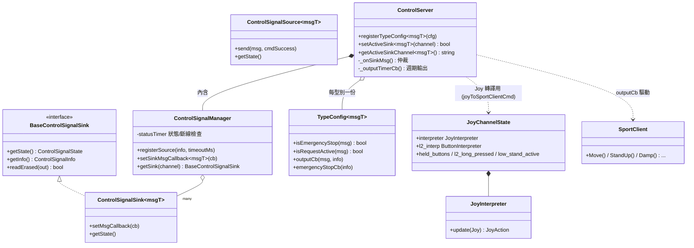
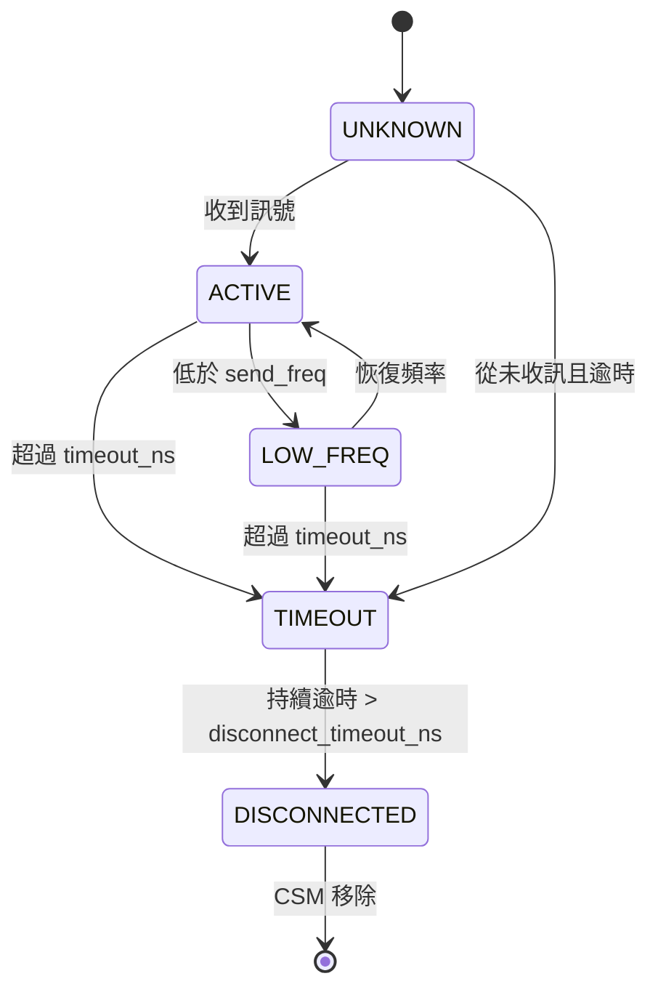
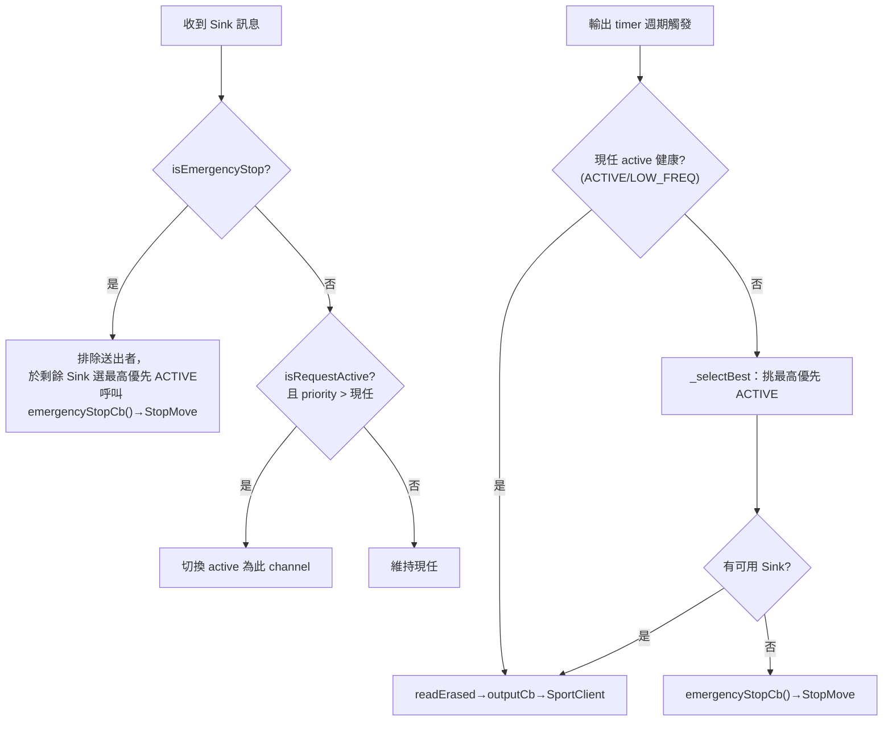
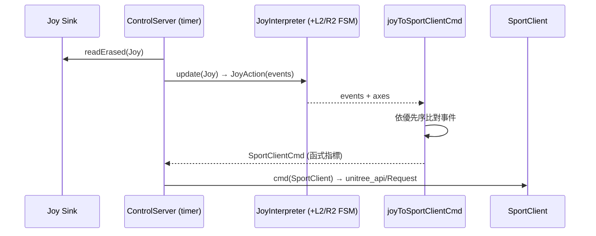
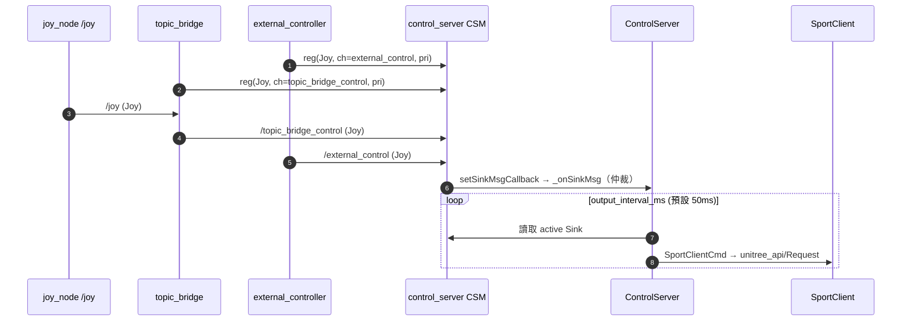

# ROS 2 機器狗控制流程 — 架構概念書

> 目的：供團隊討論整體控制鏈路的架構合理性。本文聚焦「輸入訊號 → 控制伺服器 → 機器狗輸出」的資料流、通訊協定與控制邏輯，並標註待討論重點。

---

## 1. 範圍與套件職責

| 套件 | 角色 | 核心產出 |
|---|---|---|
| `ros-jazzy-joy` | 官方 Joystick 驅動 | 讀取實體搖桿 → publish `sensor_msgs/Joy` 到 `/joy` |
| `joy_interpreter` | Joy 語意轉譯（函式庫 + 節點） | 逐按鈕 FSM，輸出 `JoyAction`（Press / Release / SingleClick / DoubleClick / LongPress） |
| `rv2_control_signal_transport` | 傳輸層核心 | `ControlSignalSource` / `ControlSignalSink` / `ControlSignalManager`（CSM） |
| `rv2_csm_topic_bridge` | Topic → CSM 轉接器 | 訂閱任意 topic，以 CSM Source 身分轉發 |
| `rv2_external_controller` | 外部 IDClient → CSM | 解析 TCP/JSON，打包 `Joy`，以 CSM Source 註冊 |
| `rv2_interfaces` | 介面定義 | `ControlSignalReg` / `ControlSignalInfoReq` 服務、`ControlSignalInfo` / `ControlSignalConst` 訊息 |
| `rv2_server_control` | 控制模組（Sink 端） | `ControlServer`：多 Sink 仲裁 → `SportClient` 函式指標輸出 |

**設計原則**：傳輸（CSM）與語意（控制邏輯）解耦。CSM 只負責「誰連上、是否存活、誰優先」；`ControlServer` 只負責「把當前選定的訊號翻譯成機器狗指令」。

---

## 2. 部署 / 通訊架構

兩個輸入源各自擁有一個 CSM（Source 角色），透過 `ControlSignalReg` 服務向 `control_server` 的 CSM（Sink 角色）註冊，註冊成功後在 *channel topic* 上 publish 控制訊號。

說明：
- 實線（粗）= 控制訊號資料流（topic mode：Source=publisher、Sink=subscriber）。
- 虛線 = 註冊握手（service）。
- `channel_name` 即傳輸 topic 名稱（`external_control`、`topic_bridge_control`）。
- CSM 另支援 `service` mode（Source=client、Sink=server），目前控制鏈路採 `topic` mode。

---

## 3. 註冊握手（時序）

`registerSource()` 為阻塞呼叫，必須在 executor 已開始 spin 後執行；兩個輸入節點皆以 500 ms one-shot timer + 背景 thread 延遲初始化，確保多執行緒 executor 已就緒。

`ControlSignalInfo` 關鍵欄位：`target_csm_name`、`control_signal_mode`、`control_signal_type`、`channel_name`、`send_freq_hz`、`timeout_ns`、`disconnect_timeout_ns`、`priority`。

---

## 4. 類別結構（UML）

要點：
- `ControlServer` 以 **型別模板**（`TypeConfig<msgT>`）支援多 message type（`Joy`、`Twist`），各型別維持獨立的 active-sink 選擇。
- Sink 經 type-erased `readErased()` 讀取，`ControlServer` 不需知道具體 `ControlSignalSink<msgT,srvT>` 特化。
- `outputCb` 經 `msgToOutSignal(channel, msg)` 回傳 `SportClientCmd = std::function<void(SportClient&)>`（函式指標），再施加於 `SportClient`。

---

## 5. 控制邏輯

### 5.1 訊號狀態機（每個 Sink）

### 5.2 Active-Sink 仲裁（優先權 / 請求 / 緊急停止）

仲裁在兩處發生：收訊 callback (`_onSinkMsg`) 與週期輸出 (`_outputTimerCb`)。

仲裁規則重點：
- **選擇準則**：優先權高者勝；同優先權時 `ACTIVE` 優於 `LOW_FREQ`；`EMERGENCY_STOP`(=100) 優先權的來源永不被選為輸出。
- **自動接管**：現任 active 若仍 `ACTIVE`，低/同優先源不可搶；現任不健康時，較高優先的新源自動接管。
- **主動請求**：非 active 源送出 request-active 且優先權高於現任時切換。
- **緊急停止**：任何優先權皆可觸發，立即 `StopMove` 並「排除送出者」後回退到次佳來源（優先權高者）。
- **無可用源**：輸出 timer 找不到健康 Sink → 直接送 `StopMove`（安全預設）。

優先權常數（`ControlSignalConst`）：`EMERGENCY_STOP=100`、`HIGH=80`、`MEDIUM=50`、`LOW=20`。

### 5.3 哨兵值（內嵌於訊息）

| 語意 | Joy | Twist |
|---|---|---|
| Emergency stop | `axes[5]`(R2) < 0.5 | `linear.z = angular.x = angular.y = -99` |
| Request active | `buttons[3]`(Y) == 1 | 上述三者 == 99 |

---

## 6. Joy → SportClient 轉譯（控制層內）

當 Sink 為 `Joy` 型別，`ControlServer` 在輸出時呼叫 `joyToSportClientCmd()`：先以 `JoyInterpreter` 將原始 Joy 轉成 `JoyAction`（含按鈕事件），再依事件對應 `SportClient` 函式。每個 channel 維持獨立 `JoyChannelState`（FSM、held-button、L2 長按閘）。

**指令對應（由高到低優先）**：

| 觸發 | SportClient 動作 |
|---|---|
| L2 長按 + A `SingleClick` | `StandDown` / `StandUp`（低站姿切換） |
| L2 長按 + B `SingleClick` | `Damp` |
| L2 長按 + X `SingleClick` | `RecoveryStand` |
| L2 長按 + Start `SingleClick` | `BalanceStand`（運行模式） |
| L2 `DoubleClick` | `SpeedLevel(0)` 低速 |
| L1 `DoubleClick` | `SpeedLevel(2)` 高速 |
| Start `Press`（無 L2） | `BalanceStand`（解鎖/站立） |
| R1 `DoubleClick` | `ClassicWalk(true)` |
| X `SingleClick`（無 L2） | `VisionWalk(true)` |
| Select `SingleClick` | `ContinuousGait(true)` |
| 無事件（每 tick 預設） | `Move(vx=axes[1], vy=axes[0], vyaw=axes[3])` |

`Twist` 型別則直接 `Move(linear.x, linear.y, angular.z)`，不經事件轉譯。

---

## 7. 端到端資料流（總覽時序）

---

## 8. 待討論重點（Review Points）

1. **緊急停止哨兵不一致**：控制層 Joy e-stop 採 `axes[5]`(R2)；但 `KeyboardSource` 文件以 `buttons[0..3]=-99` 表示 e-stop、`=99` 表示 request。建議統一各 Source 的哨兵約定，或集中於 `rv2_interfaces` 定義常數。
2. **request-active 與 e-stop 共用按鍵語意**：Joy 的 `buttons[3]`(Y)=request、`axes[5]`(R2)=e-stop，與 §6 的操作按鍵需確認無誤觸風險。
3. **雙重仲裁點**：`_onSinkMsg` 與 `_outputTimerCb` 皆會改寫 `activeChannel`，需確認在高頻訊號下兩者一致、無抖動（建議集中仲裁職責）。
4. **Joy 狀態跨 channel 共用**：`msgToOutSignal<Joy>` 以 `static std::map` 持有各 channel 狀態，切換 active 來源時 FSM 狀態不會自動重置，long-press/held 狀態是否需在接管時清除？
5. **優先權與接管時機**：現任 `ACTIVE` 時高優先源不可自動接管（須 request-active）；確認此「黏著」行為符合操作期望。
6. **逾時參數約束**：`disconnect_timeout_ns > timeout_ns`、`1/send_freq_hz < timeout_ns`，各 Source 設定需符合 `validateControlSignalInfo()`。
7. **執行緒模型**：所有 CSM 註冊與輸出皆依賴多執行緒 executor（`component_container_mt`）；部署 launch 需確保此前提。

---

## 9. 結論

本架構以 CSM 為傳輸抽象層，將「連線管理／存活偵測／優先權仲裁」與「機器狗指令轉譯」清楚分離；輸入端可水平擴充（新增 Source 僅需註冊），輸出端以函式指標解耦各 message type 的轉譯。整體分層合理、可擴充性佳；主要待釐清項目為哨兵值約定統一與仲裁職責集中（§8）。
