# R1 Control Signal Transport 程式設計規劃書(v1.3.38)

> 狀態:正式版(v1.3.38)；project v0.1.2／PR #2 已合併，總驗收待使用者手動執行；T12.2 因環境限制暫時 SKIP。未決事項集中在第 12 章,將於實作階段逐項裁決。
> 文件位置:`src/rv2_project/docs/r1_design_docs/`。Transport 仍實作於 `rv2_control_signal_transport` 的 `r1` namespace，後續 migrate 至獨立 package。
> 版控:本文件以 git 管理,每次修訂一個 commit,版本號記於本節與 §0 版本歷史。

## 0. 版本歷史

| 版本 | 摘要 |
|---|---|
| v1.3.38 | **更新 Agent:`coco-codex`**。同步 project PR #2 已合併、literal pull 主線 612f051 與原 v0.1.2 tag 1ada31e tree 相同。依使用者裁決將 T12.2 記為本次環境豁免 SKIP／延期，不冒稱 PASS，也不阻擋其餘項目手動總驗收；整體 acceptance_pending 保留。正式確定 test_run 測試與 test_packages 打包入口分離，記錄現行 Docker 建置／乾淨安裝合約及無 Docker 打包的待討論範圍，未修改 framework。對齊 TODO v0.8.39／README／T15 完成紀錄；不回寫三份已發布 snapshots、原 tags 或 component pins，不新增可選總測腳本。 |
| v1.3.37 | **更新 Agent:`coco-codex`**。Project v0.1.2以僅改package.xml的1ada31e獨立定版，annotated tag與PR #2已推。實際clean release clone通過unit133／integration9、CMake/XML與Python3 lint；source/framework dirty0，容器已清除，證據見TODOv0.8.38 T15。本完成紀錄在本地results分支，不回寫tag／PR的v1.3.36文件tree或舊snapshots。十個project gitlinks為已核對merged releases，原四個工作分支仍保留；TSan與整體總驗收pending不改。 |
| v1.3.36 | **更新 Agent:`coco-codex`**。Project v0.1.2 metadata 候選與全新 recursive clone 均通過unit133／integration9、CMake/XML各1，Python3 lint PASS；兩份owner僅package.xml PR-ready進版diff，components／原tags／gitlinks均clean，不冒稱release已提交。舊legacy文字guard有RED，新通用限制與兩個相容回歸GREEN；保留schema、SHA/tree/tag、歷史版本表及安裝guards。現況對齊全部已合併releases，舊兩版snapshot不變；TSan／整體驗收／外部環境未鎖版限制保留。獨立版本commit/tag/PR及乾淨release複驗接續執行，證據見TODO v0.8.37 T15。 |
| v1.3.35 | **更新 Agent:`coco-codex`**。逐個乾淨 checkout 實際 pull／取原 release tag，確認 local/origin/live SHA 與 release tree 一致，新增 project v0.1.2 精確版本／SHA 對照。Frameworkae47906/v0.5.1、interfaces a0530d7／mocks614750f／integratione584074/v0.1.2、transport5a91d31/v0.2.0，project base c8aca0a/v0.1.1。原兩版 snapshot／tags 保留；六個 project gitlinks 8f4ec55、四個 nested framework 同 ae47906。限制不再綁定 legacy 文字，保留 TSan／整體驗收 pending 與外部 apt/image 未鎖版。測試／clone／PR 結果待 TODO v0.8.36 T15；原頂層四個工作分支與 dirty bytes 不切換。 |
| v1.3.34 | **更新 Agent:`coco-codex`**。所有前輪 PR 已由使用者合併；project master 實際 pull c8aca0a/v0.1.1 並核對原 tag tree，承接本地未發布文件歷史。新增 v0.1.2 snapshot 規劃，以重新 pull 的主線 release 固定 framework0.5.1、interfaces/mocks/integration0.1.2、transport0.2.0，原 snapshots 不回寫。限制改述現存 TSan／總驗收缺口，不能為通過舊測試保留假的 legacy 未解決宣告；schema 的非空限制與版本／SHA／安裝 guards 不變，新增相容回歸。先文件再資料／gitlinks／測試，PR-ready 才獨立 package.xml version/tag；完整規劃見 TODO v0.8.35 T15。 |
| v1.3.33 | **更新 Agent:`coco-codex`**。四個 ROS consumers 已以 gitlink-only commits 導入實際 pull 的 merged framework ae47906/v0.5.1，own nested 官方 Docker 四步／lint 完成；interfaces build、mocks23/UBSan3、transport113/ASan64/UBSan72、integration21/I10ASan2 與 transport 兩包 Debian clean downstream 全過，無 legacy dependency。版本欄位只在驗證後獨立提交／annotated tag：interfaces feaecc6/v0.1.2 PR #2、mocks1212af5/v0.1.2 PR #5、transport e3cb651/v0.2.0 PR #9、integration028e416/v0.1.2 PR #4。明確區分實測 source SHA、metadata-only release 與待 merge candidates；不把 TSan／cppcheck SKIP 或舊 code10 證據當作新 PASS。Project 原 snapshot pins/tag、master、Doxyfile 與 dirty sources 保留；新組合待使用者合併後 pull／驗證，完整證據見 TODO v0.8.34。 |
| v1.3.32 | **更新 Agent:`coco-codex`**。Framework #9 已由使用者合併；main agent 乾淨 master 實際 pull 後確認主線 ae4790668efc83f99584c300e6963d522e04e12c、VERSION0.5.1，與原 tag a058498 tree 相同。正式導入改用此 merged SHA，不移動舊 tag。四個 ROS consumers 先分開 gitlink-only commits，再以 own nested 四步/lint 驗證與 PR-ready 獨立定版；transport R1-only 另做 Debian/export，原 code10/T12 補強不重寫。Project #1 尚待 merge，已有 snapshots／tags 保持原組合，後續 snapshot 只納入已合併 releases。TSan 不提前驗收，執行及來源證據記 TODO v0.8.33。 |
| v1.3.31 | **更新 Agent:`coco-codex`**。Project v0.1.1 獨立版本 commit/tag fddcccd、乾淨 release 四步驗證與 PR #1 完成；9 份 .gitmodules／14 個 gitlinks 均為最新已合併版本。Transport legacy 移除與 T12/export、integration I15/I18 與依賴清理已分開提交到乾淨工作分支，保留原 dirty bytes、R1 production/API、Doxyfile 與 master。Framework v0.5.1 相容性／README／版本分開 commits，84 Python 回歸與四套 shell、lint 全過，已推 PR #9/tag a058498。明訂 UBSan discovery 與五個 R1 floor，保留 mixed legacy 必測；consumer 正式導入待使用者 merge／重新 pull，不將開發 override 或 TSan SKIP 視為總驗收。原始 logs 與進度見 TODO v0.8.32 T14。 |
| v1.3.30 | **更新 Agent:`coco-codex`**。Project v0.1.1 候選已驗證；五個 components 實際 pull／核對最新已合併 release 與原 tag tree，transport 為 cc7cec2/v0.1.2，四個 ROS consumers 均 pin framework f5952a8/v0.5.0。保留 v0.1.0 原 snapshot bytes；官方 nested build/deps/run 與 lint 通過，unit131/integration9、CMake/XML 全 PASS，sanitizers N/A。獨立版本 commit／tag／PR 準備中；不把後續 R1-only、I15/I18、T12/export 或 TSan 缺口記為已解決，完整 log 見 TODO v0.8.31。 |
| v1.3.29 | **更新 Agent:`coco-codex`**。依使用者本輪裁決新增 project v0.1.1 snapshot 規劃：transport 已合併 v0.1.2 cc7cec2，其他四包版本不變，舊 v0.1.0 完整保留。Transport legacy 移除與取消 rv2_interfaces 依賴是接下來的變更，尚不屬 v0.1.2；規範保留 master、R1 namespace/API/案例，接續 I15/I18 與 T12/export 再獨立定版。Framework README 最後同步；UBSan/T0 的 legacy target 假設需相容修正、先 framework PR/merge 才正式導入，不能假通過。工作與證據追蹤見 TODO v0.8.30 T14。 |
| v1.3.28 | **更新 Agent:`coco-codex`**。rv2_project v0.1.0 實作與 T13 metadata 驗收完成：五個 component 先本地 pull 再固定合併主線／release tree，文件以 merge 保留原歷史並備份完整 metadata。官方 Docker nested 四步、lint 及 clean clone 的 unit 131／integration 9、CMake/XML／安裝與 discovery 全過，sanitizers N/A、容器已清除；功能 commit 3ba0b4d，逐項原始成功／失敗 logs 見 TODO v0.8.29。補 release tag 取得步驟，不移動舊 tag；版本組合仍 development／acceptance_pending，T12.2、transport PR #8、未提交補強與 legacy 依賴缺口不變。新 project 的遠端仍空，本次本地提交不建空 PR base 或 release tag。 |
| v1.3.27 | **更新 Agent:`coco-codex`**。文件正式搬至 rv2_project/docs/r1_design_docs；新增 §2.1.1 專案 ROS2 snapshot package 與 v0.1.0 對照。核對已合併 framework v0.5.0、interfaces/mocks/integration v0.1.1，transport PR #8 仍 open、主線 v0.1.1。同步 interfaces 已進版現況，區分 I15/I18／T12 未提交補強、TSan 平台阻塞與 dirty rv2_interfaces 依賴限制；不把舊 PASS 宣稱為 clean snapshot 總驗收。初版 snapshot 不等於 release／完整依賴 closure；使用者同意文件及原歷史納入 project 並保留備份，實作／驗證追蹤見 TODO v0.8.28 T13。 |
| v1.3.26 | **更新 Agent:`coco-codex`**。Interfaces 補正常 v0.1.1 獨立版本 commit/tag 5bef9c0 更新 PR #1，取代原例外。Mocks/integration 格式提交及 lint PASS；使用者追加核准 I10 程序退出補強另做 07d8a13，不混入 I15/I18。兩包 nested 完整四步串行通過：mocks 23／UBSan 3、integration 21／ASan 2 cases；TSan SKIP不算 T12.2。獨立 v0.1.1 metadata-only commits/tags mocks 37d6e7f／integration 5adecce，提出 PR #4／#3；依賴來源、原始 logs／SHA 保留及 dirty rv2_interfaces 重現限制見 TODO v0.8.27。 |
| v1.3.25 | **更新 Agent:`coco-codex`**。使用者授權 consumer PR；framework 本地 master 再 pull 確認 f5952a8，依已提交 checkout 驗證。Interfaces 完整入口 PASS／lint SKIP，更新 PR #1，維持 0.1.0 例外；transport lint／normal 134／ASan 64／UBSan 84 PASS 後，獨立 v0.1.2 commit/tag 8f56a55 並提出 PR #8。乾淨 rv2_interfaces 的 legacy 欄位缺漏造成首次編譯失敗，成功重驗使用現有唯讀 dirty dependency，兩者及重現限制均揭露。mocks/integration lint FAIL 11／26，保留未提交修正待裁決，不 release／PR；來源、Doxyfile 不動，docs 無 remote 留本地，詳細證據見 TODO v0.8.26。 |
| v1.3.24 | **更新 Agent:`coco-codex`**。依使用者新裁決改用 rebase 合併後版本 SHA：先本地 master git pull，再比對本地／遠端主線、VERSION 與 release tree，才更新各 package submodule，不繼續固定合併前 tag。此次 pull 後主線為 f5952a8，與舊 af386de tree 一致；四個頂層 consumers 改 pin f5952a8，既有 tag／來源／版本保留。舊 pin／禁止 rebase 段落僅為歷史，不改寫過往紀錄；新規範優先於已發布 README，後者另行同步。 |
| v1.3.23 | **更新 Agent:`coco-codex`**。framework PR #8 已由使用者合併；主線 f5952a8 與既有 v0.5.0 tag af386de tree 一致，consumer pin 使用原版本 tag commit，不重打 tag。依使用者要求更新本 workspace 四個頂層 R1 consumers，僅修改 gitlink／nested checkout，保留既有來源差異與 package 版本；另行初始化中的 rv2_project 不動。本輪為依賴 pin 導入及入口查核，不替代完整 ROS／sanitizer 驗收；TSan 預設 SKIP，T12.2 不勾選。 |
| v1.3.22 | **更新 Agent:`coco-codex`**。使用者授權 I15 診斷／修正。合法 code=10 必須等實際 ready pair，不能當成功略過；受控 RED/GREEN 證實並修正初始註冊等待缺口，維持同世代存活、seal 後零資料／Handle DISCONNECTED、恰一次 terminal、late STATE 不復活等原測試本體，不改 runtime／timeout。無參數完整流程一般 21、I10 ASan 2 cases 與 lint PASS，TSan 明示 SKIP。framework 附獨立 v0.5.0 commit/tag af386de，PR #8 可供審核；仍需使用者 merge 後才更新 consumer pins，I18 修正與既有差異保留。 |
| v1.3.21 | **更新 Agent:`coco-codex`**。使用者授權 I18 診斷/修正；補充合法初始 code=10 背景成功路徑，啟動 service discovery 與同步初始註冊不應取代最終 REGISTERED/ACTIVE 與 identity 證據。受控 RED/GREEN 與修正後完整流程的 I18 通過，保留原失敗；service response failure、matching UNREGISTER、恰一次 G+1 mandatory retry/late-event 去重要求不變。完整流程另有 I15 初始註冊等待失敗，framework 定版繼續暫緩。r1_interfaces API 權限已恢復並提出 PR #1，維持 0.1.0 且本次不新增 release commit/tag；保留 framework 先 merge 再更新 consumer pins 的順序。 |
| v1.3.20 | **更新 Agent:`coco-codex`**。依使用者新裁決改 TSan 預設 off，無參數 test_run 在既有 Docker 環境完成全部一般 unit/integration 與適用 sanitizer；build/deps/run/clean 各自負責一個生命週期步驟，lint 保持獨立。沿用精確案例/非空/diagnostic gate，以新持久 run-root 掛載隔離 profile 產物並記錄各階段狀態。單項參數與 TODO 除錯入口保留，SKIP 不滿足 T12.2；不改來源安全設定/已發布 tag，不提前更新 consumer pin。r1_interfaces SSH remote 已確認可用，但 API 404 仍阻塞 PR；使用者已裁決保持 package.xml 0.1.0，本次不新增 release commit/tag。 |
| v1.3.19 | **更新 Agent:`coco-codex`**。依使用者要求查詢 TSan 啟動錯誤並規範明確開關：本機 mmap_rnd_bits=32 與既有 GCC/Clang 啟動失敗符合 LLVM 的 ASLR/shadow mapping 問題；不變更 host/容器安全設定。§11.4 新增兩個框架入口的 `-t on\|off`，預設 on、明確 off 才 SKIP/exit 77，不啟動/清除容器或產物、不影響其他 sanitizer、不將 SKIP 當驗收。文件先行；framework 開發與 consumer pin/release 分離，T12.2 保持未完成。 |
| v1.3.18 | **更新 Agent:`coco-codex`**。四個 consumer 已固定 framework v0.3.0 原 tag `67755d6`。nested 串行 ASan/LSan、UBSan、Debian 乾淨安裝與完整 t2–t11 鏈通過，TODO T12.1/T12.3/T12.4/T12.5 完成。M22 補真實 calc/activity/seal 兩種交錯、恰一次 terminal 順序與 ASan 五次複測；原 K11 平行 DDS 干擾以串行原樣重驗解決，不改 runtime/門檻。TSan 兩 owner 的 clean probe 仍平台阻塞，T12.2 未完成，未附 consumer release/PR。package 版本、rv2 Doxyfile 與既有差異保留；完整測試/產物證據及案例數區分見 TODO T12。 |
| v1.3.17 | **更新 Agent:`coco-codex`**。修正 Docker default bridge 自帶測試隔離的錯誤假設：正式 UBSan K11 與 t5 的同名 topic 重疊 265 ms，獨立容器探針證實 domain 0 跨 bridge 容器通訊。§11.3 明訂未驗證獨立 domain/network 的 ROS jobs 全域串行，不能只靠 container 名稱或 host env 宣稱隔離。本輪不改 K11 斷言/runtime 或已發布 framework，保留失敗證據後串行重驗；M22 已以 test-only forwarding probe 補兩種真實交錯，ASan 矩陣及五次複測通過，TSan runtime 仍阻塞。 |
| v1.3.16 | **更新 Agent:`coco-codex`**。framework PR #7 已經使用者合併，主線 `6a04bfe` 與原 v0.3.0 tag `67755d6` tree 相同；consumer 依序固定原版本 commit，不移動 tag。正式驗收改用各 owner nested 入口，補 M22 calc→activity→commit 決定性交錯並重跑 sanitizer/打包/t2–t11 鏈；沿用 fail-closed、Docker 隔離與 PR-ready 獨立版本 commit 規則。前輪結果保留為歷史預驗證，不提前宣稱新矩陣完成，不改 rv2 Doxyfile 或自動放寬 TSan 安全設定。 |
| v1.3.15 | **更新 Agent:`coco-codex`**。T12 framework 支援完成並提出 v0.3.0 [PR #7](https://github.com/cocobird231/r1_test_framework/pull/7)，獨立版本 commit/tag `67755d6`；consumer pin 保持 v0.2.1，須等 merge 再正式驗收。開發 Docker 的 ASan/LSan、UBSan、framework 回歸/lint與三包 Debian 乾淨安裝通過，TSan 在 GCC/Clang 皆有平台阻塞，詳見 TODO T12 證據。測試補強 L14/S11/K12/K15/K16/I10；乾淨下游失敗實證後修正 transport r1_interfaces export，保留 consumer diff，不改 runtime/版本/Doxyfile/gitlink。M22 決定性交錯證據、正式矩陣與完整 t2–t11 鏈仍待完成，不以預驗證或部分結果宣稱 T12 全綠。 |
| v1.3.14 | **更新 Agent:`coco-codex`**。T12 開工校準：§11.4 依現行 package/測試分層補齊 K15 ASan、K10/I10 TSan 與 UBSan unit owner，規範 instrument 範圍、子程序退出/diagnostic 非零與獨立產物，不把空集合或平台失敗當通過。§11.5.3 補 Debian 內部版本、local dependency 閉包與乾淨安裝/downstream smoke；測試產物版本不改來源 release。框架先 PR/merge 後 consumer pin，開發預驗證與正式驗收分開，既有版本、gitlink、rv2 Doxyfile 與前輪格式化 diff 保留。 |
| v1.3.13 | **更新 Agent:`coco-codex`**。transport lint 修正：僅以既定 clang-format gate 取代 uncrustify；保留 flake8/pep257 的額外檢查，flake8 沿用 Jazzy 設定並只對齊雙引號。直接修正三份 launch module docstring 與 CMake 縮排，保留 cppcheck/lint_cmake/xmllint、全部功能案例與分類。先修文件再改 transport；Docker framework lint、完整 test_run、unit 84/84、integration 50/50 均 PASS，cppcheck 32 SKIP 保留揭露。證據另記 TODO T0.7；不改 runtime 邏輯、framework、Doxyfile、package 版本或 gitlink。 |
| v1.3.12 | **更新 Agent:`coco-codex`**。使用者授權接續 Ruff 修正 Python lint，明訂共用設定為各 package 的 `r1_test_framework/lint/ruff.toml`，沿用固定 0.15.7 與既有規則。Docker 內執行安全 fix 與 format，保留 owner UID/GID、前輪 C/C++ diff、版本、Doxyfile 及 submodule；23 Python 的 AST 僅 I04 unused `re` import 移除，非 Python 內容保留。對齊 gate cwd 後 transport/mocks/integration lint PASS，interfaces SKIP；本輪保留未提交 diff，不升版/PR，證據另記 TODO T0.7。 |
| v1.3.11 | **更新 Agent:`coco-codex`**。使用者授權以 Docker clang-format 18 對 owner lint 選中 C/C++ 修正一輪，包含 transport legacy，沿用 v0.2.1 設定且保持檔案 UID/GID/mode。52 檔各處理一次、47 檔產生 diff；C/C++ 全過，mocks 整包 lint PASS，transport/integration 分別剩 3/22 個 Ruff 檢查，interfaces SKIP。此為開發者主動修正，框架 lint 仍唯讀；Python/Ruff、Doxyfile、package 版本與 submodule 不動。先同步規範，試行後保留 diff 供檢視，不 commit、升版或開 PR；證據記於 TODO T0.7。 |
| v1.3.10 | **更新 Agent:`coco-codex`**。framework PR #6 已由使用者 merge，主線 release SHA `f86fcd9` 與 v0.2.1 tag commit `3dd3c27` tree 完全相同；四個 consumer pin 既有 tag，不覆寫 tag。gitlink-only dependency commits 已留本地；Docker metadata PASS，nested lint 三個 FAIL、interfaces 無支援來源而 SKIP，證據及後續 PR 條件見 TODO T0.7。package 版本、來源、rv2 Doxyfile 與 integration 布局不變，未 push、附 release commit/tag 或提出 PR。 |
| v1.3.9 | **更新 Agent:`coco-codex`**。依使用者裁決，§11.5.5 的 C/C++ lint 改為只比對 clang-format 18 原生輸出；排除無法自動修正的 block 兩格、空 namespace 缺名、macro/條件編譯語意推論、formatter-off 額外檢查與 Doxygen/多行註解結構要求。文件樣式保留為建議，不再以補充詞法檢查或輸出正規化擋 PR；一般格式、可修正 namespace、Python/Shell 與版本/merge 順序不變。framework Docker 回歸及全檔 lint 通過，獨立版本 commit/tag v0.2.1 `3dd3c27` 已提出 [PR #6](https://github.com/cocobird231/r1_test_framework/pull/6)；consumer gitlink 與 rv2 Doxyfile 不動，證據記於 TODO T0.7。 |
| v1.3.8 | **更新 Agent:`coco-codex`**。framework PR #5 經使用者 rebase merge，主線 release `5316f3e` 與 v0.2.0 tag commit `631a85b` tree 完全相同；consumer 升級固定既有 tag commit，不移動 tag。四個 package gitlink-only dependency commits 已留本地；Docker lint 三個 FAIL、interfaces 無支援來源而 SKIP，未 push、附 release commit/tag 或提出 PR。package 版本、rv2 Doxyfile 與 integration 布局保持不變，導入證據及後續 PR 條件記於 TODO T0.7。 |
| v1.3.7 | **更新 Agent:`coco-codex`**。使用者同意以目前 lint 格式定版並提出 PR，§11.5 移除待確認標示，保留 120 欄/InlineOnly 與已討論的註解規範。framework 獨立版本 commit `631a85b`/annotated tag `v0.2.0` 已推送 [PR #5](https://github.com/cocobird231/r1_test_framework/pull/5)；其他 package 須等待使用者以 merge commit 合併，再固定至該版本 SHA。本輪不更動其他 package gitlink、版本或 rv2 Doxyfile。 |
| v1.3.6 | **更新 Agent:`coco-codex`**。§11.5.5 增加一般多行 block 與 Doxygen `/** */` API 文件註解候選：獨立 delimiter、對齊星號、非空內容與首個非空行 `@brief`；保留單行一般註解及 `/**<` 成員註解。說明官方支援語法與專案慣例的區別，lint 僅驗證結構、不驗證文件覆蓋率或參數描述語意；不修改 rv2 Doxyfile、不定版或更新 gitlink。 |
| v1.3.5 | **更新 Agent:`coco-codex`**。§11.5.5 補充 C/C++ 行尾註解前兩格、不對齊註解欄、巢狀 namespace 同縮排與正確結尾名稱；使用者裁決全部強制 lint，新增補充詞法檢查涵蓋 block comment/空 namespace，不豁免 formatter-off，不能可靠判定則失敗；記憶體格式比對調和 clang-format 的 block comment 間距。沿用格式候選狀態，不定版或更新 package gitlink。 |
| v1.3.4 | **更新 Agent:`coco-codex`**。§11.5 增加 PR 前獨立唯讀 Docker lint 候選：clang-format 18/LLVM+Allman 個人化格式、Ruff 的 PEP 8/Black 相容 Python 規則及 ShellCheck。格式範例先由使用者討論確認，本輪不定版、不改 package 版本/tag/gitlink，也不批次格式化或變動 integration 檔案布局。 |
| v1.3.3 | **更新 Agent:`coco-codex`**。依使用者裁決補充 §11.5.4：版本同步限同一 R1 release 範圍，rv2_control_signal_transport 的 Doxyfile 屬 rv2，不隨 R1 定版變更；版本欄位不得提前混入功能/測試/文件 commit。mocks/integration 的首次空 release commit 僅本次獲准例外，後續仍於 PR-ready 才附獨立版本 commit。 |
| v1.3.2 | **更新 Agent:`coco-codex`**。依使用者裁決於 §11.5.4 新增各 package 獨立版本、首次 v0.1.0、ROS2 package.xml 與 framework VERSION 來源、PR 前獨立版本 commit/tag 及手動定版流程；framework 版本 PR 經使用者 merge 後，各 package 才更新 gitlink 至該版本 commit。文件修訂版本與 package release 分開管理。 |
| v1.3.1 | **更新 Agent:`coco-codex`**。依布局實作與複核同步 §2.1：共用 fixture 位於 `test/`，Handle H7–H8 拆分；十個介面定義路徑採已裁決的獨立 `r1_interfaces`，消除舊 `rv2_interfaces/*/r1` 路徑與現行規範的矛盾。 |
| v1.3.0 | **更新 Agent:`coco-codex`**。依使用者裁決統一測試布局：每個 R1 相關 package 均須於根目錄以 git submodule 引入 `r1_test_framework/` 並 pin commit，直接呼叫 `./r1_test_framework/*.sh`；取代 workspace sibling framework 與根目錄 symlink。所有測試依驗證邊界分入 `test/unit/`、`test/integration/`，單 function/class 合約屬 unit，CSM 註冊、heartbeat、callback 協作、生命週期與跨 package 場景屬 integration。同步更新 §2.1、§8.4、§9.4、§10.4、§11.3/§11.5；不更改既有協定或案例 ID。 |
| v1.2.2 | 全文潤飾(humanizer):以「不失表達精確度」為前提,將壓縮式速記展開為完整敘述句、拆解長串接句、移除殘餘的機械式句式;技術 token(識別字、數值、章節引用、測試 ID、狀態名)經逐節 token-diff 比對零遺失,code 與 mermaid blocks 以原文 byte 級覆蓋保護(43 圖全數 render 驗證);內容與設計無變更 |
| v1.2.1 | 最終架構審核(4 視角 15 項確認發現,全數驗證)修正:response-health 補 disconnect=0 停用語意；waitForMessage shutdown 喚醒協定修 lost-wakeup(flag 持鎖寫入 + 等待者計數)；§10.3 Handle 路由改以 RemovalReason 分類並補列 RESPONSE_FAILURE；重建震盪抑制(quarantine backoff,防單向資料面故障之註冊/註銷震盪)；EntryStatus 增 `source_csm_instance_id`(identity 三元組上線)；D3 conflict retry 明定不受 D7 旗標約束；UNREGISTER stale 回覆碼對齊 enum；master 對帳增**缺席 CSM absence clock**(補 master 重啟 × peer 死亡無 owner 缺口)；live-but-DISCONNECTED CSM 恢復路徑定義(STALE_INSTANCE → 同 ID register 視為全量重建)；heartbeat deadline < csm_timeout/2 驗證；retry commit point 統一為 completion queue；docker 測試增 `test_depends.repos` workspace-local 依賴掛載機制；附錄三處舊 instance disconnect 分支改對帳路徑；registration 支援型別提升至 source_registration.h 消除 header 循環相依 |
| v1.2.0 | 依 my_note.md(R1 Testing):新增 §11.5 **r1_test_framework 與 docker 化測試環境**——全部測試於 docker 執行、base image 重用/test container 重建策略、`test_env/<distro>/` 產物一對一掛載、四支腳本規格(build/deps/run/packages)、`.deb` 命名規則(官方樣式 + timestamp + commit hash)、submodule + symlink 引入約定；§11.3 執行環境改寫(docker 化 + 逐 function unit test 要求)；§2.1 檔案布局補測試框架項 |
| v1.1.0 | 深度整合 discussion_timeout_disconnect.md(D1–D6、D8 已裁決；D7 已確立 retry 方向,參數仍待議):**狀態語意改版**——entity 非終態與本地死亡判定只由本端活動事實自驅(send 呼叫 / 收訊),TIMEOUT 為可隨時恢復的緩衝區間、**DISCONNECTED 改為終出態**,判定或 matching lifecycle command 後完成 state callback、shutdown 與 entity 移除；**單寫者模型**(D8):hot path 只記錄,CSM 專用非重入 tick 執行計算、提交、callback 與註銷,移除 state+epoch CAS；**registration intent + 非阻塞 retry 狀態機**(D4/D7)取代休眠重連與 TIMEOUT entry 沿用(D3 否決),SourceHandle 透過穩定 slot 跨 retry 保持可用；**master CSM 級雙閾值**(D6)與 **level-triggered status 對帳**(原 §12 #3 結案)處理慢死亡與快速重啟；加入 generation/incarnation 防 stale 控制訊息、生命週期通知 ACK 重送、完整 status snapshot 與依 cause 分流的 activity-generation / response-failure-epoch terminal seal；master 的 peer-health 預警與本地 liveness 分層,不再互相覆寫；§12 原 #1、#5 消解；附錄 A 全面改寫 |
| v1.0.1 | 文件規則終審:prose 標點統一(280 處 ASCII 分號改全形,code 與 mermaid 不受影響,經逐 block 比對驗證)、一處譬喻用語修正、版控說明去「草稿」字樣；內容與設計無變更 |
| v1.0.0 | **正式版**。最終審查(5 視角 59 項確認發現)修正:v0.5.0 前殘留清除(LinkMonitor、終態 DISCONNECTED、TIMEOUT-持續斷線語意、互訂 status 敘述、per-entity heartbeat 敘述)；章節引用與清單編號修正(§12 重排、附錄 11 處 #4→#3)；設計補完:`CsmHeartbeat.srv` 取代匿名 Trigger(request 攜帶 csm_name)、休眠重註冊條件擴充(TIMEOUT 適用、加入 mode 比對、本地側完整兩階段語意)、topic Source 於 tick 跳過自身逾時檢查(無自主活動來源)、對側 ACTIVE 通知連續注入兩次達 ACTIVE、§2.5.2 服務欄位定義、驗證規則 6(target_manager_name)、Factory errOut、ManagerTestAccess friend 宣告、MsgCb 別名、測試檔配置補全、測試表重排；§12 新增 #8(使用者層 forced disconnect API) |
| v0.7.0 | 依 my_note.md(Project Design Scope):**通用化**——`priority` 改為通用欄位 **0–100**(0 = invalid 拒絕註冊、100 = 最高),僅攜帶轉發、不影響傳輸行為,語意由上層消費者定義,移除特定系統之頻帶約定(1–94、e-stop、requester band)；新增 §1.1 通用性原則與 §1.7 程式碼註解原則(註解簡短,細節寫文件)；全稿去除上層系統專屬敘述；未決事項 #2(priority 語意)裁決結案並重新編號 |
| v0.6.2 | 附錄 A 全組合完整化:六種「模式 × 拓撲」組合(topic/service × 1:1、1:N、N:1)之五種情境均改為自含完整描述(各含時序圖與說明),移除差異表式帶過；A.2 依組合重分章(A.2.1–A.2.3)；設計無變更 |
| v0.6.1 | 修正 mermaid render 失敗:附錄 A 時序圖 Note 文字內 4 處半形分號(mermaid 語句分隔符)改為全形；以 mermaid-cli 驗證全稿 15 個圖均可 render |
| v0.6.0 | 依 my_note.md 撰寫準則 #4:新增**附錄 A 應用情境**——三種拓撲(1:1、1:N、N:1)× 五種情境(註冊流程、逾時、Source CSM crash、Sink CSM crash、master crash),以 topic / service 模式分章,含時序圖、流程圖與函數呼叫流程。情境分析暴露一項設計缺口並補完:**休眠 entry 重註冊規則**(§8.3、M20)——Source CSM crash 重啟後,同 controller/channel/type 的 REGISTER 沿用休眠 Sink 轉 INITIAL,不需先 unregister |
| v0.5.2 | 新增 §0.1 術語定義；「殭屍」「風暴」等慣用詞恢復使用(依定義先行原則,見 §0.1)；內容與設計無變更 |
| v0.5.1 | 依 my_note.md 文件撰寫準則:全文文風修訂——移除口語與比喻用語(改以標準技術術語敘述)、消除過度精簡的語句、統一測試場景命名；內容與設計無變更 |
| v0.5.0 | 依 my_note.md(FSM #4/#5、timeout 機制、CSM Master):**timeout 改雙獨立閾值**(同一 elapsed 比 `timeout_ns` 與 `disconnect_timeout_ns`,皆可 0 = 停用；四種 FSM 變體圖 §2.3.1)；**per-state 轉移 callback**(entity 層 + CSM 註冊 API)；rolling window **大小可配置**(N-bucket 環形)；`getStatus()` 整合查詢；**CSM Master 集中式通知架構**(新 §9)取代 v0.3.0 互訂 status link 與 v0.4.0 點對點 NOTIFY_ABNORMAL——CSM 向 master 註冊 + heartbeat,master 訂閱各 CSM status、以 controller_name 配對 Source-Sink、one-shot 通知 `/<csm_name>/get_notifications` |
| v0.4.0 | 依 my_note.md(並發原則、Source/Sink/CSM design detail):並發原則 §1.6(atomic 優先、shared_mutex 讀寫分離)；**Source 對稱 rate 統計**(send 記錄呼叫時間/次數)；rate **記錄(hot path)與計算(CSM tick 驅動之非公開 `_calcRate()`,friend)分離**,per-entity 狀態快取；Sink 新增 **`waitForMessage()`** 阻塞等待 API(condition variable + 序號)；`ControlSignalManage.srv` 增 **NOTIFY_ABNORMAL** op,異常狀態邊緣觸發主動通報對向 CSM |
| v0.3.0 | 依 my_note.md(RAII、Sink timeout/disconnect 設計)修訂:確立 RAII 總則(§1.5)；DISCONNECTED 改為可重連的休眠態,並新增 → INITIAL 轉移(§2.3/§4)；heartbeat 升級為雙向 **ManagerStatus** 狀態發布,Manager 改為單一 timer(§2.5)；Sink 內建 data-rate 統計,收訊改為先記錄再 dispatch(§6)；callback API 改為 `registerCallback`(字串鍵 + template 雙層,§8)；整合場景與未決事項同步更新 |
| v0.2.0 | 依 my_note.md 修訂:UNKNOWN 改名為 INITIAL(「查無 entry」的語意改以 `std::optional` 表達)；新增 §4.6 tinyFSM 評估,結論為不採用,維持自製 CAS 狀態機 |
| v0.1.0 | 初版:涵蓋設計概念、主架構、7 類別章節與整合測試規劃；已經過一輪 adversarial review 修正 |

### 0.1 術語定義

以下慣用詞在本文件中具有明確的技術意義。首次閱讀時請先參照本節的定義；後文將直接使用這些術語,不再逐次說明。

| 術語 | 本文件中的定義 |
|---|---|
| **殭屍(zombie)** | 指已自管理容器(CSM 的 `sources_`/`sinks_` map)移除,但因外部仍持有引用而繼續運作(發送心跳、接收訊息、觸發 callback)的 Source/Sink 物件。rv2 稽核中所稱的「殭屍 Sink」即屬此類；r1 以 Handle(`weak_ptr`)設計消除此問題 |
| **風暴(storm)** | 指單一事件在短時間內觸發大量重複請求或通知的現象。本文件涉及的具體情境有二:**註冊風暴**指多執行緒並發發出註冊請求；**通知風暴**指 master 或 CSM 於重啟或狀態跳變時重複發送大量變化通知 |
| **孤兒(orphan)** | 指分散式註冊部分失敗後,單側殘留、無配對對象的 entry。例如 target CSM 已建立 Sink,但 source 側因逾時而未建立 Source |
| **對帳(reconciliation)** | 指 master 以各 CSM 的 status 比對配對完整性的機制:當 entry 單側存在超過寬限期,即判定為「配對缺失」,通知存在側註銷並重建(§9.3)。此機制是 crash 後回收的最終保障,自 v1.1.0 起列為必要元件 |
| **registration intent** | 指 Source CSM 應維持某條控制訊號註冊的邏輯意圖。其生命週期獨立於單次 Source endpoint:遠端失效時,endpoint 可以移除並由 retry 建立新世代,而 intent 與 SourceHandle 所指向的穩定 slot 則保留(§8/§10) |
| **incarnation / generation** | `csm_instance_id` 識別一次 CSM process incarnation；`registration_id` 識別一個 logical intent；`attempt_generation` 識別該 intent 的單次註冊世代。控制面 mutation 必須同時比對三者,以避免延遲抵達的舊 UNREGISTER / notification 刪除新 entry(§2.5.2) |
| **degraded mode** | 指 CSM 與 master 失聯期間的運作模式。此期間兩側狀態皆由本地活動自驅(v1.1.0),entity 狀態零影響；失去的僅是 master 承載的預警、生命週期通知與對帳；CSM 之間的 best-effort UNREGISTER 仍可運作 |

---

## 1. 設計概念

### 1.1 目標

r1 由 `rv2_control_signal_transport` 改寫而來,保留原有的 Source / Sink / Manager 三角架構,但有下列調整:

1. **精簡參數與功能** — 移除未被狀態機使用的欄位,合併彼此重疊的機制,並縮減狀態數。
2. **Manager 全權管理** — 使用者「不能」直接建構 Source/Sink,唯一入口是
   `ControlSignalManager::registerSource(info)`。Manager 驗證通過後,自動向 target
   manager 發出 request,在對方產生對應的 Sink。使用者拿到的是 **Handle**(弱引用)
   而非物件本體,從介面層防止錯誤使用與生命週期缺陷。
3. **並發正確性內建於設計** — rv2 並發稽核(2026-08 audit)確認了 20 項問題,
   r1 逐項以架構手段消除,而非事後補丁。
4. **RAII 貫穿所有元件**(my_note 總則)— 資源(rclcpp entities、狀態、map entries)
   一律「建構取得、解構釋放」,詳見 §1.5。
5. **通用性**(v0.7.0,my_note Project Design Scope)— r1 定位為通用的控制訊號傳輸層,
   介面(含 `ControlSignalInfo.msg`)不得綁定任何特定上層系統的約定。
   `priority` 為通用欄位(0–100,§3.1),僅攜帶轉發、不影響傳輸行為；
   其語意(頻帶劃分、保留值等)完全由上層消費者自行定義。
   本文件與 rv2 的比較(§1.2、§1.3)屬於設計沿革說明,並非相依關係。

### 1.2 與 rv2 的差異總表

| 面向 | rv2 | r1 |
|---|---|---|
| 使用者建構 Source/Sink | 可直接 `new`(測試中大量使用) | **禁止**:建構子為 private,只有 Manager(經 Factory)可以建構 |
| 使用者持有物件 | `getSource()` 回傳 `shared_ptr`,帶有殭屍物件與 use-after-free 風險(§0.1) | 回傳 `SourceHandle`/`SinkHandle`(內部為 `weak_ptr`)。SourceHandle 指向穩定的 registration slot,遠端故障 retry 時 App 不需更換 Handle(§10) |
| 狀態機 | 5 態(UNKNOWN/ACTIVE/LOW_FREQ/TIMEOUT/DISCONNECTED),轉移邏輯散落各處,採 relaxed atomics,狀態可被覆寫 | **4 態**(INITIAL/ACTIVE/TIMEOUT/DISCONNECTED；移除 LOW_FREQ,UNKNOWN 改名 INITIAL)。非終態與本地死亡判定由**本端活動事實**(send 呼叫 / 收訊時間戳)自驅,CSM tick 為唯一狀態推進者(單寫者,v1.1.0,§4)；DISCONNECTED 為**終出態**,一旦本地判定成立或收到 matching lifecycle command,即註銷 entry(§2.3) |
| 斷線後 entry | DISCONNECTED 即 erase,不穩定連線因而反覆 add/remove | 不穩定連線由 **TIMEOUT 可恢復區間**吸收:entry 保留,恢復活動即回到 ACTIVE。DISCONNECTED 則代表確認死亡,**判定即註銷**(v1.1.0),重建由 CSM retry 佇列重新註冊(§2.3/§8.3) |
| Keep-alive | 每個 channel 一條 `_keep_alive` topic,加上每個 Sink 一個 timer | **ManagerStatus 發布 + CSM Master 集中式**(v0.5.0):每個 Manager 一條 `<name>/status` topic(內容含管理清單與各 entry 狀態),唯一訂閱者為 CSM Master,CSM 之間互不訂閱。自 v1.1.0 起,STATE edge 採 best-effort,peer-health / lifecycle control event 則具 event ID 並可靠重送至 ACK(§2.5/§9) |
| 頻率監控 | `send_freq_hz` 宣告值,加上據此推導的 LOW_FREQ(從未驅動決策) | **Source/Sink 對稱實測 rate**(v0.4.0):hot path 只記錄時間與次數,計算集中於 CSM tick 呼叫的非公開 `_calcStatus()`(v1.1.0 更名並改為純計算),結果隨 status 發布(§5/§6) |
| 讀取模式 | `read()` 輪詢 | 除 `read()` 輪詢外,另提供 **`waitForMessage()` 阻塞等待**(condition variable,§6) |
| 異常傳遞 | 無；各側獨立判定,對向不知情 | **CSM Master 集中式**(v0.5.0,§9):master 訂閱各 CSM 的 status 並配對 Source-Sink。v1.1.0 起另有 best-effort 的 STATE 觀測事件,control 通知分為**預警 / 註銷 / 配對缺失**三類；所有通知均非本地狀態來源,狀態仍由本端自驅 |
| Timeout 語意 | TIMEOUT 持續超過 `disconnect_timeout_ns` 才斷線,屬疊加計時 | **雙獨立閾值**(v0.5.0):同一 elapsed 分別比對兩個閾值,設為 `0` 表示各自停用,共四種 FSM 變體(§2.3.1) |
| 狀態變化觀測 | 輪詢 `getState()` | 輪詢之外另有 **per-state 轉移 callback**:於 entity 層註冊,CSM 亦提供 per-state 註冊 API(§5/§6/§8) |
| Sink callback API | `setSinkMsgCallback<msgT>(cb)`,以 type_index 為鍵 | `registerCallback` 提供雙層介面:template 型別安全版與字串鍵型別抹除版,鍵統一為 type 字串(§8) |
| RAII | shutdown 語意混雜,解構不保證釋放順序 | 全元件 RAII(§1.5):解構即完整釋放,Manager 解構時自動執行 best-effort 反註冊 |
| 註冊協定 | 單向一次性,存在 TOCTOU,且無 rollback、無 unregister | **兩階段(佔位 → 確認)**,加上失敗 rollback 與顯式 `unregisterSource()` |
| ControlSignalInfo | 12 欄位、9 條驗證規則 | **8 欄位、6 條規則**(§3) |
| callback lambda | 捕獲裸 `this` | 一律捕獲 `weak_ptr`(配合 `enable_shared_from_this`) |
| Callback group | 全部落在 node 預設的 MutuallyExclusive group,且未文件化 | 明確策略:Manager 服務使用專屬 Reentrant group,相關限制均已文件化(§2.6) |
| 逾時檢查 | 被動 lazy,且由多處觸發 | 集中於 CSM status tick:計算、寫入、state callback、註銷在同一鏈內完成(單寫者,§8.3) |
| map 鍵 | `controller_name`(2026-08 改) | 與 rv2 相同:`controller_name` 為主鍵,`channel_name` 同樣唯一 |

### 1.3 rv2 稽核教訓 → r1 對策

| rv2 問題(嚴重度) | r1 對策 |
|---|---|
| `registerSource` TOCTOU、`operator[]` 靜默覆蓋(🔴) | 兩階段註冊:先插入 PENDING 佔位(原子佔用兩個鍵),待遠端確認後轉正。任何插入路徑禁止使用 `operator[]`,一律 `emplace` + 檢查 |
| 裸 `this` 捕獲 → UAF(🔴) | `enable_shared_from_this` + lambda 捕獲 `weak_ptr`；callback 先 `lock()`,失敗即 return |
| stale TIMEOUT/LOW_FREQ 蓋掉新 ACTIVE、無法自癒(🟡) | **單寫者模型**(v1.1.0,§4):狀態的唯一寫者為 CSM tick(單執行緒序列化),收訊與 send 路徑只記錄時間戳與計數。「檢查 vs 活動」的併發寫狀態競態在結構上不存在,epoch CAS 機制隨之廢除 |
| relaxed ordering 可見性(🟡) | hot path 時間戳採 atomic max 更新,activity generation 採 release/acquire 發布協定(§4.2)；狀態欄位為單寫者,讀者經 atomic load 取值 |
| DISCONNECTED 非真終態(🟡) | DISCONNECTED 回歸**終出態**(v1.1.0):CSM tick 判定後即執行註銷(state callback → shutdown → erase),不存在任何出邊；重建須重新提交註冊(§2.3/§8.3) |
| 分散式註冊非原子、孤兒 Sink 永久佔位(🟡) | rollback:本地失敗時發出 best-effort UNREGISTER；未轉正的 Sink PENDING 設有 TTL,逾時即回收。response 丟失導致遠端已轉正的孤兒 Sink,會依本地 elapsed 走到 DISCONNECTED 而自動註銷,master 對帳亦會偵測出配對缺失(§9.3) |
| 殭屍 Sink:自 map 移除後仍持續發送心跳(🟡) | 使用者無法持有 `shared_ptr`；Manager 移除時立即 `shutdown()`(釋放 rclcpp entities),transport 隨之停止。r1 亦無 per-entity heartbeat 可殘留,liveness 為 Manager 級的 status 發布(§2.5) |
| 同 node callback 內呼叫 `send()`/`registerSource()` 必然 false-timeout(🟡) | Manager 的服務與 client 使用專屬 Reentrant group；`registerSource` 文件化為「禁止在任何 callback 內呼叫」,並輔以 debug assert |
| debug log 無鎖讀 map(🟡 UB) | log 改為在鎖內取 snapshot |
| `_onReg` 之尚未觸發的 TOCTOU(⚪) | 同樣以兩階段插入處理,結構性消除 |

### 1.3.1 三層狀態模型(v1.1.0)

為避免把本地資料節律、遠端健康與註冊生命週期壓縮成同一個 enum,v1.1.0 將三者明確分層。後續各章與 API 均遵守此模型:

| 層級 | 狀態 / 資料 | 唯一決策來源 | 作用 |
|---|---|---|---|
| **Entity local liveness** | INITIAL / ACTIVE / TIMEOUT / DISCONNECTED | INITIAL / ACTIVE / TIMEOUT 與本地確認死亡,由 Source `send()`、service response outcome 或 Sink 收訊記錄計算而得；matching lifecycle command 只可強制 terminal DISCONNECTED；無論何者,一律由 CSM tick 提交 | 驅動 entity state callback、read 可用性與終出註銷 |
| **Registration lifecycle** | PENDING / REGISTERED / RETRY_WAIT / REMOVING / ABSENT | CSM 的註冊交易、顯式 unregister、終出註銷與 retry 狀態機 | 管理 endpoint、registration intent、Handle 與跨側重建 |
| **Peer / CSM health** | UNKNOWN / ACTIVE / TIMEOUT / DISCONNECTED、PAIR_MISSING | Master 的 heartbeat 雙閾值與 status 對帳 | 經 notification callback 告知 App。TIMEOUT 不覆寫 local liveness；DISCONNECTED / PAIR_MISSING 僅提出具世代條件的生命週期移除要求 |

不變量如下:

1. `ControlSignalState` 僅表示第一層,不得以 peer TIMEOUT 寫入。D1 的「TIMEOUT」屬於
   **peer-health 預警**,由 CSM entry 的獨立欄位保存。
2. DISCONNECTED 可由本地確認死亡或強制生命週期決策產生。無論來源為何,兩者皆只經
   CSM tick 提交,且狀態 callback 必須先於 endpoint 移除執行。
3. Master 不偽造本地活動。跨側通知攜帶預期的 incarnation / registration generation,
   接收端只對世代相符者執行冪等操作。

### 1.4 所有權與生命週期模型

```
ControlSignalManager ──owns──► SourceRegistrationSlot ──owns current──► Source endpoint
        │                              ▲                                      │
        │ registerSource() 回傳        │ weak_ptr                             │ retry 時替換
        ▼                              │                                      ▼
   SourceHandle ───────────────────────┘                              新 Source endpoint

ControlSignalManager ──owns──► Sink endpoint ◄──weak── SinkHandle
```

- Manager 是 endpoint 與 registration slot 的唯一 owner,Handle 不延長兩者的生命週期。
- Source 的 logical registration intent 與實體 endpoint 是分離的。遠端死亡或配對缺失時,
  舊 endpoint 依序執行 callback → shutdown → reset,slot 轉為 `RETRY_WAIT` 並保留；
  retry 成功後,新 endpoint 被原子替換進同一 slot,既有的 SourceHandle 因而可以繼續使用。
  只有顯式 unregister、本地長期無活動確認死亡或 Manager 解構,才會移除 slot。
- Sink 沒有本地 registration intent:註銷即移除 endpoint,後續由對側 Source 的新
  REGISTER 建立新 Sink。
- **Endpoint 移除**(unregister、解構、DISCONNECTED 註銷,v1.1.0,§8.3)依下列順序進行:
  1. 先呼叫 `endpoint->shutdown()` 重置 rclcpp entities(pub/sub/client/service),此後不再有新的 callback 排入。
  2. 接著由 Source slot reset endpoint,或自 Sink map erase,使 `shared_ptr` 釋放。
  3. 仍在執行中的 in-flight callback 會因 `weak_ptr::lock()` 失敗而直接返回,因此不會發生 UAF。
- Source slot 處於 `RETRY_WAIT` 時,Handle 仍然有效,但 endpoint 暫不可用,send 回傳 `RETRYING`；
  slot 被移除後,所有操作回傳失效語意(不丟例外)。詳見 §10。

### 1.5 RAII 原則(v0.3.0,my_note 總則)

全部元件一律遵守「建構取得、解構釋放」的原則:

| 元件 | 建構取得 | 解構釋放 |
|---|---|---|
| Source / Sink | rclcpp transport entities、LivenessState | entities 重置(等效 `shutdown()`；`shutdown()` 僅為提前釋放的冪等捷徑,解構才是最終保障) |
| Manager | 服務、status pub、tick timer、callback groups、master 端 clients(register / heartbeat / notify 接收 server,v0.5.0) | 依序執行:停止 tick 與 retry 啟動 → 將所有 slots 設為 undesired 並取消 in-flight retry → 對已發送且遠端可能仍持有 endpoint 的最新 attempt 發出具 generation 的 best-effort UNREGISTER → 停止服務與 clients → 釋放全部 slots / entries |
| Handle | 無資源(僅 weak_ptr 與字串) | 無 |

- 禁止裸 `new` 與手動 delete,一律使用 `std::shared_ptr`、`std::unique_ptr` 或值語意。
- 不依賴使用者呼叫任何 cleanup API:即使忘記 unregister、直接讓 Manager 出 scope,
  也不會留下 dangling rclcpp entities。遠端孤兒由 matching-generation best-effort
  UNREGISTER、PENDING TTL、本地 DISCONNECTED(啟用時)及 master level reconciliation
  共同回收；若所有終止來源皆停用或不可用,則不得宣稱有限時間收斂。

### 1.6 並發原則(v0.4.0,my_note 總則)

所有 flag 與並發變數依「最輕量足夠」的原則選擇工具,由輕至重排列如下:

| 工具 | 適用 | 本設計應用點 |
|---|---|---|
| `std::atomic`(單變數) | 獨立 flag、計數器、快取值 | `shutdown_` flag、rate bucket 計數、cached `rateHz_`(atomic\<float\>)、訊息序號 `msgSeq_`、activity generation / terminal seal(§4) |
| `std::shared_mutex` | **讀多寫少**的共享結構 | CSM `sources_`/`sinks_` map(讀:狀態查詢、status tick、getXxx；寫:register/unregister)、黑白名單、`typedCbs_` callback 表 |
| `std::mutex` + condition variable | 寫入頻繁或需要等待語意 | Sink `msgMtx_`(每訊息寫入)+ `msgCv_`(`waitForMessage`,§6) |

- 基本規則是 atomic 能表達就不用鎖。只有在讀路徑遠多於寫路徑時才使用 `shared_mutex`
  (`std::shared_lock` 讀 / `std::unique_lock` 寫),否則普通 mutex 更省。
  持鎖區塊應最小化,callback 一律在鎖外呼叫,此為承襲自 rv2 且已驗證過的模式。
- 每個成員變數在其類別章節中標注保護手段；無標注者代表建構後唯讀。
- CAS 的使用僅限 activity-generation / terminal-seal 與冪等旗標；v1.0.1 的
  **state+epoch CAS 狀態轉移**已移除。時間戳以 atomic max 更新,不得因多 writer
  交錯而倒退；跨欄位 snapshot 使用明定的 release/acquire protocol(§4.2)。

### 1.7 程式碼註解原則(v0.7.0,my_note Project Design Scope)

- 註解須**簡短明確**:一行說明目的或不變量即可；不重述程式行為,也不展開設計背景。
- 詳細資訊(設計理由、協定流程、狀態機語意、時序)一律寫入文件
  (本規劃書與後續 API 文件),註解只留下指向,例如「詳見設計文件 §4.2」。
- 實作階段的 code review 將以此為檢核項目之一。

---
## 2. 程式主架構

### 2.1 Namespace 與檔案布局

本模組的 namespace 為 `rv2_interfaces::r1`,migrate 後改為 `r1_control_signal_transport`；在程式內部,一律以巢狀的 `r1` namespace 隔離。

```
include/rv2_control_signal_transport/r1/
    control_signal_info.h      # Info 別名 + validateControlSignalInfo()
    liveness_state.h           # LivenessState(純邏輯,無 ROS 依賴)
    control_signal_source.h    # BaseControlSignalSource + ControlSignalSource<msgT, srvT>
    source_registration.h     # SourceRegistrationSlot 支援型別與 identity / lifecycle 定義
    control_signal_sink.h      # BaseControlSignalSink + ControlSignalSink<msgT, srvT>
    control_signal_factory.h   # ControlSignalFactory + R1_REGISTER_CONTROL_SIGNAL
    control_signal_handles.h   # SourceHandle / SinkHandle
    control_signal_manager.h   # ControlSignalManager
src/r1/
    control_signal_factory.cpp # Factory singleton 定義(shared library 單一定義)
    control_signal_types.cpp   # 具體型別註冊(Joy / Twist / String)
test/
    r1_test_utils.h            # unit/integration 共用 friend/helper
    r1_handle_test_utils.h     # Handle 合約與生命週期共用 fixture
test/unit/
    test_liveness_state.cpp    # 純邏輯,無 rclcpp
    test_info_validation.cpp   # 純邏輯,無 rclcpp
    test_factory.cpp
    test_transport.cpp         # Source/Sink(經 Manager 之 friend 測試通道)
    test_handles.cpp           # Handle 單一合約(§10.4 H1–H6)
test/integration/
    test_manager.cpp           # 註冊、heartbeat、callback 與跨 CSM 協作(M1–M26)
    test_csm_master.cpp        # master/status/notify/heartbeat 協作(CM1–CM13)
    test_handles_lifecycle.cpp # Handle 與 Manager/retry 生命週期(H7–H8)
```

每個 R1 相關 package(包含 `r1_interfaces`、`r1_test_mocks` 與 `r1_integration_tests`)均於根目錄以 git submodule 引入 `r1_test_framework/`，由 package 根目錄直接執行 `./r1_test_framework/test_build.sh` 等腳本(§11.5)。測試檔案必須依 §11.3 分入 `test/unit/` 或 `test/integration/`；兩個目錄都須存在，尚無案例的一側可用 README 記錄用途，不加入假測試。產物 `test_env/<distro>/` 列入 `.gitignore`。

依 T1 已裁決的布局，介面定義放在獨立 `r1_interfaces` package，避免 rosidl basename 與 legacy rv2 型別碰撞：

```
r1_interfaces/msg/ControlSignalInfo.msg
r1_interfaces/msg/ManagerStatus.msg          # 狀態發布;訂閱者 = CSM Master(§2.5.1)
r1_interfaces/msg/EntryStatus.msg            # 含 manager_name(v0.5.0,master 配對/通知用)
r1_interfaces/srv/ControlSignalManage.srv    # op = REGISTER | UNREGISTER(v0.5.0 移除 NOTIFY_ABNORMAL)
r1_interfaces/srv/ControlSignalInfoReq.srv
r1_interfaces/srv/CsmRegister.srv            # CSM → master 註冊(v0.5.0;v1.1.0 增列 CSM 級雙閾值欄位,D6)
r1_interfaces/srv/CsmNotify.srv              # master → CSM 通知:預警/註銷/配對缺失(v1.1.0)
r1_interfaces/srv/ControlSignalJoy.srv       # service 模式資料通道(隨型別註冊配套,§7)
r1_interfaces/srv/ControlSignalTwist.srv
r1_interfaces/srv/CsmHeartbeat.srv           # CSM → master 心跳(req 攜帶 csm_name;std_srvs/Trigger 之 request 為空,master 無法識別呼叫者,故自訂)
```

v0.5.0 新增執行檔 `csm_master_node`:這是一個獨立的 node,負責 host `r1::CsmMaster`(§9)。

```
src/r1/csm_master.cpp / include/rv2_control_signal_transport/r1/csm_master.h
```

### 2.1.1 rv2_project：專案版本 snapshot(v1.3.27)

`rv2_project` 是 RV2 專案總目錄與獨立 ROS2 `ament_cmake` metadata package，首版 `package.xml` 為 **0.1.0**。它保存「這個專案版本對應哪組 R1 releases」，不新增 transport、mock 或管理 node，也不把 framework 當 ROS package 依賴。專案 snapshot 版本、各 component release 版本、本文件修訂版本三者各自管理，不必同步。Snapshot 版本不必是 release；建立 v0.1.0 不代表總驗收已通過，不額外產生空 release commit/tag。

```text
rv2_project/
├── package.xml / CMakeLists.txt / README.md
├── snapshots/v0.1.0.json       # 版本組合與限制；後續版本另建檔，不覆寫
├── docs/r1_design_docs/        # 本設計稿與 TODO；原歷史納入 project
├── r1_test_framework/          # project 自己的固定版測試入口
├── ros2_ws/src/                # 保留既有五個 gitlinks
│   ├── r1_test_framework/      # workspace 開發 checkout，與根目錄同 SHA
│   ├── r1_interfaces/
│   ├── r1_test_mocks/
│   ├── r1_integration_tests/
│   └── rv2_control_signal_transport/
└── test/unit/、test/integration/
```

版本對照(各 snapshot 建立時的已合併版本；不隨後續元件 release 回寫。T13 metadata 驗證不代表整體總驗收)：

| rv2_project | r1_test_framework | r1_interfaces | r1_test_mocks | r1_integration_tests | rv2_control_signal_transport | 狀態 |
|---|---|---|---|---|---|---|
| v0.1.0 | v0.5.0 | v0.1.1 | v0.1.1 | v0.1.1 | v0.1.1 | development／acceptance_pending |
| v0.1.1 | v0.5.0 | v0.1.1 | v0.1.1 | v0.1.1 | v0.1.2 | development／acceptance_pending；metadata 候選驗證 PASS |
| v0.1.2 | v0.5.1 | v0.1.2 | v0.1.2 | v0.1.2 | v0.2.0 | development／acceptance_pending；PR #2 已合併、metadata／clean release clone PASS；待使用者手動總驗收，TSan 暫時豁免 SKIP |

| Component | 固定合併主線 SHA | 原 release tag commit(歷史保留) |
|---|---|---|
| r1_test_framework | f5952a8d2d1f834870283494e22173d8511e5d69 | af386dee731ec13448a344e9f64ed0978bd6cfba |
| r1_interfaces | c25fcc18f15d957cf15247dc39486aec4f3aad9d | 5bef9c013128ee31005a4967d6d0229e428426b1 |
| r1_test_mocks | de847ef4c86a40e6e4c057e58ff856157f79c8fc | 37d6e7f3f9c27427b03d55807e02bfcb12b3372c |
| r1_integration_tests | 43f8bd5e38f71643072ea4312495bdd1b7c9c324 | 5adecce4986b386ee4f75ff1f2b02fa273d1fd41 |
| rv2_control_signal_transport | a0338d1a393e8ad90debdae7d5c6e1015ee3ce03 | 51913eec4e0d40ea7bac83e0ed0d30a60c7bba23 |

v0.1.1 的 component 對照(其餘四包同 v0.1.0，為建立該 snapshot 時的最新已合併 release)：

| Component | 固定合併主線 SHA | 原 release tag commit(歷史保留) |
|---|---|---|
| r1_test_framework | f5952a8d2d1f834870283494e22173d8511e5d69 | af386dee731ec13448a344e9f64ed0978bd6cfba |
| r1_interfaces | c25fcc18f15d957cf15247dc39486aec4f3aad9d | 5bef9c013128ee31005a4967d6d0229e428426b1 |
| r1_test_mocks | de847ef4c86a40e6e4c057e58ff856157f79c8fc | 37d6e7f3f9c27427b03d55807e02bfcb12b3372c |
| r1_integration_tests | 43f8bd5e38f71643072ea4312495bdd1b7c9c324 | 5adecce4986b386ee4f75ff1f2b02fa273d1fd41 |
| rv2_control_signal_transport | cc7cec22043f80b1a4179ae9acdf5a0e6b98105e | 8f56a551368a4c8838420f0efde1313e0efcabd8 |

v0.1.1 只導入已合併 transport v0.1.2（framework pin 更新至 v0.5.0）；legacy 依賴、I15/I18、T12/export 尚待下列 R1-only 收斂，不把後續未合併 releases 提前寫入 snapshot。使用者本輪要求 project 正式 PR／tag，於候選驗證後獨立進版 package.xml；專案 release tag 不等於所有 runtime／TSan 均已驗收。

每個 manifest 使用 `schema_version: 1`、`project_version`、`status`、`acceptance`、非空 `limitations` 與 `components`。每個 component 必須記錄 `path`、`repository`、`branch`、`version`(無 v 前綴)、`commit`(40 字元)、`tag_commit` 與 `tree`。五個名稱及相對路徑一一對應既有 gitlinks；project 根目錄 framework 與 workspace framework 固定同 commit。Release tag 為 `v<version>`，rebase 前後 commit 可不同，但 tree 必須相同且記錄原 tag，不移動既有 tag。`package.xml` 選擇 `snapshots/v<version>.json`；版本對照表隨新 snapshot 追加。未來 schema 改動須明確進版，不默默接受缺欄位或錯誤版本。

先在乾淨 checkout 實際 `git pull --ff-only origin <主線>`，再 `git fetch origin tag vX.Y.Z` 取得欲固定的原 release tag，比對 HEAD／遠端與 release tree，再固定精確 SHA。rebase 後舊 tag 可能不在主線祖先中，不能假定 pull 已帶回所有 tags。主線取純 R1 `master`、transport `r1`，不能使用 transport legacy `master`。一般 clone 以 `git submodule update --init --recursive` 還原固定 SHA；取得 tags 的準備命令見 README，不使用 --remote／--force。測試自身不連網、不追 HEAD，也不改寫 component 內部已發布的 framework pin。

CMake 安裝 `snapshots/`、README 與文件至 `share/rv2_project/`，由 ament index／`ros2 pkg prefix --share rv2_project` 找到；不安裝 child Git working trees、test_env 或 Git metadata。`test/unit/` 檢查 manifest 合約與失敗案例，`test/integration/` 檢查 package.xml、gitlinks、checkout/tag tree、文件對照及實際安裝內容；pytest/CTest 分為兩個 labels，保存逐案例 log。Project 的 nested 四步入口測試本 metadata package；sanitizers 不適用，不等於重跑所有 child packages。要列出 nested ROS packages 時顯式指定 `colcon list --paths . ros2_ws/src/*`；framework 的 COLCON_IGNORE 仍有效。

**v0.1.0 已知限制**：transport PR #8/v0.1.2 仍未合併，故其 v0.1.1 內部 framework 仍為 v0.2.1 `3dd3c27`，其餘三個 ROS consumers 為 v0.5.0 `f5952a8`。I15/I18 與 transport T12/export 補強尚未提交；legacy `rv2_interfaces` 不在目前 project gitlinks 中，乾淨 8a9d995 缺測試需要欄位，歷史成功用了 dirty dependency。TSan runtime 仍阻塞。此 snapshot 固定 R1 release 組合，**不是完整可重現的依賴 closure 或整體驗收證明**；待 TODO §2.1 缺口收斂後新增 snapshot 驗收，不回寫原版。

v0.1.2 的 component 對照（已逐個本地 pull；local／origin／即時遠端一致，與原 tag tree 相同）：

| Component | 固定合併主線 SHA | 原 release tag commit(歷史保留) |
|---|---|---|
| r1_test_framework | ae4790668efc83f99584c300e6963d522e04e12c | a058498598042e7e177017c79e5a8b863a8a1a78 |
| r1_interfaces | a0530d76cb69a737778ec1b658682837a50a738a | feaecc6f87a5920cf9885137fb6b2690211eca30 |
| r1_test_mocks | 614750f669afee6ca99bfb2034a6c97b3b447090 | 1212af52ff6bbea1c0e1cd1727d76f844d24e925 |
| r1_integration_tests | e5840740996481c6c8f80451335c36db52bfb465 | 028e41659a8dfb726b0d3f33c0bcab7c8034d66b |
| rv2_control_signal_transport | 5a91d316146e2f3cb52e77002faec139735ba61c | e3cb651c30ef6474c8022f5d465116978587a18c |

新版只保留 TSan、整體總驗收 pending 與外部 apt/image 未鎖版限制，不再硬性要求 legacy 依賴文字；舊 snapshot bytes 不回寫。來源與 Git metadata 查核不等於所有 owner 的新一輪 runtime 驗收。

### 2.1.2 R1-only transport 收斂(v1.3.29)

本輪使用者要求從 transport 新 `r1` 工作分支移除 legacy library、keyboard component、舊 headers/src、21 個 legacy tests、keyboard launch/config 與 rv2_interfaces／rclcpp_components 依賴。凍結 `master` 與所有舊 commits/tags 保留；`Doxyfile` 不隨 package 進版修改。R1 實作仍使用 `rv2_interfaces::r1` C++ namespace，它不等於 ROS package 依賴，不能在本輪任意改名。

保留 R1 113 個功能案例（unit 72／integration 41）及 labels，既有 L14/S11/K12/K15/K16/M22 fixture 補強與 r1_interfaces export 另做可審查 commit。Integration 的 I15/I18 原 timeout／場景斷言保持，移入已批准的 code=10 ready／matching identity gate 與 teardown logs；其 test_depends.repos 同步移除僅供 legacy transport 的 rv2_interfaces。兩包以乾淨 R1 dependencies 驗證，不再借用 dirty legacy repo。

Framework v0.5.0 的 UBSan 精確集合仍含 legacy test_control_signal_transport，T0 也有舊 filter；相容更新須分辨新舊 owners，保留所有 R1 最低 target/case requirements 與缺失／空／skipped／diagnostic 的失敗行為。不得靠改名、假 target、複製測項或取消 UBSan 解決。Framework 版本 PR 經使用者 merge／本地 pull 後才能更新 consumer 正式 pin；之前僅可使用明確 owner override 作開發預驗證。README 的舊禁止 rebase／tag-only 規範最後同步，同一發布範圍仍以獨立版本 commit／tag 完成。

v1.3.31 實作紀錄：上述變更已分開提交，project v0.1.1 與 framework v0.5.1 已有獨立版本 commit/tag／PR。Framework #9 以未篩選的 `ctest --show-only=json-v1` 取得所有精確 unit targets，實跑集合必須完全相同；五個 R1 targets／72 個必需案例不可省略。若 legacy target 仍註冊或有 build artifact，必須為 unit 並實跑；mixed 版目前 84 cases。新增 unit 也不能漏跑，discovery 失敗、malformed／重複名稱、空／skipped／diagnostic 皆 fail-closed。T0 的 `^test_` 選集含全部 R1 或 mixed 功能 targets，排除 ament lint。新 PR 合併前所有既有 framework gitlinks 保留已合併 v0.5.0；詳細來源／正式驗收限制以 TODO T14 為準，原 snapshots 不回寫。

v1.3.33 正式導入結果：Framework #9 已 merge，重新 pull 核實後的 release SHA 為 ae4790668efc83f99584c300e6963d522e04e12c；舊 tag a058498 不移動。四個 ROS consumers 均已 pin 此 SHA，own nested 四步與獨立 lint 已正式驗證；interfaces 無案例／lint SKIP，mocks23/UBSan3、transport113/ASan64/UBSan72、integration21/I10ASan2 全 PASS。Transport 兩包 Debian 在無來源／build overlay 的全新官方容器通過 dpkg、discovery、headers/link 與 node 啟停。詳細 raw logs、案例／wrappers 區分、TSan／cppcheck SKIP 見 TODO T14 v0.8.34；不把先前 override 證據改稱正式結果。

| v1.3.33 發布時的 component release（現已合併；新主線見 v0.1.2 對照） | 版本／原 tag commit | PR |
|---|---|---|
| r1_interfaces | v0.1.2／feaecc6f87a5920cf9885137fb6b2690211eca30 | [#2](https://github.com/cocobird231/r1_interfaces/pull/2) |
| r1_test_mocks | v0.1.2／1212af52ff6bbea1c0e1cd1727d76f844d24e925 | [#5](https://github.com/cocobird231/r1_test_mocks/pull/5) |
| rv2_control_signal_transport | v0.2.0／e3cb651c30ef6474c8022f5d465116978587a18c | [#9](https://github.com/cocobird231/rv2_control_signal_transport/pull/9)，base r1 |
| r1_integration_tests | v0.1.2／028e41659a8dfb726b0d3f33c0bcab7c8034d66b | [#4](https://github.com/cocobird231/r1_integration_tests/pull/4) |

上表各 release commit 僅改 package.xml 版本，annotated tag 已推，舊 tag 不移動；實際 ROS 驗證使用進版前的 clean source，不冒稱 metadata-only commit 後又重跑。Integration 已用乾淨候選 interfaces／mocks v0.1.2、transport v0.2.0 通過，但不等於這些 PR 已合併；先合併 transport 才導入 integration 的 legacy dependency 清理。原 top-level dirty checkouts 不被切換或清除，新工作位於乾淨 worktrees。

Project [PR #1](https://github.com/cocobird231/rv2_project/pull/1)／v0.1.1 原 tag 與兩份 snapshots 保持不變，本輪文件跟進留獨立工作分支。上述元件與 project #1 經使用者合併後，再本地 pull／核對新的主線 SHA 與原 tag tree，新增 project 版本組合；不能將所有 src 歷史 gitlinks 宣稱為最新候選版。T12.2 和新 snapshot 的總驗收仍未完成。

v1.3.34 合併後規劃：使用者已合併上述四個 consumer PR 與 project #1，前段「待合併」為 v1.3.33 的歷史。新增 project v0.1.2 固定重新 pull 核對的主線 release，舊 v0.1.0/v0.1.1 snapshot 不變。限制清單記錄仍存在的 TSan 與整體總驗收 pending，不再強制包含已解決的 legacy rv2_interfaces 依賴問題；schema_version1／非空限制／所有 Git、版本與安裝 guards 保留。精確 SHA 表與正式驗證結果於 T15 完成時更新。元件同 tree 歷史測試可作相容性證據，但不是新 snapshot 整體重驗。

v1.3.36 現況：前輪全部 PR 已合併，project v0.1.2 六個直接 gitlinks 8f4ec55 固定重新 pull 的 releases；四個 child 的內部 framework 均為 ae479066，不修改任何 component release。候選與全新 clone 已通過同組 metadata unit133／integration9、CMake/XML；其 owner 唯一未提交差異為準備獨立提交的 package.xml 版本。舊兩版 snapshot、原 tags／master／Doxyfile／原始 dirty 工作分支保留。本輪未重跑四個 component runtime suites；沿用同 runtime/test bytes 的前輪證據並保留 TSan／整體總驗收 pending，詳見 TODO T15。

v1.3.37 發布結果：project package.xml-only version commit `1ada31ea3487fd0610ef9034f254e6a8c5dfd365`／annotated v0.1.2 tag與[PR #2](https://github.com/cocobird231/rv2_project/pull/2)已推，base master。實際乾淨release clone與獨立lint全PASS；本次僅驗project metadata，component runtime結果沿用同內容歷史證據。發布後文件完成紀錄留本地results分支，不改已發布tree；其餘總驗收限制不變。

**目前狀態(v1.3.38)**：PR #2 已由使用者合併，本地 literal pull 後 HEAD／origin/master／即時遠端均為 `612f051c3c0eb7ae6243f7e374699aff5e7424e5`，tree `b5acc53dfbe5a7d299b63a5548f5580565a86ab1` 與原 v0.1.2 tag 一致。T15 完成紀錄接續同步至新文件分支；前段「待合併／僅本地結果」是歷史，不再是目前缺口。三份既有 snapshot JSON、舊 tags 與 component pins 不改寫。

v0.1.2 整體驗收由使用者以精確 snapshot 的各 package 自有 nested `test_build → test_deps → test_run → test_clean` 與獨立 lint 手動執行，ROS jobs 全域串行，回報 source/framework SHA、階段 status/exit 及逐案例 logs。結果回報前仍是 `acceptance_pending`；T12.2 因環境限制本次暫時 SKIP／延期，不算 PASS，也不阻擋其餘項目驗收。原 JSON 的歷史限制記錄維持原樣，本次豁免記在文件，不竄改 manifest 的驗收狀態。Project 自動逐包測試腳本是可選後續工具，本輪不新增。

### 2.2 元件關係圖

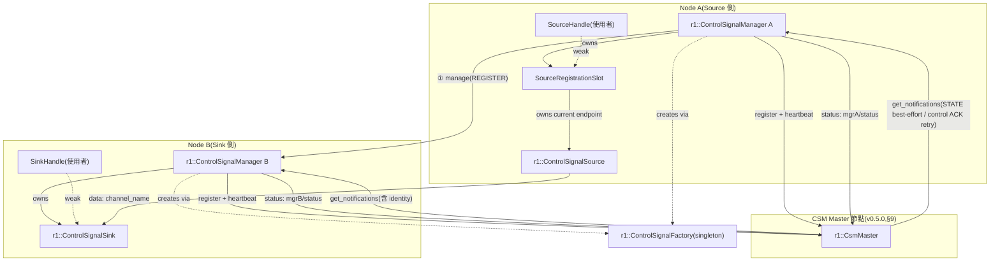
```mermaid
graph TB
    subgraph NodeA["Node A(Source 側)"]
        MA["r1::ControlSignalManager A"]
        SLOT["SourceRegistrationSlot"]
        SRC["r1::ControlSignalSource"]
        HA["SourceHandle(使用者)"]
        MA -->|owns| SLOT
        SLOT -->|owns current endpoint| SRC
        HA -.weak.-> SLOT
    end
    subgraph NodeB["Node B(Sink 側)"]
        MB["r1::ControlSignalManager B"]
        SNK["r1::ControlSignalSink"]
        HB["SinkHandle(使用者)"]
        MB -->|owns| SNK
        HB -.weak.-> SNK
    end
    MA -->|"① manage(REGISTER)"| MB
    SRC -->|"data: channel_name"| SNK
    subgraph Master["CSM Master 節點(v0.5.0,§9)"]
        CM["r1::CsmMaster"]
    end
    MA -->|"register + heartbeat"| CM
    MB -->|"register + heartbeat"| CM
    MA -->|"status: mgrA/status"| CM
    MB -->|"status: mgrB/status"| CM
    CM -->|"get_notifications(STATE best-effort / control ACK retry)"| MA
    CM -->|"get_notifications(含 identity)"| MB
    F["r1::ControlSignalFactory(singleton)"]
    MA -.creates via.-> F
    MB -.creates via.-> F
```

- 自 v0.5.0 起,**CSM 之間不互訂 status**；status 的唯一訂閱者為 CSM Master。CSM 之間僅存的直接通訊,只剩註冊協定(`control_signal_manage`,§2.4)與資料通道本身。

### 2.3 狀態機(4 態)

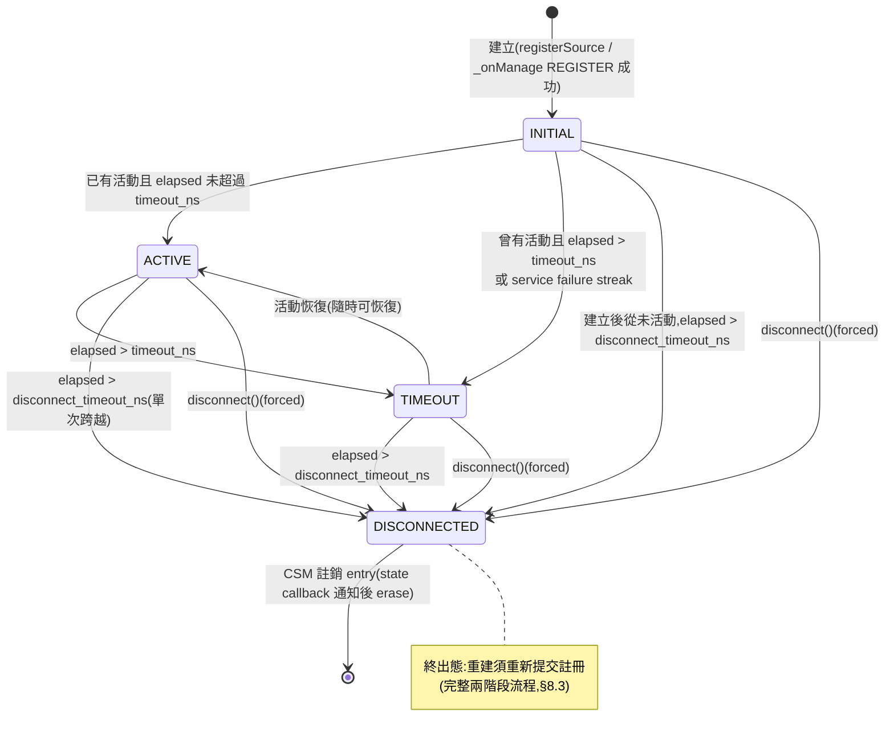
```mermaid
stateDiagram-v2
    [*] --> INITIAL : 建立(registerSource / _onManage REGISTER 成功)
    INITIAL --> ACTIVE : 已有活動且 elapsed 未超過 timeout_ns
    INITIAL --> TIMEOUT : 曾有活動且 elapsed > timeout_ns<br/>或 service failure streak
    ACTIVE --> TIMEOUT : elapsed > timeout_ns
    TIMEOUT --> ACTIVE : 活動恢復(隨時可恢復)
    TIMEOUT --> DISCONNECTED : elapsed > disconnect_timeout_ns
    ACTIVE --> DISCONNECTED : elapsed > disconnect_timeout_ns(單次跨越)
    INITIAL --> DISCONNECTED : 建立後從未活動,elapsed > disconnect_timeout_ns
    INITIAL --> DISCONNECTED : disconnect()(forced)
    ACTIVE --> DISCONNECTED : disconnect()(forced)
    TIMEOUT --> DISCONNECTED : disconnect()(forced)
    DISCONNECTED --> [*] : CSM 註銷 entry(state callback 通知後 erase)
    note right of DISCONNECTED
        終出態:重建須重新提交註冊
        (完整兩階段流程,§8.3)
    end note
```

- **狀態自驅**(v1.1.0):每個 entity 的非終態與本地死亡判定,只由**本端可觀測事實**決定。對 topic Source 而言,活動就是 `send()` 呼叫本身；service Source 在此之上再併入 response-health；Sink 的活動則是訊號到達。Source 與 Sink 共用同一套四態與雙閾值,差別在於 service Source 會另外取兩個子判定中的較嚴結果。master 通知降為預警與 entry 生命週期同步,不是 ACTIVE / TIMEOUT 的狀態來源；matching lifecycle command 僅可強制 terminal DISCONNECTED 以完成註銷(§1.3.1/§2.5/§9)。
- LOW_FREQ 狀態已移除。在 rv2 中,這個狀態由 `timeout_ns/2` 寫死推導而來,不影響任何決策,只增加狀態機的複雜度；頻率監控的職責改由實測 rate 承擔(§5/§6)。
- UNKNOWN 於 v0.2.0 改名為 **INITIAL**。這個狀態代表物件建構後、首次活動前的階段,其意義是我們**確知**的,「UNKNOWN」一名並不符合實情。rv2 另有雙重語意的問題:`getSourceState()` 查無 entry 時也回傳 UNKNOWN,與初始態混淆。r1 將兩者拆開——enum 使用 INITIAL,查詢 API 則以 `std::optional` 表達,nullopt 即代表查無(§8.2)。
- **雙獨立閾值 timeout**(v0.5.0,my_note Timeout Mechanism):以同一個 `elapsed = now − lastActivity` 比對兩個閾值。`elapsed > timeout_ns` 時判為 TIMEOUT(data-rate timeout)；`elapsed > disconnect_timeout_ns` 時判為 DISCONNECTED(disconnect timeout,優先判定)。兩個閾值皆支援 **`0` = 停用**(變體見 §2.3.1)；兩者皆啟用時,仍要求 `disconnect > timeout`(§3.2)。整個判定在 CSM tick 呼叫的 `calcState()` 內完成(§4.4)。
- **TIMEOUT = 可恢復緩衝區間**(v1.1.0):只要活動恢復即回到 ACTIVE,期間 entry 全程保留,沒有任何成本。不穩定的連線在 ACTIVE/TIMEOUT 之間震盪時就地被吸收,不觸發 add/remove。`disconnect_timeout_ns` 則是「確認死亡」的長閾值,建議設為 `timeout_ns` 的 5–10 倍以上(§3.1)。
- **DISCONNECTED = 終出態**(v1.1.0):一旦判定成立,隨即進入註銷流程——state callback 觸發後,CSM 在同一個 tick 內完成 shutdown + erase(§8.3)。之後若要重建,必須重新提交註冊,走完整的兩階段流程,由 retry 狀態機或 App 發起。本地 timeout 判定會先以 activity generation 執行 terminal seal:若計算完成後發現已有新活動,seal 失敗,本輪註銷隨之取消,避免誤刪仍然活躍的 endpoint；seal 成功後,新到的活動會被拒絕,其線性化點即為「確認死亡」成立的時點(§4.2/§8.3)。判定與 endpoint 移除之間存在短暫的可觀測窗口。遠端失效觸發 retry 時,SourceHandle 維持 logical intent 有效；其餘的移除情況,依 §10.3 的 slot 生命週期處理。
- **從未活動的 INITIAL 不轉 TIMEOUT**(v1.1.0):generation = 0 時不存在「中斷」的語意,唯一的自動出路是 disconnect 閾值的確認死亡；至於未完成註冊握手的情況,則由 PENDING TTL(§2.4)先行回收。反之,若已有活動、只是第一次 tick 來得較晚,純計算可以依 elapsed 直接從 INITIAL 得到 TIMEOUT；service 首次 send 已形成 failure streak 時,亦可走這條轉移邊。
- **狀態推進時機**(v1.1.0,D8):所有轉移都由 CSM tick 執行,維持單寫者(§4/§8.3)。活動事件在 hot path 上只做記錄,狀態要到下一個 tick 才更新；因此狀態粒度即為 `statusIntervalMs`,相關取捨見 §4.2。
- 關於「forced disconnect」:v1.1.0 起,`disconnect()` 的語意改為**強制進入註銷流程**——CSM 寫入 DISCONNECTED 並執行註銷。此機制與閾值機制並存,所有變體都保留這條轉移邊；使用者層 API 是否開放,見 §12 #5。
- **FSM #3 歷史註記**:my_note FSM #3(v0.3.0 採納的 DISCONNECTED → INITIAL 重連)原始動機在於避免不穩定連線頻繁 add/remove。自 v1.1.0 起,這項需求改由 TIMEOUT 可恢復區間承擔——只有超過長閾值的確認死亡才付出 add/remove 成本,DISCONNECTED 因此回歸「確認死亡 → 註銷」的語意。

#### 2.3.1 Timeout 停用之 FSM 變體(v0.5.0,my_note Timeout #3)

兩個閾值各自可設為 `0` 表示停用,因此共有四種組態。無論哪一種變體,`disconnect()`(forced)與註銷出口都予以保留。

**變體 A — 兩者啟用**(`timeout_ns > 0, disconnect_timeout_ns > 0`):即上圖的完整狀態機。

**變體 B — disconnect 停用**(`timeout_ns > 0, disconnect_timeout_ns = 0`):
此組態下沒有自動的 DISCONNECTED。最深的自動狀態為 TIMEOUT,可以無限期停留,活動恢復時隨時回到 ACTIVE；只有 forced `disconnect()` 會進入註銷。從未活動的 entity 則停留在 INITIAL。

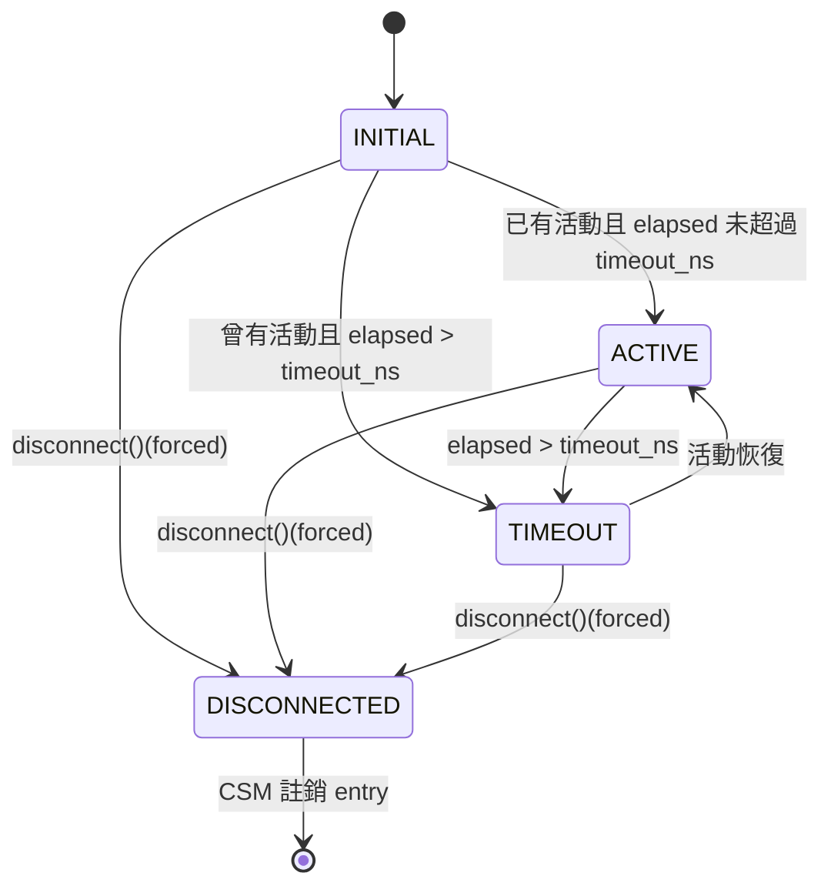
```mermaid
stateDiagram-v2
    [*] --> INITIAL
    INITIAL --> ACTIVE : 已有活動且 elapsed 未超過 timeout_ns
    INITIAL --> TIMEOUT : 曾有活動且 elapsed > timeout_ns
    ACTIVE --> TIMEOUT : elapsed > timeout_ns
    TIMEOUT --> ACTIVE : 活動恢復
    INITIAL --> DISCONNECTED : disconnect()(forced)
    ACTIVE --> DISCONNECTED : disconnect()(forced)
    TIMEOUT --> DISCONNECTED : disconnect()(forced)
    DISCONNECTED --> [*] : CSM 註銷 entry
```

**變體 C — data-rate timeout 停用**(`timeout_ns = 0, disconnect_timeout_ns > 0`):
TIMEOUT 態不可達；elapsed 一旦超過 disconnect 閾值,直接判定死亡並註銷。此組態適合「只要最終斷線判定、不需中間警示」的通道。

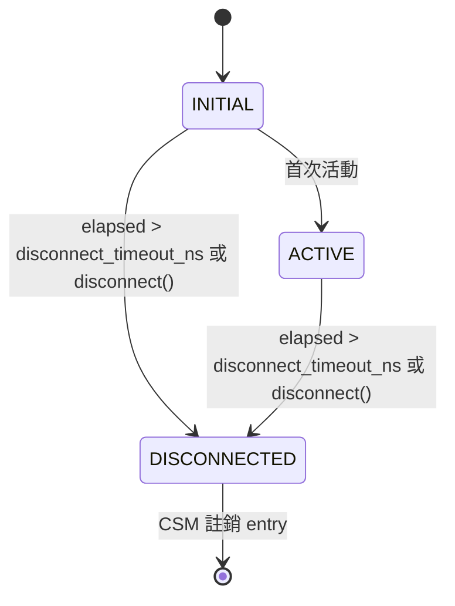
```mermaid
stateDiagram-v2
    [*] --> INITIAL
    INITIAL --> ACTIVE : 首次活動
    INITIAL --> DISCONNECTED : elapsed > disconnect_timeout_ns 或 disconnect()
    ACTIVE --> DISCONNECTED : elapsed > disconnect_timeout_ns 或 disconnect()
    DISCONNECTED --> [*] : CSM 註銷 entry
```

**變體 D — 兩者停用**(`timeout_ns = 0, disconnect_timeout_ns = 0`):
不存在任何自動逾時；只有 forced `disconnect()` 能離開 INITIAL/ACTIVE。這種組態適合離散事件型通道,例如單次事件型指令。

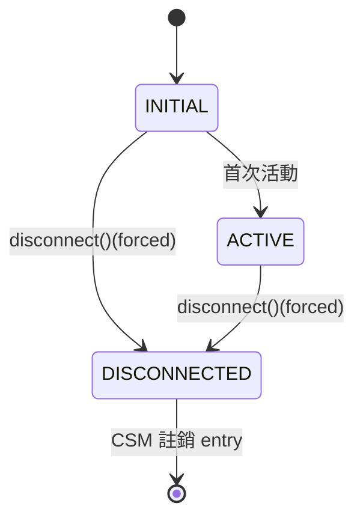
```mermaid
stateDiagram-v2
    [*] --> INITIAL
    INITIAL --> ACTIVE : 首次活動
    INITIAL --> DISCONNECTED : disconnect()(forced)
    ACTIVE --> DISCONNECTED : disconnect()(forced)
    DISCONNECTED --> [*] : CSM 註銷 entry
```

實作註記:四個變體共用同一個 `calcState(now, timeoutNs, disconnectNs)`(§4.4)——閾值為 0 時即跳過該項比對,實作上**不是**四份狀態機；上述變體圖只是同一參數化行為的可視化。單元測試會逐變體驗證(§4.5)。

### 2.4 註冊協定(兩階段 + rollback)

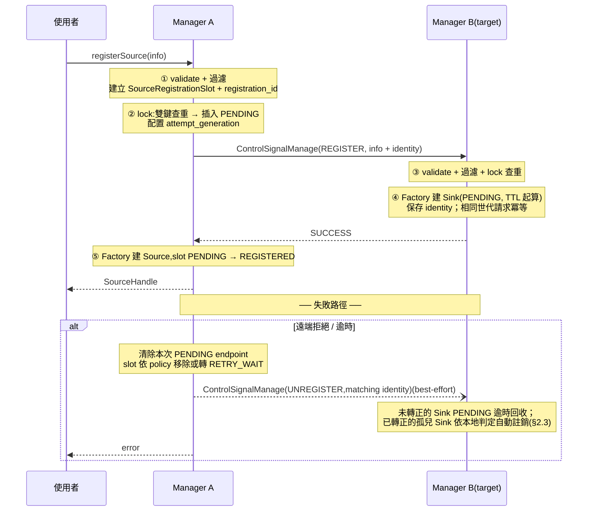
```mermaid
sequenceDiagram
    participant U as 使用者
    participant MA as Manager A
    participant MB as Manager B(target)

    U->>MA: registerSource(info)
    Note over MA: ① validate + 過濾<br/>建立 SourceRegistrationSlot + registration_id
    Note over MA: ② lock:雙鍵查重 → 插入 PENDING<br/>配置 attempt_generation
    MA->>MB: ControlSignalManage(REGISTER, info + identity)
    Note over MB: ③ validate + 過濾 + lock 查重
    Note over MB: ④ Factory 建 Sink(PENDING, TTL 起算)<br/>保存 identity；相同世代請求冪等
    MB-->>MA: SUCCESS
    Note over MA: ⑤ Factory 建 Source,slot PENDING → REGISTERED
    MA-->>U: SourceHandle

    Note over MA,MB: ── 失敗路徑 ──
    alt 遠端拒絕 / 逾時
        Note over MA: 清除本次 PENDING endpoint<br/>slot 依 policy 移除或轉 RETRY_WAIT
        MA--)MB: ControlSignalManage(UNREGISTER,matching identity)(best-effort)
        Note over MB: 未轉正的 Sink PENDING 逾時回收；<br/>已轉正的孤兒 Sink 依本地判定自動註銷(§2.3)
        MA-->>U: error
    end
```

- **佔位(PENDING)** 在持鎖下完成雙鍵(controller_name + channel_name)的查重與插入,藉此消除 rv2 的 TOCTOU；之後的遠端等待階段不持鎖。
- 逾時屬於「結果不明」的情況,因此同時採取三重保險:本地回收、best-effort UNREGISTER,以及依賴遠端的 TTL。
- 每個 logical intent 配置一個穩定的 `registration_id`；每次 REGISTER attempt 遞增 `attempt_generation`,並攜帶 Source CSM 的 `csm_instance_id`。以同一 identity 重送 REGISTER 必須冪等；不同 identity 與既有同名 entry 衝突時,則回覆可分類的拒絕碼。UNREGISTER 與所有生命週期通知只作用於完全相符的 identity；延遲抵達的控制訊息不得移除新世代(§2.5.2)。
- PENDING 交易同樣納入 ManagerStatus snapshot。master 對帳時,只要看到任一側存在同 identity 的 PENDING,就暫停該配對的 missing grace,避免在註冊 service 尚在等待 response 的階段誤判孤兒。
- **註冊失敗的重試**(v1.1.0,D3/D7):收到 typed `RETRYABLE_CONFLICT` 時,依 D3 必須進入 `RETRY_WAIT`,並持續至舊 entry 終出後成功；至於初次目標不可達或結果不明時是否保留 intent,則由 D7 policy 決定。tick 只排程**非阻塞**的 attempt；service response callback **僅將結果寫入 completion queue**,狀態轉移一律由下一個 tick 的 phase 5 提交,形成單一 commit point(§2.6/§8.3),因此不得在 timer callback 內同步呼叫 `registerSource()`。當對側舊 entry 經由本地 DISCONNECTED、CSM 死亡通知或 level-triggered 對帳被移除後,新世代的 retry 自然成功；過程中不沿用任何 TIMEOUT entry(D3)。數值型 backoff、jitter 與 optional initial retry 上限等 D7 參數仍列於 §12；D3 conflict 與已建立 intent 的 remote-failure retry 本身,不受 attempt 次數上限截斷。
- `unregisterSource(handle)` 的流程:在 slot lock 下先將 `desired=false`,原子地取消 logical intent 與 in-flight retry,因此既有 Handle 立即 `valid()==false`。若當下存在 endpoint,只排入 EXPLICIT_UNREGISTER removal command,由下一個 tick 依單寫者順序執行 callback → shutdown → erase；若本來就處於 RETRY_WAIT / PENDING 且沒有 endpoint,則可在 identity re-check 之後直接 erase slot。對最後一個可能存在於遠端的 attempt,發出 matching-generation 的 UNREGISTER；延遲抵達的 response 因 desired / generation 不符,不得復活已取消的 intent。

### 2.5 Liveness 協定(v1.1.0 改版:雙側自驅 + master 預警/對帳)

v0.3.0 的「CSM 互訂 status」與 v0.4.0 的「點對點 NOTIFY_ABNORMAL」,在多 CSM 拓撲下的連線數與通知路徑會隨 CSM 數量以 O(N²) 成長。v0.5.0 因此改為集中式設計,由 master 擔任 status 的唯一訂閱者。v1.1.0 進一步把**狀態來源收斂到本端**,master 只剩下預警與生命週期同步的職責:

- 每個 CSM 啟動時向 **CSM Master** 註冊(`/csm_master/register`；自 v1.1.0 起,request 攜帶 `csm_timeout_ns` 與 `csm_disconnect_timeout_ns`,D6,§2.5.2)。之後每個 status tick 呼叫 `/csm_master/heartbeat`,CSM 藉由 response 確認 master 在線；收到 STALE_INSTANCE / UNKNOWN_CSM 時觸發 re-register。master 端只以 matching instance 的請求更新 CSM 活性。
- CSM 照常發布 `<name>/status`(§2.5.1)。這個 topic 的**唯一訂閱者為 master**,CSM 之間互不訂閱。
- **非終態一律由本端活動自驅**(v1.1.0):master 通知不再注入 ACTIVE / TIMEOUT。matching 的 DISCONNECTED / PAIR_MISSING 只提出 terminal lifecycle command,由 CSM tick 驗證世代之後,才強制 DISCONNECTED 並註銷。

| 對象 | 活動來源 | 判定 |
|---|---|---|
| Source(topic) | `send()` 呼叫本身(hot path 記錄,§5.3) | 自身 elapsed 雙閾值,CSM tick 內判定(§2.3)；純本端、自驅 |
| Source(service) | `send()` 呼叫 + response outcome；任一 response(含 REJECTED)證明 transport 活動,service-not-ready / response timeout 開始失敗 streak | send-cadence 與 response-health 子判定取較嚴者；失敗 streak 立即 TIMEOUT,持續越過 disconnect 閾值則 DISCONNECTED(§5.3) |
| Sink | 訊號到達(`_store()` 記錄,§6.3) | 自身 elapsed 雙閾值,CSM tick 內判定(§2.3) |
| CSM 整體 | 對 master 的 heartbeat | master 以獨立 **CSM 級雙閾值** polling(D6,§9.3):elapsed 超過 `csm_timeout_ns` → CSM health = TIMEOUT,對配對方發 peer-health 預警(不改 entity state)；超過 `csm_disconnect_timeout_ns` → CSM health = DISCONNECTED,通知配對方註銷並觸發 retry |

- master 的通知共有四種 kind,分屬「觀測、peer-health 預警、生命週期同步」三類語意；接收端的處理見 §8.3 `_onGetNotifications`:
  1. **STATE**——entity 級的狀態變化,僅供觀測:經由 notification callback 告知 App(例如通道劣化時,對側 Sink 的 TIMEOUT/DISCONNECTED),不改本地狀態。
  2. **CSM_TIMEOUT 預警**——對側 CSM 的 heartbeat 中斷(D1):本地 entry 的 `peerHealth` 記為 TIMEOUT 並通知 App,但**不寫入 `ControlSignalState`**；heartbeat 恢復時以 ACTIVE 解除。這是 §1.3.1 分層之後,對 D1 的明確解讀。
  3. **DISCONNECTED 註銷**——對側已確認死亡,本地隨之註銷配對的 entity；Source 側一併加入 retry 佇列(D2)。
  4. **配對缺失**——來自對帳的結果(§0.1),處理方式與註銷相同。
- **對帳為必要元件**(v1.1.0,原 §12 #3 結案):master 在每輪 status 中檢查配對完整性,entry 單側存在超過寬限期時,發出配對缺失通知(§9.3)。對帳與 CSM 級雙閾值互補——雙閾值處理「慢死亡」,即失聯足夠久的情況；對帳處理「快重啟」:CSM 在 `csm_disconnect_timeout_ns` 內被 supervisor 拉起,heartbeat 未斷,但註冊資料已經遺失,此時對側 Source 持續 send、資料落空而無從自行察覺,唯一的偵測者就是對帳。
- 當任一側 entity 進入 DISCONNECTED 時,跨側的註銷同步流程如下(取代 v0.3.0–v1.0.1 的休眠重連):

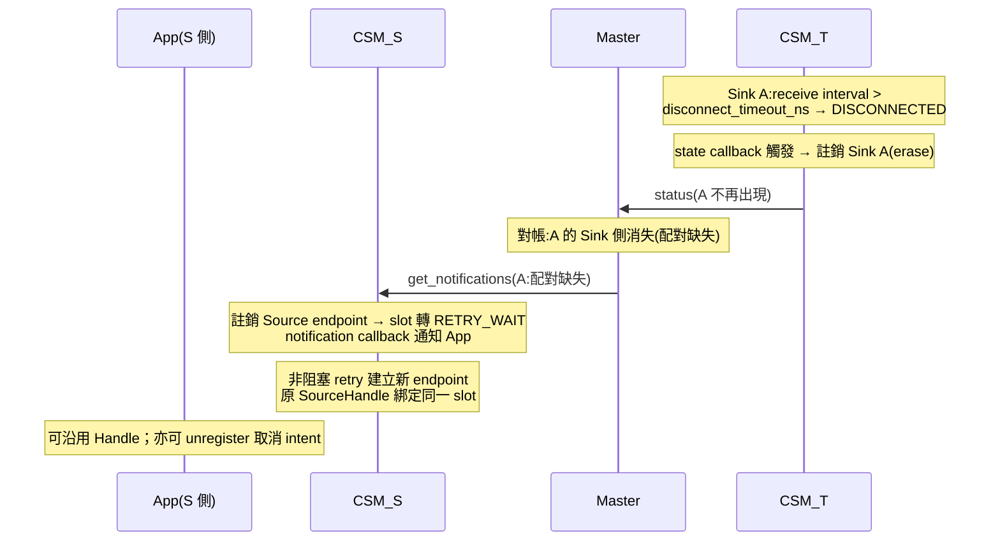
```mermaid
sequenceDiagram
    participant AppS as App(S 側)
    participant S as CSM_S
    participant M as Master
    participant T as CSM_T

    Note over T: Sink A:receive interval ><br/>disconnect_timeout_ns → DISCONNECTED
    Note over T: state callback 觸發 → 註銷 Sink A(erase)
    T->>M: status(A 不再出現)
    Note over M: 對帳:A 的 Sink 側消失(配對缺失)
    M->>S: get_notifications(A:配對缺失)
    Note over S: 註銷 Source endpoint → slot 轉 RETRY_WAIT<br/>notification callback 通知 App
    Note over S: 非阻塞 retry 建立新 endpoint<br/>原 SourceHandle 綁定同一 slot
    Note over AppS: 可沿用 Handle；亦可 unregister 取消 intent
```

- 在可靠通知與 level-triggered 對帳持續運作的前提下,兩側的 endpoint map 最終一致,不會留下孤兒,也不會留下殭屍(§0.1)。對側的註銷屬於 **entry 生命週期同步**,不是狀態注入——本地狀態機仍然只由本地事實驅動。
- 重建的觸發由 CSM 內建的 retry 機制負責(D4,§8.3)。Source registration slot 跨 retry 保留,成功後原 Handle 自動轉接到新的 endpoint。App 透過帶有 kind / result / attemptGeneration / reason 的 notification callback 得知每次的結果,並可隨時以 unregister 取消。
- **Master 失聯(degraded mode,§0.1)**:由於兩側狀態皆為自驅,master 失聯對 **entity 狀態零影響**；暫停的只有 master-mediated 的預警、生命週期通知與對帳,CSM 之間的 matching-generation best-effort UNREGISTER 仍可運作。此期間可能出現單側已註銷、對側尚未同步的窗口:對側 entity 依自身 elapsed 可能自行走到 DISCONNECTED；但若對側仍有本地活動,或其 disconnect 判定已停用,這種不一致可以持續到 master 回線為止,因此不承諾固定窗口。master 回線後由對帳補收(D5),流程為:heartbeat 回 UNKNOWN_CSM → re-register → 等待各 CSM 的完整 snapshot ready → 建立 edge 基準(不觸發 STATE 通知風暴)→ 立即執行 level reconciliation,生命週期事件重送至 ACK 或條件消失為止。

#### 2.5.1 ManagerStatus 訊息(my_note #4,新設計)

`r1_interfaces/msg/ManagerStatus.msg` 取代 v0.2.0 的空 ManagerHeartbeat,定義如下:

```
# 每 status_interval 發布於 <manager_name>/status
string manager_name
string csm_instance_id            # 本次 process incarnation(UUID)
uint64 snapshot_seq               # 此 incarnation 內嚴格遞增
bool snapshot_ready               # 啟動資料建置完成；false 時 master 不執行對帳
builtin_interfaces/Time stamp
r1/EntryStatus[] sources          # 完整 snapshot,含 PENDING/REGISTERED/RETRY_WAIT
r1/EntryStatus[] sinks            # 完整 snapshot,含 PENDING/REGISTERED
```

`r1_interfaces/msg/EntryStatus.msg`:

```
string manager_name         # 所屬 CSM(v0.5.0;master 配對與通知定位用)
string csm_instance_id      # 所屬 CSM incarnation
string source_manager_name  # logical pair 的 Source CSM；Sink 由 REGISTER request 保存
string source_csm_instance_id # RegistrationIdentity 第一分量(v1.2.1):Source 填自身
                            #  csm_instance_id;Sink 由保存的 REGISTER request identity 填。
                            #  使 status / CsmNotify 皆可攜帶完整 identity 三元組,
                            #  master 的全欄位比較(§9.1/§9.2)方可實作
string target_manager_name  # logical pair 的目標 CSM；Source 取自 ControlSignalInfo
string registration_id     # logical registration intent UUID
uint64 attempt_generation   # 此 intent 的註冊世代
string controller_name
string channel_name
string type                 # factory 型別鍵
string mode                 # topic / service
bool   is_source            # v0.5.0:master 配對方向判別
int8   registration_phase   # PENDING / REGISTERED / RETRY_WAIT(常數；Sink 無 RETRY_WAIT)
bool   endpoint_present     # 僅實體 endpoint 存在時 true；RETRY_WAIT Source 為 false
int8   state                # 0=INITIAL 1=ACTIVE 2=TIMEOUT 3=DISCONNECTED(常數；終出 tombstone 用)
float32 data_rate_hz        # 實測速率:Sink = 收訊率(§6);Source = send 呼叫率(§5,v0.4.0)
int8   priority
```

- 每一筆 `ManagerStatus` 都是該 CSM 的**完整 snapshot**,不是增量。master 僅接受屬於目前 `csm_instance_id`、且 `snapshot_seq` 大於已套用序號的訊息,並以整份內容原子地替換快取；前一輪存在、本輪缺席的 entry,一律視為已移除。這份契約是快速重啟與對帳正確性的必要條件。
- `snapshot_ready` 只在 Manager 尚未完成 services / maps 初始化、也尚未產出第一輪一致 snapshot 之前為 false；自同一 incarnation 的第一個完整 tick 起設為 true,且不可退回 false。App 之後發起的正常註冊由 PENDING phase 保護,不得以長期的 `snapshot_ready=false` 無限抑制對帳。新的 incarnation 則重新由 false 起算。
- 只有在兩側皆為 `registration_phase = REGISTERED`、`endpoint_present = true`,且 identity 相符時,才構成有效配對。matching 的 PENDING 表示交易仍在進行中,此時暫停 missing grace；RETRY_WAIT 則只是 Source 的 intent,並不是 endpoint——若對側仍有 REGISTERED 的 Sink,master 應視為 Sink-only orphan 並要求移除,不能因為 RETRY_WAIT 而永久抑制對帳。
- live 的 ManagerStatus 通常不含 `state = DISCONNECTED`,因為 terminal callback / shutdown / erase 都在 publish 之前完成。對於「前輪 REGISTERED、本輪缺席」的 entry,master 保留 identity tombstone,並可合成 STATE(DISCONNECTED)觀測事件；至於是否要求另一側移除,則由 CSM health 或 level reconciliation 決定,不能把 omission 直接當成不驗證世代的註銷命令。
- 在接收端,master 把這些訊息用於 CSM 活性佐證、配對表更新、狀態變化偵測與對帳(§9)。
- 頻寬方面,entry 數量大時可以調升 `statusIntervalMs`(Manager 參數)；訊息內容為輕量 metadata,在 200ms × 數十 entries 的規模下無虞。
- `control_signal_info_req` service 予以保留,作為 pull 式的完整 Info 查詢；相對地,status 是 push 式的輕量摘要。
- **狀態計算與推進**(v1.1.0,D8):status tick 對每個 entity 呼叫其非公開的 `_calcStatus()`(friend,純計算,§5/§6),流程為:實測 rate + 雙閾值判定 → 得到 `{state, rateHz}` → 記入 **CSM 自身 table**(即 `entry.lastStatus`,組裝 ManagerStatus 時直接取用)→ 由 `_applyStatus()` 寫回 entity,old ≠ new 時於 tick 執行緒 fire state callback。若判定為 DISCONNECTED,一併觸發 activity-generation seal 與註銷流程(§4.2/§8.3)。`_calcStatus()` 的「純」,指的是不改動 liveness / cache / registration lifecycle；RateRecorder 的 bucket 旋轉只由 hot-path 的 `record()` 負責,`calcHz()` 則是 read-only snapshot。
- 異常偵測與通知的職責自 v0.5.0 起**上移至 master**:CSM 只發 status,變化比對、配對與通知排程全部在 master 執行(§9)。傳遞可靠度上,STATE edge 可採 best-effort；peer-health / lifecycle control event 則以 event ID + ACK 可靠傳遞；CSM 端被動接收 `get_notifications`。

#### 2.5.2 服務介面欄位定義(v1.0.0)

`srv/r1/ControlSignalManage.srv`:

```
int8 op                          # 0 = REGISTER, 1 = UNREGISTER(常數定義於 srv)
string source_manager_name       # 發起方 Manager 名
string source_csm_instance_id    # 發起方本次 process incarnation
string registration_id          # logical registration intent UUID
uint64 attempt_generation        # REGISTER attempt 世代;UNREGISTER 必須完全相符
r1/ControlSignalInfo info        # REGISTER:完整描述子;UNREGISTER:僅需 controller_name 有效
---
int8 response                    # SUCCESS / RETRYABLE_CONFLICT / TEMPORARY_UNAVAILABLE /
                                 # PERMANENT_REJECTION / ALREADY_APPLIED / STALE / ERROR
string reason                    # 失敗原因;成功時為空
```

`srv/r1/ControlSignalInfoReq.srv`:

```
---
int8 response
r1/ControlSignalInfo[] source_list
r1/ControlSignalInfo[] sink_list
```

`srv/r1/CsmRegister.srv`:

```
string csm_name
string csm_instance_id            # 每次 Manager process 啟動產生的新 UUID
int64 csm_timeout_ns             # D6:heartbeat 中斷超過此值,master 對配對方發 TIMEOUT 預警;0 = 停用
int64 csm_disconnect_timeout_ns  # D6:超過此值視為 CSM 死亡,通知配對方註銷;0 = 停用;建議遠大於 csm_timeout_ns
int64 status_interval_ns         # master 計算 snapshot readiness / 對帳寬限期的輸入
int64 registration_grace_ns      # 此 CSM 允許的最長同步註冊等待 + status 傳播餘裕
---
int8 response                    # SUCCESS / STALE_INSTANCE / INVALID_CONFIG
string reason
```

`srv/r1/CsmHeartbeat.srv`:

```
string csm_name                  # master 以此定位 CsmRecord(Trigger 無法攜帶身分,故自訂)
string csm_instance_id           # 舊 incarnation heartbeat 不得更新新 record
---
int8 response                    # SUCCESS / STALE_INSTANCE / UNKNOWN_CSM(常數)
string reason                    # 診斷；STALE/UNKNOWN 時 CSM 應重新 register
```

`srv/r1/CsmNotify.srv`:

```
int8 kind                        # 0 = STATE:entity 級狀態變化(觀測用,不改本地狀態)
                                 # 1 = CSM_TIMEOUT:peer-health 預警/解除(D1,不改 local state)
                                 # 2 = DISCONNECTED:註銷指示(對側已確認死亡)
                                 # 3 = PAIR_MISSING:配對缺失(對帳,同註銷處理)
int8 peer_csm_health             # kind=CSM_TIMEOUT 時有效:ACTIVE / TIMEOUT；其餘忽略
string event_id                  # master 配置的冪等事件 UUID
string target_csm_instance_id    # 僅此接收端 incarnation 可套用
r1/EntryStatus[] entries         # 涉及的 entries;EntryStatus.manager_name 標示歸屬
---
int8 response                    # APPLIED / ALREADY_APPLIED / STALE / REJECTED(常數)
string reason
```

`ControlSignalManage.srv` 的 request 另外加入 `source_csm_instance_id`、`registration_id` 與 `attempt_generation`；UNREGISTER 必須對其完整比對。response code 以 typed code 區分 retryable conflict / temporary unavailable 與 permanent rejection,避免對不可修復的驗證或授權錯誤無限重試；`reason` 欄位只供診斷之用。上述欄位屬於 control-plane identity,因此不加入通用的 `ControlSignalInfo.msg` 八欄資料描述子。`RETRYABLE_CONFLICT` 僅用於 identity 不同、但可能隨舊 endpoint 終出而消失的同名衝突；驗證、filter、type/mode 不相容的情況則一律回 `PERMANENT_REJECTION`,使 retry 狀態機不需要解析自由文字的 `reason`。至於未分類的 `ERROR`,預設停止自動重試並通知 App,不得猜測其為 transient。

`CsmRegister` 的雙閾值驗證與 entity 層的規則同構:數值不得為負；兩者皆大於 0 時,必須滿足 `csm_disconnect_timeout_ns > csm_timeout_ns`；非零值至少要涵蓋數個 heartbeat / master tick 週期。CSM 端另須滿足 `HeartbeatAttempt.deadlineNs` 對應時長 < `csm_timeout_ns / 2`(v1.2.1)。原因在於單筆 in-flight heartbeat 在逾 deadline 之前不釋放 slot(§8.3 phase 4)；若 deadline 不受此約束,一筆遲滯的 attempt 就可以佔用整個 timeout 窗,使 master 誤判失聯。Manager 在向 master 註冊時驗證這層關係,不符即拒絕啟動,視為組態錯誤。閾值設為 0 表示停用該層判定；不過若 disconnect 判定停用,永久 CSM crash 的自動回收只能依賴其他可用的終止來源,不保證在有限時間內收斂。此外要求 `status_interval_ns > 0`、`registration_grace_ns >= 2 × status_interval_ns`；後者亦不得小於該 CSM 允許的最大同步 registration wait 加上兩個 status 週期。

### 2.6 執行緒模型

- 本庫**不建立任何執行緒**,此原則承襲自 rv2；所有工作皆依附於 node executor。
- **Manager 單一 timer**(v0.3.0):以 status tick 這一個 timer 完成全部的週期性工作,包括狀態計算與推進(D8 鏈,§8.3)、發布 ManagerStatus、master heartbeat、註銷流程、retry 佇列處理與 PENDING TTL 回收。此設計取代 v0.2.0 的 statusTimer + heartbeatTimer 雙 timer；endpoint 本身依然零 timer。
- **Callback group 策略**:
  - Manager 的 service servers(manage / info_req / get_notifications)、master clients(register / heartbeat)與 retry response callback,一律放入 Manager 自建的 **Reentrant group**,與使用者 node 的預設 group 隔離。
  - status timer 獨立放入 **MutuallyExclusive tick group**；另外以 `tickRunning_` 作為冪等 guard,防範 executor 或測試手動觸發造成的重入。Reentrant management group 本身不提供單寫者保證,因此不得把 timer 放入該 group。
  - Source/Sink 的資料 pub/sub/service 使用預設 group,維持與使用者 callback 相同的互斥行為,符合 rclcpp 的預設慣例。
- **狀態推進與 state callback 單一執行緒**(v1.1.0,D8):所有狀態寫入與 state callback 都發生在 status tick(`tickGroup_`)。來源不是 tick 的狀態變更請求,例如 master 的註銷指示與 forced disconnect,一律先轉為 table 註記,再由下一個 tick 統一執行,以維持嚴格的單寫者(§8.3)。
- tick 內不執行任何阻塞式的 service wait。retry tick 只建立 bounded async attempt；response callback 把結果排入 completion queue,由下一個 tick 提交 registration lifecycle,因此不違反「callback 內禁止同步 registerSource」的規則。
- 以下為文件化的硬規則,並輔以 debug assert:
  - `registerSource()` / `unregisterSource()` **禁止**在任何 ROS callback 內呼叫；呼叫當下,node 必須已經由另一條 executor thread 持續 spin,以處理 client response。在啟動 executor 之前呼叫屬於 precondition violation,不得包裝成一般的 remote timeout。
  - service 模式的 `send()` 為阻塞呼叫,同樣只允許在 non-callback 的 application thread 使用,且至少要有一條 executor thread 正在服務該 node。
- Manager 的掃描 timer 在鎖內完成 snapshot 之後才 log,不存在鎖外的 map 存取。

---
## 3. `r1::ControlSignalInfo` 與驗證

### 3.1 訊息欄位(8 欄)

訊息定義檔為 `r1_interfaces/msg/ControlSignalInfo.msg`,各欄位說明如下:

| 欄位 | 型別 | 說明 |
|---|---|---|
| `controller_name` | string | **必填、主鍵**。必須全系統唯一,同時作為 Manager 內部 map 的鍵與黑白名單的鍵 |
| `channel_name` | string | **必填、唯一**。即資料 topic / service 的名稱 |
| `target_manager_name` | string | 註冊時必填,指明 Sink 所在的 Manager 名稱 |
| `mode` | string | 取值為 `"topic"` 或 `"service"`,常數定義於 msg |
| `type` | string | Factory 使用的型別鍵,如 `"joy"`、`"twist"`、`"string"` 等 |
| `priority` | int8 | **通用欄位,0–100**:0 = invalid,於註冊時拒絕；100 為最高優先,數值愈大優先權愈高。本欄位僅隨訊息攜帶轉發,**不影響傳輸行為**,語意由上層消費者自行定義(v0.7.0 起不再綁定特定系統的頻帶約定) |
| `timeout_ns` | int64 | data-rate timeout 閾值；**0 = 停用**(v0.5.0,§2.3.1)。service 模式下同時作為 response 等待上限,因此設為 0 時 service 模式會拒絕註冊(見 §3.2 規則 5) |
| `disconnect_timeout_ns` | int64 | disconnect timeout 閾值,超過即確認死亡並註銷(§2.3)；**0 = 停用**,即永不自動轉入 DISCONNECTED(§2.3.1 變體 B)。兩者皆 > 0 時本值須 > `timeout_ns`(§3.2 規則 5),建議取 `timeout_ns` 的 5–10 倍以上,讓只有長期死亡的情況才需付出註銷與重建成本 |

相對 rv2,以下欄位已刪除。`send_freq_hz` 從未驅動過狀態機；`use_keep_alive` 與 `keep_alive_interval_ns` 改為 Manager 參數；`controller_priority_type` 所涉及的類別上限屬於約定性質,因此降為文件層的說明。

### 3.2 驗證規則(6 條)

驗證入口為 `validateControlSignalInfo(info)`,回傳 `{bool valid; std::string error;}`。規則共六條:

1. `controller_name` 不得為空。
2. `channel_name` 不得為空。
3. `mode` 必須是 topic 或 service 之一,且 `type` 不得為空。
4. `priority` 必須落在 [1, 100] 區間內；0 視為 invalid,負值與大於 100 的值一律拒絕。
5. `timeout_ns ≥ 0` 且 `disconnect_timeout_ns ≥ 0`,取 0 表示各自停用(§2.3.1)。兩者皆 > 0 時必須滿足 `disconnect_timeout_ns > timeout_ns`。此外 `mode == service` 時要求 `timeout_ns > 0`,因為 response 等待上限不可停用。
6. `registerSource` 路徑上,`target_manager_name` 不得為空；`_onManage(REGISTER)` 側會另行驗證該值等於本 Manager 的名稱,作為 mis-route 防護。

`disconnect_timeout_ns = 0` 是合法設定,保留了「不由 entity 自動註銷」的語意。但在此設定下,D3 的 retry-until-success 可能需要依靠 master 的 CSM-disconnect / reconciliation,或由呼叫端顯式 unregister,才能清除舊世代；API 應回報此診斷,文件也不得承諾固定的收斂時間。另外,`ManagerOptions` 的 CSM 雙閾值與 retry policy 由其自身另行驗證(§2.5.2/§8.2),不混入 `ControlSignalInfo` 的六條通用驗證規則。

### 3.3 單元測試方法與流程

測試框架採用 gtest。待驗證的函數是**純邏輯、不需 rclcpp init**,msg struct 直接填欄位即可建構測資。

流程上,先由 builder helper `makeR1Info()` 產生一組合法預設值,接著逐條規則做「單欄位破壞」測試:每次只改壞一個欄位,驗證 `valid == false` 且 `error` 指名該欄位。最後以全合法的組合驗證 `valid == true`。

案例表:

| 案例 | 修改 | 預期 |
|---|---|---|
| V1 | 全預設 | valid |
| V2 | `controller_name = ""` | invalid,error 含 "controller_name" |
| V3 | `channel_name = ""` | invalid |
| V4 | `mode = "unknown"` | invalid |
| V5 | `priority` ∈ {0, -1, 101, 127} | invalid(4 子案例) |
| V6 | `priority` ∈ {1, 100} | valid(邊界) |
| V7 | `timeout_ns = 0`(topic 模式) | valid(停用,v0.5.0)；`mode = service` 時 invalid |
| V8 | `disconnect_timeout_ns = timeout_ns`(皆 > 0) | invalid(須嚴格大於) |
| V9 | `disconnect_timeout_ns = 0` | valid(停用) |
| V10 | `timeout_ns = 0, disconnect_timeout_ns > 0`(topic) | valid(變體 C) |
| V11 | `target_manager_name = ""`(registerSource 路徑) | invalid |

---

## 4. `r1::LivenessState`

### 4.1 職責

本類封裝活動記錄與 4 態判定邏輯。實作為純 C++、無 ROS 依賴,因此可以完整地進行單元測試。自 v1.1.0(D8)起,職責縮減為三件事:**記錄**,即 hot path 上的原子寫入；**純計算**,依記錄與閾值算出應處狀態,過程不改動任何欄位；**被動接受狀態**,這是唯一的狀態寫入路徑,保留給 CSM tick 專用。狀態推進的決策與執行全部上移至 CSM tick(§8.3),本類不再持有 state+epoch CAS 轉移機制。由於 DISCONNECTED 之後 endpoint 會被立即銷毀,本類另外提供 activity-generation terminal seal,確保終出判定不會刪除計算期間剛恢復活動的 entity；該 CAS 只保護活動接受與 terminal linearization,不寫 state。

### 4.2 設計(單寫者模型,v1.1.0)

活動記錄欄位如下:

- `createdNs_`:建構時間,唯讀。generation = 0 時以此作為 disconnect elapsed 的起點。
- `lastActivityNs_`:atomic 的最後活動時間戳。`recordActivity()` 以 CAS max 更新之,即使多個 writer 交錯呼叫,數值也不得倒退。
- `activityWord_`:atomic 複合字,由 1 bit 的 `sealed` 與 63 bits 的 `generation` 組成。每個被接受的活動都會遞增 generation；一旦 sealed,所有新活動都被拒絕。
- `state_`:以 atomic 方式保存最後一次 `applyState()` 的結果。

並發模型的關鍵在於,狀態的**唯一寫者是 CSM tick**,且 tick 本身是單執行緒序列化的。`applyState()` 只由 CSM 呼叫,沒有並發寫者,因此不需要 CAS。v1.0.1 以 epoch CAS 防範的 stale-TIMEOUT 競態,根源在於「收訊路徑與檢查路徑併發寫狀態」；在單寫者模型下,這個競態於結構上就不存在,該機制整組廢除。

hot path 的 `recordActivity(now)` 先發布 atomic-max 時間戳,再以 release CAS 遞增 generation；tick 端則以 acquire load 取得 snapshot。若 terminal seal 先一步完成,CAS 會失敗並回 false,此時呼叫端不得再操作 transport / message storage。

一般的 INITIAL / ACTIVE / TIMEOUT 計算容許與活動交錯,最壞情況是晚一個 tick 回正；只有 destructive 的 DISCONNECTED 必須呼叫 `trySealActivity(observedGeneration)`。計算之後若有任何活動已被接受,generation 就已改變,seal 必然失敗,本輪註銷隨之取消；反之,seal 一旦成功,其後的活動一律被拒。這個 seal CAS 就是明確的線性化點。

`calcState()` 是 **const 純計算**:讀取 activity snapshot 與閾值後回傳 decision,不寫任何欄位。時間由呼叫端注入(以 `steadyNs()` 參數傳入),因此可以注入假時鐘,行為完全 deterministic。

**取捨(v1.1.0 已接受)**:狀態更新的粒度等於 tick 週期(`statusIntervalMs`,預設 200ms)。首次活動之後,要等到下一個 tick 狀態才會由 INITIAL 轉為 ACTIVE；`read()` 的「僅 ACTIVE 回 true」與 state callback 同樣以 tick 粒度反應。在監控語意下這是可以接受的,而且資料層的即時性不受影響,因為訊息到達本身即為 App 的即時回饋。

### 4.3 類別介面

```cpp
namespace r1 {

enum class ControlSignalState : uint8_t { INITIAL, ACTIVE, TIMEOUT, DISCONNECTED };

struct ActivitySnapshot {
    int64_t  lastActivityNs;
    uint64_t generation;
    bool     sealed;
};

struct LivenessDecision {
    ControlSignalState state;
    uint64_t observedActivityGeneration;
};

class LivenessState
{
public:
    explicit LivenessState(int64_t nowNs);

    /// hot path(send() / 收訊 callback):只記錄,不改狀態。
    /// false = terminal seal 已建立,呼叫端必須停止本次資料操作。
    bool recordActivity(int64_t nowNs);

    /// 純計算(CSM tick 專用):依記錄與雙閾值回傳應處狀態,不寫入任何欄位。
    /// 閾值 0 = 該項停用(§2.3.1)。從未活動:INITIAL,僅 disconnect 閾值適用。
    LivenessDecision calcState(int64_t nowNs, int64_t timeoutNs, int64_t disconnectNs) const;

    /// 本地 timeout 的 destructive commit gate。僅當 generation 仍等於計算快照時
    /// 原子設 sealed；失敗表示計算後已有活動,本輪不得 apply DISCONNECTED / erase。
    bool trySealActivity(uint64_t observedGeneration);

    /// forced / matching remote lifecycle removal:無條件建立 terminal seal,冪等。
    void sealActivity();

    /// CSM tick 專用:寫入狀態,回傳寫入前的舊狀態(caller 依 old != new fire callback)。
    ControlSignalState applyState(ControlSignalState s);

    ControlSignalState state() const;   // 讀最後一次 applyState 結果,不觸發計算
    ActivitySnapshot activitySnapshot() const;

private:
    static constexpr uint64_t kSealed = uint64_t{1} << 63;
    const int64_t                   createdNs_;
    std::atomic<int64_t>            lastActivityNs_;  // atomic max
    std::atomic<uint64_t>           activityWord_;    // sealed + generation
    std::atomic<ControlSignalState> state_;
};

} // namespace r1
```

### 4.4 行為細節

- `recordActivity(now)` 先以 CAS loop 執行 `lastActivityNs_ = max(old, now)`,再對尚未 sealed 的 `activityWord_` 以 CAS 遞增 generation。時間戳先於 generation 以 release 發布,因此讀者以 acquire 取得新 generation 時,必然能看到對應或更新的時間戳。若 seal 在兩步之間勝出,本次活動回 false；此時即使較新的 timestamp 已經寫入,對已 sealed 的 endpoint 也沒有效果。
- `calcState(now, timeoutNs, disconnectNs)` 的判定流程如下:
  1. `generation == 0`,即從未活動:elapsed 自 `createdNs_` 起算。`disconnectNs > 0 && elapsed > disconnectNs` 成立時判為 DISCONNECTED,否則維持 INITIAL；從未活動的 entity 沒有「中斷」語意,因此不轉 TIMEOUT(§2.3)。
  2. 曾有活動:`elapsed = now − lastActivity`。先看 `disconnectNs > 0 && elapsed > disconnectNs`,成立即為 DISCONNECTED(優先判定)；否則若 `timeoutNs > 0 && elapsed > timeoutNs` 則為 TIMEOUT；兩者都不成立則為 ACTIVE。
  3. 現行狀態不參與計算,TIMEOUT 的「隨時可恢復」因此自然成立:活動恢復後,下一個 tick 就會算出 ACTIVE,不需要任何特殊的轉移規則。回傳值同時攜帶 snapshot 的 generation。
- `trySealActivity(g)` 只接受與計算快照完全相符且尚未 sealed 的 activity word。成功之後 `recordActivity()` 永遠回 false；失敗時不改任何欄位,CSM 放棄本輪的 terminal decision。
- `applyState()` 直接 store,合法性由 caller 保證:CSM tick 一律以 calcState 的結果或已驗證的註銷決策來呼叫。本地 DISCONNECTED 只有在 seal 成功之後才能寫入；寫入後 CSM 隨即執行註銷(§8.3)。entry 的生命週期屬於 Manager 層,與本類解耦。
- 遇到 forced / remote lifecycle removal(§2.3)時,CSM 先呼叫 `sealActivity()`,再以 DISCONNECTED 呼叫 `applyState()` 並執行註銷；terminal request 的線性化點優先於之後的資料操作。
- service 模式的 response-health(較新 request outcome、failure streak 與 failure epoch)存放於 Source 本體(§5.2),由 Source 的 `_calcStatus()` 併入判定；本類因此保持通用。

### 4.5 單元測試方法與流程

框架同樣是 gtest,測試對象為純邏輯,搭配假時鐘(手動遞增的 int64)。並發測試使用 `std::thread`:多個執行緒同時呼叫 `recordActivity`,另以單一執行緒執行 calc/apply(對應 CSM tick 的角色),並納入 TSan 覆蓋(§11.4)。

| 案例 | 內容 | 預期 |
|---|---|---|
| L1 | 初始 | `state() == INITIAL`；calcState.state → INITIAL,generation = 0 |
| L2 | recordActivity 後 calcState | 回 true；decision = ACTIVE,generation 遞增 |
| L3 | elapsed > timeout | decision → TIMEOUT |
| L4 | TIMEOUT 判定後恢復活動再 calcState | ACTIVE(隨時可恢復,無特殊條件) |
| L5 | elapsed > disconnect | decision → DISCONNECTED；單次跨越兩閾值 → 直接 DISCONNECTED |
| L6 | 從未活動 + elapsed > timeout(< disconnect) | INITIAL(不轉 TIMEOUT) |
| L7 | 從未活動 + elapsed > disconnect | DISCONNECTED |
| L8 | 邊界 `elapsed == 閾值` | 不觸發(嚴格大於) |
| L9 | applyState 寫入 | 回傳舊狀態；`state()` 讀到新值；state 欄位無 CAS |
| L10 | calcState 純函數性 | 連續呼叫結果一致；所有欄位不變 |
| L11 | **變體 B**(disconnect=0):elapsed 極大 | 有活動者停留 TIMEOUT；從未活動者停留 INITIAL |
| L12 | **變體 C**(timeout=0):elapsed > disconnect | 直接 DISCONNECTED,TIMEOUT 不可達 |
| L13 | **變體 D**(皆 0):elapsed 極大 | 狀態不變；僅 applyState(DISCONNECTED) 可離開 |
| L14 | 多 writer 以亂序 now 呼叫 recordActivity | timestamp 不倒退；generation 等於成功記錄數；TSan 無 race |
| L15 | TIMEOUT 計算後發生活動 | 當次可提交舊 TIMEOUT,下一 tick 回 ACTIVE；無 destructive action |
| L16 | DISCONNECTED 計算後、seal 前發生活動 | generation 不符,seal 失敗；不得 apply / erase,下一 tick ACTIVE |
| L17 | seal 勝出後 hot path 嘗試活動 | recordActivity 回 false；state callback 恰一次後安全 shutdown / erase |
| L18 | recordActivity 後首次 tick 已越過 timeout | INITIAL 直接 apply TIMEOUT；generation = 0 的從未活動者仍維持 INITIAL |

### 4.6 替代方案評估:tinyFSM(v0.2.0,依 my_note.md)

評估對象為 [digint/tinyfsm](https://github.com/digint/tinyfsm):header-only 的 C++11 template 程式庫,零動態配置,無 RTTI/例外依賴,採 MIT 授權。最新版為 0.3.3,其後長期沒有新的 release。

| 面向 | 評估 |
|---|---|
| Thread-safety | **無內建同步**。v1.1.0 的單寫者模型下,狀態寫入本來就沒有並發(僅 CSM tick 一個寫者)；真正需要的是 hot path 的 atomic 記錄欄位與純計算函數,而 tinyfsm 的事件 dispatch 模型對此毫無著力點 |
| 實例模型 | tinyfsm 的狀態是**每個 FSM 類型的 static instance**,屬單例導向；r1 的每個 Source/Sink 都需要獨立實例,得靠 workaround 繞過,與設計錯配 |
| 表達力 | r1 的「計算與寫入分離」(calcState 純函數搭配外部單寫者 applyState)無法以 tinyfsm 的事件驅動轉移表達；v1.0.1 曾需要的 epoch/CAS 語意已隨單寫者模型廢除,引入動機進一步消失 |
| 規模 | 本狀態機僅 4 態,判定只是三行比較；為此引入外部依賴,結構開銷大於收益 |
| 維護 | 0.3.3 之後長期停更,構成依賴風險 |

**結論:不採用**,維持 §4.2 的自製設計(v1.1.0 起為單寫者模型,計算與寫入分離)。tinyfsm 的精神則予以採納:判定規則集中於單點宣告,並以單元測試窮舉(§4.5),讓「context safety」的訴求以可驗證的方式落實。若未來狀態數成長(>8 態),再重啟評估。

---
## 5. `r1::ControlSignalSource`

### 5.1 職責

本類別是控制訊號的發送端。topic 模式下持有 `Publisher<msgT>`,service 模式下則持有 `Client<srvT>`。**建構子 private**,只有 `friend class ControlSignalManager` 與 Factory 的 creator 能夠建立實例。此類別繼承 `std::enable_shared_from_this`。

### 5.2 類別架構

```cpp
namespace r1 {

enum class LivenessCause : uint8_t { NONE, INACTIVITY, RESPONSE_FAILURE };

struct EntityStatus {
    ControlSignalState state;
    float              rateHz;
};

/// _calcStatus() 回傳的內部決策；CSM table 僅保存 status,guard token 不公開。
struct EntityDecision {
    EntityStatus       status;
    uint64_t           observedActivityGeneration; // terminal seal 驗證用
    uint64_t           observedFailureEpoch;        // response-failure terminal 驗證用
    LivenessCause      cause;                      // terminal lifecycle routing
};

namespace detail {
/// Rolling-window 呼叫/收訊記錄器(v0.5.0,my_note:window size 可配置)。
/// N-bucket 環形(N 固定 8),bucket 時距 = windowNs / N。每格以單一 atomic
/// 打包 {absoluteBucketNumber,count},避免 epoch/count 撕裂；record() 以 CAS 更新
/// 當前格,calcHz() 只納入仍落在視窗內的 bucket number,全程 read-only。
/// 純 atomic、無鎖；Source(send 記錄)與 Sink(收訊記錄)共用。
class RateRecorder {
public:
    explicit RateRecorder(int64_t windowNs);   // windowNs 來自 ManagerOptions.rateWindowNs
    void  record(int64_t nowNs);               // hot path,O(1)
    float calcHz(int64_t nowNs) const;         // cold path,read-only snapshot
private:
    std::array<std::atomic<uint64_t>, 8> buckets_; // packed absolute bucket number + count
    const int64_t windowNs_;
};
} // namespace detail

enum class SendResult : uint8_t;

/// per-state 轉移 callback 簽名(v0.5.0,my_note FSM #5)
using StateCb = std::function<void(const std::string& controllerName,
                                   ControlSignalState oldState,
                                   ControlSignalState newState)>;

class BaseControlSignalSource
{
public:
    virtual ~BaseControlSignalSource() = default;
    virtual ControlSignalState getState() const = 0;              // 只讀最後一次 tick 結果
    virtual const msg::r1::ControlSignalInfo& getInfo() const = 0;
    virtual std::type_index msgType() const = 0;
    virtual SendResult sendErased(const void* msg) = 0;
    virtual void shutdown() = 0;          // 釋放 rclcpp entities;冪等
protected:
    BaseControlSignalSource() = default;
private:
    friend class ControlSignalManager;
    virtual EntityDecision _calcStatus(int64_t nowNs) const = 0;
    virtual bool _trySealLocalTerminal(const EntityDecision& decision) = 0;
    virtual void _sealTerminal() = 0;      // forced / matching lifecycle command
    virtual void _applyStatus(const EntityDecision& decision) = 0;
};

/// SendResult 取代 rv2 的 (bool return + bool& cmdSuccess) 雙輸出
enum class SendResult : uint8_t {
    OK,             // 已送出(topic)/ 對方接受(service)
    REJECTED,       // service 對方回非 SUCCESS
    NO_TRANSPORT,   // transport 不可用 / 已 shutdown
    TIMEOUT,        // service response 逾時
    DISCONNECTED,   // endpoint 已進 terminal seal / 本地註銷
    RETRYING,       // logical intent 有效,目前無 endpoint且由 CSM 非阻塞重試
    INVALID_CONTEXT // service send 無可服務 response 的 executor / 從 callback 違規呼叫
};

template<typename msgT, typename srvT = void>
class ControlSignalSource : public BaseControlSignalSource,
                            public std::enable_shared_from_this<...>
{
    friend class ControlSignalManager;
    friend class ControlSignalFactory;   // creator lambda
    friend struct ManagerTestAccess;     // 測試通道(§5.4;定義僅編入測試 target)
private:
    ControlSignalSource(rclcpp::Node* node, const InfoT& info);   // private!

    rclcpp::Node*                 node_;
    InfoT                         info_;
    mutable std::mutex            transportMtx_; // 僅護 transport_ snapshot / reset
    std::variant<PubPtr, CliPtr>  transport_;    // ClientPtrOf<void> = monostate(承襲 rv2 trait)
    LivenessState                 liveness_;
    std::atomic<bool>             shutdown_{false};

    // send 呼叫記錄(v0.4.0/v0.5.0):rolling window,大小由 ManagerOptions.rateWindowNs 配置
    detail::RateRecorder          rate_;
    std::atomic<float>            cachedRateHz_{0.f};   // _applyStatus() 寫入的快取(v1.1.0)

    // service response-health 記錄(v1.1.0；service 呼叫成本遠大於此短鎖)
    struct ResponseHealth {
        uint64_t latestOutcomeRequest{0};
        bool failing{false};
        int64_t failureSinceNs{0};  // failing=true 時的連續失敗 streak 起點
        uint64_t failureEpoch{0};   // 僅在 streak 開始 / 清除時遞增
    };
    std::atomic<uint64_t>            nextRequestSequence_{1};
    mutable std::mutex            responseMtx_;
    ResponseHealth                responseHealth_; // service-not-ready/timeout 記失敗；任一 response 清除

    // per-state 轉移 callback(v0.5.0):每狀態一 slot;CSM 經 friend 安裝
    std::array<StateCb, 4>        stateCbs_;
    mutable std::shared_mutex     stateCbMtx_;

    /// 非公開(v1.1.0,D8):CSM status tick 呼叫(friend)。純計算,不寫任何欄位:
    /// rate_.calcHz() + liveness_.calcState()(service 模式再併入 response-health)→ EntityDecision。
    EntityDecision _calcStatus(int64_t nowNs) const override;

    /// inactivity 以 activity generation 驗證；response failure 以 failure epoch
    /// 驗證後建立 liveness seal。false = 可逆證據已於計算後改變,取消本輪終出。
    bool _trySealLocalTerminal(const EntityDecision& decision) override;
    void _sealTerminal() override { liveness_.sealActivity(); }

    /// 非公開(v1.1.0,D8):CSM tick 以 _calcStatus 結果(或註銷決策)呼叫。
    /// 寫 cachedRateHz_ 與 liveness_ 狀態;old != new 時 fire 對應 stateCbs_
    /// (shared_lock 下 copy 後無鎖呼叫,tick 執行緒)。
    void _applyStatus(const EntityDecision& decision) override;

public:
    SendResult send(const msgT& msg);
    float sendRateHz() const;                       // 讀 cachedRateHz_,不觸發計算
    EntityStatus getStatus() const;                 // v0.5.0(my_note FSM #4):{state, cachedRate} 整合查詢
    ControlSignalState getState() const override;   // 讀 liveness_.state()(CSM tick 推進,§8.3)
    ...
};

} // namespace r1
```

### 5.3 行為細節

- **send(共通前置,v1.1.0)**:每次 send 都先檢查 `shutdown_`。service 模式接著還要驗證可觀測的 callback / executor context,違規時回 `INVALID_CONTEXT`,且該次呼叫不算活動。通過前置檢查後呼叫 `liveness_.recordActivity(now)`——**send 呼叫本身即活動**(D8:此處只記錄,不改狀態)。若 terminal seal 已建立,則回 `DISCONNECTED`,並且不得碰 transport。只有在活動被接受之後,才執行 `rate_.record(now)`,接著在 `transportMtx_` 下複製 transport shared pointer,放鎖後才進入各模式的分支。`shutdown()` 以同一把鎖 reset 成員,因此不會與 snapshot 讀取形成 data race。
- **send(topic)**:執行 publish 後即回 `OK`,沒有其他動作——狀態由 CSM tick 依 send 間隔判定(§2.3)。
- **send(service)**:進入時先配置單調的 `requestSequence`。之後確認 `service_is_ready()`,以 `async_send_request` 送出,並等待不超過 `timeout_ns`(**無 50ms 隱藏 fallback**；`timeout_ns` 必填,直接使用)。當 `service_is_ready() == false` 或 response 逾時,`ResponseHealth` 開始或延續失敗 streak；逾時的情況另外呼叫 `client->remove_pending_request()`(rv2 稽核:pending request 洩漏),兩種情況分別回 `NO_TRANSPORT` 與 `TIMEOUT`。只要任一 response 到達(含業務層 REJECTED),即證明 transport 可達:先清除 failure streak,再呼叫 `recordActivity()`。若此時 terminal seal 已勝出,則回 `DISCONNECTED`；否則依 response 內容回 `OK` 或 `REJECTED`。ResponseHealth 以短 mutex 更新；只有 `requestSequence` 大於 `latestOutcomeRequest` 的 outcome 才能更新 streak,因此並發 request 亂序完成時,較舊的結果不得覆寫較新的結果。`failureEpoch` 只在 healthy→failure 或 failure→healthy 轉換時遞增；同一 streak 中的持續失敗不遞增,以避免高頻失敗讓 terminal commit 永遠追不上。**回傳值即時反映當次結果**(API 層回饋)；狀態機推進統一於 CSM tick(D8)。
- **`_calcStatus()`**(v1.1.0,非公開,friend,純計算):先取得 `rate_.calcHz(now)` 與 `liveness_.calcState(now, timeout, disconnect)`。service 模式另取得 ResponseHealth snapshot,並以嚴重度 `DISCONNECTED > TIMEOUT > ACTIVE > INITIAL` 合併兩個子判定:send-cadence 使用通用 liveness；failure streak 存在時 response-health 立即為 TIMEOUT,且在 `disconnect_timeout_ns > 0 && now - failureSinceNs > disconnect_timeout_ns` 成立時為 DISCONNECTED(與 `calcState` 相同的停用語意:`disconnect_timeout_ns = 0` 時 response-health 最深為 TIMEOUT,不觸發終出,§2.3.1 變體 B)。因此,即使持續呼叫 send 但持續無 server / response,新鮮的 send timestamp 也不會掩蓋 response 故障；只有較新的 response 可以清除 streak。最終回傳 `EntityDecision`,內容為公開 status 加上 activity generation、failure epoch 與 cause；整個過程不寫 liveness / cache / ResponseHealth。cause 的決定規則如下:通用 elapsed 終出的 cause = INACTIVITY；response failure streak 終出的 cause = RESPONSE_FAILURE；兩者同為 DISCONNECTED 時,以 RESPONSE_FAILURE 為 cause,藉此保留已建立 intent 的 remote-failure retry 語意。**topic 模式照常參與判定**(v1.1.0:send 即活動,自身 elapsed 有意義；v1.0.1 的「topic Source 於 tick 跳過 checkTimeout」特例已刪除)。
- **`_applyStatus(decision)`**(v1.1.0,非公開,friend):先將 `decision.status.rateHz` store 至 `cachedRateHz_`,再呼叫 `liveness_.applyState(decision.status.state)`。若 old ≠ new,則在 shared_lock 下 copy 對應的 `stateCbs_[new]`,之後**無鎖呼叫**(一律於 CSM tick 執行緒,執行緒來源單一)。同一轉移恰 fire 一次(單寫者,天然唯一)。
- **`_trySealLocalTerminal(decision)`**:cause 為 INACTIVITY 時呼叫 `trySealActivity(observedActivityGeneration)`；cause 為 RESPONSE_FAILURE 時,則持 `responseMtx_` 驗證 `failing == true` 且 `failureEpoch` 仍等於 `observedFailureEpoch`,驗證成立後在同一 critical section 內呼叫 `sealActivity()`。新的 send 呼叫不等於 response 恢復,因此不會取消後者；只有較新的成功 response 清除 streak 並改變 epoch,才能使舊決策失效。鎖與 seal 的順序使「成功 response」和「確認故障」具有唯一線性化結果。
- **DISCONNECTED 判定後的 send**:判定與註銷發生於同一 tick(§8.3)。由於 terminal seal 先於 state 寫入,在 state callback 與 endpoint reset 之間的短暫窗口內,send 也會回 `SendResult::DISCONNECTED`。遠端故障 retry 時,SourceHandle 指向的 slot 仍然有效:endpoint 缺席期間 send 回 `RETRYING`,成功替換後同一 Handle 可以再次 send(§10.3)。
- 公開的 `sendRateHz()` 與 `getStatus()` 僅讀快取——**記錄(每次 send,O(1) atomic)與計算(每 tick 一次)分離**,因此 rate 統計的 hot path 零除法、零額外鎖；transport 與 service response-health 仍使用其各自必要的短鎖。
- **shutdown()**:僅於註銷、unregister 與解構時呼叫。流程是先置 flag,再重置 `transport_`,此後 send 一律回 `NO_TRANSPORT`。seal 前已取得的 local transport snapshot 可以完成其已線性化的操作；shutdown 不等待也不取消該 in-flight 操作,但 seal 之後不再接受新操作。
- Source 內一律不存在 lambda(service 模式亦無),因此沒有任何捕獲 `this` 的 callback。

### 5.4 單元測試方法與流程

- **框架**:使用 gtest 搭配 `CsmTestBase`(r1 版:MultiThreadedExecutor 背景 spin)。
- **建構通道**:測試可以經由 `ControlSignalFactory`(friend)直接建立實例,或經由測試專用的 `ManagerTestAccess`(`friend struct`,只在 test build 提供)。**不開放 public 建構**。
- **tick 模擬**(v1.1.0):狀態推進由測試經 friend 通道呼叫 `_calcStatus()` + `_applyStatus()` 完成,等效於 CSM tick 一輪(D8)；因此 Source 單元測試不依賴真 CSM。
- 流程:每個案例先建立 node,再經 factory 建立 Source(連同對測 Sink 或 mock service),接著執行操作,最後進行斷言。

| 案例 | 內容 | 預期 |
|---|---|---|
| S1 | topic 模式初始 | `getState() == INITIAL`；`send() == OK` |
| S2 | topic send 後模擬 tick | `_calcStatus()` 回 ACTIVE(send 即活動,v1.1.0)；apply 後 `getState()` 同步 |
| S3 | service 模式 send 成功 | 回 `OK`(即時)；模擬 tick 後 state → ACTIVE |
| S4 | service 模式 server 回 REJECT | `REJECTED`；response 到達仍為活動(tick 後 ACTIVE) |
| S5 | service 模式無 server / response timeout | 分別回 NO_TRANSPORT / TIMEOUT；failure streak 使下一 tick TIMEOUT,即使仍高頻 send 亦不被掩蓋；持續越過 disconnect 閾值後 decision = DISCONNECTED |
| S6 | shutdown 後 send | `NO_TRANSPORT`；冪等 shutdown |
| S7 | sendErased 型別轉發 | 與 send 等價；`msgType()` 正確 |
| S8 | 停止 send 後模擬 tick(elapsed > timeout) | TIMEOUT；恢復 send 再 tick → ACTIVE(隨時可恢復) |
| S9 | elapsed > disconnect 後模擬 tick | `_calcStatus()` 回 DISCONNECTED(註銷流程屬 CSM 層,§8.4 M9) |
| S10 | **send rate**:20 Hz send 2 秒後模擬 tick | rateHz ∈ [18, 22]；`sendRateHz()` 讀到同值；停止 1 窗後歸 0 |
| S11 | rate 並發:高頻 send + 週期 tick 模擬 + 高頻 `sendRateHz()` | 無 race(TSan)；快取值單調收斂 |
| S12 | **state callback**:註冊 TIMEOUT/ACTIVE slot,以 `_applyStatus` 驅動轉移 | 每次轉移恰觸發一次、old/new 正確；僅呼叫端(tick)執行緒觸發；未註冊 slot 無動作；nullptr 清除 |
| S13 | **window 配置**:rateWindowNs 0.5s vs 2s | calcHz 收斂時間與窗長一致；`getStatus()` 回 {state, rate} 一致 |
| S14 | 並發 service outcome 亂序完成 | 只採用 request sequence 較新的 outcome；成功 response 清除 failure streak 並遞增 epoch,較舊 request 的 timeout 不得重新覆寫 |
| S15 | inactivity terminal seal vs send | seal 勝出時 send 不碰 transport；send activity 先勝出時 INACTIVITY commit 取消 |
| S16 | response-failure terminal vs 高頻失敗 / 成功 response | 同一 failure streak 的 send / failure 不取消終出；較新成功 response 先改 epoch 則取消舊決策,terminal seal 先勝出則 response 回 DISCONNECTED |

---

## 6. `r1::ControlSignalSink`

### 6.1 職責

本類別是控制訊號的接收端。topic 模式下持有 `Subscription<msgT>`,service 模式下則持有 `Service<srvT>`。建構子同樣為 private,並繼承 `enable_shared_from_this`；類別內部**零 timer**(keep-alive timer 已移除)。

### 6.2 類別架構

```cpp
namespace r1 {

class BaseControlSignalSink
{
public:
    using ErasedMsgCb = std::function<void(const void*, const msg::r1::ControlSignalInfo&)>;
    virtual ~BaseControlSignalSink() = default;
    virtual ControlSignalState getState() const = 0;
    virtual const msg::r1::ControlSignalInfo& getInfo() const = 0;
    virtual std::type_index msgType() const = 0;
    virtual bool readErased(void* outMsg) const = 0;   // true 僅當 ACTIVE
    virtual void setErasedMsgCallback(ErasedMsgCb cb) = 0;
    virtual void shutdown() = 0;
protected:
    BaseControlSignalSink() = default;
private:
    friend class ControlSignalManager;
    virtual EntityDecision _calcStatus(int64_t nowNs) const = 0;
    virtual bool _trySealLocalTerminal(const EntityDecision& decision) = 0;
    virtual void _sealTerminal() = 0;
    virtual void _applyStatus(const EntityDecision& decision) = 0;
};

template<typename msgT, typename srvT = void>
class ControlSignalSink : public BaseControlSignalSink,
                          public std::enable_shared_from_this<...>
{
    friend class ControlSignalManager;
    friend class ControlSignalFactory;
    friend struct ManagerTestAccess;     // 測試通道(§5.4)
public:
    using MsgCb = std::function<void(const msgT&, const InfoT&)>;
private:
    ControlSignalSink(rclcpp::Node* node, const InfoT& info);

    mutable std::mutex           transportMtx_; // 僅護 transport_ reset
    std::variant<SubPtr, SrvPtr> transport_;
    LivenessState                liveness_;
    mutable std::mutex           msgMtx_;      // 僅護 latestMsg_
    std::optional<msgT>          latestMsg_;
    mutable std::mutex           cbMtx_;       // 僅護 msgCb_
    MsgCb                        msgCb_;
    std::atomic<bool>            shutdown_{false};
    // 收訊記錄(v0.5.0):rolling window,窗長由 ManagerOptions.rateWindowNs 配置
    detail::RateRecorder         rate_;
    std::atomic<float>           cachedRateHz_{0.f};  // _applyStatus() 寫入的快取(v1.1.0)
    // per-state 轉移 callback(v0.5.0):同 Source 樣式
    std::array<StateCb, 4>       stateCbs_;
    mutable std::shared_mutex    stateCbMtx_;
    // waitForMessage(v0.4.0):序號 + condition variable(msgMtx_ 為其鎖)
    std::atomic<uint64_t>        msgSeq_{0};
    mutable std::condition_variable msgCv_;

    /// 非公開(v1.1.0,D8):CSM status tick 呼叫(friend)。只讀 snapshot,不寫欄位:
    /// rate_.calcHz() + liveness_.calcState() → {state, rateHz}。
    EntityDecision _calcStatus(int64_t nowNs) const override;

    bool _trySealLocalTerminal(const EntityDecision& decision) override
    {
        return liveness_.trySealActivity(decision.observedActivityGeneration);
    }
    void _sealTerminal() override { liveness_.sealActivity(); }

    /// 非公開(v1.1.0,D8):CSM tick 寫回狀態與快取;old != new 時 fire stateCbs_。
    void _applyStatus(const EntityDecision& decision) override;
public:
    bool read(msgT& out) const;
    /// 阻塞等待「呼叫之後」的下一筆訊息(my_note Sink #2)。
    /// timeoutNs 0 = 無限等;收到 → true + out;逾時 / shutdown → false。
    bool waitForMessage(msgT& out, int64_t timeoutNs = 0) const;
    float dataRateHz() const;                  // 讀 cachedRateHz_,不觸發計算
    EntityStatus getStatus() const;            // v0.5.0:{state, cachedRate} 整合查詢
    void setMsgCallback(MsgCb cb);
    ...
};

} // namespace r1
```

### 6.3 行為細節

- **收訊路徑 `_store()`**(v1.1.0 固定順序；D8:只記錄,不改狀態):lambda 捕獲 `weak_ptr`,lock 失敗時直接 return。lock 成功後依固定順序執行:
  1. **`liveness_.recordActivity(now)`**:嘗試接受這次活動。回傳 false 表示 terminal seal 已建立,本次訊息不得寫入 storage、不得喚醒等待者、也不得觸發使用者 callback；回傳 true 之後才執行 `rate_.record(now)`。這一步是資料 callback 與終出註銷之間的線性化界線。
  2. 在 `msgMtx_` 下寫入 `latestMsg_` 並將 `msgSeq_` 加 1,隨後 **`msgCv_.notify_all()`**(喚醒 waitForMessage)。
  3. 在 cbMtx_ 下 copy callback,然後**無鎖呼叫**該 callback(承襲 rv2 的正確做法)。

  收訊路徑**完全不觸碰狀態**——rv2 稽核指出的「DISCONNECTED 狀態被收訊路徑覆寫」問題因此自根源消失(無寫入即無覆寫)；狀態一律由 CSM tick 推進(§8.3)。
- **rate 記錄與計算分離**(v0.4.0/v1.1.0):hot path 只做 O(1) 原子遞增。計算則集中在非公開的 `_calcStatus()`(純計算)與 `_applyStatus()`(寫回),由 CSM status tick 每週期呼叫一次(friend,D8)；公開的 `dataRateHz()` 僅讀快取。
- **state callback fire 規則**(v1.1.0):與 §5.3 相同——`_applyStatus` 偵測到 old ≠ new 時,copy `stateCbs_[new]` 後無鎖呼叫；每次轉移恰觸發一次,且一律於 tick 執行緒執行。
- **`waitForMessage(out, timeoutNs)`**(v0.4.0,my_note Sink #2):進入時先 snapshot `seq0 = msgSeq_`,接著取得 `std::unique_lock<std::mutex> lk(msgMtx_)`,再以 `msgCv_.wait[_for](lk, pred)` 等待,其中 pred = `msgSeq_ > seq0 || shutdown_`。以**序號**作為條件,因此免疫 spurious wakeup、無 lost-wakeup(notify 在持鎖遞增 seq 之後),亦不受狀態粒度影響(條件是訊息序號,不是狀態)。pred 滿足且非 shutdown 時,copy `latestMsg_` 並回 true；逾時或 shutdown 則回 false。
  `shutdown()` 的喚醒協定(v1.2.1 修正 lost-wakeup):`shutdown_` 置位必須在 `msgMtx_` 持鎖下進行(或置位後 lock/unlock `msgMtx_` 一次),之後才 `notify_all()`,使 flag 寫入與等待者的 pred 檢查互斥——這與 msgSeq_ 路徑遵循同一準則(notify 之資料寫入在持鎖之後)；否則等待者可能在 pred 檢查後、入眠前錯過通知而永久滯留。至於「解構前無滯留等待者」,另需等待者計數(`waiters_` atomic):解構端於 shutdown 後自旋等待計數歸零(等待者在離開 `waitForMessage` 前遞減),確保 condition variable 銷毀時沒有任何人阻塞在其上。
  ⚠ 這是阻塞呼叫:禁止在任何 ROS callback 內使用(同 `registerSource` 規則,§2.6)。
- **read()**:先讀 `liveness_.state()`(不觸發計算),僅在 ACTIVE 時回 true,並於 `msgMtx_` 下 copy。狀態為 tick 粒度(§4.2):首筆訊息之後、下一次 tick 之前,read 仍回 false；需要即時回饋者應改用 `waitForMessage()` 或 msg callback(訊息到達本身即為即時回饋)。
- **service 模式**:server callback 先執行 `_store(req->data)`,再回 `SRV_RES_SUCCESS`(與 topic 相同,只記錄)。
- DISCONNECTED 的判定與註銷於同一 tick 內完成(§8.3)。本地判定必須先以計算當下的 activity generation 執行 `trySealActivity()`:若期間已有新訊息到達,seal 失敗並取消本輪註銷；若 seal 先勝出,之後才到達的 callback 由 `recordActivity() == false` 丟棄。兩種交錯順序都有單一的線性化結果,因此不會誤刪已恢復的 Sink。
- `shutdown()` 在 `transportMtx_` 下 reset subscription / service。已經進入 `_store()` 且在 seal 之前成功記錄的 callback 可以執行完成；新的 callback 則因 transport reset 或 seal 而被拒。因此 shutdown 既不與 `transport_` 成員存取形成 race,也不承諾取消已在執行中的 callback。
- PENDING TTL(§2.4):由 Manager 側追蹤,Sink 本身不負責。

### 6.4 單元測試方法與流程

- 測試環境與 §5.4 相同(含 tick 模擬,v1.1.0)。對測端使用經 factory 直建的 Source,或裸 `rclcpp` publisher/client 作為 mock 上游。

| 案例 | 內容 | 預期 |
|---|---|---|
| K1 | 初始 | INITIAL；`read() == false`,out 為預設值 |
| K2 | 收首訊息 + 模擬 tick | tick 前 read false(粒度語意,§4.2)；tick 後 ACTIVE、read true + 內容正確 |
| K3 | 斷流 elapsed > timeout + tick | TIMEOUT；read false(內容仍為最後值) |
| K4 | TIMEOUT 後恢復收訊 + tick | → ACTIVE(隨時可恢復) |
| K5 | callback:註冊後每訊息觸發、nullptr 清除、replace 語意 | 觸發次數/內容正確 |
| K6 | callback 內 re-enter(呼叫 read/getState) | 無死鎖(callback 無鎖呼叫的回歸測試) |
| K7 | service 模式 round-trip | request data == read 內容；response SUCCESS |
| K8 | **確認死亡**:斷流 elapsed > disconnect + tick | `_calcStatus()` 回 DISCONNECTED；seal 成功才 apply + 註銷,其後訊息被拒；seal 前若有新訊息則取消本輪 terminal commit |
| K9 | shutdown 後上游持續發送 | 無 callback、無記錄變化(subscription 已釋放) |
| K10 | weak-capture UAF 回歸:高頻收訊中 Manager 移除 Sink | 無 crash(ASan/TSan job) |
| K11 | **data rate**:20 Hz 發送 2 秒後模擬 tick | 回傳 ∈ [18, 22]；`dataRateHz()` 同值；停止 1 窗後歸 0 |
| K12 | rate 並發:高頻收訊 + 週期 tick 模擬 + 高頻 `dataRateHz()` | 無 race(TSan) |
| K13 | **waitForMessage**:等待中發送一筆 | 即刻返回 true、內容正確(不受狀態粒度影響)；逾時版在無訊息時 ≈ timeoutNs 返回 false |
| K14 | waitForMessage 喚醒語意:等待前已存在的舊訊息 | 不觸發(只等「呼叫後」新訊息)；並發多等待者全部喚醒 |
| K15 | waitForMessage + shutdown | 等待者即刻返回 false；無 deadlock、無 UAF(ASan) |
| K16 | terminal seal 與收訊 callback 交錯 | 活動先勝出 → 不註銷；seal 先勝出 → 不存訊息、不喚醒、不呼叫 callback；TSan 無 race |

---
## 7. `r1::ControlSignalFactory`

### 7.1 職責

`ControlSignalFactory` 是一張把執行期的型別字串對應到編譯期 `(MsgT, SrvT)` 型別組合的註冊表。整體設計承襲 rv2 已驗證良好的作法，與 rv2 的差異有以下三點：

- creator 的回傳型別改為 `std::shared_ptr`(rv2 為 `unique_ptr`)。原因在於 r1 的 enable_shared_from_this 機制需要物件以 shared_ptr 持有。
- `Register()` 遇到重複註冊時，改為**記 log 並拒絕**；rv2 的行為則是靜默覆蓋既有 entry。
- `CreateSource/CreateSink` 不拋出例外，改為回傳 `nullptr` 並經由 error out-param 回報原因，藉此精簡呼叫端的 try/catch 處理。

### 7.2 類別介面

```cpp
class ControlSignalFactory
{
public:
    static ControlSignalFactory& Instance();      // 定義於 .cpp(shared library 單一定義,承襲 rv2)

    template<typename MsgT, typename SrvT = void>
    bool Register(const std::string& name);       // false = 名稱已存在

    std::shared_ptr<BaseControlSignalSource>
    CreateSource(const std::string& type, rclcpp::Node*, const InfoT&,
                 std::string* errOut = nullptr) noexcept;
    std::shared_ptr<BaseControlSignalSink>
    CreateSink(const std::string& type, rclcpp::Node*, const InfoT&,
               std::string* errOut = nullptr) noexcept;

    std::string typeKey(std::type_index) const;   // 反查;未註冊回 ""
    bool has(const std::string& type) const;
};

#define R1_REGISTER_CONTROL_SIGNAL(UniqueId, name_str, MsgType, SrvType) ...
```

內建型別的註冊集中在 `src/r1/control_signal_types.cpp`，該檔案註冊 joy、twist 與 string 三種型別；其中 string 為 topic-only 型別，其 service 型別參數為 `void`。

### 7.3 單元測試方法與流程

- 測試以 gtest 撰寫，使用單一 node 即可：Factory 的建立路徑需要 rclcpp 完成 init，但不需要跨 node 的通訊環境。

| 案例 | 內容 | 預期 |
|---|---|---|
| F1 | 以 Create 建立已註冊型別，分別涵蓋 topic 與 service 模式 | 回傳非 null；`msgType()` 回報正確型別 |
| F2 | 以 Create 建立未註冊型別 | 回傳 nullptr 並附上 error 字串，過程不拋出例外 |
| F3 | 以 typeKey 反查 joy/twist/string 以及未註冊型別 | 依序得到 "joy"/"twist"/"string"/"" |
| F4 | 以同一名稱重複呼叫 Register | 回傳 false；原有 entry 維持不變 |
| F5 | singleton 跨 TU 一致性 | 在 library 內完成的註冊對測試程式可見(shared library 單一定義的回歸驗證) |

---

## 8. `r1::ControlSignalManager`

### 8.1 職責

- 註冊與註銷的唯一入口為 `registerSource()` 與 `unregisterSource()`。
- 作為服務 host，Manager 對外提供三個服務：`<name>/control_signal_manage`(處理 REGISTER/UNREGISTER)、`<name>/control_signal_info_req`，以及 **`<name>/get_notifications`**(v0.5.0，master 專用)。
- **ManagerStatus 發布**(v0.3.0)：由單一的 status timer 週期性發布 §2.5.1 定義的訊息。自 v0.5.0 起，此訊息的訂閱者為 master，CSM 之間互不訂閱。
- **Master 互動**(v0.5.0/v1.1.0)：Manager 啟動時透過 `/csm_master/register` 向 master 註冊，request 攜帶 CSM 級雙閾值(D6，§2.5.2)。之後每個 tick 呼叫一次 `/csm_master/heartbeat`；此呼叫為 async，response 逾時則記 log 並進入 degraded mode。
- **唯一狀態推進者**(v1.1.0，D8)：所有狀態推進都在同一個 status tick 內依序完成——先執行 `_calcStatus`，接著寫入 CSM table，再呼叫 `_applyStatus`，然後處理 DISCONNECTED 的註銷，之後發布 status、送出 master heartbeat，最後推進 async retry 狀態機並執行 PENDING TTL 回收(詳見 §8.3)。
- **registration slot 與 pending-register retry 狀態機**(v1.1.0，D4/D7)：對側完成註銷後，本端仍保留 logical intent 與既有的 SourceHandle，由 CSM 以非阻塞方式重試，成功後原子替換 endpoint。App 透過具型別的事件 callback 得知每一次重試的結果。
- Sink callback 的註冊透過 `registerCallback` 進行；另外提供 **per-state 轉移 callback 註冊**(v0.5.0，見下)。
- 黑白名單以 `controller_name` 為鍵，並且雙向套用；此機制承襲 rv2。

### 8.2 類別架構

```cpp
struct RetryPolicy {
    RetryPolicy(int64_t initialDelayMs, int64_t maxDelayMs, double jitterRatio,
                uint32_t maxInitialAttempts, uint32_t maxInFlight);
    // v1.1.0 不提供隱含預設；部署端須顯式給值,D7 裁決後再凍結預設。
    int64_t initialDelayMs;       // D7 待定
    int64_t maxDelayMs;           // D7 待定；exponential backoff 上限
    double  jitterRatio;          // D7 待定；避免多 CSM retry storm
    uint32_t maxInitialAttempts;  // D7 待定；只約束尚未成功過的 optional initial retry
    uint32_t maxInFlight;         // 每 tick bounded async attempt
};

struct ManagerOptions {
    explicit ManagerOptions(RetryPolicy policy) : retryPolicy(std::move(policy)) {}
    int64_t     statusIntervalMs = 200;   // 單一 tick:狀態推進 + status 發布 + master heartbeat
    int64_t     pendingTtlMs     = 10000;
    int64_t     maxRegisterTimeoutMs = 5000; // registerSource timeoutMs 的合法上限
    int64_t     rateWindowNs     = 1'000'000'000;  // RateRecorder 窗長(可配置)
    std::string masterName       = "csm_master";
    RetryPolicy retryPolicy;     // D7 數值與旗標歸屬見 §12 #6
    int64_t     csmTimeoutNs           = 600'000'000;    // 隨 CsmRegister 傳予 master
    int64_t     csmDisconnectTimeoutNs = 6'000'000'000;  // 建議 ≥ 10 × csmTimeoutNs
};

class ControlSignalManager
{
public:
    using InfoT = rv2_interfaces::msg::r1::ControlSignalInfo;
    using EntryStatusT = rv2_interfaces::msg::r1::EntryStatus;

    ControlSignalManager(rclcpp::Node* node, const std::string& name,
                         const ManagerOptions& opt);
    // 非拷貝非移動

    // ── 使用者 API ──
    enum class RegisterError : uint8_t {
        OK, INVALID_INFO, INVALID_CONTEXT, FILTERED, DUPLICATE,
        TARGET_UNREACHABLE, TIMEOUT_UNKNOWN,   // TIMEOUT_UNKNOWN = 結果不明,已觸發 rollback
        RETRYABLE_CONFLICT, REJECTED, TYPE_UNSUPPORTED, RETRY_SCHEDULED
    };
    struct RegisterResult { RegisterError code; SourceHandle handle; };

    RegisterResult registerSource(const InfoT& info, int64_t timeoutMs = 5000);
    bool unregisterSource(const SourceHandle& h, int64_t timeoutMs = 5000);

    SourceHandle getSource(const std::string& controllerName) const;   // 查無 → 空 handle(valid()==false)
    SinkHandle   getSink(const std::string& controllerName) const;
    // 查無 entry → std::nullopt(取代 rv2「查無回 UNKNOWN」的雙重語意)
    std::optional<ControlSignalState> getSourceState(const std::string& controllerName) const;
    std::optional<ControlSignalState> getSinkState(const std::string& controllerName) const;
    std::vector<InfoT> getSourceInfoList() const;
    std::vector<InfoT> getSinkInfoList() const;

    // ── 通知接收(v0.5.0:來源為 CSM Master 的 get_notifications 呼叫)──
    enum class EventKind : uint8_t {
        PEER_STATE, PEER_CSM_TIMEOUT, PEER_CSM_ACTIVE,
        PEER_DISCONNECTED, PAIR_MISSING,
        RETRY_STARTED, RETRY_FAILED, RETRY_SUCCEEDED,
        LOCAL_DISCONNECTED
    };
    struct NotificationEvent {
        EventKind kind;
        std::vector<EntryStatusT> entries;
        std::string controllerName;
        RegisterError result;
        uint64_t attemptGeneration;
        std::string reason;
    };
    // CsmNotify 與本地 retry 結果皆正規化為此事件；callback 可辨識 kind / 結果。
    using NotificationCb = std::function<void(const NotificationEvent& event)>;
    void setNotificationCallback(NotificationCb cb);   // nullptr 清除

    // ── per-state 轉移 callback(v0.5.0,my_note CSM Sources/Sinks #5)──
    // 對「全部」managed sources / sinks 生效;state = 轉入之新狀態。
    // cb(controllerName, oldState, newState);每狀態一 slot,後者覆蓋,nullptr 清除。
    // v1.1.0:一律於 status tick 執行緒觸發(D8,§2.6)。
    void registerSourceStateCallback(ControlSignalState state, StateCb cb);
    void registerSinkStateCallback(ControlSignalState state, StateCb cb);

    // ── Sink callback 註冊(v0.3.0,my_note Sink #3)──
    // 鍵 = factory 型別字串("joy"/"twist"/...);每型別一個 callback,後者覆蓋。
    // 型別安全版(推薦):msgT 經 Factory typeKey 反查出字串鍵。
    template<typename msgT>
    bool registerCallback(std::function<void(const msgT&, const InfoT&)> cb);
    // 字串鍵 + 型別抹除版(generic 工具用;type 未註冊於 Factory → 回 false):
    bool registerCallback(const std::string& type, BaseControlSignalSink::ErasedMsgCb cb);
    void unregisterCallback(const std::string& type);

    void enableControllerWhitelist(const std::vector<std::string>&);
    void disableControllerWhitelist();
    void enableControllerBlacklist(const std::vector<std::string>&);
    void disableControllerBlacklist();

    const std::string& getName() const;

private:
    friend class SourceHandle;

    // 下列 registration 支援型別(RegistrationIdentity / RegistrationPhase /
    // SourceRegistrationSlot / RetryCompletion / RemovalReason 等)實際定義於
    // `source_registration.h` 之 **namespace scope**(§2.1;v1.2.1):
    // SourceHandle 持 `std::weak_ptr<SourceRegistrationSlot>`(§10.2)而
    // Manager 之 RegisterResult 又以值持有 SourceHandle,若型別巢狀於 Manager
    // 將形成無法排序的循環相依。以 friend 約定維持「僅 Manager 寫入」語意。
    // 此處內嵌僅為閱讀完整性:
    struct RegistrationIdentity {
        std::string sourceCsmInstanceId;
        std::string registrationId;
        uint64_t attemptGeneration;
    };
    struct RetryCompletion {
        RegistrationIdentity identity;
        RegisterError result;
        std::string reason;
    };
    enum class RegistrationPhase : uint8_t {
        PENDING, REGISTERED, RETRY_WAIT, REMOVING
    };
    enum class PeerHealth : uint8_t { UNKNOWN, ACTIVE, TIMEOUT, DISCONNECTED };
    enum class RemovalReason : uint8_t {
        LOCAL_DISCONNECT, FORCED, EXPLICIT_UNREGISTER,
        RESPONSE_FAILURE, PEER_DISCONNECTED, PAIR_MISSING
    };
    enum class RetryReason : uint8_t {
        INITIAL_UNREACHABLE, OLD_GENERATION_CONFLICT,
        RESPONSE_FAILURE, PEER_DISCONNECTED, PAIR_MISSING
    };

    struct SourceRegistrationSlot {
        mutable std::shared_mutex slotMtx;
        InfoT info;
        std::string registrationId;            // logical intent,slot 存續期間不變
        uint64_t attemptGeneration{0};
        RegistrationPhase phase{RegistrationPhase::PENDING};
        std::shared_ptr<BaseControlSignalSource> endpoint;
        EntityStatus lastStatus;
        PeerHealth peerHealth{PeerHealth::UNKNOWN}; // 不併入 local ControlSignalState
        std::optional<RemovalReason> pendingRemoval;
        bool desired{true};                     // unregister 原子清 false,防 async response 復活
    };
    struct SinkEntry {
        RegistrationIdentity identity;
        RegistrationPhase phase;
        std::shared_ptr<BaseControlSignalSink> endpoint;
        int64_t pendingSinceNs;
        EntityStatus lastStatus;
        PeerHealth peerHealth{PeerHealth::UNKNOWN};
        std::optional<RemovalReason> pendingRemoval;
    };

    // v0.4.0(§1.6):map 讀多寫少 → shared_mutex(讀 shared_lock / 寫 unique_lock)
    mutable std::shared_mutex sourceMtx_;
    std::map<std::string, std::shared_ptr<SourceRegistrationSlot>> sources_;
    mutable std::shared_mutex sinkMtx_;    std::map<std::string, SinkEntry>   sinks_;
    // cbMtx_ / typedCbs_、filterMtx_ / 黑白名單:承襲 rv2

    // v1.1.0(D7):以 registrationId 去重的 async retry 狀態機。
    struct PendingRegister {
        std::weak_ptr<SourceRegistrationSlot> slot;
        RetryReason reason;
        uint32_t attempts;
        int64_t nextTryNs;
        bool inFlight;
    };
    std::mutex retryMtx_;
    std::map<std::string, PendingRegister> retryTable_;
    std::deque<RetryCompletion> retryCompletions_; // response callback 只寫此 queue

    rclcpp::CallbackGroup::SharedPtr mgmtGroup_;   // Reentrant:services/clients/responses
    rclcpp::CallbackGroup::SharedPtr tickGroup_;   // MutuallyExclusive:唯一狀態 writer
    std::atomic<bool> tickRunning_{false};          // 防手動觸發 / executor 重入
    std::atomic<bool> executorObserved_{false};     // 首次 timer callback 設 true,同步 API precondition
    struct HeartbeatAttempt { uint64_t generation; int64_t deadlineNs; bool inFlight; };
    std::mutex heartbeatMtx_;
    HeartbeatAttempt heartbeatAttempt_{0, 0, false}; // callback 以 generation 回 completion
};

```

### 8.3 行為細節

- **registerSource(兩階段)**：validate 與過濾完成後，先在 `sourceMtx_` 下原子地查重並建立 `SourceRegistrationSlot(PENDING)`；slot 在此時配置 `registration_id`，並為本次交易遞增 `attempt_generation`。放鎖之後才執行同步的首次 REGISTER(此 public API 禁止在 ROS callback 內呼叫)。若遠端成功，本端建立 Source endpoint，並在 slot lock 下驗證 `desired`、phase 與 identity 仍然相符，確認無誤後才轉為 `REGISTERED`，回傳指向同一 slot 的 SourceHandle。若失敗屬可重試類別且 D7 policy 已啟用，slot 轉為 `RETRY_WAIT`，API 回傳 `RETRY_SCHEDULED` 與一個有效的 Handle；至於這個初次失敗分支是否預設啟用、其旗標歸屬何處，仍由 D7 裁決。若失敗屬永久性的驗證、授權或型別錯誤，則移除 slot 並回傳失敗。
- 同步 public API 在進入時會先要求 `executorObserved_ == true`。這個 flag 只會在真正的 timer callback 首次執行時被設定，因此「另一條 executor thread 已經能夠 dispatch response」成為一個可以直接檢驗的 precondition，而不必依賴逾時來間接猜測。至於禁止在 callback thread 呼叫的規則，另外以 thread-local 的 callback guard 搭配 debug assert 來驗證。
- `timeoutMs` 必須落在 `(0, ManagerOptions.maxRegisterTimeoutMs]` 區間內。Manager 向 master 註冊時會宣告 `registration_grace_ns = (maxRegisterTimeoutMs + 2 × statusIntervalMs) × 1'000'000`；如此一來，即使 PENDING snapshot 因排程或傳輸延遲而尚未被 master 接受，master 也不得在這個合法的握手窗口之內，把已經建立完成的遠端 Sink 誤判為 orphan。另外，在 executor 尚未 spin 時呼叫同步 API 本身就不合法，詳見 §2.6。
- **同名查重與冪等性**(v1.1.0，D3)：只要既有的同名 endpoint 屬於不同 identity，一律拒絕新的註冊，無論該 endpoint 的 local state 是 INITIAL、ACTIVE 還是 TIMEOUT。相同 identity 的重送則回覆原本的結果，不會重建第二份 Sink。v0.6.0–v1.0.1 期間「TIMEOUT entry 沿用」的規則已刪除。遇到暫時性衝突時，由 retry 機制等待既有世代經由 entity disconnect、CSM disconnect 或對帳移除之後，再行建立。當 `disconnect_timeout_ns = 0` 時，不得宣稱存在固定的收斂上限；要保證有限時間內收斂，必須有可用的 master lifecycle 路徑，或另一個明確的終止來源。
- **_onManage(REGISTER)**：處理流程依序為——先驗證 control identity、Info 與 filter；接著在 `sinkMtx_` 下查重並做相同 identity 的冪等判定；然後 emplace 一筆 PENDING entry；放鎖後建立 Sink；最後取 unique lock 重新確認 phase 與 identity 之後才轉為 REGISTERED。PENDING TTL 回收與正常完成路徑以同一把 unique lock 競爭；若 entry 已被回收，或期間收到 matching 的 UNREGISTER，則銷毀新建立的物件並回覆 stale。PENDING entry 也會發布到 status snapshot，讓 master 不會在兩階段交易進行期間啟動 pair-missing grace。
- **_onManage(UNREGISTER)**：只有在 controller、source CSM incarnation、registration ID 與 attempt generation 全部相符時，才會把 removal command 排入 tick。identity 較舊或不相同者回覆 STALE；同 identity 但已完成移除的重送則回覆 ALREADY_APPLIED(§2.5.2 enum)，且不得動到目前的 entry。實際的 state callback、shutdown 與移除動作一律交由 tick 執行。
- **status tick**(`tickGroup_`，週期 `statusIntervalMs`；v1.1.0，D8)：整個 tick 分為五個階段依序執行；若進入時 `tickRunning_` 已被設定，本輪直接返回。
  1. **Snapshot / calculate**：以短暫的 shared lock 複製 endpoint `shared_ptr`、identity、phase 與 pending removal version，隨即放鎖。Source 側先在 `sourceMtx_` 下只複製 `{controller, slot shared_ptr}`，放鎖之後才逐一對每個 slot 以 `slotMtx` 取得 endpoint snapshot；Sink 側則在 `sinkMtx_` 下直接複製 value snapshot。之後在鎖外呼叫 `_calcStatus(now)`。此階段不寫入 table，不呼叫任何使用者 callback，也不會巢狀取得 map lock 與 slot lock。
  2. **Validate / commit non-terminal table**：Source 逐筆以 slot unique lock 驗證 `desired`、identity、phase 與 endpoint pointer；Sink 則逐筆以 `sinkMtx_` unique lock 驗證同等條件。只有 INITIAL / ACTIVE / TIMEOUT 會在此階段寫入 `lastStatus`，並在放鎖後呼叫 `_applyStatus()`。DISCONNECTED 僅保留為 terminal candidate，在 seal 之前不得污染 table。state callback 在此可以安全地 re-enter Manager 的 read API。
  3. **Terminal commit**：本地產生的 DISCONNECTED candidate，先透過 endpoint 的 `_trySealLocalTerminal(decision)` 依 cause 選擇對應的驗證條件——INACTIVITY 比對 activity generation，RESPONSE_FAILURE 則比對 failure epoch，因此新發生的 send 呼叫不會被誤認為 response 已恢復。驗證失敗代表計算之後已經出現能推翻該 cause 的證據，此時取消本輪的 apply 與 removal。若是 matching 的 forced 或 remote lifecycle command，則在再次驗證 identity 之後呼叫 `_sealTerminal()`。seal 成功後，以 unique lock 重新驗證 endpoint 與 identity，原子寫入 `lastStatus = DISCONNECTED` 並將 phase 標為 REMOVING；其中 INACTIVITY / FORCED / EXPLICIT_UNREGISTER 會先把 slot 的 `desired` 設為 false，RESPONSE_FAILURE 則保留 intent 以供 retry。若重驗失敗，只釋放 snapshot 中的舊 endpoint，不得動到新世代。放鎖之後由 `_applyStatus(DISCONNECTED)` 先觸發 state callback，接著在鎖外執行 `shutdown()`。收尾時，Source 先以 slot lock reset matching endpoint 並設定下一個 phase，再另外取得 `sourceMtx_` unique lock，驗證 map 仍指向同一個 slot 之後才決定保留或 erase；Sink 則以 `sinkMtx_` unique lock 重驗後 erase。整個過程的任何時點都不巢狀持有 map lock 與 slot lock。移除後 Sink entry 轉為 ABSENT。Source 若是因 RESPONSE_FAILURE / PEER_DISCONNECTED / PAIR_MISSING 而移除，slot 轉為 `RETRY_WAIT`，並以 registration ID 去重後加入 retry table；若是本地 inactivity、forced 或 explicit unregister，則移除 logical slot，不做自動重建。response failure 是本端觀測到的遠端 transport 故障證據，依 D2/D4 必須重建；若稍後又收到 master 的 lifecycle event，會以同一 registration ID 去重，不得加入第二筆 retry。所有 Source endpoint 的終出，都會另外對 target 排入一筆 matching-generation 的 best-effort UNREGISTER；retry 可以在該 ACK 之前啟動，遇到暫時衝突時依 D3 持續重試。所有 notification callback 一律在鎖外呼叫。
  4. **Publish / control plane**：根據已提交的 table 建立完整的 ManagerStatus snapshot(內容含 PENDING / RETRY_WAIT，並遞增 `snapshot_seq`)，於鎖外 publish。async heartbeat 攜帶 `csm_instance_id`，每個 CSM 同一時間至多只有一筆 heartbeat in flight；若前一筆尚未完成，本輪不疊加新請求。只有在 attempt 超過 deadline 之後才釋放 in-flight slot。response closure 攜帶本地 generation，因此遲到的 completion 不得清除較新的 attempt。若 master 沒有 response，只切換 degraded flag，不改動任何 entity state；收到 STALE_INSTANCE / UNKNOWN_CSM completion 時排程 re-register。re-register 本身同樣是單筆 in-flight 的 async request，不得在 tick 內阻塞等待 master。
  5. **Retry / maintenance**：先提交 response callback 放入的 retry completions；只對 `desired == true` 且 identity 相符的 slot 替換 endpoint，延遲抵達的成功結果不得復活已取消的 intent。接著從到期項目中挑選至多 `maxInFlight` 筆，遞增 generation 後啟動 async REGISTER 並立即返回；response callback 只負責寫入 completion queue。失敗依 retryable 分類套用 exponential backoff 加上 jitter。曾經 REGISTERED 的 logical intent 遇到 remote failure，以及 D3 的舊世代 conflict，其 retryable outcome **不設 attempt 次數上限**；retry 只會因為成功、explicit unregister、Manager shutdown 或 typed permanent error 而結束。D7 的 `maxInitialAttempts` 僅適用於尚未成功過的 optional initial-failure retry。不可修復的錯誤則轉成事件並停止。本階段最後執行 PENDING TTL。
     **重建震盪抑制(v1.2.1)**：因 PAIR_MISSING / RESPONSE_FAILURE 觸發的自動重建，若新 endpoint 自建立起**從未轉 ACTIVE** 就再度終出——這是單向資料面故障的特徵，例如單向 DDS partition 或 QoS 不匹配，表現為 Source 持續 send、Sink 卻永遠收不到，而控制面一切正常——且此情形對同一 registration intent 連續發生達 `quarantineThreshold`(D7，建議 3)次，該 intent 便進入 **quarantine backoff**(以 `maxDelayMs` 為底的長退避)，並發出 notification callback(kind = SUSPECTED_DATA_PATH_FAULT)告知 App。App 收到後可以 unregister 終止該 intent，或在修復環境後等待下一次 retry 自然成功。此規則防止「重建 → never-active 終出 → 對帳 PAIR_MISSING → 再重建」這種沒有終止條件的註冊/註銷震盪。
- **_onGetNotifications**(master → CSM)：處理前先驗證 `target_csm_instance_id`、event ID 與每一筆 registration identity。重複事件回覆 ALREADY_APPLIED，舊世代回覆 STALE。各類 event 的處理方式如下：
  - STATE 事件只轉為 `PEER_STATE` application event，不改動 table 或 local state。
  - CSM_TIMEOUT / ACTIVE 只更新獨立的 `peerHealth` 欄位，並發出 `PEER_CSM_TIMEOUT` / `PEER_CSM_ACTIVE` 事件；不呼叫 `_applyStatus()`。
  - DISCONNECTED / PAIR_MISSING 對 matching endpoint 排入一次 pending removal command。Source 是否進入 retry，只由 tick 的單一 terminal commit 點決定，避免重複 enqueue。
  - service response 要等 mutation 已安全記入 queue 之後才回覆 APPLIED。master 對可靠 control event 會保留並重送直到收到 ACK，因此這裡的處理必須冪等。

  v1.0.1 的 ACTIVE 連續注入補丁已刪除；master 不再提供活動證據。
- **degraded mode**：進入 degraded mode 後，本地的 liveness 判定、資料面傳輸與既有的 retry attempt 全部照常運作；CSM 失去的只有來自 master 的新 peer-health 與 lifecycle event。master 回線後，CSM 以同一個 `csm_instance_id` re-register 並發出完整 snapshot；缺失的操作由 level reconciliation 補送。
- **Source CSM process crash** 會遺失 RAM 中的 slot 與 retry intent。process 重啟之後，必須由 App、靜態設定或上層 supervisor 再次呼叫 `registerSource()`；新的呼叫若撞到殘留的舊 Sink 世代，CSM 依 D3 進入 retry。除非未來另外加入持久化機制，否則文件不得宣稱 process crash 後 intent 能夠自行恢復。
- **鎖規則**：map 的 shared lock 只用於讀取，任何對 table 或 phase 的寫入一律使用 unique lock。持有 map lock 期間禁止呼叫 `_applyStatus()`、`shutdown()`、任何 ROS 呼叫或使用者 callback。`retryMtx_`、slot lock 與 map lock 三者不巢狀持有；需要跨結構操作時，改以 identity snapshot 加上 re-check 的方式完成。Source 的 lifecycle 與 `lastStatus` 由 slot lock 保護；source map lock 只保護 controller→slot 的映射。以上規則與 sanitizer 及 re-entrancy 測試一併驗證。

### 8.4 Package 整合測試方法與流程

- 測試以 gtest 撰寫，採用雙 node 搭配雙 Manager 的架構(r1TestBase)，並以 MultiThreadedExecutor 在背景 spin。
- 由於 rclcpp timer 無法使用假時鐘，測試改以較短的週期參數(`ManagerOptions`)來壓縮測試時間。

| 案例 | 內容 | 預期 |
|---|---|---|
| M1 | 正常註冊流程 | 本地 slot/Source 與遠端 Sink 的 identity 相同；Handle 為 valid 且 ready |
| M2 | 本地重複 controller 或重複 channel | 回傳 error，且不發出遠端呼叫(觀察遠端確認無 Sink 產生) |
| M3 | 跨 manager 重複註冊(A1 已註冊，A2 以同 controller 註冊至同 target) | 遠端拒絕；A2 端無殘留的 PENDING |
| M4 | **註冊風暴**：16 條執行緒以同 controller 對不同 target 同時註冊 | 恰有一筆成功；不發生覆蓋(rv2 TOCTOU 問題的回歸驗證) |
| M5 | target 不存在導致逾時 | PENDING endpoint 被清除；policy 啟用時 slot 轉 RETRY_WAIT 並回傳 RETRY_SCHEDULED，否則 slot 直接移除；target 上線後可觀察到 async retry 的成功事件 |
| M6 | 遠端接受但 response 丟失(以 mock 攔截) | 發出 matching-generation 的 UNREGISTER；若該 UNREGISTER 也遺失，孤兒 Sink 由本地 disconnect 或 level reconciliation 回收；延遲送達的 UNREGISTER 不影響後續的新 generation |
| M7 | 對 REGISTERED / RETRY_WAIT / in-flight 三種狀態呼叫 unregisterSource | desired 立即設為 false 且 Handle 立即失效；有 endpoint 者於下一 tick 執行 terminal removal，無 endpoint 者直接移除；取消 retry 並送出 matching UNREGISTER，延遲抵達的成功 response 不會復活 entry |
| M8 | **通知處理**(以 mock master 呼叫各 kind) | STATE 僅產生事件；CSM_TIMEOUT / ACTIVE 只改 peerHealth，local state 不變；DISCONNECTED / PAIR_MISSING 只對 matching identity 排一次 removal，於下一 tick 完成 terminal 並使 Source 進入 retry；重送回 ALREADY_APPLIED，舊世代回 STALE |
| M9 | **auto-disconnect 註銷**(v1.1.0) | elapsed > disconnect_timeout_ns 時由 tick 判定 DISCONNECTED 並觸發 state callback，同一 tick 內完成 entry 移除、Handle 失效與 notification callback；本端原因不進入 retry 佇列 |
| M10 | Handle 在移除後被操作 | 回傳 error code；無 crash、無殭屍活動(shutdown 已釋放 transport entities) |
| M11 | 黑白名單：涵蓋雙向套用、enable/disable 切換、空白名單=全擋 | 承襲 rv2 的既有案例組 |
| M12 | registerCallback：template 版與字串版、先註冊後建 Sink 與先建 Sink 後註冊兩種順序、覆蓋與 unregister | 兩種順序皆能觸發；未註冊的 type 回傳 false |
| M13 | InfoReq 與 ManagerStatus | InfoReq 僅列出已註冊的 endpoints；ManagerStatus 為完整 snapshot，包含 PENDING / RETRY_WAIT phase、endpoint_present、source/target manager，以及 instance / sequence / identity |
| M14 | 在 callback 內或 executor 尚未 spin 時呼叫同步 registerSource(debug build) | 觸發 assert 或明確的 precondition error，而不是 5s 的假 remote timeout |
| M15 | **非阻塞 retry 重建**(D4/D7)：mock master 發出註銷指示 | endpoint 被註銷而 slot/Handle 保留，隨後進行 bounded async attempt；tick 與 heartbeat 不被 service wait 阻塞；成功後同一個 Handle 恢復 ready 並可 send |
| M16 | ManagerStatus 內容 | 訊息包含全部 entries，state 值正確，source/sink 的 `data_rate_hz` ≈ 實際速率(取自 lastStatus table)；發布週期 ≈ `statusIntervalMs` |
| M17 | **master heartbeat 與註冊欄位**：mock master 分別測試有回應與無回應 | CsmRegister request 包含 CSM 雙閾值、status interval 與 registration grace；heartbeat 同時最多一筆 in flight，舊 completion 不清除新 attempt；無回應只進入 degraded；回線後 UNKNOWN_CSM 觸發 re-register |
| M18 | **per-state callback**：registerSourceStateCallback(TIMEOUT) 與 registerSinkStateCallback(ACTIVE) | 全部同類 entities 的轉移各觸發一次；old/new 狀態值正確；一律在 tick 執行緒觸發；覆蓋與 nullptr 清除的語意成立 |
| M19 | **雙閾值一次跨越** | 單一 tick 內 elapsed 同時越過兩個閾值時，直接判定 DISCONNECTED 並於同 tick 註銷；觀測不到中間的 TIMEOUT 狀態 |
| M20 | **retry-until-success**(v1.1.0，D3)：target 上存在不同 identity 的同名 TIMEOUT entry | 拒絕且不沿用；舊 entry 經任一 terminal 路徑移除後，新 generation 的 retry 成功；disconnect=0 且 master 不可用時不宣稱有限收斂 |
| M21 | tick 重入與 callback re-enter | 同時觸發 timer 時只允許一個 writer；在 state / notification callback 內查詢 Manager 不發生死鎖，也沒有 map lock 重入 |
| M22 | calc 之後 activity 與 inactivity terminal commit 之間的競合 | generation 改變時取消本地註銷；seal 先勝出時 hot path 被拒絕，callback → shutdown → removal 的流程恰好執行一次 |
| M23 | stale control messages | 舊的 REGISTER response、UNREGISTER 與 CsmNotify 對新的 incarnation / generation 一律回 STALE，且不改變現況 |
| M24 | retry backoff 與去重 | 同一 registrationId 只存在一筆狀態；並發上限與 jitter 行為成立；既有 intent 的 retryable failure 不因次數停止，只有 permanent error 或 unregister 才停止；initial cap 只套用於 optional initial retry；事件內容包含 kind/result/attemptGeneration/reason |
| M25 | Source CSM process restart | RAM 中的 intent 不會憑空恢復；App/config 重新提交後若撞到舊 Sink 則進入 retry，最終建立新 identity |
| M26 | service response-failure terminal guard | 高頻失敗的 send 不因 activity generation 變動而取消 removal；只有成功 response 先改變 failure epoch 時才取消；RESPONSE_FAILURE 僅加入一筆 mandatory retry |

---
## 9. `r1::CsmMaster`(v0.5.0 新增；v1.1.0 增列雙閾值與對帳)

### 9.1 職責

在多 CSM 拓撲下,若各 CSM 彼此互訂 status 並以點對點方式互相通知,連線數為 O(N²),而且每個 CSM 還得同時管理多條入站與多條出站通知(參見 my_note 中 3 CSM 互為 source/target 的例子)。CsmMaster 的作用就是把這些工作集中處理,其職責如下:

- 擔任唯一的 status 訂閱者:對每個已註冊的 CSM 訂閱其 `<name>/status`。
- 負責配對:先以 `controller_name` 尋找候選 Source-Sink,再要求兩端的 registration identity 完全一致,並以 `EntryStatus.manager_name` + `csm_instance_id` + `is_source` 定位兩端歸屬。reconciliation key 另包含 target incarnation,使 target restart 必定重置 grace。名稱相同但世代不同者視為不配對,不得讓舊控制訊息作用於新 endpoint。
- **狀態觀測通知**:記錄全部 entities 的前次狀態,當狀態發生**變化**時(edge),對配對雙方 CSM 推送 kind = STATE 的通知。此類通知屬非關鍵觀測,可以 one-shot 方式送出。
- **可靠 control 通知**:CSM_TIMEOUT / ACTIVE、DISCONNECTED 與 PAIR_MISSING 都配置 event ID,保留 pending 狀態並持續重送,直到收到 ACK、目標 incarnation 改變或條件消失為止；接收端則依 event ID + registration identity 做冪等處理。
- **CSM 級雙閾值判定**(v1.1.0,D6):以各 CSM 註冊時傳入的 `csm_timeout_ns` / `csm_disconnect_timeout_ns` 為閾值,對其 heartbeat elapsed 做 polling 檢查。一旦超過前者,即為該 CSM 的全部 entities 對配對方發出 TIMEOUT 預警；一旦超過後者,則視為 CSM 死亡,通知配對方註銷(kind = DISCONNECTED)。此判定與 entity 級雙閾值(§2.3)同構:TIMEOUT 吸收網路抖動,DISCONNECTED 確認死亡。
- **對帳**(v1.1.0,§0.1；原 §12 #3 結案為必要元件):以 status 檢查配對完整性,當單側存在超過寬限期,便發出配對缺失通知(kind = PAIR_MISSING)。這項機制補上雙閾值蓋不到的「快重啟」缺口(§9.3)。
- 維護黑白名單:以 CSM 名管理可註冊者,做法對齊 CSM 對 controller 的黑白名單模式。

CsmMaster 以獨立執行檔 `csm_master_node` 的形式提供,參數包括名稱、逾時與名單；亦可以程式庫的方式嵌入使用。

### 9.2 服務與介面

| 介面 | 型別 | 說明 |
|---|---|---|
| `/csm_master/register`(server) | `srv/r1/CsmRegister` | req 為 csm_name + instance ID + 雙閾值 + status interval + registration grace。相同 instance 視為冪等更新；在同名同時僅有單一 live process 的前提下,新 instance 原子取代舊 record,並把舊 ID 加入 retired set |
| `/csm_master/heartbeat`(server) | `srv/r1/CsmHeartbeat` | 以 name + instance 定位對應 record；來自舊 instance 的 heartbeat 回 STALE,不得更新新 record |
| `<csm>/status`(subscriber) | `msg/r1/ManagerStatus` | 每個已註冊 CSM 各一條；通過 instance/sequence 驗證後,以完整 snapshot 原子替換快取 |
| `<csm>/get_notifications`(client) | `srv/r1/CsmNotify` | STATE 為 async best-effort；peer-health / lifecycle control event 則以 event ID 非阻塞重送至 ACK |

```cpp
// 下列 identity 皆由 §2.5.2 的 message/service 欄位直接組成；比較包含全部欄位。
struct RegistrationIdentity {
    std::string sourceCsmInstanceId;
    std::string registrationId;
    uint64_t attemptGeneration;
};
struct PairIdentity {
    RegistrationIdentity registration;
    std::string controllerName;
    std::string sourceCsmName;
    std::string targetCsmName;
    std::string targetCsmInstanceId; // target restart 必須形成新的 reconciliation key
};
struct MasterOptions;

class CsmMaster
{
public:
    CsmMaster(rclcpp::Node* node, const MasterOptions& opt);
    void enableCsmWhitelist(const std::vector<std::string>&);   // + disable / blacklist 對稱
    ...
private:
    enum class CsmHealth : uint8_t { INITIAL, ACTIVE, TIMEOUT, DISCONNECTED };
    struct HeartbeatTracker {
        int64_t lastSeenNs;
        CsmHealth state;
    }; // CSM health 可於相同 instance heartbeat 恢復,不可復用 entity terminal FSM

    struct CsmRecord {
        rclcpp::Subscription<ManagerStatus>::SharedPtr statusSub;
        rclcpp::Client<CsmNotify>::SharedPtr           notifyCli;
        std::string    instanceId;
        HeartbeatTracker heartbeat;
        int64_t        csmTimeoutNs;              // v1.1.0(D6):註冊時傳入
        int64_t        csmDisconnectTimeoutNs;
        int64_t        statusIntervalNs;
        int64_t        registrationGraceNs;
        uint64_t       lastSnapshotSeq{0};
        bool           snapshotReady{false};
        std::set<std::string> retiredInstanceIds; // master lifetime 內拒絕已被取代的 ID
        std::map<RegistrationIdentity, EntryStatusT> entries; // 最新完整 snapshot
    };
    struct PendingNotification {
        std::string eventId;
        NotificationKind kind;
        std::string targetCsmName;
        std::string targetInstanceId;
        std::vector<EntryStatusT> entries;
        uint32_t attempts;
        int64_t nextTryNs;
        bool inFlight;
        bool acknowledged;       // level event 已被接收端排入,仍待 snapshot 證明結果
        int64_t acknowledgedNs;
    };
    mutable std::shared_mutex csmMtx_;              // 保護下列三個 maps 及 CsmRecord 可變欄位
    std::map<std::string, CsmRecord> csms_;       // key: csm_name
    std::map<PairIdentity, int64_t> unpairedSinceNs_;  // identity-aware level condition
    std::map<std::string, PendingNotification> pendingNotifications_; // key:eventId
    rclcpp::TimerBase::SharedPtr tick_;           // 週期:CSM 級雙閾值 polling + 對帳 + 通知送出
};

struct NotificationRetryPolicy {
    NotificationRetryPolicy(int64_t initialDelayMs, int64_t maxDelayMs,
                            double jitterRatio, uint32_t maxInFlight);
    int64_t initialDelayMs;
    int64_t maxDelayMs;
    double jitterRatio;
    uint32_t maxInFlight;
};

struct MasterOptions {
    explicit MasterOptions(NotificationRetryPolicy retry)
      : notificationRetry(std::move(retry)) {}
    int64_t tickIntervalMs = 200;
    int64_t pairGraceMs    = 1000;   // 最小 grace；PENDING 交易另抑制計時
    NotificationRetryPolicy notificationRetry; // correctness-critical,無 attempt cap
};
```

### 9.3 行為細節

- **status 訊息處理**(訂閱 callback):收到 status 後,先驗證 manager name、目前 instance、`snapshot_ready` 與嚴格遞增的 `snapshot_seq`；凡屬舊 instance、重複或逆序的 snapshot,一律整份丟棄。驗證通過後,在 unique lock 下將 `entries` **整份替換**,本輪缺席者視為已移除；禁止在 shared lock 下修改 CsmRecord。持鎖期間只建立 old/new diff 與 immutable 工作集,STATE callback 與 ROS request 均於鎖外執行。狀態 edge 依 identity 配對後,對雙方發出 best-effort 的 STATE event；若某 entry 前輪為 REGISTERED、本輪缺席,則以舊 identity 合成 STATE(DISCONNECTED)作為觀測 tombstone,同時更新 level reconciliation 的輸入。這個 best-effort 觀測本身不要求對側移除,lifecycle 決策仍走下述的可靠 control path。
- **鎖與 callback 規則**:`csmMtx_` 的 shared lock 只做不可變查詢；heartbeat、完整 snapshot replace、reconciliation level、pending event/ACK 等 mutation 一律使用 unique lock。鎖內只計算 immutable work item 與 identity/version,ROS client 呼叫、log 與 response 處理均在放鎖後執行,之後再以 unique lock re-check identity/version 完成提交。如此一來,async notification completion 與下一輪 tick 既不會在 shared lock 下修改 table,也不會因 service re-entry 而死鎖。
- 所有 heartbeat elapsed、grace 與 retry deadline 均以**接收端自身的 steady clock**起算,不得拿不同 process 的 `stamp` 相減。ManagerStatus 的 stamp 只供觀測與 log 之用；`unpairedSinceNs_` 記錄的是 master 接受 snapshot 當下的本地時間,因此不要求跨主機時鐘同步。
- **CSM 級雙閾值 polling**(v1.1.0,D6,tick):使用獨立的 `HeartbeatTracker`,不可復用 §4 的 entity terminal FSM,因為 CSM record 在 TIMEOUT 後可由相同 incarnation 的 heartbeat 回到 ACTIVE,而 DISCONNECTED 後則必須以新 register / incarnation 重建。每個 record 以 heartbeat elapsed 做嚴格 `>` 比較；閾值為 0 時個別停用,且 disconnect 優先,因此單次 scan 可由 INITIAL / ACTIVE 直接進入 DISCONNECTED,而不製造虛假的 TIMEOUT edge:
  - 轉入 TIMEOUT(edge):對該 CSM 全部 entries 的配對方發出 **TIMEOUT 預警**(kind = CSM_TIMEOUT,peer_csm_health = TIMEOUT),接收端只更新 peerHealth。heartbeat 恢復而轉回 ACTIVE(edge)時,發出解除通知(kind = CSM_TIMEOUT,peer_csm_health = ACTIVE)。兩者皆以最新 level 取代舊 pending event,並重送至 ACK,避免解除通知遺失。
  - 轉入 DISCONNECTED(edge):視為 CSM 死亡,對配對方發出**註銷指示**(kind = DISCONNECTED),觸發 matching generation 的 endpoint 註銷 + retry(§8.3)。舊 snapshot 標為 logically absent,但 identity tombstone 保留至 control event ACK 為止,供去重與 stale 防護；CsmRecord 本身保留。此後,舊 incarnation 的 heartbeat / status 皆不得使 record 復活:master 對 health = DISCONNECTED 之 record 的相符 instance heartbeat / status 一律回 **STALE_INSTANCE**(v1.2.1,即「必以新 instance」語意的可實作化)。CSM 收到 STALE_INSTANCE completion 後,依 §8.3 排程 re-register；master 對「同 csm_name + 同 csm_instance_id、record health = DISCONNECTED」的 register 則視為**全量重建**(清空 entries 快取、重置 health、等待新 ready snapshot),而非冪等 no-op。register 是顯式的意圖表達,與 stale 資料流不同,因此可以安全恢復仍存活但曾被判失聯的 CSM(網路分割恢復情境),且不需在 runtime 更換 csm_instance_id(維持 §2.5.2 per-process UUID 定義與既有 RegistrationIdentity 的有效性)。
- **對帳(reconciliation)**(v1.1.0,tick；§0.1):對 entries 快取檢查配對完整性,且只在相關 CSM 皆已交付目前 incarnation 的 ready snapshot 後才開始。**缺席 CSM 的 absence clock**(v1.2.1,補「master 重啟 × peer 死亡」的無 owner 缺口):任一已接受的 ready snapshot 中出現的 `source_manager_name` / `target_manager_name`,若該名稱**無對應註冊 record**,master 即為其啟動 per-name absence clock；超過 `max(pairGraceMs, 該配對之 registration grace)` 仍未註冊者,其涉及的配對**免除 ready-snapshot gate**,直接進入 PAIR_MISSING 判定,向存活側發出配對缺失通知。這條規則讓「master 重啟期間 peer 已死、永不 re-register」的配對仍有明確的回收 owner；若無此規則,雙閾值因無 record 而無時鐘、對帳因 gate 永不滿足,兩者皆不觸發,topic-mode Source 將永久停留在 ACTIVE。配對成立需兩側 `REGISTERED && endpoint_present` 且 identity 完全相符；任一側同 identity 尚為 PENDING 時暫停 grace,不同 identity 則視為兩個互不配對的世代。處於 RETRY_WAIT 的 Source 不算 live endpoint；若 matching Sink 此時仍為 REGISTERED,後者即是 Sink-only orphan。單側存在時,以 `max(pairGraceMs, 2 × 雙方 statusInterval, 雙方 registrationGraceNs)` 為最小寬限,持續逾期後建立 PAIR_MISSING control event。該條件是 **level-triggered**:在存在側 status 尚未證明移除之前,即使一次 RPC 失敗,也保留並重送同一 event ID；直到配對恢復或 matching generation 消失才撤銷。接收端的 Source 轉入 RETRY_WAIT,Sink 轉入 ABSENT。**與雙閾值互補,兩者皆必要**:雙閾值處理「慢死亡」(heartbeat 斷夠久)；對帳處理「快重啟」,亦即 CSM 於 `csm_disconnect_timeout_ns` 內被 supervisor 拉起,heartbeat 未斷、註冊資料已遺失,對側完全無從自行察覺,唯一的偵測者就是對帳。
- **通知送出**:STATE edge 可合併後以 async one-shot 送出；CSM_TIMEOUT/ACTIVE、DISCONNECTED、PAIR_MISSING 則一律進入 `pendingNotifications_`,由 tick 每次最多啟動 bounded 數量的 async RPC,以 backoff + jitter 重送。對 edge event 而言,APPLIED / ALREADY_APPLIED / STALE 皆可結束相符的 delivery；timeout / transport error 時保留,REJECTED 則依 reason 記錄並重試或隔離。PAIR_MISSING 的 ACK 只證明接收端已排入命令,並不消除 level condition；master 隨之進入 delivered-awaiting-observation,若 apply grace 後完整 snapshot 仍見 matching endpoint,便以同一 event ID 重送,只有存在側 snapshot 證明移除、配對恢復或世代消失才清除。master tick 不等待 response。event 的 target instance 與 entries identity 固定,不得套用到新世代。
- **註冊**:先通過黑白名單與雙閾值驗證,再建立 statusSub + notifyCli。相同 name + instance 視為冪等更新；新 instance 則使舊 snapshot / heartbeat / pending target event 失效,並把被取代的 ID 放入該 name 的 `retiredInstanceIds`,清除 readiness 後等待首個完整 snapshot。master lifetime 內,retired instance 的遲到 register 一律回 STALE,不得取代新者。此取代規則要求部署 / supervisor 保證同一 `csm_name` 同時至多一個 live process；至於同名 split-brain,以及 master 重啟後仍要跨 epoch 防止極晚舊 REGISTER 的 durable fencing,屬 §12 #8 的範圍,本版不暗中宣稱已解決。
- Master 自身重啟:CSM 會持續週期性呼叫 heartbeat,service 未 ready 時 CSM 進入 degraded mode。master 回線後,對未知 record 回 UNKNOWN_CSM,CSM 隨即 re-register；各 CSM 的第一個 ready snapshot 用於建立 STATE edge 基準,不觸發通知風暴。待相關 snapshots 齊備後,**立即執行 level reconciliation**,不可因「首輪僅作基準」而跳過配對缺失判定；crash 期間缺失的跨側註銷同步(D5)由此補發。

### 9.4 Package 整合測試方法與流程

測試採用 gtest。mock CSM 以裸 node 實作,內含 status publisher + get_notifications server + heartbeat/register clients,不依賴真 ControlSignalManager。由於驗證的是 master 與 CSM 控制面協作，CM1–CM13 歸入 `test/integration/`。

| 案例 | 內容 | 預期 |
|---|---|---|
| CM1 | 註冊 + heartbeat | record 內含 instance / 雙閾值 / interval；matching heartbeat 可更新 record；被新 instance 取代的 ID 進入 retired set,其 heartbeat 與遲到 register 均回 STALE |
| CM2 | 黑白名單 | 被拒者的 register 得到 error,且不建立任何訂閱 |
| CM3 | **配對通知**:mock A 發 status(Source X ACTIVE→TIMEOUT) | A 與配對方 B 各收到一次 CsmNotify(kind = STATE),entries 內含 X 的新狀態 |
| CM4 | one-shot:同狀態重複 status | 不重發；恢復 ACTIVE 後再發一次 |
| CM5 | **CSM 級 TIMEOUT 預警**(D6):A heartbeat 停止 > timeout | B 收到 peerHealth event = TIMEOUT 且 local state 不變；RPC 丟失會重送；A 恢復後,ACTIVE event 同樣可靠解除 |
| CM6 | **CSM 級 DISCONNECTED**(D6):A heartbeat 停止 > disconnect | B 收到 matching-generation lifecycle event 並 ACK；A 的 snapshot 邏輯失效但 tombstone 保留；只有新 instance 的 register 可恢復 |
| CM7 | master 重啟 + snapshot readiness | 各 CSM 首輪完整 snapshot 不產生 STATE storm；snapshots 未齊備前不對帳,齊備後立即執行 level reconciliation |
| CM8 | **快速重啟對帳**:B 新 instance 的完整 status 為空 | A-B snapshots ready 且逾 grace 後建立 PAIR_MISSING；重送至 ACK 或 A status 證明移除為止；不因單次 RPC loss 而漏收 |
| CM9 | 通知目標 service 不可達 | STATE 可遺失；control event 保留並以非阻塞方式重送,master tick / heartbeat polling 不阻塞 |
| CM10 | 完整 snapshot omission / sequence | B 由含 Sink X 的 seq N 轉為空的 seq N+1 時,快取移除 X；重複、逆序或舊 instance 的 snapshot 不得覆寫；EntryStatus 的 source/target manager identity 可在單側 snapshot 定位預期配對 |
| CM11 | PENDING transaction 與 grace | matching PENDING 期間不發 PAIR_MISSING；executor 尚未 spin、Source PENDING 未發布時,仍以 registrationGraceNs 覆蓋最大同步等待；完成後正常配對,rollback 後才開始計 grace |
| CM12 | stale / duplicate notification ACK | duplicate event 回 ALREADY_APPLIED；舊 target instance 或 registration generation 回 STALE,新 endpoint 不受影響 |
| CM13 | 雙閾值 0 組態 | 個別停用符合規則；disconnect=0 時的永久 crash 不宣稱能在有限時間內自動收斂 |

---

## 10. `r1::SourceHandle` / `r1::SinkHandle`

### 10.1 職責

Handle 是使用者唯一的持有物,為可拷貝的輕量值型別。SourceHandle 的 `weak_ptr` 指向穩定的 `SourceRegistrationSlot`,使 remote-failure retry 得以替換 endpoint,而不要求 App 更換 Handle；SinkHandle 則直接弱指向單一 Sink endpoint。

### 10.2 介面

```cpp
class SourceHandle
{
public:
    SourceHandle() = default;                       // 空 handle
    bool valid() const;                             // logical intent 仍由 Manager 擁有
    bool ready() const;                             // slot 目前為 REGISTERED且有 endpoint
    const std::string& controllerName() const;

    SendResult send(const void* msg) = delete;      // 型別安全版:
    template<typename msgT> SendResult send(const msgT& msg);   // msgType 不符 → SendResult::NO_TRANSPORT + assert(debug)
    std::optional<ControlSignalState> state() const; // 無 endpoint(含 RETRY_WAIT / 失效)→ nullopt
    std::optional<msg::r1::ControlSignalInfo> info() const;
private:
    friend class ControlSignalManager;
    std::weak_ptr<SourceRegistrationSlot> slot_;   // 型別定義於 source_registration.h(v1.2.1,§2.1/§8.2)
    std::string controllerName_;
};

class SinkHandle
{
public:
    bool valid() const;
    template<typename msgT> bool read(msgT& out) const;
    /// 轉發 Sink::waitForMessage(v0.4.0);handle 失效 → 立即 false。
    /// ⚠ 阻塞:禁止在 ROS callback 內呼叫。
    template<typename msgT> bool waitForMessage(msgT& out, int64_t timeoutNs = 0) const;
    std::optional<ControlSignalState> state() const; // endpoint 失效 → nullopt
    std::optional<msg::r1::ControlSignalInfo> info() const;
    // callback 註冊統一經由 Manager::registerCallback(型別層級);Handle 不提供,避免生命週期耦合
};
```

### 10.3 行為細節

- Source 操作先 lock weak slot,再於 slot 的 shared lock 下取得 `desired` / phase / endpoint 的 snapshot。`valid()` 僅在 weak lock 成功且 `desired == true` 時成立,不會因 tick 暫時持有已自 map 移除的 slot shared_ptr 而短暫誤報；`ready()` 另要求存在 REGISTERED endpoint。slot 處於 PENDING / RETRY_WAIT 時,`send()` 回 RETRYING、`state()` 回 nullopt、`info()` 仍可讀取；retry 成功後,Manager 原子替換 endpoint,同一 Handle 的 `ready()` 隨之轉為 true。
- SinkHandle 操作則先 lock endpoint；失敗時回「失效語意」(state → nullopt、read → false)。
- `state()` 的 nullopt 刻意不以 DISCONNECTED 代替:DISCONNECTED 是實體 endpoint 的終出轉移,不是「查無 endpoint」或 registration RETRY_WAIT 的別名。呼叫端以 `valid()` / `ready()` / `state()` 三者分辨 intent、endpoint 與 local liveness。
- `send<msgT>` 於 debug build 以 `msgType()` 驗證型別,不符時觸發 assert；release build 則回錯誤碼。
- Handle 不延長 slot / endpoint 的生命週期(僅持 weak_ptr),Manager 移除後隨即失效,殭屍物件問題(§0.1)因此不會發生。
- **Handle 與註銷原因**:路由判準是 **RemovalReason 分類**(§8.3 stage 3),而非「判定發生在本地與否」。INACTIVITY、FORCED、EXPLICIT_UNREGISTER 會移除 Source slot,Handle 隨之失效；**RESPONSE_FAILURE**、PEER_DISCONNECTED、PAIR_MISSING 則保留 slot 並進入 RETRY_WAIT,Handle 維持 valid 但 not ready。其中 RESPONSE_FAILURE 雖為本端 tick 判定,它是遠端 transport 故障的證據,依 D2/D4 必須自動重建。這使 D4 的自動重建涵蓋資料面恢復,App 不需取得新 Handle。至於 Manager process crash,則會摧毀所有 slots,仍需由 App/config 重建。

### 10.4 Handle 單元與生命週期整合測試

H1–H6 驗證 Handle 的單一操作、型別、引用與並發安全合約，放入 `test/unit/`；H7–H8 驗證 Manager/retry 與 Handle 生命週期協作，放入 `test/integration/`。共用 fixture 可放在 `test/` 的 helper 標頭，但可執行測試案例必須位於上述兩類目錄。

| 案例 | 內容 | 預期 |
|---|---|---|
| H1 | 空 handle | `valid() == false, ready() == false, state() == nullopt`；所有操作皆為失效語意 |
| H2 | 正常 SourceHandle / SinkHandle | Source 為 valid + ready,send 正常轉發；Sink 的 read/state 正確 |
| H3 | 型別不符 send<WrongMsg> | 回錯誤碼(release)或觸發 assert(debug) |
| H4 | 本地註銷 / Manager erase 後 | `valid() == false`；操作皆為失效語意；無 crash |
| H5 | handle 拷貝語意 | 拷貝之間共享失效狀態 |
| H6 | 併發:handle 操作 vs Manager 移除(壓力) | 無 UAF(ASan/TSan) |
| H7 | peer failure → RETRY_WAIT → success | 同一 SourceHandle:valid 全程為 true,ready 依序 true→false→true；等待期間 send = RETRYING,成功後 send 使用新 endpoint |
| H8 | RETRY_WAIT 中 unregister / Manager crash | slot 銷毀且 Handle 失效；in-flight response 不會使 slot 復活 |

---
## 11. 系統整合測試規劃

### 11.1 需開發的測試 packages

| Package | 內容 | 用途 |
|---|---|---|
| `r1_test_mocks` | **MockManagerNode**:僅實作 `control_signal_manage` service 的可腳本化 node。可腳本化的行為包括:接受請求、拒絕請求(可指定 reason)、延遲 N ms 後回覆、**不回覆**,以及回覆後立刻斷線。 | 註冊協定的故障注入(M5/M6 之整合版) |
| | **MockSourceNode / MockSinkNode**:直接以裸 rclcpp pub/sub/client/server 實作,可設定頻率、突發停止與亂序型別。 | 資料面故障注入 |
| | **MockMasterNode**(v0.5.0):可腳本化的 master,腳本項包括 register 拒絕、heartbeat 不回應、注入四種 CsmNotify kind、重送 / 亂序 / 舊 generation,以及攔截 ACK。 | CSM 側 master 互動、stale 防護與 degraded mode 測試 |
| | **StatusFaultNode**(v0.5.0):以代理方式暫停、恢復或降頻某 CSM 的 status 發布。 | master 變化偵測與 CSM 失聯測試 |
| `r1_integration_tests` | 以 `launch_testing` 實作的場景集(見下表,含 `csm_master_node` in loop),加上斷言工具(等待狀態收斂的 helper、`ros2 topic`/`service` 探測)。 | 端到端驗證 |

### 11.2 整合場景

| 場景 | 步驟 | 驗證 |
|---|---|---|
| I1 全流程 | A 註冊 joy,B 自動建立 Sink；隨後 A 高頻 send,B 以 read 與 callback 取得資料。 | 資料一致,兩側皆為 ACTIVE,且 InfoReq 列表正確。 |
| I2 多型別多通道 | 同時使用 joy、twist 與 string 型別的通道,並混用 topic 與 service。 | 隔離性成立,各通道狀態彼此獨立。 |
| I3 斷線恢復 | 停止發送,使 Sink 進入 TIMEOUT；恢復發送後回到 ACTIVE。 | 狀態時序正確,且在 disconnect_timeout=0 的設定下不發生誤移除。 |
| I4 確認死亡 + 重建(v1.1.0) | 與 I3 相同,但 disconnect_timeout 設有數值；持續斷流直到雙側進入 DISCONNECTED。 | 兩側各自判定,並在同一 tick 完成註銷:entry 消失、Handle 失效、notification callback 被觸發。由於屬本端原因,不自動 retry；App 重新 registerSource 後恢復。 |
| I5 CSM 失聯(master 雙閾值,D6) | kill B node,使其 heartbeat 停止。 | 經 master 依 csm_timeout 判定,A 的 peerHealth=TIMEOUT,但 local Source 依 send 保持 ACTIVE。超過 csm_disconnect 後,matching Source endpoint 被註銷,slot 進入 RETRY_WAIT。待 B 的新 instance 上線,async retry 成功,原 Handle ready 恢復。 |
| I6 target 快速重啟(對帳,v1.1.0) | kill B node 後立即重啟,使 heartbeat 中斷時間 < csm_disconnect_timeout,且重啟後為空 Manager。 | B 的 ready snapshot 為空,level reconciliation 逾 grace 後發出配對缺失並重送至 ACK；A 的 slot 進入 RETRY_WAIT,對空 manager retry 成功,原 Handle 恢復。 |
| I7 註冊風暴 | 兩個 node 並發向同一 target 註冊 100 組,其中部分同名。 | 唯一性不變量成立,成功數 = 唯一名數,且無殘留的 PENDING。 |
| I8 response 丟失 | MockManagerNode 接受 REGISTER 但不回覆。 | A 因結果不明而送出 matching-generation UNREGISTER。B 側的 PENDING 由 TTL 回收；若已進入 REGISTERED,則由 UNREGISTER、本地 disconnect 或 level reconciliation 回收。延遲抵達的舊控制訊息不影響新世代。 |
| I9 惡意/錯誤 payload | MockSourceNode 以錯誤型別發往 channel。 | Sink 不 crash,型別安全成立(由 DDS 層擋掉,或由 read 型別檢查攔下)。 |
| I10 壓力 + sanitizer | 以 ASan/TSan build 執行拉長版的 I1。 | 無 leak 與 race 報告。 |
| I11 status 觀測 | 訂閱兩側的 `<name>/status`,並與 InfoReq 及實際狀態互相對照。 | entries/state/rate 一致；斷流期間可觀察到 TIMEOUT；註銷後 entry 自 status 中消失(status 即 master 對帳的資料來源)。 |
| I12 **master 通報鏈** | A 停止發送,B 側 Sink 進入 TIMEOUT,master 偵測到變化。 | STATE 觀測推送至雙方,且不改變 peer 的 local state。CSM/lifecycle event 在模擬丟包後仍可靠重送,且對 duplicate 冪等。 |
| I13 waitForMessage 端到端 | 使用者執行緒呼叫 `handle.waitForMessage(out, 1s)`,等待期間 A 發送。 | 即時返回；斷流時 ≈ 1s 逾時並回傳 false；unregister 中斷等待,同樣回傳 false。 |
| I14 **master 失聯 degraded**(v1.1.0) | kill master,期間 A、B 之間的資料傳輸持續。 | entity 狀態零影響。master 回線後等待 ready snapshots,STATE 不出現通知風暴,且由 level reconciliation 補發缺失的同步。 |
| I15 terminal activity race | disconnect tick 與高頻 send / receive 同時執行。 | generation seal 決定唯一結果:活動先勝出則不誤刪,seal 先勝出則不再碰 transport。 |
| I16 stale generation | 通道 retry 成功後,才送達舊的 UNREGISTER、DISCONNECTED 或 REGISTER response。 | 上述訊息全部回以 STALE 或被忽略,新的 Source-Sink pair 持續工作。 |
| I17 retry 非阻塞與 storm 控制 | 多個 target 同時 crash/restart。 | status 與 heartbeat 週期不中斷；bounded in-flight、backoff+jitter 與 per-intent 去重皆成立。 |
| I18 service response failure 先於 master | 暫停 target 的 service 回覆但讓 heartbeat 繼續,同時 Source 高頻 send。 | failure streak elapsed 越過 disconnect 後,以 epoch guard 提交 Source terminal,並產生 matching UNREGISTER 與單筆 mandatory retry。其後持續失敗的 send 不會取消終出；稍後抵達的 master event 亦不重複 enqueue。 |

I15 啟動前置條件(v1.3.22)：每個測試 channel 的初始回覆精確區分 OK(0)／RETRY_SCHEDULED(10)，10 只代表 retained intent／handle 已排程 retry，不等於 endpoint ready。開始高頻送資料前，須有 source REGISTERED＋endpoint，並取得完整 identity triple（source CSM instance ID、registration ID、generation）；10 路徑另須 matching-generation RETRY_SUCCEEDED(kind=7)。target sink 亦須 REGISTERED＋endpoint 且同 identity；後續兩側 ACTIVE gates 維持此 identity，不允許重建 pair 冒充同世代存活。原 1.2 秒 disconnect、120 Hz 流量、活動先勝出／seal 後不碰 transport、terminal 恰一次與亂序 master STATE 不復活斷言不變；不以 sleep、拉長 timeout 或 runtime 修改迎合測試。測後輸出事件與最後 status，保留失敗證據。

I18 啟動前置條件(v1.3.21)：初次 `registerSource` 可同步 SUCCESS(0)，也可在 lazy client 尚未 ready 時回 RETRY_SCHEDULED(10)。不能把「本次同步呼叫必須回 0」當成已建立 pair 的必要條件；測試須精確解析完整回覆碼，其他錯誤仍失敗。兩種路徑皆須取得唯一 wire REGISTER 的實際 registration ID／generation，並等待匹配 identity、endpoint ready 的 REGISTERED status；10 路徑另須匹配 generation 的 RETRY_SUCCEEDED(kind=7)。其後才送資料並確認 ACTIVE，再注入 response failure。以實際建立的 generation 為 G，原有 matching UNREGISTER、恰一次 terminal、唯一 G+1 mandatory retry 與 late-event 去重斷言不變；啟動 retry 納入故障前基線，不混算成故障後 retry。測試結束時將既有事件與最後 status 輸出到 launch log，失敗也保留；不修改 runtime、延長 timeout 或隱藏失敗。受控初始 client-not-ready 對照已重現並修正此前置條件缺口，但原歷史失敗缺事件資料，不能宣稱已證實其唯一根因。

### 11.3 執行環境(v1.2.0:全面 docker 化)

- **測試分類以驗證邊界為準，不以 gtest/launch_testing、是否使用 ROS 或 mock 判定**。每個 package 的 `test/` 均分為 `unit/` 與 `integration/`：前者驗證單一 function/class 合約(例如 LivenessState、Info 驗證、Source、Sink、Factory)，後者驗證多元件協作(例如 CSM 註冊、heartbeat、callback 派送、master 對帳與 retry)。單一 package 內的系統性測試也屬 integration。
- `r1_test_mocks` 的控制/資料通訊與腳本 smoke tests 放在 `test/integration/`；StatusFaultNode 單一代理行為、獨立命令 parser/純 helper 測試放在 `test/unit/`。`r1_integration_tests` 的 I00、I1–I18 與場景 helper 放在 `test/integration/`。共享 fixture 可置於 `test/`，但該層不可再放 executable test cases。CMake/CTest 必須依新路徑註冊全部既有案例，並以 `unit` / `integration` labels 支援分組執行。
- **所有測試(unit 與 integration)一律於 docker 容器內執行**(my_note R1 Testing)。
  容器由 `r1_test_framework` 的腳本負責建置與管理(§11.5)。
- 測試涵蓋要求如下:每個 class 的每個 function 均須有對應的 unit test 與 test case,
  §3–§10 各章的案例表為最低集合，既有 M/CM 與 H7–H8 依上述邊界歸為 package 整合測試，不因檔案搬移改寫既有斷言。跨 package 整合部分以 §11.2 的場景集為準，必要時使用 §11.1 的 mock 與模擬節點。
- 每個場景使用獨立的 `ROS_DOMAIN_ID`(由場景框架配置),避免同一 job 內互相干擾。
  Docker 預設 bridge **不提供跨 job DDS 隔離**：相同 domain 的容器可互通同名 topic。
  在尚未提供且實測獨立 ROS domain 或 network 前，會啟動 ROS nodes 的 jobs 必須全域串行，
  不能只靠不同 container 名稱、owner/run 目錄或 host ROS_DOMAIN_ID 宣稱隔離。
  現行 test_build.sh 未將 host domain 變數傳入容器；lint／純靜態查核可並行。
- CI 從目標 package 呼叫 §11.5 的腳本鏈(`./r1_test_framework/test_build.sh` → `./r1_test_framework/test_deps.sh` → `./r1_test_framework/test_run.sh`),
  單元與整合場景分屬不同的 job；產物打包則交由 `test_packages.sh` 處理。

### 11.4 Sanitizer 矩陣

**目前驗收裁決(v1.3.38)**：使用者因環境限制暫時跳過 T12.2；本次總驗收記 **SKIP／環境豁免**，不要求本輪修復 runner，不阻擋其餘已啟用測項驗收。TSan 未取得無 race 證據，不勾選為 PASS；以下矩陣仍保留供未來支援平台明確 `-t on` 恢復驗證，亦不放寬 ASan/LSan/UBSan gates 或主機安全設定。

| Build | 目標 |
|---|---|
| ASan + LSan | transport H6 / K10 / K15 / M10；integration owner I10(UAF、shutdown 與 leak 回歸) |
| TSan | transport L14–L18(activity/terminal seal)、S11/K10/K12/K16(hot path)、M22(tick commit)、H6(Handle replacement)、M4(註冊風暴)；integration owner I10 |
| UBSan | transport 與 mocks 的全部 `unit` label 測試；無 unit 的 interfaces/integration 明示不適用 |

矩陣為最低案例集合，允許執行包含它們的完整 CTest targets；案例仍保留既有 unit/integration 分類。ASan/TSan 在 transport 與 `r1_integration_tests` 的 owner 各執行同名 TODO item，不能因 transport 成功而聲稱 I10 已涵蓋。UBSan 精確選 unit，空匹配失敗。

每種 sanitizer 以獨立乾淨 build/install/log 建置與連結，啟用符號與 frame pointers；ASan 保持 leak detection，UBSan diagnostic 不得 recover 成成功，TSan report 非零。instrument 範圍須列明：R1 C++ 實作、測試與 I10 場景 nodes 必須 instrument；distro 預編譯 ROS/DDS、純介面生成物與 Python orchestration 不宣稱涵蓋。I10 需驗證子程序正常 shutdown/exit，並使 sanitizer diagnostic 造成失敗，不可只依 Python 場景 assertions。

runtime 不支援、空選集、diagnostics 或異常退出均回非零，保留原始 log 並記為失敗或平台阻塞；不自動更改 host sysctl、安全設定、關閉 leak detection 或加入 suppressions。第三方 diagnostics 亦不得隱藏，需依證據另行處理。每個 run 在 owner `test_env/<distro>/` 下隔離並保留選集、工具/來源 metadata 與結果，不覆蓋既有一般或其他 sanitizer 產物。

依使用者最新裁決，顯式 TSan 開關 `todo_check.sh <item> -t on|off` 與 `test_run.sh ... -t on|off` **預設 off**。單獨 TSan（`t12-tsan`／`-a tsan`）為 off 時略過，stdout 明示 SKIP、owner/原因與未執行，回 exit 77；在 Docker 存取、產物建立/清除與 cleanup trap 前返回，既有 log 不覆蓋，不改跑無 instrumentation 的一般測試。無參數完整流程則將 TSan 記為 SKIP/77，依其他已啟用階段判定 exit；明確 on 才加入適用 TSan 階段。非法值/缺值/多餘參數、無效 owner/item 與互斥參數不能被 off 掩蓋；其他 sanitizer、一般測試與打包仍原樣執行。SKIP 不能據此勾選 T12.2；on 仍須完整 runtime preflight/build/results gate，runtime 失敗不自動降級成 SKIP。

使用者完整測試入口為 `test_build.sh`（建立 Docker/唯讀來源與產物 mounts）→`test_deps.sh`（安裝依賴）→無參數 `test_run.sh`（同一容器內串行一般完整 CTest、適用 ASan/UBSan、可選 TSan）→`test_clean.sh`（卸載、預設保留產物）。不讓使用者逐一呼叫 TODO item，也不從 test_run 重新建容器或安裝依賴。新增持久 run-root mount，每次新 run/profile 的 build/install/log 與摘要 log 都保留；mount 必須實查、來源保持唯讀，既有 checker 的 workspace 參數與精確矩陣重用。

transport sanitizer 矩陣為 ASan/UBSan/可選 TSan；mocks 僅 UBSan；integration 僅 I10 ASan/可選 TSan；interfaces 無測試與 sanitizer，不新增空案例。完整流程逐階段記 PASS/FAIL/SKIP/N/A/NOT_RUN 與 exit/log；任何已啟用階段失敗仍非零。指定 `-p/-s/-f/-c/-j/-k/-a` 時保留特殊單項模式，只有 `-d/-t` 時仍為完整流程。lint 仍以 `test_lint.sh` 獨立 Docker 執行；既有 ament 非重複檢查保留在一般 CTest，不把 clang-format/Ruff/ShellCheck 說成涵蓋全部 CMake/XML 檢查。依 v1.3.38 裁決，test_run 測試與 test_packages 打包正式分離，不互相隱式呼叫；後者既有乾淨安裝 smoke 不代替 unit/integration（§11.5.3）。

歷史導入紀錄(v1.3.26)：framework PR 先經使用者 merge，再更新所有 consumers；r1_interfaces SSH/API 權限已恢復，已提出 [PR #1](https://github.com/cocobird231/r1_interfaces/pull/1)，當時 pin 已更正為本地 pull 後確認的 v0.5.0 主線 SHA。Interfaces 已按 v1.3.26 正常升為 0.1.1，原版本 commit/tag 5bef9c0 經 rebase 後主線為 c25fcc1，PR #1 已合併；舊暫不定版裁決僅保留於歷史（TODO §1.4）。歷史 dirty I15/I18 啟動修正後的完整流程一般 21 cases 與 I10 ASan 2 cases 均通過；framework v0.5.0 已由使用者 rebase 合併，本地 master pull 後確認主線版本 commit 為 `f5952a8d2d1f834870283494e22173d8511e5d69`；四個頂層 consumers 改以 gitlink-only commits 固定該 SHA，不沿用舊 tag `af386de`，詳見 TODO T12 v0.8.25。先前失敗與 override 全套通過皆保留為歷史，當輪僅做同 tree SHA 更正及 nested 入口重驗，不等於 ROS 全套正式重驗。TSan SKIP 不等於 T12.2 通過；目前已合併版本以 §2.1.1 為準。

平台查證：官方 Jazzy 容器讀得 Linux 6.17.0-35、mmap_rnd_bits=32、ASLR=2；既有 GCC mapping failure 與 Clang 18 personality CHECK 符合 [LLVM #78351](https://github.com/llvm/llvm-project/pull/78351) 的固定 shadow mapping／高 entropy 限制及 re-exec 恢復機制；[Docker seccomp](https://docs.docker.com/engine/security/seccomp/) 對 personality 有參數限制。這是證據支持的診斷，未更改安全設定作 A/B 實驗。新 probe 仍 BLOCKED，不宣稱工具鏈更新已解決。開關不是 runtime 修復，正式導入仍須先 framework PR/merge 再 pin；詳細 log 與開關驗證見 TODO v0.8.20。

開關進度(v1.3.19)：framework 的 7 組 CLI integration 與 21 sanitizer unit、既有 owner/selector/sanitizer integration、完整 lint 均於官方 Docker 通過；兩個真實 owner／兩入口共 4 次 SKIP 返回 77。功能 commit `0f11798` 與獨立 v0.4.0 版本 commit/tag `dbef3f40818081756d147ce7b064b4e6e7917916` 已提出 [PR #8](https://github.com/cocobird231/r1_test_framework/pull/8)，待使用者 merge。consumer pins 仍為 v0.3.0 原 tag `67755d6`；開關自測不代替 TSan runtime 矩陣，T12.2 仍未完成，既有 package 版本/來源差異與 rv2 Doxyfile 不動。

導入仍依 §11.5.4：framework 開發 checkout 可透過明確 owner override 預驗證，但不修改 consumer nested checkout/gitlink，不視為正式驗收；framework PR 先經使用者 merge，再由本地 master pull／核對合併後版本 SHA，consumer 固定該 SHA，從 owner nested 入口重驗後才勾選 TODO。

目前進度(v1.3.18)：四個 consumers 已固定 v0.3.0 原 tag `67755d663922c55a15d50933ef083def4d92c964`。nested 串行 ASan/LSan（transport 64、I10 2 cases）、UBSan（transport 84、mocks 3 cases）、Debian 全新容器安裝/下游編譯連結/node 啟停與 t2–t11 完整鏈均通過；全量 transport 134 cases、T11 19 targets／21 cases，cppcheck 32 原生 SKIP 保留。M22 使用僅在 test/ 的 forwarding probe，真實 Manager calc 後注入活動令 seal 取消；另驗 seal 先成功時拒絕 hot path，callback→shutdown→removal 各一次。一般/ASan 與五次額外 ASan 複測通過，無 production headers/src 變更。TSan 兩個 owner 的 clean probe 仍報 unexpected memory mapping，未跑 race 矩陣，T12.2 保持阻塞；其餘四項已驗收，不宣稱整體 T12 完成或提前 release/PR。詳細來源狀態、原平行 DDS 干擾負例與串行證據見 TODO T12；下段 v1.3.15 為歷史預驗證。

實作進度(v1.3.15)：framework v0.3.0 的 [PR #7](https://github.com/cocobird231/r1_test_framework/pull/7) 待合併，原 tag commit `67755d663922c55a15d50933ef083def4d92c964` 不得因 merge 改寫而移動。開發預驗證 ASan/LSan(transport 64、I10 2 cases)、UBSan(transport 84、mocks 3 cases)、framework 回歸/lint 均通過；TSan 的最小正常程式在 GCC/Clang runtime 仍無法可靠啟動，不調整 host/container 安全設定來掩蓋失敗。L14 與 K16 增加實際雙執行緒 seal 競爭，S11/K12/K15 補非空流量/收斂/waiter fence，I10 新增逐 node shutdown/diagnostic gate。M22 既有週期並發不可冒稱 calc→activity→commit 的決定性 barrier 證據，正式 TSan 驗收前仍須補足。詳情與原始 log 位置見 TODO T12；consumer 新 nested 入口矩陣及 t2–t11 完整鏈尚未驗收。


### 11.5 r1_test_framework 與 docker 化測試環境(v1.2.0)

#### 11.5.1 定位與引入方式

`r1_test_framework` 是一個**通用測試框架 repo**,以獨立 git repo 維護:所有
R1 相關 package 共用同一套測試流程與標準。各 package 以 **git submodule** 的形式
引入至各自的 package 根目錄，包含測試用與介面定義用 packages；Git 以 `.gitmodules` 與 mode `160000` 的 gitlink 固定框架 commit。直接執行 `./r1_test_framework/<script>.sh`，不再依賴根目錄腳本 symlink 或 workspace sibling framework。框架自身以 `COLCON_IGNORE` 避免被誤識別為待測 ROS package。

```
rv2_control_signal_transport
├── CMakeLists.txt
├── include/
├── package.xml
├── r1_test_framework/     <-- git submodule
│   ├── test_build.sh
│   ├── test_deps.sh
│   ├── test_packages.sh
│   ├── test_run.sh
│   ├── test_lint.sh      <-- PR 前唯讀 lint
│   ├── .clang-format     <-- 共用 C/C++ 格式
│   ├── test_clean.sh
│   ├── todo_check.sh
│   ├── VERSION           <-- framework 自身版本,不等同 owner package 版本
│   └── COLCON_IGNORE
├── src/
├── test/
│   ├── unit/              <-- 單 function/class 合約
│   └── integration/       <-- package 內系統協作與跨 package 場景
├── test_depends.repos     <-- workspace-local 依賴宣告
├── .gitmodules            <-- framework remote 與 submodule path
├── test_env/              <-- 腳本產生(per-distro 測試產物,加入 .gitignore)
│   └── <ROS2_distro>/
│       ├── install/
│       ├── build/
│       ├── log/
│       └── runs/
│           └── full-<UTC>.<suffix>/  <-- 每次完整流程建立新目錄
│               ├── metadata.txt
│               ├── summary.tsv
│               └── <profile>/      <-- normal、asan、ubsan 或 tsan；僅已執行階段
│                   ├── build/
│                   ├── install/
│                   ├── log/
│                   └── execution.log
└── .gitignore
```

首次 clone 後執行 `git submodule update --init --recursive`。腳本預設以自身所在的 framework 目錄之父層解析 package，不以目前 CWD 誤選其他 package；`R1_TEST_PKG_DIR` 保留作為明確覆寫。例：從 package 根目錄執行 `./r1_test_framework/test_build.sh` → `./r1_test_framework/test_deps.sh` → `./r1_test_framework/test_run.sh` → `./r1_test_framework/test_clean.sh`。一鍵查核則使用 `./r1_test_framework/todo_check.sh <item>`。

#### 11.5.2 Docker 環境策略

| 項目 | 策略 |
|---|---|
| Base image | 依 ROS2 distro 選用對應的官方 image(含對應 OS 版本)。此 image **可重用**,不隨測試重建。 |
| Per-package test container | 每次執行 `test_build.sh` 時**清除後重建**；容器命名為 `r1_test_<package>_<distro>`,使清除目標可識別。 |
| 工作目錄 | 於容器內建立 `~/ros2_ws/`,其下含 `src/`、`install/`、`build/`、`log/`，供既有單項模式使用。完整流程各階段在 `/root/r1_test_runs/<run>/<profile>/` 編譯與測試，共用 `~/ros2_ws/src/` 唯讀來源。 |
| 程式碼掛載 | package 原始碼以唯讀 bind mount 掛載至容器內的 `~/ros2_ws/src/<package>/`。 |
| **Workspace-local 依賴掛載**(v1.2.1) | package 根目錄的 `test_depends.repos` 宣告檔列出 workspace 內尚未釋出的相依 packages(如 `rv2_interfaces`、`r1_test_mocks`),`test_build.sh` 會將這些相依的原始碼一併**唯讀掛載**至 `~/ros2_ws/src/<dep>/`。此機制之所以必要,是因為 rosdep 無法解析未釋出的 sibling package；若缺少此機制,單一掛載模型將無法 build。 |
| 產物掛載 | package 路徑下 `test_env/<ROS2_distro>/` 中的 `install/`、`build/`、`log/` **一對一掛載**至容器內 `~/ros2_ws/` 的對應資料夾,因此測試 log 在容器外部即可直接讀取。 |
| 完整流程 run-root 掛載 | 同一 owner 產物目錄下的 `runs/` 以**可讀寫 bind mount** 掛載至 `/root/r1_test_runs`。無參數 `test_run.sh` 先實查此掛載的唯一性、來源與可寫屬性，再建立新的 `full-<UTC>.<suffix>/<profile>/`；缺少或不符時失敗並要求使用者重跑 `test_build.sh`，不自動重建容器。各 run 的 metadata、摘要與逐階段產物/log 持續保留；一般 cleanup 不刪除。 |

ROS2 distro 與 base image 的對應關係如下(隨支援版本擴充):

| ROS2 distro | OS | Base image |
|---|---|---|
| humble | Ubuntu 22.04 | `ros:humble-ros-base-jammy` |
| jazzy | Ubuntu 24.04 | `ros:jazzy-ros-base-noble` |
| rolling | Ubuntu(隨版) | `ros:rolling-ros-base` |

#### 11.5.3 腳本規格

| 腳本 | 職責 |
|---|---|
| `test_build.sh` | 先解析目標 ROS2 distro(由參數或環境變數指定),識別對應的 base image(含 OS)並下載。接著清除既有同名 test container 後重建,在容器內建立 `~/ros2_ws/{src,install,build,log}`，將 package 與 workspace-local 依賴來源唯讀掛載，於 owner `test_env/<distro>/{install,build,log}` 完成一對一掛載，另將同層 `runs/` 可讀寫掛載至 `/root/r1_test_runs`。保留既有 host 產物，不安裝依賴或執行測試。 |
| `test_deps.sh` | 在容器內以 `rosdep install --from-paths ~/ros2_ws/src --ignore-src` 安裝全部**外部**依賴；workspace-local 依賴已由掛載滿足,`--ignore-src` 則使 rosdep 跳過 src 內已存在的 packages。此步驟必須完整解決 dependency 問題,一旦失敗即中止,不進入 build。 |
| `test_run.sh` | 無參數(或只有 `-d/-t`)時，在既有依賴就緒容器內依序執行一般完整 CTest → owner 適用 ASan → 適用 UBSan → 可選 TSan；TSan 預設 off，無定義矩陣明示 N/A。每次建立新的 run，各已執行 profile 使用獨立乾淨 build/install/log，保留 metadata、summary.tsv 與 execution.log，不清除前次或一般單項產物，不重建/卸載容器或重裝依賴。所有階段串行，沿用非空選集與 sanitizer runtime/build/results gate，已啟用階段失敗使整體非零，未執行階段如實記錄 NOT_RUN/SKIP/N/A。指定 `-p/-s/-f/-c/-j/-k/-a` 則保留單項模式：一般單項預設清空既有 workspace 的 build/install/log，`-k` 保留；`-s all` 僅跑一般完整 CTest，`-s unit` / `-s integration` 與名稱篩選仍拒絕空匹配；sanitizer 仍要求隔離的新產物，不能合用 `-k`。 |
| `test_clean.sh` | 卸載指定 test container，預設保留所有一般與完整流程產物/log。只有明確 `--purge-env` 才透過 Docker 清除 owner 選定產物目錄的 build/install/log/packages/runs；`--rmi` 另行移除 base image。 |
| `test_lint.sh` | 獨立短生命週期 Docker lint，不依賴既有測試容器、不 build、不自動修正。檢查目標 Git repo 工作樹的 C/C++ 格式、Python 格式/基本靜態問題及 Shell 語法/ShellCheck；框架與來源唯讀掛載，排除 generated/submodule/symlink，不掃 sibling dependencies。採用含 lint 的 framework 版本後，PR 前必須通過。 |
| `test_packages.sh` | 獨立 `.deb` 打包入口，不納入 test_run、也不自行呼叫 test_run；現行在既有依賴就緒容器內建置，另建乾淨容器驗證安裝。打包設定 nocheck，不作為 unit/integration gate。檔名符合 ROS2 官方命名規則(distro、package name、version),並附加 **timestamp 與 commit hash** 以供開發測試辨識。 |

**現行打包環境與待討論範圍(v1.3.38)**：framework v0.5.1 的 test_packages 要求 Docker 與 test_build 建立的精確 mounts；需先 test_deps 解決一般外部依賴，但不用先執行 test_run。腳本只另外在容器安裝 bloom／debhelper／fakeroot 等打包工具，複製來源到暫存區，由 bloom 生成 Debian rules 後以 `DEB_BUILD_OPTIONS="nocheck parallel=2"` 執行 `fakeroot debian/rules binary`。它會寫入容器的 rosdep 設定並逐包安裝本地依賴，所以現有 helper 明確拒絕直接在 host 執行，不是搬出 Docker 就能安全使用的純產檔工具。

`.deb` 格式本身不要求 Docker：[Debian 維護者指南 §5.4](https://www.debian.org/doc/manuals/debmake-doc/ch05.en.html) 說明一般 dpkg-buildpackage 與隔離 chroot 建置工具。Host 只要具備對應 OS／ROS distro／架構的編譯與 Debian 打包工具、完整依賴，即可使用原生打包流程；這不代表現有 framework 已支援 host backend。後續可以討論兩種獨立入口：自行建立短生命週期 build container（使用者不需手動 test_build/test_deps），或使用開發者自備 host 環境的明確 backend。前者仍使用 Docker；後者須先裁決 host 零污染規範、系統 rosdep／dpkg 寫入及乾淨安裝驗證方式。本輪不新增旗標、不修改 framework 或現有安裝 gate；兩者都不應把一般測試隱式塞回打包入口。

`.deb` 命名規則如下:在官方樣式的 version 段附加辨識資訊:

```
ros-<distro>-<package-name>_<version>.<YYYYMMDDHHMMSS>.<short-commit-hash>_<arch>.deb
例:ros-jazzy-rv2-control-signal-transport_1.2.0.20260901143000.a1b2c3d_amd64.deb
```

檔名的 Package/Version/Architecture 必須與 `dpkg-deb -f` metadata 相同；stamp/hash 寫入容器內的 Debian build 版本，不修改來源 package.xml 或 Git tag，也不代替 PR-ready 的獨立 release commit。打包需處理 `test_depends.repos` 的 workspace-local 依賴閉包與對應 Debian dependency names，依拓撲建置；不能只挑第一個 deb 或改檔名。複製來源須排除 Git metadata、submodules、test_env/build/install/log，保留建置必要檔案。

T12 打包驗收使用新的官方 base container，僅帶入產出 deb 與驗證程式，不掛載原始碼或 workspace overlay；安裝外部依賴及 local deb 後，驗證 dpkg 狀態、ROS package discovery、公開 R1 header 的下游編譯/連結及 node 啟動。缺少依賴、export 或 shared library 均應使驗證失敗；測後卸載驗證容器，保留 log 與 artifacts。

v1.3.15 開發實證：三個 local deb 的內外版本/檔名、安裝與 discovery 正確，但第一次乾淨下游 `find_package(rv2_control_signal_transport)` 因缺少 `r1_interfaces` 匯出而失敗。修正 transport 的 `ament_export_dependencies`，不在 smoke 額外手動 find 介面 package；一般全量回歸再次通過，重新建置三包並於另一全新官方容器驗證下游 compile/link 與 master 正常啟停通過。這是一行 package export 修正，不改 runtime、package.xml 或 rv2 Doxyfile；consumer 更動保留待 framework 合併後接續正式導入。

#### 11.5.4 一般化約定

v1.3.26 最新裁決：使用者要求 interfaces 補進版 commit，先前本文／TODO／PR 的「維持 0.1.0、不新增 release/tag」只保留為歷史。正常 0.1.0→0.1.1、獨立 package.xml-only commit/tag，更新原 PR #1，不以空 commit 補記或回退再升版。Mocks/integration 本輪取得 lint 修正與測試授權，只提交格式／Ruff 安全修正。使用者追加允許 I10 程序退出檢查另做獨立 commit，以滿足新版 sanitizer gate；保留 I15/I18 與其他 T12 非格式差異，驗證後才定版／PR。逐項結果見 TODO T12 v0.8.27。

歷史結果(v1.3.26／TODO v0.8.27)：interfaces [PR #1](https://github.com/cocobird231/r1_interfaces/pull/1) 已附 v0.1.1 `5bef9c0`；mocks [PR #4](https://github.com/cocobird231/r1_test_mocks/pull/4) v0.1.1 `37d6e7f`、integration [PR #3](https://github.com/cocobird231/r1_integration_tests/pull/3) v0.1.1 `5adecce`，版本提交均只有 XML 欄位。兩包已提交候選的 lint／完整一般測試／適用 sanitizer 通過，I10 另為 `07d8a13`；I15/I18 非格式修正保留未提交。所有 PR 明示實測來源、metadata-only release 後未重跑 ROS，以及 integration 的既有 dirty rv2_interfaces 依賴限制；不宣稱全依賴 clean checkout 可重現，TSan 不算通過。目前已合併版本以 §2.1.1 為準，不把此段當成現有依賴缺口。

v1.3.25 PR 結果：interfaces [PR #1](https://github.com/cocobird231/r1_interfaces/pull/1) 更新至 f5952a8 pin，維持 package 0.1.0；transport [PR #8](https://github.com/cocobird231/rv2_control_signal_transport/pull/8) 同 pin、獨立版本 commit/tag v0.1.2 `8f56a55`。已提交來源的 lint／適用完整入口結果與 rv2_interfaces dirty dependency 重現限制均明示；mocks/integration 因 committed lint 未過而暫緩，不自行提交工作樹修正。詳見 TODO T12 v0.8.26；以下版本段落為先前導入／規範紀錄。

v1.3.24 最新裁決取代以下歷史的原 tag pin／禁止 rebase 規則：使用者採 rebase，先在乾淨的 framework master 執行 `git pull --ff-only origin master`，核對本地 HEAD、origin/master 與即時遠端 SHA、已合併 PR、VERSION／release 內容，再固定主線版本 SHA。此次已確認 `f5952a8d2d1f834870283494e22173d8511e5d69`；舊 tag `af386dee731ec13448a344e9f64ed0978bd6cfba` 的 tree 與其相同，但不再是本輪 consumer pin。既有 tag 不重打；已發布 framework README 的相反文字不優先於使用者新裁決，後續另行同步。四個頂層 consumers 的更正與證據見 TODO T12 v0.8.25；下列版本段落保留為歷史。

v1.3.23 導入紀錄：framework PR #8 已合併；主線 release `f5952a8d2d1f834870283494e22173d8511e5d69` 與原 v0.5.0 tag `af386dee731ec13448a344e9f64ed0978bd6cfba` 的 tree 同為 `0f074e3833c274318cef7d695009c3c924928612`。四個頂層 consumers（transport、interfaces、mocks、integration）固定後者，保留原 tag SHA。回退方式為另建 gitlink commit 指回先前已合併 v0.3.0 `67755d663922c55a15d50933ef083def4d92c964` 並執行 submodule update，不需刪除來源或移動 tag；本輪不執行回退。package 版本只在各自 PR-ready 時獨立提交；本輪不混入既有未提交來源差異。先前「待 framework merge」為歷史狀態，導入查核與剩餘驗收見 TODO T12 v0.8.24。

v1.3.16 導入紀錄：framework PR #7 已合併。主線 release `6a04bfe913f9a07862020e270d263b8db7d6f08f` 與既有 v0.3.0 tag commit `67755d663922c55a15d50933ef083def4d92c964` tree 一致，consumer 固定後者；先前 v1.3.15「待合併」說明為歷史狀態。接續各 package nested 正式查核，結果與阻塞依 TODO T12 逐項紀錄，不能沿用 sibling override 預驗證替代。

- 本框架是 R1 系列 package 的**共同測試標準**:新 package 必須引入 submodule、建立 `test/unit/` 與 `test/integration/`，並直接呼叫框架腳本，即獲得相同的 build / deps / run / packages 流程，不另行複製或客製腳本。
  `test_depends.repos` 屬於**宣告式輸入**,每個 package 一份,列出其
  workspace-local 依賴,因此不算流程客製。`r1_integration_tests` 也以同一機制
  宣告其依賴(transport package、`r1_test_mocks`、`rv2_interfaces`),使 §11.2
  的全部整合場景都能在同一容器模型內組出多 package workspace 並執行。R1 介面定義以已裁決的獨立 `r1_interfaces` package 宣告。
- 框架腳本的修訂在 `r1_test_framework` repo 內版控。各 package 以 submodule
  pin 住版本；一般 clone/CI 使用 `git submodule update --init --recursive` 還原該 commit。升級時先在 framework repo 提出版本 PR，經使用者 merge 後，本地 master 必須先 `git pull --ff-only origin master` 並核對合併後版本 SHA；各 package 再 fetch／checkout 該精確 SHA，以 gitlink-only commit 保存。不以 rebase 前 tag 或任意未確認的開發 HEAD 代替；若 pull 無法 fast-forward、工作樹不乾淨或主線有預期版本以外的變更，先查核／回報，不強制覆寫。不可在測試流程中自動追蹤遠端 HEAD。workspace 可另有 framework 開發 checkout，但不得作為 package 的執行依賴。
- 各 R1 package **獨立管理版本**，首次定版從 `v0.1.0` 開始，不要求與 framework 同步升版。ROS2 package 以 `package.xml` 的 `<version>` 為來源，僅同步同一 R1 release 範圍的其他版本欄位；`rv2_control_signal_transport/Doxyfile` 屬 rv2，維持既有內容，不隨 R1 定版修改。framework 為非 ROS 腳本工具庫，以根目錄 `VERSION` 記錄版本，不新增 ROS manifest，測試 fixture 的版本不隨之變更。版本檔與 XML 欄位均不含 `v` 前綴；本設計稿與 TODO 的文件修訂版本沿用原序列，與 package release 分開管理。
- 功能、測試與文件變更先各自提交，版本欄位不得提前混入這些 commit；驗證完成且準備提出 PR 時，才附上**只含版本欄位變更的獨立 commit**(如 `chore(release): v0.1.0`)，並加 `vX.Y.Z` Git tag 指向該 commit。mocks/integration 已提前有 0.1.0 而使用空 release commit，僅為使用者准許的首次定版例外，不作為後續慣例。目前手動建立版本 commit/tag，GitHub Actions 自動化留待後續；無 remote 的 repo 待具備 PR 條件才附 release commit。合併方式由使用者裁決；rebase 預期會改變 commit SHA，合併後須重新 pull／核對版本提交，不再要求沿用合併前 SHA。既有 tag 不自行移動／覆寫；consumer pin 與 tag 不同時明確記錄新舊 SHA 及內容查核結果。
- `test_env/` 是腳本的產物目錄,各 package 的 `.gitignore` 須將其排除。

#### 11.5.5 PR 前 lint 格式

`test_lint.sh` 自行以官方 `ros:jazzy-ros-base-noble` 建立並卸載 lint container，
保持固定工具環境，不隨 package 的 build distro 切換；工具只在 container 內安裝。
C/C++ 使用 clang-format 18 與 framework 根目錄的 `.clang-format`：LLVM 基底、
Allman、4 spaces、namespace 不縮排，保留 include 順序與一般註解文字；採用 120 欄與 class 內
短函式單行。Python 採 PEP 8/Black 相容格式，由 Ruff 0.15.7 執行
format check 與 E4/E7/E9/F/I 檢查(88 欄、雙引號)；Shell 採語法檢查與 ShellCheck。
Python 共用設定檔為 `<package>/r1_test_framework/lint/ruff.toml`，角色類似 C/C++
的 `.clang-format`，同時設定 formatter 與 lint 規則；`target-version = "py310"`
是語法目標，不代表 container 安裝的 Python 版本。工具版本另由
`lint/requirements.txt` 固定，owner 的其他 Ruff 設定不覆蓋此明確指定的共用檔案。

transport 經 v1.3.13 對齊後，在 `ament_lint_auto` 僅排除
`ament_cmake_uncrustify`，C/C++ 格式由既定 clang-format gate 負責。
flake8/pep257 繼續保留，因 Ruff E4/E7/E9/F/I 未涵蓋所有既有 Python 檢查；
`ament_cmake_flake8_CONFIG_FILE` 指定 `test/ament_flake8.ini`，沿用 Jazzy
原有設定並只增加 `inline-quotes = double`，不新增 rule ignores，避免
與共用 Ruff 雙引號要求衝突。三份 launch module docstring 直接修正 raw string
與句尾標點，保留原範例中的 shell 續行字元；不更動 launch runtime 邏輯。
保留 `cppcheck`、`lint_cmake`、`xmllint` 與全部 unit/integration 測項；
CMake 縮排違規直接修正。cppcheck 若依工具版本原生 SKIP，必須明示而非
宣稱靜態分析通過。完整驗收仍須同時通過 `test_run.sh` 與獨立
`test_lint.sh`，不在 CTest 容器內嵌套 Docker 或修改框架。

C/C++ lint 依本版使用者裁決，僅比較來源與 clang-format 18 原生輸出，
取代先前「所有情況強制檢查」規則；不另做註解/namespace 詞法檢查，
也不再正規化 formatter 的 block comment 間距。`SpacesBeforeTrailingComments: 2`
保留給 `//`，不對齊註解欄；`/* */` 與 `/**< */` 依 formatter 原生間距。
巢狀 namespace 仍不縮排、不合併；`FixNamespaceComments: true` 與
`ShortNamespaceLines: 0` 保留，能自動修正的 namespace 結尾名稱照常檢查。

暫不作額外 lint gate 的項目：

- `/* */` 前強制兩格、完全空 namespace 缺少結尾名稱。
- macro/token-paste/跨條件編譯的 namespace 展開語意及額外括號/詞法驗證；
  不因出現 macro 就跳過整份檔案，formatter 可處理的一般格式仍須一致。
- `clang-format off` 與 formatter 原生略過區段內的額外註解/namespace 檢查。
- 多行 block 的強制星號 margin、獨立 delimiter、非空描述，以及 Doxygen
  `@brief` 必填、限定 `/** */`、禁止 Qt-style/單行/structural-only 註解等要求。

多行一般說明仍建議對齊星號的 `/* */`，class/function API 文件仍建議 Doxygen
JavaDoc-style `/** */` 與 `@brief`、`@param`、`@return`；這些是文件撰寫建議，
不再是 formatter 能力以外的阻擋條件。formatter 自身能調整的註解縮排仍照常比對，
`ReflowComments: false` 保留；不產生/改寫描述、不驗證 API 文件覆蓋率或參數語意。
formatter 執行失敗仍回傳非零，Python/Ruff 與 ShellCheck 不受本裁決影響。
本輪不執行 Doxygen 產生文件，不更動 rv2 Doxyfile。

這個 gate 不取代 C/C++ 編譯、語意分析或功能測試，也不新增自動修正開關。
若違規，由開發者手動選檔執行 formatter、檢查 diff，再重跑 lint。正式定版後的
提交順序為功能/測試/文件提交 → lint 與必要功能驗證 → 獨立版本 commit/tag → PR。
v1.3.11 使用者授權一次 clang-format 修正試行，僅處理 owner lint 清單內 C/C++，
包含 transport legacy；使用 Docker clang-format 18 及既有 v0.2.1 設定，以 owner
UID/GID 寫回。排除 generated、vendored、symlink、nested repo/submodule，不改
Python/Shell、rv2 Doxyfile、package.xml 或 gitlink；試行後重跑 lint 並保留 diff，
不在本輪 commit、升版或提出 PR。這不改變 framework lint 入口的唯讀合約。
v1.3.12 使用者再授權 Python 修正，對 owner 選中的 Python 檔案在 Docker 內執行
`ruff check --fix --no-unsafe-fixes` 與 `ruff format`，均明確指定上述共用設定。
執行 cwd 固定為與現有 gate 相同的 container `/`，設定與來源皆用絕對路徑，
並加 `--no-cache`；避免 owner 根目錄的 `launch/` 影響 Ruff 預設 first-party import 分組。
只處理來源中的既有違規，不更改規則；保留前輪 C/C++ diff、owner UID/GID、
package 版本、Doxyfile 及 gitlink，重跑唯讀 lint 後先保留 diff 供檢視。
使用者已確認 C/C++ 範例與目前格式，framework v0.2.0 的獨立版本 commit
`631a85bce7d4b6f1826b06244f9c77b33c6e6f8f` 與同名 annotated tag 已推送
[PR #5](https://github.com/cocobird231/r1_test_framework/pull/5)，已由使用者 rebase merge。
主線 release commit 改為 `5316f3ebe5efc29ab9cb114138091638ac2c4014`，其 tree 與原 tag
commit 完全一致；各 package 仍固定原 v0.2.0 tag 所指 `631a85b`，不移動或覆寫 tag。
consumer 導入須實際跑新版 lint，失敗時如實記錄，不自行批次格式化或跳過 PR 閘門。
v1.3.8 導入驗證中 transport、mocks、integration 的既有來源未通過 lint；interfaces 為無支援來源的
SKIP，且無 remote。四個 dependency commits 留本地，未 push 或提出 PR，詳見 TODO T0.7；
尚未附 package 版本 commit，integration 原布局不因 gitlink 升級改動。後續版本依現行 §11.5.4
在使用者合併後重新 pull／核對主線版本 SHA；不沿用歷史的 merge-commit-only 要求。
原生能力邊界調整已經 Docker 回歸與 framework 全檔 lint 通過；獨立版本
commit/tag v0.2.1 `3dd3c27` 的 [PR #6](https://github.com/cocobird231/r1_test_framework/pull/6)
已由使用者 merge。主線 release SHA 重寫為 `f86fcd94123271e853066fdb746417ec4acabda0`，
其 tree 與 tag commit 完全相同；consumer 固定既有 `3dd3c27`，不移動或覆寫 tag。
各 package 須用自己的 nested 入口實際驗證，結果見 TODO T0.7；不能將 framework
自身 PASS 或先前 transport override 預驗證當作 consumer 通過，也不自行修來源來過 gate。
v1.3.10 導入時四個 consumers 已在本地 commit 更新至 v0.2.1，當時 nested lint 結果為
transport 35、mocks 11、integration 26 個 failed checks；interfaces 無支援來源而 SKIP。
consumer package.xml 均維持 0.1.0，未 push、附 release commit/tag 或提出 PR；
剩餘格式與 Ruff 違規的修正範圍待使用者裁決，interfaces 另仍無 remote。
v1.3.11 單輪 clang-format 試行後，52 個 C/C++ 全部通過，mocks 整包 lint PASS；
transport 剩 3 個 Ruff 格式檢查，integration 剩 22 個 Ruff 檢查，interfaces 仍為 SKIP。
實際產生 47 個 C/C++ 檔案 diff，包含 formatter 原生的部分 `using` 排序，
不是只改空白。該輪尚未修正 Python，未重跑編譯/功能測試；保留未提交 diff 供檢視。
v1.3.12 接續以 Ruff 修正 23 個 Python：22 檔 AST 完全保留，I04 僅移除 unused
`import re`；其餘字串、斷言、控制流程與前輪 C/C++ diff 均保留。實際 nested lint
transport/mocks/integration 全 PASS，interfaces 無支援來源仍為 SKIP，詳見 TODO T0.7。
本輪未重跑 ROS 編譯/功能測試，未 commit/push、升版/tag 或提出 PR。
v1.3.13 transport gate 修正後，以全新官方 Jazzy container 乾淨編譯，獨立
framework lint 與預設 test_run 皆 exit 0；另逐一執行 unit 84/84、integration
50/50 全過。CTest 僅移除 uncrustify，全部功能案例名稱與 labels 保留；
flake8/pep257/lint_cmake/xmllint 全 PASS，cppcheck 仍因既有工具問題 32 SKIP。
Config/AST 與 C/C++ diff 保留比對通過，日誌與分類執行證據見 TODO T0.7。
本輪保留未提交 diff，不變更 framework、package 版本、Doxyfile 或 gitlink。
權威來源、指令與檔案排除規則以 framework README 及 lint 設定為準。

---

## 12. 未決事項(下輪討論)

**v1.1.0 結案紀錄**:原 #1(master 失聯下 topic Source 無活性來源)已隨狀態自驅消解:
兩側狀態皆由本端活動驅動,master 失聯對 entity 狀態零影響。原 #3(status 對帳)已結案,
並升級為必要元件(§9.3)。原 #5(休眠 entry GC)則隨「DISCONNECTED 即註銷」消解,
不再存在可回收的永久休眠 entry。現行未決事項如下:

1. **msg/srv 放置——已裁決(T1)**：使用獨立 `r1_interfaces` package。rosidl 型別名稱取檔案 basename，無法以子目錄區分與 legacy rv2 同名的型別；實際布局見 §2.1。保留此編號供既有引用。
2. **rate window 粒度**:`rateWindowNs` 目前是 Manager 全域設定(位於 ManagerOptions)。
   當高頻(50Hz joy)與低頻(1Hz)通道並存時,是否需要 per-entity 配置(作為 Info 欄位)?
3. **`registerSource` 之 async 版本**:是否提供 future/callback 版本,以因應避免阻塞
   的需求?v1.1.0 的 retry 佇列已提供非阻塞的重試路徑,但首次呼叫仍為阻塞。
4. **legacy transport migration 路徑**:待議項目包括新舊 transport 並存期間的切換條件、
   是否提供通用 adapter,以及 adapter 的支援期限。
5. **使用者層 forced disconnect API**:`disconnect()` 的語意已改為「強制進入註銷流程」
   (v1.1.0,§2.3)。是否經由 Manager / Handle 對使用者開放,目前仍未決。
6. **retry 參數細節**(D7)：目前實作的 `RetryPolicy::Recommended()` 預設為 200/5000ms、jitter 0.2、initial attempts 3、in-flight 4，quarantine 3、autoRetryInitial=true；以下是後續政策討論，不代表目前沒有實作預設。方向與非阻塞、去重、backoff、jitter、bounded in-flight
   的結構均已定,數值與 policy 待議。待議項目包括 initial / max delay、optional initial
   retry 的上限、`auto_retry` 旗標的歸屬(屬 ManagerOptions 全域或 per-info),以及
   初次註冊失敗是否預設 retry。已成功過的 intent 遇到 remote retryable failure 時,
   依 D2–D4 持續重試,直到成功、被取消或遇到 permanent error,不受 initial cap 限制。
   本地 send inactivity 的安全預設為不重建,以避免無活動的 register-disconnect 循環；
   是否提供明確的 opt-in 仍待議。至於 service response-health 終出,已依 D2/D4 分類為
   remote transport failure,固定保留 slot 並 retry,因此不屬於此未決項。
7. **master HA**(原 #1 殘餘):狀態自驅後,master 失聯的影響已縮小為「預警與跨側
   註銷同步暫停」,但 CSM 級判定與對帳仍是單點。是否需要備援仍待議。
8. **CSM 名稱的 durable fencing**:本版要求 supervisor 保證同一 `csm_name` 同時只有
   一個 live process,master 則在自身 lifetime 內以 retired instance set 防止舊註冊復活。
   若要支援 split-brain,或處理 master 重啟後仍可能抵達的舊 REGISTER,就需要另定
   持久化 epoch、lease 或 supervisor-issued fencing token；其儲存位置與 takeover
   協定待議。

---
## 附錄 A:應用情境(v0.6.0 新增；v1.1.0 全面改寫)

本附錄依 my_note.md 文件撰寫準則 #4,以時序圖、流程圖與函數呼叫流程,描述三種 CSM 拓撲在五種應用情境下的系統行為。章節的主要區分依據為傳輸模式(topic / service)。

### A.0 符號約定與共通機制

**拓撲定義**:本附錄涉及的三種拓撲,其組成與含義如下表。

| 拓撲 | 組成 | 說明 |
|---|---|---|
| 1:1 | CSM_S 註冊 Source A、B(不同 message type)→ CSM_T 生成 Sink A、B | 單一 CSM 配對,承載多條 channel 與多種型別 |
| 1:N | CSM_S 註冊 Source A → CSM_T1 生成 Sink A；註冊 Source B → CSM_T2 生成 Sink B | 單一 source CSM 面對多個 target CSM |
| N:1 | CSM_S1 註冊 Source A、CSM_S2 註冊 Source B → CSM_T 生成 Sink A、B | 多個 source CSM 面對單一 target CSM |

**參與者縮寫**:時序圖中的參與者以下列縮寫表示——App 為使用者應用層；CSM_S 與 CSM_T 分別為 source 側與 target 側的 Manager；M 為 CSM Master；DDS 為 ROS 2 通訊層。

**共通函數呼叫鏈**:以下三條函數呼叫鏈為所有情境共同引用,後續各小節不再逐次重畫,僅以名稱指涉。

- **註冊鏈**:註冊由 `App: csm_s.registerSource(info)` 發起,先經 `validateControlSignalInfo()` 驗證與黑白名單過濾,接著建立穩定的 SourceRegistrationSlot 並配置 identity,再於 `sourceMtx_` 保護下完成雙鍵查重並 emplace 一筆 PENDING entry。CSM_S 隨後發出 `CSM_T/control_signal_manage(REGISTER,identity)` 呼叫；CSM_T 收到後同樣執行 validate、過濾與查重(同名一律拒絕,v1.1.0 D3,§8.3),通過後以 `ControlSignalFactory::CreateSink()` 建立 Sink、將 entry 轉正並回覆 SUCCESS。CSM_S 收到 SUCCESS 後,以 `ControlSignalFactory::CreateSource()` 建立本側 endpoint,把 PENDING entry 轉正,最後回傳綁定該 slot 的 `SourceHandle`。若對側回覆 typed `RETRYABLE_CONFLICT`,依 D3 該筆註冊必進 RETRY_WAIT；若屬初次 target 不可達或結果不明,則由 D7 policy 決定是否保留 intent。之後的 tick 僅負責排程 bounded async attempt,attempt 成功後替換同一 slot 的 endpoint,原 Handle 不需更換(§8.3/§10)。
- **tick 鏈**:每個 CSM 獨立執行自己的 tick,週期為 `statusIntervalMs`(v1.1.0,D8)。每次 tick 先對每個 entity 執行 `_calcStatus(now)`,以 read-only snapshot 進行雙閾值判定；經 identity re-check 後將結果記入 CSM table,再由 `_applyStatus()` 套用,old ≠ new 時 fire state callback。DISCONNECTED decision 必須依其 cause 通過 observed activity generation 或 response-failure epoch guard 的檢驗；若來源為 forced 或 matching lifecycle command,則先建立 terminal seal,之後才執行**同 tick endpoint 註銷**。所有 callback、shutdown 與 ROS 呼叫均在 map lock 外進行；tick 的最後階段發布完整 ManagerStatus snapshot 與 async heartbeat,並排程 retry / maintenance(§8.3)。
- **通知鏈**:master 收到 status 後,先以 instance/sequence 驗證,通過後原子替換完整 status snapshot；接著依狀態 edge、CSM 級雙閾值與 level reconciliation(§9.3)產生通知需求,以 controller_name 尋找候選並比對完整 registration identity,再呼叫配對 CSM 的 `get_notifications`(kind = STATE / CSM_TIMEOUT / DISCONNECTED / PAIR_MISSING,§2.5.2)。接收側在 `_onGetNotifications()` 中依 kind 分流:STATE 僅供觀測；CSM_TIMEOUT / ACTIVE 只更新 peerHealth,不改 local state；DISCONNECTED / PAIR_MISSING 則轉為 matching-generation removal command,待下一 tick terminal commit 後 Source slot 才轉入 RETRY_WAIT。後三種 control event 以 event ID 重送至 ACK,且接收端處理為冪等；STATE 則維持 best-effort edge 語意。流程最後觸發帶有 kind/result 的 callback(§8.3/§9.3)。

**閱讀方式**:六種「模式 × 拓撲」組合(A.1.1–A.1.3、A.2.1–A.2.3)各自完整描述五種情境。每一小節皆為自含內容,附有時序圖與說明,可以獨立閱讀,不需要交叉參照其他組合。

---

### A.1 Topic 模式

#### A.1.1 一對一(1:1)

##### A.1.1.1 註冊至 Sink 生成的完整流程

此情境中,CSM_S 依序註冊兩個不同型別的 Source(A:joy、B:twist)。兩次註冊互相獨立,各自走完一遍完整的註冊鏈。

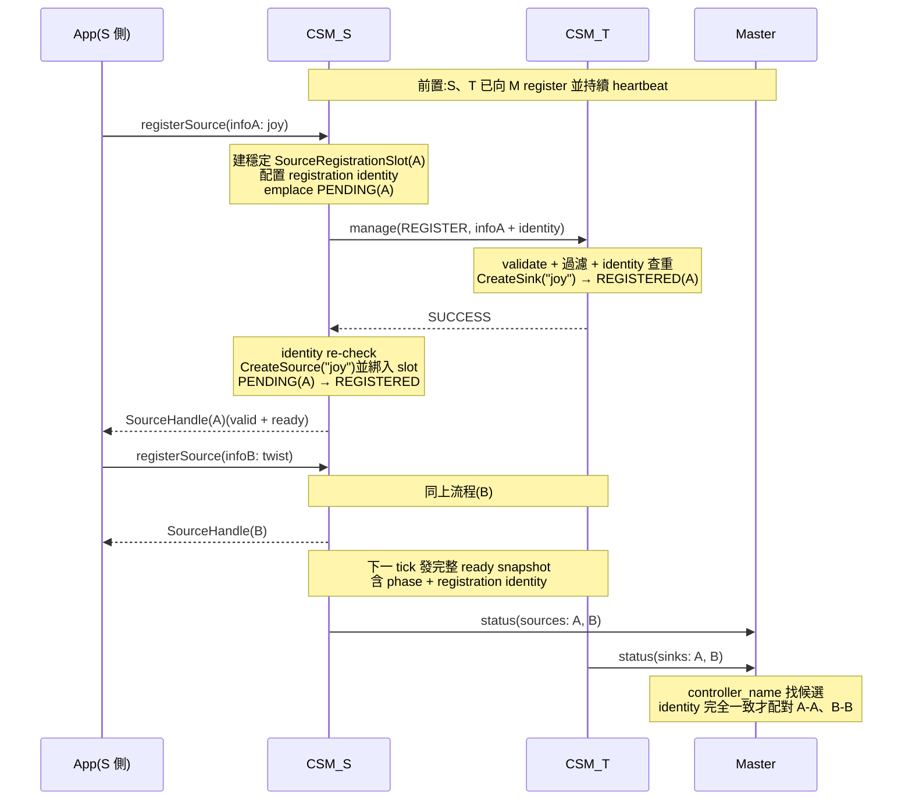
```mermaid
sequenceDiagram
    participant App as App(S 側)
    participant S as CSM_S
    participant T as CSM_T
    participant M as Master

    Note over S,M: 前置:S、T 已向 M register 並持續 heartbeat
    App->>S: registerSource(infoA: joy)
    Note over S: 建穩定 SourceRegistrationSlot(A)<br/>配置 registration identity<br/>emplace PENDING(A)
    S->>T: manage(REGISTER, infoA + identity)
    Note over T: validate + 過濾 + identity 查重<br/>CreateSink("joy") → REGISTERED(A)
    T-->>S: SUCCESS
    Note over S: identity re-check<br/>CreateSource("joy")並綁入 slot<br/>PENDING(A) → REGISTERED
    S-->>App: SourceHandle(A)(valid + ready)

    App->>S: registerSource(infoB: twist)
    Note over S,T: 同上流程(B)
    S-->>App: SourceHandle(B)

    Note over S,T: 下一 tick 發完整 ready snapshot<br/>含 phase + registration identity
    S->>M: status(sources: A, B)
    T->>M: status(sinks: A, B)
    Note over M: controller_name 找候選<br/>identity 完全一致才配對 A-A、B-B
```

函數呼叫流程(單次註冊,詳見 A.0 註冊鏈):
1. `registerSource(info)` — 完成驗證與過濾後,建立穩定 slot 與 registration identity,並先行佔位
2. 發出 `manage(REGISTER, identity)` service 呼叫,阻塞等待至多 timeoutMs
3. 對側於 `_onManage(REGISTER)` 中進行 identity 查重,建立 Sink 並轉正
4. 本側 re-check identity,以 `CreateSource()` 建立 endpoint 並綁入 slot,回傳 valid + ready 的 Handle

資料流建立之後,傳輸路徑為 `App: handle.send(msg)` → `Source::send()`(內部先 `recordActivity()` 再 `publish`)→ DDS → `Sink::_store()`(先 `recordActivity()`,接著存入 `latestMsg_`、喚醒等待者,最後執行使用者 callback)。hot path 只記錄、不改狀態(單寫者,D8)。首筆 send 或首筆收訊之後,Source 與 Sink 各自由所屬 CSM 於下一個 tick 推進 INITIAL → ACTIVE(路徑為 `_calcStatus` → table → `_applyStatus`,狀態粒度 = tick,§2.3)；兩側皆為狀態自驅,無 master 參與。註冊時若遇到不同 identity 的既有同名 entry,一律拒絕,並以 typed `RETRYABLE_CONFLICT` 依 D3 進入 RETRY_WAIT；只有在初次 target 不可達或結果不明時,才由 D7 policy 決定是否保留 intent。排入重試後,同一 slot 與 SourceHandle 均保留(valid 但 not ready),由 CSM 以 bounded async attempt 重試；重試成功後替換 endpoint,原 Handle 再次 ready(§8.3/§10)。

##### A.1.1.2 Source 發送間隔超過 timeout 與 disconnect 閾值

此情境中,App 停止(或過慢)呼叫 `send()`,兩側的 elapsed 各自依序越過 `timeout_ns` 與 `disconnect_timeout_ns` 兩個閾值。

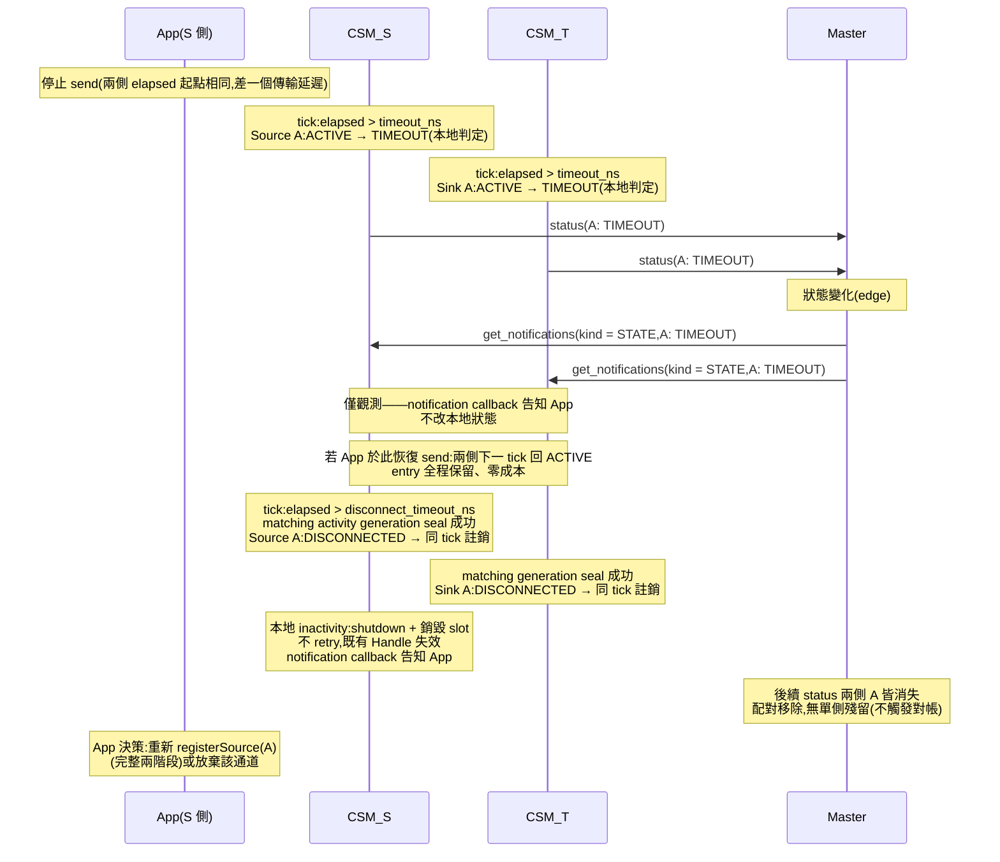
```mermaid
sequenceDiagram
    participant App as App(S 側)
    participant S as CSM_S
    participant T as CSM_T
    participant M as Master

    Note over App: 停止 send(兩側 elapsed 起點相同,差一個傳輸延遲)
    Note over S: tick:elapsed > timeout_ns<br/>Source A:ACTIVE → TIMEOUT(本地判定)
    Note over T: tick:elapsed > timeout_ns<br/>Sink A:ACTIVE → TIMEOUT(本地判定)
    S->>M: status(A: TIMEOUT)
    T->>M: status(A: TIMEOUT)
    Note over M: 狀態變化(edge)
    M->>S: get_notifications(kind = STATE,A: TIMEOUT)
    M->>T: get_notifications(kind = STATE,A: TIMEOUT)
    Note over S,T: 僅觀測——notification callback 告知 App<br/>不改本地狀態

    Note over S,T: 若 App 於此恢復 send:兩側下一 tick 回 ACTIVE<br/>entry 全程保留、零成本

    Note over S: tick:elapsed > disconnect_timeout_ns<br/>matching activity generation seal 成功<br/>Source A:DISCONNECTED → 同 tick 註銷
    Note over T: matching generation seal 成功<br/>Sink A:DISCONNECTED → 同 tick 註銷
    Note over S: 本地 inactivity:shutdown + 銷毀 slot<br/>不 retry,既有 Handle 失效<br/>notification callback 告知 App
    Note over M: 後續 status 兩側 A 皆消失<br/>配對移除,無單側殘留(不觸發對帳)
    Note over App: App 決策:重新 registerSource(A)<br/>(完整兩階段)或放棄該通道
```

要點:兩側各自依本地 elapsed 進行判定,因此幾乎同步走完整條鏈；master 的 STATE 通知僅屬觀測告知,不是狀態來源。TIMEOUT 的定位是可恢復緩衝——只要恢復發送,兩側即於下一 tick 回到 ACTIVE,不觸發任何 add/remove；越過 disconnect 閾值則代表確認死亡,兩側各自於同一 tick 內完成註銷。執行最終註銷前,必須以計算當下觀測到的 activity generation 完成 seal；若其間出現新的 send / receive,seal 失敗並取消該輪註銷。本端 inactivity 或 forced removal 會銷毀 logical slot,且**不**自動 retry——否則會形成「重建 → 無活動 → 再註銷」的循環——是否重建由 App 經 callback 決策。Source 側仍會排入 matching-generation best-effort UNREGISTER 以加速清理,但正確性不以其成功為前提。若 `disconnect_timeout_ns = 0`,本情境不會自動進入 DISCONNECTED:兩側可以無限期停在 TIMEOUT,直到 forced / explicit unregister 或可靠的遠端生命週期事件提供其他終止來源為止,因此不得宣稱有限時間自動收斂。B channel 全程不受影響,因為判定是 per-entity 獨立進行的。

##### A.1.1.3 Source CSM crash

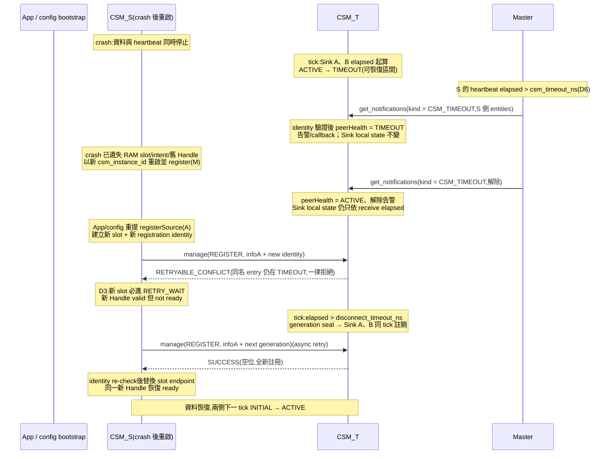
```mermaid
sequenceDiagram
    participant App as App / config bootstrap
    participant S as CSM_S(crash 後重啟)
    participant T as CSM_T
    participant M as Master

    Note over S: crash:資料與 heartbeat 同時停止
    Note over T: tick:Sink A、B elapsed 起算<br/>ACTIVE → TIMEOUT(可恢復區間)
    Note over M: S 的 heartbeat elapsed > csm_timeout_ns(D6)
    M->>T: get_notifications(kind = CSM_TIMEOUT,S 側 entities)
    Note over T: identity 驗證後 peerHealth = TIMEOUT<br/>告警/callback；Sink local state 不變

    Note over S: crash 已遺失 RAM slot/intent/舊 Handle<br/>以新 csm_instance_id 重啟並 register(M)
    M->>T: get_notifications(kind = CSM_TIMEOUT,解除)
    Note over T: peerHealth = ACTIVE、解除告警<br/>Sink local state 仍只依 receive elapsed
    Note over S: App/config 重提 registerSource(A)<br/>建立新 slot + 新 registration identity
    S->>T: manage(REGISTER, infoA + new identity)
    T-->>S: RETRYABLE_CONFLICT(同名 entry 仍在 TIMEOUT,一律拒絕)
    Note over S: D3:新 slot 必進 RETRY_WAIT<br/>新 Handle valid 但 not ready

    Note over T: tick:elapsed > disconnect_timeout_ns<br/>generation seal → Sink A、B 同 tick 註銷
    S->>T: manage(REGISTER, infoA + next generation)(async retry)
    T-->>S: SUCCESS(空位,全新註冊)
    Note over S: identity re-check後替換 slot endpoint<br/>同一新 Handle 恢復 ready
    Note over S,T: 資料恢復,兩側下一 tick INITIAL → ACTIVE
```

要點:T 側 local state 的唯一決策來源是 receive activity；CSM_TIMEOUT 通知僅更新 `peerHealth` 並產生告警,不得把 Sink 提前標成 TIMEOUT。若 S 失聯時間超過 `csm_disconnect_timeout_ns`(對應重啟較慢的情況),master 會對 T 重送帶有 event ID 與完整舊 registration identity 的 DISCONNECTED control event,直到收到 ACK 為止；T 僅在 identity 仍相符時才排入 removal,並於 terminal commit 時重驗 identity、建立 terminal seal,然後移除 endpoint。S process 重啟後不可能自動恢復 RAM 中的 intent,必須由 App/config 重提註冊；重提後的新 slot 若進入 RETRY_WAIT,async retry 成功時,該次呼叫取得的同一 Handle 會恢復 ready。同名查重沒有 TIMEOUT 沿用規則(D3)；conflict retry 不設次數上限。D7 目前僅剩 delay / backoff 數值未定,加上排程與故障時間本身不可控,因此不得給出固定的收斂上限。若 entity 或 CSM 的 disconnect 閾值為 0,閾值路徑不保證清除舊 Sink；此時有限收斂需依賴 matching DISCONNECTED、基於 full-ready-snapshot 的 level reconciliation / PAIR_MISSING,或 explicit removal。A、B 兩個 channel 各以自身 identity 獨立處理。

##### A.1.1.4 Sink CSM crash

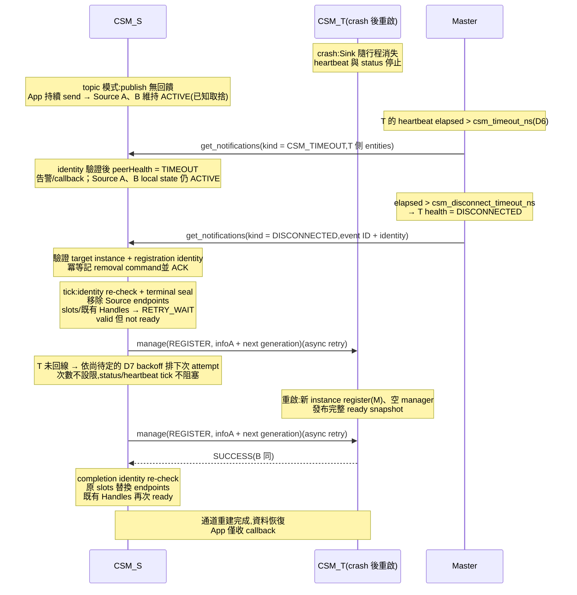
```mermaid
sequenceDiagram
    participant S as CSM_S
    participant T as CSM_T(crash 後重啟)
    participant M as Master

    Note over T: crash:Sink 隨行程消失<br/>heartbeat 與 status 停止
    Note over S: topic 模式:publish 無回饋<br/>App 持續 send → Source A、B 維持 ACTIVE(已知取捨)
    Note over M: T 的 heartbeat elapsed > csm_timeout_ns(D6)
    M->>S: get_notifications(kind = CSM_TIMEOUT,T 側 entities)
    Note over S: identity 驗證後 peerHealth = TIMEOUT<br/>告警/callback；Source A、B local state 仍 ACTIVE

    Note over M: elapsed > csm_disconnect_timeout_ns<br/>→ T health = DISCONNECTED
    M->>S: get_notifications(kind = DISCONNECTED,event ID + identity)
    Note over S: 驗證 target instance + registration identity<br/>冪等記 removal command並 ACK
    Note over S: tick:identity re-check + terminal seal<br/>移除 Source endpoints<br/>slots/既有 Handles → RETRY_WAIT<br/>valid 但 not ready

    S->>T: manage(REGISTER, infoA + next generation)(async retry)
    Note over S: T 未回線 → 依尚待定的 D7 backoff 排下次 attempt<br/>次數不設限,status/heartbeat tick 不阻塞
    Note over T: 重啟:新 instance register(M)、空 manager<br/>發布完整 ready snapshot
    S->>T: manage(REGISTER, infoA + next generation)(async retry)
    T-->>S: SUCCESS(B 同)
    Note over S: completion identity re-check<br/>原 slots 替換 endpoints<br/>既有 Handles 再次 ready
    Note over S,T: 通道重建完成,資料恢復<br/>App 僅收 callback
```

要點:Source 在對側 crash 後仍維持 ACTIVE,是狀態自驅設計的已知取捨——本地事實確實是「有在送」；CSM_TIMEOUT 只把獨立的 `peerHealth` 設為 TIMEOUT 並產生告警。遠端 DISCONNECTED 則是可靠的 control event:master 重送至收到 ACK 為止,CSM 以完整 registration identity 做冪等驗證,建立 terminal seal 後只移除 matching endpoint；logical slot 與原 Handle 保留於 RETRY_WAIT,async retry 成功後同一 Handle 恢復 ready。**快速重啟**時,master 必須等相關新 incarnation 的 full ready snapshots 齊備才能行動；matching PENDING 會暫停 missing grace,避免在註冊途中誤判；RETRY_WAIT 不計為 live endpoint。若之後仍持續呈現 Source 單側存在,level-triggered PAIR_MISSING 會以同一 event ID 重送至 ACK,再走與上述相同的移除 / retry 流程；雙閾值與 PENDING-aware reconciliation 在此互補。若 `csm_disconnect_timeout_ns = 0` 且 T 尚未回線提供 ready snapshot,永久 crash 的情況不保證有限時間自動收斂；D7 的數值亦尚未定案。

##### A.1.1.5 CSM Master crash

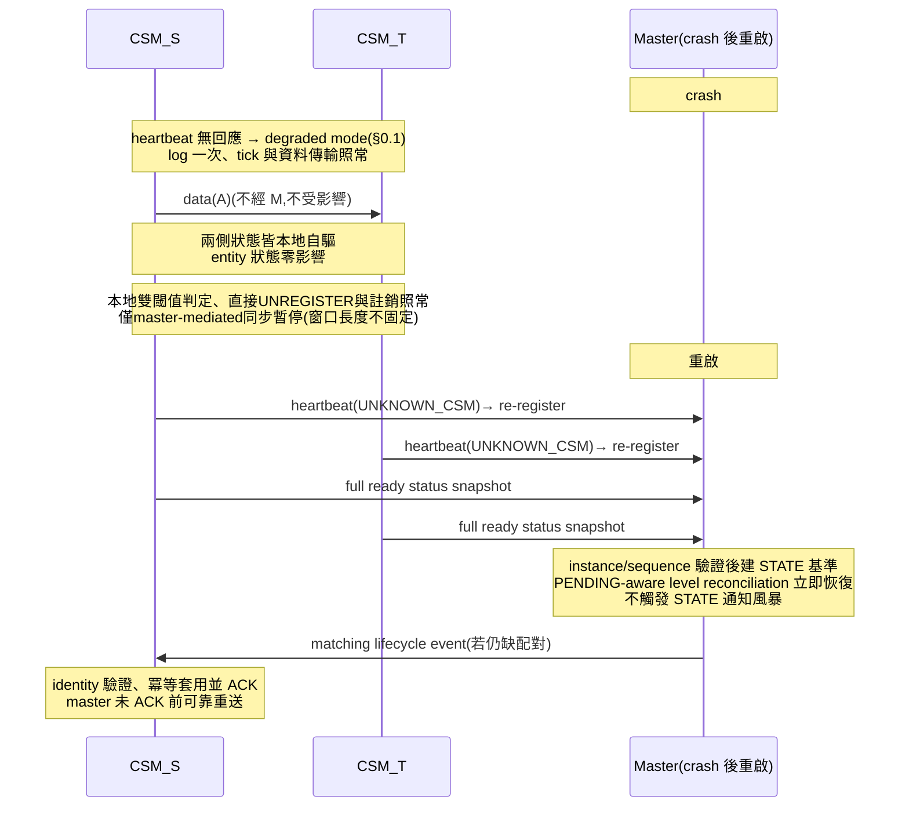
```mermaid
sequenceDiagram
    participant S as CSM_S
    participant T as CSM_T
    participant M as Master(crash 後重啟)

    Note over M: crash
    Note over S,T: heartbeat 無回應 → degraded mode(§0.1)<br/>log 一次、tick 與資料傳輸照常
    S->>T: data(A)(不經 M,不受影響)
    Note over S,T: 兩側狀態皆本地自驅<br/>entity 狀態零影響
    Note over S,T: 本地雙閾值判定、直接UNREGISTER與註銷照常<br/>僅master-mediated同步暫停(窗口長度不固定)

    Note over M: 重啟
    S->>M: heartbeat(UNKNOWN_CSM)→ re-register
    T->>M: heartbeat(UNKNOWN_CSM)→ re-register
    S->>M: full ready status snapshot
    T->>M: full ready status snapshot
    Note over M: instance/sequence 驗證後建 STATE 基準<br/>PENDING-aware level reconciliation 立即恢復<br/>不觸發 STATE 通知風暴
    M->>S: matching lifecycle event(若仍缺配對)
    Note over S: identity 驗證、冪等套用並 ACK<br/>master 未 ACK 前可靠重送
```

要點:資料面完全不受 master 生死影響。v1.1.0 起兩側狀態皆為本地自驅,master crash 對 entity 狀態零影響,v1.0.1 的「topic Source 判定凍結」問題因此消解。degraded 期間暫停的只有 master-mediated 的預警、生命週期通知與對帳；直接 UNREGISTER 仍可運作。本地 inactivity 的註銷仍須先通過 activity-generation guard,forced terminal 則直接建立 seal；兩種路徑最終都會銷毀 slot 且不 retry。既有 RETRY_WAIT 的 async attempt 以對側 CSM 為目標、不經過 master,因此照常運作。master 回線後,不能只把首輪 status 當作 edge 基準便停止:必須等待相關 CSM 的 full ready snapshots 到齊,以 PENDING-aware level reconciliation 補發缺失的同步；DISCONNECTED / PAIR_MISSING 依 identity 重送至 ACK。若 disconnect 判定設為 0,master outage 期間不保證有限收斂,只能在回線後由對帳或其他終止來源補收。

#### A.1.2 一對多(1:N)

拓撲說明:CSM_S 註冊兩個 Source——A(joy,target = CSM_T1)與 B(twist,target = CSM_T2)；CSM_T1 據此生成 Sink A,CSM_T2 生成 Sink B。source CSM 同時面對兩個 target,而每個 target CSM 僅持有一條配對。Master 訂閱三個 CSM 的 status,以 controller_name 建立 A(S–T1)與 B(S–T2)兩組配對。

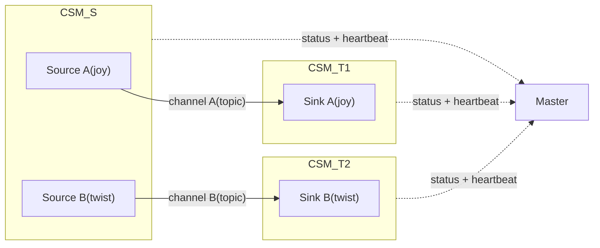
```mermaid
flowchart LR
    subgraph S["CSM_S"]
        SA["Source A(joy)"]
        SB["Source B(twist)"]
    end
    subgraph T1["CSM_T1"]
        KA["Sink A(joy)"]
    end
    subgraph T2["CSM_T2"]
        KB["Sink B(twist)"]
    end
    M["Master"]
    SA -->|"channel A(topic)"| KA
    SB -->|"channel B(topic)"| KB
    S -.->|"status + heartbeat"| M
    T1 -.->|"status + heartbeat"| M
    T2 -.->|"status + heartbeat"| M
```

##### A.1.2.1 註冊至 Sink 生成的完整流程

此情境中,CSM_S 依序對兩個不同的 target 註冊 Source(A:joy → CSM_T1、B:twist → CSM_T2)。兩條註冊鏈除了 target 不同之外互相獨立,各自走完整的註冊鏈,彼此互不等待、互不影響。

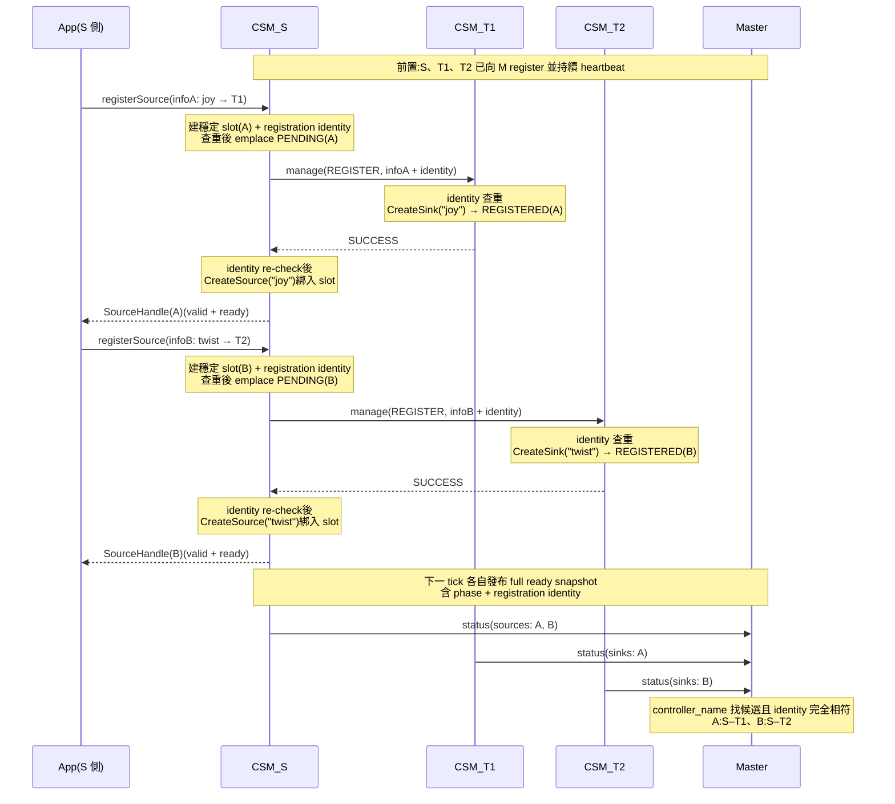
```mermaid
sequenceDiagram
    participant App as App(S 側)
    participant S as CSM_S
    participant T1 as CSM_T1
    participant T2 as CSM_T2
    participant M as Master

    Note over S,M: 前置:S、T1、T2 已向 M register 並持續 heartbeat
    App->>S: registerSource(infoA: joy → T1)
    Note over S: 建穩定 slot(A) + registration identity<br/>查重後 emplace PENDING(A)
    S->>T1: manage(REGISTER, infoA + identity)
    Note over T1: identity 查重<br/>CreateSink("joy") → REGISTERED(A)
    T1-->>S: SUCCESS
    Note over S: identity re-check後<br/>CreateSource("joy")綁入 slot
    S-->>App: SourceHandle(A)(valid + ready)

    App->>S: registerSource(infoB: twist → T2)
    Note over S: 建穩定 slot(B) + registration identity<br/>查重後 emplace PENDING(B)
    S->>T2: manage(REGISTER, infoB + identity)
    Note over T2: identity 查重<br/>CreateSink("twist") → REGISTERED(B)
    T2-->>S: SUCCESS
    Note over S: identity re-check後<br/>CreateSource("twist")綁入 slot
    S-->>App: SourceHandle(B)(valid + ready)

    Note over S,M: 下一 tick 各自發布 full ready snapshot<br/>含 phase + registration identity
    S->>M: status(sources: A, B)
    T1->>M: status(sinks: A)
    T2->>M: status(sinks: B)
    Note over M: controller_name 找候選且 identity 完全相符<br/>A:S–T1、B:S–T2
```

函數呼叫流程(單次註冊,詳見 A.0 註冊鏈):
1. `registerSource(info)` — 完成驗證與過濾後,建立穩定 slot 與 identity,並先行佔位
2. 發出 `manage(REGISTER, identity)`,呼叫對象為該筆 info 指定的 target,阻塞等待至多 timeoutMs
3. 對側於 `_onManage(REGISTER)` 中進行 identity 查重,建立 Sink 並轉正
4. 本側 identity re-check,以 `CreateSource()` 綁入 slot,回傳 valid + ready 的 Handle

資料流建立之後,兩條 channel 各自獨立運作。A channel 的路徑為 `App: handleA.send(msg)` → `Source::send()`(`recordActivity()` 接受後執行 `rate_.record()`,再 `publish`)→ DDS → T1 側 `Sink::_store()`(`recordActivity()` 接受後執行 `rate_.record()`,接著存入 `latestMsg_`、喚醒等待者,最後執行使用者 callback)；B channel 於 S–T2 之間同理。hot path 只記錄、不改狀態(D8)。兩側皆為狀態自驅:Source A、B 在首次 `send()` 之後,Sink A、Sink B 在收到首筆訊息之後,各自於所屬 CSM 的下一個 status tick 由 `_calcStatus` → `_applyStatus` 轉為 ACTIVE(tick 粒度,§2.3),不存在任何外部注入路徑。

要點:兩條註冊鏈唯一的共享狀態是 CSM_S 的 `sources_` 容器,雙鍵查重在同一把鎖下進行；T1、T2 則各自只認識屬於自己的那條配對。任一條鏈失敗——遠端拒絕或逾時後 rollback(§2.4)——都不影響另一條鏈的成敗。typed conflict 依 D3 必定 retry；只有初次 target 不可達或結果不明時,才交由 D7 policy 決定。轉入 RETRY_WAIT 後,該通道的穩定 slot 與 Handle 均保留(valid 但 not ready),bounded async retry 成功後原 Handle 恢復 ready,另一通道完全不受影響。D7 的 delay、backoff 與 optional initial attempt 上限數值尚未定案(§8.3/§12 #6)。

##### A.1.2.2 Source 發送間隔超過 timeout 與 disconnect 閾值

此情境中,App 停止(或過慢)呼叫 Source A 的 `send()`。S 側 Source A 與 T1 側 Sink A 各自依本地 elapsed 推進——起點相同,誤差僅一個傳輸延遲——依序越過 `timeout_ns` 與 `disconnect_timeout_ns`。Source B 照常發送,B channel 全程不受影響。

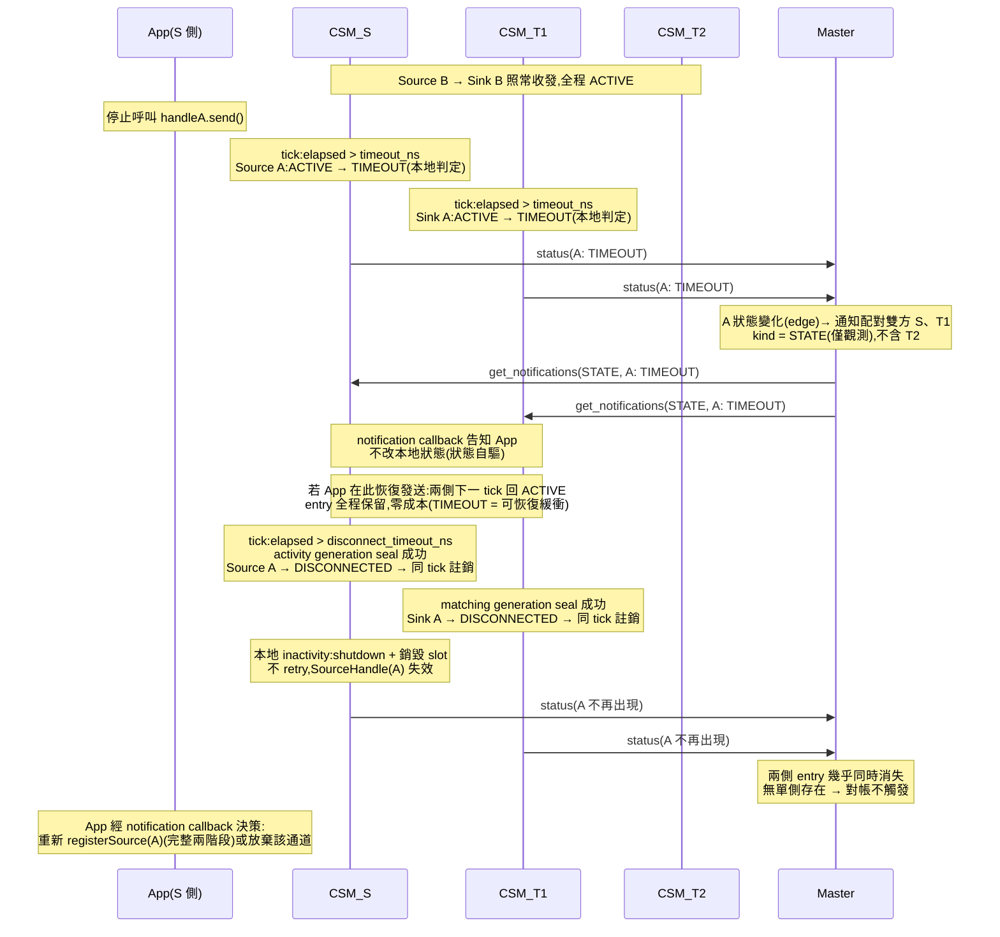
```mermaid
sequenceDiagram
    participant App as App(S 側)
    participant S as CSM_S
    participant T1 as CSM_T1
    participant T2 as CSM_T2
    participant M as Master

    Note over S,T2: Source B → Sink B 照常收發,全程 ACTIVE
    Note over App: 停止呼叫 handleA.send()
    Note over S: tick:elapsed > timeout_ns<br/>Source A:ACTIVE → TIMEOUT(本地判定)
    Note over T1: tick:elapsed > timeout_ns<br/>Sink A:ACTIVE → TIMEOUT(本地判定)
    S->>M: status(A: TIMEOUT)
    T1->>M: status(A: TIMEOUT)
    Note over M: A 狀態變化(edge)→ 通知配對雙方 S、T1<br/>kind = STATE(僅觀測),不含 T2
    M->>S: get_notifications(STATE, A: TIMEOUT)
    M->>T1: get_notifications(STATE, A: TIMEOUT)
    Note over S,T1: notification callback 告知 App<br/>不改本地狀態(狀態自驅)

    Note over S,T1: 若 App 在此恢復發送:兩側下一 tick 回 ACTIVE<br/>entry 全程保留,零成本(TIMEOUT = 可恢復緩衝)

    Note over S: tick:elapsed > disconnect_timeout_ns<br/>activity generation seal 成功<br/>Source A → DISCONNECTED → 同 tick 註銷
    Note over T1: matching generation seal 成功<br/>Sink A → DISCONNECTED → 同 tick 註銷
    Note over S: 本地 inactivity:shutdown + 銷毀 slot<br/>不 retry,SourceHandle(A) 失效
    S->>M: status(A 不再出現)
    T1->>M: status(A 不再出現)
    Note over M: 兩側 entry 幾乎同時消失<br/>無單側存在 → 對帳不觸發
    Note over App: App 經 notification callback 決策:<br/>重新 registerSource(A)(完整兩階段)或放棄該通道
```

要點:逾時判定的作用範圍限於單一配對,即 S 側 Source A 與 T1 側 Sink A；兩側從同一起點各自量測,因此幾乎同步推進。master 的 STATE 通知僅為觀測告知,不是狀態來源；通知對象由 controller_name 配對決定,T2 全程不會收到任何關於 A 的通知,Sink B 的判定在 T2 本地獨立進行。短暫中斷由 TIMEOUT 區間吸收,恢復發送即回 ACTIVE,沒有 add/remove 成本。越過 disconnect 閾值時,各側均須先以所觀測到的 activity generation 執行 terminal seal,seal 成功才於同 tick 註銷；若計算之後已出現新活動,則取消本輪註銷。重建必須重新註冊——本地 inactivity 或 forced removal 會銷毀 slot 且不 retry,是否重建由 App 決策；Source 側仍會排入 matching-generation best-effort UNREGISTER,而正確性保障來自對側自身的判定與對帳。若 `disconnect_timeout_ns = 0`,兩側不會因本地 elapsed 而自動註銷,可能無限期停在 TIMEOUT；只有 forced / explicit unregister 或可靠遠端 lifecycle event 這類其他終止來源能推進狀態,因此不得宣稱有限時間收斂。

##### A.1.2.3 Source CSM crash

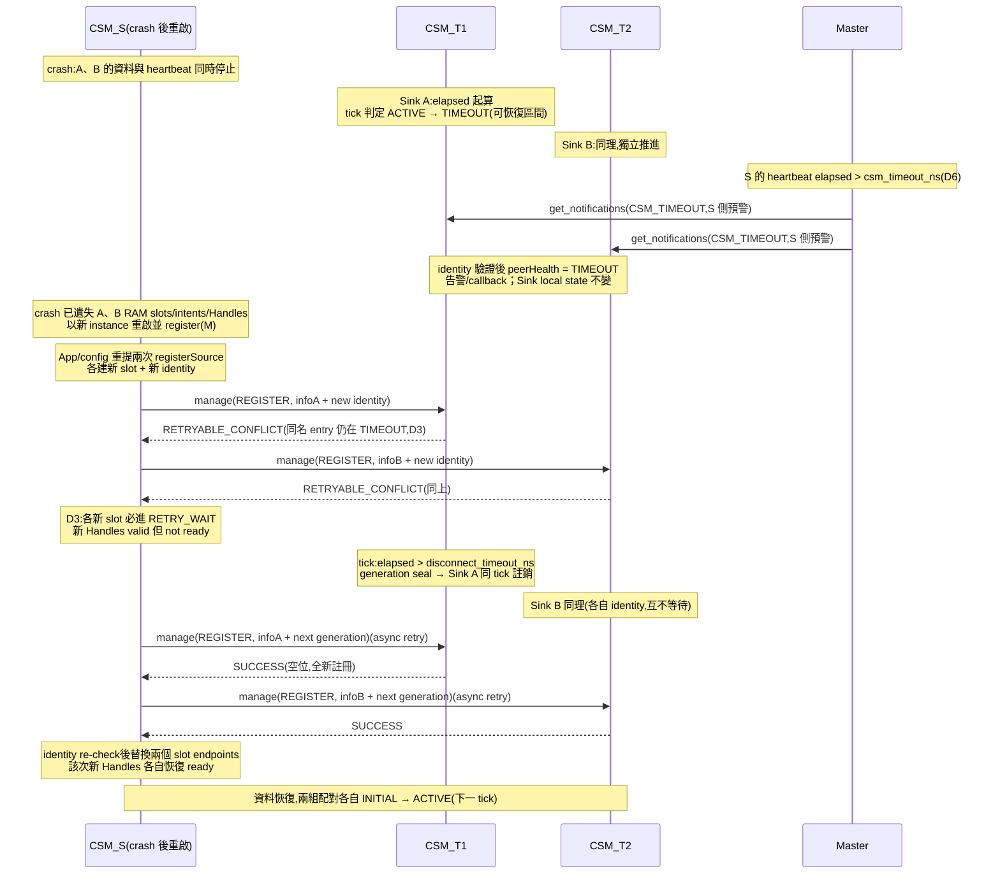
```mermaid
sequenceDiagram
    participant S as CSM_S(crash 後重啟)
    participant T1 as CSM_T1
    participant T2 as CSM_T2
    participant M as Master

    Note over S: crash:A、B 的資料與 heartbeat 同時停止
    Note over T1: Sink A:elapsed 起算<br/>tick 判定 ACTIVE → TIMEOUT(可恢復區間)
    Note over T2: Sink B:同理,獨立推進
    Note over M: S 的 heartbeat elapsed > csm_timeout_ns(D6)
    M->>T1: get_notifications(CSM_TIMEOUT,S 側預警)
    M->>T2: get_notifications(CSM_TIMEOUT,S 側預警)
    Note over T1,T2: identity 驗證後 peerHealth = TIMEOUT<br/>告警/callback；Sink local state 不變

    Note over S: crash 已遺失 A、B RAM slots/intents/Handles<br/>以新 instance 重啟並 register(M)
    Note over S: App/config 重提兩次 registerSource<br/>各建新 slot + 新 identity
    S->>T1: manage(REGISTER, infoA + new identity)
    T1-->>S: RETRYABLE_CONFLICT(同名 entry 仍在 TIMEOUT,D3)
    S->>T2: manage(REGISTER, infoB + new identity)
    T2-->>S: RETRYABLE_CONFLICT(同上)
    Note over S: D3:各新 slot 必進 RETRY_WAIT<br/>新 Handles valid 但 not ready

    Note over T1: tick:elapsed > disconnect_timeout_ns<br/>generation seal → Sink A 同 tick 註銷
    Note over T2: Sink B 同理(各自 identity,互不等待)
    S->>T1: manage(REGISTER, infoA + next generation)(async retry)
    T1-->>S: SUCCESS(空位,全新註冊)
    S->>T2: manage(REGISTER, infoB + next generation)(async retry)
    T2-->>S: SUCCESS
    Note over S: identity re-check後替換兩個 slot endpoints<br/>該次新 Handles 各自恢復 ready
    Note over S,T2: 資料恢復,兩組配對各自 INITIAL → ACTIVE(下一 tick)
```

要點:在 1:N 拓撲中,source CSM 是全部 target 的共同上游,它的 crash 會同時波及 T1 與 T2；每個 target 的 Sink 仍然只依本地 receive activity 推進,CSM_TIMEOUT 通知僅更新各 entry 的 `peerHealth` 並產生告警,不改 local state。S process crash 會摧毀全部 RAM intent,重啟後必須由 App/config 重提 A、B 兩筆註冊,各自建立新的 slot / identity；typed conflict 依 D3 必進 RETRY_WAIT,async retry 成功後,該次取得的新 Handle 恢復 ready。若 S 失聯超過 `csm_disconnect_timeout_ns`,master 會以完整 identity 對 T1/T2 發出可靠 DISCONNECTED,重送至 ACK 為止；各 target 驗證 identity 並建立 terminal seal,只移除 matching Sink。同名 TIMEOUT entry 不沿用(D3),retryable conflict 不設次數上限。D7 backoff 數值未定,因此不得寫出固定的 retry 間隔或收斂上限；若 disconnect 閾值為 0,有限收斂需依賴可靠 remote event、基於 full-ready-snapshot 的 level reconciliation / PAIR_MISSING,或 explicit removal。兩條鏈的成敗互不影響。

##### A.1.2.4 Sink CSM crash

本節以 CSM_T1 crash 為例,展示 1:N 拓撲的故障隔離性:Source B 與 CSM_T2 完全不受影響。

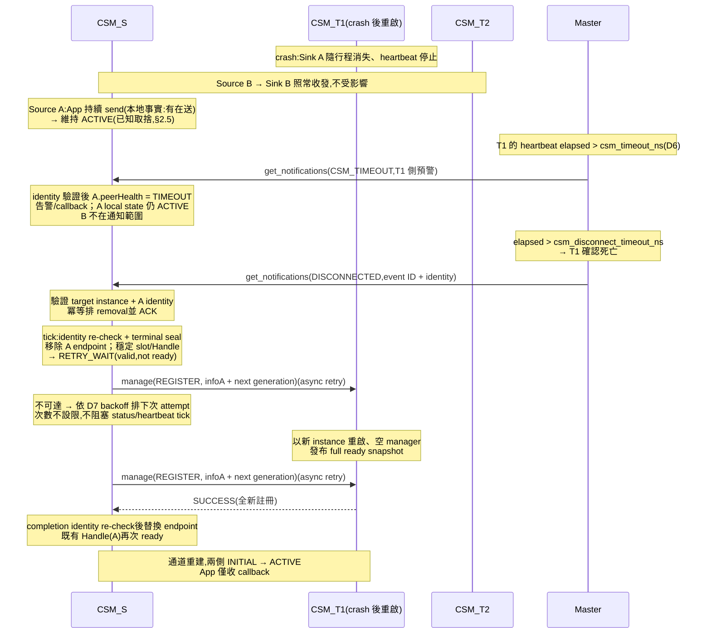
```mermaid
sequenceDiagram
    participant S as CSM_S
    participant T1 as CSM_T1(crash 後重啟)
    participant T2 as CSM_T2
    participant M as Master

    Note over T1: crash:Sink A 隨行程消失、heartbeat 停止
    Note over S,T2: Source B → Sink B 照常收發,不受影響
    Note over S: Source A:App 持續 send(本地事實:有在送)<br/>→ 維持 ACTIVE(已知取捨,§2.5)
    Note over M: T1 的 heartbeat elapsed > csm_timeout_ns(D6)
    M->>S: get_notifications(CSM_TIMEOUT,T1 側預警)
    Note over S: identity 驗證後 A.peerHealth = TIMEOUT<br/>告警/callback；A local state 仍 ACTIVE<br/>B 不在通知範圍

    Note over M: elapsed > csm_disconnect_timeout_ns<br/>→ T1 確認死亡
    M->>S: get_notifications(DISCONNECTED,event ID + identity)
    Note over S: 驗證 target instance + A identity<br/>冪等排 removal並 ACK
    Note over S: tick:identity re-check + terminal seal<br/>移除 A endpoint；穩定 slot/Handle<br/>→ RETRY_WAIT(valid,not ready)

    S->>T1: manage(REGISTER, infoA + next generation)(async retry)
    Note over S: 不可達 → 依 D7 backoff 排下次 attempt<br/>次數不設限,不阻塞 status/heartbeat tick
    Note over T1: 以新 instance 重啟、空 manager<br/>發布 full ready snapshot
    S->>T1: manage(REGISTER, infoA + next generation)(async retry)
    T1-->>S: SUCCESS(全新註冊)
    Note over S: completion identity re-check後替換 endpoint<br/>既有 Handle(A)再次 ready
    Note over S,T1: 通道重建,兩側 INITIAL → ACTIVE<br/>App 僅收 callback
```

要點:Sink CSM 的 crash 只波及以它為 target 的配對——Source B 與 T2 的資料流、tick 判定、master 通知均照常運作,這是 1:N 拓撲相對於單一 target 的隔離優勢。topic 模式下,Source A 的 send 活動不受對側生死影響,local state 維持 ACTIVE；CSM_TIMEOUT 只將 `peerHealth` 設為 TIMEOUT 並產生告警。遠端 DISCONNECTED 經 event ID 可靠重送至 ACK；S 完整比對 registration identity 之後,建立 terminal seal 並移除 A endpoint,穩定 slot 與原 Handle 進入 RETRY_WAIT,async retry 成功後同一 Handle 恢復 ready。若 T1 快速重啟,master 必須等 S、T1 目前 incarnation 的 full ready snapshots 齊備；matching PENDING 會暫停 missing grace,RETRY_WAIT 不計為 live endpoint。唯有確認 A 持續單側存在後,level-triggered PAIR_MISSING 才以相同 identity 重送至 ACK,並走相同的 removal/retry 流程。若 `csm_disconnect_timeout_ns = 0` 且 T1 尚未回線交付 ready snapshot,永久 crash 不保證有限時間收斂；D7 的數值參數亦未定案。

##### A.1.2.5 CSM Master crash

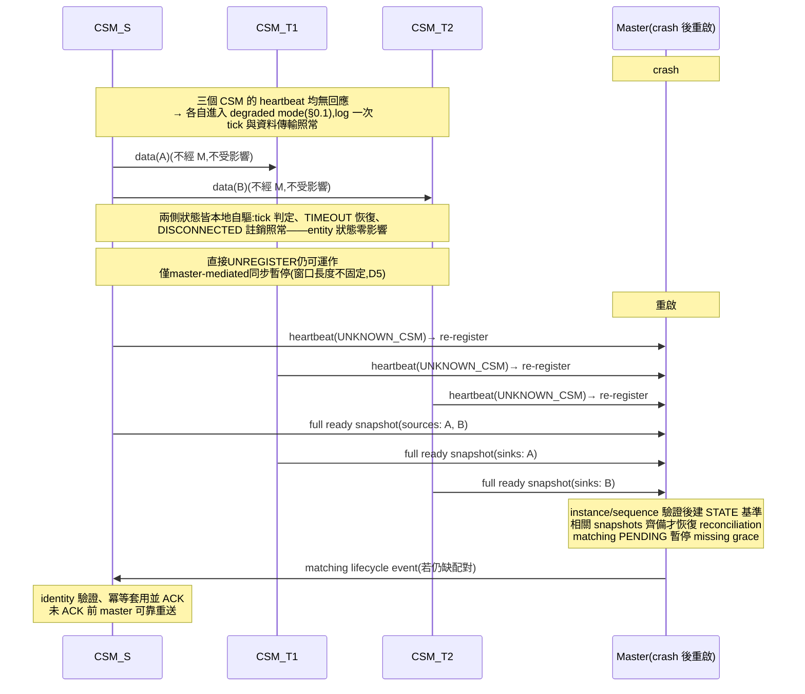
```mermaid
sequenceDiagram
    participant S as CSM_S
    participant T1 as CSM_T1
    participant T2 as CSM_T2
    participant M as Master(crash 後重啟)

    Note over M: crash
    Note over S,T2: 三個 CSM 的 heartbeat 均無回應<br/>→ 各自進入 degraded mode(§0.1),log 一次<br/>tick 與資料傳輸照常
    S->>T1: data(A)(不經 M,不受影響)
    S->>T2: data(B)(不經 M,不受影響)
    Note over S,T2: 兩側狀態皆本地自驅:tick 判定、TIMEOUT 恢復、<br/>DISCONNECTED 註銷照常——entity 狀態零影響
    Note over S,T2: 直接UNREGISTER仍可運作<br/>僅master-mediated同步暫停(窗口長度不固定,D5)

    Note over M: 重啟
    S->>M: heartbeat(UNKNOWN_CSM)→ re-register
    T1->>M: heartbeat(UNKNOWN_CSM)→ re-register
    T2->>M: heartbeat(UNKNOWN_CSM)→ re-register
    S->>M: full ready snapshot(sources: A, B)
    T1->>M: full ready snapshot(sinks: A)
    T2->>M: full ready snapshot(sinks: B)
    Note over M: instance/sequence 驗證後建 STATE 基準<br/>相關 snapshots 齊備才恢復 reconciliation<br/>matching PENDING 暫停 missing grace
    M->>S: matching lifecycle event(若仍缺配對)
    Note over S: identity 驗證、冪等套用並 ACK<br/>未 ACK 前 master 可靠重送
```

要點:degraded 的影響範圍涵蓋全部三個 CSM,但進入與離開 degraded mode 由各 CSM 依自身 heartbeat response 逾時獨立判定,彼此之間沒有依賴。兩側狀態皆為本地自驅(v1.1.0),master 生死對 entity 狀態零影響——資料面(A、B 兩條 channel)、本地 tick 判定與註銷照常運作；期間失去的只有 STATE 觀測、CSM 級預警、master lifecycle 通知與對帳,直接 matching-generation UNREGISTER 仍可運作。一側完成註銷之後,對側可能依自身 elapsed 走到 DISCONNECTED,也可能因持續本地活動或停用 disconnect 而保留,因此不一致窗口的長度不固定。本地 inactivity 的註銷須經 activity-generation guard；forced removal 則直接建立 terminal seal,之後銷毀 slot 且不 retry。既存 RETRY_WAIT 的 async retry 不經過 master,照常運作。master 重啟後,各 full ready snapshot 只用來建立 STATE edge 基準、不引發通知風暴；待相關 snapshots 齊備後立即執行 PENDING-aware level reconciliation,DISCONNECTED / PAIR_MISSING 以 matching identity 重送至 ACK。disconnect 判定為 0 時,master outage 期間不保證有限收斂。

---
#### A.1.3 多對一（N:1）

本節的拓撲如下：CSM_S1 註冊 Source A（joy），CSM_S2 註冊 Source B（twist），兩者的 target 都是同一個 CSM_T。CSM_T 的 `sinks_` 同時管理來自兩個 source CSM 的 entry，對應生成 Sink A（joy）與 Sink B（twist）。App1 與 App2 分別是 S1 側與 S2 側的使用者應用層；三個 CSM 各自向 master register，並持續發送 heartbeat。由於 `controller_name` 為全系統唯一，兩個來源的 entry 在 CSM_T 上必然不會衝突；master 也依靠這個唯一性，將 A、B 分別配對為 (S1, T) 與 (S2, T) 兩條互相獨立的通知路徑。

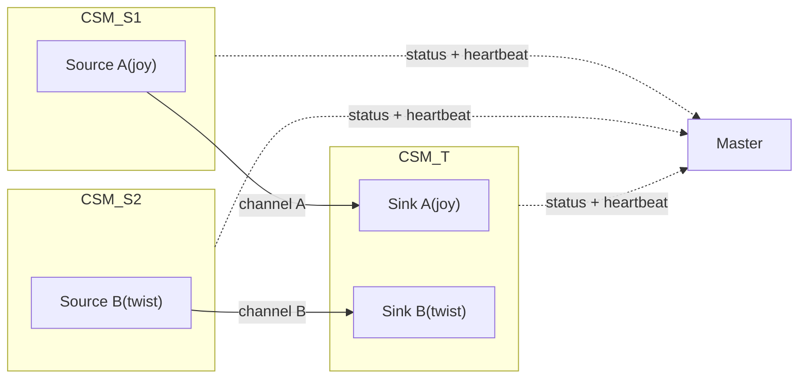
```mermaid
flowchart LR
    subgraph S1["CSM_S1"]
        SA["Source A(joy)"]
    end
    subgraph S2["CSM_S2"]
        SB["Source B(twist)"]
    end
    subgraph T["CSM_T"]
        KA["Sink A(joy)"]
        KB["Sink B(twist)"]
    end
    M["Master"]
    SA -->|"channel A"| KA
    SB -->|"channel B"| KB
    S1 -.->|"status + heartbeat"| M
    S2 -.->|"status + heartbeat"| M
    T -.->|"status + heartbeat"| M
```

##### A.1.3.1 註冊至 Sink 生成的完整流程

CSM_S1 與 CSM_S2 各自向 CSM_T 註冊一個 Source（A:joy、B:twist）。兩條註冊鏈由不同的 source CSM 發起，最後在 CSM_T 匯聚。CSM_T 對每一筆 REGISTER 分別執行 validate、過濾，以及 `sinkMtx_` 保護下的雙鍵查重。由於 `controller_name` 全域唯一，A、B 兩筆 entry 互不衝突；若兩個來源以 identical controller_name 並發註冊（這屬於組態錯誤），持鎖查重保證恰有一方成功，另一方則收到 error，且不會留下殘餘佔位——這正是 §8.4 M4 註冊風暴的多來源版本，也就是整合場景 I7。

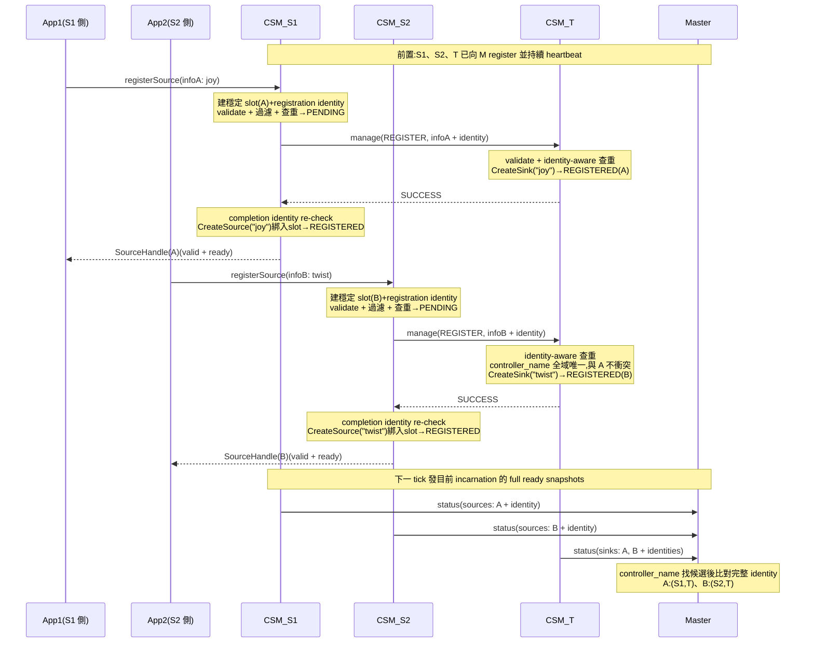
```mermaid
sequenceDiagram
    participant A1 as App1(S1 側)
    participant A2 as App2(S2 側)
    participant S1 as CSM_S1
    participant S2 as CSM_S2
    participant T as CSM_T
    participant M as Master

    Note over S1,M: 前置:S1、S2、T 已向 M register 並持續 heartbeat
    A1->>S1: registerSource(infoA: joy)
    Note over S1: 建穩定 slot(A)+registration identity<br/>validate + 過濾 + 查重→PENDING
    S1->>T: manage(REGISTER, infoA + identity)
    Note over T: validate + identity-aware 查重<br/>CreateSink("joy")→REGISTERED(A)
    T-->>S1: SUCCESS
    Note over S1: completion identity re-check<br/>CreateSource("joy")綁入slot→REGISTERED
    S1-->>A1: SourceHandle(A)(valid + ready)

    A2->>S2: registerSource(infoB: twist)
    Note over S2: 建穩定 slot(B)+registration identity<br/>validate + 過濾 + 查重→PENDING
    S2->>T: manage(REGISTER, infoB + identity)
    Note over T: identity-aware 查重<br/>controller_name 全域唯一,與 A 不衝突<br/>CreateSink("twist")→REGISTERED(B)
    T-->>S2: SUCCESS
    Note over S2: completion identity re-check<br/>CreateSource("twist")綁入slot→REGISTERED
    S2-->>A2: SourceHandle(B)(valid + ready)

    Note over S1,M: 下一 tick 發目前 incarnation 的 full ready snapshots
    S1->>M: status(sources: A + identity)
    S2->>M: status(sources: B + identity)
    T->>M: status(sinks: A, B + identities)
    Note over M: controller_name 找候選後比對完整 identity<br/>A:(S1,T)、B:(S2,T)
```

函數呼叫流程（單次註冊，詳 A.0 註冊鏈）：
1. `registerSource(info)` — 執行驗證與過濾，建立穩定 slot 與 identity，並以 PENDING 佔位。
2. 發出 `manage(REGISTER, identity)` service 呼叫（首次呼叫最多阻塞 timeoutMs）。
3. 對側執行 `_onManage(REGISTER)` — 以完整 identity 查重，建立 Sink，並轉入 REGISTERED。
4. 本側進行 completion identity re-check，以 `CreateSource()` 綁入 slot，回傳 valid + ready 的 Handle。

資料流建立之後，`App1: handleA.send(msg)` 與 `App2: handleB.send(msg)` 各自經由 `Source::send()`（`recordActivity()` 接受後執行 `rate_.record()` → `publish`）進入 DDS，再抵達對應的 `Sink::_store()`（`recordActivity()` 接受後執行 `rate_.record()` → 存入 `latestMsg_` → 觸發使用者 callback）。兩條 channel 是完全獨立的 DDS 傳輸；hot path 只做記錄，不改變狀態。兩側的狀態推進皆為自驅：Source A、B 在首次 send 之後，Sink A、B 在收到首筆訊息之後，各自於所屬 CSM 的下一個 status tick 由 INITIAL 轉為 ACTIVE（`_calcStatus` → CSM table → `_applyStatus`，§8.3）；master 不參與狀態推進。

要點：CSM_T 的 status tick 以單一 timer 巡覽 A、B 兩個 Sink，但 `_calcStatus` 的判定是 per-entity 獨立的；S1、S2 兩側的註冊鏈彼此毫無耦合，無論先後順序或交錯並發都不影響結果。唯一的匯聚點是 CSM_T 的持鎖查重：它以 `controller_name` + `channel_name` 雙鍵搭配完整 identity 擋下重複或衝突的註冊——相同 identity 的重送是冪等的；不同 identity 的同名 entry 則一律以 typed conflict 拒絕（D3，沒有沿用規則），而且新 slot 必定進入 RETRY_WAIT。只有在初次 target 不可達 / 結果不明的情況下，是否保留 intent 才交由 D7 policy 決定。bounded async retry 成功之後，原 Handle 即恢復 ready；至於 D7 的間隔、backoff 與 optional initial attempt 上限等數值，目前尚未定案。

##### A.1.3.2 Source 發送間隔超過 timeout 與 disconnect 閾值

本情境為：App1 停止呼叫 `send()`（或呼叫頻率過慢），使 Source A（S1 側）與 Sink A（T 側）各自的 elapsed 依序越過 `timeout_ns` 與 `disconnect_timeout_ns`；與此同時 App2 持續正常發送，channel B 全程不受影響。

```mermaid
sequenceDiagram
    participant S1 as CSM_S1
    participant S2 as CSM_S2
    participant T as CSM_T
    participant M as Master

    Note over S2,T: channel B 持續收發,Source B 與 Sink B 維持 ACTIVE
    Note over S1: App1 停止 send,Source A elapsed 起算
    Note over S1: tick:elapsed > timeout_ns<br/>Source A:ACTIVE → TIMEOUT
    Note over T: tick:elapsed > timeout_ns<br/>Sink A:ACTIVE → TIMEOUT(幾乎同步)
    S1->>M: status(A: TIMEOUT)
    T->>M: status(A: TIMEOUT, B: ACTIVE)
    Note over M: A 狀態變化(edge),配對 (S1, T),與 S2 無關
    M->>S1: get_notifications(kind=STATE, A: TIMEOUT)
    M->>T: get_notifications(kind=STATE, A: TIMEOUT)
    Note over S1: 僅觀測:notification callback 告知 App1<br/>不改本地狀態

    Note over S1,T: 若 App1 於此恢復 send:兩側各於下一 tick 回 ACTIVE<br/>entry 全程保留,零成本(本情境未恢復)

    Note over S1: tick:elapsed > disconnect_timeout_ns<br/>activity generation seal 成功<br/>Source A:DISCONNECTED→callback→shutdown→erase<br/>本地原因銷毀 slot,Handle 失效
    Note over T: tick:elapsed > disconnect_timeout_ns<br/>matching generation seal 成功<br/>Sink A:DISCONNECTED → 同 tick 註銷(幾乎同步)
    S1->>M: status(A 不再出現)
    T->>M: status(sinks: B)
    Note over M: A 於兩側幾乎同時消失<br/>無單側殘留,對帳不動作
    Note over S1: 本端原因不入 retry 佇列<br/>App1 經 notification callback 決策<br/>重新 registerSource(A) 重建
```

要點：兩側各自依本地 elapsed 在 tick 中判定推進，節奏幾乎同步——elapsed 的起點相同，誤差僅為一個傳輸延遲加上 tick 相位差。master 的 STATE 通知只是觀測性質，用於告知 App，並不是狀態來源。TIMEOUT 是可恢復的緩衝：恢復 send 之後，兩側各於下一 tick 回到 ACTIVE，期間不觸發任何 add/remove。一旦越過 disconnect 閾值即確認死亡：兩側各以其所觀測到的 activity generation 執行 terminal seal，seal 成功才在同一 tick 註銷；若計算後發現已有新活動，則取消本輪。Source 另會排入 matching-generation 的 best-effort UNREGISTER 以加速對側清理，但正確性仍由對側自身的判定與對帳保障（§8.3）。由本端活動停止造成的註銷不會自動 retry——是否重建由 App1 決策，亦即重新 registerSource 並走完整的兩階段流程。各配對彼此獨立：master 依 controller_name 將 A 的通知只推給配對 (S1, T)，CSM_S2 全程不會收到通知，Sink B 的 tick 判定也不受 A 的異常影響（per-entity 獨立）。若 `disconnect_timeout_ns = 0`，本地 elapsed 不會移除 A，A 可能長期停留在 TIMEOUT；此時的有限收斂需要 forced / explicit unregister 或可靠的 remote lifecycle event，不可承諾固定上限。

##### A.1.3.3 Source CSM crash

本節以 CSM_S1 crash 為例，展示 N:1 拓撲下 source 側故障的隔離性：受影響的只有配對 A，Sink B 與 CSM_S2 照常運作。

```mermaid
sequenceDiagram
    participant App1 as App1 / config bootstrap
    participant S1 as CSM_S1(crash 後重啟)
    participant S2 as CSM_S2
    participant T as CSM_T
    participant M as Master

    Note over S1: crash:資料與 heartbeat 同時停止<br/>舊 slot/intent/Handle 隨 process 消失
    Note over S2,T: channel B 收發照常,Sink B 維持 ACTIVE
    Note over T: Sink A elapsed 起算<br/>tick:TIMEOUT(可恢復區間)
    Note over M: S1 heartbeat elapsed > csm_timeout_ns
    M->>T: CSM_TIMEOUT(peer_csm_health=TIMEOUT<br/>event ID + old identity,重送至 ACK)
    Note over T: A.peerHealth=TIMEOUT、告警<br/>Sink A local state 不變；B 不在範圍
    Note over S2: 無任何通知(A 的配對不含 S2)

    Note over S1: 以新 csm_instance_id 重啟並 register(M)
    App1->>S1: 重提 registerSource(A)<br/>建立新 slot + 新 registration identity
    S1->>T: manage(REGISTER, infoA + new identity)
    T-->>S1: RETRYABLE_CONFLICT(舊同名 Sink 仍在 TIMEOUT,D3)
    Note over S1: D3:新 slot 必進 RETRY_WAIT<br/>新 Handle valid但not ready
    alt 舊 Sink 本地越過 disconnect
        Note over T: activity generation seal 成功<br/>Sink A:DISCONNECTED→callback→shutdown→erase
    else 對帳路徑(舊 Sink 為 Sink-only orphan)
        Note over M: 新 incarnation register 已汰換舊 record<br/>(舊 instance 時鐘不再存在,§9.2)<br/>level reconciliation:舊 identity 單側存在逾 grace
        M->>T: PAIR_MISSING(old identity,event ID,重送至 ACK)
        Note over T: matching-generation terminal removal
    end
    S1->>T: manage(REGISTER, infoA + next generation)(async retry)
    T-->>S1: SUCCESS(空位,全新註冊)
    Note over S1: completion identity re-check後裝入新 slot<br/>同一新 Handle 恢復 ready
    Note over S1,T: 資料恢復,兩側下一 tick INITIAL → ACTIVE
```

要點：S1 失聯時，通知對象僅限於其 entries 的配對方 CSM_T；CSM_S2 與 channel B 完全隔離，既不收通知，狀態也不受擾動。故障域以 CSM 為界，正是 N:1 拓撲相對於單一 CSM 承載多 Source 的核心優勢。T 側 Sink A 的本地 elapsed 判定是唯一的狀態決策源；master 的 CSM_TIMEOUT 只更新 `peerHealth` 並發出告警，不改變 local state，解除通知亦同。若 S1 的舊 instance 失聯超過 `csm_disconnect_timeout_ns`，master 會對 T 可靠重送帶有完整舊 identity 的 DISCONNECTED，T 收到後僅移除 matching Sink。S1 的 process crash 已經摧毀 RAM 中的 intent，因此重啟後必須由 App/config 重新提交；新的 REGISTER 撞上舊的 TIMEOUT entry 時仍會被拒絕（D3），不沿用舊 entry。typed conflict 依 D3 使新 slot 與 Handle 保留在 RETRY_WAIT；async attempt 成功之後，同一個新 Handle 恢復 ready，且 retryable attempt 不設次數上限。由於 D7 的 backoff 數值尚未裁決，且 disconnect=0 可能使舊 entry 長期存在，因此不得承諾固定的收斂上限；這種情況下必須由可靠 remote lifecycle、full-ready-snapshot 對帳 / PAIR_MISSING 或 explicit removal 提供終止來源。

##### A.1.3.4 Sink CSM crash

CSM_T 是兩條 channel 的共同 target，它的 crash 會同時影響全部的 source CSM。S1 與 S2 都經由 master 的雙閾值機制走「預警 → 註銷指示 → 註銷 + retry」流程，並且各自獨立收斂；T 重啟之後，各 slot 的非阻塞 retry 獨立重建 endpoint，既有的 Handles 不需要更換。

```mermaid
sequenceDiagram
    participant S1 as CSM_S1
    participant S2 as CSM_S2
    participant T as CSM_T(crash 後重啟)
    participant M as Master

    Note over T: crash:Sink A、B 消失<br/>heartbeat 與 status 停止
    Note over S1,S2: App1、App2 持續 send<br/>Source A、B 維持 ACTIVE(本地事實:有在送)
    Note over M: T heartbeat elapsed > csm_timeout_ns
    M->>S1: CSM_TIMEOUT(peer_csm_health=TIMEOUT,A identity)
    M->>S2: CSM_TIMEOUT(peer_csm_health=TIMEOUT,B identity)
    Note over S1,S2: peerHealth=TIMEOUT + callback<br/>Source A、B local state 仍 ACTIVE

    Note over M: elapsed > csm_disconnect_timeout_ns<br/>→ T health=DISCONNECTED
    M->>S1: DISCONNECTED(event ID + A identity,重送至 ACK)
    M->>S2: DISCONNECTED(event ID + B identity,重送至 ACK)
    Note over S1: matching terminal seal→callback→shutdown<br/>endpoint reset,slot/Handle→RETRY_WAIT
    Note over S2: B 同理,各自冪等處理

    S1->>T: manage(REGISTER, infoA + next generation)(async,T 未回線)
    Note over S1: 服務不可達 → 依 D7 backoff 排下次 attempt<br/>次數不設限,tick 不阻塞
    Note over T: 新 instance 重啟、空 manager<br/>發布 full ready snapshot
    S1->>T: manage(REGISTER, infoA + next generation)(async)
    T-->>S1: SUCCESS
    S2->>T: manage(REGISTER, infoB + next generation)(async)
    T-->>S2: SUCCESS
    Note over S1,S2: completion identity re-check後<br/>原 slots 裝入新 endpoints,Handles ready
    Note over S1,T: 兩條通道重建完成<br/>App1、App2 沿用 Handles 並收 callback
```

要點：單點 target 的 crash 是 N:1 拓撲的最大衝擊面——全部 source CSM 同時受影響。不過各 source CSM 的註銷與 retry 狀態完全獨立，attempt、backoff、completion 都各自管理，彼此不需要協調。topic 模式下，Source 因持續 send 而維持 ACTIVE 是已知的取捨（狀態反映本端活動，§2.5）；CSM_TIMEOUT 只更新 peerHealth，不得提前改變 local state。確認死亡後的可靠 DISCONNECTED 會攜帶 event ID / target instance / registration identity；S1、S2 收到後只移除 matching endpoint，穩定 slot 與既有 Handle 轉入 RETRY_WAIT，async retry 成功後原 Handle 恢復 ready。D7 的 delay / backoff 數值尚未裁決，因此不可指定固定間隔；實際故障時間與終止來源的不確定性，也使得固定的收斂上限並不存在。**快速重啟**的情況下，T 會以新 instance 發布 full ready empty snapshot；master 待相關 snapshots 齊備、並排除 PENDING 註冊交易之後（RETRY_WAIT 不算 live endpoint），對持續單側存在者建立 level-triggered PAIR_MISSING，可靠重送並走相同的 removal/retry 流程。若 CSM disconnect=0 且 T 未能回線提供 ready snapshot，永久 crash 便不保證在有限時間內收斂；雙閾值與對帳兩套機制，各自涵蓋可觀測的慢死亡與快速重啟。

##### A.1.3.5 CSM Master crash

```mermaid
sequenceDiagram
    participant S1 as CSM_S1
    participant S2 as CSM_S2
    participant T as CSM_T
    participant M as Master(crash 後重啟)

    Note over M: crash
    Note over S1,T: 三個 CSM heartbeat 均無回應 → 各自 degraded mode(§0.1)<br/>log 一次、tick 與資料傳輸照常
    S1->>T: data(A)(不經 M,不受影響)
    S2->>T: data(B)(不經 M,不受影響)
    Note over S1,T: 全部 entities 狀態本地自驅,零影響<br/>本地 tick 判定與註銷照常,retry 佇列照常<br/>(重試對象是對側 CSM,不經 M)

    Note over M: 重啟
    S1->>M: heartbeat(UNKNOWN_CSM)→ re-register
    S2->>M: heartbeat(UNKNOWN_CSM)→ re-register
    T->>M: heartbeat(UNKNOWN_CSM)→ re-register
    S1->>M: full ready snapshot(sources: A + identity)
    S2->>M: full ready snapshot(sources: B + identity)
    T->>M: full ready snapshot(sinks: A, B + identities)
    Note over M: instance/sequence 驗證後建 STATE edge 基準<br/>相關 snapshots 齊備即執行 level reconciliation<br/>不觸發 STATE 通知風暴
    M->>S1: matching lifecycle event(若 A 仍缺配對)
    Note over S1: identity 驗證、冪等排入並 ACK<br/>未由 snapshot 證明移除前可重送
```

要點：degraded 的範圍涵蓋全部三個 CSM，但對 **entity 狀態零影響**——兩側的狀態都由本地活動自驅，master 不是狀態來源（v1.1.0）。兩條 channel 的資料面照常運作，本地 tick 判定與 DISCONNECTED 註銷也照常執行。這段期間失去的只有 master-mediated 的預警、生命週期通知與對帳；直接 UNREGISTER 仍可運作。若單側在此期間註銷，對側可能自行終出，也可能保留至 master 回線；不一致窗口沒有固定上限，由回線後的對帳補收（D5）。既存的 RETRY_WAIT attempt 直接呼叫 target CSM，不依賴 master。master 重啟後，必須驗證各新 instance 的 full ready snapshot 與 sequence；首輪只建立 STATE edge 基準，不觸發觀測通知風暴，但在相關 snapshots 齊備後必須立即執行 PENDING-aware level reconciliation，並以 matching identity 可靠補送 lifecycle event。若 disconnect 判定為 0，master outage 期間不保證有限收斂。

---

### A.2 Service 模式

Service 模式下，Source 是 service Client，Sink 是 service Server，資料傳輸為 request/response。當 `mode = "service"` 時，`timeout_ns` 必須大於 0（§3.2 規則 5），作為 response 的等待上限。每次 `send()` 會先記錄本地的 send-cadence 活動；若 `service_is_ready()` 失敗或 response 逾時，則依單調的 `requestSequence` 建立或延續 response-health failure streak。只有 sequence 較新的 outcome 可以改寫紀錄；任何一筆較新的 response 到達（包含業務層的 REJECTED）才會清除 streak。streak 的開始與清除會遞增 failure epoch，同一 streak 內的後續失敗則不遞增；response-health 的終出以該 epoch 驗證，新的失敗 send 並不是恢復證據。CSM tick 會把 send-cadence 與 response-health 兩個子判定取較嚴者，而這兩者仍然都是 Source 本端可觀測的事實。註冊 identity、穩定 SourceRegistrationSlot、可靠 lifecycle 通知、完整 ready snapshot、level reconciliation 與非阻塞 retry 狀態機均沿用 A.0 的設計。D7 已確立 retry 的結構與方向；delay / backoff / jitter、optional initial retry 的 attempt 上限與旗標歸屬仍待議。D3 conflict 及已建立 intent 的 remote-failure retry，不受 attempt 次數上限截斷。以下三個組合各自完整描述。

#### A.2.1 一對一（1:1）

本節描述 service 模式的 1:1 拓撲：CSM_S 向 CSM_T 註冊兩個不同型別的 Source——A（joy，srv = ControlSignalJoy）與 B（twist，srv = ControlSignalTwist），CSM_T 對應生成 Sink A、B。與 topic 模式的結構差異在於傳輸角色：Source 持有 service **Client**，Sink 持有 service **Server**，資料傳輸為 request/response 往返。兩側狀態同樣由本端活動自驅（§2.3/§2.5）：Source 的 send-cadence 活動就是 `send()` 呼叫本身，而任何一筆 response 則是 response-health 的恢復證據；Sink 的活動則是 request 的到達。service 模式的差異在於 `send()` 的回傳值會即時反映當次結果（API 層回饋），且 tick 會將 failure streak 與 send-cadence 取較嚴者（§5.3）——因此對側消失時，Source 可以自主察覺，不依賴 master。註冊時 `mode = service`，且 `timeout_ns` 必須 > 0（§3.2 規則 5，response 等待上限不可停用）。

```mermaid
flowchart LR
    App["App(S 側)"] -->|"registerSource / send"| CSMS

    subgraph CSMS["CSM_S(source 側)"]
        SA["Source A:joy<br/>Client(ControlSignalJoy)"]
        SB["Source B:twist<br/>Client(ControlSignalTwist)"]
    end

    subgraph CSMT["CSM_T(target 側)"]
        KA["Sink A:joy<br/>Server(ControlSignalJoy)"]
        KB["Sink B:twist<br/>Server(ControlSignalTwist)"]
    end

    CSMS -.->|"manage(REGISTER / UNREGISTER)"| CSMT
    SA <-->|"request / response"| KA
    SB <-->|"request / response"| KB

    CSMS -.->|"status + heartbeat"| M["CSM Master"]
    CSMT -.->|"status + heartbeat"| M
    M -.->|"get_notifications"| CSMS
    M -.->|"get_notifications"| CSMT
```

##### A.2.1.1 註冊至 Sink 生成的完整流程

CSM_S 依序註冊兩個不同型別的 Source（A:joy、B:twist），`mode = service`。兩次註冊互相獨立，各自走完整的註冊鏈。與 topic 模式相比，協定流程完全相同；差異僅在於驗證規則（`timeout_ns` 必須 > 0，§3.2 規則 5）與工廠產物（target 側建立 service Server，本側建立 service Client）。

```mermaid
sequenceDiagram
    participant App as App(S 側)
    participant S as CSM_S
    participant T as CSM_T
    participant M as Master

    Note over S,M: 前置:S、T 已向 M register 並持續 heartbeat
    App->>S: registerSource(infoA: joy, mode = service)
    Note over S: validate(timeout_ns > 0) + 過濾 + 查重<br/>建立穩定 slot(A),配置 registration_id<br/>與 attempt_generation,phase=PENDING
    S->>T: manage(REGISTER, infoA + identity)
    Note over T: validate + identity-aware 查重<br/>相同世代冪等,不同世代同名拒絕(D3)<br/>CreateSink("joy")(service Server)→ REGISTERED
    T-->>S: SUCCESS
    Note over S: identity re-check<br/>CreateSource<ControlSignalJoy>(service Client)<br/>slot(A)→ REGISTERED
    S-->>App: SourceHandle(A)

    App->>S: registerSource(infoB: twist, mode = service)
    Note over S,T: 同上流程(B:ControlSignalTwist)
    S-->>App: SourceHandle(B)

    Note over S,T: 發布目前 incarnation 的完整 ready snapshot<br/>含 phase、instance、registration identity
    S->>M: ready status(sources: A, B)
    T->>M: ready status(sinks: A, B)
    Note over M: snapshot_seq 驗證後整份替換快取<br/>controller_name 候選再比對 identity<br/>配對 A-A、B-B
```

函數呼叫流程（單次註冊，詳 A.0 註冊鏈）：
1. `registerSource(info)` — 執行驗證與過濾，建立穩定 slot、`registration_id` 與本次的 `attempt_generation`，再以 PENDING 佔位。
2. 發出 `manage(REGISTER, identity)` service 呼叫（首次 public API 最多阻塞 timeoutMs）。
3. 對側執行 `_onManage(REGISTER)` — 驗證完整 identity；相同世代的重送為冪等，不同世代的同名衝突則拒絕；接著建立 Sink（service Server）並轉入 REGISTERED。
4. 本側驗證 completion 仍符合 slot 的 desired/phase/generation 之後，建立 Source（service Client）、轉入 REGISTERED，並回傳綁定穩定 slot 的 Handle。

typed `RETRYABLE_CONFLICT` 依 D3 必定進入 RETRY_WAIT；只有在初次 target 不可達 / 結果不明的情況下，才由 D7 policy 決定是否保留 intent。進入 retry 之後，tick 只負責排程 bounded async attempt，response callback 將結果寫入 completion queue，由後續的 tick 再提交結果。retry 不阻塞 tick，也不沿用對側的 TIMEOUT endpoint；延遲到達的 response 或 UNREGISTER，必須完整比對 incarnation / registration / attempt generation。

資料流建立之後，單次 `send()` 即為一組 request/response 往返：

```mermaid
sequenceDiagram
    participant App as App(S 側)
    participant Src as Source A(Client)
    participant Snk as Sink A(Server)
    participant AppT as App(T 側)

    App->>Src: handle.send(msg)
    Note over Src: recordActivity() 接受後 rate_.record()<br/>(hot path 只記錄)<br/>service_is_ready 失敗→failure streak + NO_TRANSPORT
    Src->>Snk: async_send_request(req.data = msg)
    Note over Snk: _store(req->data):recordActivity() 接受後 rate_.record()<br/>→ 存 latestMsg_ → callback(只記錄,不改狀態)
    Snk->>AppT: 使用者 callback(msg, info)
    Snk-->>Src: response(SRV_RES_SUCCESS)
    Note over Src: 以較新的 requestSequence 清除 failure streak<br/>recordActivity()(response 可達證據)<br/>回 SendResult::OK
    Note over App,AppT: 兩側各自於下一 tick 由 INITIAL 轉 ACTIVE<br/>(所屬 CSM tick:_calcStatus → table → _applyStatus)<br/>狀態自驅,無 master 參與
```

失敗路徑有兩種。`service_is_ready()` 檢查失敗時，以 request sequence 建立或延續 failure streak，並回傳 `SendResult::NO_TRANSPORT`；response 逾時（等待上限 = `timeout_ns`）時，以相同規則更新 streak，呼叫 `remove_pending_request()` 以防 pending request 洩漏，再回傳 `SendResult::TIMEOUT`。並發 request 亂序完成時，只有 sequence 較新的 outcome 能更新 ResponseHealth；較舊的 timeout 不得覆寫較新的 response。任何一筆 response 到達（包含 REJECTED）都會清除 streak 並記錄活動。`_calcStatus()` 只讀取 ResponseHealth snapshot：存在 failure streak 即立即判為 TIMEOUT，持續超過 disconnect 閾值則判為 DISCONNECTED，最後再與 send-cadence 子判定取較嚴者（§5.3）。

##### A.2.1.2 Source 發送間隔超過 timeout 與 disconnect 閾值

本情境為：App 停止呼叫 `send()`（或呼叫頻率過慢），兩側的 elapsed 依序越過 `timeout_ns` 與 `disconnect_timeout_ns`。

先澄清一個直覺上的誤區。表面上看，Sink 可能因為收訊頻率過低而逾時，而 Source 因為每次 send 都有 response 而恆為 ACTIVE，似乎會形成持續的兩側不對稱。實際上，Source 在 send 呼叫時記錄 cadence，任何一筆 response 到達即清除 failure streak 並記錄活動；Sink 則在 request 到達時記錄。也就是說，同一次成功的 send 會同步刷新兩側——只要仍有成功的 send，兩側皆活。短暫的不一致只可能來自兩側的 tick 相位差：一側的 tick 恰好在下一次 send 之前判定 TIMEOUT，下一次成功 send 之後的 tick 隨即拉回。持續性的逾時只會來自 App 完全停止 send；此時兩側各自的 elapsed 越過雙閾值，節奏幾乎同步（elapsed 起點相同，誤差為一個傳輸延遲與 tick 相位）。

```mermaid
sequenceDiagram
    participant S as CSM_S
    participant T as CSM_T
    participant M as Master

    Note over S,T: App 停止呼叫 send(),request 流中斷
    Note over S: tick:elapsed > timeout_ns<br/>_calcStatus → Source A:ACTIVE → TIMEOUT
    Note over T: tick:elapsed > timeout_ns<br/>_calcStatus → Sink A:ACTIVE → TIMEOUT
    S->>M: status(A: TIMEOUT)
    T->>M: status(A: TIMEOUT)
    Note over M: A 狀態變化(edge)
    M->>S: get_notifications(kind = STATE, A: TIMEOUT)
    M->>T: get_notifications(kind = STATE, A: TIMEOUT)
    Note over S,T: 僅觀測(notification callback 告知 App)<br/>不改本地狀態(狀態自驅)

    alt App 於 disconnect 閾值內恢復發送
        S->>T: async_send_request(A)
        T-->>S: response(SRV_RES_SUCCESS)
        Note over S,T: 兩側記錄刷新 → 下一 tick TIMEOUT → ACTIVE<br/>entry 全程保留,零成本
    else App 持續停止
        Note over S: tick:elapsed > disconnect_timeout_ns<br/>以 observed activity generation 嘗試 terminal seal<br/>seal 成功→callback→shutdown→移除 endpoint 與 slot<br/>SourceHandle 失效,本端 inactivity 不 retry
        Note over T: tick:elapsed > disconnect_timeout_ns<br/>同樣以 generation seal 提交終出<br/>Sink A 註銷(Server 銷毀)
        Note over S,T: 若活動先於 seal 被接受,generation 已變<br/>本輪終出取消,下一 tick 重新計算
        Note over S: App 決策是否以新 logical intent<br/>重新 registerSource(A)
    end
```

要點：TIMEOUT 是可恢復的緩衝——App 恢復發送後，兩側於下一 tick 回到 ACTIVE，entry 全程保留，沒有任何成本，而且全程沒有 master 參與（STATE 通知僅為觀測，不是狀態來源）。越過 disconnect 閾值即確認死亡：兩側必須先以 `_calcStatus()` 觀測到的 activity generation 建立 terminal seal；若活動先被接受，則取消本輪終出；seal 先成功，才依 state callback → shutdown → removal 的順序提交。此後兩側的完整 ready snapshot 均不再包含 A，master 以 snapshot sequence 整份替換快取；短暫的單側 omission 若尚未越過 identity-aware grace，即由另一側的 disappearance 消除，不產生 lifecycle event。本端的 send inactivity 會移除 Source endpoint 與 logical slot，**不**進入 remote retry；Handle 隨 slot 失效，App 若要重建，必須提出新的 registration intent。Source 仍會排入 matching-generation 的 best-effort UNREGISTER 以加速對側清理，但不以送達作為收斂前提。B channel 不受影響（per-entity 獨立判定）。

##### A.2.1.3 Source CSM crash

```mermaid
sequenceDiagram
    participant App as App / config bootstrap
    participant S as CSM_S(crash 後重啟)
    participant T as CSM_T
    participant M as Master

    Note over S: crash:request 流與 heartbeat 同時停止<br/>舊 SourceRegistrationSlot 隨 process 消失<br/>舊 Handle 失效,registration intent 不會自行持久化
    Note over T: tick:Sink A、B elapsed > timeout_ns<br/>→ TIMEOUT(可恢復區間,entry 保留)
    Note over M: S 的 heartbeat elapsed > csm_timeout_ns(D6)
    M->>T: CSM_TIMEOUT(event ID + old identity,重送至 ACK)
    Note over T: peerHealth(S)=TIMEOUT,告知 App<br/>Sink local state 不變(本地已自行 TIMEOUT)

    Note over S: 以新 csm_instance_id 重啟並向 M register
    App->>S: 重新提交 registerSource(A)(mode=service)
    Note over S: 建立新穩定 slot + 新 registration_id<br/>配置 attempt_generation
    S->>T: manage(REGISTER, infoA + new identity)
    T-->>S: RETRYABLE_CONFLICT(舊 identity 的同名 Sink 仍在 TIMEOUT,D3)
    Note over S: D3:typed conflict 必進 RETRY_WAIT<br/>回有效 Handle(not ready)

    alt 舊 Sink 本地 elapsed 越過 disconnect
        Note over T: generation seal 成功<br/>Sink A:DISCONNECTED→callback→shutdown→移除
    else 對帳路徑(舊 Sink 為 Sink-only orphan)
        Note over M: 新 incarnation register 已汰換舊 record<br/>(舊 instance 時鐘不再存在,§9.2)<br/>level reconciliation:舊 identity 單側存在逾 grace
        M->>T: PAIR_MISSING(old identity,event ID,重送至 ACK)
        Note over T: matching-generation removal<br/>舊 Sink A 移除；新 identity 不受影響
    end
    Note over S: tick 排程 bounded async retry<br/>次數不設限；delay/backoff數值由D7決定
    S->>T: manage(REGISTER, infoA + next generation)
    T-->>S: SUCCESS(全新 Sink Server)
    Note over S: completion於下一 tick identity re-check<br/>新 Source endpoint原子裝入同一新 slot<br/>既有新 Handle ready=true
    Note over S,T: App 恢復 send → response 清 failure streak<br/>兩側下一 tick INITIAL → ACTIVE
```

要點：CSM process crash 會摧毀記憶體內的 slot、Handle 與 registration intent，CSM 不得假設自己能自行恢復。S 以新 incarnation 重啟之後，必須由 App 或設定 bootstrap 重新提交 A、B；每一次重提都會建立新的 logical identity 與穩定 slot。T 側舊 Sink 的 local state 只由 request 活動決定；CSM_TIMEOUT / ACTIVE 僅更新 `peerHealth` 並可靠送達，不寫入 `ControlSignalState`。舊 Sink 的移除有兩條路：本地的 activity-generation terminal seal，或 master 針對舊 identity 發出的可靠 DISCONNECTED command。

新的 REGISTER 撞上不同 identity 的 TIMEOUT entry 時仍然一律拒絕（D3），不沿用 endpoint。typed conflict 依 D3 使新 slot 保持有效並轉入 RETRY_WAIT；後續的 bounded async attempt 使用新的 `attempt_generation`，成功的 completion 只在 identity 仍匹配時才裝入 endpoint，同一個**新** Handle 由 not ready 轉為 ready。retryable conflict 不設次數上限。D7 的間隔 / backoff 數值尚未裁決；且在 `disconnect_timeout_ns = 0`、master lifecycle 不可用時，不得宣稱有限的收斂時間。B channel 採用獨立的 slot 與 identity，流程相同。

##### A.2.1.4 Sink CSM crash

```mermaid
sequenceDiagram
    participant App as App(S 側)
    participant S as CSM_S
    participant T as CSM_T(crash 後重啟)
    participant M as Master

    Note over T: crash:service Server 消失、heartbeat 停止
    App->>S: handle.send(A)
    S--xT: service not ready / request 無 response
    Note over S: 依 requestSequence 建立 failure streak<br/>分別回 NO_TRANSPORT / TIMEOUT<br/>timeout另 remove_pending_request
    Note over S: tick:response-health立即TIMEOUT<br/>與send-cadence取較嚴,不依賴master
    Note over M: T 的 heartbeat elapsed > csm_timeout_ns(D6)
    M->>S: CSM_TIMEOUT(event ID + identity,重送至 ACK)
    Note over S: peerHealth(T)=TIMEOUT + event callback<br/>Source local state不變(此時已因failure streak TIMEOUT)

    Note over M: elapsed > csm_disconnect_timeout_ns<br/>→ T 確認死亡
    M->>S: DISCONNECTED(matching identity,event ID,重送至 ACK)
    Note over S: 回 APPLIED / ALREADY_APPLIED<br/>下一 tick matching endpoint shutdown + reset<br/>slot→RETRY_WAIT,原 Handle valid但not ready

    Note over S: bounded async retry attempts<br/>次數不設限,D7 delay/backoff待議<br/>期間 handle.send→RETRYING
    Note over T: 以新 csm_instance_id 重啟<br/>發布 snapshot_ready=true 的完整空 snapshot
    S->>T: manage(REGISTER, infoA + next attempt_generation)
    T-->>S: SUCCESS(B 同理)
    Note over S: completion於tick identity re-check<br/>新 endpoint裝入原 slot,Handle ready=true
    Note over S,T: App沿用原Handle send<br/>response清除failure streak<br/>兩側下一 tick ACTIVE
```

互補路徑是 T 的**快速重啟**（supervisor 於 `csm_disconnect_timeout_ns` 內拉起，討論稿 §5.3）。此時舊 instance 不得以 heartbeat 復活；T 以新的 `csm_instance_id` 註冊之後，發布 `snapshot_ready = true` 的完整空 snapshot。master 驗證 instance / sequence 後整份替換快取；待相關 ready snapshots 齊備，便會發現 A、B 僅存在於 Source 側且 identity 沒有配對。這個條件持續超過 `max(pairGraceMs,2 × 雙方 statusInterval,雙方 registrationGraceNs)` 之後，master 建立 PAIR_MISSING control event。此事件為 level-triggered，且重送至 ACK 為止；S 僅在 identity 完全匹配時，才把 endpoint 移除並使 slot 轉入 RETRY_WAIT，隨後以新的 attempt generation 向空的 T 註冊。

要點：此情境展現 service 模式的自主察覺能力——Sink CSM crash 之後，Source 在下一次 `send()` 就能由資料面回饋得知（`NO_TRANSPORT` / response 逾時）。failure streak 使下一 tick 的 response-health 子判定立即成為 TIMEOUT；後續的高頻 send 也不能用新的 cadence timestamp 掩蓋故障，只有 request sequence 較新的 response 能清除 streak。同一時間的 CSM_TIMEOUT 只改變 `peerHealth`，不改變 local state。

慢死亡路徑的可靠 DISCONNECTED，與快速重啟路徑的 level PAIR_MISSING，都攜帶完整 identity，因此只會移除相符的 endpoint；SourceRegistrationSlot 與原 Handle 保留為 RETRY_WAIT。retry 成功之後，新 endpoint 原子裝入原 slot，原 Handle 即可繼續 send，不需要取得新的 Handle。retry 的 delay / backoff 數值仍屬 D7 未決事項。若 response-health 自身先越過 disconnect 閾值，則必須以 observed failure epoch 通過 cause-specific terminal guard；其 cause = RESPONSE_FAILURE，依 D2/D4 固定讓 slot 轉入 RETRY_WAIT。稍後到達的 master event 以 registration ID 去重，不會建立第二筆 retry。

##### A.2.1.5 CSM Master crash

```mermaid
sequenceDiagram
    participant S as CSM_S
    participant T as CSM_T
    participant M as Master(crash 後重啟)

    Note over M: crash
    Note over S,T: heartbeat 無回應 → degraded mode(§0.1)<br/>log 一次、tick 與資料傳輸照常
    S->>T: async_send_request(A)(不經 M,不受影響)
    T-->>S: response(SRV_RES_SUCCESS)
    Note over S,T: 兩側照常記錄(recordActivity)<br/>tick 判定、TIMEOUT 恢復與註銷照常<br/>entity 狀態零影響
    Note over S,T: 直接UNREGISTER仍可運作<br/>僅master預警、lifecycle通知與對帳暫停(D5)

    Note over M: 重啟
    S->>M: heartbeat(UNKNOWN_CSM)→ re-register
    T->>M: heartbeat(UNKNOWN_CSM)→ re-register
    S->>M: full ready snapshot(sources + identities)
    T->>M: full ready snapshot(sinks + identities)
    Note over M: instance/sequence 驗證後建立 STATE 基準<br/>snapshots 齊備即執行 level reconciliation<br/>不觸發 STATE 通知風暴
    M->>S: matching lifecycle event(若仍缺配對)
    Note over S: identity 驗證、冪等排入並 ACK
```

要點：自 v1.1.0 起，master crash 對 **entity 狀態零影響**——兩側皆由本端自驅，而 service 模式額外保有 `send()` 結果碼回饋，因此 degraded 期間的逾時、恢復、註銷與 `send()` 結果碼全部照常運作。損失僅限於 master-mediated 同步；直接 UNREGISTER 仍可運作。單側註銷之後，對側可能自行終出，也可能因為仍有本地活動或停用 disconnect 而保留至 master 回線；不一致窗口沒有固定上限（D5）。retry 佇列照常運作，因為重試的對象是 CSM_T，不經過 master。master 回線後，heartbeat 回應 UNKNOWN_CSM → re-register → 驗證各 CSM 的 full ready snapshot；首輪只建立 STATE edge 基準（不觸發觀測通知風暴），但在 snapshots 齊備後立即執行 PENDING-aware level reconciliation，以 matching identity 可靠補發 crash 期間缺失的跨側註銷同步。若 disconnect 判定為 0，master outage 期間不保證有限收斂。

---
#### A.2.2 一對多(1:N)

本節拓撲如下:CSM_S 對 CSM_T1 註冊 Source A(joy),並對 CSM_T2 註冊 Source B(twist),兩者的 mode 均為 service,亦即 Source 持 `Client<srvT>`,target 側的 Sink 則為 service Server。兩條 service 通道各自獨立:A 與 B 的 request/response、逾時判定、註銷與 retry 重建互不相依。master 同時與三個 CSM 維持 register / heartbeat / status 關係,並以 controller_name 跨 CSM 完成 A(S–T1)與 B(S–T2)的配對。

```mermaid
flowchart LR
    subgraph S["CSM_S"]
        SA["Source A(joy,Client)"]
        SB["Source B(twist,Client)"]
    end
    subgraph T1["CSM_T1"]
        KA["Sink A(joy,Server)"]
    end
    subgraph T2["CSM_T2"]
        KB["Sink B(twist,Server)"]
    end
    M["Master"]
    SA -->|"service A:request/response"| KA
    SB -->|"service B:request/response"| KB
    S -.->|"status + heartbeat"| M
    T1 -.->|"status + heartbeat"| M
    T2 -.->|"status + heartbeat"| M
```

##### A.2.2.1 註冊至 Sink 生成的完整流程

CSM_S 依序發起兩次註冊:Source A(joy)以 CSM_T1 為 target,Source B(twist)則以 CSM_T2 為 target。兩次註冊互相獨立,各自對不同的 target 走完整的兩階段註冊鏈。

```mermaid
sequenceDiagram
    participant App as App(S 側)
    participant S as CSM_S
    participant T1 as CSM_T1
    participant T2 as CSM_T2
    participant M as Master

    Note over S,M: 前置:S、T1、T2 已向 M register 並持續 heartbeat
    App->>S: registerSource(infoA: joy, target: T1)
    Note over S: 建穩定 slot(A)+registration identity<br/>validate + 過濾 + 雙鍵查重→PENDING
    S->>T1: manage(REGISTER, infoA + identity)
    Note over T1: validate + identity-aware 查重<br/>CreateSink("joy")(service Server)→REGISTERED
    T1-->>S: SUCCESS
    Note over S: completion identity re-check<br/>CreateSource("joy")綁入slot→REGISTERED
    S-->>App: SourceHandle(A)(valid + ready)

    App->>S: registerSource(infoB: twist, target: T2)
    Note over S: 建穩定 slot(B)+registration identity<br/>validate + 過濾 + 雙鍵查重→PENDING
    S->>T2: manage(REGISTER, infoB + identity)
    Note over T2: validate + identity-aware 查重<br/>CreateSink("twist")(service Server)→REGISTERED
    T2-->>S: SUCCESS
    Note over S: completion identity re-check<br/>CreateSource("twist")綁入slot→REGISTERED
    S-->>App: SourceHandle(B)(valid + ready)

    Note over S,M: 下一 tick 發目前 incarnation 的 full ready snapshots
    S->>M: status(sources: A,B + identities)
    T1->>M: status(sinks: A + identity)
    T2->>M: status(sinks: B + identity)
    Note over M: controller_name 找候選後完整 identity 配對<br/>A:(S,T1)、B:(S,T2)
```

函數呼叫流程如下(每條通道各執行一次,細節詳見 A.0 註冊鏈):
1. `registerSource(infoA)`:進行驗證與過濾,建立穩定 slot / identity,並以 PENDING 佔位。
2. `manage(REGISTER, identity)` 呼叫 CSM_T1；首次 public API 呼叫阻塞至多 timeoutMs。
3. CSM_T1 的 `_onManage(REGISTER)`:執行 identity-aware 查重,建立 Sink Server,轉為 REGISTERED。
4. 本側執行 completion identity re-check,建立 Source Client 並綁入 slot,回傳 valid + ready 的 Handle。
5. Source B 對 CSM_T2 重複步驟 1–4(`CreateSink("twist")` / `CreateSource("twist")`)。

資料流建立後的傳輸路徑如下:`App: handle.send(msg)` → `Source::send()`(先做 `shutdown_` 檢查 → `recordActivity()` 接受後執行 `rate_.record()`(send 呼叫本身即活動)→ `service_is_ready()` → `async_send_request`,並等待 response 至多 `timeout_ns`)→ Sink 側 service callback `_store(req->data)`(`recordActivity()` 接受後執行 `rate_.record()` → 存入 `latestMsg_` → 觸發使用者 callback)→ 回覆 `SRV_RES_SUCCESS` → Source 側再次 `recordActivity()`(response 即活動)→ 回傳 `SendResult::OK`。整條 hot path 只記錄活動,不改變狀態(D8):首筆 request 之後,Sink 於 CSM_T1 的下一 tick 轉為 ACTIVE；首次成功 response 之後,Source 於 CSM_S 的下一 tick 轉為 ACTIVE(`_calcStatus` → CSM table → `_applyStatus`,即 A.0 的 tick 鏈)。兩側狀態皆由本端活動自驅,master 的通知僅作為觀測與預警之用,不是狀態來源。

要點:兩條註冊鏈除了 target 不同之外流程一致,但彼此完全獨立。任何一條失敗(無論遠端拒絕或逾時)時,只回收該 attempt 的 PENDING endpoint,並送出 matching-generation best-effort UNREGISTER；遠端的 PENDING 另由 TTL 保護。typed conflict 依 D3 必定進入 RETRY_WAIT；只有在初次 target 不可達或結果不明時,才由 D7 policy 決定是否保留 slot。進入 retry 之後,bounded async attempt 一旦成功便使原 Handle 恢復 ready,且不影響另一條通道。不同 identity 的同名 entry 一律拒絕(D3),相同 identity 的重送則具冪等性。master 在配對時同樣驗證完整 identity,後續通知也分別以(S,T1)與(S,T2)為目標。

##### A.2.2.2 Source 發送間隔超過 timeout 與 disconnect 閾值

情境:App 停止(或過慢)呼叫 channel A 的 `send()`,channel B 則照常發送。兩側各自以自身的 elapsed,在所屬 CSM 的 tick 中執行雙閾值判定:Source A 的 send 間隔(含 response 記錄)由 CSM_S 的 `_calcStatus` 檢出,Sink A 的收訊間隔則由 CSM_T1 檢出,兩者均不依賴 master。

```mermaid
sequenceDiagram
    participant S as CSM_S
    participant T1 as CSM_T1
    participant T2 as CSM_T2
    participant M as Master

    Note over S: App 停止呼叫 send(A)(channel B 照常)
    Note over S: tick:send elapsed > timeout_ns<br/>_calcStatus → Source A:ACTIVE → TIMEOUT
    Note over T1: tick:收訊 elapsed > timeout_ns<br/>_calcStatus → Sink A:ACTIVE → TIMEOUT
    S->>M: status(A: TIMEOUT)
    T1->>M: status(A: TIMEOUT)
    Note over M: A 狀態變化(edge)
    M->>S: get_notifications(kind = STATE、A: TIMEOUT)
    M->>T1: get_notifications(kind = STATE、A: TIMEOUT)
    Note over S,T1: 兩側早已自主判定,STATE 僅觀測<br/>(notification callback 告知 App,不改狀態)

    Note over S: App 短暫恢復 send(A)
    S->>T1: request(A)
    T1-->>S: response(SRV_RES_SUCCESS)
    Note over S: 下一 tick:Source A TIMEOUT → ACTIVE
    Note over T1: 下一 tick:Sink A TIMEOUT → ACTIVE
    Note over S,T1: entry 全程保留,恢復零成本

    Note over S: App 再度停止 send(A) 且持續
    Note over S: tick:elapsed > disconnect_timeout_ns<br/>activity generation seal 成功<br/>Source A:DISCONNECTED→callback→shutdown→erase slot
    Note over T1: tick:elapsed > disconnect_timeout_ns<br/>matching generation seal 成功<br/>Sink A:DISCONNECTED → 同 tick 註銷
    S->>M: status(不含 A)
    T1->>M: status(不含 A)
    Note over M: 兩側同時消失,配對移除<br/>無配對缺失通知
    Note over S: 本端原因不入 retry 佇列<br/>SourceHandle(A) 失效,App 經 callback 決策
    Note over T2: Sink B 全程 ACTIVE,不受影響
```

要點:兩側均以自身 elapsed 自主越過閾值,時間上幾乎同步,因為 elapsed 起點相同,誤差僅一個傳輸延遲；master 的 STATE 通知只是觀測佐證,並非狀態來源。TIMEOUT 是可恢復的緩衝:恢復活動後,下一 tick 即回到 ACTIVE,entry 全程保留,恢復零成本。越過 disconnect 閾值則視為確認死亡:兩側各以計算 snapshot 的 activity generation 嘗試 terminal seal；若活動先被接受,則取消本輪；seal 成功後才依 callback → shutdown → erase 的順序提交。在 seal 後、erase 前的期間,`send()` 回 `SendResult::DISCONNECTED`；slot 移除後 Handle 隨之失效(§10.3)。本端活動停止造成的註銷**不**自動 retry,重建與否由 App 經 notification callback 決策,再重新 `registerSource` 走完整的兩階段；Source 仍會排入 matching-generation best-effort UNREGISTER 以加速對側清理,但不以送達作為收斂前提。影響範圍僅限單一配對:channel B(twist → T2)全程正常,master 的通知對象也只有配對雙方 S 與 T1,T2 不收任何通知。若 `disconnect_timeout_ns = 0`,A 可以長期停留在 TIMEOUT；此時的有限收斂必須依靠 forced / explicit unregister 或可靠的 remote lifecycle event,不可承諾固定時間。

##### A.2.2.3 Source CSM crash

```mermaid
sequenceDiagram
    participant S as CSM_S(crash 後重啟)
    participant T1 as CSM_T1
    participant T2 as CSM_T2
    participant M as Master

    Note over S: crash:request 與 heartbeat 同時停止<br/>A、B slots/intents/Handles 隨 process 消失
    Note over T1: tick:Sink A elapsed > timeout_ns<br/>→ TIMEOUT(本地判定)
    Note over T2: tick:Sink B elapsed > timeout_ns<br/>→ TIMEOUT(本地判定)
    Note over M: S 的 heartbeat elapsed > csm_timeout_ns(D6)
    M->>T1: CSM_TIMEOUT(peer_csm_health=TIMEOUT,A old identity)
    M->>T2: CSM_TIMEOUT(peer_csm_health=TIMEOUT,B old identity)
    Note over T1,T2: peerHealth=TIMEOUT + callback<br/>Sink local states 不變

    Note over S: 以新 instance 重啟並 register(M)
    App->>S: 重提 registerSource(A、B)<br/>各建新 slot + 新 identity
    S->>T1: manage(REGISTER, infoA + new identity)
    T1-->>S: RETRYABLE_CONFLICT(舊同名 Sink A 尚在 TIMEOUT,D3)
    S->>T2: manage(REGISTER, infoB + new identity)
    T2-->>S: RETRYABLE_CONFLICT(舊同名 Sink B 尚在 TIMEOUT,D3)
    Note over S: D3:兩個 typed conflicts 必進 RETRY_WAIT<br/>新 Handles valid但not ready

    Note over T1: tick:elapsed > disconnect_timeout_ns<br/>generation seal→Sink A callback→shutdown→erase
    Note over T2: Sink B 同理；或 level reconciliation 以<br/>PAIR_MISSING(old identity)提前移除(§9.3)
    S->>T1: manage(REGISTER, infoA + next generation)(async)
    T1-->>S: SUCCESS(空位,全新註冊)
    S->>T2: manage(REGISTER, infoB + next generation)(async)
    T2-->>S: SUCCESS
    Note over S: completions identity re-check後裝入各自新 slots<br/>同一批新 Handles 恢復 ready
    S->>T1: request(A)
    T1-->>S: response(SRV_RES_SUCCESS)
    S->>T2: request(B)
    T2-->>S: response(SRV_RES_SUCCESS)
    Note over S,T2: 各配對重建,四個 entity 於各自 CSM<br/>的下一 tick INITIAL → ACTIVE
```

要點:在 1:N 拓撲下,source CSM crash 會影響**全部** target,但 T1、T2 的 Sink 仍各自依本地 request activity 推進狀態；CSM_TIMEOUT 只改 peerHealth,不寫 local state。S 的 process crash 已摧毀 RAM 中的 intent,因此重啟後必須由 App/config 重提 A、B,並取得各自的新 Handle。新 REGISTER 撞上不同 identity 的 TIMEOUT entry 時仍會被拒絕(D3)；typed conflicts 必使各新 slot 獨立執行 bounded async attempt,成功後**同一個新 Handle**由 not ready 轉為 ready,且 retryable attempt 不設次數上限。若 S 的舊 instance 超過 CSM disconnect,master 會對 T1/T2 可靠重送帶舊 identity 的 DISCONNECTED,此時只移除 matching Sink。D7 的 delay/backoff 數值未決；entity disconnect=0 時也可能沒有本地移除,此時的有限收斂必須依靠可靠 lifecycle、full-ready-snapshot reconciliation / PAIR_MISSING 或 explicit removal,不可寫出固定上限。兩條通道互不等待。

##### A.2.2.4 Sink CSM crash

本節以 CSM_T1 crash 為例,CSM_T2 側的行為與之對稱。

```mermaid
sequenceDiagram
    participant App as App(S 側)
    participant S as CSM_S
    participant T1 as CSM_T1(crash 後重啟)
    participant T2 as CSM_T2
    participant M as Master

    Note over T1: crash:Sink A 消失、heartbeat 停止
    App->>S: handle.send(msgA)
    Note over S: requestSequence outcome=失敗<br/>service not ready→NO_TRANSPORT<br/>或 timeout→remove_pending_request+TIMEOUT
    S-->>App: SendResult::NO_TRANSPORT / TIMEOUT
    Note over S: tick:_calcStatus 納入 response 中斷(取較嚴)<br/>Source A → TIMEOUT(自主察覺,不依賴 master)
    S->>T2: request(B)
    T2-->>S: response(SRV_RES_SUCCESS)
    Note over T2: channel B 完全隔離,照常運作
    Note over M: T1 heartbeat elapsed > csm_timeout_ns(D6)
    M->>S: CSM_TIMEOUT(peer_csm_health=TIMEOUT<br/>event ID + A identity,重送至 ACK)
    Note over S: A.peerHealth=TIMEOUT + callback<br/>local state不變(已由failure streak TIMEOUT)

    Note over M: elapsed > csm_disconnect_timeout_ns<br/>→ T1 health=DISCONNECTED
    M->>S: DISCONNECTED(event ID + A identity,重送至 ACK)
    Note over S: matching identity 冪等排 removal並 ACK<br/>tick:seal→callback→shutdown→reset endpoint<br/>slot/原Handle→RETRY_WAIT

    S->>T1: manage(REGISTER, infoA + next generation)(async,T1 未回線)
    Note over S: 不可達 → 依 D7 backoff 排下次 attempt<br/>次數不設限,tick/heartbeat 不阻塞
    Note over T1: 新 instance 重啟、空 manager<br/>發布 full ready snapshot
    S->>T1: manage(REGISTER, infoA + next generation)(async)
    T1-->>S: SUCCESS(空 manager,立即成功)
    Note over S: completion identity re-check後<br/>新 endpoint裝入原slot,Handle再次ready
    Note over S,T1: App沿用原Handle恢復send<br/>較新response清streak,下一 tick ACTIVE
```

要點:service 模式的關鍵差異在於,Source A 於**下一次 `send()` 即自主察覺** Sink 消失:`service_is_ready()` 失敗時回 `NO_TRANSPORT`；response 逾時則在記錄並 `remove_pending_request()` 之後回 `SendResult::TIMEOUT`。tick 的 `_calcStatus` 會將 response 中斷納入判定(取較嚴者),Source A 因此自行走到 TIMEOUT,不依賴 master。但 remote-failure 的**註銷 + retry 重建**仍由 master lifecycle 路徑保證。慢死亡走 CSM 級雙閾值:CSM_TIMEOUT 只改 peerHealth → 可靠 DISCONNECTED → matching terminal removal → slot RETRY_WAIT → T1 重啟後 async retry 成功。快速重啟(heartbeat 中斷 < `csm_disconnect_timeout_ns`,且註冊資料已遺失)則走對帳:master 等到相關 full ready snapshots 齊備並排除 PENDING transaction 之後,對持續單側的 Source A 發出 level-triggered PAIR_MISSING；此事件帶 identity,且在 snapshot 證明移除之前會可靠重送,之後走相同的 removal/retry(§9.3)。原 SourceHandle 全程指向穩定 slot,經歷 ready→not ready→ready,App 不需更換 Handle。若 response-health **先**越過 disconnect,需以 observed failure epoch 通過 cause-specific terminal guard；其 RESPONSE_FAILURE cause 會走同一 slot 的 retry,稍後的 master event 依 registration ID 去重。D7 的 delay / backoff 數值仍未決；固定收斂時間另受故障存續、ready snapshot 及終止來源約束,不得承諾。T1 crash 僅影響 A,Source B/T2 全程不受影響。

##### A.2.2.5 CSM Master crash

```mermaid
sequenceDiagram
    participant S as CSM_S
    participant T1 as CSM_T1
    participant T2 as CSM_T2
    participant M as Master(crash 後重啟)

    Note over M: crash
    Note over S,T2: 三個 CSM heartbeat 均無回應<br/>→ 各自進入 degraded mode(§0.1),log 一次<br/>tick 與資料傳輸照常
    S->>T1: request(A)(不經 M,不受影響)
    T1-->>S: response(SRV_RES_SUCCESS)
    S->>T2: request(B)
    T2-->>S: response(SRV_RES_SUCCESS)
    Note over S,T2: 兩側狀態皆本端自驅<br/>entity 狀態零影響
    Note over S,T2: 本地雙閾值判定與同 tick 註銷照常<br/>retry 佇列照常(對象為對側 CSM,不經 M)

    Note over M: 重啟
    S->>M: heartbeat(UNKNOWN_CSM)→ re-register
    T1->>M: heartbeat(UNKNOWN_CSM)→ re-register
    T2->>M: heartbeat(UNKNOWN_CSM)→ re-register
    S->>M: full ready snapshot(sources: A,B + identities)
    T1->>M: full ready snapshot(sinks: A + identity)
    T2->>M: full ready snapshot(sinks: B + identity)
    Note over M: instance/sequence 驗證後建 STATE edge 基準<br/>snapshots 齊備即執行 level reconciliation<br/>不觸發 STATE 通知風暴
    M->>S: matching lifecycle event(若 A 或 B 仍缺配對)
    Note over S: identity 驗證、冪等排入並 ACK
```

要點:資料面(service request/response)完全不受 master 生死影響,且 **entity 狀態零影響**:v1.1.0 起兩側狀態皆為本端自驅,本地雙閾值判定與同 tick 註銷照常執行,service 模式對 Sink 消失的自主察覺(send 回饋)同樣不依賴 master。degraded 期間失去的僅有 STATE 觀測、CSM 級預警、master lifecycle 通知與對帳；直接 UNREGISTER 仍可運作。單側註銷之後,對側可能自行終出,也可能保留至 master 回線,因此不一致窗口的長度不固定,由回線後的對帳補收(D5)。retry 佇列照常運作,因為重試對象是對側 CSM,不經 master。master 重啟後的流程如下:heartbeat 回 UNKNOWN_CSM → re-register → 以 instance / sequence 驗證,並整份替換各 full ready snapshot。首輪只建立 STATE edge 基準,不發出觀測通知風暴；相關 snapshots 齊備後,立即執行 PENDING-aware level reconciliation,以 matching identity 可靠補送缺失的 lifecycle event。三個 CSM 的行為彼此對稱；disconnect 判定為 0 時,master outage 期間不保證有限收斂。

---

#### A.2.3 多對一(N:1)

Service 模式的 N:1 拓撲如下:CSM_S1 註冊 Source A(joy),CSM_S2 註冊 Source B(twist),target 皆為 CSM_T。CSM_T 在兩次註冊中分別生成 Sink A 與 Sink B,同時 host 兩個 service Server(channel A、channel B)。`controller_name` 的全系統唯一性保證兩個來源 CSM 的 entry 在 CSM_T 的 `sinks_` 內沒有鍵衝突；master 則以 controller_name 建立 A:(S1, T)、B:(S2, T) 兩組互相獨立的配對。與 topic 模式 N:1 的結構差異集中在資料通道:Source 為 service Client,Sink 為 service Server,每次 `send()` 都是一次 request/response 往返。`send()` 的回傳值即時反映當次結果(API 層回饋),response 逾時與 `service_is_ready()` 失敗皆為本端可觀測的事實,tick 判定會將 response 中斷納入計算(§5.3)。狀態一律由兩側各自的活動自驅(§2.3),master 只承擔預警與 entry 生命週期同步。

```mermaid
flowchart LR
    subgraph S1["CSM_S1"]
        SA["Source A(joy, Client)"]
    end
    subgraph S2["CSM_S2"]
        SB["Source B(twist, Client)"]
    end
    subgraph T["CSM_T"]
        KA["Sink A(Server, channel A)"]
        KB["Sink B(Server, channel B)"]
    end
    M["Master"]
    SA -->|"channel A request/response"| KA
    SB -->|"channel B request/response"| KB
    S1 -.-> M
    S2 -.-> M
    T -.-> M
```

##### A.2.3.1 註冊至 Sink 生成的完整流程

CSM_S1 與 CSM_S2 各自獨立對 CSM_T 發起註冊,兩條註冊鏈互不相依。CSM_T 在 `sinkMtx_` 下對兩個來源分別執行雙鍵查重,並依 `mode = service` 以 factory 生成 service Server 型的 Sink。

```mermaid
sequenceDiagram
    participant App1 as App1(S1 側)
    participant App2 as App2(S2 側)
    participant S1 as CSM_S1
    participant S2 as CSM_S2
    participant T as CSM_T
    participant M as Master

    Note over S1,M: 前置:S1、S2、T 已向 M register 並持續 heartbeat
    App1->>S1: registerSource(infoA: joy, mode=service)
    Note over S1: 建穩定 slot(A)+registration identity<br/>validate + 過濾 + 查重→PENDING
    S1->>T: manage(REGISTER, infoA + identity)
    Note over T: validate + identity-aware 查重<br/>CreateSink("joy")→Server(channel A)→REGISTERED
    T-->>S1: SUCCESS
    Note over S1: completion identity re-check<br/>CreateSource("joy")→Client綁入slot→REGISTERED
    S1-->>App1: SourceHandle(A)(valid + ready)

    App2->>S2: registerSource(infoB: twist, mode=service)
    Note over S2: 建穩定 slot(B)+registration identity<br/>validate + 過濾 + 查重→PENDING
    S2->>T: manage(REGISTER, infoB + identity)
    Note over T: 第二來源 identity-aware 查重<br/>controller/channel 與 A 不同→通過<br/>CreateSink("twist")→Server(channel B)→REGISTERED
    T-->>S2: SUCCESS
    Note over S2: completion identity re-check<br/>CreateSource("twist")→Client綁入slot→REGISTERED
    S2-->>App2: SourceHandle(B)(valid + ready)

    Note over S1,M: 下一 tick 發目前 incarnation 的 full ready snapshots
    S1->>M: status(sources: A + identity)
    S2->>M: status(sources: B + identity)
    T->>M: status(sinks: A,B + identities)
    Note over M: controller_name 找候選後完整 identity 配對<br/>A:(S1,T)、B:(S2,T)
```

函數呼叫流程如下(此為單一來源的單次註冊,細節詳見 A.0 註冊鏈):
1. `registerSource(info)`:進行驗證與過濾,各自建立穩定 slot / identity,並以 PENDING 佔位。
2. 發出 `manage(REGISTER, identity)` service 呼叫；首次 public API 呼叫阻塞至多 timeoutMs。
3. CSM_T 的 `_onManage(REGISTER)`:執行完整 identity 查重,建立 Sink Server,轉為 REGISTERED。
4. 本側執行 completion identity re-check,建立 Source Client 並綁入 slot,回傳 valid + ready 的 Handle。

資料流建立後的傳輸路徑如下(以 channel A 為例):`App1: handle.send(msg)` → `Source::send()`(`recordActivity()` 接受後執行 `rate_.record()`,send 呼叫本身即活動,hot path 只記錄,§5.3 → `service_is_ready()` → `async_send_request`)→ `Sink::_store(req->data)`(`recordActivity()` 接受後執行 `rate_.record()` → 存入 `latestMsg_` → 觸發使用者 callback)→ 回覆 `SRV_RES_SUCCESS` → Source 側再次 `recordActivity()`(response 即活動),並回傳 `SendResult::OK`。失敗分支有兩種:response 逾時(`timeout_ns`)時,記錄後執行 `remove_pending_request()` 並回 `SendResult::TIMEOUT`；`service_is_ready()` 失敗時,直接回 `SendResult::NO_TRANSPORT`。channel B 的流程同構。

要點:target 對兩個來源**分別查重**,同名一律拒絕(D3)；identical controller_name 的並發註冊會被 `sinkMtx_` 下的雙鍵與 identity 查重擋下,這是 M4 註冊風暴的多來源版,即 I7。兩條註冊鏈完全獨立,任一條失敗都不影響另一條。typed conflict 依 D3 必定進入 RETRY_WAIT；只有初次 target 不可達或結果不明時,才由 D7 policy 決定是否保留 slot。進入 retry 後由 bounded async attempt 重試,成功後原 Handle 恢復 ready。`send()` 的回傳值即時反映當次結果(API 層回饋)；狀態推進則統一發生在 tick:首筆成功 send 之後,兩側各自於下一 tick 由 INITIAL 轉為 ACTIVE(狀態粒度 = `statusIntervalMs`,§2.3),全程不需 master 介入。

##### A.2.3.2 Source 發送間隔超過 timeout 與 disconnect 閾值

情境:App1 停止(或過慢)呼叫 `send()`,使 channel A 兩側的 elapsed 依序越過 `timeout_ns` 與 `disconnect_timeout_ns`；channel B(S2)持續正常收發。service 模式下,send 即活動,request 到達亦即活動,因此 App1 停止 send 時,兩側的 elapsed 起點幾乎相同,各自的 tick 判定也幾乎同步推進。

```mermaid
sequenceDiagram
    participant App1 as App1(S1 側)
    participant S1 as CSM_S1
    participant S2 as CSM_S2
    participant T as CSM_T
    participant M as Master

    Note over App1: App1 停止(或過慢)呼叫 send()
    Note over S1: tick:elapsed > timeout_ns<br/>Source A:ACTIVE → TIMEOUT(_calcStatus)
    Note over T: tick:elapsed > timeout_ns<br/>Sink A:ACTIVE → TIMEOUT
    S1->>M: status(A: TIMEOUT)
    T->>M: status(A: TIMEOUT)
    Note over M: A 狀態變化(edge)→ 通知配對雙方<br/>S2 非 A 的配對方,不通知
    M->>S1: get_notifications(kind=STATE, A: TIMEOUT)
    M->>T: get_notifications(kind=STATE, A: TIMEOUT)
    Note over S1,T: 僅觀測(notification callback 告知 App)<br/>不改本地狀態,非狀態來源

    Note over App1: 短暫中斷在此恢復:App1 恢復呼叫 send()
    App1->>S1: handle.send(msg)
    S1->>T: async_send_request(A)
    T-->>S1: response(SRV_RES_SUCCESS)
    Note over S1: send + response 皆記錄活動<br/>下一 tick:TIMEOUT → ACTIVE
    Note over T: request 到達記錄活動<br/>下一 tick:TIMEOUT → ACTIVE
    Note over S1,T: entry 全程保留,零成本(TIMEOUT 可恢復)

    Note over App1: 再度停止,持續越過 disconnect 閾值
    Note over S1: tick:elapsed > disconnect_timeout_ns<br/>activity generation seal成功<br/>Source A→DISCONNECTED→callback→shutdown→erase slot<br/>Handle失效
    Note over T: matching generation seal成功<br/>Sink A→DISCONNECTED→callback→shutdown→erase
    Note over S2: channel B 全程不受影響<br/>send/response 照常、維持 ACTIVE

    Note over S1: 本端原因(自身 elapsed)不自動 retry<br/>App1 經 notification callback 決策
    App1->>S1: registerSource(infoA)(重建,完整兩階段)
    Note over S1,T: 對 T 為全新註冊(原 entry 已註銷,空位)
```

要點:兩側各自依本地 elapsed 的 tick 判定推進,幾乎同步,誤差即 tick 相位差；master 的 STATE 通知僅為觀測,不是狀態來源。TIMEOUT 是可恢復的緩衝:恢復 send 之後,兩側於下一 tick 回到 ACTIVE,entry 全程保留,沒有 add/remove 成本。只有越過 `disconnect_timeout_ns` 的確認死亡才會嘗試 terminal seal；若活動先被接受則取消本輪；seal 成功後才依 callback → shutdown → erase 執行**同 tick 註銷**,並排入 matching-generation best-effort UNREGISTER 以加速對側清理；對側自身的 elapsed 與對帳仍是正確性保障(§8.3)。master 於後續 status 中看到 A 兩側一併消失時,不觸發配對缺失。本端活動停止造成的註銷**不**進入 retry 佇列,因為重建後只會再次因無活動而註銷；是否重新 registerSource,由 App1 經 notification callback 決策。channel B 不受影響:per-entity 獨立判定,M 也僅通知 A 的配對雙方 S1 與 T。若 `disconnect_timeout_ns = 0`,本地 elapsed 不會終出；此時的有限收斂必須依靠 forced / explicit unregister 或可靠的 remote lifecycle event,不得承諾固定時間。

##### A.2.3.3 Source CSM crash

本節以 CSM_S1 crash 為例,展示 N:1 的隔離性:僅 channel A 受影響,channel B 照常運作。

```mermaid
sequenceDiagram
    participant App1 as App1 / config bootstrap
    participant S1 as CSM_S1(crash 後重啟)
    participant S2 as CSM_S2
    participant T as CSM_T
    participant M as Master

    Note over S1: crash:Source A(Client)消失<br/>request/heartbeat停止,slot/intent/Handle消失
    Note over T: tick:Sink A elapsed > timeout_ns<br/>ACTIVE → TIMEOUT(本地判定)<br/>Sink B 照常收 request,不受影響
    Note over M: S1 heartbeat elapsed > csm_timeout_ns(D6)
    M->>T: CSM_TIMEOUT(peer_csm_health=TIMEOUT<br/>event ID + A old identity,重送至 ACK)
    Note over T: A.peerHealth=TIMEOUT + callback<br/>Sink A local state 不變
    Note over S2,T: 隔離:channel B 的 send/response 全程照常<br/>M 不通知 S2(非 A 的配對方)

    Note over S1: 以新 instance 重啟並 register(M)
    App1->>S1: 重提 registerSource(infoA)<br/>建立新 slot + 新 identity
    Note over M: S1 heartbeat 恢復(edge)
    M->>T: CSM_TIMEOUT(peer_csm_health=ACTIVE,解除)
    Note over T: peerHealth=ACTIVE；本地判定不受影響
    S1->>T: manage(REGISTER, infoA + new identity)
    T-->>S1: RETRYABLE_CONFLICT(舊同名 Sink A 尚在 TIMEOUT,D3)
    Note over S1: D3:typed conflict 必進 RETRY_WAIT<br/>新 Handle valid但not ready

    Note over T: tick:Sink A elapsed > disconnect_timeout_ns<br/>generation seal→callback→shutdown→erase<br/>或 reliable old-identity DISCONNECTED 提前移除
    S1->>T: manage(REGISTER, infoA + next generation)(async)
    T-->>S1: SUCCESS(空位,全新註冊)
    Note over S1: completion identity re-check後裝入新 slot<br/>同一新 Handle 恢復 ready
    S1->>T: async_send_request(A)
    T-->>S1: response(SRV_RES_SUCCESS)
    Note over S1,T: send 回 OK(即時回饋)<br/>兩側下一 tick INITIAL → ACTIVE
```

要點:此情境展示 N:1 的隔離性,S1 crash 僅影響 A,Sink B / S2 完全不受波及。T 側的 Sink A 只由 request activity 決定 local state；CSM_TIMEOUT / ACTIVE 僅更新 peerHealth。若 S1 的舊 instance 超過 CSM disconnect,master 會可靠重送具舊 identity 的 DISCONNECTED,T 僅移除 matching Sink。S1 的 process crash 不保留 RAM intent,因此重啟後須由 App/config 重提並取得新 Handle。新 REGISTER 撞上舊的 TIMEOUT entry 時仍被拒絕(D3)；typed conflict 使新 slot 保持在 RETRY_WAIT,bounded async attempt 成功後,同一個新 Handle 恢復 ready；retryable attempt 不設次數上限。D7 的 backoff 數值未決；entity disconnect=0 時,有限收斂仍須依靠 reliable lifecycle、full-ready-snapshot reconciliation / PAIR_MISSING 或 explicit removal,不可寫出固定上限。

##### A.2.3.4 Sink CSM crash

CSM_T 是 N:1 的匯聚點,它的 crash 會影響**全部** source CSM。service 模式下,S1、S2 各自於下一次 `send()` 自主察覺,不依賴 master；remote-failure 的註銷與 retry 則由 master lifecycle event 驅動,兩個 source CSM 各自獨立收斂,互不等待。

```mermaid
sequenceDiagram
    participant App1 as App1(S1 側)
    participant App2 as App2(S2 側)
    participant S1 as CSM_S1
    participant S2 as CSM_S2
    participant T as CSM_T(crash 後重啟)
    participant M as Master

    Note over T: crash:Sink A、B(Server)消失<br/>heartbeat 與 status 停止
    App1->>S1: handle.send(msg)(Source A)
    Note over S1: requestSequence outcome=失敗<br/>not ready→NO_TRANSPORT；timeout→<br/>remove_pending_request+TIMEOUT
    App2->>S2: handle.send(msg)(Source B)
    Note over S2: 同理,回傳值即時反映失敗
    Note over S1,S2: tick 判定將 response 中斷納入(取較嚴,§5.3)<br/>Source A、B 各自下一 tick → TIMEOUT<br/>(自主察覺,不依賴 master)

    Note over M: T heartbeat elapsed > csm_timeout_ns(D6)
    M->>S1: CSM_TIMEOUT(peer_csm_health=TIMEOUT,A identity)
    M->>S2: CSM_TIMEOUT(peer_csm_health=TIMEOUT,B identity)
    Note over S1,S2: peerHealth=TIMEOUT + callback<br/>Source local states 不變

    Note over M: elapsed > csm_disconnect_timeout_ns<br/>→ T health=DISCONNECTED
    M->>S1: DISCONNECTED(event ID + A identity,重送至 ACK)
    M->>S2: DISCONNECTED(event ID + B identity,重送至 ACK)
    Note over S1,S2: matching terminal seal→callback→shutdown<br/>reset endpoints；slots/原Handles→RETRY_WAIT

    S1->>T: manage(REGISTER, infoA + next generation)(async,T 未回線)
    Note over S1: 不可達→依D7 backoff排下次attempt<br/>次數不設限,tick/heartbeat不阻塞
    Note over T: 新 instance 重啟、空 manager<br/>發布 full ready snapshot
    S1->>T: manage(REGISTER, infoA + next generation)(async)
    T-->>S1: SUCCESS
    S2->>T: manage(REGISTER, infoB + next generation)(async)
    T-->>S2: SUCCESS
    Note over S1,S2: completion identity re-check<br/>新 endpoints裝入原slots,Handles再次ready
    Note over S1,T: Apps沿用原Handles恢復send<br/>較新responses清除failure streak
```

要點:這是 service 模式差異最明顯的情境。Sink 消失由 Source 的下一次 `send()` **自主察覺**:`service_is_ready()` 失敗時回 `NO_TRANSPORT`,或 response 逾時記錄並 `remove_pending_request()` 之後回 `TIMEOUT`；tick 判定將 response 中斷納入計算後,Source 自行走到 TIMEOUT,不依賴 master。CSM_TIMEOUT 只更新 peerHealth；CSM 雙閾值確認 T 死亡之後,master 可靠重送帶完整 identity 的 DISCONNECTED。S1、S2 冪等排入 matching terminal removal,各自把穩定 slot / 原 Handle 保留在 RETRY_WAIT；bounded async retry 在 T 重啟後成功,原 Handle 恢復 ready。影響範圍為**全部** source CSM,因為 N:1 的匯聚點失效,但各 source CSM 的察覺、註銷與 retry 各自獨立進行。若 T 在 `csm_disconnect_timeout_ns` 內**快速重啟**(heartbeat 中斷未越過 disconnect,但註冊資料已遺失),則由 master 的**對帳**接手:T 以新 instance 發出 full ready empty snapshot；等到相關 snapshots 齊備、PENDING 交易排除,且單側存在超過動態 grace 之後,master 對 S1/S2 建立 level-triggered PAIR_MISSING,在 snapshot 證明移除之前可靠重送,之後走相同的 removal/retry。D7 的 delay / backoff 與 optional initial attempt 上限尚未裁決；mandatory remote-failure retry 不受該上限限制。固定收斂時間另受故障存續與終止來源約束,不得承諾。若 response-health 先形成 terminal,需以 observed failure epoch 通過 cause-specific guard；RESPONSE_FAILURE cause 走相同的 slot retry,稍後的 master event 會去重。CSM disconnect=0 且 T 永不回線時,service response-health 仍可提供終止/retry；但若 App 不再呼叫 send 而未形成 failure streak,則不保證有限收斂。

##### A.2.3.5 CSM Master crash

```mermaid
sequenceDiagram
    participant S1 as CSM_S1
    participant S2 as CSM_S2
    participant T as CSM_T
    participant M as Master(crash 後重啟)

    Note over M: crash
    Note over S1,T: 三個 CSM heartbeat 均無回應<br/>→ 各自 degraded mode(§0.1),log 一次<br/>tick 與資料傳輸照常
    S1->>T: request/response(A)(不經 M,不受影響)
    S2->>T: request/response(B)(不經 M,不受影響)
    Note over S1,S2: 狀態自驅,entity 狀態零影響<br/>send 回傳值照常即時反映結果
    Note over T: Sink A、B 本地 tick 判定照常
    Note over S1,T: 本地雙閾值、直接UNREGISTER與註銷照常<br/>僅master-mediated同步暫停(窗口長度不固定)

    Note over M: 重啟
    S1->>M: heartbeat(UNKNOWN_CSM)→ re-register
    S2->>M: heartbeat(UNKNOWN_CSM)→ re-register
    T->>M: heartbeat(UNKNOWN_CSM)→ re-register
    S1->>M: full ready snapshot(A + identity)
    S2->>M: full ready snapshot(B + identity)
    T->>M: full ready snapshot(A,B + identities)
    Note over M: instance/sequence 驗證後建立 STATE edge 基準<br/>不觸發 STATE 通知風暴
    Note over M: 相關 snapshots 齊備即 level reconciliation<br/>可靠補發 matching lifecycle event(D5)
```

要點:此情境對 **entity 狀態零影響**:兩側皆自驅,service 模式更有 send 回傳值的即時回饋。degraded 期間,逾時、恢復、`send()` 結果碼、DISCONNECTED 判定與同 tick 註銷全部照常,retry 佇列亦照常運作,因為重試對象是 CSM_T,不經 master；master 失聯只暫停其承載的預警、lifecycle 通知與對帳,CSM 之間的直接 UNREGISTER 仍可運作。此期間單側註銷之後,對側可能自行終出,也可能保留至 master 回線；不一致窗口的長度不固定,殘餘由回線後的對帳補收(D5)。master 重啟後,三個 CSM 的 heartbeat 恢復並 re-register；各 full ready snapshot 經 instance / sequence 驗證後整份替換。首輪只建立 STATE edge 基準,不發出觀測通知風暴；相關 snapshots 齊備後隨即執行 PENDING-aware level reconciliation,並以 matching identity 可靠補送 lifecycle event。disconnect 判定為 0 時,master outage 期間不保證有限收斂。
