# R1 Control Signal Transport 程式設計規劃書(v1.0.1)

> 狀態:正式版(v1.0.0)。未決事項集中在第 12 章,將於實作階段逐項裁決。
> 位置:先實作於本 repo(`rv2_control_signal_transport`)的 `r1` namespace 下,後續 migrate 至獨立 package。
> 版控:本文件以 git 管理,每次修訂一個 commit,版本號記於本節與 §0 版本歷史。

## 0. 版本歷史

| 版本 | 摘要 |
|---|---|
| v1.0.1 | 文件規則終審:prose 標點統一(280 處 ASCII 分號改全形,code 與 mermaid 不受影響,經逐 block 比對驗證)、一處譬喻用語修正、版控說明去「草稿」字樣;內容與設計無變更 |
| v1.0.0 | **正式版**。最終審查(5 視角 59 項確認發現)修正:v0.5.0 前殘留清除(LinkMonitor、終態 DISCONNECTED、TIMEOUT-持續斷線語意、互訂 status 敘述、per-entity heartbeat 敘述)；章節引用與清單編號修正(§12 重排、附錄 11 處 #4→#3)；設計補完:`CsmHeartbeat.srv` 取代匿名 Trigger(request 攜帶 csm_name)、休眠重註冊條件擴充(TIMEOUT 適用、加入 mode 比對、本地側完整兩階段語意)、topic Source 於 tick 跳過自身逾時檢查(無自主活動來源)、對側 ACTIVE 通知連續注入兩次達 ACTIVE、§2.5.2 服務欄位定義、驗證規則 6(target_manager_name)、Factory errOut、ManagerTestAccess friend 宣告、MsgCb 別名、測試檔配置補全、測試表重排；§12 新增 #8(使用者層 forced disconnect API) |
| v0.7.0 | 依 my_note.md(Project Design Scope):**通用化**——`priority` 改為通用欄位 **0–100**(0 = invalid 拒絕註冊、100 = 最高),僅攜帶轉發、不影響傳輸行為,語意由上層消費者定義,移除特定系統之頻帶約定(1–94、e-stop、requester band)；新增 §1.1 通用性原則與 §1.7 程式碼註解原則(註解簡短,細節寫文件)；全稿去除上層系統專屬敘述；未決事項 #2(priority 語意)裁決結案並重新編號 |
| v0.6.2 | 附錄 A 全組合完整化:六種「模式 × 拓撲」組合(topic/service × 1:1、1:N、N:1)之五種情境均改為自含完整描述(各含時序圖與說明),移除差異表式帶過；A.2 依組合重分章(A.2.1–A.2.3)；設計無變更 |
| v0.6.1 | 修正 mermaid render 失敗:附錄 A 時序圖 Note 文字內 4 處半形分號(mermaid 語句分隔符)改為全形；以 mermaid-cli 驗證全稿 15 個圖均可 render |
| v0.6.0 | 依 my_note.md 撰寫準則 #4:新增**附錄 A 應用情境**——三種拓撲(1:1、1:N、N:1)× 五種情境(註冊流程、逾時、Source CSM crash、Sink CSM crash、master crash),以 topic / service 模式分章,含時序圖、流程圖與函數呼叫流程。情境分析暴露一項設計缺口並補完:**休眠 entry 重註冊規則**(§8.3、M20)——Source CSM crash 重啟後,同 controller/channel/type 的 REGISTER 沿用休眠 Sink 轉 INITIAL,不需先 unregister |
| v0.5.2 | 新增 §0.1 術語定義；「殭屍」「風暴」等慣用詞恢復使用(依定義先行原則,見 §0.1)；內容與設計無變更 |
| v0.5.1 | 依 my_note.md 文件撰寫準則:全文文風修訂——移除口語與比喻用語(改以標準技術術語敘述)、消除過度精簡的語句、統一測試場景命名；內容與設計無變更 |
| v0.5.0 | 依 my_note.md(FSM #4/#5、timeout 機制、CSM Master):**timeout 改雙獨立閾值**(同一 elapsed 比 `timeout_ns` 與 `disconnect_timeout_ns`,皆可 0 = 停用；四種 FSM 變體圖 §2.3.1)；**per-state 轉移 callback**(entity 層 + CSM 註冊 API)；rolling window **大小可配置**(N-bucket 環形)；`getStatus()` 整合查詢；**CSM Master 集中式通知架構**(新 §9)取代 v0.3.0 互訂 status link 與 v0.4.0 點對點 NOTIFY_ABNORMAL——CSM 向 master 註冊 + heartbeat,master 訂閱各 CSM status、以 controller_name 配對 Source-Sink、one-shot 通知 `/<csm_name>/get_notifications` |
| v0.4.0 | 依 my_note.md(並發原則、Source/Sink/CSM design detail):並發原則 §1.6(atomic 優先、shared_mutex 讀寫分離)；**Source 對稱 rate 統計**(send 記錄呼叫時間/次數)；rate **記錄(hot path)與計算(CSM tick 驅動之非公開 `_calcRate()`,friend)分離**,per-entity 狀態快取；Sink 新增 **`waitForMessage()`** 阻塞等待 API(condition variable + 序號)；`ControlSignalManage.srv` 增 **NOTIFY_ABNORMAL** op,異常狀態邊緣觸發主動通報對向 CSM |
| v0.3.0 | 依 my_note.md(RAII、Sink timeout/disconnect 設計):RAII 總則(§1.5)；DISCONNECTED 改為可重連休眠態,新增 → INITIAL 轉移(§2.3/§4)；heartbeat 升級為雙向 **ManagerStatus** 狀態發布、Manager 單一 timer(§2.5)；Sink 內建 data-rate 統計、收訊先記錄再 dispatch(§6)；callback API 改為 `registerCallback`(字串鍵 + template 雙層,§8)；整合場景與未決事項更新 |
| v0.2.0 | 依 my_note.md:UNKNOWN 改名 INITIAL(查無 entry 語意改以 `std::optional` 表達)；新增 §4.6 tinyFSM 評估(結論:不採用,維持自製 CAS 狀態機) |
| v0.1.0 | 初版:設計概念、主架構、7 類別章節、整合測試規劃；經一輪 adversarial review 修正 |

### 0.1 術語定義

以下慣用詞在本文件中具有明確的技術意義；首次閱讀請先參照本節,後文直接使用不再逐次說明。

| 術語 | 本文件中的定義 |
|---|---|
| **殭屍(zombie)** | 已自管理容器(CSM 的 `sources_`/`sinks_` map)移除,但因外部仍持有引用而繼續運作(發送心跳、接收訊息、觸發 callback)的 Source/Sink 物件。rv2 稽核中的「殭屍 Sink」即此類；r1 以 Handle(`weak_ptr`)設計消除此問題 |
| **風暴(storm)** | 單一事件在短時間內觸發大量重複請求或通知的現象。本文件的具體情境:**註冊風暴**(多執行緒並發發出註冊請求)、**通知風暴**(master 或 CSM 於重啟/狀態跳變時重複發送大量變化通知) |
| **孤兒(orphan)** | 分散式註冊部分失敗後,單側殘留、無配對對象的 entry(例如 target CSM 已建 Sink,但 source 側因逾時未建 Source) |
| **休眠(dormant)** | DISCONNECTED 狀態的別稱:entry 保留於管理容器中、transport 保留、等待重連；上層消費者應視其為不可用 |
| **degraded mode** | CSM 與 master 失聯期間的運作模式:本地逾時判定照常,僅失去跨 CSM 的狀態通知 |

---

## 1. 設計概念

### 1.1 目標

由 `rv2_control_signal_transport` 改寫,保留 Source / Sink / Manager 三角架構,但:

1. **精簡參數與功能** — 移除未被狀態機使用的欄位、合併重疊機制、縮減狀態數。
2. **Manager 全權管理** — 使用者「不能」直接建構 Source/Sink；唯一入口是
   `ControlSignalManager::registerSource(info)`。Manager 驗證後自動向 target
   manager 發出 request,在對方產生對應 Sink。使用者拿到的是 **Handle**(弱引用),
   不是物件本體,從介面層防止錯誤使用與生命週期缺陷。
3. **並發正確性內建於設計** — rv2 並發稽核(2026-08 audit)確認 20 項問題,
   r1 逐項以架構手段消除,而非事後補丁。
4. **RAII 貫穿所有元件**(my_note 總則)— 資源(rclcpp entities、狀態、map entries)
   一律「建構取得、解構釋放」,詳 §1.5。
5. **通用性**(v0.7.0,my_note Project Design Scope)— r1 為通用的控制訊號傳輸層,
   介面(含 `ControlSignalInfo.msg`)不得綁定任何特定上層系統的約定。
   `priority` 為通用欄位(0–100,§3.1),僅攜帶轉發、不影響傳輸行為,
   其語意(頻帶劃分、保留值等)完全由上層消費者自行定義。
   本文件與 rv2 的比較(§1.2、§1.3)屬設計沿革說明,非相依關係。

### 1.2 與 rv2 的差異總表

| 面向 | rv2 | r1 |
|---|---|---|
| 使用者建構 Source/Sink | 可直接 `new`(測試中大量使用) | **禁止**；建構子 private,只有 Manager(經 Factory)可建 |
| 使用者持有物件 | `getSource()` 回傳 `shared_ptr`(殭屍物件與 use-after-free 風險,§0.1) | 回傳 `SourceHandle`/`SinkHandle`(內部 `weak_ptr`) |
| 狀態機 | 5 態(UNKNOWN/ACTIVE/LOW_FREQ/TIMEOUT/DISCONNECTED),轉移散落各處、relaxed atomics、可被覆寫 | **4 態**(INITIAL/ACTIVE/TIMEOUT/DISCONNECTED；移除 LOW_FREQ、UNKNOWN 改名 INITIAL)；集中於 `LivenessState` 類,CAS 轉移表；DISCONNECTED 為**休眠態**,重連 → INITIAL(v0.3.0,§2.3) |
| 斷線後 entry | DISCONNECTED 即 erase(不穩定連線反覆 add/remove) | entry **保留**於 DISCONNECTED,重連自動復原；僅顯式 unregister / 解構移除(§2.5) |
| Keep-alive | 每個 channel 一條 `_keep_alive` topic + 每個 Sink 一個 timer | **ManagerStatus 發布 + CSM Master 集中式**(v0.5.0):每個 Manager 一條 `<name>/status` topic(含管理清單與各 entry 狀態),唯一訂閱者為 CSM Master,CSM 之間互不訂閱；跨 CSM 活性經 master one-shot 通知(§2.5/§9) |
| 頻率監控 | `send_freq_hz` 宣告值 + LOW_FREQ 推導(從未驅動決策) | **Source/Sink 對稱實測 rate**(v0.4.0):hot path 只記錄(時間+次數),計算集中於 CSM tick 呼叫的非公開 `_calcRate()`；隨 status 發布(§5/§6) |
| 讀取模式 | `read()` 輪詢 | `read()` 輪詢 + **`waitForMessage()` 阻塞等待**(condition variable,§6) |
| 異常傳遞 | 無(各側獨立判定,對向不知情) | **CSM Master 集中式**(v0.5.0,§9):master 訂閱各 CSM status、配對 Source-Sink、狀態變化 one-shot 通知雙方 CSM；CSM 之間不互訂、不直發 |
| Timeout 語意 | TIMEOUT 持續逾 `disconnect_timeout_ns` 才斷線(疊加計時) | **雙獨立閾值**(v0.5.0):同一 elapsed 比對兩閾值,`0` = 各自停用；四種 FSM 變體(§2.3.1) |
| 狀態變化觀測 | 輪詢 `getState()` | 輪詢 + **per-state 轉移 callback**(entity 層註冊,CSM 亦提供 per-state 註冊 API,§5/§6/§8) |
| Sink callback API | `setSinkMsgCallback<msgT>(cb)`(type_index 鍵) | `registerCallback` 雙層:template 型別安全版 + 字串鍵型別抹除版；鍵統一為 type 字串(§8) |
| RAII | shutdown 語意混雜、解構不保證釋放順序 | 全元件 RAII(§1.5):解構即完整釋放；Manager 解構自動 best-effort 反註冊 |
| 註冊協定 | 單向一次性；TOCTOU、無 rollback、無 unregister | **兩階段(佔位 → 確認)** + 失敗 rollback + 顯式 `unregisterSource()` |
| ControlSignalInfo | 12 欄位、9 條驗證規則 | **8 欄位、6 條規則**(§3) |
| callback lambda | 捕獲裸 `this` | 一律捕獲 `weak_ptr`(`enable_shared_from_this`) |
| Callback group | 全部落在 node 預設 MutuallyExclusive group(未文件化) | 明確策略:Manager 服務使用專屬 Reentrant group；文件化限制(§2.6) |
| 逾時檢查 | 被動 lazy + 多處觸發 | 被動 lazy 保留,但唯一寫入路徑經 `LivenessState`(§4) |
| map 鍵 | `controller_name`(2026-08 改) | 同,`controller_name` 為主鍵；`channel_name` 同樣唯一 |

### 1.3 rv2 稽核教訓 → r1 對策

| rv2 問題(嚴重度) | r1 對策 |
|---|---|
| `registerSource` TOCTOU、`operator[]` 靜默覆蓋(🔴) | 兩階段註冊:先插入 PENDING 佔位(原子佔用兩個鍵),遠端確認後轉正；任何插入路徑禁止 `operator[]`,一律 `emplace` + 檢查 |
| 裸 `this` 捕獲 → UAF(🔴) | `enable_shared_from_this` + lambda 捕獲 `weak_ptr`,callback 先 `lock()` 失敗即 return |
| stale TIMEOUT/LOW_FREQ 蓋掉新 ACTIVE、無法自癒(🟡) | `LivenessState::checkTimeout()` 以 `compare_exchange` 帶 epoch 檢查(每次成功轉移 epoch+1,雙向防 ABA)；狀態與 epoch 同字打包,活動時間戳為獨立 atomic(§4) |
| relaxed ordering 可見性(🟡) | `LivenessState` 內統一 acq/rel；外界只透過其 API 存取 |
| DISCONNECTED 非真終態(🟡) | 轉移集中於 `LivenessState` CAS 轉移表:DISCONNECTED 為**休眠態**(v0.3.0),唯一出邊為 `reportActivity()` → INITIAL(受控重連)；`checkTimeout()` 於 DISCONNECTED 不動作；移除僅於顯式 unregister / 解構(§2.3/§4.4) |
| 分散式註冊非原子、孤兒 Sink 永久佔位(🟡) | rollback:本地失敗時發 best-effort UNREGISTER；未轉正的 Sink PENDING 有 TTL 逾時回收；response 丟失致遠端已轉正的孤兒 Sink 由雙閾值休眠吸收,可經 UNREGISTER 移除或休眠重註冊沿用(§8.3) |
| 殭屍 Sink:自 map 移除後仍持續發送心跳(🟡) | 使用者無法持有 `shared_ptr`；Manager 移除時立即 `shutdown()`(釋放 rclcpp entities),transport 隨之停止；r1 亦無 per-entity heartbeat 可殘留(liveness 為 Manager 級 status 發布,§2.5) |
| 同 node callback 內呼叫 `send()`/`registerSource()` 必然 false-timeout(🟡) | Manager 服務/client 用專屬 Reentrant group；`registerSource` 文件化為「禁止在任何 callback 內呼叫」+ debug assert |
| debug log 無鎖讀 map(🟡 UB) | log 在鎖內取 snapshot |
| `_onReg` 之尚未觸發的 TOCTOU(⚪) | 同兩階段插入,結構性消除 |

### 1.4 所有權與生命週期模型

```
ControlSignalManager ──(唯一擁有 shared_ptr)──► Source / Sink 實體
        │                                              ▲
        │ registerSource() 回傳                        │ weak_ptr
        ▼                                              │
   SourceHandle ───────────────────────────────────────┘
```

- Manager 是唯一 owner。**移除**(unregister、解構；v0.3.0 起 auto-disconnect 不再移除,見 §2.5)時:
  1. `endpoint->shutdown()`:重置 rclcpp entities(pub/sub/client/service)→ 不再有新 callback 排入。
  2. 從 map erase → `shared_ptr` 釋放。
  3. in-flight callback 因 `weak_ptr::lock()` 失敗直接返回 → 無 UAF。
- Handle 失效後所有操作回傳 error code(不丟例外)。

### 1.5 RAII 原則(v0.3.0,my_note 總則)

全部元件遵守「建構取得、解構釋放」:

| 元件 | 建構取得 | 解構釋放 |
|---|---|---|
| Source / Sink | rclcpp transport entities、LivenessState | entities 重置(等效 `shutdown()`；`shutdown()` 僅為提前釋放的冪等捷徑,解構為最終保障) |
| Manager | 服務、status pub、tick timer、callback group、master 端 clients(register / heartbeat / notify 接收 server,v0.5.0) | 依序:timer → 服務與 clients → 對所有 ACTIVE Source 發 **best-effort UNREGISTER**(通知 targets)→ 釋放全部 entries |
| Handle | 無資源(weak_ptr + 字串) | 無 |

- 禁止裸 `new`/手動 delete；一律 `std::shared_ptr`/`std::unique_ptr`/值語意。
- 不依賴使用者呼叫任何 cleanup API:忘記 unregister、直接讓 Manager 出 scope,
  也不留下 dangling rclcpp entities 或遠端孤兒 entry(best-effort 通知為主,
  遠端 TTL 與休眠機制為最終保障)。

### 1.6 並發原則(v0.4.0,my_note 總則)

所有 flag 與並發變數依「最輕量足夠」原則選工具,由輕至重:

| 工具 | 適用 | 本設計應用點 |
|---|---|---|
| `std::atomic`(單變數) | 獨立 flag、計數器、快取值 | `shutdown_` flag、rate bucket 計數、cached `rateHz_`(atomic\<float\>)、訊息序號 `msgSeq_` |
| CAS 複合字(§4.2) | 多欄位一致轉移 | `LivenessState` 的 state+epoch |
| `std::shared_mutex` | **讀多寫少**共享結構 | CSM `sources_`/`sinks_` map(讀:狀態查詢、status tick、getXxx；寫:register/unregister)、黑白名單、`typedCbs_` callback 表 |
| `std::mutex` + condition variable | 寫頻繁 / 需等待語意 | Sink `msgMtx_`(每訊息寫)+ `msgCv_`(`waitForMessage`,§6) |

- 規則:atomic 能表達就不用鎖；讀路徑遠多於寫路徑才用 `shared_mutex`
  (`std::shared_lock` 讀 / `std::unique_lock` 寫),否則普通 mutex 更省；
  持鎖區塊最小化,callback 一律鎖外呼叫(承襲 rv2 驗證過的模式)。
- 每個成員變數在類別章節中標注其保護手段；無標注 = 建構後唯讀。

### 1.7 程式碼註解原則(v0.7.0,my_note Project Design Scope)

- 註解**簡短明確**:一行說明目的或不變量即可；不重述程式行為、不展開設計背景。
- 詳細資訊(設計理由、協定流程、狀態機語意、時序)一律寫入文件
  (本規劃書與後續 API 文件),註解只留指向(例如「詳見設計文件 §4.2」)。
- 實作階段的 code review 將以此為檢核項目之一。

---

## 2. 程式主架構

### 2.1 Namespace 與檔案布局

Namespace:`rv2_interfaces::r1`(migrate 後改 `r1_control_signal_transport`；程式內以巢狀 `r1` 隔離)。

```
include/rv2_control_signal_transport/r1/
    control_signal_info.h      # Info 別名 + validateControlSignalInfo()
    liveness_state.h           # LivenessState(純邏輯,無 ROS 依賴)
    control_signal_source.h    # BaseControlSignalSource + ControlSignalSource<msgT, srvT>
    control_signal_sink.h      # BaseControlSignalSink + ControlSignalSink<msgT, srvT>
    control_signal_factory.h   # ControlSignalFactory + R1_REGISTER_CONTROL_SIGNAL
    control_signal_handles.h   # SourceHandle / SinkHandle
    control_signal_manager.h   # ControlSignalManager
src/r1/
    control_signal_factory.cpp # Factory singleton 定義(shared library 單一定義)
    control_signal_types.cpp   # 具體型別註冊(Joy / Twist / String)
test/r1/
    r1_test_utils.h
    test_liveness_state.cpp    # 純邏輯,無 rclcpp
    test_info_validation.cpp   # 純邏輯,無 rclcpp
    test_factory.cpp
    test_transport.cpp         # Source/Sink(經 Manager 之 friend 測試通道)
    test_manager.cpp           # 跨 CSM 協定
    test_csm_master.cpp        # CsmMaster(§9.4 CM1–CM9,mock CSM 裸 node)
    test_handles.cpp           # Handle(§10.4 H1–H6)
```

介面定義(暫置 `rv2_interfaces`,migrate 時搬移):

```
rv2_interfaces/msg/r1/ControlSignalInfo.msg
rv2_interfaces/msg/r1/ManagerStatus.msg          # 狀態發布;訂閱者 = CSM Master(§2.5.1)
rv2_interfaces/msg/r1/EntryStatus.msg            # 含 manager_name(v0.5.0,master 配對/通知用)
rv2_interfaces/srv/r1/ControlSignalManage.srv    # op = REGISTER | UNREGISTER(v0.5.0 移除 NOTIFY_ABNORMAL)
rv2_interfaces/srv/r1/ControlSignalInfoReq.srv
rv2_interfaces/srv/r1/CsmRegister.srv            # CSM → master 註冊(v0.5.0)
rv2_interfaces/srv/r1/CsmNotify.srv              # master → CSM 狀態變化通知(v0.5.0)
rv2_interfaces/srv/r1/ControlSignalJoy.srv       # service 模式資料通道(隨型別註冊配套,§7)
rv2_interfaces/srv/r1/ControlSignalTwist.srv
rv2_interfaces/srv/r1/CsmHeartbeat.srv           # CSM → master 心跳(req 攜帶 csm_name;std_srvs/Trigger 之 request 為空,master 無法識別呼叫者,故自訂)
```

新增執行檔(v0.5.0):`csm_master_node`(獨立 node,host `r1::CsmMaster`,§9)。

```
src/r1/csm_master.cpp / include/rv2_control_signal_transport/r1/csm_master.h
```

### 2.2 元件關係圖

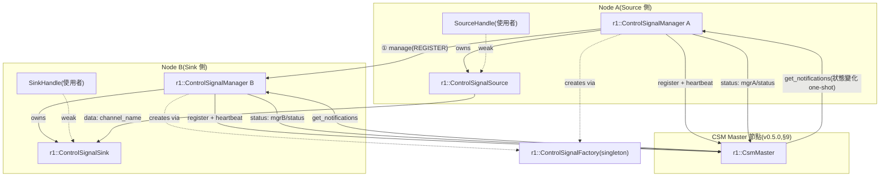
```mermaid
graph TB
    subgraph NodeA["Node A(Source 側)"]
        MA["r1::ControlSignalManager A"]
        SRC["r1::ControlSignalSource"]
        HA["SourceHandle(使用者)"]
        MA -->|owns| SRC
        HA -.weak.-> SRC
    end
    subgraph NodeB["Node B(Sink 側)"]
        MB["r1::ControlSignalManager B"]
        SNK["r1::ControlSignalSink"]
        HB["SinkHandle(使用者)"]
        MB -->|owns| SNK
        HB -.weak.-> SNK
    end
    MA -->|"① manage(REGISTER)"| MB
    SRC -->|"data: channel_name"| SNK
    subgraph Master["CSM Master 節點(v0.5.0,§9)"]
        CM["r1::CsmMaster"]
    end
    MA -->|"register + heartbeat"| CM
    MB -->|"register + heartbeat"| CM
    MA -->|"status: mgrA/status"| CM
    MB -->|"status: mgrB/status"| CM
    CM -->|"get_notifications(狀態變化 one-shot)"| MA
    CM -->|"get_notifications"| MB
    F["r1::ControlSignalFactory(singleton)"]
    MA -.creates via.-> F
    MB -.creates via.-> F
```

- v0.5.0 起 **CSM 之間不互訂 status**；status 唯一訂閱者為 CSM Master。
  CSM 間僅存的直接通訊 = 註冊協定(`control_signal_manage`,§2.4)與資料通道本身。

### 2.3 狀態機(4 態)

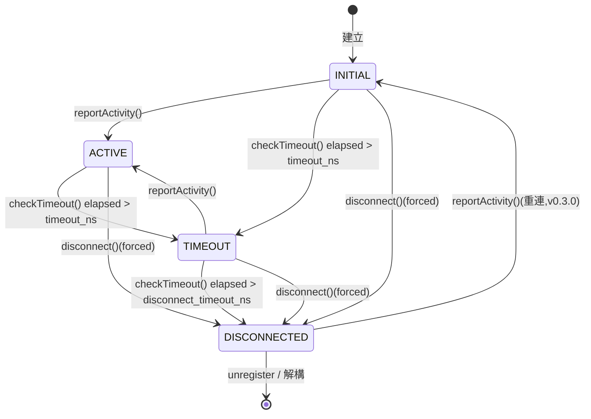
```mermaid
stateDiagram-v2
    [*] --> INITIAL : 建立
    INITIAL --> ACTIVE : reportActivity()
    INITIAL --> TIMEOUT : checkTimeout() elapsed > timeout_ns
    ACTIVE --> TIMEOUT : checkTimeout() elapsed > timeout_ns
    TIMEOUT --> ACTIVE : reportActivity()
    TIMEOUT --> DISCONNECTED : checkTimeout() elapsed > disconnect_timeout_ns
    INITIAL --> DISCONNECTED : disconnect()(forced)
    ACTIVE --> DISCONNECTED : disconnect()(forced)
    TIMEOUT --> DISCONNECTED : disconnect()(forced)
    DISCONNECTED --> INITIAL : reportActivity()(重連,v0.3.0)
    DISCONNECTED --> [*] : unregister / 解構
```

- 移除 LOW_FREQ:rv2 中它由 `timeout_ns/2` 寫死推導、不影響任何決策,只增加狀態機複雜度。
  頻率監控若有需求,由上層以 `lastActivityNs()` 自行判讀(§4 提供查詢)。
- UNKNOWN 改名 **INITIAL**(v0.2.0):物件建構後、首次活動前的狀態,我們**確知**其意義,
  「UNKNOWN」名不符實。rv2 另有雙重語意問題——`getSourceState()` 查無 entry 也回 UNKNOWN,
  與初始態混淆；r1 拆開:enum 用 INITIAL,查詢 API 以 `std::optional`(nullopt = 查無)表達(§8.2)。
  轉移語意不變:INITIAL 完整繼承原 UNKNOWN 的三條出邊。
- **雙獨立閾值 timeout**(v0.5.0,my_note Timeout Mechanism):同一 `elapsed = now − lastActivity`
  比對兩個閾值——`elapsed > timeout_ns` → TIMEOUT(data-rate timeout)；
  `elapsed > disconnect_timeout_ns` → DISCONNECTED(disconnect timeout,優先判定)。
  取代 rv2 / v0.4.0 之前的「TIMEOUT **持續**超過 disconnect_timeout 才斷線」疊加計時——
  CSM 不再需要 per-entity 追蹤 TIMEOUT 起始時間,判定全部內聚於 `LivenessState::checkTimeout()`。
  兩閾值皆支援 **`0` = 停用**(§2.3.1 變體)；皆啟用時仍要求 `disconnect > timeout`(§3.2)。
- 「forced disconnect」(my_note Timeout #4):`disconnect()` API 為獨立轉移來源
  (CSM 內部管理決策；使用者層 API 尚未開放,見 §12 #8),與閾值機制並存；所有變體皆保留此邊。
- DISCONNECTED 改為**休眠態**(v0.3.0,my_note FSM #3):不再是無出邊終態。
  重連(收到活動)→ 回 **INITIAL**(本次活動記入 lastActivity；後續活動才轉 ACTIVE,
  讓不穩定連線需「連續」活動才回到 ACTIVE)。entry 不因斷線被移除——
  不穩定連線在 TIMEOUT/DISCONNECTED/INITIAL 之間反覆轉換,map entry 常駐,
  避免 rv2 的頻繁 add/remove(含跨 CSM 重新註冊)開銷與識別鍵競爭。
  移除只發生於顯式 `unregisterSource()` 或 Manager 解構。
  上層消費者應將 DISCONNECTED 的 sink 視為不可用——效果等同移除,但具備自癒能力。

#### 2.3.1 Timeout 停用之 FSM 變體(v0.5.0,my_note Timeout #3)

兩閾值各自可為 `0`(停用),共四種組態；`disconnect()`(forced)與重連邊全變體保留。

**變體 A — 兩者啟用**(`timeout_ns > 0, disconnect_timeout_ns > 0`):上圖(完整)。

**變體 B — disconnect 停用**(`timeout_ns > 0, disconnect_timeout_ns = 0`):
無自動 DISCONNECTED；最深自動狀態為 TIMEOUT。

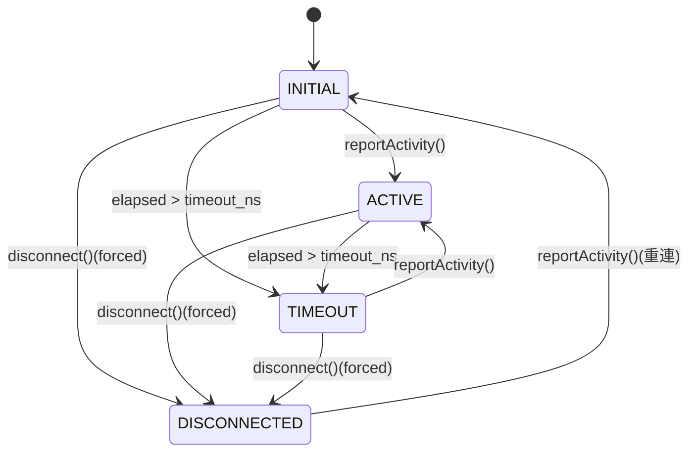
```mermaid
stateDiagram-v2
    [*] --> INITIAL
    INITIAL --> ACTIVE : reportActivity()
    INITIAL --> TIMEOUT : elapsed > timeout_ns
    ACTIVE --> TIMEOUT : elapsed > timeout_ns
    TIMEOUT --> ACTIVE : reportActivity()
    INITIAL --> DISCONNECTED : disconnect()(forced)
    ACTIVE --> DISCONNECTED : disconnect()(forced)
    TIMEOUT --> DISCONNECTED : disconnect()(forced)
    DISCONNECTED --> INITIAL : reportActivity()(重連)
```

**變體 C — data-rate timeout 停用**(`timeout_ns = 0, disconnect_timeout_ns > 0`):
TIMEOUT 態不可達；elapsed 超過 disconnect 閾值直接休眠(適合「只要最終斷線判定、
不需中間警示」的通道)。

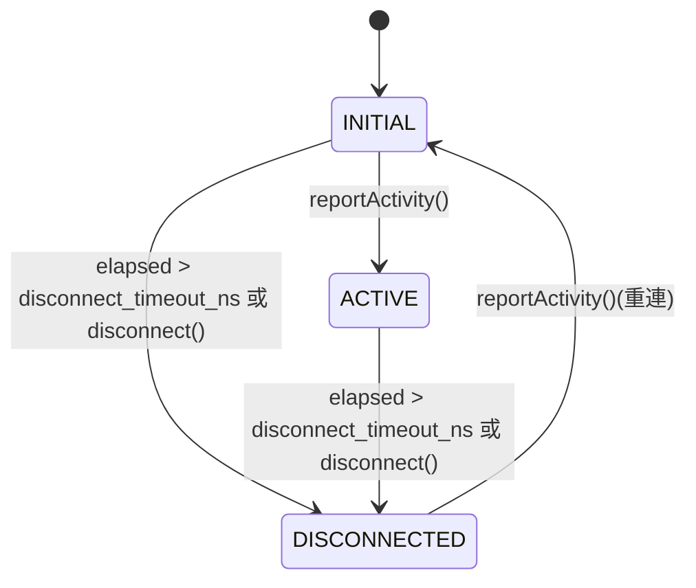
```mermaid
stateDiagram-v2
    [*] --> INITIAL
    INITIAL --> ACTIVE : reportActivity()
    INITIAL --> DISCONNECTED : elapsed > disconnect_timeout_ns 或 disconnect()
    ACTIVE --> DISCONNECTED : elapsed > disconnect_timeout_ns 或 disconnect()
    DISCONNECTED --> INITIAL : reportActivity()(重連)
```

**變體 D — 兩者停用**(`timeout_ns = 0, disconnect_timeout_ns = 0`):
無任何自動逾時；只有 forced `disconnect()` 能離開 INITIAL/ACTIVE
(適合離散事件型通道,例如單次事件型指令)。

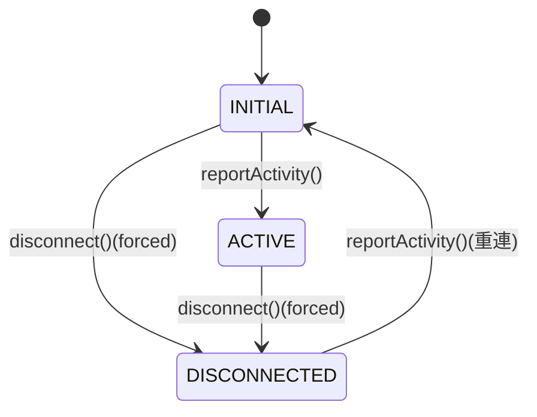
```mermaid
stateDiagram-v2
    [*] --> INITIAL
    INITIAL --> ACTIVE : reportActivity()
    INITIAL --> DISCONNECTED : disconnect()(forced)
    ACTIVE --> DISCONNECTED : disconnect()(forced)
    DISCONNECTED --> INITIAL : reportActivity()(重連)
```

實作註記:四變體共用同一 `checkTimeout(now, timeoutNs, disconnectNs)`——閾值為 0 即跳過
該項比對,**不是**四份狀態機；變體只是參數化行為的可視化。單元測試逐變體驗證(§4.5)。

### 2.4 註冊協定(兩階段 + rollback)

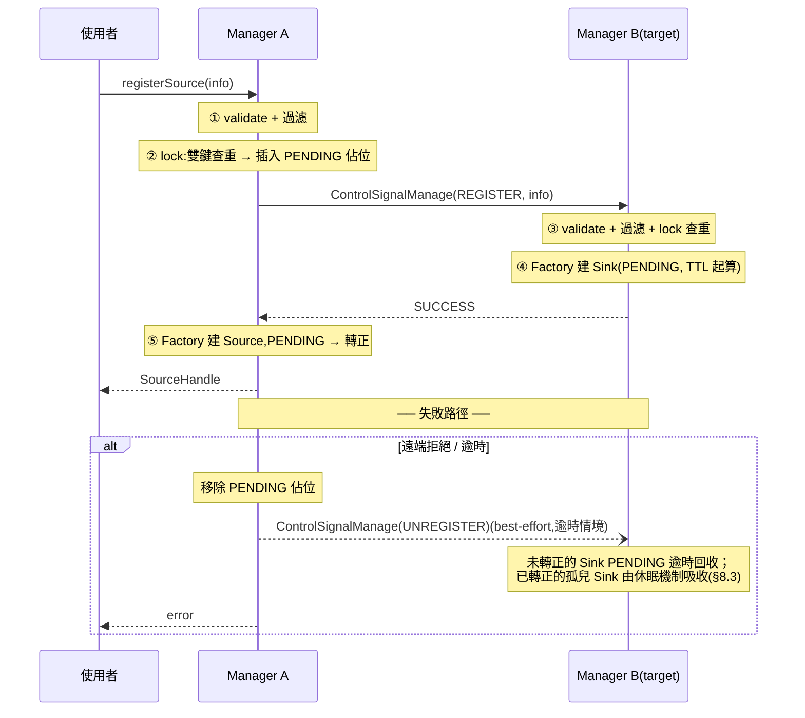
```mermaid
sequenceDiagram
    participant U as 使用者
    participant MA as Manager A
    participant MB as Manager B(target)

    U->>MA: registerSource(info)
    Note over MA: ① validate + 過濾
    Note over MA: ② lock:雙鍵查重 → 插入 PENDING 佔位
    MA->>MB: ControlSignalManage(REGISTER, info)
    Note over MB: ③ validate + 過濾 + lock 查重
    Note over MB: ④ Factory 建 Sink(PENDING, TTL 起算)
    MB-->>MA: SUCCESS
    Note over MA: ⑤ Factory 建 Source,PENDING → 轉正
    MA-->>U: SourceHandle

    Note over MA,MB: ── 失敗路徑 ──
    alt 遠端拒絕 / 逾時
        Note over MA: 移除 PENDING 佔位
        MA--)MB: ControlSignalManage(UNREGISTER)(best-effort,逾時情境)
        Note over MB: 未轉正的 Sink PENDING 逾時回收；<br/>已轉正的孤兒 Sink 由休眠機制吸收(§8.3)
        MA-->>U: error
    end
```

- **佔位(PENDING)** 在持鎖下完成雙鍵(controller_name + channel_name)查重與插入,
  消除 rv2 的 TOCTOU；之後的遠端等待不持鎖。
- 逾時屬「結果不明」:同時做本地回收 + best-effort UNREGISTER + 依賴遠端 TTL,三重保險。
- `unregisterSource(handle)`:本地 shutdown + erase,並向 target 發 UNREGISTER。

### 2.5 Liveness 協定(v0.5.0 改版:CSM Master 集中式)

v0.3.0 的「CSM 互訂 status」與 v0.4.0 的「點對點 NOTIFY_ABNORMAL」在多 CSM 拓撲下
的連線數與通知路徑隨 CSM 數量以 O(N²) 成長(my_note:3 個 CSM 互為 source/target 時,
每個 CSM 須同時管理多個入站異常與多個出站通知)。v0.5.0 改為**集中式**:

- 每個 CSM 啟動時向 **CSM Master** 註冊(`/csm_master/register`),
  之後每個 status tick 呼叫 `/csm_master/heartbeat`(`srv/r1/CsmHeartbeat`,request 攜帶 csm_name)——
  CSM 藉 response 確認 master 在線；master 藉請求到達確認 CSM 存活。
- CSM 照常發布 `<name>/status`(§2.5.1)；**唯一訂閱者為 master**,CSM 之間互不訂閱。
- Master 以 `controller_name`(全系統唯一)配對 Source-Sink,任一側狀態變化 →
  **one-shot** 呼叫**雙方** CSM 的 `/<csm_name>/get_notifications` 推送(§9)。

| 對象 | 機制 | 判定 |
|---|---|---|
| Sink | **資料驅動**(主):任何收訊 → `reportActivity()`；master 通知(輔) | `checkTimeout()` 雙閾值(§2.3)；通知 → 加速判定 / 觀測對側 |
| Source(topic 模式) | **master 通知**:配對 Sink 異常 / 對向 CSM 失聯 → 注入；自身 elapsed 不參與判定(§5.3,tick 跳過其 checkTimeout) | 通知內容映射:對側 TIMEOUT/DISCONNECTED → 本地 `checkTimeout()` 加速；CSM 失聯 → 該 CSM 全部配對 entity 注入 TIMEOUT |
| Source(service 模式) | service response(成功 → activity)+ master 通知 | response 逾時記 TIMEOUT；其餘同上 |
| 兩者 | 自身 elapsed 雙閾值(§2.3) | TIMEOUT / DISCONNECTED(休眠,不移除) |
| 重連 | 恢復收訊 / master 通知對側復原 | DISCONNECTED → INITIAL → (活動) → ACTIVE |

- **Master 失聯時(degraded mode)**:CSM heartbeat 得不到 response → log warning,
  本地判定(資料驅動 + 雙閾值)照常運作；僅失去「對側視角」通知。
  master 回線後 heartbeat 恢復,通知續傳(master 重新收 status 重建配對表)。
- Topic-模式 Source 在 degraded mode 下無任何活性來源(v0.3.0 link 已移除)→
  維持 INITIAL/最後狀態；此為集中式的取捨,列 §12 未決(是否補本地 fallback)。

#### 2.5.1 ManagerStatus 訊息(my_note #4,新設計)

`rv2_interfaces/msg/r1/ManagerStatus.msg`(取代 v0.2.0 的空 ManagerHeartbeat):

```
# 每 status_interval 發布於 <manager_name>/status
string manager_name
builtin_interfaces/Time stamp
r1/EntryStatus[] sources
r1/EntryStatus[] sinks
```

`rv2_interfaces/msg/r1/EntryStatus.msg`:

```
string manager_name         # 所屬 CSM(v0.5.0;master 配對與通知定位用)
string controller_name
string channel_name
string type                 # factory 型別鍵
string mode                 # topic / service
bool   is_source            # v0.5.0:master 配對方向判別
int8   state                # 0=INITIAL 1=ACTIVE 2=TIMEOUT 3=DISCONNECTED(常數)
float32 data_rate_hz        # 實測速率:Sink = 收訊率(§6);Source = send 呼叫率(§5,v0.4.0)
int8   priority
```

- 接收端(master)用途:CSM 活性佐證、配對表更新、狀態變化偵測(§9)。
- 頻寬:entry 數大時可調升 `statusIntervalMs`(Manager 參數)；訊息內容為
  輕量 metadata,200ms × 數十 entries 規模無虞。
- `control_signal_info_req` service 保留(pull 式完整 Info 查詢；status 為 push 式輕量摘要)。
- **狀態計算與快取**(v0.4.0,my_note Heartbeat #1):status tick 對每個 entity 呼叫其
  非公開 `_calcRate()`(friend,§5/§6)——計算實測 rate、執行雙閾值逾時檢查、回傳
  `{state, rateHz}`；結果**per-entity 快取**於 CSM(組裝 ManagerStatus 直接取用)。
- 異常偵測與通知職責(v0.5.0)**上移至 master**:CSM 只發 status,
  變化比對、配對、one-shot 通知全在 master(§9)；CSM 被動接收 `get_notifications`。

#### 2.5.2 服務介面欄位定義(v1.0.0)

`srv/r1/ControlSignalManage.srv`:

```
int8 op                          # 0 = REGISTER, 1 = UNREGISTER(常數定義於 srv)
string source_manager_name       # 發起方 Manager 名
r1/ControlSignalInfo info        # REGISTER:完整描述子;UNREGISTER:僅需 controller_name 有效
---
int8 response                    # SUCCESS / REJECTED / ERROR(常數)
string reason                    # 失敗原因;成功時為空
```

`srv/r1/ControlSignalInfoReq.srv`:

```
---
int8 response
r1/ControlSignalInfo[] source_list
r1/ControlSignalInfo[] sink_list
```

`srv/r1/CsmRegister.srv`:

```
string csm_name
---
int8 response
string reason
```

`srv/r1/CsmHeartbeat.srv`:

```
string csm_name                  # master 以此定位 CsmRecord(Trigger 無法攜帶身分,故自訂)
---
bool success                     # 恆 true;response 到達本身即為 master 在線證明
```

`srv/r1/CsmNotify.srv`:

```
r1/EntryStatus[] entries         # 狀態變化清單;EntryStatus.manager_name 標示歸屬
---
int8 response
```

### 2.6 執行緒模型

- 本庫**不建立任何執行緒**(承襲 rv2)；一切依附 node executor。
- **Manager 單一 timer**(v0.3.0):status tick 一個 timer 完成全部週期工作——
  發布 ManagerStatus、link 檢查、entities 掃描(timeout / disconnect 判定)。
  取代 v0.2.0 的 statusTimer + heartbeatTimer 雙 timer；endpoint 依然零 timer。
- **Callback group 策略**:
  - Manager 的 service servers(manage / info_req / get_notifications)、master clients
    (register / heartbeat)、status timer:放入 Manager 自建的
    **Reentrant group**(建構子建立),與使用者 node 的預設 group 隔離。
  - Source/Sink 的資料 pub/sub/service:預設 group(維持與使用者 callback 相同的互斥行為,符合 rclcpp 預設慣例)。
- 文件化硬規則 + debug assert:
  - `registerSource()` / `unregisterSource()` **禁止**在任何 ROS callback 內呼叫。
  - service 模式 `send()` 為阻塞呼叫,禁止在 callback 內呼叫。
- Manager 掃描 timer 於鎖內完成 snapshot 後才 log,無鎖外 map 存取。

---

## 3. `r1::ControlSignalInfo` 與驗證

### 3.1 訊息欄位(8 欄)

`rv2_interfaces/msg/r1/ControlSignalInfo.msg`

| 欄位 | 型別 | 說明 |
|---|---|---|
| `controller_name` | string | **必填、主鍵**。全系統唯一；Manager 之 map 鍵、黑白名單鍵 |
| `channel_name` | string | **必填、唯一**。資料 topic / service 名稱 |
| `target_manager_name` | string | 註冊時必填；Sink 所在 Manager 名 |
| `mode` | string | `"topic"` / `"service"`(常數定義於 msg) |
| `type` | string | Factory 型別鍵(`"joy"` / `"twist"` / `"string"` / …) |
| `priority` | int8 | **通用欄位,0–100**:0 = invalid(註冊拒絕),100 = 最高優先,值大者優先。僅攜帶轉發,**不影響傳輸行為**；語意由上層消費者自行定義(v0.7.0,不再綁定特定系統的頻帶約定) |
| `timeout_ns` | int64 | data-rate timeout 閾值；**0 = 停用**(v0.5.0,§2.3.1)。service 模式亦為 response 等待上限(0 時 service 模式拒絕註冊,見 §3.2 規則 5) |
| `disconnect_timeout_ns` | int64 | disconnect timeout 閾值；**0 = 停用**(永不自動轉入 DISCONNECTED,§2.3.1 變體 B)；兩者皆 > 0 時須 > `timeout_ns`(§3.2 規則 5) |

刪除(相對 rv2):`send_freq_hz`(從未驅動狀態機)、`use_keep_alive` / `keep_alive_interval_ns`
(改為 Manager 參數)、`controller_priority_type`(類別上限屬約定,降為文件層)。

### 3.2 驗證規則(6 條)

`validateControlSignalInfo(info)` → `{bool valid; std::string error;}`

1. `controller_name` 非空。
2. `channel_name` 非空。
3. `mode` ∈ {topic, service}；`type` 非空。
4. `priority` ∈ [1, 100](0 = invalid,負值與大於 100 者拒絕)。
5. `timeout_ns ≥ 0`、`disconnect_timeout_ns ≥ 0`(0 = 各自停用,§2.3.1)；
   兩者皆 > 0 時 `disconnect_timeout_ns > timeout_ns`；
   `mode == service` 時 `timeout_ns > 0`(response 等待上限不可停用)。
6. `registerSource` 路徑:`target_manager_name` 非空；
   `_onManage(REGISTER)` 側另驗證其等於本 Manager 名(mis-route 防護)。

### 3.3 單元測試方法與流程

- **框架**:gtest；**純邏輯、不需 rclcpp init**(msg struct 直接填欄位)。
- 流程:builder helper `makeR1Info()` 給合法預設 → 逐條規則做「單欄位破壞」測試,
  驗證 `valid == false` 且 `error` 指名該欄位；全合法組合驗證 `valid == true`。
- 案例表:

| 案例 | 修改 | 預期 |
|---|---|---|
| V1 | 全預設 | valid |
| V2 | `controller_name = ""` | invalid, error 含 "controller_name" |
| V3 | `channel_name = ""` | invalid |
| V4 | `mode = "unknown"` | invalid |
| V5 | `priority` ∈ {0, -1, 101, 127} | invalid(4 子案例) |
| V6 | `priority` ∈ {1, 100} | valid(邊界) |
| V7 | `timeout_ns = 0`(topic 模式) | valid(停用,v0.5.0)；`mode = service` 時 invalid |
| V8 | `disconnect_timeout_ns = timeout_ns`(皆 > 0) | invalid(須嚴格大於) |
| V9 | `disconnect_timeout_ns = 0` | valid(停用) |
| V10 | `timeout_ns = 0, disconnect_timeout_ns > 0`(topic) | valid(變體 C) |
| V11 | `target_manager_name = ""`(registerSource 路徑) | invalid |

---

## 4. `r1::LivenessState`

### 4.1 職責

單一類別封裝 4 態狀態機 + 活動時間戳,是**全系統唯一**允許改變狀態的地方。
純 C++、無 ROS 依賴 → 可完整單元測試。

### 4.2 設計

- 內部兩個 atomic(**定案布局**,不採單字 48-bit 壓縮方案——犧牲些微效能換可讀性與完整 ns 精度):
  - `std::atomic<uint64_t> packed_`:`[ state:8 | epoch:56 ]`
  - `std::atomic<int64_t>  lastActivityNs_`
- 所有轉移走 **CAS loop**,規則:
  1. load `packed_`(acquire)→ 查轉移表 → 允許才 `compare_exchange_strong`(acq_rel),
     expect = snapshot 完整值(state+epoch)。
  2. **每次成功轉移 epoch+1**(reportActivity、checkTimeout 的 →TIMEOUT、disconnect 皆同),
     雙向防 ABA。
  3. `reportActivity()`:先 store `lastActivityNs_`(release)再 CAS 狀態；
     `checkTimeout()`:先 load `packed_`(acquire)再 load 時間戳、算 elapsed,
     成立才以 snapshot 為 expect 執行 CAS。若期間 `reportActivity()` 已先完成轉移
     (epoch 已遞增),CAS 失敗,重新讀取後判定不成立,狀態保持 ACTIVE。
     此機制消除 stale-TIMEOUT 覆寫。
- 時間來源:`steadyNs()` 由呼叫端注入(參數傳入),elapsed 判定因此可注入假時鐘、完全 deterministic；
  交錯順序類測試(誰先誰後)以壓力迴圈 + TSan 覆蓋。

### 4.3 類別介面

```cpp
namespace r1 {

enum class ControlSignalState : uint8_t { INITIAL, ACTIVE, TIMEOUT, DISCONNECTED };

class LivenessState
{
public:
    explicit LivenessState(int64_t nowNs);

    /// 收訊 / 心跳 / 成功 response。
    /// 非 DISCONNECTED → ACTIVE;DISCONNECTED → INITIAL(重連,v0.3.0)。
    /// 回傳轉移後狀態(呼叫端可據此辨識重連事件)。
    ControlSignalState reportActivity(int64_t nowNs);

    /// 被動逾時檢查;必要時執行 {INITIAL,ACTIVE}→TIMEOUT。回傳檢查後狀態。
    /// 雙閾值(v0.5.0):0 = 該項停用。disconnect 判定優先於 timeout。
    ControlSignalState checkTimeout(int64_t nowNs, int64_t timeoutNs, int64_t disconnectNs);

    /// 休眠態;冪等。回傳是否由本次呼叫完成轉移。
    /// 非終態(v0.3.0):之後 reportActivity() 可重連回 INITIAL。
    bool disconnect();

    ControlSignalState state() const;        // load(acquire),不觸發檢查
    int64_t lastActivityNs() const;          // 供上層做頻率監控(取代 LOW_FREQ)

private:
    std::atomic<uint64_t> packed_;           // state + epoch
    std::atomic<int64_t>  lastActivityNs_;
};

} // namespace r1
```

### 4.4 行為細節

- `checkTimeout(now, timeoutNs, disconnectNs)`(v0.5.0 雙閾值):snapshot(state, epoch)
  → 計算 `elapsed = now - lastActivity` → 依序判定(0 = 跳過該項):
  1. `disconnectNs > 0 && elapsed > disconnectNs` 且 state ∈ {INITIAL, ACTIVE, TIMEOUT}
     → CAS 寫入 DISCONNECTED(優先判定；變體 C 由此路徑直接進入休眠)。
  2. 否則 `timeoutNs > 0 && elapsed > timeoutNs` 且 state ∈ {INITIAL, ACTIVE}
     → CAS 寫入 TIMEOUT。
  期間若 `reportActivity()` 已先完成轉移(epoch 遞增),CAS 失敗,重新讀取後判定不成立,
  狀態保持 ACTIVE。雙閾值取代 v0.4.0 之前由 CSM 執行的「TIMEOUT 持續計時」判定,
  逾時判定完整內聚於本類,CSM 不需追蹤 TIMEOUT 起始時間。
- `reportActivity()`:非 DISCONNECTED 態 → ACTIVE(epoch+1)；
  **DISCONNECTED → INITIAL**(epoch+1,重連,v0.3.0；本次活動記入 lastActivity)。
  重連進入 INITIAL 而非 ACTIVE:單一訊息不足以判定連線恢復,需後續活動才轉 ACTIVE；
  若無後續活動,INITIAL 依逾時規則回到 TIMEOUT 與 DISCONNECTED。
  不穩定連線的狀態變化全程發生於狀態機內,entry 常駐,不進行 add/remove。
- `disconnect()`:CAS 至 DISCONNECTED(**休眠態**,非終態)；
  `checkTimeout()` 於 DISCONNECTED 不動作；唯一出路為 `reportActivity()`(→ INITIAL)。
  物件移除(unregister / 解構)是 Manager 層行為,與狀態機解耦。

### 4.5 單元測試方法與流程

- **框架**:gtest,純邏輯 + 假時鐘(手動遞增的 int64)。並發測試用 `std::thread`。
- 流程:
  1. **轉移表窮舉**:4 態 × 3 操作全組合,驗證合法轉移與拒絕(含 DISCONNECTED 休眠語意:checkTimeout() 不動作,唯一出路為 reportActivity() → INITIAL)。
  2. **逾時語意**:INITIAL 自建構起算逾時；ACTIVE 依 lastActivity；邊界 `elapsed == timeout` 不觸發。
  3. **stale-TIMEOUT 回歸測試**(對應 rv2 稽核發現):執行緒 A 進入 checkTimeout 且已完成
    snapshot(以 hook / 兩步 API 或高頻壓力重現),執行緒 B reportActivity → 斷言最終態 ACTIVE。
    壓力版:1 writer 高頻 reportActivity + N checker 高頻 checkTimeout(短 timeout),
    每輪結束時只要「最後一次操作是 activity」即斷言 ACTIVE；跑 10⁵ 輪。
  4. **disconnect 並發**:disconnect 與 reportActivity 併發 10⁵ 輪,斷言終態恆 DISCONNECTED。
  5. TSan job(見 §11.4)覆蓋本類所有並發測試。

| 案例 | 內容 | 預期 |
|---|---|---|
| L1 | 初始 | INITIAL |
| L2 | reportActivity | → ACTIVE(回傳 ACTIVE) |
| L3 | checkTimeout(elapsed > t) | ACTIVE → TIMEOUT |
| L4 | TIMEOUT 後 reportActivity | → ACTIVE |
| L5 | disconnect 後 checkTimeout | DISCONNECTED(不動作) |
| L6 | INITIAL + elapsed > t | → TIMEOUT |
| L7 | 併發 stale-TIMEOUT 壓力 | 無 ACTIVE 被舊判定覆寫 |
| L8 | 併發 disconnect 壓力 | 掃描期間狀態恆收斂 DISCONNECTED；僅 reportActivity 可離開 |
| L9 | **重連**:disconnect 後 reportActivity | → INITIAL(回傳 INITIAL)；再 reportActivity → ACTIVE |
| L10 | 重連後無後續活動 | INITIAL → TIMEOUT → DISCONNECTED,循環不需重建物件 |
| L11 | 併發 reportActivity vs disconnect 壓力 | 終局為兩者之一的合法結果；無非法狀態、epoch 單調遞增 |
| L12 | **變體 A**:elapsed 越過兩閾值 | 先 TIMEOUT(> timeout)後 DISCONNECTED(> disconnect)；單次呼叫越過兩者 → 直接 DISCONNECTED |
| L13 | **變體 B**(disconnect=0):elapsed 極大 | 停留 TIMEOUT,永不自動 DISCONNECTED |
| L14 | **變體 C**(timeout=0):elapsed > disconnect | INITIAL/ACTIVE 直接轉入 DISCONNECTED,TIMEOUT 不可達 |
| L15 | **變體 D**(皆 0):elapsed 極大 | 狀態不變；僅 disconnect() 可轉 DISCONNECTED |

### 4.6 替代方案評估:tinyFSM(v0.2.0,依 my_note.md)

評估對象:[digint/tinyfsm](https://github.com/digint/tinyfsm) — header-only、C++11 template、
零動態配置、無 RTTI/例外依賴,MIT 授權；最新版 0.3.3,其後長期無 release。

| 面向 | 評估 |
|---|---|
| Thread-safety | **無內建同步**。`LivenessState` 的核心需求正是多執行緒併發轉移(使用者執行緒 `checkTimeout` vs executor 執行緒 `reportActivity`)；採 tinyfsm 仍須自行外包 mutex 或 atomic 層——並發正確性問題原封不動回到我們手上,library 未解決本設計最難的部分 |
| 實例模型 | tinyfsm 狀態為**每個 FSM 類型的 static instance**(單例導向)；r1 每個 Source/Sink 需獨立 FSM 實例,需 workaround,與設計錯配 |
| 表達力 | epoch/CAS 防 stale-TIMEOUT 語意(帶版本的比較交換轉移)無法以 tinyfsm 的事件 dispatch 模型表達 |
| 規模 | 本狀態機僅 4 態 × 3 操作；引入外部依賴的結構開銷大於收益 |
| 維護 | 0.3.3 後長期停更,依賴風險 |

**結論:不採用**。維持 §4.2 自製 CAS 狀態機。但採納 tinyfsm 的精神——轉移表集中宣告
(constexpr 轉移表)+ 單元測試窮舉全組合(§4.5 流程 1),確保「context safety」訴求
以可驗證方式落實。若未來狀態數成長(>8 態)再重啟評估。

---

## 5. `r1::ControlSignalSource`

### 5.1 職責

控制訊號發送端。topic 模式持 `Publisher<msgT>`,service 模式持 `Client<srvT>`。
**建構子 private**；`friend class ControlSignalManager` + Factory creator 可建。
繼承 `std::enable_shared_from_this`。

### 5.2 類別架構

```cpp
namespace r1 {

/// _calcRate() 回傳的輕量快照(v0.4.0);CSM per-entity 快取此值
struct EntityStatus {
    ControlSignalState state;
    float              rateHz;
};

namespace detail {
/// Rolling-window 呼叫/收訊記錄器(v0.5.0,my_note:window size 可配置)。
/// N-bucket 環形(N 固定 8),bucket 時距 = windowNs / N;record() 對當前
/// bucket 原子遞增(過期 bucket lazy 清零);calcHz() 加總完整窗 / 窗長。
/// 純 atomic、無鎖;Source(send 記錄)與 Sink(收訊記錄)共用。
class RateRecorder {
public:
    explicit RateRecorder(int64_t windowNs);   // windowNs 來自 ManagerOptions.rateWindowNs
    void  record(int64_t nowNs);               // hot path,O(1)
    float calcHz(int64_t nowNs) const;         // cold path,_calcRate() 專用
private:
    std::array<std::atomic<uint32_t>, 8> buckets_;
    std::atomic<int64_t> bucketEpochNs_;
    const int64_t windowNs_;
};
} // namespace detail

/// per-state 轉移 callback 簽名(v0.5.0,my_note FSM #5)
using StateCb = std::function<void(const std::string& controllerName,
                                   ControlSignalState oldState,
                                   ControlSignalState newState)>;

class BaseControlSignalSource
{
public:
    virtual ~BaseControlSignalSource() = default;
    virtual ControlSignalState getState() const = 0;              // 觸發被動檢查
    virtual const msg::r1::ControlSignalInfo& getInfo() const = 0;
    virtual std::type_index msgType() const = 0;
    virtual SendResult sendErased(const void* msg) = 0;
    virtual void shutdown() = 0;          // 釋放 rclcpp entities;冪等
protected:
    BaseControlSignalSource() = default;
};

/// SendResult 取代 rv2 的 (bool return + bool& cmdSuccess) 雙輸出
enum class SendResult : uint8_t {
    OK,             // 已送出(topic)/ 對方接受(service)
    REJECTED,       // service 對方回非 SUCCESS
    NO_TRANSPORT,   // transport 不可用 / 已 shutdown
    TIMEOUT,        // service response 逾時
    DISCONNECTED    // 已被 Manager 判定斷線
};

template<typename msgT, typename srvT = void>
class ControlSignalSource : public BaseControlSignalSource,
                            public std::enable_shared_from_this<...>
{
    friend class ControlSignalManager;
    friend class ControlSignalFactory;   // creator lambda
    friend struct ManagerTestAccess;     // 測試通道(§5.4;定義僅編入測試 target)
private:
    ControlSignalSource(rclcpp::Node* node, const InfoT& info);   // private!

    rclcpp::Node*                 node_;
    InfoT                         info_;
    std::variant<PubPtr, CliPtr>  transport_;   // ClientPtrOf<void> = monostate(承襲 rv2 trait)
    LivenessState                 liveness_;
    std::atomic<bool>             shutdown_{false};

    // send 呼叫記錄(v0.4.0/v0.5.0):rolling window,大小由 ManagerOptions.rateWindowNs 配置
    detail::RateRecorder          rate_;
    std::atomic<float>            cachedRateHz_{0.f};   // _calcRate() 結果快取

    // per-state 轉移 callback(v0.5.0):每狀態一 slot;CSM 經 friend 安裝
    std::array<StateCb, 4>        stateCbs_;
    mutable std::shared_mutex     stateCbMtx_;

    /// 非公開(my_note Source #2):由 CSM status tick 呼叫(friend)。
    /// rate_.calcHz() → cachedRateHz_ → checkTimeout(雙閾值)→ 回傳 {state, rateHz};
    /// 轉移發生時 fire 對應 stateCbs_(無鎖呼叫,copy 後執行)。
    EntityStatus _calcRate(int64_t nowNs);

public:
    SendResult send(const msgT& msg);
    float sendRateHz() const;                       // 讀 cachedRateHz_,不觸發計算
    EntityStatus getStatus() const;                 // v0.5.0(my_note FSM #4):{state, cachedRate} 整合查詢
    ControlSignalState getState() const override;   // 狀態由 CSM 經 master 通知注入(§8.3):見下
    ...
};

} // namespace r1
```

### 5.3 行為細節

- **send(共通前置,v0.4.0,my_note Source #1)**:`shutdown_` 檢查 →
  `rate_.record(now)`(rolling window 原子遞增,窗長可配置)→ 進入模式分支。
- **send(topic)**:publish → `OK`。狀態不變(無 send-side 回饋；liveness 由 master 通知經 CSM 注入,§2.5/§8.3)。
- **send(service)**:`service_is_ready()` → `async_send_request` → 等待 ≤ `timeout_ns`
  (**無 50ms 隱藏 fallback**；`timeout_ns` 必填,直接使用)。
  ready → `liveness_.reportActivity()`,依 response 回 `OK`/`REJECTED`；
  逾時 → `liveness_.checkTimeout()` 語意下記為 TIMEOUT 並回 `TIMEOUT`,
  並呼叫 `client->remove_pending_request()`(rv2 稽核:pending request 洩漏)。
- **liveness 注入**(v0.5.0):Source 本身不訂閱 status、不與 master 直接通訊。
  CSM 於 `_onGetNotifications`(§8.3)收到 master 的配對狀態通知時,對相應 Source
  呼叫 `liveness_.reportActivity()` / `checkTimeout()`。Source 保持零 timer、零訂閱。
- **DISCONNECTED(休眠)下的 send**:回 `SendResult::DISCONNECTED`,拒絕發送；
  transport **保留**(v0.3.0:斷線不再 shutdown,等待 master 通知注入活動觸發重連 → INITIAL)。
- **`_calcRate()`**(v0.4.0,非公開,`friend class ControlSignalManager` 專用):
  CSM status tick 每週期呼叫一次。`rate_.calcHz(now)` → store `cachedRateHz_` →
  (service 模式)`liveness_.checkTimeout(now, timeout, disconnect)`(雙閾值)
  → 回傳 `{state, rateHz}`。**topic 模式跳過 checkTimeout**(v1.0.0):
  topic Source 無任何自主活動來源(send 無回饋),自身 elapsed 不具意義,
  若照常檢查將於建構後必然虛假逾時；其狀態完全由 master 通知注入驅動(§8.3)。
  公開 `sendRateHz()` 僅讀快取——**記錄(每次 send,O(1) atomic)與計算
  (每 tick 一次)分離**,hot path 零除法零鎖。
- **state callback fire 規則**(v0.5.0):所有經本類方法觸發的 LivenessState 轉移
  (`_calcRate` 內 checkTimeout、Manager 注入 activity/disconnect、service send 的
  reportActivity/TIMEOUT)在偵測到 old ≠ new 時,shared_lock 下 copy 對應
  `stateCbs_[new]` → **無鎖呼叫**。同一轉移恰 fire 一次(轉移由 CAS 唯一勝出者觸發)。
- **shutdown()**:僅於 unregister / 解構呼叫。置 flag → 重置 `transport_` → 之後 send 回 `NO_TRANSPORT`。
- lambda(service 模式無)一律不存在 → Source 無捕獲 `this` 的 callback。

### 5.4 單元測試方法與流程

- **框架**:gtest + `CsmTestBase`(r1 版:MultiThreadedExecutor 背景 spin)。
- **建構通道**:測試經 `ControlSignalFactory`(friend)直建,或經測試專用
  `ManagerTestAccess`(`friend struct`,只在 test build 提供)。**不開放 public 建構**。
- 流程:每案例建 node → 經 factory 建 Source(+ 對測 Sink 或 mock service)→ 操作 → 斷言。

| 案例 | 內容 | 預期 |
|---|---|---|
| S1 | topic 模式初始 | `getState() == INITIAL`；`send() == OK` |
| S2 | service 模式 send 成功 | `OK`；state → ACTIVE(reportActivity) |
| S3 | service 模式 server 回 REJECT | `REJECTED`；state 仍 ACTIVE(有 response 即活動) |
| S4 | service 模式無 server | `TIMEOUT`；state → TIMEOUT；耗時 ≈ `timeout_ns`(驗證無 50ms fallback) |
| S5 | shutdown 後 send | `NO_TRANSPORT`；冪等 shutdown |
| S6 | sendErased 型別轉發 | 與 send 等價；`msgType()` 正確 |
| S7 | Manager 注入對側逾時(checkTimeout) | state → TIMEOUT；再注入 activity → ACTIVE |
| S8 | disconnect 後 send | `DISCONNECTED`(transport 保留但拒送) |
| S9 | **重連**:disconnect 後注入 activity(master 通知) | state → INITIAL；再注入 → ACTIVE；send 恢復 `OK` |
| S10 | **send rate**:20 Hz send 2 秒後呼叫 `_calcRate()`(測試經 friend 通道) | 回傳 rateHz ∈ [18, 22]；`sendRateHz()` 讀到同值；停止 1 窗後歸 0 |
| S11 | rate 並發:高頻 send + 週期 `_calcRate()` + 高頻 `sendRateHz()` | 無 race(TSan)；快取值單調收斂 |
| S12 | **state callback**:註冊 TIMEOUT/ACTIVE slot,驅動轉移 | 每次轉移恰觸發一次、old/new 正確；未註冊 slot 無動作；nullptr 清除 |
| S13 | **window 配置**:rateWindowNs 0.5s vs 2s | calcHz 收斂時間與窗長一致；`getStatus()` 回 {state, rate} 一致 |

---

## 6. `r1::ControlSignalSink`

### 6.1 職責

控制訊號接收端。topic 模式持 `Subscription<msgT>`,service 模式持 `Service<srvT>`。
建構子 private；`enable_shared_from_this`；**零 timer**(keep-alive timer 已移除)。

### 6.2 類別架構

```cpp
namespace r1 {

class BaseControlSignalSink
{
public:
    using ErasedMsgCb = std::function<void(const void*, const msg::r1::ControlSignalInfo&)>;
    virtual ~BaseControlSignalSink() = default;
    virtual ControlSignalState getState() const = 0;
    virtual const msg::r1::ControlSignalInfo& getInfo() const = 0;
    virtual std::type_index msgType() const = 0;
    virtual bool readErased(void* outMsg) const = 0;   // true 僅當 ACTIVE
    virtual void setErasedMsgCallback(ErasedMsgCb cb) = 0;
    virtual void shutdown() = 0;
protected:
    BaseControlSignalSink() = default;
};

template<typename msgT, typename srvT = void>
class ControlSignalSink : public BaseControlSignalSink,
                          public std::enable_shared_from_this<...>
{
    friend class ControlSignalManager;
    friend class ControlSignalFactory;
    friend struct ManagerTestAccess;     // 測試通道(§5.4)
public:
    using MsgCb = std::function<void(const msgT&, const InfoT&)>;
private:
    ControlSignalSink(rclcpp::Node* node, const InfoT& info);

    std::variant<SubPtr, SrvPtr> transport_;
    LivenessState                liveness_;
    mutable std::mutex           msgMtx_;      // 僅護 latestMsg_
    std::optional<msgT>          latestMsg_;
    mutable std::mutex           cbMtx_;       // 僅護 msgCb_
    MsgCb                        msgCb_;
    std::atomic<bool>            shutdown_{false};
    // 收訊記錄(v0.5.0):rolling window,窗長由 ManagerOptions.rateWindowNs 配置
    detail::RateRecorder         rate_;
    std::atomic<float>           cachedRateHz_{0.f};  // _calcRate() 結果快取(v0.4.0)
    // per-state 轉移 callback(v0.5.0):同 Source 樣式
    std::array<StateCb, 4>       stateCbs_;
    mutable std::shared_mutex    stateCbMtx_;
    // waitForMessage(v0.4.0):序號 + condition variable(msgMtx_ 為其鎖)
    std::atomic<uint64_t>        msgSeq_{0};
    mutable std::condition_variable msgCv_;

    /// 非公開(my_note Sink #3):CSM status tick 呼叫(friend)。
    /// 計算收訊率 → cachedRateHz_ → checkTimeout → 回傳 {state, rateHz}。
    EntityStatus _calcRate(int64_t nowNs);
public:
    bool read(msgT& out) const;
    /// 阻塞等待「呼叫之後」的下一筆訊息(my_note Sink #2)。
    /// timeoutNs 0 = 無限等;收到 → true + out;逾時 / shutdown → false。
    bool waitForMessage(msgT& out, int64_t timeoutNs = 0) const;
    float dataRateHz() const;                  // 讀 cachedRateHz_,不觸發計算
    EntityStatus getStatus() const;            // v0.5.0:{state, cachedRate} 整合查詢
    void setMsgCallback(MsgCb cb);
    ...
};

} // namespace r1
```

### 6.3 行為細節

- **收訊路徑 `_store()`**(v0.3.0 固定順序,my_note Sink #2):lambda 捕獲 `weak_ptr`,
  lock 失敗即 return。成功後:
  1. **`rate_.record(now)`(前置小函數)**:記錄時間與次數(rolling window 原子遞增,
     窗長可配置),永遠第一步。
  2. `msgMtx_` 下寫 `latestMsg_`,`msgSeq_`+1 → **`msgCv_.notify_all()`**(喚醒 waitForMessage)。
  3. `liveness_.reportActivity()` —— 一般態 → ACTIVE；**DISCONNECTED → INITIAL(重連)**,
     訊息照存(資料真實有效)；轉移結果記入 log(重連事件可觀測)。
  4. cbMtx_ 下 copy callback → **無鎖呼叫** callback(承襲 rv2 正確做法)。
  rv2 稽核所列「DISCONNECTED 狀態被收訊路徑覆寫」問題在 r1 成為受控行為:
  狀態恢復必須經由狀態機的合法轉移(進入 INITIAL,而非直接轉 ACTIVE),
  轉移語意集中於 `LivenessState`。
- **rate 記錄與計算分離**(v0.4.0,my_note Sink #1/#3):hot path 只做 O(1) 原子遞增；
  計算集中在非公開 **`_calcRate()`**,由 CSM status tick 每週期呼叫一次(friend):
  `rate_.calcHz(now)` → store `cachedRateHz_` → `checkTimeout(雙閾值)` →
  回傳 `{state, rateHz}` 供 CSM 快取與發布(§2.5.1)。公開 `dataRateHz()` 僅讀快取。
- **state callback fire 規則**(v0.5.0):同 §5.3——所有經 `_store`/`_calcRate`/
  Manager 注入的轉移,old ≠ new 時 copy `stateCbs_[new]` 無鎖呼叫,恰一次。
- **`waitForMessage(out, timeoutNs)`**(v0.4.0,my_note Sink #2):
  進入時 snapshot `seq0 = msgSeq_` → `std::unique_lock<std::mutex> lk(msgMtx_)` →
  `msgCv_.wait[_for](lk, pred)`,pred = `msgSeq_ > seq0 || shutdown_`。
  以**序號**為條件:免疫 spurious wakeup、無 lost-wakeup(notify 在持鎖遞增 seq 之後)。
  滿足且非 shutdown → copy `latestMsg_` 回 true；逾時或 shutdown → false。
  `shutdown()` 置 flag 後 `notify_all()`,等待者即刻退出(RAII:解構前 shutdown 保證無滯留等待者)。
  ⚠ 阻塞呼叫:禁止在任何 ROS callback 內使用(同 `registerSource` 規則,§2.6)。
- **read()**:`checkTimeout()` → msgMtx_ 下 copy → 僅 ACTIVE 回 true。
  首訊息視窗安全性由「ACTIVE 只在 `latestMsg_` 寫入後設定」保證(rv2 已證明,保留同序)。
- **service 模式**:server callback `_store(req->data)` 後回 `SRV_RES_SUCCESS`；
  DISCONNECTED 下收到 request = 重連事件,同 `_store` 流程(回 SUCCESS)。
- PENDING TTL(§2.4):由 Manager 側追蹤,Sink 本身不管。

### 6.4 單元測試方法與流程

- 同 §5.4 環境；對測用 factory 直建的 Source 或裸 `rclcpp` publisher/client(mock 上游)。

| 案例 | 內容 | 預期 |
|---|---|---|
| K1 | 初始 | INITIAL；`read() == false`,out 為預設值 |
| K2 | 收first訊息 | ACTIVE；read true + 內容正確 |
| K3 | 停止發送 elapsed > timeout | TIMEOUT；read false(內容仍為最後值) |
| K4 | TIMEOUT 後恢復發送 | → ACTIVE |
| K5 | callback:註冊後每訊息觸發、nullptr 清除、replace 語意 | 觸發次數/內容正確 |
| K6 | callback 內 re-enter(呼叫 read/getState) | 無死鎖(callback 無鎖呼叫的回歸測試) |
| K7 | service 模式 round-trip | request data == read 內容；response SUCCESS |
| K8 | **重連**:disconnect 後收訊 | 狀態 → INITIAL、訊息已存(read 仍 false)、callback 觸發；續發 → ACTIVE、read true |
| K9 | shutdown 後上游持續發送 | 無 callback、無狀態變化(subscription 已釋放) |
| K10 | weak-capture UAF 回歸:高頻收訊中 Manager 移除 Sink | 無 crash(ASan/TSan job) |
| K11 | **data rate**:20 Hz 發送 2 秒後呼 `_calcRate()`(friend 通道) | 回傳 ∈ [18, 22]；`dataRateHz()` 同值；停止 1 窗後歸 0 |
| K12 | rate 並發:高頻收訊 + 週期 `_calcRate()` + 高頻 `dataRateHz()` | 無 race(TSan) |
| K13 | **waitForMessage**:等待中發送一筆 | 即刻返回 true、內容正確；逾時版在無訊息時 ≈ timeoutNs 返回 false |
| K14 | waitForMessage 喚醒語意:等待前已存在的舊訊息 | 不觸發(只等「呼叫後」新訊息)；並發多等待者全部喚醒 |
| K15 | waitForMessage + shutdown | 等待者即刻返回 false；無 deadlock、無 UAF(ASan) |

---

## 7. `r1::ControlSignalFactory`

### 7.1 職責

執行期型別字串 → 編譯期 `(MsgT, SrvT)` 的註冊表。承襲 rv2 設計(已驗證良好),差異:

- creator 回傳 `std::shared_ptr`(rv2 為 `unique_ptr`；r1 的 enable_shared_from_this 需要)。
- `Register()` 重複註冊改為**記 log 並拒絕**(rv2 靜默覆蓋)。
- `CreateSource/CreateSink` 不丟例外,回傳 `nullptr` + error out-param(精簡呼叫端 try/catch)。

### 7.2 類別介面

```cpp
class ControlSignalFactory
{
public:
    static ControlSignalFactory& Instance();      // 定義於 .cpp(shared library 單一定義,承襲 rv2)

    template<typename MsgT, typename SrvT = void>
    bool Register(const std::string& name);       // false = 名稱已存在

    std::shared_ptr<BaseControlSignalSource>
    CreateSource(const std::string& type, rclcpp::Node*, const InfoT&,
                 std::string* errOut = nullptr) noexcept;
    std::shared_ptr<BaseControlSignalSink>
    CreateSink(const std::string& type, rclcpp::Node*, const InfoT&,
               std::string* errOut = nullptr) noexcept;

    std::string typeKey(std::type_index) const;   // 反查;未註冊回 ""
    bool has(const std::string& type) const;
};

#define R1_REGISTER_CONTROL_SIGNAL(UniqueId, name_str, MsgType, SrvType) ...
```

`src/r1/control_signal_types.cpp` 註冊 joy / twist / string(string topic-only,`void`)。

### 7.3 單元測試方法與流程

- gtest + 單 node(需 rclcpp init,不需跨 node)。

| 案例 | 內容 | 預期 |
|---|---|---|
| F1 | Create 已註冊型別(topic/service 模式) | 非 null；`msgType()` 正確 |
| F2 | Create 未註冊型別 | nullptr + error 字串,無例外 |
| F3 | typeKey 反查 joy/twist/string/未註冊 | "joy"/"twist"/"string"/"" |
| F4 | 重複 Register 同名 | 回 false；原 entry 不變 |
| F5 | singleton 跨 TU 一致性 | library 內註冊對測試可見(shared library 單一定義回歸) |

---

## 8. `r1::ControlSignalManager`

### 8.1 職責

- 唯一入口:`registerSource()` / `unregisterSource()`。
- 服務 host:`<name>/control_signal_manage`(REGISTER/UNREGISTER)、
  `<name>/control_signal_info_req`、**`<name>/get_notifications`**(v0.5.0,master 專用)。
- **ManagerStatus 發布**(v0.3.0):單一 status timer 週期發布 §2.5.1 訊息；
  v0.5.0 起訂閱者為 master,CSM 互不訂閱。
- **Master 互動**(v0.5.0):啟動時 `/csm_master/register` 註冊；每 tick 呼叫
  `/csm_master/heartbeat`(CsmHeartbeat,async；response 逾時 → degraded mode log)。
- 同一 status tick 內完成:狀態計算、發布、master heartbeat、entity 掃描
  (雙閾值 → TIMEOUT / **disconnect→休眠**)、PENDING TTL 回收。
- Sink callback 註冊:`registerCallback`；**per-state 轉移 callback 註冊**(v0.5.0,見下)。
- 黑白名單(`controller_name` 為鍵,雙向套用；承襲 rv2)。

### 8.2 類別架構

```cpp
class ControlSignalManager
{
public:
    ControlSignalManager(rclcpp::Node* node, const std::string& name,
                         const ManagerOptions& opt = {});
    // 非拷貝非移動

    // ── 使用者 API ──
    // 文件縮寫:using InfoT = rv2_interfaces::msg::r1::ControlSignalInfo;
    enum class RegisterError : uint8_t {
        OK, INVALID_INFO, FILTERED, DUPLICATE,
        TARGET_UNREACHABLE, TIMEOUT_UNKNOWN,   // TIMEOUT_UNKNOWN = 結果不明,已觸發 rollback
        REJECTED, TYPE_UNSUPPORTED
    };
    struct RegisterResult { RegisterError code; SourceHandle handle; };

    RegisterResult registerSource(const InfoT& info, int64_t timeoutMs = 5000);
    bool unregisterSource(const SourceHandle& h, int64_t timeoutMs = 5000);

    SourceHandle getSource(const std::string& controllerName) const;   // 查無 → 空 handle(valid()==false)
    SinkHandle   getSink(const std::string& controllerName) const;
    // 查無 entry → std::nullopt(取代 rv2「查無回 UNKNOWN」的雙重語意)
    std::optional<ControlSignalState> getSourceState(const std::string& controllerName) const;
    std::optional<ControlSignalState> getSinkState(const std::string& controllerName) const;
    std::vector<InfoT> getSourceInfoList() const;
    std::vector<InfoT> getSinkInfoList() const;

    // ── 通知接收(v0.5.0:來源改為 CSM Master 的 get_notifications 呼叫)──
    // 文件縮寫:using EntryStatusT = rv2_interfaces::msg::r1::EntryStatus;
    // entries = master 推送的「配對另一側 / 本側」狀態變化清單(EntryStatus.manager_name 標示歸屬)。
    using NotificationCb = std::function<void(const std::vector<EntryStatusT>& entries)>;
    void setNotificationCallback(NotificationCb cb);   // nullptr 清除

    // ── per-state 轉移 callback(v0.5.0,my_note CSM Sources/Sinks #5)──
    // 對「全部」managed sources / sinks 生效;state = 轉入之新狀態。
    // cb(controllerName, oldState, newState);每狀態一 slot,後者覆蓋,nullptr 清除。
    void registerSourceStateCallback(ControlSignalState state, StateCb cb);
    void registerSinkStateCallback(ControlSignalState state, StateCb cb);

    // ── Sink callback 註冊(v0.3.0,my_note Sink #3)──
    // 鍵 = factory 型別字串("joy"/"twist"/...);每型別一個 callback,後者覆蓋。
    // 型別安全版(推薦):msgT 經 Factory typeKey 反查出字串鍵。
    template<typename msgT>
    bool registerCallback(std::function<void(const msgT&, const InfoT&)> cb);
    // 字串鍵 + 型別抹除版(generic 工具用;type 未註冊於 Factory → 回 false):
    bool registerCallback(const std::string& type, BaseControlSignalSink::ErasedMsgCb cb);
    void unregisterCallback(const std::string& type);

    void enableControllerWhitelist(const std::vector<std::string>&);
    void disableControllerWhitelist();
    void enableControllerBlacklist(const std::vector<std::string>&);
    void disableControllerBlacklist();

    const std::string& getName() const;

private:
    struct SourceEntry {                    // map value;PENDING 佔位即一個 entry
        enum class Phase { PENDING, ACTIVE } phase;
        std::shared_ptr<BaseControlSignalSource> source;   // PENDING 時為 nullptr
        std::string  channelName;           // 佔位期間供雙鍵查重
        int64_t      pendingSinceNs;
        EntityStatus lastStatus;            // v0.4.0:上一 tick _calcRate() 快取
    };
    struct SinkEntry { /* 同型,含 PENDING TTL 起點 + lastStatus */ };
    // (v0.5.0:LinkMonitor 移除——CSM 不互訂 status;變化偵測/通知移至 master。
    //  lastNotifiedState 亦移除,邊緣偵測屬 master 職責。)

    // v0.4.0(§1.6):map 讀多寫少 → shared_mutex(讀 shared_lock / 寫 unique_lock)
    mutable std::shared_mutex sourceMtx_;  std::map<std::string, SourceEntry> sources_;
    mutable std::shared_mutex sinkMtx_;    std::map<std::string, SinkEntry>   sinks_;
    // cbMtx_ / typedCbs_、filterMtx_ / 黑白名單:承襲 rv2
    rclcpp::CallbackGroup::SharedPtr mgmtGroup_;   // Reentrant;服務/client/timers 屬之
};

struct ManagerOptions {
    int64_t     statusIntervalMs = 200;   // 單一 tick:狀態計算 + status 發布 + master heartbeat
    int64_t     pendingTtlMs     = 10000;
    int64_t     rateWindowNs     = 1'000'000'000;  // v0.5.0:RateRecorder 窗長(可配置)
    std::string masterName       = "csm_master";   // v0.5.0:master 服務前綴
};
```

### 8.3 行為細節

- **registerSource(兩階段)**:validate → 過濾 → `sourceMtx_` 下雙鍵查重 +
  `emplace` PENDING(失敗 = 重複 → error)→ 放鎖 → 遠端 manage(REGISTER) →
  成功:factory 建 Source、entry 轉正、回 Handle；
  失敗/逾時:erase PENDING(+ 逾時情境 best-effort UNREGISTER)。
  轉正時**再持鎖檢查 entry 仍為自己的 PENDING**(防禦性；佔位已排除他人)。
- **_onManage(REGISTER)**:validate → 過濾 → `sinkMtx_` 查重 + emplace PENDING →
  放鎖建 Sink → 持鎖轉正(re-check:entry 仍存在且 `phase == PENDING` 才轉正；
  已被 TTL 回收 → 銷毀剛建的 Sink、回 error)→ 套用 typed callback → 回 SUCCESS。
- **休眠 entry 的重註冊**(v0.6.0,應用情境 A.1.1.3 所暴露的缺口；v1.0.0 補完條件):
  查重時若發現同 `controller_name` 的既有 entry,且其狀態為 **DISCONNECTED(休眠)
  或 TIMEOUT**(後者涵蓋 §2.3.1 變體 B——`disconnect_timeout_ns = 0` 時 entry
  停留於 TIMEOUT、無法自動休眠):比對新舊 info 的 `channel_name`、`type` 與
  `mode`——三者一致 → 視為同一控制器重新上線(Source CSM crash 後重啟的典型情況),
  沿用既有 Sink、更新其餘 info 欄位(逾時閾值、priority),以 `reportActivity()`
  將其轉入 INITIAL,回 SUCCESS；任一不一致 → 回 error(識別鍵衝突,須先 unregister)。
  INITIAL/ACTIVE 的同名 entry 一律拒絕(原查重規則)。
  `registerSource()` 本地側適用同一查重判定(同名休眠/TIMEOUT entry 不拒絕),
  但**照常執行完整兩階段流程**:重發遠端 manage(REGISTER)——target 為空(重啟後)
  → 建新 Sink；target 側休眠 → 觸發遠端休眠重註冊——成功後沿用本地 entry 轉入
  INITIAL 並回傳 Handle；失敗則本地 entry 維持原狀(無 PENDING 佔位,無需回收)。
  Sink PENDING 起 TTL:掃描 timer 發現 PENDING 超過 `pendingTtlMs` 且 liveness 仍 INITIAL → 回收。
  轉正與 TTL 回收**皆在 `sinkMtx_` 下檢查 `phase`**,互斥無競態；
  且 `pendingTtlMs`(預設 10s)≫ service 處理時間(ms 級),正常路徑不會被誤收。
- **_onManage(UNREGISTER)**:比對 controller_name(+ 來源 manager 名)→ shutdown + erase。
- **status tick**(mgmtGroup 單一 timer,週期 `statusIntervalMs`,v0.5.0):
  1. **狀態計算**(shared_lock 巡覽):對每個 ACTIVE-phase entity 呼叫 `_calcRate(now)`
     (friend；內含**雙閾值** checkTimeout,TIMEOUT 與 DISCONNECTED〔休眠〕判定
     一併完成——CSM 不再追蹤 TIMEOUT 起始時間)→ 寫回 `entry.lastStatus` 快取
     (寫欄位為 tick 專屬,單寫者,shared_lock 下安全)。轉移發生 → entity
     fire per-state callback(§5.3/§6.3)。
  2. 發布 ManagerStatus(直接取 `lastStatus` 快取組訊息,鎖外 publish)。
  3. **master heartbeat**:async 呼叫 `/csm_master/heartbeat`(CsmHeartbeat,req = 本 Manager 名)；
     上次呼叫的 response 逾時未達 → degraded mode(log,一次性)。
  4. PENDING TTL 回收；log 以快取 snapshot。
- **_onGetNotifications**(v0.5.0,master → CSM):收 `CsmNotify::Request.entries` →
  比對本地 entries:對側 TIMEOUT/DISCONNECTED → 對本地配對 entity 立即
  `checkTimeout()`(加速收斂)；對側恢復 ACTIVE 且本地 DISCONNECTED →
  連續注入兩次 `reportActivity()`(對側 ACTIVE 通知本身即為通道有效的證據:
  休眠 → INITIAL → ACTIVE；單次注入會使無自主活動來源的 topic Source
  停滯於 INITIAL)→ 觸發 `setNotificationCallback` 使用者回呼(無鎖)→ 回 SUCCESS。
- **degraded mode**(master 失聯):本地判定照常；不重試 register(heartbeat 本身
  即持續探測,master 回線後第一個成功 heartbeat 觸發 re-register 確認)。
- **移除路徑**(僅 unregister / 解構):`entity->shutdown()` → erase(先 shutdown 再 erase)。
- (v0.5.0:LinkMonitor 已移除——跨 CSM 活性一律由 master 經 `_onGetNotifications`
  注入,本章不再有 per-target 訂閱管理。)
- **鎖序**:`sourceMtx_`/`sinkMtx_` → `cbMtx_`(單向,承襲 rv2 已驗證無死鎖)。

### 8.4 單元測試方法與流程

- gtest + 雙 node 雙 Manager(r1TestBase)；MultiThreadedExecutor 背景 spin。
- 假時鐘不可行(rclcpp timer),以短週期參數(`ManagerOptions`)壓縮測試時間。

| 案例 | 內容 | 預期 |
|---|---|---|
| M1 | 正常註冊 | 本地 Source + 遠端 Sink；Handle 有效 |
| M2 | 重複 controller / 重複 channel(本地) | error,無遠端呼叫(觀察遠端無 Sink) |
| M3 | 跨 manager 重複(A1 已註冊,A2 同 controller → 同 target) | 遠端拒絕；A2 無殘留 PENDING |
| M4 | **註冊風暴**:16 執行緒同 controller 不同 target | 恰一成功；無覆蓋(rv2 TOCTOU 回歸) |
| M5 | target 不存在 → 逾時 | error；PENDING 已清；之後同名可重註冊 |
| M6 | 遠端接受但 response 丟失(mock 攔截) | 本地 error + UNREGISTER 送出；遠端 Sink 經 TTL 回收(孤兒回歸) |
| M7 | unregisterSource | 兩側移除；Handle 失效；同名可重註冊 |
| M8 | **get_notifications 注入**(mock master 呼叫):對側 TIMEOUT 清單 | 本地配對 Source 加速 checkTimeout；對側恢復清單 + 本地 DISCONNECTED → 重連 INITIAL；`setNotificationCallback` 觸發 |
| M9 | auto-disconnect(雙閾值休眠語意) | elapsed(距最後活動)> disconnect_timeout_ns → 兩側各自轉 DISCONNECTED；entry 保留、Handle 仍 valid、state 查詢回 DISCONNECTED |
| M10 | Handle 在移除後操作 | error code,無 crash、無殭屍活動(shutdown 已釋放 transport entities) |
| M11 | 黑白名單:雙向、enable/disable、空白名單=全擋 | 承襲 rv2 案例組 |
| M12 | registerCallback:template 版與字串版、先註冊後建 Sink / 先建後註冊、覆蓋與 unregister | 兩序皆觸發；未註冊 type 回 false |
| M13 | InfoReq 服務 | 列表正確；PENDING 佔位排除(僅列已轉正 entries) |
| M14 | callback 內呼叫 registerSource(debug build) | assert / 明確錯誤,而非 5s 假逾時 |
| M15 | **重連復原**:M9 後恢復資料 / master 通知 | 兩側 DISCONNECTED → INITIAL → ACTIVE；無 add/remove、無重新註冊 |
| M16 | ManagerStatus 內容 | 訊息含全部 entries、state 值正確、source/sink `data_rate_hz` ≈ 實際速率(取自 `lastStatus` 快取)；週期 ≈ `statusIntervalMs` |
| M17 | **master heartbeat**:mock master 有回應/無回應 | 有:tick 正常；無:degraded log 一次、本地判定不受影響；回線後 heartbeat 恢復 + re-register 確認 |
| M18 | **per-state callback**:registerSourceStateCallback(TIMEOUT)/registerSinkStateCallback(ACTIVE) | 全部同類 entities 轉移各觸發一次；old/new 正確；覆蓋與 nullptr 清除語意 |
| M19 | **雙閾值休眠**(取代 TIMEOUT-持續邏輯):elapsed 一次越過兩閾值 | entity 直接 DISCONNECTED；CSM 無 per-entry 計時殘留；status 反映 |
| M20 | **休眠重註冊**(v0.6.0):Sink 休眠或 TIMEOUT 後,同 controller/channel/type/mode 再 REGISTER | 接受；沿用既有 Sink 轉 INITIAL、更新其餘 info 欄位；channel/type/mode 任一不一致 → 拒絕；INITIAL/ACTIVE 同名 → 拒絕 |

---

## 9. `r1::CsmMaster`(v0.5.0 新增)

### 9.1 職責

多 CSM 拓撲下,互訂 status + 點對點通知的連線數為 O(N²) 且每個 CSM 同時要管
多入站/多出站通知(my_note:3 CSM 互為 source/target 的例子)。CsmMaster 集中化:

- 唯一的 status 訂閱者:對每個註冊 CSM 訂閱其 `<name>/status`。
- 配對:以 `controller_name`(全系統唯一)配對 Source-Sink,
  `EntryStatus.manager_name` + `is_source` 定位歸屬。
- **one-shot 通知**:記錄全部 entities 前次狀態,狀態**變化**時(edge)
  對配對雙方 CSM 呼叫 `/<csm_name>/get_notifications` 推送；level 不重發。
- CSM 活性:heartbeat service 收到請求 = CSM 活著；逾時未見 → CSM 失聯處理。
- 黑白名單:以 CSM 名管理可註冊者(對齊 CSM 對 controller 的黑白名單模式)。

獨立執行檔 `csm_master_node`(參數:名稱、逾時、名單)；亦可程式庫方式嵌入。

### 9.2 服務與介面

| 介面 | 型別 | 說明 |
|---|---|---|
| `/csm_master/register`(server) | `srv/r1/CsmRegister` | CSM 註冊:req = csm_name；res = response + reason。重複註冊 = 冪等更新(重啟支援) |
| `/csm_master/heartbeat`(server) | `srv/r1/CsmHeartbeat` | CSM 每 tick 呼叫；master 以 req.csm_name 定位 CsmRecord 記 lastSeen；res.success 恆 true(在線證明) |
| `<csm>/status`(subscriber) | `msg/r1/ManagerStatus` | 每註冊 CSM 一條；更新 entities 快取 + 變化偵測 |
| `<csm>/get_notifications`(client) | `srv/r1/CsmNotify` | 變化推送:req.entries = 變化 EntryStatus 清單(含歸屬 manager_name)；async best-effort |

```cpp
class CsmMaster
{
public:
    CsmMaster(rclcpp::Node* node, const MasterOptions& opt = {});
    void enableCsmWhitelist(const std::vector<std::string>&);   // + disable / blacklist 對稱
    ...
private:
    struct CsmRecord {
        rclcpp::Subscription<ManagerStatus>::SharedPtr statusSub;
        rclcpp::Client<CsmNotify>::SharedPtr           notifyCli;
        LivenessState  liveness;                  // heartbeat 驅動
        std::map<std::string, EntryStatusT> entries;   // key: controller_name;含前次狀態
    };
    mutable std::shared_mutex csmMtx_;
    std::map<std::string, CsmRecord> csms_;       // key: csm_name
    rclcpp::TimerBase::SharedPtr tick_;           // 週期:heartbeat 逾時掃描 + 通知隊列送出
};

struct MasterOptions {
    int64_t tickIntervalMs   = 200;
    int64_t csmTimeoutMs     = 600;    // heartbeat 未見逾時 → CSM 失聯
};
```

### 9.3 行為細節

- **status 訊息處理**(訂閱 callback):shared_lock 取 CsmRecord → 逐 entry 與快取比對,
  `state` 變化 → 收入變化集(帶新 EntryStatus)→ 更新快取。
  變化集依配對規則展開:該 entry 的 controller_name 之**兩側**(source 側 + sink 側)
  歸屬 CSM 均為通知對象(排除變化來源側自己已知的?不排除——對稱推送,雙方都收,
  接收端自行忽略「本來就是自己」的項目；語意簡單優先,my_note #5 範例即雙方都收)。
- **通知送出**:async `CsmNotify` per 目標 CSM(合併同 tick 內多筆變化)；
  不等回應、不重試(one-shot)；目標失聯 → log。
- **CSM 失聯**(tick 掃描 heartbeat lastSeen 逾時):
  該 CSM 全部 entries 視為 DISCONNECTED(master 視角)→ 生成變化集通知其配對 CSM
  → 保留 CsmRecord(休眠；heartbeat 恢復即復原,與 entity 的休眠設計原則一致)。
- **註冊**:黑白名單檢查 → 建 statusSub + notifyCli → 冪等(重複註冊重建訂閱,支援 CSM 重啟)。
- Master 自身重啟:CSM 持續週期性呼叫 heartbeat(service 未 ready 時 CSM 進入
  degraded mode)；master 回線後收到 heartbeat 與 re-register,重建 record；
  第一輪 status 訊息重建 entries 快取,並以該輪為比對基準,不觸發變化通知,
  避免重啟引發通知風暴(§0.1)。

### 9.4 單元測試方法與流程

- gtest；mock CSM = 裸 node(status publisher + get_notifications server + heartbeat/register clients),不依賴真 ControlSignalManager(隔離測 master 邏輯)。

| 案例 | 內容 | 預期 |
|---|---|---|
| CM1 | 註冊 + heartbeat | record 建立；heartbeat 後對應 csm_name 的 lastSeen 更新；res.success |
| CM2 | 黑白名單 | 拒絕者 register 得 error、無訂閱建立 |
| CM3 | **配對通知**:mock A 發 status(Source X ACTIVE→TIMEOUT) | A 與配對 B 各收到一次 CsmNotify,entries 含 X 新狀態 |
| CM4 | one-shot:同狀態重複 status | 不重發；恢復 ACTIVE → 再發一次 |
| CM5 | CSM 失聯:A heartbeat 停 | A 的 entries 生成 DISCONNECTED 變化,B 收通知；A record 保留 |
| CM6 | A 恢復 heartbeat + status | 通知恢復；冷啟動基準不誤發 |
| CM7 | master 重啟模擬(重建 CsmMaster) | re-register 後首輪 status 不觸發通知風暴 |
| CM8 | 未配對 entry(只有 Source 無 Sink) | 僅通知歸屬 CSM 自身側；無 crash |
| CM9 | 通知目標 service 不可達 | async 失敗 log；tick 不阻塞 |

---

## 10. `r1::SourceHandle` / `r1::SinkHandle`

### 10.1 職責

使用者唯一持有物。輕量值型別(可拷貝),內部 `weak_ptr` + 主鍵字串。

### 10.2 介面

```cpp
class SourceHandle
{
public:
    SourceHandle() = default;                       // 空 handle
    bool valid() const;                             // weak_ptr 可 lock 且未 shutdown
    const std::string& controllerName() const;

    SendResult send(const void* msg) = delete;      // 型別安全版:
    template<typename msgT> SendResult send(const msgT& msg);   // msgType 不符 → SendResult::NO_TRANSPORT + assert(debug)
    ControlSignalState state() const;               // 失效回 DISCONNECTED
    std::optional<msg::r1::ControlSignalInfo> info() const;
private:
    friend class ControlSignalManager;
    std::weak_ptr<BaseControlSignalSource> src_;
    std::string controllerName_;
};

class SinkHandle
{
public:
    bool valid() const;
    template<typename msgT> bool read(msgT& out) const;
    /// 轉發 Sink::waitForMessage(v0.4.0);handle 失效 → 立即 false。
    /// ⚠ 阻塞:禁止在 ROS callback 內呼叫。
    template<typename msgT> bool waitForMessage(msgT& out, int64_t timeoutNs = 0) const;
    ControlSignalState state() const;
    std::optional<msg::r1::ControlSignalInfo> info() const;
    // callback 註冊統一經由 Manager::registerCallback(型別層級);Handle 不提供,避免生命週期耦合
};
```

### 10.3 行為細節

- 所有操作先 `lock()`；失敗回「失效語意」(state → DISCONNECTED、send → DISCONNECTED、read → false)。
- `send<msgT>` 於 debug build 以 `msgType()` 驗證型別,不符 assert；release 回錯誤碼。
- Handle 不延長物件生命週期(weak_ptr),Manager erase 後即失效,
  殭屍物件問題(§0.1)因此不會發生。

### 10.4 單元測試方法與流程

| 案例 | 內容 | 預期 |
|---|---|---|
| H1 | 空 handle | `valid() == false`；所有操作失效語意 |
| H2 | 正常 handle send/read/state | 轉發正確 |
| H3 | 型別不符 send<WrongMsg> | 錯誤碼(release)/ assert(debug) |
| H4 | Manager erase 後 | `valid() == false`；操作失效語意；無 crash |
| H5 | handle 拷貝語意 | 拷貝共享失效狀態 |
| H6 | 併發:handle 操作 vs Manager 移除(壓力) | 無 UAF(ASan/TSan) |

---

## 11. 系統整合測試規劃

### 11.1 需開發的測試 packages

| Package | 內容 | 用途 |
|---|---|---|
| `r1_test_mocks` | **MockManagerNode**:僅實作 `control_signal_manage` service 的可腳本化 node。腳本項:接受 / 拒絕(指定 reason)/ 延遲 N ms 回覆 / **不回覆** / 回覆後立刻斷線。 | 註冊協定故障注入(M5/M6 之整合版) |
| | **MockSourceNode / MockSinkNode**:裸 rclcpp pub/sub/client/server,可設定頻率、突發停止、亂序型別 | 資料面故障注入 |
| | **MockMasterNode**(v0.5.0):可腳本化 master——register 拒絕、heartbeat 不回應、注入任意 CsmNotify 呼叫、攔截記錄 | CSM 側 master 互動與 degraded mode 測試 |
| | **StatusFaultNode**(v0.5.0):可暫停 / 恢復 / 降頻某 CSM 的 status 發布(代理) | master 變化偵測與 CSM 失聯測試 |
| `r1_integration_tests` | `launch_testing` 場景集(下表,含 `csm_master_node` in loop)+ 斷言工具(等待狀態收斂 helper、`ros2 topic`/`service` 探測) | 端到端驗證 |

### 11.2 整合場景

| 場景 | 步驟 | 驗證 |
|---|---|---|
| I1 全流程 | A 註冊 joy → B 自動建 Sink → 高頻 send → read/callback | 資料一致；兩側 ACTIVE；InfoReq 列表正確 |
| I2 多型別多通道 | joy + twist + string,topic + service 混合 | 隔離性；各自狀態獨立 |
| I3 斷線恢復 | 停止發送 → Sink TIMEOUT → 恢復 → ACTIVE | 狀態時序；無誤移除(disconnect_timeout=0) |
| I4 auto-disconnect + 重連 | 同 I3 但 disconnect_timeout 有值；斷流至雙側 DISCONNECTED → 恢復發送 | 兩側轉 DISCONNECTED(entry 保留、status 可觀測)；恢復後自動 INITIAL → ACTIVE,無重新註冊 |
| I5 CSM 失聯(master 判定) | kill B node(heartbeat 停) | master 逾時 → 通知 A:B 的 entities DISCONNECTED；A 對應 Source 注入；B 回線 → 通知恢復 |
| I6 target 重啟 | kill B node → 重啟 B(空 Manager)| master 失聯→回線流程；B 已無 entry → A 需 unregister + 重新註冊；驗證 A 側顯式 re-register 流程 |
| I7 註冊風暴 | 兩個 node 並發向同 target 註冊 100 組(部分同名) | 唯一性不變量成立；成功數 = 唯一名數；無殘留 PENDING |
| I8 response 丟失 | MockManagerNode:接受但不回覆 | A 逾時 error；B(真 Manager 版場景)Sink TTL 回收 |
| I9 惡意/錯誤 payload | MockSourceNode 以錯誤型別發往 channel | Sink 不 crash；型別安全(DDS 層擋掉或 read 型別檢查) |
| I10 壓力 + sanitizer | I1 拉長 × ASan/TSan build | 無 leak / race 報告 |
| I11 status 對帳 | 訂閱兩側 `<name>/status`,對照 InfoReq 與實際狀態 | entries/state/rate 一致；斷線期間 DISCONNECTED 可見 |
| I12 **master 通報鏈**(v0.5.0) | A 停止發送 → B 側 Sink TIMEOUT → master 偵測變化 | master 對 A、B 各推 get_notifications 恰一次；A 的 `setNotificationCallback` 收到、清單正確；恢復後再斷 → 再一次 |
| I13 waitForMessage 端到端 | 使用者執行緒 `handle.waitForMessage(out, 1s)`,期間 A 發送 | 即時返回；斷流時 ≈ 1s 逾時 false；unregister 中斷等待 false |
| I14 **master 失聯 degraded**(v0.5.0) | kill master；A、B 之間資料傳輸持續 | 兩側本地判定不受影響；degraded log；master 回線後 heartbeat 與通知恢復,無通知風暴 |

### 11.3 執行環境

- 每個場景獨立 `ROS_DOMAIN_ID`(launch_testing 配發),避免互相干擾。
- CI:`colcon test` 跑單元；整合場景獨立 job(`colcon test --packages-select r1_integration_tests`)。

### 11.4 Sanitizer 矩陣

| Build | 目標 |
|---|---|
| ASan + LSan | H6 / K10 / M10 / I10(UAF 與 leak 回歸) |
| TSan | LivenessState 全部並發測試、M4 註冊風暴 |
| UBSan | 全單元測試 |

---

## 12. 未決事項(下輪討論)

1. **master SPOF 與 HA**(v0.5.0 新):集中式後 master 為單點。degraded mode 保住
   本地判定,但 topic-模式 Source 在 master 失聯期間**完全沒有活性來源**
   (v0.3.0 link 已移除)——是否補本地 fallback(如可選 per-target 直訂)或 master 備援?
2. **msg/srv 放置**:暫置 `rv2_interfaces/msg/r1/` vs 直接新開 `r1_interfaces` package?
   (migrate 成本與相依耦合的取捨)
3. **status 對帳(reconciliation)**:I6 缺口——target 重啟後 A 側 entry 休眠,
   但 B 已無對應 Sink,不會自動復原。v0.5.0 起 master 持全域 entries 快取,
   是偵測配對缺失的適當位置:master 偵測「Source 存在、配對 Sink 消失」→
   通知 A(或代為觸發 re-REGISTER)。機制歸 master 或 CSM、自動或人工,未決。
4. **rate window 粒度**:`rateWindowNs` 目前為 Manager 全域(ManagerOptions)；
   高頻(50Hz joy)與低頻(1Hz)通道並存時是否需 per-entity 配置(Info 欄位)?
5. **DISCONNECTED 休眠 entry 的 GC**:休眠 entry 常駐是 v0.3.0 特性,但永久休眠
   (對向已 unregister / 更名)是否需要可選 purge timeout?(0 = 永不,預設)
6. **`registerSource` 之 async 版本**:提供 future/callback 版避免阻塞需求?
7. **rv2 → r1 migration 路徑**:兩套並存期間,`rv2_server_control` 等下游何時切換、
   是否提供 adapter。
8. **使用者層 forced disconnect API**:§2.3 的 forced 邊目前僅限 CSM 內部呼叫,
   是否經 Manager / Handle 對使用者開放?

---

## 附錄 A:應用情境(v0.6.0)

本附錄依 my_note.md 文件撰寫準則 #4,以時序圖、流程圖與函數呼叫流程描述
三種 CSM 拓撲在五種應用情境下的系統行為,並以傳輸模式(topic / service)
作為主要章節區分。

### A.0 符號約定與共通機制

**拓撲定義**:

| 拓撲 | 組成 | 說明 |
|---|---|---|
| 1:1 | CSM_S 註冊 Source A、B(不同 message type)→ CSM_T 生成 Sink A、B | 單一 CSM 對,多 channel、多型別 |
| 1:N | CSM_S 註冊 Source A → CSM_T1 生成 Sink A；註冊 Source B → CSM_T2 生成 Sink B | 單一 source CSM 對多個 target CSM |
| N:1 | CSM_S1 註冊 Source A、CSM_S2 註冊 Source B → CSM_T 生成 Sink A、B | 多個 source CSM 對單一 target CSM |

**參與者縮寫**:App(使用者應用層)、CSM_S / CSM_T(source / target 側 Manager)、
M(CSM Master)、DDS(ROS 2 通訊層)。

**共通函數呼叫鏈**(所有情境引用,不逐次重畫):

- **註冊鏈**:`App: csm_s.registerSource(info)` → `validateControlSignalInfo()` →
  黑白名單過濾 → `sourceMtx_` 下雙鍵查重 + emplace PENDING →
  `CSM_T/control_signal_manage(REGISTER)` → CSM_T:validate → 過濾 → 查重
  (含休眠重註冊規則,§8.3)→ `ControlSignalFactory::CreateSink()` → 轉正 →
  回 SUCCESS → CSM_S:`ControlSignalFactory::CreateSource()` → PENDING 轉正 →
  回傳 `SourceHandle`。
- **tick 鏈**(每個 CSM 獨立,週期 `statusIntervalMs`):對每個 entity
  `_calcRate(now)`(內含 `LivenessState::checkTimeout(now, timeout, disconnect)`
  雙閾值判定)→ 寫回 `lastStatus` 快取 → 發布 `ManagerStatus` →
  async 呼叫 `/csm_master/heartbeat`。
- **通知鏈**:M 收到 status → 與 entries 快取比對 → 狀態變化(edge)→
  以 controller_name 配對 → async 呼叫配對雙方 CSM 的 `get_notifications` →
  接收側 `_onGetNotifications()`:比對本地 entry → 注入
  `checkTimeout()`(加速判定)或 `reportActivity()`(對側恢復且本地休眠 → 重連)
  → 觸發 `setNotificationCallback`。

**閱讀方式**:六種「模式 × 拓撲」組合(A.1.1–A.1.3、A.2.1–A.2.3)各自完整描述
五種情境,每一小節皆為自含內容,含時序圖與說明,可獨立閱讀,不需交叉參照其他組合。

---

### A.1 Topic 模式

#### A.1.1 一對一(1:1)

##### A.1.1.1 註冊至 Sink 生成的完整流程

CSM_S 依序註冊兩個不同型別的 Source(A:joy、B:twist)；兩次註冊互相獨立,
各自走完整註冊鏈。

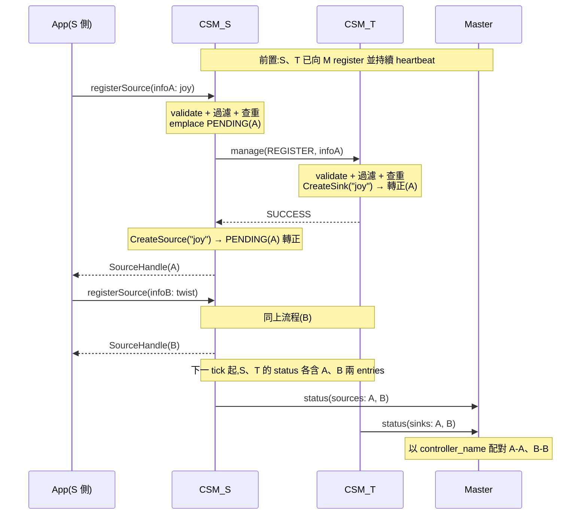
```mermaid
sequenceDiagram
    participant App as App(S 側)
    participant S as CSM_S
    participant T as CSM_T
    participant M as Master

    Note over S,M: 前置:S、T 已向 M register 並持續 heartbeat
    App->>S: registerSource(infoA: joy)
    Note over S: validate + 過濾 + 查重<br/>emplace PENDING(A)
    S->>T: manage(REGISTER, infoA)
    Note over T: validate + 過濾 + 查重<br/>CreateSink("joy") → 轉正(A)
    T-->>S: SUCCESS
    Note over S: CreateSource("joy") → PENDING(A) 轉正
    S-->>App: SourceHandle(A)

    App->>S: registerSource(infoB: twist)
    Note over S,T: 同上流程(B)
    S-->>App: SourceHandle(B)

    Note over S,T: 下一 tick 起,S、T 的 status 各含 A、B 兩 entries
    S->>M: status(sources: A, B)
    T->>M: status(sinks: A, B)
    Note over M: 以 controller_name 配對 A-A、B-B
```

函數呼叫流程(單次註冊,詳 A.0 註冊鏈):
1. `registerSource(info)` — 驗證、過濾、佔位
2. `manage(REGISTER)` service 呼叫(阻塞至多 timeoutMs)
3. 對側 `_onManage(REGISTER)` — 驗證、建 Sink、轉正
4. 本側 `CreateSource()`、轉正、回傳 Handle

資料流建立後:`App: handle.send(msg)` → `Source::send()`(`rate_.record()` →
`publish`)→ DDS → `Sink::_store()`(`rate_.record()` → 存 `latestMsg_` →
`reportActivity()` → 使用者 callback)。Sink 於首筆訊息轉 ACTIVE；
Source(topic 模式無發送回饋)維持 INITIAL,其狀態由 master 通知鏈驅動。

##### A.1.1.2 Source 發送間隔超過 timeout 與 disconnect 閾值

情境:App 停止(或過慢)呼叫 `send()`,Sink 側 elapsed 依序越過
`timeout_ns` 與 `disconnect_timeout_ns`。

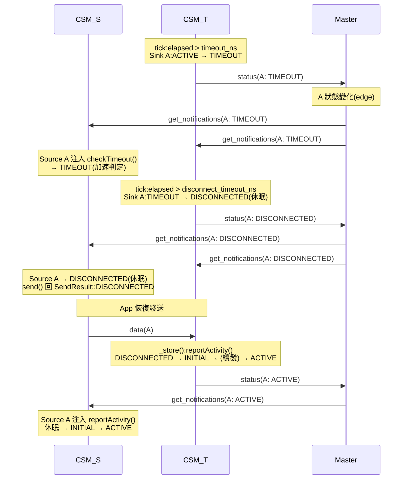
```mermaid
sequenceDiagram
    participant S as CSM_S
    participant T as CSM_T
    participant M as Master

    Note over T: tick:elapsed > timeout_ns<br/>Sink A:ACTIVE → TIMEOUT
    T->>M: status(A: TIMEOUT)
    Note over M: A 狀態變化(edge)
    M->>S: get_notifications(A: TIMEOUT)
    M->>T: get_notifications(A: TIMEOUT)
    Note over S: Source A 注入 checkTimeout()<br/>→ TIMEOUT(加速判定)

    Note over T: tick:elapsed > disconnect_timeout_ns<br/>Sink A:TIMEOUT → DISCONNECTED(休眠)
    T->>M: status(A: DISCONNECTED)
    M->>S: get_notifications(A: DISCONNECTED)
    M->>T: get_notifications(A: DISCONNECTED)
    Note over S: Source A → DISCONNECTED(休眠)<br/>send() 回 SendResult::DISCONNECTED

    Note over S,T: App 恢復發送
    S->>T: data(A)
    Note over T: _store():reportActivity()<br/>DISCONNECTED → INITIAL → (續發) → ACTIVE
    T->>M: status(A: ACTIVE)
    M->>S: get_notifications(A: ACTIVE)
    Note over S: Source A 注入 reportActivity()<br/>休眠 → INITIAL → ACTIVE
```

要點:兩側 entry 全程保留(休眠,§0.1)；恢復發送即自動重連,無重新註冊。
B channel 不受影響(per-entity 獨立判定)。

##### A.1.1.3 Source CSM crash

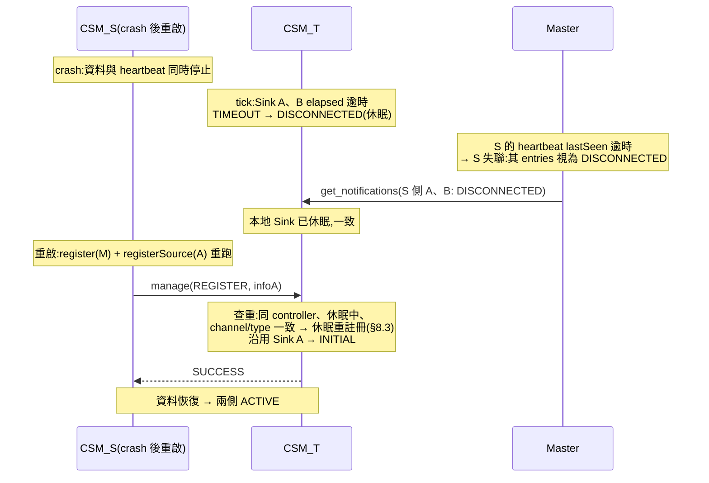
```mermaid
sequenceDiagram
    participant S as CSM_S(crash 後重啟)
    participant T as CSM_T
    participant M as Master

    Note over S: crash:資料與 heartbeat 同時停止
    Note over T: tick:Sink A、B elapsed 逾時<br/>TIMEOUT → DISCONNECTED(休眠)
    Note over M: S 的 heartbeat lastSeen 逾時<br/>→ S 失聯:其 entries 視為 DISCONNECTED
    M->>T: get_notifications(S 側 A、B: DISCONNECTED)
    Note over T: 本地 Sink 已休眠,一致

    Note over S: 重啟:register(M) + registerSource(A) 重跑
    S->>T: manage(REGISTER, infoA)
    Note over T: 查重:同 controller、休眠中、<br/>channel/type 一致 → 休眠重註冊(§8.3)<br/>沿用 Sink A → INITIAL
    T-->>S: SUCCESS
    Note over S,T: 資料恢復 → 兩側 ACTIVE
```

要點:target 側的休眠 entry 由**休眠重註冊規則**(v0.6.0,§8.3)接手,
不需先 unregister；master 對 S 的失聯判定與 T 的本地逾時判定互為佐證,
任一先發生皆收斂到相同狀態。

##### A.1.1.4 Sink CSM crash

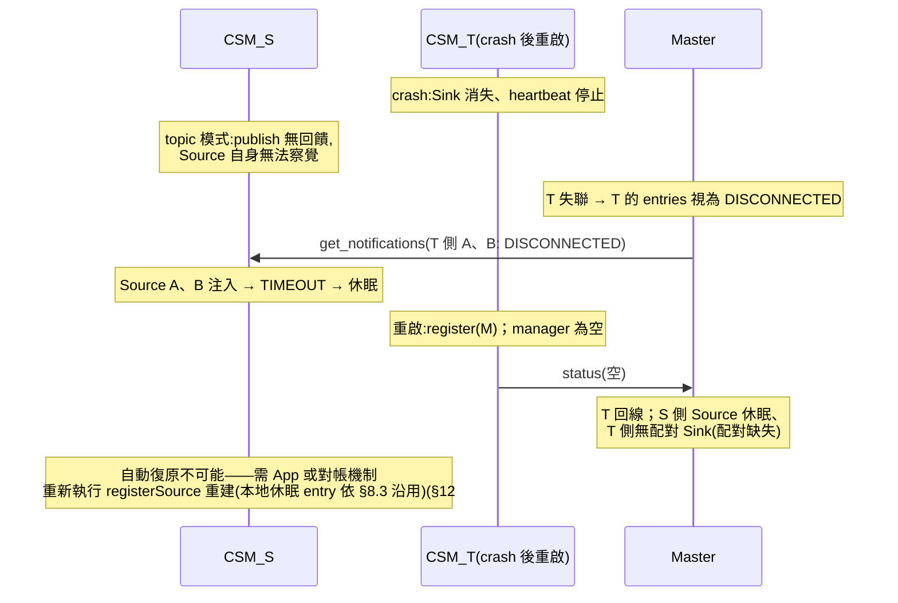
```mermaid
sequenceDiagram
    participant S as CSM_S
    participant T as CSM_T(crash 後重啟)
    participant M as Master

    Note over T: crash:Sink 消失、heartbeat 停止
    Note over S: topic 模式:publish 無回饋,<br/>Source 自身無法察覺
    Note over M: T 失聯 → T 的 entries 視為 DISCONNECTED
    M->>S: get_notifications(T 側 A、B: DISCONNECTED)
    Note over S: Source A、B 注入 → TIMEOUT → 休眠

    Note over T: 重啟:register(M)；manager 為空
    T->>M: status(空)
    Note over M: T 回線；S 側 Source 休眠、<br/>T 側無配對 Sink(配對缺失)
    Note over S: 自動復原不可能——需 App 或對帳機制<br/>重新執行 registerSource 重建(本地休眠 entry 依 §8.3 沿用)(§12 #3)
```

要點:此情境為 §12 未決 #3(對帳)的動機；目前設計需應用層在收到
`setNotificationCallback` 後決策重建。master 通知是 topic 模式下 Source 側
得知 Sink 消失的唯一途徑。

##### A.1.1.5 CSM Master crash

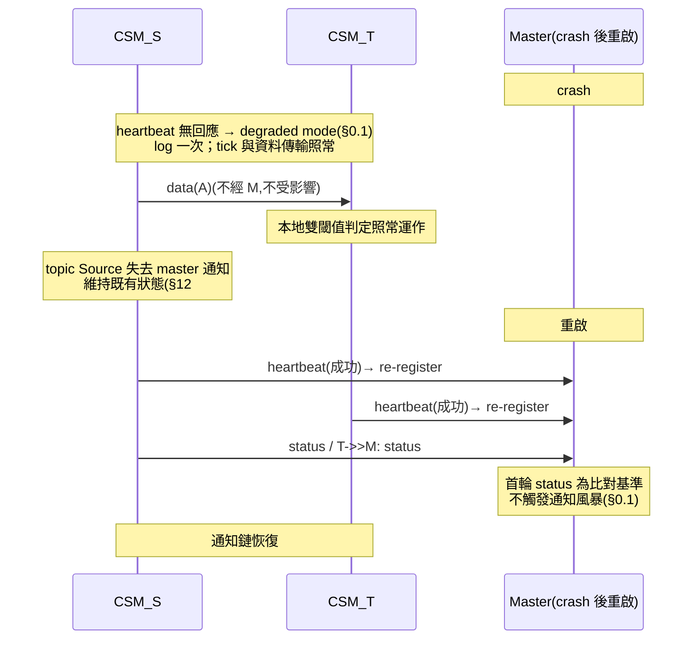
```mermaid
sequenceDiagram
    participant S as CSM_S
    participant T as CSM_T
    participant M as Master(crash 後重啟)

    Note over M: crash
    Note over S,T: heartbeat 無回應 → degraded mode(§0.1)<br/>log 一次；tick 與資料傳輸照常
    S->>T: data(A)(不經 M,不受影響)
    Note over T: 本地雙閾值判定照常運作
    Note over S: topic Source 失去 master 通知<br/>維持既有狀態(§12 #1 已知取捨)

    Note over M: 重啟
    S->>M: heartbeat(成功)→ re-register
    T->>M: heartbeat(成功)→ re-register
    S->>M: status / T->>M: status
    Note over M: 首輪 status 為比對基準<br/>不觸發通知風暴(§0.1)
    Note over S,T: 通知鏈恢復
```

要點:資料面完全不受 master 生死影響；degraded 期間僅失去跨 CSM 通知。

#### A.1.2 一對多(1:N)

拓撲:CSM_S 註冊兩個 Source——A(joy,target = CSM_T1)與 B(twist,target = CSM_T2)；
CSM_T1 生成 Sink A、CSM_T2 生成 Sink B。source CSM 同時面對兩個 target,
每個 target CSM 僅持有一條配對；Master 訂閱三個 CSM 的 status,
以 controller_name 建立 A(S–T1)、B(S–T2)兩組配對。

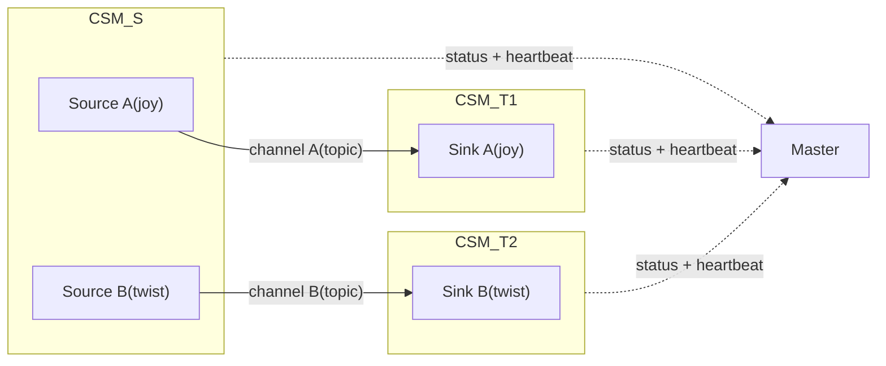
```mermaid
flowchart LR
    subgraph S["CSM_S"]
        SA["Source A(joy)"]
        SB["Source B(twist)"]
    end
    subgraph T1["CSM_T1"]
        KA["Sink A(joy)"]
    end
    subgraph T2["CSM_T2"]
        KB["Sink B(twist)"]
    end
    M["Master"]
    SA -->|"channel A(topic)"| KA
    SB -->|"channel B(topic)"| KB
    S -.->|"status + heartbeat"| M
    T1 -.->|"status + heartbeat"| M
    T2 -.->|"status + heartbeat"| M
```

##### A.1.2.1 註冊至 Sink 生成的完整流程

CSM_S 依序對兩個不同 target 註冊 Source(A:joy → CSM_T1、B:twist → CSM_T2)；
兩條註冊鏈除 target 不同外互相獨立,各自走完整註冊鏈,互不等待、互不影響。

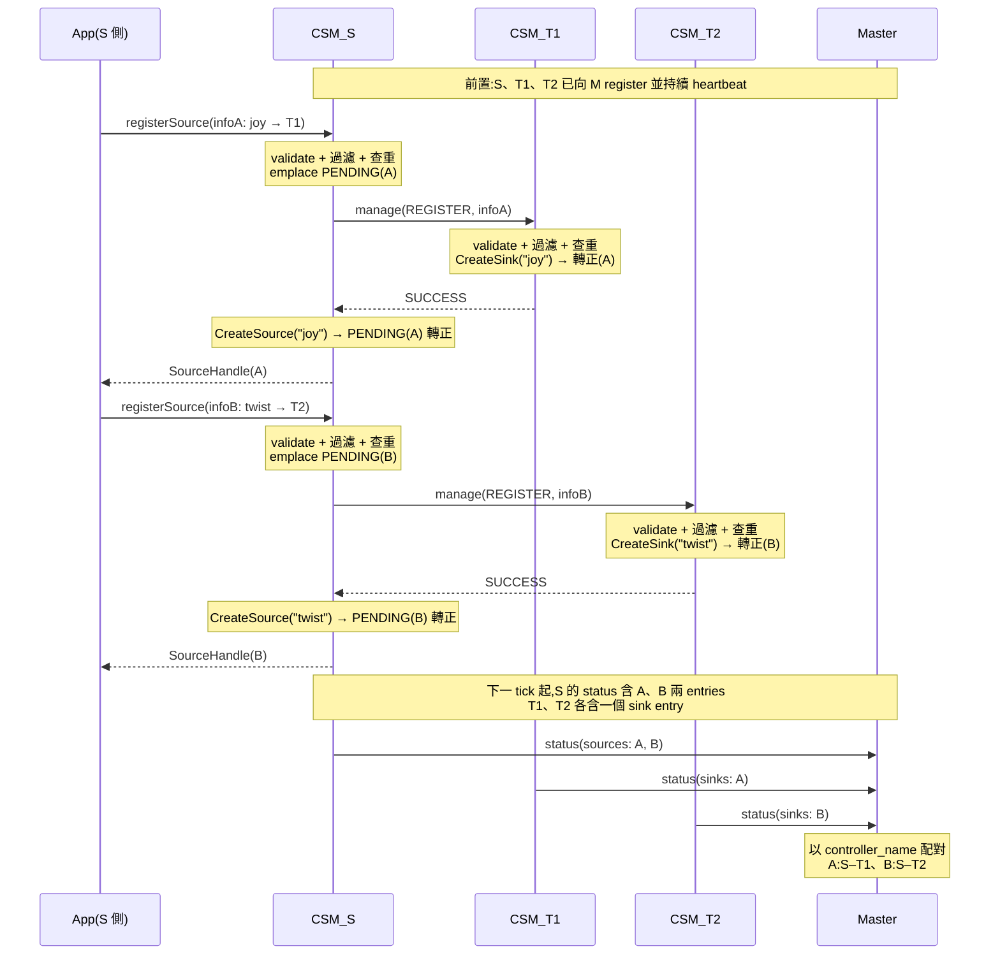
```mermaid
sequenceDiagram
    participant App as App(S 側)
    participant S as CSM_S
    participant T1 as CSM_T1
    participant T2 as CSM_T2
    participant M as Master

    Note over S,M: 前置:S、T1、T2 已向 M register 並持續 heartbeat
    App->>S: registerSource(infoA: joy → T1)
    Note over S: validate + 過濾 + 查重<br/>emplace PENDING(A)
    S->>T1: manage(REGISTER, infoA)
    Note over T1: validate + 過濾 + 查重<br/>CreateSink("joy") → 轉正(A)
    T1-->>S: SUCCESS
    Note over S: CreateSource("joy") → PENDING(A) 轉正
    S-->>App: SourceHandle(A)

    App->>S: registerSource(infoB: twist → T2)
    Note over S: validate + 過濾 + 查重<br/>emplace PENDING(B)
    S->>T2: manage(REGISTER, infoB)
    Note over T2: validate + 過濾 + 查重<br/>CreateSink("twist") → 轉正(B)
    T2-->>S: SUCCESS
    Note over S: CreateSource("twist") → PENDING(B) 轉正
    S-->>App: SourceHandle(B)

    Note over S,M: 下一 tick 起,S 的 status 含 A、B 兩 entries<br/>T1、T2 各含一個 sink entry
    S->>M: status(sources: A, B)
    T1->>M: status(sinks: A)
    T2->>M: status(sinks: B)
    Note over M: 以 controller_name 配對<br/>A:S–T1、B:S–T2
```

函數呼叫流程(單次註冊,詳 A.0 註冊鏈):
1. `registerSource(info)` — 驗證、過濾、佔位
2. `manage(REGISTER)` service 呼叫至該筆 info 指定的 target CSM(阻塞至多 timeoutMs)
3. 對側 `_onManage(REGISTER)` — 驗證、建 Sink、轉正
4. 本側 `CreateSource()`、轉正、回傳 Handle

資料流建立後,兩條 channel 各自獨立運作:`App: handleA.send(msg)` →
`Source::send()`(`rate_.record()` → `publish`)→ DDS → T1 側 `Sink::_store()`
(`rate_.record()` → 存 `latestMsg_` → `reportActivity()` → 使用者 callback)；
B channel 於 S–T2 間同理。Sink A、Sink B 各於首筆訊息在所屬 CSM 轉 ACTIVE；
Source A、B(topic 模式無發送回饋)維持 INITIAL,其狀態由 master 通知鏈驅動。

要點:兩條註冊鏈唯一的共享狀態是 CSM_S 的 `sources_` 容器(雙鍵查重於同一鎖下
進行)；T1、T2 各自僅認識屬於自己的那條配對。任一條鏈失敗(遠端拒絕/逾時 →
rollback,§2.4)不影響另一條鏈的成敗。

##### A.1.2.2 Source 發送間隔超過 timeout 與 disconnect 閾值

情境:App 停止(或過慢)呼叫 Source A 的 `send()`,CSM_T1 側 Sink A 的 elapsed
依序越過 `timeout_ns` 與 `disconnect_timeout_ns`；Source B 照常發送,B channel
全程不受影響。

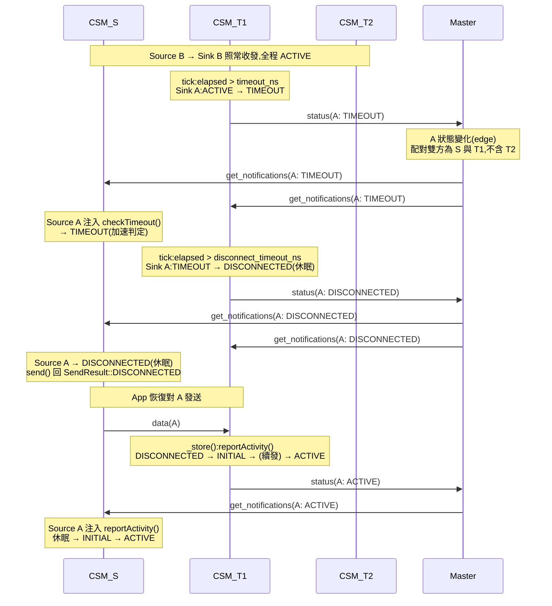
```mermaid
sequenceDiagram
    participant S as CSM_S
    participant T1 as CSM_T1
    participant T2 as CSM_T2
    participant M as Master

    Note over S,T2: Source B → Sink B 照常收發,全程 ACTIVE
    Note over T1: tick:elapsed > timeout_ns<br/>Sink A:ACTIVE → TIMEOUT
    T1->>M: status(A: TIMEOUT)
    Note over M: A 狀態變化(edge)<br/>配對雙方為 S 與 T1,不含 T2
    M->>S: get_notifications(A: TIMEOUT)
    M->>T1: get_notifications(A: TIMEOUT)
    Note over S: Source A 注入 checkTimeout()<br/>→ TIMEOUT(加速判定)

    Note over T1: tick:elapsed > disconnect_timeout_ns<br/>Sink A:TIMEOUT → DISCONNECTED(休眠)
    T1->>M: status(A: DISCONNECTED)
    M->>S: get_notifications(A: DISCONNECTED)
    M->>T1: get_notifications(A: DISCONNECTED)
    Note over S: Source A → DISCONNECTED(休眠)<br/>send() 回 SendResult::DISCONNECTED

    Note over S,T1: App 恢復對 A 發送
    S->>T1: data(A)
    Note over T1: _store():reportActivity()<br/>DISCONNECTED → INITIAL → (續發) → ACTIVE
    T1->>M: status(A: ACTIVE)
    M->>S: get_notifications(A: ACTIVE)
    Note over S: Source A 注入 reportActivity()<br/>休眠 → INITIAL → ACTIVE
```

要點:逾時判定與通知的作用範圍限於單一配對(S, T1)——master 的通知對象由
controller_name 配對決定,T2 全程不會收到任何關於 A 的通知,Sink B 的 liveness
判定於 T2 本地獨立進行。兩側 A entry 全程保留(休眠,§0.1)；恢復發送即自動重連,
無重新註冊。

##### A.1.2.3 Source CSM crash

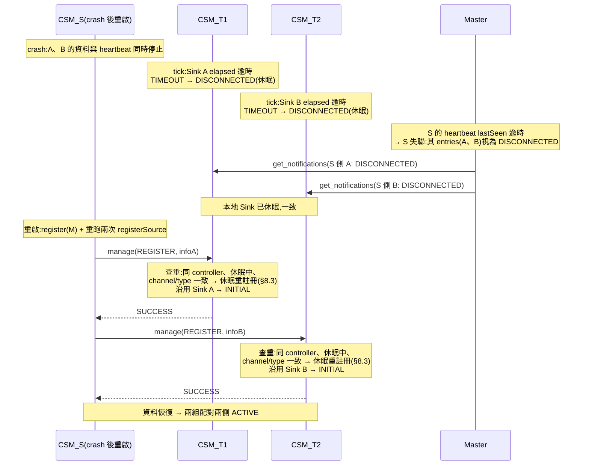
```mermaid
sequenceDiagram
    participant S as CSM_S(crash 後重啟)
    participant T1 as CSM_T1
    participant T2 as CSM_T2
    participant M as Master

    Note over S: crash:A、B 的資料與 heartbeat 同時停止
    Note over T1: tick:Sink A elapsed 逾時<br/>TIMEOUT → DISCONNECTED(休眠)
    Note over T2: tick:Sink B elapsed 逾時<br/>TIMEOUT → DISCONNECTED(休眠)
    Note over M: S 的 heartbeat lastSeen 逾時<br/>→ S 失聯:其 entries(A、B)視為 DISCONNECTED
    M->>T1: get_notifications(S 側 A: DISCONNECTED)
    M->>T2: get_notifications(S 側 B: DISCONNECTED)
    Note over T1,T2: 本地 Sink 已休眠,一致

    Note over S: 重啟:register(M) + 重跑兩次 registerSource
    S->>T1: manage(REGISTER, infoA)
    Note over T1: 查重:同 controller、休眠中、<br/>channel/type 一致 → 休眠重註冊(§8.3)<br/>沿用 Sink A → INITIAL
    T1-->>S: SUCCESS
    S->>T2: manage(REGISTER, infoB)
    Note over T2: 查重:同 controller、休眠中、<br/>channel/type 一致 → 休眠重註冊(§8.3)<br/>沿用 Sink B → INITIAL
    T2-->>S: SUCCESS
    Note over S,T2: 資料恢復 → 兩組配對兩側 ACTIVE
```

要點:1:N 拓撲中 source CSM 是全部 target 的共同上游,其 crash 的影響面涵蓋
T1 與 T2——兩個 target 各自以本地雙閾值逾時進入休眠,master 對 S 的單一失聯判定
則展開為對 T1、T2 的兩則通知,與各 target 的本地判定互為佐證,任一先發生皆收斂到
相同狀態。復原仍是逐配對進行:S 重啟後對 T1、T2 分別走一次**休眠重註冊**
(v0.6.0,§8.3),不需先 unregister,且兩條鏈成敗互不影響。

##### A.1.2.4 Sink CSM crash

以 CSM_T1 crash 為例,展示 1:N 拓撲的故障隔離性:Source B 與 CSM_T2 完全不受影響。

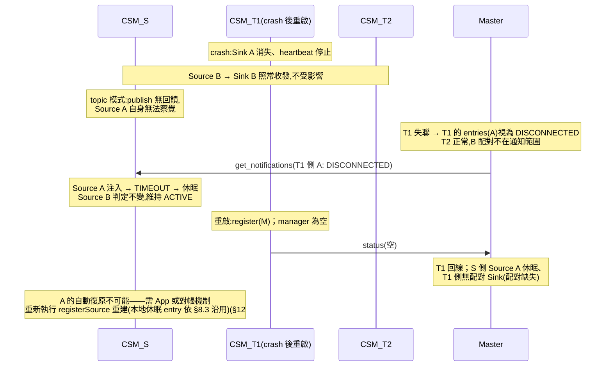
```mermaid
sequenceDiagram
    participant S as CSM_S
    participant T1 as CSM_T1(crash 後重啟)
    participant T2 as CSM_T2
    participant M as Master

    Note over T1: crash:Sink A 消失、heartbeat 停止
    Note over S,T2: Source B → Sink B 照常收發,不受影響
    Note over S: topic 模式:publish 無回饋,<br/>Source A 自身無法察覺
    Note over M: T1 失聯 → T1 的 entries(A)視為 DISCONNECTED<br/>T2 正常,B 配對不在通知範圍
    M->>S: get_notifications(T1 側 A: DISCONNECTED)
    Note over S: Source A 注入 → TIMEOUT → 休眠<br/>Source B 判定不變,維持 ACTIVE

    Note over T1: 重啟:register(M)；manager 為空
    T1->>M: status(空)
    Note over M: T1 回線；S 側 Source A 休眠、<br/>T1 側無配對 Sink(配對缺失)
    Note over S: A 的自動復原不可能——需 App 或對帳機制<br/>重新執行 registerSource 重建(本地休眠 entry 依 §8.3 沿用)(§12 #3)
```

要點:Sink CSM 的 crash 只波及以其為 target 的配對——Source A 休眠,而 Source B
與 T2 的資料流、liveness 判定、master 通知均照常,此為 1:N 拓撲相對於單一 target
的隔離優勢。T1 重啟後為空 manager,S 側休眠的 Source A 等不到可重連的配對 Sink,
此情境為 §12 未決 #3(對帳)的動機；目前設計需應用層在收到
`setNotificationCallback` 後決策重建。master 通知是 topic 模式下 Source 側得知
Sink 消失的唯一途徑。

##### A.1.2.5 CSM Master crash

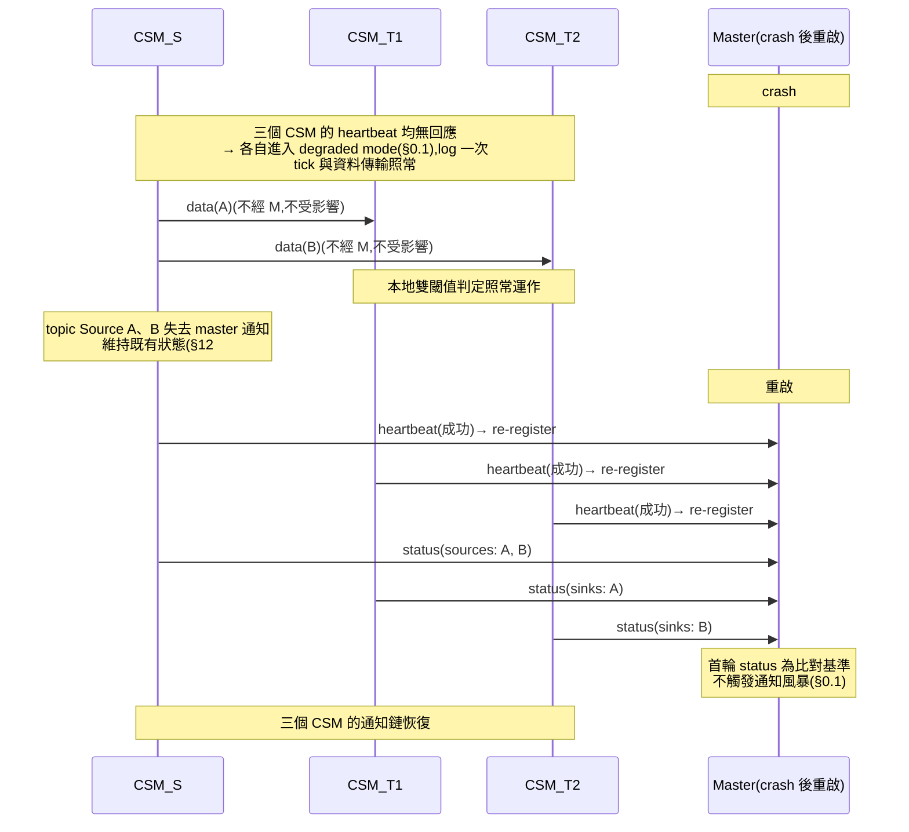
```mermaid
sequenceDiagram
    participant S as CSM_S
    participant T1 as CSM_T1
    participant T2 as CSM_T2
    participant M as Master(crash 後重啟)

    Note over M: crash
    Note over S,T2: 三個 CSM 的 heartbeat 均無回應<br/>→ 各自進入 degraded mode(§0.1),log 一次<br/>tick 與資料傳輸照常
    S->>T1: data(A)(不經 M,不受影響)
    S->>T2: data(B)(不經 M,不受影響)
    Note over T1,T2: 本地雙閾值判定照常運作
    Note over S: topic Source A、B 失去 master 通知<br/>維持既有狀態(§12 #1 已知取捨)

    Note over M: 重啟
    S->>M: heartbeat(成功)→ re-register
    T1->>M: heartbeat(成功)→ re-register
    T2->>M: heartbeat(成功)→ re-register
    S->>M: status(sources: A, B)
    T1->>M: status(sinks: A)
    T2->>M: status(sinks: B)
    Note over M: 首輪 status 為比對基準<br/>不觸發通知風暴(§0.1)
    Note over S,T2: 三個 CSM 的通知鏈恢復
```

要點:degraded 範圍涵蓋全部三個 CSM,但進入與離開 degraded mode 由各 CSM 依
自身 heartbeat response 逾時獨立判定,無互相依賴。資料面(A、B 兩條 channel)
完全不受 master 生死影響；degraded 期間僅失去跨 CSM 通知——對 topic 模式的
Source A、B 而言即失去唯一活性來源(§12 #1)。master 重啟後由三個 CSM 的
re-register 與首輪 status 重建兩組配對,並以首輪為比對基準,不觸發通知風暴。

---

#### A.1.3 多對一(N:1)

拓撲總覽:CSM_S1 註冊 Source A(joy)、CSM_S2 註冊 Source B(twist),target 皆為 CSM_T；
CSM_T 的 `sinks_` 同時管理來自兩個 source CSM 的 entry,生成 Sink A(joy)與 Sink B(twist)。
App1、App2 分別為 S1、S2 側的使用者應用層；三個 CSM 各自向 master register 並持續 heartbeat。
`controller_name` 全系統唯一,保證兩個來源的 entry 在 CSM_T 上必然不衝突,
master 亦藉此將 A、B 分別配對為 (S1, T) 與 (S2, T) 兩條互相獨立的通知路徑。

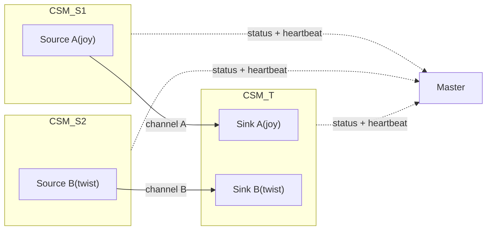
```mermaid
flowchart LR
    subgraph S1["CSM_S1"]
        SA["Source A(joy)"]
    end
    subgraph S2["CSM_S2"]
        SB["Source B(twist)"]
    end
    subgraph T["CSM_T"]
        KA["Sink A(joy)"]
        KB["Sink B(twist)"]
    end
    M["Master"]
    SA -->|"channel A"| KA
    SB -->|"channel B"| KB
    S1 -.->|"status + heartbeat"| M
    S2 -.->|"status + heartbeat"| M
    T -.->|"status + heartbeat"| M
```

##### A.1.3.1 註冊至 Sink 生成的完整流程

CSM_S1 與 CSM_S2 各自向 CSM_T 註冊一個 Source(A:joy、B:twist)；兩條註冊鏈由
不同的 source CSM 發起,於 CSM_T 匯聚。CSM_T 對每筆 REGISTER 分別執行 validate、
過濾與 `sinkMtx_` 下的雙鍵查重——`controller_name` 全域唯一使 A、B 兩筆 entry 互不衝突；
若兩個來源以 identical controller_name 並發註冊(組態錯誤),持鎖查重保證恰一成功,
另一側收到 error 且不留殘餘佔位(§8.4 M4 註冊風暴的多來源版,即整合場景 I7)。

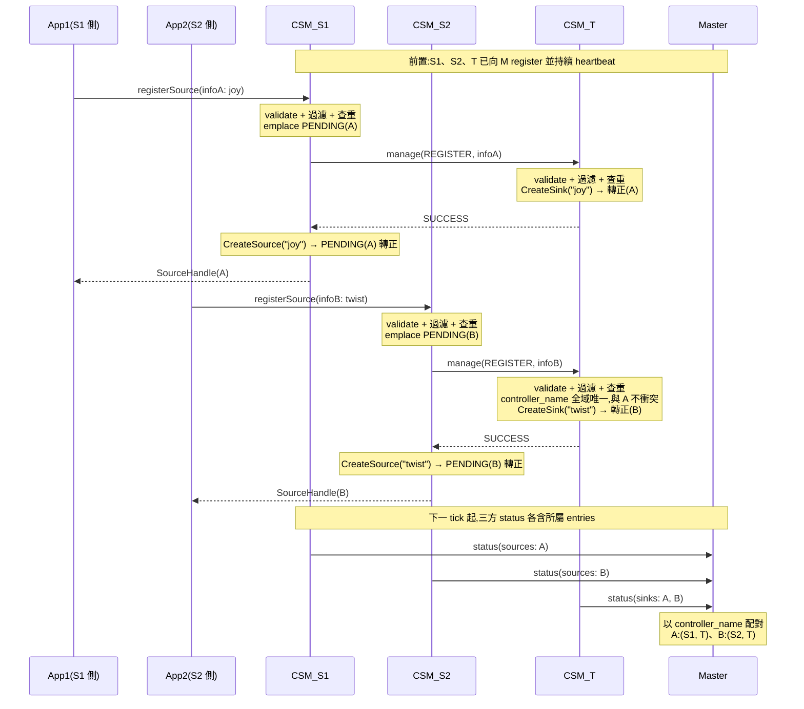
```mermaid
sequenceDiagram
    participant A1 as App1(S1 側)
    participant A2 as App2(S2 側)
    participant S1 as CSM_S1
    participant S2 as CSM_S2
    participant T as CSM_T
    participant M as Master

    Note over S1,M: 前置:S1、S2、T 已向 M register 並持續 heartbeat
    A1->>S1: registerSource(infoA: joy)
    Note over S1: validate + 過濾 + 查重<br/>emplace PENDING(A)
    S1->>T: manage(REGISTER, infoA)
    Note over T: validate + 過濾 + 查重<br/>CreateSink("joy") → 轉正(A)
    T-->>S1: SUCCESS
    Note over S1: CreateSource("joy") → PENDING(A) 轉正
    S1-->>A1: SourceHandle(A)

    A2->>S2: registerSource(infoB: twist)
    Note over S2: validate + 過濾 + 查重<br/>emplace PENDING(B)
    S2->>T: manage(REGISTER, infoB)
    Note over T: validate + 過濾 + 查重<br/>controller_name 全域唯一,與 A 不衝突<br/>CreateSink("twist") → 轉正(B)
    T-->>S2: SUCCESS
    Note over S2: CreateSource("twist") → PENDING(B) 轉正
    S2-->>A2: SourceHandle(B)

    Note over S1,M: 下一 tick 起,三方 status 各含所屬 entries
    S1->>M: status(sources: A)
    S2->>M: status(sources: B)
    T->>M: status(sinks: A, B)
    Note over M: 以 controller_name 配對<br/>A:(S1, T)、B:(S2, T)
```

函數呼叫流程(單次註冊,詳 A.0 註冊鏈):
1. `registerSource(info)` — 驗證、過濾、佔位
2. `manage(REGISTER)` service 呼叫(阻塞至多 timeoutMs)
3. 對側 `_onManage(REGISTER)` — 驗證、建 Sink、轉正
4. 本側 `CreateSource()`、轉正、回傳 Handle

資料流建立後:`App1: handleA.send(msg)` 與 `App2: handleB.send(msg)` 各經
`Source::send()`(`rate_.record()` → `publish`)→ DDS → 對應 `Sink::_store()`
(`rate_.record()` → 存 `latestMsg_` → `reportActivity()` → 使用者 callback),
兩條 channel 為完全獨立的 DDS 傳輸。Sink A、B 各於首筆訊息轉 ACTIVE；
Source A、B(topic 模式無發送回饋)維持 INITIAL,其狀態由 master 通知鏈驅動。

要點:CSM_T 的 status tick 以單一 timer 巡覽 A、B 兩個 Sink,但逾時判定為
per-entity 獨立；S1、S2 兩側的註冊鏈彼此毫無耦合,先後順序與交錯並發皆不影響結果。
唯一的匯聚點是 CSM_T 的持鎖查重,其以 `controller_name` + `channel_name` 雙鍵
擋下任何重複或衝突的註冊。

##### A.1.3.2 Source 發送間隔超過 timeout 與 disconnect 閾值

情境:App1 停止(或過慢)呼叫 `send()`,CSM_T 側 Sink A 的 elapsed 依序越過
`timeout_ns` 與 `disconnect_timeout_ns`；App2 持續正常發送,channel B 全程不受影響。

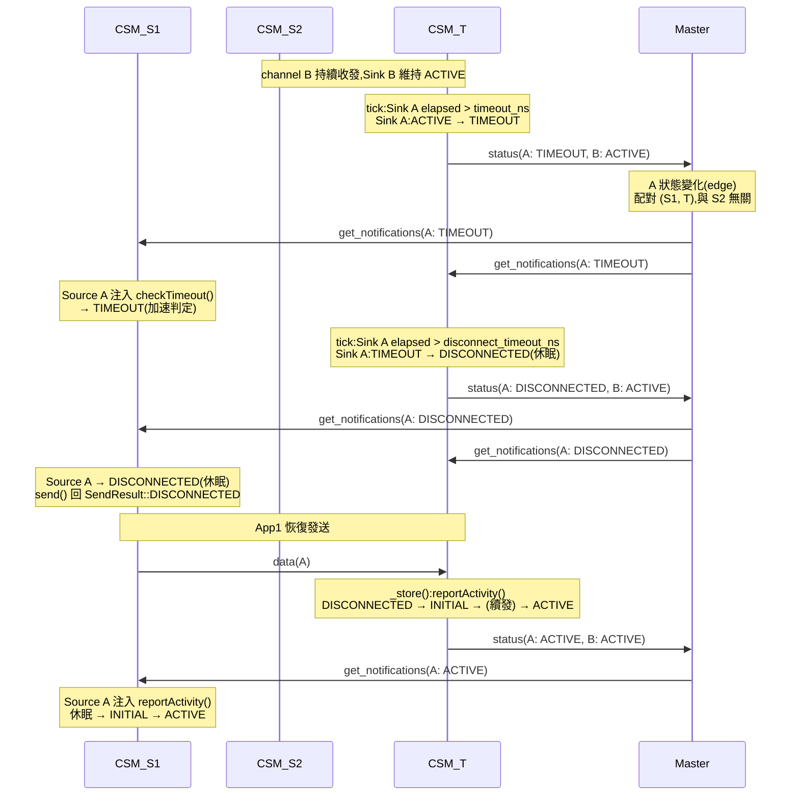
```mermaid
sequenceDiagram
    participant S1 as CSM_S1
    participant S2 as CSM_S2
    participant T as CSM_T
    participant M as Master

    Note over S2,T: channel B 持續收發,Sink B 維持 ACTIVE
    Note over T: tick:Sink A elapsed > timeout_ns<br/>Sink A:ACTIVE → TIMEOUT
    T->>M: status(A: TIMEOUT, B: ACTIVE)
    Note over M: A 狀態變化(edge)<br/>配對 (S1, T),與 S2 無關
    M->>S1: get_notifications(A: TIMEOUT)
    M->>T: get_notifications(A: TIMEOUT)
    Note over S1: Source A 注入 checkTimeout()<br/>→ TIMEOUT(加速判定)

    Note over T: tick:Sink A elapsed > disconnect_timeout_ns<br/>Sink A:TIMEOUT → DISCONNECTED(休眠)
    T->>M: status(A: DISCONNECTED, B: ACTIVE)
    M->>S1: get_notifications(A: DISCONNECTED)
    M->>T: get_notifications(A: DISCONNECTED)
    Note over S1: Source A → DISCONNECTED(休眠)<br/>send() 回 SendResult::DISCONNECTED

    Note over S1,T: App1 恢復發送
    S1->>T: data(A)
    Note over T: _store():reportActivity()<br/>DISCONNECTED → INITIAL → (續發) → ACTIVE
    T->>M: status(A: ACTIVE, B: ACTIVE)
    M->>S1: get_notifications(A: ACTIVE)
    Note over S1: Source A 注入 reportActivity()<br/>休眠 → INITIAL → ACTIVE
```

要點:各配對獨立判定與通知——master 依 `controller_name` 將 A 的每次狀態變化
僅推送給配對 (S1, T),CSM_S2 全程不收到任何通知,Sink B 的雙閾值判定亦不受
A 的異常影響(per-entity 獨立)。兩側 entry 全程保留(休眠,§0.1)；
App1 恢復發送即自動重連,無重新註冊。

##### A.1.3.3 Source CSM crash

以 CSM_S1 crash 為例,展示 N:1 拓撲下 source 側故障的隔離性:
僅配對 A 受影響,Sink B 與 CSM_S2 照常運作。

```mermaid
sequenceDiagram
    participant S1 as CSM_S1(crash 後重啟)
    participant S2 as CSM_S2
    participant T as CSM_T
    participant M as Master

    Note over S1: crash:資料與 heartbeat 同時停止
    Note over S2,T: channel B 收發照常,Sink B 維持 ACTIVE
    Note over T: tick:Sink A elapsed 逾時<br/>TIMEOUT → DISCONNECTED(休眠)
    Note over M: S1 的 heartbeat lastSeen 逾時<br/>→ S1 失聯:其 entries 視為 DISCONNECTED
    M->>T: get_notifications(S1 側 A: DISCONNECTED)
    Note over T: 本地 Sink A 已休眠,一致<br/>Sink B 不在通知範圍
    Note over S2: 無任何通知(A 的配對不含 S2)

    Note over S1: 重啟:register(M) + registerSource(A) 重跑
    S1->>T: manage(REGISTER, infoA)
    Note over T: 查重:同 controller、休眠中、<br/>channel/type 一致 → 休眠重註冊(§8.3)<br/>沿用 Sink A → INITIAL
    T-->>S1: SUCCESS
    Note over S1,T: 資料恢復 → 兩側 ACTIVE
```

要點:S1 失聯的通知對象僅為其 entries 的配對方 CSM_T,CSM_S2 與 channel B
完全隔離,不收到通知、狀態不受擾動——這是 N:1 拓撲相對於單一 CSM 承載多
Source 的核心優勢(故障域以 CSM 為界)。target 側休眠的 Sink A 由**休眠重註冊
規則**(v0.6.0,§8.3)接手,S1 重啟後重跑註冊即沿用既有 Sink 轉 INITIAL,
不需先 unregister；master 對 S1 的失聯判定與 T 的本地逾時判定互為佐證,
任一先發生皆收斂到相同狀態。

##### A.1.3.4 Sink CSM crash

CSM_T 為兩條 channel 的共同 target,其 crash 同時影響全部 source CSM:
S1、S2 均經 master 通知進入休眠,且 T 重啟後兩側各自面對配對缺失。

```mermaid
sequenceDiagram
    participant S1 as CSM_S1
    participant S2 as CSM_S2
    participant T as CSM_T(crash 後重啟)
    participant M as Master

    Note over T: crash:Sink A、B 消失、heartbeat 停止
    Note over S1,S2: topic 模式:publish 無回饋,<br/>兩側 Source 自身皆無法察覺
    Note over M: T 失聯 → T 的 entries 視為 DISCONNECTED
    M->>S1: get_notifications(T 側 A: DISCONNECTED)
    M->>S2: get_notifications(T 側 B: DISCONNECTED)
    Note over S1: Source A 注入 → TIMEOUT → 休眠
    Note over S2: Source B 注入 → TIMEOUT → 休眠

    Note over T: 重啟:register(M)；manager 為空
    T->>M: status(空)
    Note over M: T 回線；S1、S2 側 Source 休眠、<br/>T 側無配對 Sink(配對缺失)
    Note over S1,S2: 自動復原不可能——S1、S2 各自需 App<br/>或對帳機制重新執行 registerSource<br/>重建(本地休眠 entry 依 §8.3 沿用)(§12 #3)
```

要點:單點 target 的 crash 是 N:1 拓撲的最大衝擊面——全部 source CSM 同時受
影響,master 通知是 topic 模式下 S1、S2 得知 Sink 消失的唯一途徑。T 重啟後
manager 為空,兩個 source CSM 的休眠 entry 在 target 側均無配對 Sink,無法
自動復原；重建決策分散於 App1 與 App2(各自在收到 `setNotificationCallback`
後決策 unregister + 重新註冊),彼此無協調機制。此情境使 §12 未決 #3(對帳)
的動機在 N:1 下更為突出:master 持有全域 entries 快取,是集中偵測「多個
Source 存在、配對 Sink 全數消失」的適當位置。

##### A.1.3.5 CSM Master crash

```mermaid
sequenceDiagram
    participant S1 as CSM_S1
    participant S2 as CSM_S2
    participant T as CSM_T
    participant M as Master(crash 後重啟)

    Note over M: crash
    Note over S1,T: 三個 CSM heartbeat 均無回應 → 各自 degraded mode(§0.1)<br/>log 一次、tick 與資料傳輸照常
    S1->>T: data(A)(不經 M,不受影響)
    S2->>T: data(B)(不經 M,不受影響)
    Note over T: Sink A、B 本地雙閾值判定照常運作
    Note over S1,S2: topic Source 失去 master 通知<br/>維持既有狀態(§12 #1 已知取捨)

    Note over M: 重啟
    S1->>M: heartbeat(成功)→ re-register
    S2->>M: heartbeat(成功)→ re-register
    T->>M: heartbeat(成功)→ re-register
    S1->>M: status(sources: A)
    S2->>M: status(sources: B)
    T->>M: status(sinks: A, B)
    Note over M: 首輪 status 為比對基準<br/>重建 A:(S1, T)、B:(S2, T) 配對<br/>不觸發通知風暴(§0.1)
    Note over S1,T: 通知鏈恢復
```

要點:degraded 範圍涵蓋全部三個 CSM,但兩條 channel 的資料面完全不受 master
生死影響；degraded 期間僅失去跨 CSM 通知,CSM_T 的本地雙閾值判定照常涵蓋
A、B 兩個 Sink。master 重啟後以各 CSM 的首輪 status 一次性重建全部配對
(A、B 兩條配對同輪恢復),並以該輪為比對基準,不觸發通知風暴。

---

### A.2 Service 模式

Service 模式下 Source 為 service Client、Sink 為 service Server,資料傳輸為
request/response；`mode = "service"` 時 `timeout_ns` 必須大於 0(§3.2 規則 5),
作為 response 等待上限。註冊協定、master 互動、狀態機與休眠重註冊規則與
topic 模式相同；以下三個組合各自完整描述。

#### A.2.1 一對一(1:1)

本節為 service 模式的 1:1 拓撲:CSM_S 向 CSM_T 註冊兩個不同型別的 Source——
A(joy,srv = ControlSignalJoy)與 B(twist,srv = ControlSignalTwist),
CSM_T 對應生成 Sink A、B。與 topic 模式的結構差異在於傳輸角色:Source 持
service **Client**、Sink 持 service **Server**,資料傳輸為 request/response 往返。
每次成功的 `send()` 均帶回 response,因此兩側狀態皆由資料流自主驅動——
send 成功即令兩側 ACTIVE,master 通知退居佐證與補充角色。註冊時
`mode = service`,且 `timeout_ns` 必 > 0(§3.2 規則 5,response 等待上限不可停用)。

```mermaid
flowchart LR
    App["App(S 側)"] -->|"registerSource / send"| CSMS

    subgraph CSMS["CSM_S(source 側)"]
        SA["Source A:joy<br/>Client(ControlSignalJoy)"]
        SB["Source B:twist<br/>Client(ControlSignalTwist)"]
    end

    subgraph CSMT["CSM_T(target 側)"]
        KA["Sink A:joy<br/>Server(ControlSignalJoy)"]
        KB["Sink B:twist<br/>Server(ControlSignalTwist)"]
    end

    CSMS -.->|"manage(REGISTER / UNREGISTER)"| CSMT
    SA <-->|"request / response"| KA
    SB <-->|"request / response"| KB

    CSMS -.->|"status + heartbeat"| M["CSM Master"]
    CSMT -.->|"status + heartbeat"| M
    M -.->|"get_notifications"| CSMS
    M -.->|"get_notifications"| CSMT
```

##### A.2.1.1 註冊至 Sink 生成的完整流程

CSM_S 依序註冊兩個不同型別的 Source(A:joy、B:twist),`mode = service`；
兩次註冊互相獨立,各自走完整註冊鏈。與 topic 模式相比,協定流程完全相同,
差異僅在驗證規則(`timeout_ns` 必 > 0,§3.2 規則 5)與工廠產物
(target 側建 service Server、本側建 service Client)。

```mermaid
sequenceDiagram
    participant App as App(S 側)
    participant S as CSM_S
    participant T as CSM_T
    participant M as Master

    Note over S,M: 前置:S、T 已向 M register 並持續 heartbeat
    App->>S: registerSource(infoA: joy, mode = service)
    Note over S: validate(timeout_ns > 0,§3.2 規則 5)<br/>+ 過濾 + 查重,emplace PENDING(A)
    S->>T: manage(REGISTER, infoA)
    Note over T: validate + 過濾 + 查重<br/>CreateSink("joy")(service Server)→ 轉正(A)
    T-->>S: SUCCESS
    Note over S: CreateSource<ControlSignalJoy>(service Client)<br/>→ PENDING(A) 轉正
    S-->>App: SourceHandle(A)

    App->>S: registerSource(infoB: twist, mode = service)
    Note over S,T: 同上流程(B:ControlSignalTwist)
    S-->>App: SourceHandle(B)

    Note over S,T: 下一 tick 起,S、T 的 status 各含 A、B 兩 entries
    S->>M: status(sources: A, B)
    T->>M: status(sinks: A, B)
    Note over M: 以 controller_name 配對 A-A、B-B
```

函數呼叫流程(單次註冊,詳 A.0 註冊鏈):
1. `registerSource(info)` — 驗證(mode = service 時 `timeout_ns` 必 > 0,§3.2 規則 5)、過濾、佔位
2. `manage(REGISTER)` service 呼叫(阻塞至多 timeoutMs)
3. 對側 `_onManage(REGISTER)` — 驗證、建 Sink(service Server)、轉正
4. 本側 `CreateSource()`(service Client)、轉正、回傳 Handle

資料流建立後,單次 `send()` 為一組 request/response 往返:

```mermaid
sequenceDiagram
    participant App as App(S 側)
    participant Src as Source A(Client)
    participant Snk as Sink A(Server)
    participant AppT as App(T 側)

    App->>Src: handle.send(msg)
    Note over Src: rate_.record() → service_is_ready()?<br/>失敗 → 回 SendResult::NO_TRANSPORT
    Src->>Snk: async_send_request(req.data = msg)
    Note over Snk: _store(req->data):rate_.record()<br/>→ 存 latestMsg_ → reportActivity() → callback
    Snk->>AppT: 使用者 callback(msg, info)
    Snk-->>Src: response(SRV_RES_SUCCESS)
    Note over Src: reportActivity() → ACTIVE<br/>回 SendResult::OK
    Note over App,AppT: 兩側狀態皆由資料流自主驅動<br/>首次成功 send 後即雙雙 ACTIVE,不需 master 介入
```

失敗路徑:`service_is_ready()` 檢查失敗 → 回 `SendResult::NO_TRANSPORT`；
response 逾時(等待上限 = `timeout_ns`)→ 記 TIMEOUT、呼叫
`remove_pending_request()`(rv2 稽核:防 pending request 洩漏)、回
`SendResult::TIMEOUT`。此為與 topic 模式的根本差異:Source 具備發送回饋,
不依賴 master 通知即可驅動自身狀態機。

##### A.2.1.2 Source 發送間隔超過 timeout 與 disconnect 閾值

情境:App 停止(或過慢)呼叫 `send()`,兩側 elapsed 依序越過
`timeout_ns` 與 `disconnect_timeout_ns`。

先澄清一個直覺誤區:表面上看,Sink 可能因收訊頻率過低而逾時,而 Source
因每次 send 皆有 response 而恆為 ACTIVE,形成持續的兩側不對稱。實際上
Sink 收到 request 即 `reportActivity()`、Source 收到 response 即
`reportActivity()`——兩側活性在**每次成功 send 時同步刷新**,只要仍有成功的
send,兩側皆活；短暫不一致僅可能來自兩側 tick 相位差(一側的 tick 恰在
下一次 send 前觸發雙閾值判定,下一次成功 send 隨即拉回)。**持續性的逾時
只會來自 App 完全停止 send**:此時兩側各自 elapsed 越過雙閾值,Source 由
自身 tick 的 `checkTimeout()`(`_calcRate()` 內)自主判定,不同於 topic 模式
須靠 master 通知注入。

```mermaid
sequenceDiagram
    participant S as CSM_S
    participant T as CSM_T
    participant M as Master

    Note over S,T: App 停止呼叫 send(),request 流中斷
    Note over T: tick:elapsed > timeout_ns<br/>Sink A:ACTIVE → TIMEOUT
    Note over S: tick:elapsed > timeout_ns<br/>Source A:ACTIVE → TIMEOUT<br/>(_calcRate 內 checkTimeout,自主判定)
    T->>M: status(A: TIMEOUT)
    S->>M: status(A: TIMEOUT)
    Note over M: A 狀態變化(edge)
    M->>S: get_notifications(A: TIMEOUT)
    M->>T: get_notifications(A: TIMEOUT)
    Note over S,T: 通知與本地判定一致(佐證,非必要)

    Note over T: tick:elapsed > disconnect_timeout_ns<br/>Sink A:TIMEOUT → DISCONNECTED(休眠)
    Note over S: tick:elapsed > disconnect_timeout_ns<br/>Source A:TIMEOUT → DISCONNECTED(休眠)<br/>send() 回 SendResult::DISCONNECTED

    Note over S,T: App 恢復發送
    S->>T: async_send_request(A)
    Note over T: _store():reportActivity()<br/>DISCONNECTED → INITIAL
    T-->>S: response(SRV_RES_SUCCESS)
    Note over S: reportActivity()<br/>DISCONNECTED → INITIAL
    Note over S,T: 續發 → 兩側 ACTIVE
    T->>M: status(A: ACTIVE)
    M->>S: get_notifications(A: ACTIVE)
```

要點:與 topic 模式的關鍵差異在於 Source 的逾時與重連皆**自主完成**——逾時由
自身 tick 的 `checkTimeout()` 判定、重連由 send 成功的 response 直接驅動
`reportActivity()`,master 通知全程僅為佐證。兩側 entry 全程保留(休眠,§0.1)；
恢復發送即自動重連,無重新註冊。B channel 不受影響(per-entity 獨立判定)。

##### A.2.1.3 Source CSM crash

```mermaid
sequenceDiagram
    participant S as CSM_S(crash 後重啟)
    participant T as CSM_T
    participant M as Master

    Note over S: crash:request 流與 heartbeat 同時停止
    Note over T: tick:Sink A、B elapsed 逾時<br/>TIMEOUT → DISCONNECTED(休眠)<br/>entry 與 service Server 保留
    Note over M: S 的 heartbeat lastSeen 逾時<br/>→ S 失聯:其 entries 視為 DISCONNECTED
    M->>T: get_notifications(S 側 A、B: DISCONNECTED)
    Note over T: 本地 Sink 已休眠,一致

    Note over S: 重啟:register(M) + registerSource(A) 重跑<br/>(mode = service)
    S->>T: manage(REGISTER, infoA)
    Note over T: 查重:同 controller、休眠中、<br/>channel/type 一致 → 休眠重註冊(§8.3)<br/>沿用 Sink A(Server 不重建)→ INITIAL
    T-->>S: SUCCESS
    Note over S: CreateSource(Client)→ 轉正
    S->>T: async_send_request(A)
    T-->>S: response(SRV_RES_SUCCESS)
    Note over S,T: 首次成功 send → 兩側 ACTIVE(不需 master)
```

要點:target 側的休眠 entry 由**休眠重註冊規則**(v0.6.0,§8.3)接手,不需先
unregister——同 controller 的休眠 entry 遇 REGISTER,channel/type 一致即沿用
既有 Sink 轉 INITIAL 回 SUCCESS；不一致則拒絕(識別鍵衝突,須先 unregister)。
master 對 S 的失聯判定與 T 的本地逾時判定互為佐證,任一先發生皆收斂到相同
狀態。service 模式的復原確認較 topic 模式更快:重註冊後第一次成功 send 的
response 即讓兩側 ACTIVE,毋須等待 master 通知鏈。B channel 同理,每個
channel 獨立重跑註冊。

##### A.2.1.4 Sink CSM crash

```mermaid
sequenceDiagram
    participant S as CSM_S
    participant T as CSM_T(crash 後重啟)
    participant M as Master

    Note over T: crash:service Server 消失、heartbeat 停止
    S--xT: 下一次 send():async_send_request(A)
    Note over S: service_is_ready() 失敗 → 回 SendResult::NO_TRANSPORT<br/>或 response 逾時(timeout_ns)→ 記 TIMEOUT<br/>+ remove_pending_request() → 回 SendResult::TIMEOUT<br/>Source 自主察覺,不依賴 master
    Note over S: 後續 tick 雙閾值<br/>TIMEOUT → DISCONNECTED(休眠)
    Note over M: T 失聯 → T 的 entries 視為 DISCONNECTED
    M->>S: get_notifications(T 側 A、B: DISCONNECTED)
    Note over S: 與本地判定一致(輔助:<br/>涵蓋 App 未主動 send 的期間)

    Note over T: 重啟:register(M)、manager 為空
    T->>M: status(空)
    Note over M: T 回線、S 側 Source 休眠、<br/>T 側無配對 Sink(配對缺失)
    Note over S: 自動復原不可能——需 App 或對帳機制<br/>重新執行 registerSource 重建(本地休眠 entry 依 §8.3 沿用)(§12 #3)
```

要點:此情境是 service 模式與 topic 模式差異最大之處——Source **不依賴 master
即可察覺 Sink 消失**:下一次 `send()` 的 `service_is_ready()` 檢查失敗直接回
`NO_TRANSPORT`,或 response 逾時記 TIMEOUT、`remove_pending_request()` 後回
`TIMEOUT`,自身狀態機隨即被資料面回饋驅動；master 的 T 失聯通知退為輔助,
價值在於涵蓋 App 未主動 send 的期間。但重建仍無法自動完成:T 重啟後
manager 為空,S 側休眠 entry 在 target 無配對 Sink,需應用層在收到
`setNotificationCallback` 後決策 unregister + 重新註冊——此即 §12 未決 #3
(對帳機制)的動機,service 模式僅改善察覺速度,不改變重建責任歸屬。

##### A.2.1.5 CSM Master crash

```mermaid
sequenceDiagram
    participant S as CSM_S
    participant T as CSM_T
    participant M as Master(crash 後重啟)

    Note over M: crash
    Note over S,T: heartbeat 無回應 → degraded mode(§0.1)<br/>log 一次、tick 與資料傳輸照常
    S->>T: async_send_request(A)(不經 M,不受影響)
    T-->>S: response(SRV_RES_SUCCESS)
    Note over S,T: send 成功 → 兩側 reportActivity() → ACTIVE<br/>狀態由資料流自主驅動,不受 master 生死影響
    Note over S: 僅 App 長期不 send 時<br/>失去 master 通知的補充更新<br/>(本地 elapsed 雙閾值判定照常)

    Note over M: 重啟
    S->>M: heartbeat(成功)→ re-register
    T->>M: heartbeat(成功)→ re-register
    S->>M: status / T->>M: status
    Note over M: 首輪 status 為比對基準<br/>不觸發通知風暴(§0.1)
    Note over S,T: 通知鏈恢復
```

要點:service 模式受 master crash 的影響為所有情境組合中最小——request/response
回饋讓兩側狀態完全自主驅動,degraded mode 期間逾時、重連、`send()` 結果碼
全部照常運作；與 topic 模式不同,Source 不因失去 master 而喪失活性來源,
僅在 App 長期不 send 時失去跨 CSM 通知(對側視角)的補充更新。master 重啟後
以首輪 status 為比對基準,不觸發通知風暴。

---

#### A.2.2 一對多(1:N)

本節拓撲:CSM_S 對 CSM_T1 註冊 Source A(joy)、對 CSM_T2 註冊 Source B(twist),mode 均為
service——Source 持 `Client<srvT>`,target 側 Sink 為 service Server。兩條 service 通道
各自獨立:A 與 B 的 request/response、逾時判定、休眠與重連互不相依。master 同時與三個
CSM 維持 register / heartbeat / status 關係,並以 controller_name 跨 CSM 配對
A(S–T1)與 B(S–T2)。

```mermaid
flowchart LR
    subgraph S["CSM_S"]
        SA["Source A(joy,Client)"]
        SB["Source B(twist,Client)"]
    end
    subgraph T1["CSM_T1"]
        KA["Sink A(joy,Server)"]
    end
    subgraph T2["CSM_T2"]
        KB["Sink B(twist,Server)"]
    end
    M["Master"]
    SA -->|"service A:request/response"| KA
    SB -->|"service B:request/response"| KB
    S -.->|"status + heartbeat"| M
    T1 -.->|"status + heartbeat"| M
    T2 -.->|"status + heartbeat"| M
```

##### A.2.2.1 註冊至 Sink 生成的完整流程

CSM_S 依序發起兩次註冊:Source A(joy)以 CSM_T1 為 target、Source B(twist)以
CSM_T2 為 target；兩次註冊互相獨立,各自對不同 target 走完整兩階段註冊鏈。

```mermaid
sequenceDiagram
    participant App as App(S 側)
    participant S as CSM_S
    participant T1 as CSM_T1
    participant T2 as CSM_T2
    participant M as Master

    Note over S,M: 前置:S、T1、T2 已向 M register 並持續 heartbeat
    App->>S: registerSource(infoA: joy, target: T1)
    Note over S: validate + 過濾 + 雙鍵查重<br/>emplace PENDING(A)
    S->>T1: manage(REGISTER, infoA)
    Note over T1: validate + 過濾 + 查重<br/>CreateSink("joy")(service Server)→ 轉正(A)
    T1-->>S: SUCCESS
    Note over S: CreateSource("joy")(service Client)<br/>→ PENDING(A) 轉正
    S-->>App: SourceHandle(A)

    App->>S: registerSource(infoB: twist, target: T2)
    Note over S: validate + 過濾 + 雙鍵查重<br/>emplace PENDING(B)
    S->>T2: manage(REGISTER, infoB)
    Note over T2: validate + 過濾 + 查重<br/>CreateSink("twist")(service Server)→ 轉正(B)
    T2-->>S: SUCCESS
    Note over S: CreateSource("twist")(service Client)<br/>→ PENDING(B) 轉正
    S-->>App: SourceHandle(B)

    Note over S,M: 下一 tick 起:S 的 status 含 A、B 兩 entries,<br/>T1 僅含 A、T2 僅含 B
    S->>M: status(sources: A, B)
    T1->>M: status(sinks: A)
    T2->>M: status(sinks: B)
    Note over M: 以 controller_name 配對 A-A、B-B<br/>(配對跨 S–T1 與 S–T2 兩對 CSM)
```

函數呼叫流程(每條通道一次,詳 A.0 註冊鏈):
1. `registerSource(infoA)` — 驗證、過濾、`sourceMtx_` 下雙鍵查重 + emplace PENDING 佔位
2. `manage(REGISTER)` service 呼叫至 target CSM_T1(阻塞至多 timeoutMs)
3. CSM_T1 `_onManage(REGISTER)` — 驗證、過濾、查重,`CreateSink("joy")`(service Server)、轉正
4. 本側 `CreateSource("joy")`(service Client)、PENDING 轉正、回傳 `SourceHandle(A)`
5. Source B 對 CSM_T2 重複步驟 1–4(`CreateSink("twist")` / `CreateSource("twist")`)

資料流建立後:`App: handle.send(msg)` → `Source::send()`(`shutdown_` 檢查 →
`rate_.record()` → `service_is_ready()` → `async_send_request`,等待 response 至多
`timeout_ns`)→ Sink 側 service callback `_store(req->data)`(`rate_.record()` →
存 `latestMsg_` → `reportActivity()` → 使用者 callback)→ 回覆 `SRV_RES_SUCCESS` →
Source 側 `reportActivity()` → 回 `SendResult::OK`。Sink 於首筆 request 轉 ACTIVE,
Source 於首次成功 response 轉 ACTIVE——service 模式下兩側狀態皆由資料通道自主驅動,
master 通知僅為輔助。

要點:兩條註冊鏈除 target 不同外流程一致,但完全獨立——任一失敗(遠端拒絕 / 逾時)
僅回收該通道的 PENDING 佔位(+ best-effort UNREGISTER 與遠端 TTL,§2.4),不影響
另一通道；master 的配對表跨三個 CSM 建立,後續通知分別以(S, T1)與(S, T2)為
配對對象。

##### A.2.2.2 Source 發送間隔超過 timeout 與 disconnect 閾值

情境:App 停止(或過慢)呼叫 channel A 的 `send()`,channel B 照常發送。service
模式下兩側各自以自身 elapsed 執行雙閾值判定:Source A 的 send 呼叫間隔於 CSM_S 的
tick 中經 `_calcRate()` 檢出,Sink A 的收訊間隔於 CSM_T1 的 tick 中檢出,均不依賴
master。

```mermaid
sequenceDiagram
    participant S as CSM_S
    participant T1 as CSM_T1
    participant T2 as CSM_T2
    participant M as Master

    Note over S: App 停止呼叫 send(A)<br/>(channel B 照常)
    Note over S: tick:send elapsed > timeout_ns<br/>Source A:ACTIVE → TIMEOUT(自主判定)
    Note over T1: tick:收訊 elapsed > timeout_ns<br/>Sink A:ACTIVE → TIMEOUT(自主判定)
    S->>M: status(A: TIMEOUT)
    T1->>M: status(A: TIMEOUT)
    Note over M: A 狀態變化(edge)
    M->>S: get_notifications(A: TIMEOUT)
    M->>T1: get_notifications(A: TIMEOUT)
    Note over S,T1: 兩側本地已判定,通知僅為佐證

    Note over S: tick:elapsed > disconnect_timeout_ns<br/>Source A:TIMEOUT → DISCONNECTED(休眠)<br/>send() 回 SendResult::DISCONNECTED
    Note over T1: tick:elapsed > disconnect_timeout_ns<br/>Sink A:TIMEOUT → DISCONNECTED(休眠)
    S->>M: status(A: DISCONNECTED)
    T1->>M: status(A: DISCONNECTED)
    M->>S: get_notifications(A: DISCONNECTED)
    M->>T1: get_notifications(A: DISCONNECTED)

    Note over S: App 恢復呼叫 send(A)
    S->>T1: request(A)
    Note over T1: _store(req->data):reportActivity()<br/>DISCONNECTED → INITIAL(重連)→ 續收 → ACTIVE
    T1-->>S: response(SRV_RES_SUCCESS)
    Note over S: Source A reportActivity()<br/>休眠 → INITIAL → (續發成功) → ACTIVE
    Note over T2: Sink B 全程 ACTIVE,不受影響
```

要點:service 模式下兩側均以自身 elapsed 自主越過閾值,master 通知僅為佐證(與
topic 模式 Source 須靠通知注入不同)；兩側 entry 全程保留(休眠,§0.1),App 恢復
發送即經 request/response 自動重連,無重新註冊。影響範圍限於單一配對:channel
B(twist → T2)全程正常,master 的通知對象亦僅有配對雙方 S 與 T1,T2 不收任何通知。

##### A.2.2.3 Source CSM crash

```mermaid
sequenceDiagram
    participant S as CSM_S(crash 後重啟)
    participant T1 as CSM_T1
    participant T2 as CSM_T2
    participant M as Master

    Note over S: crash:request 與 heartbeat 同時停止
    Note over T1: tick:Sink A elapsed 逾時<br/>TIMEOUT → DISCONNECTED(休眠)
    Note over T2: tick:Sink B elapsed 逾時<br/>TIMEOUT → DISCONNECTED(休眠)
    Note over M: S 的 heartbeat lastSeen 逾時<br/>→ S 失聯:其 entries 視為 DISCONNECTED
    M->>T1: get_notifications(S 側 A: DISCONNECTED)
    M->>T2: get_notifications(S 側 B: DISCONNECTED)
    Note over T1,T2: 各自本地 Sink 已休眠,一致

    Note over S: 重啟:register(M),對兩個 target 分別重跑註冊
    S->>T1: manage(REGISTER, infoA)
    Note over T1: 查重:同 controller、休眠中、<br/>channel/type 一致 → 休眠重註冊(§8.3)<br/>沿用 Sink A → INITIAL
    T1-->>S: SUCCESS
    S->>T2: manage(REGISTER, infoB)
    Note over T2: 查重:同 controller、休眠中、<br/>channel/type 一致 → 休眠重註冊(§8.3)<br/>沿用 Sink B → INITIAL
    T2-->>S: SUCCESS
    S->>T1: request(A)
    T1-->>S: response(SRV_RES_SUCCESS)
    S->>T2: request(B)
    T2-->>S: response(SRV_RES_SUCCESS)
    Note over S,T2: 各配對經 request/response 恢復<br/>四個 entity 依序 INITIAL → ACTIVE
```

要點:1:N 下 source CSM crash 影響**全部** target——T1、T2 的 Sink 各自本地逾時
休眠,master 對 S 失聯的判定分別通知 T1 與 T2,兩種判定互為佐證,任一先發生皆
收斂至相同狀態。S 重啟後對兩個 target 分別觸發**休眠重註冊規則**(v0.6.0,§8.3),
不需先 unregister；兩條重註冊互相獨立,任一 target 暫時不可達僅延遲該通道復原,
不影響另一通道。恢復後 service 模式的 request/response 直接把兩側驅動回 ACTIVE,
不需 master 通知介入。

##### A.2.2.4 Sink CSM crash

以 CSM_T1 crash 為例(CSM_T2 側對稱)。

```mermaid
sequenceDiagram
    participant App as App(S 側)
    participant S as CSM_S
    participant T1 as CSM_T1(crash 後重啟)
    participant T2 as CSM_T2
    participant M as Master

    Note over T1: crash:Sink A 消失、heartbeat 停止
    App->>S: handle.send(msgA)
    Note over S: service_is_ready() 失敗 → NO_TRANSPORT,<br/>或 response 逾時(timeout_ns)→ 記 TIMEOUT<br/>+ remove_pending_request()
    S-->>App: SendResult::NO_TRANSPORT / TIMEOUT
    Note over S: Source A 自主察覺,不依賴 master<br/>後續 tick 雙閾值 → DISCONNECTED(休眠)
    S->>T2: request(B)
    T2-->>S: response(SRV_RES_SUCCESS)
    Note over T2: channel B 完全隔離,照常運作
    Note over M: T1 失聯 → T1 的 entries 視為 DISCONNECTED
    M->>S: get_notifications(T1 側 A: DISCONNECTED)
    Note over S: 與本地判定一致(佐證)<br/>觸發 setNotificationCallback

    Note over T1: 重啟:register(M)；manager 為空
    T1->>M: status(空)
    Note over M: T1 回線；S 側 Source A 休眠、<br/>T1 側無配對 Sink(配對缺失)
    Note over S: 自動復原不可能——需 App 或對帳機制<br/>重新執行 registerSource 重建(本地休眠 entry 依 §8.3 沿用)(§12 #3)
```

要點:service 模式的關鍵差異在於 Source A 於**下一次 `send()` 即自主察覺** Sink
消失——`service_is_ready()` 失敗回 `NO_TRANSPORT`,或 response 逾時記 TIMEOUT、
`remove_pending_request()` 清除 pending request 後回 `SendResult::TIMEOUT`——不依賴
master 通知；master 通知退居輔助,涵蓋 App 長期未 send 的期間,並經
`setNotificationCallback` 提供應用層決策入口。隔離性:T1 crash 僅影響 channel A,
Source B 與 T2 全程不受影響。T1 重啟後 manager 為空,S 側 Source A 休眠等待,但
target 無配對 Sink,無法自動復原——需應用層 unregister + 重新註冊,此為 §12
未決 #4(對帳)的動機,與 topic 模式共有的缺口。

##### A.2.2.5 CSM Master crash

```mermaid
sequenceDiagram
    participant S as CSM_S
    participant T1 as CSM_T1
    participant T2 as CSM_T2
    participant M as Master(crash 後重啟)

    Note over M: crash
    Note over S,T2: 三個 CSM heartbeat 均無回應<br/>→ 各自進入 degraded mode(§0.1),log 一次<br/>tick 與資料傳輸照常
    S->>T1: request(A)(不經 M,不受影響)
    T1-->>S: response(SRV_RES_SUCCESS)
    S->>T2: request(B)
    T2-->>S: response(SRV_RES_SUCCESS)
    Note over S: service Source 狀態由 send/response 自主驅動<br/>degraded 影響小於 topic 模式
    Note over T1,T2: 本地雙閾值判定照常運作

    Note over M: 重啟
    S->>M: heartbeat(成功)→ re-register
    T1->>M: heartbeat(成功)→ re-register
    T2->>M: heartbeat(成功)→ re-register
    S->>M: status(sources: A, B)
    T1->>M: status(sinks: A)
    T2->>M: status(sinks: B)
    Note over M: 首輪 status 為比對基準<br/>不觸發通知風暴(§0.1)
    Note over S,M: 通知鏈恢復
```

要點:資料面(service request/response)完全不受 master 生死影響；degraded
mode(§0.1)期間三個 CSM 的本地判定照常,僅失去跨 CSM 通知。service 模式受影響
程度低於 topic 模式:Source 狀態由每次 send 的 response 自主驅動,即使 master 失聯,
Sink 消失仍能於下一次 send 察覺；實際損失僅剩 App 長期未 send 期間的狀態更新與
CSM 失聯類的跨方通知。master 重啟後以首輪 status 為比對基準重建 entries 快取,
不觸發通知風暴(§0.1),通知鏈隨即恢復。

---

#### A.2.3 多對一(N:1)

Service 模式 N:1:CSM_S1 註冊 Source A(joy)、CSM_S2 註冊 Source B(twist),target 皆為 CSM_T；
CSM_T 於兩次註冊中分別生成 Sink A、Sink B,同時 host 兩個 service Server(channel A、channel B)。
`controller_name` 全系統唯一保證兩個來源 CSM 的 entry 在 CSM_T 的 `sinks_` 內無鍵衝突；
master 以 controller_name 建立 A:(S1, T)、B:(S2, T) 兩組互相獨立的配對。
與 topic 模式 N:1 的結構差異集中於資料通道:Source 為 service Client、Sink 為 service Server,
每次 `send()` 為一次 request/response 往返,Source 的狀態由 send 回饋自主驅動,
master 通知降為輔助觀測。

```mermaid
flowchart LR
    subgraph S1["CSM_S1"]
        SA["Source A(joy, Client)"]
    end
    subgraph S2["CSM_S2"]
        SB["Source B(twist, Client)"]
    end
    subgraph T["CSM_T"]
        KA["Sink A(Server, channel A)"]
        KB["Sink B(Server, channel B)"]
    end
    M["Master"]
    SA -->|"channel A request/response"| KA
    SB -->|"channel B request/response"| KB
    S1 -.-> M
    S2 -.-> M
    T -.-> M
```

##### A.2.3.1 註冊至 Sink 生成的完整流程

CSM_S1 與 CSM_S2 各自獨立對 CSM_T 發起註冊,兩條註冊鏈互不相依；
CSM_T 在 `sinkMtx_` 下對兩個來源分別執行雙鍵查重,依 `mode = service`
以 factory 生成 service Server 型 Sink。

```mermaid
sequenceDiagram
    participant App1 as App1(S1 側)
    participant App2 as App2(S2 側)
    participant S1 as CSM_S1
    participant S2 as CSM_S2
    participant T as CSM_T
    participant M as Master

    Note over S1,M: 前置:S1、S2、T 已向 M register 並持續 heartbeat
    App1->>S1: registerSource(infoA: joy, mode=service)
    Note over S1: validate + 過濾 + 查重<br/>emplace PENDING(A)
    S1->>T: manage(REGISTER, infoA)
    Note over T: validate + 過濾 + 查重(sinks_ 雙鍵)<br/>CreateSink("joy") → service Server(channel A)→ 轉正(A)
    T-->>S1: SUCCESS
    Note over S1: CreateSource("joy") → Client(channel A)<br/>PENDING(A) 轉正
    S1-->>App1: SourceHandle(A)

    App2->>S2: registerSource(infoB: twist, mode=service)
    Note over S2: validate + 過濾 + 查重<br/>emplace PENDING(B)
    S2->>T: manage(REGISTER, infoB)
    Note over T: 對第二來源獨立查重:與 entry A 的<br/>controller/channel 均不同 → 通過<br/>CreateSink("twist") → service Server(channel B)→ 轉正(B)
    T-->>S2: SUCCESS
    Note over S2: CreateSource("twist") → Client(channel B)<br/>PENDING(B) 轉正
    S2-->>App2: SourceHandle(B)

    Note over S1,M: 下一 tick 起,各 CSM status 各自發布
    S1->>M: status(sources: A)
    S2->>M: status(sources: B)
    T->>M: status(sinks: A, B)
    Note over M: 以 controller_name 配對<br/>A:(S1, T)、B:(S2, T)
```

函數呼叫流程(單一來源之單次註冊,詳 A.0 註冊鏈):
1. `registerSource(info)` — 驗證、過濾、佔位(各 source CSM 於自身 `sources_` 獨立進行)
2. `manage(REGISTER)` service 呼叫(阻塞至多 timeoutMs)
3. CSM_T `_onManage(REGISTER)` — 驗證、`sinkMtx_` 下對該來源查重、建 Sink(service Server)、轉正
4. 本側 `CreateSource()`(service Client)、轉正、回傳 Handle

資料流建立後(以 channel A 為例):`App1: handle.send(msg)` → `Source::send()`
(`rate_.record()` → `service_is_ready()` → `async_send_request`)→
`Sink::_store(req->data)`(`rate_.record()` → 存 `latestMsg_` → `reportActivity()` →
使用者 callback)→ 回覆 `SRV_RES_SUCCESS` → Source 側 `reportActivity()` → ACTIVE、
回 `SendResult::OK`。失敗分支:response 逾時(`timeout_ns`)→ 記 TIMEOUT +
`remove_pending_request()` + 回 `SendResult::TIMEOUT`；`service_is_ready()` 失敗 →
回 `SendResult::NO_TRANSPORT`。channel B 同構。

要點:target 對兩個來源**分別查重**,identical controller_name 的並發註冊由
`sinkMtx_` 下的雙鍵查重擋下(M4 註冊風暴的多來源版,即 I7)；兩條註冊鏈完全獨立,
任一失敗不影響另一條。service 模式下兩側狀態自首筆 send/response 起即由資料迴路
自主驅動轉 ACTIVE,不需 master 介入。

##### A.2.3.2 Source 發送間隔超過 timeout 與 disconnect 閾值

情境:App1 停止(或過慢)呼叫 `send()`,channel A 兩側的 elapsed 依序越過
`timeout_ns` 與 `disconnect_timeout_ns`；channel B(S2)持續正常收發。

```mermaid
sequenceDiagram
    participant App1 as App1(S1 側)
    participant S1 as CSM_S1
    participant S2 as CSM_S2
    participant T as CSM_T
    participant M as Master

    Note over App1: App1 停止(或過慢)呼叫 send()
    Note over S1: tick:elapsed > timeout_ns<br/>Source A:ACTIVE → TIMEOUT(自身雙閾值)
    Note over T: tick:elapsed > timeout_ns<br/>Sink A:ACTIVE → TIMEOUT
    S1->>M: status(A: TIMEOUT)
    T->>M: status(A: TIMEOUT)
    Note over M: A 狀態變化(edge)→ 通知配對雙方<br/>S2 非 A 的配對方,不通知
    M->>S1: get_notifications(A: TIMEOUT)
    M->>T: get_notifications(A: TIMEOUT)
    Note over S1,T: 兩側本地皆已 TIMEOUT,注入為冪等佐證

    Note over S1: tick:elapsed > disconnect_timeout_ns<br/>Source A → DISCONNECTED(休眠)
    Note over T: 同 tick 邏輯:Sink A → DISCONNECTED(休眠)<br/>entry 與 transport(Server)保留
    S1->>M: status(A: DISCONNECTED)
    T->>M: status(A: DISCONNECTED)
    M->>S1: get_notifications(A: DISCONNECTED)
    M->>T: get_notifications(A: DISCONNECTED)
    Note over S2: channel B 全程不受影響<br/>send/response 照常、維持 ACTIVE

    Note over App1: 恢復呼叫 send()
    App1->>S1: handle.send(msg)
    S1->>T: async_send_request(A)
    Note over T: _store():reportActivity()<br/>DISCONNECTED → INITIAL →(續收)→ ACTIVE
    T-->>S1: response(SRV_RES_SUCCESS)
    Note over S1: reportActivity() → 休眠 → INITIAL<br/>後續 send 成功 → ACTIVE(不待 master)
    T->>M: status(A: ACTIVE)
    M->>S1: get_notifications(A: ACTIVE)
    Note over S1: 本地已由 response 自主恢復,注入為佐證
```

要點:與 topic 模式的關鍵差異——service 模式的 Source 側**不需 master 注入**即自行
轉 TIMEOUT 與休眠(自身 elapsed 雙閾值,tick `_calcRate()` 內判定),重連亦由
send/response 迴路自主完成(response 成功 → `reportActivity()`),master 通知全程僅為
冪等佐證。兩側 entry 全程保留(休眠,§0.1),恢復發送即自動重連,無重新註冊；
channel B 不受影響(per-entity 獨立判定,M 亦僅通知 A 的配對雙方 S1 與 T)。

##### A.2.3.3 Source CSM crash

以 CSM_S1 crash 為例,展示 N:1 的隔離性:僅 channel A 受影響,channel B 照常運作。

```mermaid
sequenceDiagram
    participant S1 as CSM_S1(crash 後重啟)
    participant S2 as CSM_S2
    participant T as CSM_T
    participant M as Master

    Note over S1: crash:Source A(Client)消失<br/>request 與 heartbeat 同時停止
    Note over T: tick:Sink A elapsed 逾時<br/>TIMEOUT → DISCONNECTED(休眠)<br/>Sink B 照常收 request,不受影響
    Note over M: S1 heartbeat lastSeen 逾時<br/>→ S1 失聯:其 entries 視為 DISCONNECTED
    M->>T: get_notifications(S1 側 A: DISCONNECTED)
    Note over T: 本地 Sink A 已休眠,一致
    Note over S2,T: 隔離:channel B 的 send/response 全程照常<br/>M 不通知 S2(非 A 的配對方)

    Note over S1: 重啟:register(M) + registerSource(infoA) 重跑
    S1->>T: manage(REGISTER, infoA)
    Note over T: 查重:同 controller、休眠中、<br/>channel/type 一致 → 休眠重註冊(§8.3)<br/>沿用 Sink A(Server 不重建)→ INITIAL
    T-->>S1: SUCCESS
    Note over S1: CreateSource(新 Client)→ 轉正 → SourceHandle(A)
    S1->>T: async_send_request(A)
    T-->>S1: response(SRV_RES_SUCCESS)
    Note over S1,T: 資料恢復 → 兩側 ACTIVE<br/>(send/response 自主驅動,不待 master)
```

要點:N:1 的隔離性——S1 crash 僅使 Sink A 休眠,Sink B 與 S2 完全不受波及,
M 亦僅通知 T(S1 的配對方)。target 側的休眠 entry 由**休眠重註冊規則**
(v0.6.0,§8.3)接手:同 controller、channel/type 一致即沿用既有 Sink 轉 INITIAL,
不需先 unregister；不一致則拒絕(識別鍵衝突)。master 對 S1 的失聯判定與 T 的
本地逾時判定互為佐證,任一先發生皆收斂到相同狀態；恢復後轉 ACTIVE 由首次
send 的 response 直接驅動,較 topic 模式更快收斂。

##### A.2.3.4 Sink CSM crash

CSM_T 為 N:1 的匯聚點,其 crash 影響**全部** source CSM；service 模式下
S1、S2 各自於下一次 `send()` 自主察覺,不依賴 master。

```mermaid
sequenceDiagram
    participant App1 as App1(S1 側)
    participant App2 as App2(S2 側)
    participant S1 as CSM_S1
    participant S2 as CSM_S2
    participant T as CSM_T(crash 後重啟)
    participant M as Master

    Note over T: crash:Sink A、B(Server)消失<br/>heartbeat 停止
    App1->>S1: handle.send(msg)(Source A)
    Note over S1: service_is_ready() 失敗 → 回 NO_TRANSPORT<br/>(in-flight 情境:response 逾時 → 記 TIMEOUT +<br/>remove_pending_request() + 回 SendResult::TIMEOUT)
    App2->>S2: handle.send(msg)(Source B)
    Note over S2: 同理自主察覺,不依賴 master
    Note over S1,S2: 後續 tick 雙閾值:TIMEOUT → DISCONNECTED(休眠)
    Note over M: T heartbeat lastSeen 逾時<br/>→ T 失聯:其 entries 視為 DISCONNECTED
    M->>S1: get_notifications(T 側 A: DISCONNECTED)
    M->>S2: get_notifications(T 側 B: DISCONNECTED)
    Note over S1,S2: 輔助佐證(覆蓋 App 未主動 send 的空窗)<br/>觸發 setNotificationCallback

    Note over T: 重啟:register(M)；manager 為空
    T->>M: status(空)
    Note over M: T 回線；S1、S2 側 Source 休眠、<br/>T 側無配對 Sink(配對缺失 ×2)
    Note over S1,S2: 自動復原不可能——兩個 source CSM<br/>各自需 App 決策重建(§12 #3)
    App1->>S1: unregister + registerSource(infoA)(重建)
    App2->>S2: unregister + registerSource(infoB)(重建)
    Note over S1,T: 重建走 A.2.3.1 完整註冊鏈(對 T 為全新 entry)<br/>→ send/response 恢復 → ACTIVE
```

要點:此為 service 模式與 topic 模式差異最大的情境——Sink 消失由 Source 的下一次
`send()` **自主察覺**(`service_is_ready()` 失敗回 `NO_TRANSPORT`,或 response 逾時記
TIMEOUT + `remove_pending_request()`),master 通知降為輔助,僅補足 App 未主動 send
期間的觀測。影響範圍為**全部** source CSM(N:1 匯聚點失效,S1、S2 皆休眠)。
T 重啟後 manager 為空,休眠重註冊規則無從適用(該規則由 target 側查重觸發,
而 target 已無任何 entry)；S1、S2 各自面對配對缺失,需應用層在收到
`setNotificationCallback` 後決策 unregister + 重新註冊——此即 §12 未決 #3
(status 對帳)的動機,master 持全域 entries 快取,是偵測「Source 存在、
配對 Sink 消失」的適當位置。

##### A.2.3.5 CSM Master crash

```mermaid
sequenceDiagram
    participant S1 as CSM_S1
    participant S2 as CSM_S2
    participant T as CSM_T
    participant M as Master(crash 後重啟)

    Note over M: crash
    Note over S1,T: 三個 CSM heartbeat 均無回應<br/>→ 各自 degraded mode(§0.1),log 一次<br/>tick 與資料傳輸照常
    S1->>T: request/response(A)(不經 M,不受影響)
    S2->>T: request/response(B)(不經 M,不受影響)
    Note over S1,S2: service Source 狀態由 send 回饋自主驅動<br/>response 成功 → ACTIVE、逾時 → TIMEOUT<br/>完全不需 master
    Note over T: Sink A、B 資料驅動 + 本地雙閾值照常

    Note over M: 重啟
    S1->>M: heartbeat(成功)→ re-register
    S2->>M: heartbeat(成功)→ re-register
    T->>M: heartbeat(成功)→ re-register
    S1->>M: status(A)
    S2->>M: status(B)
    T->>M: status(A, B)
    Note over M: 首輪 status 為比對基準,不觸發通知風暴(§0.1)<br/>重建配對 A:(S1, T)、B:(S2, T)
    Note over S1,T: 通知鏈恢復
```

要點:資料面完全不受 master 生死影響,兩條 channel 的 request/response 照常往返。
degraded 期間僅失去跨 CSM 通知,且 service 模式所受影響**小於 topic 模式**:
Source 的狀態由 send/response 迴路自主驅動,僅在 App 長期不 send 時才失去對側
狀態更新(topic 模式 Source 在同情境下完全沒有活性來源,§12 未決 #1)。
master 重啟後三個 CSM 的 heartbeat 恢復並 re-register,首輪 status 作為比對基準,
不會因重啟引發通知風暴；N:1 的兩組配對表於首輪 status 即重建完成。
