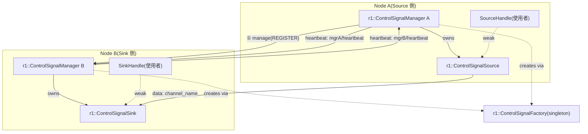
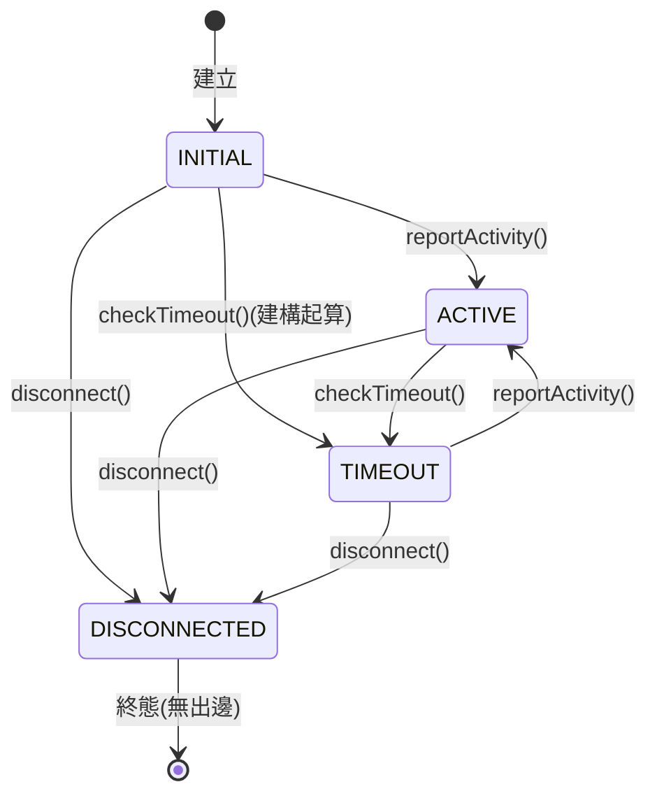
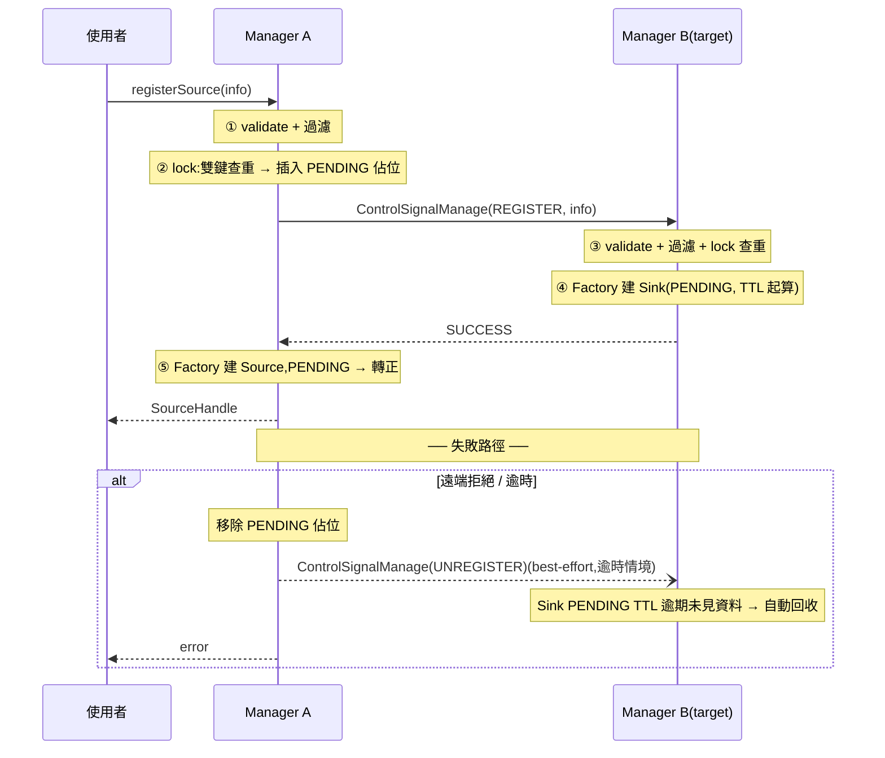

# R1 Control Signal Transport 程式設計規劃書(草稿 v0.2.0)

> 狀態:初版草稿,供討論。未決事項集中在第 11 章。
> 位置:先實作於本 repo(`rv2_control_signal_transport`)的 `r1` namespace 下,後續 migrate 至獨立 package。
> 版控:草稿以 git 管理,每次修訂一個 commit,版本號記於本節與 §0 版本歷史。

## 0. 版本歷史

| 版本 | 摘要 |
|---|---|
| v0.1.0 | 初版:設計概念、主架構、7 類別章節、整合測試規劃;經一輪 adversarial review 修正 |
| v0.2.0 | 依 my_note.md:UNKNOWN 改名 INITIAL(查無 entry 語意改以 `std::optional` 表達);新增 §4.6 tinyFSM 評估(結論:不採用,維持自製 CAS 狀態機) |

---

## 1. 設計概念

### 1.1 目標

由 `rv2_control_signal_transport` 改寫,保留 Source / Sink / Manager 三角架構,但:

1. **精簡參數與功能** — 移除未被狀態機使用的欄位、合併重疊機制、縮減狀態數。
2. **Manager 全權管理** — 使用者「不能」直接建構 Source/Sink;唯一入口是
   `ControlSignalManager::registerSource(info)`。Manager 驗證後自動向 target
   manager 發出 request,在對方產生對應 Sink。使用者拿到的是 **Handle**(弱引用),
   不是物件本體,從根本上杜絕錯誤使用與生命週期事故。
3. **並發正確性內建於設計** — rv2 並發稽核(2026-08 audit)確認 20 項問題,
   r1 逐項以架構手段消除,而非事後補丁。

### 1.2 與 rv2 的差異總表

| 面向 | rv2 | r1 |
|---|---|---|
| 使用者建構 Source/Sink | 可直接 `new`(測試中大量使用) | **禁止**;建構子 private,只有 Manager(經 Factory)可建 |
| 使用者持有物件 | `getSource()` 回 `shared_ptr`(→ 殭屍/UAF 風險) | 回 `SourceHandle`/`SinkHandle`(內部 `weak_ptr`) |
| 狀態機 | 5 態(UNKNOWN/ACTIVE/LOW_FREQ/TIMEOUT/DISCONNECTED),轉移散落各處、relaxed atomics、可被覆寫 | **4 態**(INITIAL/ACTIVE/TIMEOUT/DISCONNECTED;移除 LOW_FREQ、UNKNOWN 改名 INITIAL);集中於 `LivenessState` 類,CAS 轉移表,DISCONNECTED 真終態 |
| Keep-alive | 每個 channel 一條 `_keep_alive` topic + 每個 Sink 一個 timer | **Manager-link heartbeat**:每個 Manager 一條 heartbeat topic,對每個遠端 Manager 訂閱一次(§2.5) |
| 註冊協定 | 單向一次性;TOCTOU、無 rollback、無 unregister | **兩階段(佔位 → 確認)** + 失敗 rollback + 顯式 `unregisterSource()` |
| ControlSignalInfo | 12 欄位、9 條驗證規則 | **8 欄位、5 條規則**(§3) |
| callback lambda | 捕獲裸 `this` | 一律捕獲 `weak_ptr`(`enable_shared_from_this`) |
| Callback group | 全部落在 node 預設 MutuallyExclusive group(未文件化) | 明確策略:Manager 服務使用專屬 Reentrant group;文件化限制(§2.6) |
| 逾時檢查 | 被動 lazy + 多處觸發 | 被動 lazy 保留,但唯一寫入路徑經 `LivenessState`(§4) |
| map 鍵 | `controller_name`(2026-08 改) | 同,`controller_name` 為主鍵;`channel_name` 同樣唯一 |

### 1.3 rv2 稽核教訓 → r1 對策

| rv2 問題(嚴重度) | r1 對策 |
|---|---|
| `registerSource` TOCTOU、`operator[]` 靜默覆蓋(🔴) | 兩階段註冊:先插入 PENDING 佔位(原子佔用兩個鍵),遠端確認後轉正;任何插入路徑禁止 `operator[]`,一律 `emplace` + 檢查 |
| 裸 `this` 捕獲 → UAF(🔴) | `enable_shared_from_this` + lambda 捕獲 `weak_ptr`,callback 先 `lock()` 失敗即 return |
| stale TIMEOUT/LOW_FREQ 蓋掉新 ACTIVE、無法自癒(🟡) | `LivenessState::checkTimeout()` 以 `compare_exchange` 帶 epoch 檢查;活動時間戳與狀態同字打包(§4) |
| relaxed ordering 可見性(🟡) | `LivenessState` 內統一 acq/rel;外界只透過其 API 存取 |
| DISCONNECTED 非真終態(🟡) | 轉移表強制:DISCONNECTED 無出邊;`reportActivity()` 對 DISCONNECTED 回 false |
| 分散式註冊非原子、孤兒 Sink 永久佔位(🟡) | rollback:本地失敗時發 best-effort UNREGISTER;Sink 側 PENDING 有 TTL,未收到首筆資料/確認逾時自動回收 |
| 殭屍 Sink(erase 後仍發心跳)(🟡) | 使用者無法持有 `shared_ptr`;Manager 移除 = 立即 `shutdown()`(釋放 rclcpp entities)→ heartbeat/subscription 停止 |
| 同 node callback 內呼叫 `send()`/`registerSource()` 必然 false-timeout(🟡) | Manager 服務/client 用專屬 Reentrant group;`registerSource` 文件化為「禁止在任何 callback 內呼叫」+ debug assert |
| debug log 無鎖讀 map(🟡 UB) | log 在鎖內取 snapshot |
| `_onReg` 潛伏 TOCTOU(⚪) | 同兩階段插入,結構性消除 |

### 1.4 所有權與生命週期模型

```
ControlSignalManager ──(唯一擁有 shared_ptr)──► Source / Sink 實體
        │                                              ▲
        │ registerSource() 回傳                        │ weak_ptr
        ▼                                              │
   SourceHandle ───────────────────────────────────────┘
```

- Manager 是唯一 owner。移除(逾時斷線、unregister、解構)時:
  1. `endpoint->shutdown()`:重置 rclcpp entities(pub/sub/client/service)→ 不再有新 callback 排入。
  2. 從 map erase → `shared_ptr` 釋放。
  3. in-flight callback 因 `weak_ptr::lock()` 失敗直接返回 → 無 UAF。
- Handle 失效後所有操作回傳 error code(不丟例外)。

---

## 2. 程式主架構

### 2.1 Namespace 與檔案布局

Namespace:`rv2_interfaces::r1`(migrate 後改 `r1_control_signal_transport`;程式內以巢狀 `r1` 隔離)。

```
include/rv2_control_signal_transport/r1/
    control_signal_info.h      # Info 別名 + validateControlSignalInfo()
    liveness_state.h           # LivenessState(純邏輯,無 ROS 依賴)
    control_signal_source.h    # BaseControlSignalSource + ControlSignalSource<msgT, srvT>
    control_signal_sink.h      # BaseControlSignalSink + ControlSignalSink<msgT, srvT>
    control_signal_factory.h   # ControlSignalFactory + R1_REGISTER_CONTROL_SIGNAL
    control_signal_handles.h   # SourceHandle / SinkHandle
    control_signal_manager.h   # ControlSignalManager
src/r1/
    control_signal_factory.cpp # Factory singleton 定義(shared library 單一定義)
    control_signal_types.cpp   # 具體型別註冊(Joy / Twist / String)
test/r1/
    r1_test_utils.h
    test_liveness_state.cpp    # 純邏輯,無 rclcpp
    test_info_validation.cpp   # 純邏輯,無 rclcpp
    test_factory.cpp
    test_transport.cpp         # Source/Sink(經 Manager 之 friend 測試通道)
    test_manager.cpp           # 跨 CSM 協定
```

介面定義(暫置 `rv2_interfaces`,migrate 時搬移):

```
rv2_interfaces/msg/r1/ControlSignalInfo.msg
rv2_interfaces/msg/r1/ManagerHeartbeat.msg
rv2_interfaces/srv/r1/ControlSignalManage.srv    # op = REGISTER | UNREGISTER
rv2_interfaces/srv/r1/ControlSignalInfoReq.srv
```

### 2.2 元件關係圖



### 2.3 狀態機(4 態)



- 移除 LOW_FREQ:rv2 中它由 `timeout_ns/2` 寫死推導、不影響任何決策,只增加狀態機複雜度。
  頻率監控若有需求,由上層以 `lastActivityNs()` 自行判讀(§4 提供查詢)。
- UNKNOWN 改名 **INITIAL**(v0.2.0):物件建構後、首次活動前的狀態,我們**確知**其意義,
  「UNKNOWN」名不符實。rv2 另有雙重語意問題——`getSourceState()` 查無 entry 也回 UNKNOWN,
  與初始態混淆;r1 拆開:enum 用 INITIAL,查詢 API 以 `std::optional`(nullopt = 查無)表達(§8.2)。
  轉移語意不變:INITIAL 完整繼承原 UNKNOWN 的三條出邊。

### 2.4 註冊協定(兩階段 + rollback)



- **佔位(PENDING)** 在持鎖下完成雙鍵(controller_name + channel_name)查重與插入,
  消除 rv2 的 TOCTOU;之後的遠端等待不持鎖。
- 逾時屬「結果不明」:同時做本地回收 + best-effort UNREGISTER + 依賴遠端 TTL,三重保險。
- `unregisterSource(handle)`:本地 shutdown + erase,並向 target 發 UNREGISTER。

### 2.5 Liveness 協定

| 對象 | 機制 | 判定 |
|---|---|---|
| Sink | **資料驅動**:任何收訊 → `reportActivity()` | `elapsed > timeout_ns` → TIMEOUT |
| Source(topic 模式) | **Manager-link heartbeat**:訂閱 target manager 的 `<name>/heartbeat` | link 逾時 → 該 target 之所有 Source TIMEOUT |
| Source(service 模式) | service response(成功 → activity)+ link heartbeat | 同上,response 逾時亦記 TIMEOUT |
| 兩者 | Manager 狀態掃描 timer | TIMEOUT 持續 > `disconnect_timeout_ns` → `disconnect()` + 移除 |

Manager-link heartbeat 取代 rv2 的 per-channel keep-alive:

- 每個 Manager 一個 heartbeat publisher(週期 = manager 參數,非 per-source 參數)。
- Manager A 對「有 Source 指向的每個遠端 Manager」各維護一個訂閱與一個 link 狀態;
  link TIMEOUT 時批次將該 target 的所有 Source 標記 TIMEOUT。
- 效果:N 個 Source → 1 條 link,topic 數 O(#managers) 而非 O(#channels);
  Sink 側不再有 per-sink timer。
- 代價:失去 per-channel 粒度(遠端行程活著但單一 channel 壞掉時,Source 側看不出來)。
  緩解與否列入未決事項(§11)。

### 2.6 執行緒模型

- 本庫**不建立任何執行緒**(承襲 rv2);一切依附 node executor。
- **Callback group 策略**:
  - Manager 的 service server / client / 掃描 timer / heartbeat:放入 Manager 自建的
    **Reentrant group**(建構子建立),與使用者 node 的預設 group 隔離。
  - Source/Sink 的資料 pub/sub/service:預設 group(維持與使用者 callback 的互斥直覺)。
- 文件化硬規則 + debug assert:
  - `registerSource()` / `unregisterSource()` **禁止**在任何 ROS callback 內呼叫。
  - service 模式 `send()` 為阻塞呼叫,禁止在 callback 內呼叫。
- Manager 掃描 timer 於鎖內完成 snapshot 後才 log,無鎖外 map 存取。

---

## 3. `r1::ControlSignalInfo` 與驗證

### 3.1 訊息欄位(8 欄)

`rv2_interfaces/msg/r1/ControlSignalInfo.msg`

| 欄位 | 型別 | 說明 |
|---|---|---|
| `controller_name` | string | **必填、主鍵**。全系統唯一;Manager 之 map 鍵、黑白名單鍵 |
| `channel_name` | string | **必填、唯一**。資料 topic / service 名稱 |
| `target_manager_name` | string | 註冊時必填;Sink 所在 Manager 名 |
| `mode` | string | `"topic"` / `"service"`(常數定義於 msg) |
| `type` | string | Factory 型別鍵(`"joy"` / `"twist"` / `"string"` / …) |
| `priority` | int8 | 1–94,值大者優先;僅攜帶轉發,由上層仲裁消費 |
| `timeout_ns` | int64 | **必填 > 0**。Sink 資料逾時;service 模式亦為 response 等待上限 |
| `disconnect_timeout_ns` | int64 | 0 = 永不自動移除;否則須 > `timeout_ns` |

刪除(相對 rv2):`send_freq_hz`(從未驅動狀態機)、`use_keep_alive` / `keep_alive_interval_ns`
(改為 Manager 參數)、`controller_priority_type`(類別上限屬約定,降為文件層)。

### 3.2 驗證規則(5 條)

`validateControlSignalInfo(info)` → `{bool valid; std::string error;}`

1. `controller_name` 非空。
2. `channel_name` 非空。
3. `mode` ∈ {topic, service};`type` 非空。
4. `priority` ∈ [1, 94]。
5. `timeout_ns > 0`;且 `disconnect_timeout_ns == 0` 或 `> timeout_ns`。

### 3.3 單元測試方法與流程

- **框架**:gtest;**純邏輯、不需 rclcpp init**(msg struct 直接填欄位)。
- 流程:builder helper `makeR1Info()` 給合法預設 → 逐條規則做「單欄位破壞」測試,
  驗證 `valid == false` 且 `error` 指名該欄位;全合法組合驗證 `valid == true`。
- 案例表:

| 案例 | 修改 | 預期 |
|---|---|---|
| V1 | 全預設 | valid |
| V2 | `controller_name = ""` | invalid, error 含 "controller_name" |
| V3 | `channel_name = ""` | invalid |
| V4 | `mode = "unknown"` | invalid |
| V5 | `priority` ∈ {0, -1, 95, 127} | invalid(4 子案例) |
| V6 | `priority` ∈ {1, 94} | valid(邊界) |
| V7 | `timeout_ns = 0` | invalid |
| V8 | `disconnect_timeout_ns = timeout_ns` | invalid(須嚴格大於) |
| V9 | `disconnect_timeout_ns = 0` | valid(停用) |

---

## 4. `r1::LivenessState`

### 4.1 職責

單一類別封裝 4 態狀態機 + 活動時間戳,是**全系統唯一**允許改變狀態的地方。
純 C++、無 ROS 依賴 → 可完整單元測試。

### 4.2 設計

- 內部兩個 atomic(**定案布局**,不採單字 48-bit 壓縮方案——犧牲些微效能換可讀性與完整 ns 精度):
  - `std::atomic<uint64_t> packed_`:`[ state:8 | epoch:56 ]`
  - `std::atomic<int64_t>  lastActivityNs_`
- 所有轉移走 **CAS loop**,規則:
  1. load `packed_`(acquire)→ 查轉移表 → 允許才 `compare_exchange_strong`(acq_rel),
     expect = snapshot 完整值(state+epoch)。
  2. **每次成功轉移 epoch+1**(reportActivity、checkTimeout 的 →TIMEOUT、disconnect 皆同),
     雙向防 ABA。
  3. `reportActivity()`:先 store `lastActivityNs_`(release)再 CAS 狀態;
     `checkTimeout()`:先 load `packed_`(acquire)再 load 時間戳、算 elapsed,
     成立才以 snapshot 為 expect 做 CAS——若期間 `reportActivity()` 插隊(epoch 已 +1),
     CAS 失敗 → 重讀重判 → 判定不成立 → 保持 ACTIVE。消除 stale-TIMEOUT 覆寫。
- 時間來源:`steadyNs()` 由呼叫端注入(參數傳入),elapsed 判定因此可注入假時鐘、完全 deterministic;
  交錯順序類測試(誰先誰後)以壓力迴圈 + TSan 覆蓋。

### 4.3 類別介面

```cpp
namespace r1 {

enum class ControlSignalState : uint8_t { INITIAL, ACTIVE, TIMEOUT, DISCONNECTED };

class LivenessState
{
public:
    explicit LivenessState(int64_t nowNs);

    /// 收訊 / 心跳 / 成功 response。DISCONNECTED 時拒絕並回 false。
    bool reportActivity(int64_t nowNs);

    /// 被動逾時檢查;必要時執行 {INITIAL,ACTIVE}→TIMEOUT。回傳檢查後狀態。
    ControlSignalState checkTimeout(int64_t nowNs, int64_t timeoutNs);

    /// 終態;冪等。回傳是否由本次呼叫完成轉移。
    bool disconnect();

    ControlSignalState state() const;        // load(acquire),不觸發檢查
    int64_t lastActivityNs() const;          // 供上層做頻率監控(取代 LOW_FREQ)

private:
    std::atomic<uint64_t> packed_;           // state + epoch
    std::atomic<int64_t>  lastActivityNs_;
};

} // namespace r1
```

### 4.4 行為細節

- `checkTimeout()`:snapshot(state, epoch)→ 若 state ∈ {INITIAL, ACTIVE} 且
  `now - lastActivity > timeout` → CAS(expect 同 epoch)寫入 TIMEOUT。
  期間若 `reportActivity()` 已插隊(epoch+1),CAS 失敗 → 重讀 → 判定不成立 → 保持 ACTIVE。
- `reportActivity()`:任何非 DISCONNECTED 態 → ACTIVE(epoch+1)。
- `disconnect()`:CAS 至 DISCONNECTED;此後 `reportActivity()` 恆 false、
  `checkTimeout()` 恆回 DISCONNECTED。

### 4.5 單元測試方法與流程

- **框架**:gtest,純邏輯 + 假時鐘(手動遞增的 int64)。並發測試用 `std::thread`。
- 流程:
  1. **轉移表窮舉**:4 態 × 3 操作全組合,驗證合法轉移與拒絕(含 DISCONNECTED 終態性)。
  2. **逾時語意**:INITIAL 自建構起算逾時;ACTIVE 依 lastActivity;邊界 `elapsed == timeout` 不觸發。
  3. **stale-TIMEOUT 回歸測試**(對應 rv2 稽核發現):執行緒 A 進入 checkTimeout 且已完成
    snapshot(以 hook / 兩步 API 或高頻壓力重現),執行緒 B reportActivity → 斷言最終態 ACTIVE。
    壓力版:1 writer 高頻 reportActivity + N checker 高頻 checkTimeout(短 timeout),
    每輪結束時只要「最後一次操作是 activity」即斷言 ACTIVE;跑 10⁵ 輪。
  4. **disconnect 並發**:disconnect 與 reportActivity 併發 10⁵ 輪,斷言終態恆 DISCONNECTED。
  5. TSan job(見 §10.4)覆蓋本類所有並發測試。

| 案例 | 內容 | 預期 |
|---|---|---|
| L1 | 初始 | INITIAL |
| L2 | reportActivity | → ACTIVE, true |
| L3 | checkTimeout(elapsed > t) | ACTIVE → TIMEOUT |
| L4 | TIMEOUT 後 reportActivity | → ACTIVE |
| L5 | disconnect 後 reportActivity / checkTimeout | false / DISCONNECTED |
| L6 | INITIAL + elapsed > t | → TIMEOUT |
| L7 | 併發 stale-TIMEOUT 壓力 | 無 ACTIVE 被舊判定覆寫 |
| L8 | 併發 disconnect 壓力 | 終態不可逆 |

### 4.6 替代方案評估:tinyFSM(v0.2.0,依 my_note.md)

評估對象:[digint/tinyfsm](https://github.com/digint/tinyfsm) — header-only、C++11 template、
零動態配置、無 RTTI/例外依賴,MIT 授權;最新版 0.3.3,其後長期無 release。

| 面向 | 評估 |
|---|---|
| Thread-safety | **無內建同步**。`LivenessState` 的核心需求正是多執行緒併發轉移(使用者執行緒 `checkTimeout` vs executor 執行緒 `reportActivity`);採 tinyfsm 仍須自行外包 mutex 或 atomic 層——並發正確性問題原封不動回到我們手上,library 未解決本設計最難的部分 |
| 實例模型 | tinyfsm 狀態為**每個 FSM 類型的 static instance**(單例導向);r1 每個 Source/Sink 需獨立 FSM 實例,需 workaround,與設計錯配 |
| 表達力 | epoch/CAS 防 stale-TIMEOUT 語意(帶版本的比較交換轉移)無法以 tinyfsm 的事件 dispatch 模型表達 |
| 規模 | 本狀態機僅 4 態 × 3 操作;引入外部依賴的結構開銷大於收益 |
| 維護 | 0.3.3 後長期停更,依賴風險 |

**結論:不採用**。維持 §4.2 自製 CAS 狀態機。但採納 tinyfsm 的精神——轉移表集中宣告
(constexpr 轉移表)+ 單元測試窮舉全組合(§4.5 流程 1),確保「context safety」訴求
以可驗證方式落實。若未來狀態數成長(>8 態)再重啟評估。

---

## 5. `r1::ControlSignalSource`

### 5.1 職責

控制訊號發送端。topic 模式持 `Publisher<msgT>`,service 模式持 `Client<srvT>`。
**建構子 private**;`friend class ControlSignalManager` + Factory creator 可建。
繼承 `std::enable_shared_from_this`。

### 5.2 類別架構

```cpp
namespace r1 {

class BaseControlSignalSource
{
public:
    virtual ~BaseControlSignalSource() = default;
    virtual ControlSignalState getState() const = 0;              // 觸發被動檢查
    virtual const msg::r1::ControlSignalInfo& getInfo() const = 0;
    virtual std::type_index msgType() const = 0;
    virtual SendResult sendErased(const void* msg) = 0;
    virtual void shutdown() = 0;          // 釋放 rclcpp entities;冪等
protected:
    BaseControlSignalSource() = default;
};

/// SendResult 取代 rv2 的 (bool return + bool& cmdSuccess) 雙輸出
enum class SendResult : uint8_t {
    OK,             // 已送出(topic)/ 對方接受(service)
    REJECTED,       // service 對方回非 SUCCESS
    NO_TRANSPORT,   // transport 不可用 / 已 shutdown
    TIMEOUT,        // service response 逾時
    DISCONNECTED    // 已被 Manager 判定斷線
};

template<typename msgT, typename srvT = void>
class ControlSignalSource : public BaseControlSignalSource,
                            public std::enable_shared_from_this<...>
{
    friend class ControlSignalManager;
    friend class ControlSignalFactory;   // creator lambda
private:
    ControlSignalSource(rclcpp::Node* node, const InfoT& info);   // private!

    rclcpp::Node*                 node_;
    InfoT                         info_;
    std::variant<PubPtr, CliPtr>  transport_;   // ClientPtrOf<void> = monostate(承襲 rv2 trait)
    LivenessState                 liveness_;
    std::atomic<bool>             shutdown_{false};

public:
    SendResult send(const msgT& msg);
    ControlSignalState getState() const override;   // link 狀態由 Manager 餵入:見下
    ...
};

} // namespace r1
```

### 5.3 行為細節

- **send(topic)**:`shutdown_` 檢查 → publish → `OK`。狀態不變(無 send-side 回饋;
  liveness 由 Manager link 供給)。
- **send(service)**:`service_is_ready()` → `async_send_request` → 等待 ≤ `timeout_ns`
  (**無 50ms 隱藏 fallback**;`timeout_ns` 必填,直接使用)。
  ready → `liveness_.reportActivity()`,依 response 回 `OK`/`REJECTED`;
  逾時 → `liveness_.checkTimeout()` 語意下記為 TIMEOUT 並回 `TIMEOUT`,
  並呼叫 `client->remove_pending_request()`(rv2 稽核:pending request 洩漏)。
- **link liveness 注入**:Source 本身不訂閱 heartbeat。Manager 的 link 監視器
  在 link activity / link timeout 時對該 target 的所有 Source 呼叫
  `liveness_.reportActivity()` / `checkTimeout()`。Source 保持零 timer、零訂閱。
- **shutdown()**:置 flag → 重置 `transport_`(variant 還原為空)→ 之後 send 回 `NO_TRANSPORT`。
- lambda(service 模式無)一律不存在 → Source 無捕獲 `this` 的 callback。

### 5.4 單元測試方法與流程

- **框架**:gtest + `CsmTestBase`(r1 版:MultiThreadedExecutor 背景 spin)。
- **建構通道**:測試經 `ControlSignalFactory`(friend)直建,或經測試專用
  `ManagerTestAccess`(`friend struct`,只在 test build 提供)。**不開放 public 建構**。
- 流程:每案例建 node → 經 factory 建 Source(+ 對測 Sink 或 mock service)→ 操作 → 斷言。

| 案例 | 內容 | 預期 |
|---|---|---|
| S1 | topic 模式初始 | `getState() == INITIAL`;`send() == OK` |
| S2 | service 模式 send 成功 | `OK`;state → ACTIVE(reportActivity) |
| S3 | service 模式 server 回 REJECT | `REJECTED`;state 仍 ACTIVE(有 response 即活動) |
| S4 | service 模式無 server | `TIMEOUT`;state → TIMEOUT;耗時 ≈ `timeout_ns`(驗證無 50ms fallback) |
| S5 | shutdown 後 send | `NO_TRANSPORT`;冪等 shutdown |
| S6 | sendErased 型別轉發 | 與 send 等價;`msgType()` 正確 |
| S7 | Manager 注入 link timeout | state → TIMEOUT;再注入 activity → ACTIVE |
| S8 | disconnect 後 send | `DISCONNECTED` |

---

## 6. `r1::ControlSignalSink`

### 6.1 職責

控制訊號接收端。topic 模式持 `Subscription<msgT>`,service 模式持 `Service<srvT>`。
建構子 private;`enable_shared_from_this`;**零 timer**(keep-alive timer 已移除)。

### 6.2 類別架構

```cpp
namespace r1 {

class BaseControlSignalSink
{
public:
    using ErasedMsgCb = std::function<void(const void*, const msg::r1::ControlSignalInfo&)>;
    virtual ~BaseControlSignalSink() = default;
    virtual ControlSignalState getState() const = 0;
    virtual const msg::r1::ControlSignalInfo& getInfo() const = 0;
    virtual std::type_index msgType() const = 0;
    virtual bool readErased(void* outMsg) const = 0;   // true 僅當 ACTIVE
    virtual void setErasedMsgCallback(ErasedMsgCb cb) = 0;
    virtual void shutdown() = 0;
protected:
    BaseControlSignalSink() = default;
};

template<typename msgT, typename srvT = void>
class ControlSignalSink : public BaseControlSignalSink,
                          public std::enable_shared_from_this<...>
{
    friend class ControlSignalManager;
    friend class ControlSignalFactory;
private:
    ControlSignalSink(rclcpp::Node* node, const InfoT& info);

    std::variant<SubPtr, SrvPtr> transport_;
    LivenessState                liveness_;
    mutable std::mutex           msgMtx_;      // 僅護 latestMsg_
    std::optional<msgT>          latestMsg_;
    mutable std::mutex           cbMtx_;       // 僅護 msgCb_
    MsgCb                        msgCb_;
    std::atomic<bool>            shutdown_{false};
public:
    bool read(msgT& out) const;
    void setMsgCallback(MsgCb cb);
    ...
};

} // namespace r1
```

### 6.3 行為細節

- **收訊路徑 `_store()`**:lambda 捕獲 `weak_ptr`;lock 失敗即 return。
  成功 → `msgMtx_` 下寫 `latestMsg_` → `liveness_.reportActivity()` →
  cbMtx_ 下 copy callback → **無鎖呼叫** callback(承襲 rv2 正確做法)。
  若 `reportActivity()` 回 false(已 DISCONNECTED)→ 丟棄訊息、不觸發 callback
  (rv2 稽核:DISCONNECTED 復活問題,在此擋掉)。
- **read()**:`checkTimeout()` → msgMtx_ 下 copy → 僅 ACTIVE 回 true。
  首訊息視窗安全性由「ACTIVE 只在 `latestMsg_` 寫入後設定」保證(rv2 已證明,保留同序)。
- **service 模式**:server callback `_store(req->data)` 後回 `SRV_RES_SUCCESS`;
  已 DISCONNECTED 時回 error(對 Source 端顯性回報)。
- PENDING TTL(§2.4):由 Manager 側追蹤,Sink 本身不管。

### 6.4 單元測試方法與流程

- 同 §5.4 環境;對測用 factory 直建的 Source 或裸 `rclcpp` publisher/client(mock 上游)。

| 案例 | 內容 | 預期 |
|---|---|---|
| K1 | 初始 | INITIAL;`read() == false`,out 為預設值 |
| K2 | 收first訊息 | ACTIVE;read true + 內容正確 |
| K3 | 停止發送 elapsed > timeout | TIMEOUT;read false(內容仍為最後值) |
| K4 | TIMEOUT 後恢復發送 | → ACTIVE |
| K5 | callback:註冊後每訊息觸發、nullptr 清除、replace 語意 | 觸發次數/內容正確 |
| K6 | callback 內 re-enter(呼叫 read/getState) | 無死鎖(callback 無鎖呼叫的回歸測試) |
| K7 | service 模式 round-trip | request data == read 內容;response SUCCESS |
| K8 | disconnect 後收訊 | 訊息丟棄、狀態仍 DISCONNECTED、callback 不觸發、service 回 error |
| K9 | shutdown 後上游持續發送 | 無 callback、無狀態變化(subscription 已釋放) |
| K10 | weak-capture UAF 回歸:高頻收訊中 Manager 移除 Sink | 無 crash(ASan/TSan job) |

---

## 7. `r1::ControlSignalFactory`

### 7.1 職責

執行期型別字串 → 編譯期 `(MsgT, SrvT)` 的註冊表。承襲 rv2 設計(已驗證良好),差異:

- creator 回傳 `std::shared_ptr`(rv2 為 `unique_ptr`;r1 的 enable_shared_from_this 需要)。
- `Register()` 重複註冊改為**記 log 並拒絕**(rv2 靜默覆蓋)。
- `CreateSource/CreateSink` 不丟例外,回傳 `nullptr` + error out-param(精簡呼叫端 try/catch)。

### 7.2 類別介面

```cpp
class ControlSignalFactory
{
public:
    static ControlSignalFactory& Instance();      // 定義於 .cpp(shared library 單一定義,承襲 rv2)

    template<typename MsgT, typename SrvT = void>
    bool Register(const std::string& name);       // false = 名稱已存在

    std::shared_ptr<BaseControlSignalSource>
    CreateSource(const std::string& type, rclcpp::Node*, const InfoT&) noexcept;
    std::shared_ptr<BaseControlSignalSink>
    CreateSink(const std::string& type, rclcpp::Node*, const InfoT&) noexcept;

    std::string typeKey(std::type_index) const;   // 反查;未註冊回 ""
    bool has(const std::string& type) const;
};

#define R1_REGISTER_CONTROL_SIGNAL(UniqueId, name_str, MsgType, SrvType) ...
```

`src/r1/control_signal_types.cpp` 註冊 joy / twist / string(string topic-only,`void`)。

### 7.3 單元測試方法與流程

- gtest + 單 node(需 rclcpp init,不需跨 node)。

| 案例 | 內容 | 預期 |
|---|---|---|
| F1 | Create 已註冊型別(topic/service 模式) | 非 null;`msgType()` 正確 |
| F2 | Create 未註冊型別 | nullptr + error 字串,無例外 |
| F3 | typeKey 反查 joy/twist/string/未註冊 | "joy"/"twist"/"string"/"" |
| F4 | 重複 Register 同名 | 回 false;原 entry 不變 |
| F5 | singleton 跨 TU 一致性 | library 內註冊對測試可見(shared library 單一定義回歸) |

---

## 8. `r1::ControlSignalManager`

### 8.1 職責

- 唯一入口:`registerSource()` / `unregisterSource()`。
- 服務 host:`<name>/control_signal_manage`(REGISTER/UNREGISTER)、`<name>/control_signal_info_req`。
- Manager-link heartbeat:發布自身 heartbeat;對每個 target 維護 link 監視。
- 掃描 timer:呼叫各 entity `checkTimeout` 語意 + PENDING TTL 回收 + auto-disconnect。
- 黑白名單(`controller_name` 為鍵,雙向套用;承襲 rv2)。

### 8.2 類別架構

```cpp
class ControlSignalManager
{
public:
    ControlSignalManager(rclcpp::Node* node, const std::string& name,
                         const ManagerOptions& opt = {});
    // 非拷貝非移動

    // ── 使用者 API ──
    // 文件縮寫:using InfoT = rv2_interfaces::msg::r1::ControlSignalInfo;
    enum class RegisterError : uint8_t {
        OK, INVALID_INFO, FILTERED, DUPLICATE,
        TARGET_UNREACHABLE, TIMEOUT_UNKNOWN,   // TIMEOUT_UNKNOWN = 結果不明,已觸發 rollback
        REJECTED, TYPE_UNSUPPORTED
    };
    struct RegisterResult { RegisterError code; SourceHandle handle; };

    RegisterResult registerSource(const InfoT& info, int64_t timeoutMs = 5000);
    bool unregisterSource(const SourceHandle& h, int64_t timeoutMs = 5000);

    SourceHandle getSource(const std::string& controllerName) const;   // 查無 → 空 handle(valid()==false)
    SinkHandle   getSink(const std::string& controllerName) const;
    // 查無 entry → std::nullopt(取代 rv2「查無回 UNKNOWN」的雙重語意)
    std::optional<ControlSignalState> getSourceState(const std::string& controllerName) const;
    std::optional<ControlSignalState> getSinkState(const std::string& controllerName) const;
    std::vector<InfoT> getSourceInfoList() const;
    std::vector<InfoT> getSinkInfoList() const;

    template<typename msgT>
    void setSinkMsgCallback(std::function<void(const msgT&, const InfoT&)> cb);

    void enableControllerWhitelist(const std::vector<std::string>&);
    void disableControllerWhitelist();
    void enableControllerBlacklist(const std::vector<std::string>&);
    void disableControllerBlacklist();

    const std::string& getName() const;

private:
    struct SourceEntry {                    // map value;PENDING 佔位即一個 entry
        enum class Phase { PENDING, ACTIVE } phase;
        std::shared_ptr<BaseControlSignalSource> source;   // PENDING 時為 nullptr
        std::string channelName;            // 佔位期間供雙鍵查重
        int64_t     pendingSinceNs;
    };
    struct SinkEntry { /* 同型,含 PENDING TTL 起點 */ };

    struct LinkMonitor {                    // 每個 target manager 一個
        rclcpp::Subscription<...>::SharedPtr sub;
        LivenessState liveness;
        std::set<std::string> controllers;  // 掛在此 link 上的 Source 主鍵
    };

    mutable std::mutex sourceMtx_;  std::map<std::string, SourceEntry> sources_;
    mutable std::mutex sinkMtx_;    std::map<std::string, SinkEntry>   sinks_;
    mutable std::mutex linkMtx_;    std::map<std::string, LinkMonitor> links_;
    // cbMtx_ / typedCbs_、filterMtx_ / 黑白名單:承襲 rv2
    rclcpp::CallbackGroup::SharedPtr mgmtGroup_;   // Reentrant;服務/client/timers 屬之
};

struct ManagerOptions {
    int64_t statusTimerIntervalMs = 1000;
    int64_t heartbeatIntervalMs   = 200;
    int64_t linkTimeoutMs         = 600;    // ≈ 3 × heartbeat
    int64_t pendingTtlMs          = 10000;
};
```

### 8.3 行為細節

- **registerSource(兩階段)**:validate → 過濾 → `sourceMtx_` 下雙鍵查重 +
  `emplace` PENDING(失敗 = 重複 → error)→ 放鎖 → 遠端 manage(REGISTER) →
  成功:factory 建 Source、entry 轉正、確保 link 監視器存在、回 Handle;
  失敗/逾時:erase PENDING(+ 逾時情境 best-effort UNREGISTER)。
  轉正時**再持鎖檢查 entry 仍為自己的 PENDING**(防禦性;佔位已排除他人)。
- **_onManage(REGISTER)**:validate → 過濾 → `sinkMtx_` 查重 + emplace PENDING →
  放鎖建 Sink → 持鎖轉正(re-check:entry 仍存在且 `phase == PENDING` 才轉正;
  已被 TTL 回收 → 銷毀剛建的 Sink、回 error)→ 套用 typed callback → 回 SUCCESS。
  Sink PENDING 起 TTL:掃描 timer 發現 PENDING 超過 `pendingTtlMs` 且 liveness 仍 INITIAL → 回收。
  轉正與 TTL 回收**皆在 `sinkMtx_` 下檢查 `phase`**,互斥無競態;
  且 `pendingTtlMs`(預設 10s)≫ service 處理時間(ms 級),正常路徑不會被誤收。
- **_onManage(UNREGISTER)**:比對 controller_name(+ 來源 manager 名)→ shutdown + erase。
- **掃描 timer**(mgmtGroup):
  1. link 掃描:每個 link `checkTimeout`;TIMEOUT → 對其 controllers 批次注入 Source TIMEOUT;
     activity 由 heartbeat 訂閱 callback 即時注入。
  2. Source/Sink 掃描:TIMEOUT 起算持續 > `disconnect_timeout_ns` →
     `entity->shutdown()` → `disconnect()` → erase(順序固定:先 shutdown 再 erase)。
  3. PENDING TTL 回收。
  4. log 於鎖內 snapshot。
- **LinkMonitor 生命週期**:Source 註冊轉正時 `links_[target].controllers.insert(ctrl)`
  (無 entry 則建立訂閱);Source 移除(unregister / auto-disconnect / 解構)時
  `controllers.erase(ctrl)`,**集合空 → erase LinkMonitor(關閉 heartbeat 訂閱)**。
  多個 Source 同 target 共用一個 link,個別 unregister 不影響其餘。
- **鎖序**:`sourceMtx_`/`sinkMtx_` → `cbMtx_`(單向,承襲 rv2 已驗證無死鎖);
  `linkMtx_` 獨立,不與前兩者巢狀。

### 8.4 單元測試方法與流程

- gtest + 雙 node 雙 Manager(r1TestBase);MultiThreadedExecutor 背景 spin。
- 假時鐘不可行(rclcpp timer),以短週期參數(`ManagerOptions`)壓縮測試時間。

| 案例 | 內容 | 預期 |
|---|---|---|
| M1 | 正常註冊 | 本地 Source + 遠端 Sink;Handle 有效 |
| M2 | 重複 controller / 重複 channel(本地) | error,無遠端呼叫(觀察遠端無 Sink) |
| M3 | 跨 manager 重複(A1 已註冊,A2 同 controller → 同 target) | 遠端拒絕;A2 無殘留 PENDING |
| M4 | **並發註冊風暴**:16 執行緒同 controller 不同 target | 恰一成功;無覆蓋(rv2 TOCTOU 回歸) |
| M5 | target 不存在 → 逾時 | error;PENDING 已清;之後同名可重註冊 |
| M6 | 遠端接受但 response 丟失(mock 攔截) | 本地 error + UNREGISTER 送出;遠端 Sink 經 TTL 回收(孤兒回歸) |
| M7 | unregisterSource | 兩側移除;Handle 失效;同名可重註冊 |
| M8 | link heartbeat 停止 | 該 target 全部 Source → TIMEOUT;恢復 → ACTIVE |
| M9 | auto-disconnect | TIMEOUT 持續 > disconnect_timeout → 兩側各自移除;Handle 失效 |
| M10 | Handle 在移除後操作 | error code,無 crash、無殭屍(shutdown 已停 heartbeat/sub) |
| M11 | 黑白名單:雙向、enable/disable、空白名單=全擋 | 承襲 rv2 案例組 |
| M12 | setSinkMsgCallback 先註冊後建 Sink / 先建後註冊 | 兩序皆觸發 |
| M13 | InfoReq 服務 | 列表正確、含 PENDING 排除策略(僅列 ACTIVE) |
| M14 | callback 內呼叫 registerSource(debug build) | assert / 明確錯誤,而非 5s 假逾時 |

---

## 9. `r1::SourceHandle` / `r1::SinkHandle`

### 9.1 職責

使用者唯一持有物。輕量值型別(可拷貝),內部 `weak_ptr` + 主鍵字串。

### 9.2 介面

```cpp
class SourceHandle
{
public:
    SourceHandle() = default;                       // 空 handle
    bool valid() const;                             // weak_ptr 可 lock 且未 shutdown
    const std::string& controllerName() const;

    SendResult send(const void* msg) = delete;      // 型別安全版:
    template<typename msgT> SendResult send(const msgT& msg);   // msgType 不符 → SendResult::NO_TRANSPORT + assert(debug)
    ControlSignalState state() const;               // 失效回 DISCONNECTED
    std::optional<msg::r1::ControlSignalInfo> info() const;
private:
    friend class ControlSignalManager;
    std::weak_ptr<BaseControlSignalSource> src_;
    std::string controllerName_;
};

class SinkHandle
{
public:
    bool valid() const;
    template<typename msgT> bool read(msgT& out) const;
    ControlSignalState state() const;
    std::optional<msg::r1::ControlSignalInfo> info() const;
    // callback 註冊統一走 Manager::setSinkMsgCallback(型別層級);Handle 不提供,避免生命週期糾纏
};
```

### 9.3 行為細節

- 所有操作先 `lock()`;失敗回「失效語意」(state → DISCONNECTED、send → DISCONNECTED、read → false)。
- `send<msgT>` 於 debug build 以 `msgType()` 驗證型別,不符 assert;release 回錯誤碼。
- Handle 不延長物件生命週期(weak),Manager erase 即失效 —— 殭屍問題根除。

### 9.4 單元測試方法與流程

| 案例 | 內容 | 預期 |
|---|---|---|
| H1 | 空 handle | `valid() == false`;所有操作失效語意 |
| H2 | 正常 handle send/read/state | 轉發正確 |
| H3 | 型別不符 send<WrongMsg> | 錯誤碼(release)/ assert(debug) |
| H4 | Manager erase 後 | `valid() == false`;操作失效語意;無 crash |
| H5 | handle 拷貝語意 | 拷貝共享失效狀態 |
| H6 | 併發:handle 操作 vs Manager 移除(壓力) | 無 UAF(ASan/TSan) |

---

## 10. 系統整合測試規劃

### 10.1 需開發的測試 packages

| Package | 內容 | 用途 |
|---|---|---|
| `r1_test_mocks` | **MockManagerNode**:僅實作 `control_signal_manage` service 的可腳本化 node。腳本項:接受 / 拒絕(指定 reason)/ 延遲 N ms 回覆 / **不回覆** / 回覆後立刻斷線。 | 註冊協定故障注入(M5/M6 之整合版) |
| | **MockSourceNode / MockSinkNode**:裸 rclcpp pub/sub/client/server,可設定頻率、突發停止、亂序型別 | 資料面故障注入 |
| | **HeartbeatFaultNode**:可暫停 / 恢復 / 降頻 heartbeat 發布 | link liveness 測試 |
| `r1_integration_tests` | `launch_testing` 場景集(下表)+ 斷言工具(等待狀態收斂 helper、`ros2 topic`/`service` 探測) | 端到端驗證 |

### 10.2 整合場景

| 場景 | 步驟 | 驗證 |
|---|---|---|
| I1 全流程 | A 註冊 joy → B 自動建 Sink → 高頻 send → read/callback | 資料一致;兩側 ACTIVE;InfoReq 列表正確 |
| I2 多型別多通道 | joy + twist + string,topic + service 混合 | 隔離性;各自狀態獨立 |
| I3 斷線恢復 | 停止發送 → Sink TIMEOUT → 恢復 → ACTIVE | 狀態時序;無誤移除(disconnect_timeout=0) |
| I4 auto-disconnect | 同 I3 但 disconnect_timeout 有值;等待雙側移除 | 兩側 map 清空;Handle 失效;heartbeat/link 不受影響 |
| I5 link 故障 | HeartbeatFaultNode 暫停 B 的 heartbeat | A 側該 target 全部 Source TIMEOUT;恢復後 ACTIVE |
| I6 target 重啟 | kill B node → 重啟 B(空 Manager)| A 偵測 link 斷 → Source TIMEOUT → auto-disconnect;A 重新註冊成功(孤兒回歸) |
| I7 註冊風暴 | 兩個 node 並發向同 target 註冊 100 組(部分同名) | 唯一性不變量成立;成功數 = 唯一名數;無殘留 PENDING |
| I8 response 丟失 | MockManagerNode:接受但不回覆 | A 逾時 error;B(真 Manager 版場景)Sink TTL 回收 |
| I9 惡意/錯誤 payload | MockSourceNode 以錯誤型別發往 channel | Sink 不 crash;型別安全(DDS 層擋掉或 read 型別檢查) |
| I10 壓力 + sanitizer | I1 拉長 × ASan/TSan build | 無 leak / race 報告 |

### 10.3 執行環境

- 每個場景獨立 `ROS_DOMAIN_ID`(launch_testing 配發),避免互相干擾。
- CI:`colcon test` 跑單元;整合場景獨立 job(`colcon test --packages-select r1_integration_tests`)。

### 10.4 Sanitizer 矩陣

| Build | 目標 |
|---|---|
| ASan + LSan | H6 / K10 / M10 / I10(UAF 與 leak 回歸) |
| TSan | LivenessState 全部並發測試、M4 註冊風暴 |
| UBSan | 全單元測試 |

---

## 11. 未決事項(下輪討論)

1. **Manager-link heartbeat 粒度**:接受「失去 per-channel 粒度」?或保留可選 per-channel
   keep-alive 作為進階模式?(草稿立場:不保留,單一機制)
2. **priority 語意**:1–94 頻帶與 e-stop=94 約定是否原樣承襲?`controller_priority_type`
   降為文件約定是否可行(rv2_server_control 目前讀該欄位)?
3. **msg/srv 放置**:暫置 `rv2_interfaces/msg/r1/` vs 直接新開 `r1_interfaces` package?
   (migrate 成本 vs 相依糾纏)
4. **Sink 側事件回報**:Sink 被 auto-disconnect 時是否主動通知 Source 側 Manager
   (加一個 manage(NOTIFY_DISCONNECT)op)?草稿未含。
5. **LivenessState 打包布局**:state+epoch 單字 vs state+epoch / lastActivity 雙 atomic
   (草稿採後者,實作前以 TSan 壓力測試定案)。
6. **`registerSource` 之 async 版本**:提供 future/callback 版避免阻塞需求?
7. **rv2 → r1 migration 路徑**:兩套並存期間,`rv2_server_control` 等下游何時切換、
   是否提供 adapter。
