# R1 Control Signal Transport 程式設計規劃書(v1.2.0)

> 狀態:正式版(v1.2.0)。未決事項集中在第 12 章,將於實作階段逐項裁決。
> 位置:先實作於本 repo(`rv2_control_signal_transport`)的 `r1` namespace 下,後續 migrate 至獨立 package。
> 版控:本文件以 git 管理,每次修訂一個 commit,版本號記於本節與 §0 版本歷史。

## 0. 版本歷史

| 版本 | 摘要 |
|---|---|
| v1.2.0 | 依 my_note.md(R1 Testing):新增 §11.5 **r1_test_framework 與 docker 化測試環境**——全部測試於 docker 執行、base image 重用/test container 重建策略、`test_env/<distro>/` 產物一對一掛載、四支腳本規格(build/deps/run/packages)、`.deb` 命名規則(官方樣式 + timestamp + commit hash)、submodule + symlink 引入約定;§11.3 執行環境改寫(docker 化 + 逐 function unit test 要求);§2.1 檔案布局補測試框架項 |
| v1.1.0 | 深度整合 discussion_timeout_disconnect.md(D1–D6、D8 已裁決；D7 已確立 retry 方向,參數仍待議):**狀態語意改版**——entity 非終態與本地死亡判定只由本端活動事實自驅(send 呼叫 / 收訊),TIMEOUT 為可隨時恢復的緩衝區間、**DISCONNECTED 改為終出態**,判定或 matching lifecycle command 後完成 state callback、shutdown 與 entity 移除；**單寫者模型**(D8):hot path 只記錄,CSM 專用非重入 tick 執行計算、提交、callback 與註銷,移除 state+epoch CAS；**registration intent + 非阻塞 retry 狀態機**(D4/D7)取代休眠重連與 TIMEOUT entry 沿用(D3 否決),SourceHandle 透過穩定 slot 跨 retry 保持可用；**master CSM 級雙閾值**(D6)與 **level-triggered status 對帳**(原 §12 #3 結案)處理慢死亡與快速重啟；加入 generation/incarnation 防 stale 控制訊息、生命週期通知 ACK 重送、完整 status snapshot 與依 cause 分流的 activity-generation / response-failure-epoch terminal seal；master 的 peer-health 預警與本地 liveness 分層,不再互相覆寫；§12 原 #1、#5 消解；附錄 A 全面改寫 |
| v1.0.1 | 文件規則終審:prose 標點統一(280 處 ASCII 分號改全形,code 與 mermaid 不受影響,經逐 block 比對驗證)、一處譬喻用語修正、版控說明去「草稿」字樣；內容與設計無變更 |
| v1.0.0 | **正式版**。最終審查(5 視角 59 項確認發現)修正:v0.5.0 前殘留清除(LinkMonitor、終態 DISCONNECTED、TIMEOUT-持續斷線語意、互訂 status 敘述、per-entity heartbeat 敘述)；章節引用與清單編號修正(§12 重排、附錄 11 處 #4→#3)；設計補完:`CsmHeartbeat.srv` 取代匿名 Trigger(request 攜帶 csm_name)、休眠重註冊條件擴充(TIMEOUT 適用、加入 mode 比對、本地側完整兩階段語意)、topic Source 於 tick 跳過自身逾時檢查(無自主活動來源)、對側 ACTIVE 通知連續注入兩次達 ACTIVE、§2.5.2 服務欄位定義、驗證規則 6(target_manager_name)、Factory errOut、ManagerTestAccess friend 宣告、MsgCb 別名、測試檔配置補全、測試表重排；§12 新增 #8(使用者層 forced disconnect API) |
| v0.7.0 | 依 my_note.md(Project Design Scope):**通用化**——`priority` 改為通用欄位 **0–100**(0 = invalid 拒絕註冊、100 = 最高),僅攜帶轉發、不影響傳輸行為,語意由上層消費者定義,移除特定系統之頻帶約定(1–94、e-stop、requester band)；新增 §1.1 通用性原則與 §1.7 程式碼註解原則(註解簡短,細節寫文件)；全稿去除上層系統專屬敘述；未決事項 #2(priority 語意)裁決結案並重新編號 |
| v0.6.2 | 附錄 A 全組合完整化:六種「模式 × 拓撲」組合(topic/service × 1:1、1:N、N:1)之五種情境均改為自含完整描述(各含時序圖與說明),移除差異表式帶過；A.2 依組合重分章(A.2.1–A.2.3)；設計無變更 |
| v0.6.1 | 修正 mermaid render 失敗:附錄 A 時序圖 Note 文字內 4 處半形分號(mermaid 語句分隔符)改為全形；以 mermaid-cli 驗證全稿 15 個圖均可 render |
| v0.6.0 | 依 my_note.md 撰寫準則 #4:新增**附錄 A 應用情境**——三種拓撲(1:1、1:N、N:1)× 五種情境(註冊流程、逾時、Source CSM crash、Sink CSM crash、master crash),以 topic / service 模式分章,含時序圖、流程圖與函數呼叫流程。情境分析暴露一項設計缺口並補完:**休眠 entry 重註冊規則**(§8.3、M20)——Source CSM crash 重啟後,同 controller/channel/type 的 REGISTER 沿用休眠 Sink 轉 INITIAL,不需先 unregister |
| v0.5.2 | 新增 §0.1 術語定義；「殭屍」「風暴」等慣用詞恢復使用(依定義先行原則,見 §0.1)；內容與設計無變更 |
| v0.5.1 | 依 my_note.md 文件撰寫準則:全文文風修訂——移除口語與比喻用語(改以標準技術術語敘述)、消除過度精簡的語句、統一測試場景命名；內容與設計無變更 |
| v0.5.0 | 依 my_note.md(FSM #4/#5、timeout 機制、CSM Master):**timeout 改雙獨立閾值**(同一 elapsed 比 `timeout_ns` 與 `disconnect_timeout_ns`,皆可 0 = 停用；四種 FSM 變體圖 §2.3.1)；**per-state 轉移 callback**(entity 層 + CSM 註冊 API)；rolling window **大小可配置**(N-bucket 環形)；`getStatus()` 整合查詢；**CSM Master 集中式通知架構**(新 §9)取代 v0.3.0 互訂 status link 與 v0.4.0 點對點 NOTIFY_ABNORMAL——CSM 向 master 註冊 + heartbeat,master 訂閱各 CSM status、以 controller_name 配對 Source-Sink、one-shot 通知 `/<csm_name>/get_notifications` |
| v0.4.0 | 依 my_note.md(並發原則、Source/Sink/CSM design detail):並發原則 §1.6(atomic 優先、shared_mutex 讀寫分離)；**Source 對稱 rate 統計**(send 記錄呼叫時間/次數)；rate **記錄(hot path)與計算(CSM tick 驅動之非公開 `_calcRate()`,friend)分離**,per-entity 狀態快取；Sink 新增 **`waitForMessage()`** 阻塞等待 API(condition variable + 序號)；`ControlSignalManage.srv` 增 **NOTIFY_ABNORMAL** op,異常狀態邊緣觸發主動通報對向 CSM |
| v0.3.0 | 依 my_note.md(RAII、Sink timeout/disconnect 設計):RAII 總則(§1.5)；DISCONNECTED 改為可重連休眠態,新增 → INITIAL 轉移(§2.3/§4)；heartbeat 升級為雙向 **ManagerStatus** 狀態發布、Manager 單一 timer(§2.5)；Sink 內建 data-rate 統計、收訊先記錄再 dispatch(§6)；callback API 改為 `registerCallback`(字串鍵 + template 雙層,§8)；整合場景與未決事項更新 |
| v0.2.0 | 依 my_note.md:UNKNOWN 改名 INITIAL(查無 entry 語意改以 `std::optional` 表達)；新增 §4.6 tinyFSM 評估(結論:不採用,維持自製 CAS 狀態機) |
| v0.1.0 | 初版:設計概念、主架構、7 類別章節、整合測試規劃；經一輪 adversarial review 修正 |

### 0.1 術語定義

以下慣用詞在本文件中具有明確的技術意義；首次閱讀請先參照本節,後文直接使用不再逐次說明。

| 術語 | 本文件中的定義 |
|---|---|
| **殭屍(zombie)** | 已自管理容器(CSM 的 `sources_`/`sinks_` map)移除,但因外部仍持有引用而繼續運作(發送心跳、接收訊息、觸發 callback)的 Source/Sink 物件。rv2 稽核中的「殭屍 Sink」即此類；r1 以 Handle(`weak_ptr`)設計消除此問題 |
| **風暴(storm)** | 單一事件在短時間內觸發大量重複請求或通知的現象。本文件的具體情境:**註冊風暴**(多執行緒並發發出註冊請求)、**通知風暴**(master 或 CSM 於重啟/狀態跳變時重複發送大量變化通知) |
| **孤兒(orphan)** | 分散式註冊部分失敗後,單側殘留、無配對對象的 entry(例如 target CSM 已建 Sink,但 source 側因逾時未建 Source) |
| **對帳(reconciliation)** | master 以各 CSM 的 status 比對配對完整性的機制:entry 單側存在超過寬限期即判定「配對缺失」,通知存在側註銷並重建(§9.3)。crash 後回收的最終保障,v1.1.0 起為必要元件 |
| **registration intent** | Source CSM 應維持某條控制訊號註冊的邏輯意圖。其生命週期獨立於單次 Source endpoint；遠端失效時 endpoint 可移除並由 retry 建立新世代,而 intent 與 SourceHandle 的穩定 slot 保留(§8/§10) |
| **incarnation / generation** | `csm_instance_id` 識別一次 CSM process incarnation；`registration_id` 識別一個 logical intent；`attempt_generation` 識別該 intent 的單次註冊世代。控制面 mutation 必須比對三者,避免延遲的舊 UNREGISTER / notification 刪除新 entry(§2.5.2) |
| **degraded mode** | CSM 與 master 失聯期間的運作模式:兩側狀態皆由本地活動自驅(v1.1.0),entity 狀態零影響；僅失去 master 承載的預警、生命週期通知與對帳；CSM 間 best-effort UNREGISTER 仍可運作 |

---

## 1. 設計概念

### 1.1 目標

由 `rv2_control_signal_transport` 改寫,保留 Source / Sink / Manager 三角架構,但:

1. **精簡參數與功能** — 移除未被狀態機使用的欄位、合併重疊機制、縮減狀態數。
2. **Manager 全權管理** — 使用者「不能」直接建構 Source/Sink；唯一入口是
   `ControlSignalManager::registerSource(info)`。Manager 驗證後自動向 target
   manager 發出 request,在對方產生對應 Sink。使用者拿到的是 **Handle**(弱引用),
   不是物件本體,從介面層防止錯誤使用與生命週期缺陷。
3. **並發正確性內建於設計** — rv2 並發稽核(2026-08 audit)確認 20 項問題,
   r1 逐項以架構手段消除,而非事後補丁。
4. **RAII 貫穿所有元件**(my_note 總則)— 資源(rclcpp entities、狀態、map entries)
   一律「建構取得、解構釋放」,詳 §1.5。
5. **通用性**(v0.7.0,my_note Project Design Scope)— r1 為通用的控制訊號傳輸層,
   介面(含 `ControlSignalInfo.msg`)不得綁定任何特定上層系統的約定。
   `priority` 為通用欄位(0–100,§3.1),僅攜帶轉發、不影響傳輸行為,
   其語意(頻帶劃分、保留值等)完全由上層消費者自行定義。
   本文件與 rv2 的比較(§1.2、§1.3)屬設計沿革說明,非相依關係。

### 1.2 與 rv2 的差異總表

| 面向 | rv2 | r1 |
|---|---|---|
| 使用者建構 Source/Sink | 可直接 `new`(測試中大量使用) | **禁止**；建構子 private,只有 Manager(經 Factory)可建 |
| 使用者持有物件 | `getSource()` 回傳 `shared_ptr`(殭屍物件與 use-after-free 風險,§0.1) | 回傳 `SourceHandle`/`SinkHandle`(內部 `weak_ptr`)；SourceHandle 指向穩定 registration slot,遠端故障 retry 時不需由 App 換 Handle(§10) |
| 狀態機 | 5 態(UNKNOWN/ACTIVE/LOW_FREQ/TIMEOUT/DISCONNECTED),轉移散落各處、relaxed atomics、可被覆寫 | **4 態**(INITIAL/ACTIVE/TIMEOUT/DISCONNECTED；移除 LOW_FREQ、UNKNOWN 改名 INITIAL)；非終態與本地死亡判定由**本端活動事實**(send 呼叫 / 收訊時間戳)自驅,CSM tick 為唯一狀態推進者(單寫者,v1.1.0,§4)；DISCONNECTED 為**終出態**,本地判定或 matching lifecycle command 即註銷 entry(§2.3) |
| 斷線後 entry | DISCONNECTED 即 erase(不穩定連線反覆 add/remove) | 不穩定連線由 **TIMEOUT 可恢復區間**吸收(entry 保留,恢復活動即回 ACTIVE)；DISCONNECTED = 確認死亡,**判定即註銷**(v1.1.0),重建由 CSM retry 佇列重新註冊(§2.3/§8.3) |
| Keep-alive | 每個 channel 一條 `_keep_alive` topic + 每個 Sink 一個 timer | **ManagerStatus 發布 + CSM Master 集中式**(v0.5.0):每個 Manager 一條 `<name>/status` topic(含管理清單與各 entry 狀態),唯一訂閱者為 CSM Master,CSM 之間互不訂閱；v1.1.0 起 STATE edge 採 best-effort,peer-health / lifecycle control event 具 event ID 並可靠重送至 ACK(§2.5/§9) |
| 頻率監控 | `send_freq_hz` 宣告值 + LOW_FREQ 推導(從未驅動決策) | **Source/Sink 對稱實測 rate**(v0.4.0):hot path 只記錄(時間+次數),計算集中於 CSM tick 呼叫的非公開 `_calcStatus()`(v1.1.0 更名並改純計算)；隨 status 發布(§5/§6) |
| 讀取模式 | `read()` 輪詢 | `read()` 輪詢 + **`waitForMessage()` 阻塞等待**(condition variable,§6) |
| 異常傳遞 | 無(各側獨立判定,對向不知情) | **CSM Master 集中式**(v0.5.0,§9):master 訂閱各 CSM status、配對 Source-Sink；v1.1.0 起另有 best-effort STATE 觀測事件,control 通知分**預警 / 註銷 / 配對缺失**三類；通知均非本地狀態來源(狀態由本端自驅) |
| Timeout 語意 | TIMEOUT 持續逾 `disconnect_timeout_ns` 才斷線(疊加計時) | **雙獨立閾值**(v0.5.0):同一 elapsed 比對兩閾值,`0` = 各自停用；四種 FSM 變體(§2.3.1) |
| 狀態變化觀測 | 輪詢 `getState()` | 輪詢 + **per-state 轉移 callback**(entity 層註冊,CSM 亦提供 per-state 註冊 API,§5/§6/§8) |
| Sink callback API | `setSinkMsgCallback<msgT>(cb)`(type_index 鍵) | `registerCallback` 雙層:template 型別安全版 + 字串鍵型別抹除版；鍵統一為 type 字串(§8) |
| RAII | shutdown 語意混雜、解構不保證釋放順序 | 全元件 RAII(§1.5):解構即完整釋放；Manager 解構自動 best-effort 反註冊 |
| 註冊協定 | 單向一次性；TOCTOU、無 rollback、無 unregister | **兩階段(佔位 → 確認)** + 失敗 rollback + 顯式 `unregisterSource()` |
| ControlSignalInfo | 12 欄位、9 條驗證規則 | **8 欄位、6 條規則**(§3) |
| callback lambda | 捕獲裸 `this` | 一律捕獲 `weak_ptr`(`enable_shared_from_this`) |
| Callback group | 全部落在 node 預設 MutuallyExclusive group(未文件化) | 明確策略:Manager 服務使用專屬 Reentrant group；文件化限制(§2.6) |
| 逾時檢查 | 被動 lazy + 多處觸發 | 集中於 CSM status tick:計算、寫入、state callback、註銷同一鏈完成(單寫者,§8.3) |
| map 鍵 | `controller_name`(2026-08 改) | 同,`controller_name` 為主鍵；`channel_name` 同樣唯一 |

### 1.3 rv2 稽核教訓 → r1 對策

| rv2 問題(嚴重度) | r1 對策 |
|---|---|
| `registerSource` TOCTOU、`operator[]` 靜默覆蓋(🔴) | 兩階段註冊:先插入 PENDING 佔位(原子佔用兩個鍵),遠端確認後轉正；任何插入路徑禁止 `operator[]`,一律 `emplace` + 檢查 |
| 裸 `this` 捕獲 → UAF(🔴) | `enable_shared_from_this` + lambda 捕獲 `weak_ptr`,callback 先 `lock()` 失敗即 return |
| stale TIMEOUT/LOW_FREQ 蓋掉新 ACTIVE、無法自癒(🟡) | **單寫者模型**(v1.1.0,§4):狀態唯一寫者為 CSM tick(單執行緒序列化),收訊 / send 路徑只記錄時間戳與計數；「檢查 vs 活動」的併發寫狀態競態在結構上不存在,epoch CAS 機制隨之廢除 |
| relaxed ordering 可見性(🟡) | hot path 時間戳採 atomic max、activity generation 採 release/acquire 發布協定(§4.2)；狀態欄位單寫者,讀者經 atomic load 取值 |
| DISCONNECTED 非真終態(🟡) | DISCONNECTED 回歸**終出態**(v1.1.0):CSM tick 判定後即執行註銷(state callback → shutdown → erase),無任何出邊；重建須重新提交註冊(§2.3/§8.3) |
| 分散式註冊非原子、孤兒 Sink 永久佔位(🟡) | rollback:本地失敗時發 best-effort UNREGISTER；未轉正的 Sink PENDING 有 TTL 逾時回收；response 丟失致遠端已轉正的孤兒 Sink 依本地 elapsed 走到 DISCONNECTED 自動註銷,master 對帳亦會偵測配對缺失(§9.3) |
| 殭屍 Sink:自 map 移除後仍持續發送心跳(🟡) | 使用者無法持有 `shared_ptr`；Manager 移除時立即 `shutdown()`(釋放 rclcpp entities),transport 隨之停止；r1 亦無 per-entity heartbeat 可殘留(liveness 為 Manager 級 status 發布,§2.5) |
| 同 node callback 內呼叫 `send()`/`registerSource()` 必然 false-timeout(🟡) | Manager 服務/client 用專屬 Reentrant group；`registerSource` 文件化為「禁止在任何 callback 內呼叫」+ debug assert |
| debug log 無鎖讀 map(🟡 UB) | log 在鎖內取 snapshot |
| `_onReg` 之尚未觸發的 TOCTOU(⚪) | 同兩階段插入,結構性消除 |

### 1.3.1 三層狀態模型(v1.1.0)

為避免把本地資料節律、遠端健康與註冊生命週期壓縮成同一個 enum,v1.1.0 將三者
明確分層；後續各章與 API 均遵守此模型:

| 層級 | 狀態 / 資料 | 唯一決策來源 | 作用 |
|---|---|---|---|
| **Entity local liveness** | INITIAL / ACTIVE / TIMEOUT / DISCONNECTED | INITIAL / ACTIVE / TIMEOUT 與本地確認死亡由 Source `send()`、service response outcome 或 Sink 收訊記錄計算；matching lifecycle command 只可強制 terminal DISCONNECTED；一律由 CSM tick 提交 | 驅動 entity state callback、read 可用性與終出註銷 |
| **Registration lifecycle** | PENDING / REGISTERED / RETRY_WAIT / REMOVING / ABSENT | CSM 的註冊交易、顯式 unregister、終出註銷與 retry 狀態機 | 管理 endpoint、registration intent、Handle 與跨側重建 |
| **Peer / CSM health** | UNKNOWN / ACTIVE / TIMEOUT / DISCONNECTED、PAIR_MISSING | Master 的 heartbeat 雙閾值與 status 對帳 | 經 notification callback 告知 App；TIMEOUT 不覆寫 local liveness,DISCONNECTED / PAIR_MISSING 僅提出具世代條件的生命週期移除要求 |

不變量:

1. `ControlSignalState` 表示第一層,不得以 peer TIMEOUT 寫入；D1 的「TIMEOUT」為
   **peer-health 預警**,由 CSM entry 的獨立欄位保存。
2. DISCONNECTED 可由本地確認死亡或強制生命週期決策產生；兩者皆只經 CSM tick
   提交,且狀態 callback 必須先於 endpoint 移除。
3. Master 不偽造本地活動。跨側通知攜帶預期 incarnation / registration generation,
   接收端只對相符世代執行冪等操作。

### 1.4 所有權與生命週期模型

```
ControlSignalManager ──owns──► SourceRegistrationSlot ──owns current──► Source endpoint
        │                              ▲                                      │
        │ registerSource() 回傳        │ weak_ptr                             │ retry 時替換
        ▼                              │                                      ▼
   SourceHandle ───────────────────────┘                              新 Source endpoint

ControlSignalManager ──owns──► Sink endpoint ◄──weak── SinkHandle
```

- Manager 是 endpoint 與 registration slot 的唯一 owner；Handle 不延長兩者生命週期。
- Source 的 logical registration intent 與實體 endpoint 分離。遠端死亡 / 配對缺失時,
  舊 endpoint 依序 callback → shutdown → reset,slot 轉 `RETRY_WAIT` 並保留；retry 成功
  後把新 endpoint 原子替換進同一 slot,既有 SourceHandle 因而可繼續使用。顯式
  unregister、本地長期無活動確認死亡或 Manager 解構才移除 slot。
- Sink 無本地 registration intent；註銷即移除 endpoint,後續由對側 Source 的新
  REGISTER 建立新 Sink。
- **Endpoint 移除**(unregister、解構、DISCONNECTED 註銷,v1.1.0,§8.3)時:
  1. `endpoint->shutdown()`:重置 rclcpp entities(pub/sub/client/service)→ 不再有新 callback 排入。
  2. Source slot reset endpoint 或 Sink map erase → `shared_ptr` 釋放。
  3. in-flight callback 因 `weak_ptr::lock()` 失敗直接返回 → 無 UAF。
- Source slot 在 `RETRY_WAIT` 時 Handle 仍有效但 endpoint 暫不可用,send 回 `RETRYING`；
  slot 被移除後所有操作回傳失效語意(不丟例外)。詳 §10。

### 1.5 RAII 原則(v0.3.0,my_note 總則)

全部元件遵守「建構取得、解構釋放」:

| 元件 | 建構取得 | 解構釋放 |
|---|---|---|
| Source / Sink | rclcpp transport entities、LivenessState | entities 重置(等效 `shutdown()`；`shutdown()` 僅為提前釋放的冪等捷徑,解構為最終保障) |
| Manager | 服務、status pub、tick timer、callback groups、master 端 clients(register / heartbeat / notify 接收 server,v0.5.0) | 依序:停止 tick 與 retry 啟動 → 將所有 slots 設為 undesired 並取消 in-flight retry → 對已發送且遠端可能仍持有 endpoint 的最新 attempt 發具 generation 的 best-effort UNREGISTER → 停止服務與 clients → 釋放全部 slots / entries |
| Handle | 無資源(weak_ptr + 字串) | 無 |

- 禁止裸 `new`/手動 delete；一律 `std::shared_ptr`/`std::unique_ptr`/值語意。
- 不依賴使用者呼叫任何 cleanup API:忘記 unregister、直接讓 Manager 出 scope,
  也不留下 dangling rclcpp entities。遠端孤兒以 matching-generation best-effort
  UNREGISTER、PENDING TTL、本地 DISCONNECTED(啟用時)及 master level reconciliation
  共同回收；若所有終止來源皆停用或不可用,不得宣稱有限時間收斂。

### 1.6 並發原則(v0.4.0,my_note 總則)

所有 flag 與並發變數依「最輕量足夠」原則選工具,由輕至重:

| 工具 | 適用 | 本設計應用點 |
|---|---|---|
| `std::atomic`(單變數) | 獨立 flag、計數器、快取值 | `shutdown_` flag、rate bucket 計數、cached `rateHz_`(atomic\<float\>)、訊息序號 `msgSeq_`、activity generation / terminal seal(§4) |
| `std::shared_mutex` | **讀多寫少**共享結構 | CSM `sources_`/`sinks_` map(讀:狀態查詢、status tick、getXxx；寫:register/unregister)、黑白名單、`typedCbs_` callback 表 |
| `std::mutex` + condition variable | 寫頻繁 / 需等待語意 | Sink `msgMtx_`(每訊息寫)+ `msgCv_`(`waitForMessage`,§6) |

- 規則:atomic 能表達就不用鎖；讀路徑遠多於寫路徑才用 `shared_mutex`
  (`std::shared_lock` 讀 / `std::unique_lock` 寫),否則普通 mutex 更省；
  持鎖區塊最小化,callback 一律鎖外呼叫(承襲 rv2 驗證過的模式)。
- 每個成員變數在類別章節中標注其保護手段；無標注 = 建構後唯讀。
- 使用 CAS 僅限 activity-generation / terminal-seal 與冪等旗標；v1.0.1 的
  **state+epoch CAS 狀態轉移**已移除。時間戳以 atomic max 更新,不得因多 writer
  交錯而倒退；跨欄位 snapshot 使用明定的 release/acquire protocol(§4.2)。

### 1.7 程式碼註解原則(v0.7.0,my_note Project Design Scope)

- 註解**簡短明確**:一行說明目的或不變量即可；不重述程式行為、不展開設計背景。
- 詳細資訊(設計理由、協定流程、狀態機語意、時序)一律寫入文件
  (本規劃書與後續 API 文件),註解只留指向(例如「詳見設計文件 §4.2」)。
- 實作階段的 code review 將以此為檢核項目之一。

---

## 2. 程式主架構

### 2.1 Namespace 與檔案布局

Namespace:`rv2_interfaces::r1`(migrate 後改 `r1_control_signal_transport`；程式內以巢狀 `r1` 隔離)。

```
include/rv2_control_signal_transport/r1/
    control_signal_info.h      # Info 別名 + validateControlSignalInfo()
    liveness_state.h           # LivenessState(純邏輯,無 ROS 依賴)
    control_signal_source.h    # BaseControlSignalSource + ControlSignalSource<msgT, srvT>
    source_registration.h     # SourceRegistrationSlot 支援型別與 identity / lifecycle 定義
    control_signal_sink.h      # BaseControlSignalSink + ControlSignalSink<msgT, srvT>
    control_signal_factory.h   # ControlSignalFactory + R1_REGISTER_CONTROL_SIGNAL
    control_signal_handles.h   # SourceHandle / SinkHandle
    control_signal_manager.h   # ControlSignalManager
src/r1/
    control_signal_factory.cpp # Factory singleton 定義(shared library 單一定義)
    control_signal_types.cpp   # 具體型別註冊(Joy / Twist / String)
test/r1/
    r1_test_utils.h
    test_liveness_state.cpp    # 純邏輯,無 rclcpp
    test_info_validation.cpp   # 純邏輯,無 rclcpp
    test_factory.cpp
    test_transport.cpp         # Source/Sink(經 Manager 之 friend 測試通道)
    test_manager.cpp           # 跨 CSM 協定
    test_csm_master.cpp        # CsmMaster(§9.4 CM1–CM13,mock CSM 裸 node)
    test_handles.cpp           # Handle(§10.4 H1–H8)
```

測試框架(v1.2.0,§11.5):package 根目錄另含 `r1_test_framework/`(git submodule)、
四支 symlink 腳本(`test_build.sh` 等)與腳本產物目錄 `test_env/<distro>/`
(`.gitignore` 排除)。

介面定義(暫置 `rv2_interfaces`,migrate 時搬移):

```
rv2_interfaces/msg/r1/ControlSignalInfo.msg
rv2_interfaces/msg/r1/ManagerStatus.msg          # 狀態發布;訂閱者 = CSM Master(§2.5.1)
rv2_interfaces/msg/r1/EntryStatus.msg            # 含 manager_name(v0.5.0,master 配對/通知用)
rv2_interfaces/srv/r1/ControlSignalManage.srv    # op = REGISTER | UNREGISTER(v0.5.0 移除 NOTIFY_ABNORMAL)
rv2_interfaces/srv/r1/ControlSignalInfoReq.srv
rv2_interfaces/srv/r1/CsmRegister.srv            # CSM → master 註冊(v0.5.0;v1.1.0 增列 CSM 級雙閾值欄位,D6)
rv2_interfaces/srv/r1/CsmNotify.srv              # master → CSM 通知:預警/註銷/配對缺失(v1.1.0)
rv2_interfaces/srv/r1/ControlSignalJoy.srv       # service 模式資料通道(隨型別註冊配套,§7)
rv2_interfaces/srv/r1/ControlSignalTwist.srv
rv2_interfaces/srv/r1/CsmHeartbeat.srv           # CSM → master 心跳(req 攜帶 csm_name;std_srvs/Trigger 之 request 為空,master 無法識別呼叫者,故自訂)
```

新增執行檔(v0.5.0):`csm_master_node`(獨立 node,host `r1::CsmMaster`,§9)。

```
src/r1/csm_master.cpp / include/rv2_control_signal_transport/r1/csm_master.h
```

### 2.2 元件關係圖

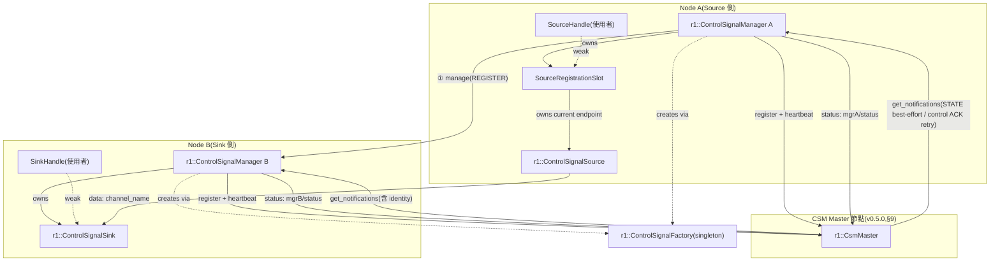
```mermaid
graph TB
    subgraph NodeA["Node A(Source 側)"]
        MA["r1::ControlSignalManager A"]
        SLOT["SourceRegistrationSlot"]
        SRC["r1::ControlSignalSource"]
        HA["SourceHandle(使用者)"]
        MA -->|owns| SLOT
        SLOT -->|owns current endpoint| SRC
        HA -.weak.-> SLOT
    end
    subgraph NodeB["Node B(Sink 側)"]
        MB["r1::ControlSignalManager B"]
        SNK["r1::ControlSignalSink"]
        HB["SinkHandle(使用者)"]
        MB -->|owns| SNK
        HB -.weak.-> SNK
    end
    MA -->|"① manage(REGISTER)"| MB
    SRC -->|"data: channel_name"| SNK
    subgraph Master["CSM Master 節點(v0.5.0,§9)"]
        CM["r1::CsmMaster"]
    end
    MA -->|"register + heartbeat"| CM
    MB -->|"register + heartbeat"| CM
    MA -->|"status: mgrA/status"| CM
    MB -->|"status: mgrB/status"| CM
    CM -->|"get_notifications(STATE best-effort / control ACK retry)"| MA
    CM -->|"get_notifications(含 identity)"| MB
    F["r1::ControlSignalFactory(singleton)"]
    MA -.creates via.-> F
    MB -.creates via.-> F
```

- v0.5.0 起 **CSM 之間不互訂 status**；status 唯一訂閱者為 CSM Master。
  CSM 間僅存的直接通訊 = 註冊協定(`control_signal_manage`,§2.4)與資料通道本身。

### 2.3 狀態機(4 態)

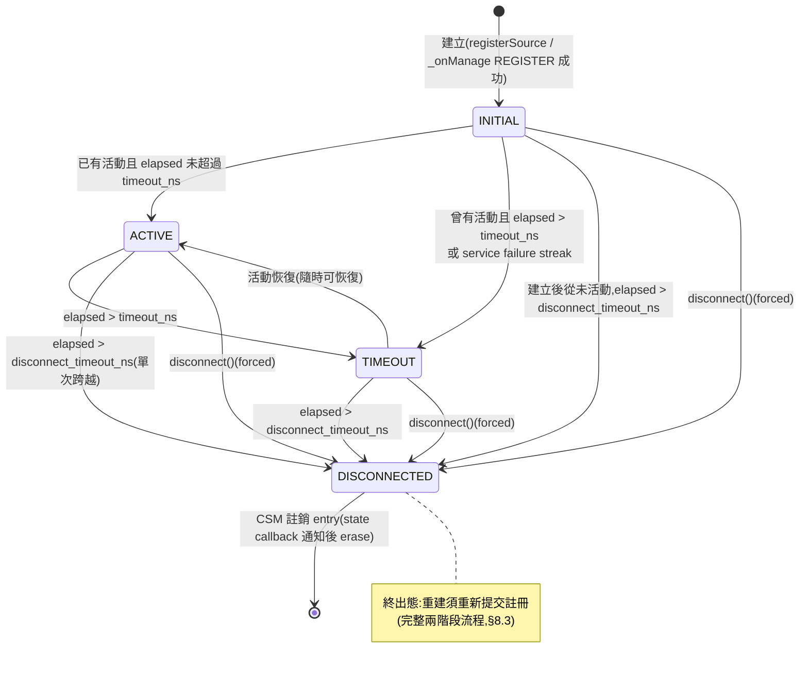
```mermaid
stateDiagram-v2
    [*] --> INITIAL : 建立(registerSource / _onManage REGISTER 成功)
    INITIAL --> ACTIVE : 已有活動且 elapsed 未超過 timeout_ns
    INITIAL --> TIMEOUT : 曾有活動且 elapsed > timeout_ns<br/>或 service failure streak
    ACTIVE --> TIMEOUT : elapsed > timeout_ns
    TIMEOUT --> ACTIVE : 活動恢復(隨時可恢復)
    TIMEOUT --> DISCONNECTED : elapsed > disconnect_timeout_ns
    ACTIVE --> DISCONNECTED : elapsed > disconnect_timeout_ns(單次跨越)
    INITIAL --> DISCONNECTED : 建立後從未活動,elapsed > disconnect_timeout_ns
    INITIAL --> DISCONNECTED : disconnect()(forced)
    ACTIVE --> DISCONNECTED : disconnect()(forced)
    TIMEOUT --> DISCONNECTED : disconnect()(forced)
    DISCONNECTED --> [*] : CSM 註銷 entry(state callback 通知後 erase)
    note right of DISCONNECTED
        終出態:重建須重新提交註冊
        (完整兩階段流程,§8.3)
    end note
```

- **狀態自驅**(v1.1.0):每個 entity 的非終態與本地死亡判定只由**本端可觀測事實**決定——topic Source
  的活動 = `send()` 呼叫本身；service Source 再併入 response-health；Sink 的活動 =
  訊號到達。Source 與 Sink 共用四態與雙閾值,但 service Source 另取兩個子判定的
  較嚴結果。master 通知降為預警與
  entry 生命週期同步,不是 ACTIVE / TIMEOUT 的狀態來源；matching lifecycle command
  僅可強制 terminal DISCONNECTED 以完成註銷(§1.3.1/§2.5/§9)。
- 移除 LOW_FREQ:rv2 中它由 `timeout_ns/2` 寫死推導、不影響任何決策,只增加狀態機複雜度。
  頻率監控由實測 rate 承擔(§5/§6)。
- UNKNOWN 改名 **INITIAL**(v0.2.0):物件建構後、首次活動前的狀態,我們**確知**其意義,
  「UNKNOWN」名不符實。rv2 另有雙重語意問題——`getSourceState()` 查無 entry 也回 UNKNOWN,
  與初始態混淆；r1 拆開:enum 用 INITIAL,查詢 API 以 `std::optional`(nullopt = 查無)表達(§8.2)。
- **雙獨立閾值 timeout**(v0.5.0,my_note Timeout Mechanism):同一 `elapsed = now − lastActivity`
  比對兩個閾值——`elapsed > timeout_ns` → TIMEOUT(data-rate timeout)；
  `elapsed > disconnect_timeout_ns` → DISCONNECTED(disconnect timeout,優先判定)。
  兩閾值皆支援 **`0` = 停用**(§2.3.1 變體)；皆啟用時仍要求 `disconnect > timeout`(§3.2)。
  判定於 CSM tick 呼叫的 `calcState()` 內完成(§4.4)。
- **TIMEOUT = 可恢復緩衝區間**(v1.1.0):活動恢復即回 ACTIVE,entry 全程保留,無任何成本；
  不穩定連線在 ACTIVE/TIMEOUT 之間震盪即被吸收,不觸發 add/remove。
  `disconnect_timeout_ns` 為「確認死亡」的長閾值,建議設為 `timeout_ns` 的 5–10 倍以上(§3.1)。
- **DISCONNECTED = 終出態**(v1.1.0):判定即進入註銷流程——state callback 觸發後,
  CSM 於同一 tick 內 shutdown + erase(§8.3)；重建須重新提交註冊(完整兩階段,
  由 retry 狀態機或 App 發起)。本地 timeout 判定先以 activity generation 執行
  terminal seal；若計算後已有新活動,seal 失敗並取消本輪註銷,避免誤刪仍活躍 endpoint。
  seal 成功後的新活動會被拒絕,其線性化點即為「確認死亡」成立時點(§4.2/§8.3)。
  判定與 endpoint 移除之間存在短暫可觀測窗口；遠端失效觸發 retry 時 SourceHandle
  維持 logical intent 有效,其餘移除情況依 §10.3 的 slot 生命週期處理。
- **從未活動的 INITIAL 不轉 TIMEOUT**(v1.1.0):generation = 0 時無「中斷」語意,
  唯一自動出路為 disconnect 閾值的確認死亡；未完成註冊握手由 PENDING TTL
  (§2.4)先行回收。若已有活動但第一次 tick 較晚,純計算可依 elapsed 直接由
  INITIAL 得到 TIMEOUT；service 首次 send 已形成 failure streak時亦可走此邊。
- **狀態推進時機**(v1.1.0,D8):所有轉移由 CSM tick 執行(單寫者,§4/§8.3)；
  活動事件於 hot path 只記錄,狀態於下一個 tick 更新——狀態粒度 = `statusIntervalMs`
  (取捨見 §4.2)。
- 「forced disconnect」:`disconnect()` 語意改為**強制進入註銷流程**(v1.1.0)——
  CSM 寫入 DISCONNECTED 並執行註銷；與閾值機制並存,所有變體保留此邊
  (使用者層 API 是否開放見 §12 #5)。
- **FSM #3 歷史註記**:my_note FSM #3(v0.3.0 採納 DISCONNECTED → INITIAL 重連)的
  原始動機——避免不穩定連線頻繁 add/remove——自 v1.1.0 起由 TIMEOUT 可恢復區間承擔；
  只有超過長閾值的確認死亡才付出 add/remove 成本,DISCONNECTED 回歸「確認死亡 → 註銷」。

#### 2.3.1 Timeout 停用之 FSM 變體(v0.5.0,my_note Timeout #3)

兩閾值各自可為 `0`(停用),共四種組態；`disconnect()`(forced)與註銷出口全變體保留。

**變體 A — 兩者啟用**(`timeout_ns > 0, disconnect_timeout_ns > 0`):上圖(完整)。

**變體 B — disconnect 停用**(`timeout_ns > 0, disconnect_timeout_ns = 0`):
無自動 DISCONNECTED；最深自動狀態為 TIMEOUT,可無限期停留、活動恢復隨時回 ACTIVE；
僅 forced `disconnect()` 進入註銷。從未活動的 entity 停留 INITIAL。

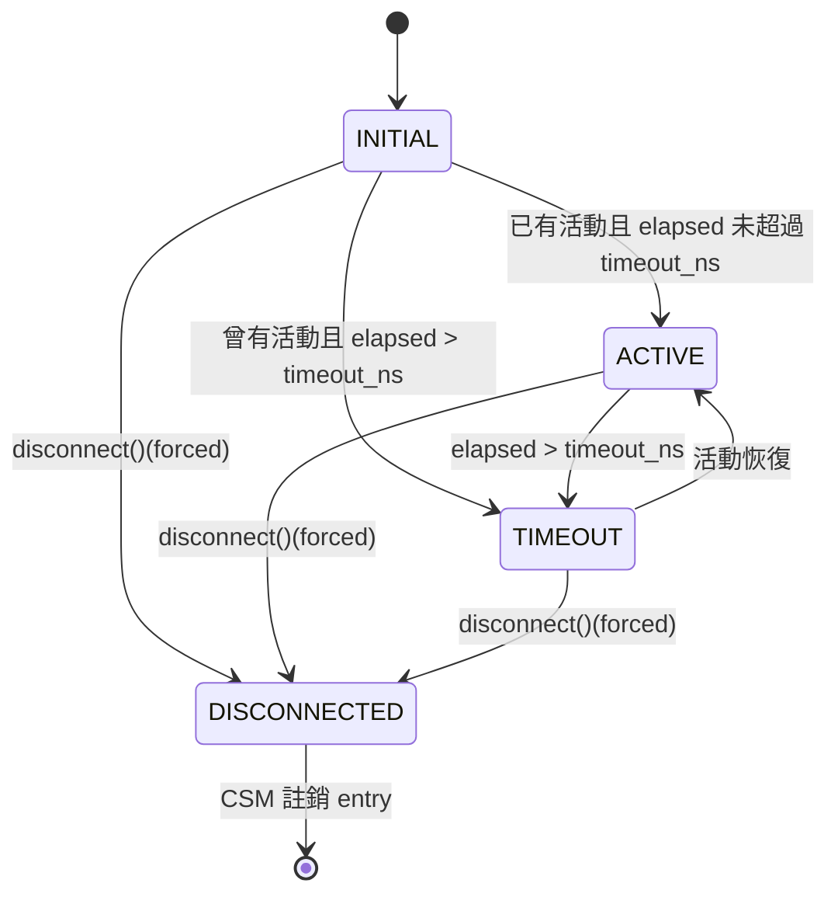
```mermaid
stateDiagram-v2
    [*] --> INITIAL
    INITIAL --> ACTIVE : 已有活動且 elapsed 未超過 timeout_ns
    INITIAL --> TIMEOUT : 曾有活動且 elapsed > timeout_ns
    ACTIVE --> TIMEOUT : elapsed > timeout_ns
    TIMEOUT --> ACTIVE : 活動恢復
    INITIAL --> DISCONNECTED : disconnect()(forced)
    ACTIVE --> DISCONNECTED : disconnect()(forced)
    TIMEOUT --> DISCONNECTED : disconnect()(forced)
    DISCONNECTED --> [*] : CSM 註銷 entry
```

**變體 C — data-rate timeout 停用**(`timeout_ns = 0, disconnect_timeout_ns > 0`):
TIMEOUT 態不可達；elapsed 超過 disconnect 閾值直接判定死亡並註銷
(適合「只要最終斷線判定、不需中間警示」的通道)。

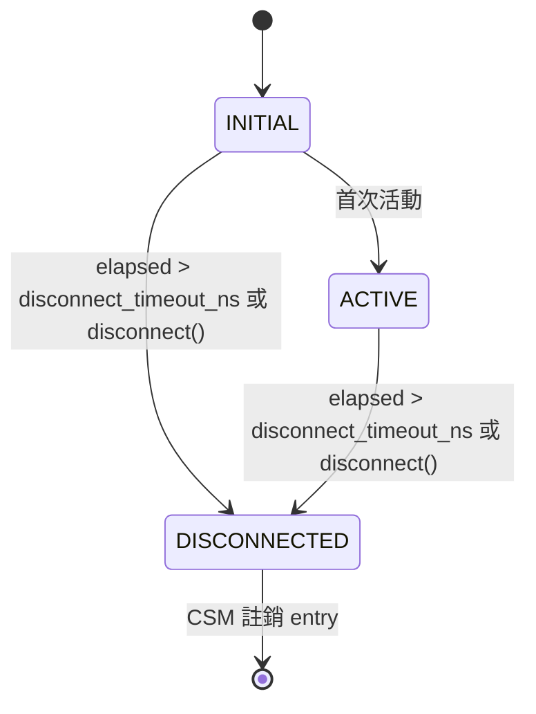
```mermaid
stateDiagram-v2
    [*] --> INITIAL
    INITIAL --> ACTIVE : 首次活動
    INITIAL --> DISCONNECTED : elapsed > disconnect_timeout_ns 或 disconnect()
    ACTIVE --> DISCONNECTED : elapsed > disconnect_timeout_ns 或 disconnect()
    DISCONNECTED --> [*] : CSM 註銷 entry
```

**變體 D — 兩者停用**(`timeout_ns = 0, disconnect_timeout_ns = 0`):
無任何自動逾時；只有 forced `disconnect()` 能離開 INITIAL/ACTIVE
(適合離散事件型通道,例如單次事件型指令)。

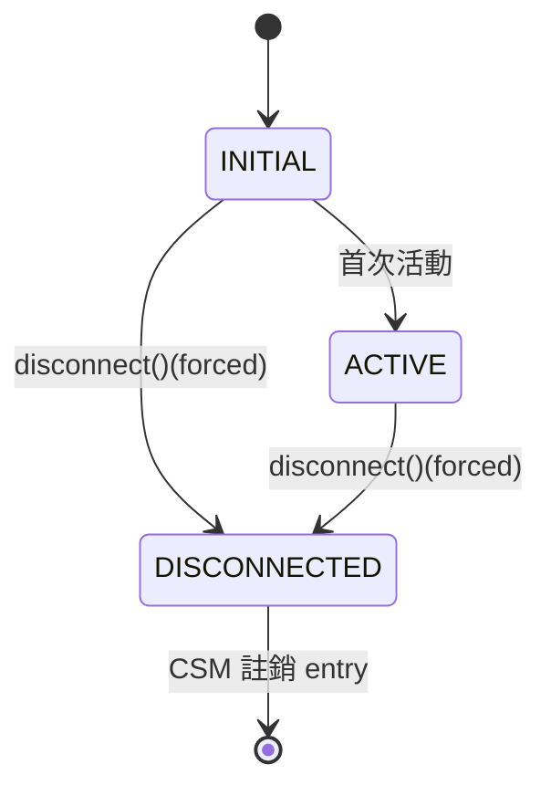
```mermaid
stateDiagram-v2
    [*] --> INITIAL
    INITIAL --> ACTIVE : 首次活動
    INITIAL --> DISCONNECTED : disconnect()(forced)
    ACTIVE --> DISCONNECTED : disconnect()(forced)
    DISCONNECTED --> [*] : CSM 註銷 entry
```

實作註記:四變體共用同一 `calcState(now, timeoutNs, disconnectNs)`(§4.4)——閾值為 0 即跳過
該項比對,**不是**四份狀態機；變體只是參數化行為的可視化。單元測試逐變體驗證(§4.5)。

### 2.4 註冊協定(兩階段 + rollback)

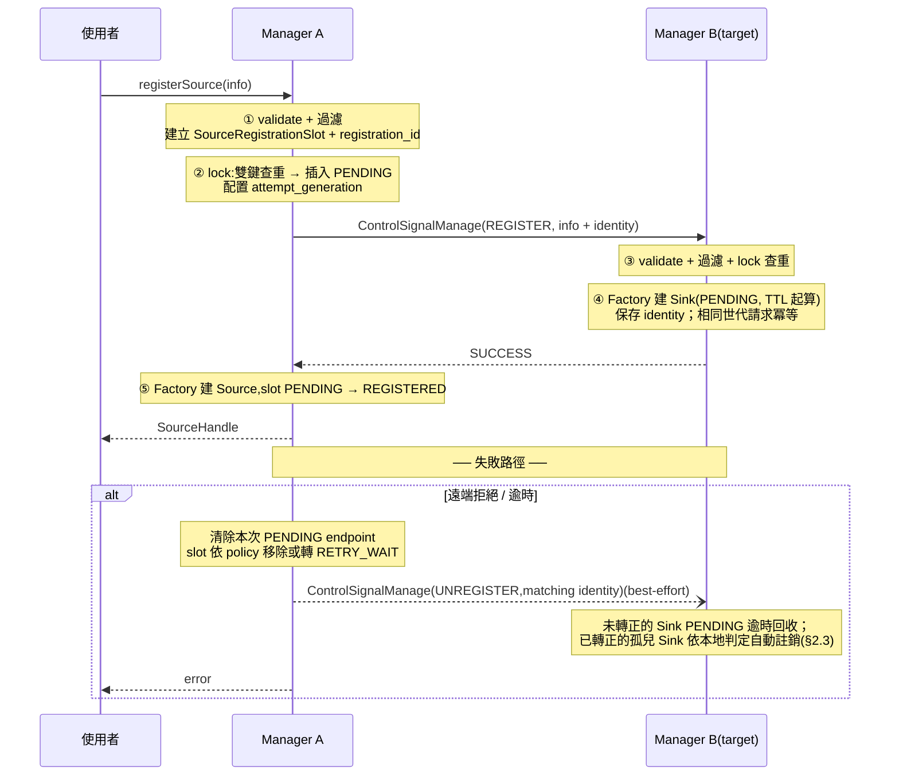
```mermaid
sequenceDiagram
    participant U as 使用者
    participant MA as Manager A
    participant MB as Manager B(target)

    U->>MA: registerSource(info)
    Note over MA: ① validate + 過濾<br/>建立 SourceRegistrationSlot + registration_id
    Note over MA: ② lock:雙鍵查重 → 插入 PENDING<br/>配置 attempt_generation
    MA->>MB: ControlSignalManage(REGISTER, info + identity)
    Note over MB: ③ validate + 過濾 + lock 查重
    Note over MB: ④ Factory 建 Sink(PENDING, TTL 起算)<br/>保存 identity；相同世代請求冪等
    MB-->>MA: SUCCESS
    Note over MA: ⑤ Factory 建 Source,slot PENDING → REGISTERED
    MA-->>U: SourceHandle

    Note over MA,MB: ── 失敗路徑 ──
    alt 遠端拒絕 / 逾時
        Note over MA: 清除本次 PENDING endpoint<br/>slot 依 policy 移除或轉 RETRY_WAIT
        MA--)MB: ControlSignalManage(UNREGISTER,matching identity)(best-effort)
        Note over MB: 未轉正的 Sink PENDING 逾時回收；<br/>已轉正的孤兒 Sink 依本地判定自動註銷(§2.3)
        MA-->>U: error
    end
```

- **佔位(PENDING)** 在持鎖下完成雙鍵(controller_name + channel_name)查重與插入,
  消除 rv2 的 TOCTOU；之後的遠端等待不持鎖。
- 逾時屬「結果不明」:同時做本地回收 + best-effort UNREGISTER + 依賴遠端 TTL,三重保險。
- 每個 logical intent 配置穩定 `registration_id`,每次 REGISTER attempt 遞增
  `attempt_generation`,並攜帶 Source CSM 的 `csm_instance_id`。REGISTER 重送同一
  identity 必須冪等；不同 identity 與既有同名 entry 衝突時回可分類的拒絕碼。
  UNREGISTER 與所有生命週期通知只作用於完全相符的 identity,延遲控制訊息不得
  移除新世代(§2.5.2)。
- PENDING 交易亦納入 ManagerStatus snapshot,master 對帳看到任一側同 identity 的
  PENDING 時暫停該配對的 missing grace,避免註冊 service 尚在等待 response 時誤判孤兒。
- **註冊失敗的重試**(v1.1.0,D3/D7):typed `RETRYABLE_CONFLICT` 依 D3 必須進
  `RETRY_WAIT` 並持續至舊 entry 終出後成功；初次目標不可達 / 結果不明是否保留
  intent 則由 D7 policy 決定。tick 只排程**非阻塞** attempt；service
  response callback 完成狀態轉移,不得在 timer callback 內同步呼叫 `registerSource()`。
  對側舊 entry 經本地 DISCONNECTED、CSM 死亡通知或 level-triggered 對帳移除後,
  新世代 retry 自然成功；不沿用任何 TIMEOUT entry(D3)。數值型 backoff、jitter 與
  optional initial retry 上限等 D7 參數仍列 §12；D3 conflict 與已建立 intent 的
  remote-failure retry 本身不受 attempt 次數上限截斷。
- `unregisterSource(handle)`:slot lock 下先將 `desired=false`,原子取消 logical intent
  與 in-flight retry,故既有 Handle 立即 `valid()==false`。若有 endpoint,只排入
  EXPLICIT_UNREGISTER removal command,由下一 tick 依單寫者順序 callback → shutdown →
  erase；若本來就在 RETRY_WAIT / PENDING 且無 endpoint,可直接 identity re-check後
  erase slot。對最後一個可能存在於遠端的 attempt 發 matching-generation UNREGISTER；
  延遲 response 因 desired / generation 不符不得復活已取消 intent。

### 2.5 Liveness 協定(v1.1.0 改版:雙側自驅 + master 預警/對帳)

v0.3.0 的「CSM 互訂 status」與 v0.4.0 的「點對點 NOTIFY_ABNORMAL」在多 CSM 拓撲下
的連線數與通知路徑隨 CSM 數量以 O(N²) 成長,v0.5.0 因此改為集中式(master 為 status
唯一訂閱者)。v1.1.0 進一步把**狀態來源收斂到本端**,master 只剩預警與生命週期同步:

- 每個 CSM 啟動時向 **CSM Master** 註冊(`/csm_master/register`；v1.1.0 起 request 攜帶
  `csm_timeout_ns` 與 `csm_disconnect_timeout_ns`,D6,§2.5.2),之後每個 status tick 呼叫
  `/csm_master/heartbeat`——CSM 藉 response 確認 master 在線；STALE_INSTANCE /
  UNKNOWN_CSM 觸發 re-register。master 只以 matching instance 的請求更新 CSM 活性。
- CSM 照常發布 `<name>/status`(§2.5.1)；**唯一訂閱者為 master**,CSM 之間互不訂閱。
- **非終態一律由本端活動自驅**(v1.1.0):master 通知不再注入 ACTIVE / TIMEOUT；
  matching DISCONNECTED / PAIR_MISSING 只提出 terminal lifecycle command,由 CSM tick
  驗證世代後強制 DISCONNECTED 並註銷。

| 對象 | 活動來源 | 判定 |
|---|---|---|
| Source(topic) | `send()` 呼叫本身(hot path 記錄,§5.3) | 自身 elapsed 雙閾值,CSM tick 內判定(§2.3)；純本端、自驅 |
| Source(service) | `send()` 呼叫 + response outcome；任一 response(含 REJECTED)證明 transport 活動,service-not-ready / response timeout 開始失敗 streak | send-cadence 與 response-health 子判定取較嚴者；失敗 streak 立即 TIMEOUT,持續越過 disconnect 閾值則 DISCONNECTED(§5.3) |
| Sink | 訊號到達(`_store()` 記錄,§6.3) | 自身 elapsed 雙閾值,CSM tick 內判定(§2.3) |
| CSM 整體 | 對 master 的 heartbeat | master 以獨立 **CSM 級雙閾值** polling(D6,§9.3):elapsed 超過 `csm_timeout_ns` → CSM health = TIMEOUT,對配對方發 peer-health 預警(不改 entity state)；超過 `csm_disconnect_timeout_ns` → CSM health = DISCONNECTED,通知配對方註銷並觸發 retry |

- master 通知四種 kind,分屬「觀測、peer-health 預警、生命週期同步」三類語意
  (接收處理見 §8.3 `_onGetNotifications`):
  1. **STATE**——entity 級狀態變化,僅觀測(經 notification callback 告知 App,
     例如通道劣化時對側 Sink 的 TIMEOUT/DISCONNECTED)；不改本地狀態。
  2. **CSM_TIMEOUT 預警**——對側 CSM heartbeat 中斷(D1):本地 entry 的
     `peerHealth` 記為 TIMEOUT 並通知 App；**不寫入 `ControlSignalState`**。heartbeat
     恢復時以 ACTIVE 解除。這是 §1.3.1 分層後對 D1 的明確解讀。
  3. **DISCONNECTED 註銷**——對側已確認死亡,本地註銷配對 entity；Source 側一併入
     retry 佇列(D2)。
  4. **配對缺失**——對帳結果(§0.1),同註銷處理。
- **對帳為必要元件**(v1.1.0,原 §12 #3 結案):master 每輪 status 檢查配對完整性,
  entry 單側存在超過寬限期 → 配對缺失通知(§9.3)。與 CSM 級雙閾值互補——雙閾值處理
  「慢死亡」(失聯足夠久),對帳處理「快重啟」:CSM 於 `csm_disconnect_timeout_ns` 內
  被 supervisor 拉起,heartbeat 未斷但註冊資料已遺失,對側 Source 持續 send、資料落空
  而無從自行察覺,唯一偵測者即對帳。
- 任一側 entity 進入 DISCONNECTED 時的跨側註銷同步(取代 v0.3.0–v1.0.1 的休眠重連):

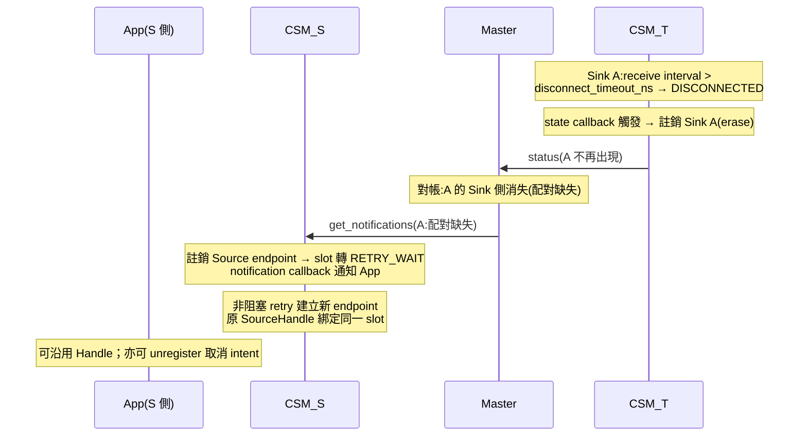
```mermaid
sequenceDiagram
    participant AppS as App(S 側)
    participant S as CSM_S
    participant M as Master
    participant T as CSM_T

    Note over T: Sink A:receive interval ><br/>disconnect_timeout_ns → DISCONNECTED
    Note over T: state callback 觸發 → 註銷 Sink A(erase)
    T->>M: status(A 不再出現)
    Note over M: 對帳:A 的 Sink 側消失(配對缺失)
    M->>S: get_notifications(A:配對缺失)
    Note over S: 註銷 Source endpoint → slot 轉 RETRY_WAIT<br/>notification callback 通知 App
    Note over S: 非阻塞 retry 建立新 endpoint<br/>原 SourceHandle 綁定同一 slot
    Note over AppS: 可沿用 Handle；亦可 unregister 取消 intent
```

- 在可靠通知與 level-triggered 對帳持續運作的前提下,兩側 endpoint map 最終一致,
  無孤兒、無殭屍(§0.1)。對側的註銷是 **entry 生命週期同步**,
  不是狀態注入——本地狀態機仍只由本地事實驅動。
- 重建觸發:CSM 內建 retry 機制(D4,§8.3)；Source registration slot 跨 retry 保留,
  成功後原 Handle 自動轉接新 endpoint。App 經具 kind / result / attemptGeneration / reason 的
  notification callback 得知每次結果,可隨時以 unregister 取消。
- **Master 失聯(degraded mode,§0.1)**:兩側狀態皆自驅,**entity 狀態零影響**；
  僅 master-mediated 預警、生命週期通知與對帳暫停；CSM 間 matching-generation
  best-effort UNREGISTER 仍可運作。期間單側註銷、對側未同步的窗口:對側 entity 依自身
  elapsed 可能自行走到 DISCONNECTED；若仍有本地活動或 disconnect 判定停用,
  不一致可持續至 master 回線,因此不承諾固定窗口。master 回線後由對帳補收(D5):
  heartbeat 回 UNKNOWN_CSM → re-register → 等待各 CSM 的完整 snapshot
  ready → 建立 edge 基準(不觸發 STATE 通知風暴)→ 立即執行 level reconciliation,
  生命週期事件重送至 ACK 或條件消失。

#### 2.5.1 ManagerStatus 訊息(my_note #4,新設計)

`rv2_interfaces/msg/r1/ManagerStatus.msg`(取代 v0.2.0 的空 ManagerHeartbeat):

```
# 每 status_interval 發布於 <manager_name>/status
string manager_name
string csm_instance_id            # 本次 process incarnation(UUID)
uint64 snapshot_seq               # 此 incarnation 內嚴格遞增
bool snapshot_ready               # 啟動資料建置完成；false 時 master 不執行對帳
builtin_interfaces/Time stamp
r1/EntryStatus[] sources          # 完整 snapshot,含 PENDING/REGISTERED/RETRY_WAIT
r1/EntryStatus[] sinks            # 完整 snapshot,含 PENDING/REGISTERED
```

`rv2_interfaces/msg/r1/EntryStatus.msg`:

```
string manager_name         # 所屬 CSM(v0.5.0;master 配對與通知定位用)
string csm_instance_id      # 所屬 CSM incarnation
string source_manager_name  # logical pair 的 Source CSM；Sink 由 REGISTER request 保存
string target_manager_name  # logical pair 的目標 CSM；Source 取自 ControlSignalInfo
string registration_id     # logical registration intent UUID
uint64 attempt_generation   # 此 intent 的註冊世代
string controller_name
string channel_name
string type                 # factory 型別鍵
string mode                 # topic / service
bool   is_source            # v0.5.0:master 配對方向判別
int8   registration_phase   # PENDING / REGISTERED / RETRY_WAIT(常數；Sink 無 RETRY_WAIT)
bool   endpoint_present     # 僅實體 endpoint 存在時 true；RETRY_WAIT Source 為 false
int8   state                # 0=INITIAL 1=ACTIVE 2=TIMEOUT 3=DISCONNECTED(常數；終出 tombstone 用)
float32 data_rate_hz        # 實測速率:Sink = 收訊率(§6);Source = send 呼叫率(§5,v0.4.0)
int8   priority
```

- 每筆 `ManagerStatus` 是該 CSM 的**完整 snapshot**,不是增量。master 僅接受目前
  `csm_instance_id` 且 `snapshot_seq` 大於已套用序號的訊息,以整份內容原子替換快取；
  前次存在而本輪缺席的 entry 視為已移除。此契約是快速重啟與對帳正確性的必要條件。
- `snapshot_ready` 只在 Manager 尚未完成 services / maps 初始化及第一輪一致 snapshot
  前為 false；同一 incarnation 的第一個完整 tick 起設 true 且不可退回 false。
  App 之後發起的正常註冊以 PENDING phase 保護,不得用長期 `snapshot_ready=false`
  無限抑制對帳。新 incarnation 重新由 false 起算。
- 只有兩側 `registration_phase = REGISTERED`、`endpoint_present = true` 且 identity
  相符才構成有效配對。matching PENDING 表示交易進行中,暫停 missing grace；
  RETRY_WAIT 則只是 Source intent,不是 endpoint——若對側仍有 REGISTERED Sink,
  master 應視為 Sink-only orphan並要求移除,不能因 RETRY_WAIT 永久抑制對帳。
- live ManagerStatus 通常不含 `state = DISCONNECTED`:terminal callback / shutdown /
  erase 於 publish 前完成。master 對「前輪 REGISTERED、本輪缺席」保留 identity
  tombstone並可合成 STATE(DISCONNECTED)觀測事件；是否要求另一側移除則由 CSM health
  或 level reconciliation 決定,不能把 omission 直接當成不驗證世代的註銷命令。
- 接收端(master)用途:CSM 活性佐證、配對表更新、狀態變化偵測與對帳(§9)。
- 頻寬:entry 數大時可調升 `statusIntervalMs`(Manager 參數)；訊息內容為
  輕量 metadata,200ms × 數十 entries 規模無虞。
- `control_signal_info_req` service 保留(pull 式完整 Info 查詢；status 為 push 式輕量摘要)。
- **狀態計算與推進**(v1.1.0,D8):status tick 對每個 entity 呼叫其非公開 `_calcStatus()`
  (friend,純計算,§5/§6)——實測 rate + 雙閾值判定 → `{state, rateHz}` → 記入
  **CSM 自身 table**(`entry.lastStatus`,組裝 ManagerStatus 直接取用)→ `_applyStatus()`
  寫回 entity(old ≠ new 時於 tick 執行緒 fire state callback)；DISCONNECTED 一併觸發
  activity-generation seal 與註銷流程(§4.2/§8.3)。`_calcStatus()` 的「純」指不改
  liveness / cache / registration lifecycle；RateRecorder 的 bucket 旋轉只由 hot-path
  `record()` 負責,`calcHz()` 為 read-only snapshot。
- 異常偵測與通知職責(v0.5.0)**上移至 master**:CSM 只發 status；變化比對、配對與
  通知排程全在 master(§9)。STATE edge 可 best-effort；peer-health / lifecycle
  control event 以 event ID + ACK 可靠傳遞；CSM 被動接收 `get_notifications`。

#### 2.5.2 服務介面欄位定義(v1.0.0)

`srv/r1/ControlSignalManage.srv`:

```
int8 op                          # 0 = REGISTER, 1 = UNREGISTER(常數定義於 srv)
string source_manager_name       # 發起方 Manager 名
string source_csm_instance_id    # 發起方本次 process incarnation
string registration_id          # logical registration intent UUID
uint64 attempt_generation        # REGISTER attempt 世代;UNREGISTER 必須完全相符
r1/ControlSignalInfo info        # REGISTER:完整描述子;UNREGISTER:僅需 controller_name 有效
---
int8 response                    # SUCCESS / RETRYABLE_CONFLICT / TEMPORARY_UNAVAILABLE /
                                 # PERMANENT_REJECTION / ALREADY_APPLIED / STALE / ERROR
string reason                    # 失敗原因;成功時為空
```

`srv/r1/ControlSignalInfoReq.srv`:

```
---
int8 response
r1/ControlSignalInfo[] source_list
r1/ControlSignalInfo[] sink_list
```

`srv/r1/CsmRegister.srv`:

```
string csm_name
string csm_instance_id            # 每次 Manager process 啟動產生的新 UUID
int64 csm_timeout_ns             # D6:heartbeat 中斷超過此值,master 對配對方發 TIMEOUT 預警;0 = 停用
int64 csm_disconnect_timeout_ns  # D6:超過此值視為 CSM 死亡,通知配對方註銷;0 = 停用;建議遠大於 csm_timeout_ns
int64 status_interval_ns         # master 計算 snapshot readiness / 對帳寬限期的輸入
int64 registration_grace_ns      # 此 CSM 允許的最長同步註冊等待 + status 傳播餘裕
---
int8 response                    # SUCCESS / STALE_INSTANCE / INVALID_CONFIG
string reason
```

`srv/r1/CsmHeartbeat.srv`:

```
string csm_name                  # master 以此定位 CsmRecord(Trigger 無法攜帶身分,故自訂)
string csm_instance_id           # 舊 incarnation heartbeat 不得更新新 record
---
int8 response                    # SUCCESS / STALE_INSTANCE / UNKNOWN_CSM(常數)
string reason                    # 診斷；STALE/UNKNOWN 時 CSM 應重新 register
```

`srv/r1/CsmNotify.srv`:

```
int8 kind                        # 0 = STATE:entity 級狀態變化(觀測用,不改本地狀態)
                                 # 1 = CSM_TIMEOUT:peer-health 預警/解除(D1,不改 local state)
                                 # 2 = DISCONNECTED:註銷指示(對側已確認死亡)
                                 # 3 = PAIR_MISSING:配對缺失(對帳,同註銷處理)
int8 peer_csm_health             # kind=CSM_TIMEOUT 時有效:ACTIVE / TIMEOUT；其餘忽略
string event_id                  # master 配置的冪等事件 UUID
string target_csm_instance_id    # 僅此接收端 incarnation 可套用
r1/EntryStatus[] entries         # 涉及的 entries;EntryStatus.manager_name 標示歸屬
---
int8 response                    # APPLIED / ALREADY_APPLIED / STALE / REJECTED(常數)
string reason
```

`ControlSignalManage.srv` 的 request 另加入 `source_csm_instance_id`、
`registration_id`、`attempt_generation`；UNREGISTER 必須完整比對。response code
以 typed code 區分 retryable conflict / temporary unavailable 與 permanent rejection,
避免無限重試不可修復的驗證或授權錯誤；`reason` 只供診斷。這些欄位屬
control-plane identity,不加入通用的
`ControlSignalInfo.msg` 八欄資料描述子。`RETRYABLE_CONFLICT` 僅用於 identity 不同但
可能隨舊 endpoint 終出而消失的同名衝突；驗證、filter、type/mode 不相容一律回
`PERMANENT_REJECTION`,使 retry 狀態機不需解析自由文字 `reason`。未分類的 `ERROR`
預設停止自動重試並通知 App,不得猜測為 transient。

`CsmRegister` 雙閾值驗證與 entity 規則同構:值不得為負,兩者皆大於 0 時
`csm_disconnect_timeout_ns > csm_timeout_ns`；非零值至少涵蓋數個 heartbeat / master
tick 週期。設為 0 表示停用該層判定,但若 disconnect 判定停用,永久 CSM crash 的
自動回收只能依賴其他可用的終止來源,不保證有限時間收斂。
`status_interval_ns > 0`、`registration_grace_ns >= 2 × status_interval_ns`；後者不得
小於該 CSM 允許的最大同步 registration wait 加兩個 status 週期。

### 2.6 執行緒模型

- 本庫**不建立任何執行緒**(承襲 rv2)；一切依附 node executor。
- **Manager 單一 timer**(v0.3.0):status tick 一個 timer 完成全部週期工作——
  狀態計算與推進(D8 鏈,§8.3)、發布 ManagerStatus、master heartbeat、註銷流程、retry 佇列處理、PENDING TTL 回收。
  取代 v0.2.0 的 statusTimer + heartbeatTimer 雙 timer；endpoint 依然零 timer。
- **Callback group 策略**:
  - Manager 的 service servers(manage / info_req / get_notifications)、master clients
    (register / heartbeat)與 retry response callback:放入 Manager 自建的
    **Reentrant group**,與使用者 node 的預設 group 隔離。
  - status timer 獨立放入 **MutuallyExclusive tick group**；另以 `tickRunning_`
    冪等 guard 防 executor / 測試手動觸發重入。Reentrant management group 本身
    不提供單寫者保證,不得把 timer 放入該 group。
  - Source/Sink 的資料 pub/sub/service:預設 group(維持與使用者 callback 相同的互斥行為,符合 rclcpp 預設慣例)。
- **狀態推進與 state callback 單一執行緒**(v1.1.0,D8):所有狀態寫入與 state callback 皆發生於 status tick(`tickGroup_`)；非 tick 來源的狀態變更請求(master 註銷指示、forced disconnect)一律轉為 table 註記,由下一 tick 統一執行,維持嚴格單寫者(§8.3)。
- tick 不執行任何阻塞 service wait。retry tick 只建立 bounded async attempt,
  response callback 將結果排入 completion queue,由下一 tick 提交 registration
  lifecycle；因此不違反「callback 內禁止同步 registerSource」規則。
- 文件化硬規則 + debug assert:
  - `registerSource()` / `unregisterSource()` **禁止**在任何 ROS callback 內呼叫；
    呼叫時 node 必須已由另一條 executor thread 持續 spin,以處理 client response。
    啟動 executor 前呼叫屬 precondition violation,不得包裝成一般 remote timeout。
  - service 模式 `send()` 為阻塞呼叫,同樣只允許 non-callback application thread,
    且至少一條 executor thread 正在服務該 node。
- Manager 掃描 timer 於鎖內完成 snapshot 後才 log,無鎖外 map 存取。

---

## 3. `r1::ControlSignalInfo` 與驗證

### 3.1 訊息欄位(8 欄)

`rv2_interfaces/msg/r1/ControlSignalInfo.msg`

| 欄位 | 型別 | 說明 |
|---|---|---|
| `controller_name` | string | **必填、主鍵**。全系統唯一；Manager 之 map 鍵、黑白名單鍵 |
| `channel_name` | string | **必填、唯一**。資料 topic / service 名稱 |
| `target_manager_name` | string | 註冊時必填；Sink 所在 Manager 名 |
| `mode` | string | `"topic"` / `"service"`(常數定義於 msg) |
| `type` | string | Factory 型別鍵(`"joy"` / `"twist"` / `"string"` / …) |
| `priority` | int8 | **通用欄位,0–100**:0 = invalid(註冊拒絕),100 = 最高優先,值大者優先。僅攜帶轉發,**不影響傳輸行為**；語意由上層消費者自行定義(v0.7.0,不再綁定特定系統的頻帶約定) |
| `timeout_ns` | int64 | data-rate timeout 閾值；**0 = 停用**(v0.5.0,§2.3.1)。service 模式亦為 response 等待上限(0 時 service 模式拒絕註冊,見 §3.2 規則 5) |
| `disconnect_timeout_ns` | int64 | disconnect timeout 閾值(確認死亡 → 註銷,§2.3)；**0 = 停用**(永不自動轉入 DISCONNECTED,§2.3.1 變體 B)；兩者皆 > 0 時須 > `timeout_ns`(§3.2 規則 5),建議為其 5–10 倍以上(只有長期死亡才需付出註銷與重建成本) |

刪除(相對 rv2):`send_freq_hz`(從未驅動狀態機)、`use_keep_alive` / `keep_alive_interval_ns`
(改為 Manager 參數)、`controller_priority_type`(類別上限屬約定,降為文件層)。

### 3.2 驗證規則(6 條)

`validateControlSignalInfo(info)` → `{bool valid; std::string error;}`

1. `controller_name` 非空。
2. `channel_name` 非空。
3. `mode` ∈ {topic, service}；`type` 非空。
4. `priority` ∈ [1, 100](0 = invalid,負值與大於 100 者拒絕)。
5. `timeout_ns ≥ 0`、`disconnect_timeout_ns ≥ 0`(0 = 各自停用,§2.3.1)；
   兩者皆 > 0 時 `disconnect_timeout_ns > timeout_ns`；
   `mode == service` 時 `timeout_ns > 0`(response 等待上限不可停用)。
6. `registerSource` 路徑:`target_manager_name` 非空；
   `_onManage(REGISTER)` 側另驗證其等於本 Manager 名(mis-route 防護)。

`disconnect_timeout_ns = 0` 是合法且保留「不由 entity 自動註銷」語意,但 D3 的
retry-until-success 此時可能需要 master CSM-disconnect / reconciliation 或顯式
unregister 才能清除舊世代；API 應回報此診斷,文件不得承諾固定收斂時間。
`ManagerOptions` 另驗證 CSM 雙閾值與 retry policy(§2.5.2/§8.2),不混入
`ControlSignalInfo` 的六條通用驗證規則。

### 3.3 單元測試方法與流程

- **框架**:gtest；**純邏輯、不需 rclcpp init**(msg struct 直接填欄位)。
- 流程:builder helper `makeR1Info()` 給合法預設 → 逐條規則做「單欄位破壞」測試,
  驗證 `valid == false` 且 `error` 指名該欄位；全合法組合驗證 `valid == true`。
- 案例表:

| 案例 | 修改 | 預期 |
|---|---|---|
| V1 | 全預設 | valid |
| V2 | `controller_name = ""` | invalid, error 含 "controller_name" |
| V3 | `channel_name = ""` | invalid |
| V4 | `mode = "unknown"` | invalid |
| V5 | `priority` ∈ {0, -1, 101, 127} | invalid(4 子案例) |
| V6 | `priority` ∈ {1, 100} | valid(邊界) |
| V7 | `timeout_ns = 0`(topic 模式) | valid(停用,v0.5.0)；`mode = service` 時 invalid |
| V8 | `disconnect_timeout_ns = timeout_ns`(皆 > 0) | invalid(須嚴格大於) |
| V9 | `disconnect_timeout_ns = 0` | valid(停用) |
| V10 | `timeout_ns = 0, disconnect_timeout_ns > 0`(topic) | valid(變體 C) |
| V11 | `target_manager_name = ""`(registerSource 路徑) | invalid |

---

## 4. `r1::LivenessState`

### 4.1 職責

封裝活動記錄與 4 態判定邏輯。純 C++、無 ROS 依賴 → 可完整單元測試。
v1.1.0(D8)起職責縮減為三件事:**記錄**(hot path 原子寫入)、**純計算**
(依記錄與閾值算出應處狀態,不改動任何欄位)、**被動接受狀態**(唯一寫入
路徑,CSM tick 專用)。狀態推進的決策與執行全部上移至 CSM tick(§8.3)；
本類不再有 state+epoch CAS 轉移機制。因 DISCONNECTED 後會立即銷毀 endpoint,
本類另提供 activity-generation terminal seal,確保終出判定不會刪除計算期間
剛恢復活動的 entity；該 CAS 只保護活動接受與 terminal linearization,不寫 state。

### 4.2 設計(單寫者模型,v1.1.0)

- 活動記錄欄位:
  - `createdNs_` —— 建構時間,唯讀；generation = 0 時作 disconnect elapsed 起點。
  - `lastActivityNs_` —— atomic 最後活動時間戳；`recordActivity()` 以 CAS max 更新,
    多 writer 交錯時不得倒退。
  - `activityWord_` —— atomic 複合字:`sealed` 1 bit + `generation` 63 bits。
    每個被接受的活動遞增 generation；sealed 後拒絕所有新活動。
  - `state_` —— atomic 最後一次 `applyState()` 的結果。
- 並發模型:
  - 狀態的**唯一寫者是 CSM tick**(單執行緒序列化):`applyState()` 只由 CSM 呼叫,
    無並發寫者,不需 CAS。v1.0.1 以 epoch CAS 防範的 stale-TIMEOUT 競態,根源是
    「收訊路徑與檢查路徑併發寫狀態」；單寫者模型下該競態在結構上不存在,
    機制整組廢除。
  - hot path `recordActivity(now)` 先發布 atomic-max 時間戳,再以 release CAS 遞增
    generation；tick 以 acquire load 取得 snapshot。若 terminal seal 先完成,CAS
    失敗並回 false,呼叫端不得再操作 transport / message storage。
  - 一般 INITIAL / ACTIVE / TIMEOUT 計算與活動交錯,最多晚一 tick 回正；只有
    destructive DISCONNECTED 必須呼叫 `trySealActivity(observedGeneration)`。
    計算後若任何活動已被接受,generation 已變,seal 必然失敗並取消本輪註銷；
    若 seal 成功,其後活動均被拒。seal CAS 是明確線性化點。
- `calcState()` 為 **const 純計算**:讀 activity snapshot + 閾值 → 回傳 decision,
  不寫任何欄位；
  時間由呼叫端注入(`steadyNs()` 參數傳入),可注入假時鐘、完全 deterministic。
- **取捨(v1.1.0 已接受)**:狀態更新粒度 = tick 週期(`statusIntervalMs`,預設 200ms)。
  首次活動後,狀態於下一個 tick 才由 INITIAL 轉 ACTIVE；`read()` 的「僅 ACTIVE 回 true」
  與 state callback 同樣以 tick 粒度反應。監控語意下可接受；資料層的即時性不受影響
  (訊息到達本身即為 App 的即時回饋)。

### 4.3 類別介面

```cpp
namespace r1 {

enum class ControlSignalState : uint8_t { INITIAL, ACTIVE, TIMEOUT, DISCONNECTED };

struct ActivitySnapshot {
    int64_t  lastActivityNs;
    uint64_t generation;
    bool     sealed;
};

struct LivenessDecision {
    ControlSignalState state;
    uint64_t observedActivityGeneration;
};

class LivenessState
{
public:
    explicit LivenessState(int64_t nowNs);

    /// hot path(send() / 收訊 callback):只記錄,不改狀態。
    /// false = terminal seal 已建立,呼叫端必須停止本次資料操作。
    bool recordActivity(int64_t nowNs);

    /// 純計算(CSM tick 專用):依記錄與雙閾值回傳應處狀態,不寫入任何欄位。
    /// 閾值 0 = 該項停用(§2.3.1)。從未活動:INITIAL,僅 disconnect 閾值適用。
    LivenessDecision calcState(int64_t nowNs, int64_t timeoutNs, int64_t disconnectNs) const;

    /// 本地 timeout 的 destructive commit gate。僅當 generation 仍等於計算快照時
    /// 原子設 sealed；失敗表示計算後已有活動,本輪不得 apply DISCONNECTED / erase。
    bool trySealActivity(uint64_t observedGeneration);

    /// forced / matching remote lifecycle removal:無條件建立 terminal seal,冪等。
    void sealActivity();

    /// CSM tick 專用:寫入狀態,回傳寫入前的舊狀態(caller 依 old != new fire callback)。
    ControlSignalState applyState(ControlSignalState s);

    ControlSignalState state() const;   // 讀最後一次 applyState 結果,不觸發計算
    ActivitySnapshot activitySnapshot() const;

private:
    static constexpr uint64_t kSealed = uint64_t{1} << 63;
    const int64_t                   createdNs_;
    std::atomic<int64_t>            lastActivityNs_;  // atomic max
    std::atomic<uint64_t>           activityWord_;    // sealed + generation
    std::atomic<ControlSignalState> state_;
};

} // namespace r1
```

### 4.4 行為細節

- `recordActivity(now)`:以 CAS loop 執行 `lastActivityNs_ = max(old, now)`,再對未 sealed
  `activityWord_` CAS 遞增 generation。時間戳先於 generation 以 release 發布；讀者
  acquire 到新 generation 時必能看到對應或更新的時間戳。若 seal 在兩步之間勝出,
  本次活動回 false；已寫入的較新 timestamp 對已 sealed endpoint 無效。
- `calcState(now, timeoutNs, disconnectNs)`:
  1. `generation == 0`(從未活動):elapsed 自 `createdNs_` 起算；
     `disconnectNs > 0 && elapsed > disconnectNs` → DISCONNECTED,否則維持 INITIAL
     (從未活動的 entity 無「中斷」語意,不轉 TIMEOUT,§2.3)。
  2. 有活動:`elapsed = now − lastActivity`；
     `disconnectNs > 0 && elapsed > disconnectNs` → DISCONNECTED(優先判定)；
     否則 `timeoutNs > 0 && elapsed > timeoutNs` → TIMEOUT；否則 ACTIVE。
  3. 現行狀態不參與計算——TIMEOUT 的「隨時可恢復」自然成立(活動恢復後下一 tick
     算出 ACTIVE),無需任何特殊轉移規則。回傳值同時攜帶 snapshot generation。
- `trySealActivity(g)`:只接受完全相符且尚未 sealed 的 activity word。成功後
  `recordActivity()` 永遠回 false；失敗時不改任何欄位,CSM 放棄本輪 terminal decision。
- `applyState()`:直接 store；合法性由 caller 保證(CSM tick 一律以 calcState 結果
  或已驗證的註銷決策呼叫)。本地 DISCONNECTED 只有 seal 成功後才能寫入；
  寫入後 CSM 隨即執行註銷(§8.3)；
  entry 生命週期屬 Manager 層,與本類解耦。
- forced / remote lifecycle removal(§2.3):CSM 先 `sealActivity()`,再以 DISCONNECTED
  呼叫 `applyState()` 並執行註銷；terminal request 的線性化點優先於之後的資料操作。
- service 模式的 response-health(較新 request outcome、failure streak 與 failure epoch)
  存於 Source 本體(§5.2),由 Source 的 `_calcStatus()` 併入判定；本類保持通用。

### 4.5 單元測試方法與流程

- **框架**:gtest,純邏輯 + 假時鐘(手動遞增的 int64)。並發測試用 `std::thread`:
  多執行緒 `recordActivity` + 單一執行緒 calc/apply(對應 CSM tick),TSan 覆蓋(§11.4)。

| 案例 | 內容 | 預期 |
|---|---|---|
| L1 | 初始 | `state() == INITIAL`；calcState.state → INITIAL,generation = 0 |
| L2 | recordActivity 後 calcState | 回 true；decision = ACTIVE,generation 遞增 |
| L3 | elapsed > timeout | decision → TIMEOUT |
| L4 | TIMEOUT 判定後恢復活動再 calcState | ACTIVE(隨時可恢復,無特殊條件) |
| L5 | elapsed > disconnect | decision → DISCONNECTED；單次跨越兩閾值 → 直接 DISCONNECTED |
| L6 | 從未活動 + elapsed > timeout(< disconnect) | INITIAL(不轉 TIMEOUT) |
| L7 | 從未活動 + elapsed > disconnect | DISCONNECTED |
| L8 | 邊界 `elapsed == 閾值` | 不觸發(嚴格大於) |
| L9 | applyState 寫入 | 回傳舊狀態；`state()` 讀到新值；state 欄位無 CAS |
| L10 | calcState 純函數性 | 連續呼叫結果一致；所有欄位不變 |
| L11 | **變體 B**(disconnect=0):elapsed 極大 | 有活動者停留 TIMEOUT；從未活動者停留 INITIAL |
| L12 | **變體 C**(timeout=0):elapsed > disconnect | 直接 DISCONNECTED,TIMEOUT 不可達 |
| L13 | **變體 D**(皆 0):elapsed 極大 | 狀態不變；僅 applyState(DISCONNECTED) 可離開 |
| L14 | 多 writer 以亂序 now 呼叫 recordActivity | timestamp 不倒退；generation 等於成功記錄數；TSan 無 race |
| L15 | TIMEOUT 計算後發生活動 | 當次可提交舊 TIMEOUT,下一 tick 回 ACTIVE；無 destructive action |
| L16 | DISCONNECTED 計算後、seal 前發生活動 | generation 不符,seal 失敗；不得 apply / erase,下一 tick ACTIVE |
| L17 | seal 勝出後 hot path 嘗試活動 | recordActivity 回 false；state callback 恰一次後安全 shutdown / erase |
| L18 | recordActivity 後首次 tick 已越過 timeout | INITIAL 直接 apply TIMEOUT；generation = 0 的從未活動者仍維持 INITIAL |

### 4.6 替代方案評估:tinyFSM(v0.2.0,依 my_note.md)

評估對象:[digint/tinyfsm](https://github.com/digint/tinyfsm) — header-only、C++11 template、
零動態配置、無 RTTI/例外依賴,MIT 授權；最新版 0.3.3,其後長期無 release。

| 面向 | 評估 |
|---|---|
| Thread-safety | **無內建同步**。v1.1.0 單寫者模型下狀態寫入本無並發(僅 CSM tick),真正需要的是 hot path 的 atomic 記錄欄位與純計算函數——tinyfsm 的事件 dispatch 模型對此毫無著力點 |
| 實例模型 | tinyfsm 狀態為**每個 FSM 類型的 static instance**(單例導向)；r1 每個 Source/Sink 需獨立實例,需 workaround,與設計錯配 |
| 表達力 | r1 的「計算與寫入分離」(calcState 純函數 + 外部單寫者 applyState)無法以 tinyfsm 的事件驅動轉移表達；v1.0.1 曾需要的 epoch/CAS 語意已隨單寫者模型廢除,引入動機進一步消失 |
| 規模 | 本狀態機僅 4 態,判定為三行比較；引入外部依賴的結構開銷大於收益 |
| 維護 | 0.3.3 後長期停更,依賴風險 |

**結論:不採用**。維持 §4.2 自製設計(v1.1.0 起為單寫者模型,計算與寫入分離)。
但採納 tinyfsm 的精神——判定規則集中單點宣告 + 單元測試窮舉(§4.5),
確保「context safety」訴求以可驗證方式落實。若未來狀態數成長(>8 態)再重啟評估。

---

## 5. `r1::ControlSignalSource`

### 5.1 職責

控制訊號發送端。topic 模式持 `Publisher<msgT>`,service 模式持 `Client<srvT>`。
**建構子 private**；`friend class ControlSignalManager` + Factory creator 可建。
繼承 `std::enable_shared_from_this`。

### 5.2 類別架構

```cpp
namespace r1 {

enum class LivenessCause : uint8_t { NONE, INACTIVITY, RESPONSE_FAILURE };

struct EntityStatus {
    ControlSignalState state;
    float              rateHz;
};

/// _calcStatus() 回傳的內部決策；CSM table 僅保存 status,guard token 不公開。
struct EntityDecision {
    EntityStatus       status;
    uint64_t           observedActivityGeneration; // terminal seal 驗證用
    uint64_t           observedFailureEpoch;        // response-failure terminal 驗證用
    LivenessCause      cause;                      // terminal lifecycle routing
};

namespace detail {
/// Rolling-window 呼叫/收訊記錄器(v0.5.0,my_note:window size 可配置)。
/// N-bucket 環形(N 固定 8),bucket 時距 = windowNs / N。每格以單一 atomic
/// 打包 {absoluteBucketNumber,count},避免 epoch/count 撕裂；record() 以 CAS 更新
/// 當前格,calcHz() 只納入仍落在視窗內的 bucket number,全程 read-only。
/// 純 atomic、無鎖；Source(send 記錄)與 Sink(收訊記錄)共用。
class RateRecorder {
public:
    explicit RateRecorder(int64_t windowNs);   // windowNs 來自 ManagerOptions.rateWindowNs
    void  record(int64_t nowNs);               // hot path,O(1)
    float calcHz(int64_t nowNs) const;         // cold path,read-only snapshot
private:
    std::array<std::atomic<uint64_t>, 8> buckets_; // packed absolute bucket number + count
    const int64_t windowNs_;
};
} // namespace detail

enum class SendResult : uint8_t;

/// per-state 轉移 callback 簽名(v0.5.0,my_note FSM #5)
using StateCb = std::function<void(const std::string& controllerName,
                                   ControlSignalState oldState,
                                   ControlSignalState newState)>;

class BaseControlSignalSource
{
public:
    virtual ~BaseControlSignalSource() = default;
    virtual ControlSignalState getState() const = 0;              // 只讀最後一次 tick 結果
    virtual const msg::r1::ControlSignalInfo& getInfo() const = 0;
    virtual std::type_index msgType() const = 0;
    virtual SendResult sendErased(const void* msg) = 0;
    virtual void shutdown() = 0;          // 釋放 rclcpp entities;冪等
protected:
    BaseControlSignalSource() = default;
private:
    friend class ControlSignalManager;
    virtual EntityDecision _calcStatus(int64_t nowNs) const = 0;
    virtual bool _trySealLocalTerminal(const EntityDecision& decision) = 0;
    virtual void _sealTerminal() = 0;      // forced / matching lifecycle command
    virtual void _applyStatus(const EntityDecision& decision) = 0;
};

/// SendResult 取代 rv2 的 (bool return + bool& cmdSuccess) 雙輸出
enum class SendResult : uint8_t {
    OK,             // 已送出(topic)/ 對方接受(service)
    REJECTED,       // service 對方回非 SUCCESS
    NO_TRANSPORT,   // transport 不可用 / 已 shutdown
    TIMEOUT,        // service response 逾時
    DISCONNECTED,   // endpoint 已進 terminal seal / 本地註銷
    RETRYING,       // logical intent 有效,目前無 endpoint且由 CSM 非阻塞重試
    INVALID_CONTEXT // service send 無可服務 response 的 executor / 從 callback 違規呼叫
};

template<typename msgT, typename srvT = void>
class ControlSignalSource : public BaseControlSignalSource,
                            public std::enable_shared_from_this<...>
{
    friend class ControlSignalManager;
    friend class ControlSignalFactory;   // creator lambda
    friend struct ManagerTestAccess;     // 測試通道(§5.4;定義僅編入測試 target)
private:
    ControlSignalSource(rclcpp::Node* node, const InfoT& info);   // private!

    rclcpp::Node*                 node_;
    InfoT                         info_;
    mutable std::mutex            transportMtx_; // 僅護 transport_ snapshot / reset
    std::variant<PubPtr, CliPtr>  transport_;    // ClientPtrOf<void> = monostate(承襲 rv2 trait)
    LivenessState                 liveness_;
    std::atomic<bool>             shutdown_{false};

    // send 呼叫記錄(v0.4.0/v0.5.0):rolling window,大小由 ManagerOptions.rateWindowNs 配置
    detail::RateRecorder          rate_;
    std::atomic<float>            cachedRateHz_{0.f};   // _applyStatus() 寫入的快取(v1.1.0)

    // service response-health 記錄(v1.1.0；service 呼叫成本遠大於此短鎖)
    struct ResponseHealth {
        uint64_t latestOutcomeRequest{0};
        bool failing{false};
        int64_t failureSinceNs{0};  // failing=true 時的連續失敗 streak 起點
        uint64_t failureEpoch{0};   // 僅在 streak 開始 / 清除時遞增
    };
    std::atomic<uint64_t>            nextRequestSequence_{1};
    mutable std::mutex            responseMtx_;
    ResponseHealth                responseHealth_; // service-not-ready/timeout 記失敗；任一 response 清除

    // per-state 轉移 callback(v0.5.0):每狀態一 slot;CSM 經 friend 安裝
    std::array<StateCb, 4>        stateCbs_;
    mutable std::shared_mutex     stateCbMtx_;

    /// 非公開(v1.1.0,D8):CSM status tick 呼叫(friend)。純計算,不寫任何欄位:
    /// rate_.calcHz() + liveness_.calcState()(service 模式再併入 response-health)→ EntityDecision。
    EntityDecision _calcStatus(int64_t nowNs) const override;

    /// inactivity 以 activity generation 驗證；response failure 以 failure epoch
    /// 驗證後建立 liveness seal。false = 可逆證據已於計算後改變,取消本輪終出。
    bool _trySealLocalTerminal(const EntityDecision& decision) override;
    void _sealTerminal() override { liveness_.sealActivity(); }

    /// 非公開(v1.1.0,D8):CSM tick 以 _calcStatus 結果(或註銷決策)呼叫。
    /// 寫 cachedRateHz_ 與 liveness_ 狀態;old != new 時 fire 對應 stateCbs_
    /// (shared_lock 下 copy 後無鎖呼叫,tick 執行緒)。
    void _applyStatus(const EntityDecision& decision) override;

public:
    SendResult send(const msgT& msg);
    float sendRateHz() const;                       // 讀 cachedRateHz_,不觸發計算
    EntityStatus getStatus() const;                 // v0.5.0(my_note FSM #4):{state, cachedRate} 整合查詢
    ControlSignalState getState() const override;   // 讀 liveness_.state()(CSM tick 推進,§8.3)
    ...
};

} // namespace r1
```

### 5.3 行為細節

- **send(共通前置,v1.1.0)**:`shutdown_` 檢查 → service 模式先驗證可觀測的
  callback / executor context(違規回 `INVALID_CONTEXT`,不算活動)→
  `liveness_.recordActivity(now)`(**send 呼叫本身即活動**；D8:只記錄,不改狀態)；
  若 terminal seal 已建立則回 `DISCONNECTED`,不得碰 transport。活動被接受後才
  `rate_.record(now)` → `transportMtx_` 下複製 transport shared pointer → 放鎖後進入
  模式分支。`shutdown()` 以同一鎖 reset 成員,不與 snapshot 讀取形成 data race。
- **send(topic)**:publish → `OK`。無其他動作——狀態由 CSM tick 依 send 間隔判定(§2.3)。
- **send(service)**:先配置單調 `requestSequence`；`service_is_ready()` →
  `async_send_request` → 等待 ≤ `timeout_ns`
  (**無 50ms 隱藏 fallback**；`timeout_ns` 必填,直接使用)。
  `service_is_ready() == false` 或 response 逾時 → `ResponseHealth` 開始 / 延續失敗 streak；
  逾時另呼叫 `client->remove_pending_request()`(rv2 稽核:pending request 洩漏),分別回
  `NO_TRANSPORT` / `TIMEOUT`。任一 response 到達(含業務層 REJECTED)證明 transport
  可達:清除 failure streak,再呼叫 `recordActivity()`；若此時 terminal seal 已勝出則
  回 `DISCONNECTED`,否則依 response 回 `OK` / `REJECTED`。ResponseHealth 以短 mutex
  更新；只有 `requestSequence` 大於 `latestOutcomeRequest` 的 outcome 可更新 streak,
  並發 request 亂序完成時較舊結果不得覆寫較新結果。healthy→failure 或
  failure→healthy 時遞增 `failureEpoch`；同一 streak 中持續失敗不遞增,避免高頻失敗
  讓 terminal commit 永遠追不上。
  **回傳值即時反映當次結果**(API 層回饋)；狀態機推進統一於 CSM tick(D8)。
- **`_calcStatus()`**(v1.1.0,非公開,friend,純計算):`rate_.calcHz(now)`；
  `liveness_.calcState(now, timeout, disconnect)`；service 模式另取得 ResponseHealth
  snapshot,以嚴重度 `DISCONNECTED > TIMEOUT > ACTIVE > INITIAL` 合併兩個子判定:
  send-cadence 使用通用 liveness；failure streak 存在時 response-health 立即為
  TIMEOUT,且 `now - failureSinceNs > disconnect_timeout_ns` 時為 DISCONNECTED。
  持續呼叫 send 但持續無 server / response 時,新鮮 send timestamp 因而不會掩蓋
  response 故障；只有較新的 response 可清除 streak。回傳 `EntityDecision`(公開
  status 加 activity generation、failure epoch 與 cause),不寫 liveness / cache /
  ResponseHealth。
  通用 elapsed 終出之 cause = INACTIVITY；response failure streak 終出之 cause =
  RESPONSE_FAILURE；兩者同為 DISCONNECTED 時以 RESPONSE_FAILURE 為 cause,保留
  已建立 intent 的 remote-failure retry 語意。
  **topic 模式照常參與判定**(v1.1.0:send 即活動,自身 elapsed 有意義；
  v1.0.1「topic Source 於 tick 跳過 checkTimeout」特例刪除)。
- **`_applyStatus(decision)`**(v1.1.0,非公開,friend):store
  `decision.status.rateHz` 至 `cachedRateHz_` →
  `liveness_.applyState(decision.status.state)`；old ≠ new → shared_lock 下 copy 對應
  `stateCbs_[new]`
  → **無鎖呼叫**(一律於 CSM tick 執行緒,執行緒來源單一)。同一轉移恰 fire 一次
  (單寫者,天然唯一)。
- **`_trySealLocalTerminal(decision)`**:INACTIVITY 呼叫
  `trySealActivity(observedActivityGeneration)`；RESPONSE_FAILURE 則持
  `responseMtx_` 驗證 `failing == true` 且 `failureEpoch` 仍等於
  `observedFailureEpoch`,成立後在同一 critical section 呼叫 `sealActivity()`。
  新的 send 呼叫不等於 response 恢復,不取消後者；只有較新成功 response 清除 streak
  並改變 epoch 才能使舊決策失效。鎖與 seal 的順序使「成功 response」和「確認故障」
  具有唯一線性化結果。
- **DISCONNECTED 判定後的 send**:判定與註銷發生於同一 tick(§8.3)；
  terminal seal 先於 state 寫入,故在 state callback 與 endpoint reset 的短暫窗口內,
  send 亦回 `SendResult::DISCONNECTED`。遠端故障 retry 時 SourceHandle 指向的 slot
  仍有效,endpoint 缺席期間回 `RETRYING`,成功替換後同一 Handle 可再次 send(§10.3)。
- 公開 `sendRateHz()` / `getStatus()` 僅讀快取——**記錄(每次 send,O(1) atomic)
  與計算(每 tick 一次)分離**,rate 統計 hot path 零除法、零額外鎖；transport 與
  service response-health 仍使用其各自必要的短鎖。
- **shutdown()**:僅於註銷 / unregister / 解構呼叫。置 flag → 重置 `transport_` →
  之後 send 回 `NO_TRANSPORT`。seal 前已取得的 local transport snapshot 可完成其
  已線性化操作；shutdown 不等待或取消該 in-flight 操作,但 seal 後不再接受新操作。
- lambda(service 模式無)一律不存在 → Source 無捕獲 `this` 的 callback。

### 5.4 單元測試方法與流程

- **框架**:gtest + `CsmTestBase`(r1 版:MultiThreadedExecutor 背景 spin)。
- **建構通道**:測試經 `ControlSignalFactory`(friend)直建,或經測試專用
  `ManagerTestAccess`(`friend struct`,只在 test build 提供)。**不開放 public 建構**。
- **tick 模擬**(v1.1.0):狀態推進經 friend 通道呼叫 `_calcStatus()` + `_applyStatus()`
  (等效 CSM tick 一輪,D8)；Source 單元測試不依賴真 CSM。
- 流程:每案例建 node → 經 factory 建 Source(+ 對測 Sink 或 mock service)→ 操作 → 斷言。

| 案例 | 內容 | 預期 |
|---|---|---|
| S1 | topic 模式初始 | `getState() == INITIAL`；`send() == OK` |
| S2 | topic send 後模擬 tick | `_calcStatus()` 回 ACTIVE(send 即活動,v1.1.0)；apply 後 `getState()` 同步 |
| S3 | service 模式 send 成功 | 回 `OK`(即時)；模擬 tick 後 state → ACTIVE |
| S4 | service 模式 server 回 REJECT | `REJECTED`；response 到達仍為活動(tick 後 ACTIVE) |
| S5 | service 模式無 server / response timeout | 分別回 NO_TRANSPORT / TIMEOUT；failure streak 使下一 tick TIMEOUT,即使仍高頻 send 亦不被掩蓋；持續越過 disconnect 閾值後 decision = DISCONNECTED |
| S6 | shutdown 後 send | `NO_TRANSPORT`；冪等 shutdown |
| S7 | sendErased 型別轉發 | 與 send 等價；`msgType()` 正確 |
| S8 | 停止 send 後模擬 tick(elapsed > timeout) | TIMEOUT；恢復 send 再 tick → ACTIVE(隨時可恢復) |
| S9 | elapsed > disconnect 後模擬 tick | `_calcStatus()` 回 DISCONNECTED(註銷流程屬 CSM 層,§8.4 M9) |
| S10 | **send rate**:20 Hz send 2 秒後模擬 tick | rateHz ∈ [18, 22]；`sendRateHz()` 讀到同值；停止 1 窗後歸 0 |
| S11 | rate 並發:高頻 send + 週期 tick 模擬 + 高頻 `sendRateHz()` | 無 race(TSan)；快取值單調收斂 |
| S12 | **state callback**:註冊 TIMEOUT/ACTIVE slot,以 `_applyStatus` 驅動轉移 | 每次轉移恰觸發一次、old/new 正確；僅呼叫端(tick)執行緒觸發；未註冊 slot 無動作；nullptr 清除 |
| S13 | **window 配置**:rateWindowNs 0.5s vs 2s | calcHz 收斂時間與窗長一致；`getStatus()` 回 {state, rate} 一致 |
| S14 | 並發 service outcome 亂序完成 | 只採用 request sequence 較新的 outcome；成功 response 清 failure streak並遞增 epoch,較舊 request 的 timeout 不得重新覆寫 |
| S15 | inactivity terminal seal vs send | seal 勝出時 send 不碰 transport；send activity 先勝出時 INACTIVITY commit 取消 |
| S16 | response-failure terminal vs 高頻失敗 / 成功 response | 同一 failure streak 的 send / failure 不取消終出；較新成功 response 先改 epoch則取消舊決策,terminal seal 先勝出則 response 回 DISCONNECTED |

---

## 6. `r1::ControlSignalSink`

### 6.1 職責

控制訊號接收端。topic 模式持 `Subscription<msgT>`,service 模式持 `Service<srvT>`。
建構子 private；`enable_shared_from_this`；**零 timer**(keep-alive timer 已移除)。

### 6.2 類別架構

```cpp
namespace r1 {

class BaseControlSignalSink
{
public:
    using ErasedMsgCb = std::function<void(const void*, const msg::r1::ControlSignalInfo&)>;
    virtual ~BaseControlSignalSink() = default;
    virtual ControlSignalState getState() const = 0;
    virtual const msg::r1::ControlSignalInfo& getInfo() const = 0;
    virtual std::type_index msgType() const = 0;
    virtual bool readErased(void* outMsg) const = 0;   // true 僅當 ACTIVE
    virtual void setErasedMsgCallback(ErasedMsgCb cb) = 0;
    virtual void shutdown() = 0;
protected:
    BaseControlSignalSink() = default;
private:
    friend class ControlSignalManager;
    virtual EntityDecision _calcStatus(int64_t nowNs) const = 0;
    virtual bool _trySealLocalTerminal(const EntityDecision& decision) = 0;
    virtual void _sealTerminal() = 0;
    virtual void _applyStatus(const EntityDecision& decision) = 0;
};

template<typename msgT, typename srvT = void>
class ControlSignalSink : public BaseControlSignalSink,
                          public std::enable_shared_from_this<...>
{
    friend class ControlSignalManager;
    friend class ControlSignalFactory;
    friend struct ManagerTestAccess;     // 測試通道(§5.4)
public:
    using MsgCb = std::function<void(const msgT&, const InfoT&)>;
private:
    ControlSignalSink(rclcpp::Node* node, const InfoT& info);

    mutable std::mutex           transportMtx_; // 僅護 transport_ reset
    std::variant<SubPtr, SrvPtr> transport_;
    LivenessState                liveness_;
    mutable std::mutex           msgMtx_;      // 僅護 latestMsg_
    std::optional<msgT>          latestMsg_;
    mutable std::mutex           cbMtx_;       // 僅護 msgCb_
    MsgCb                        msgCb_;
    std::atomic<bool>            shutdown_{false};
    // 收訊記錄(v0.5.0):rolling window,窗長由 ManagerOptions.rateWindowNs 配置
    detail::RateRecorder         rate_;
    std::atomic<float>           cachedRateHz_{0.f};  // _applyStatus() 寫入的快取(v1.1.0)
    // per-state 轉移 callback(v0.5.0):同 Source 樣式
    std::array<StateCb, 4>       stateCbs_;
    mutable std::shared_mutex    stateCbMtx_;
    // waitForMessage(v0.4.0):序號 + condition variable(msgMtx_ 為其鎖)
    std::atomic<uint64_t>        msgSeq_{0};
    mutable std::condition_variable msgCv_;

    /// 非公開(v1.1.0,D8):CSM status tick 呼叫(friend)。只讀 snapshot,不寫欄位:
    /// rate_.calcHz() + liveness_.calcState() → {state, rateHz}。
    EntityDecision _calcStatus(int64_t nowNs) const override;

    bool _trySealLocalTerminal(const EntityDecision& decision) override
    {
        return liveness_.trySealActivity(decision.observedActivityGeneration);
    }
    void _sealTerminal() override { liveness_.sealActivity(); }

    /// 非公開(v1.1.0,D8):CSM tick 寫回狀態與快取;old != new 時 fire stateCbs_。
    void _applyStatus(const EntityDecision& decision) override;
public:
    bool read(msgT& out) const;
    /// 阻塞等待「呼叫之後」的下一筆訊息(my_note Sink #2)。
    /// timeoutNs 0 = 無限等;收到 → true + out;逾時 / shutdown → false。
    bool waitForMessage(msgT& out, int64_t timeoutNs = 0) const;
    float dataRateHz() const;                  // 讀 cachedRateHz_,不觸發計算
    EntityStatus getStatus() const;            // v0.5.0:{state, cachedRate} 整合查詢
    void setMsgCallback(MsgCb cb);
    ...
};

} // namespace r1
```

### 6.3 行為細節

- **收訊路徑 `_store()`**(v1.1.0 固定順序；D8:只記錄,不改狀態):lambda 捕獲 `weak_ptr`,
  lock 失敗即 return。成功後:
  1. **`liveness_.recordActivity(now)`**:嘗試接受活動。false 表示 terminal seal 已建立,
     本次訊息不得寫 storage、喚醒等待者或觸發使用者 callback；true 後才執行
     `rate_.record(now)`。這是資料 callback 與終出註銷的線性化界線。
  2. `msgMtx_` 下寫 `latestMsg_`,`msgSeq_`+1 → **`msgCv_.notify_all()`**(喚醒 waitForMessage)。
  3. cbMtx_ 下 copy callback → **無鎖呼叫** callback(承襲 rv2 正確做法)。
  收訊路徑**完全不觸碰狀態**——rv2 稽核「DISCONNECTED 狀態被收訊路徑覆寫」問題
  自根源消失(無寫入即無覆寫)；狀態一律由 CSM tick 推進(§8.3)。
- **rate 記錄與計算分離**(v0.4.0/v1.1.0):hot path 只做 O(1) 原子遞增；計算集中在
  非公開 `_calcStatus()`(純計算)+ `_applyStatus()`(寫回),由 CSM status tick
  每週期呼叫一次(friend,D8)；公開 `dataRateHz()` 僅讀快取。
- **state callback fire 規則**(v1.1.0):同 §5.3——`_applyStatus` 偵測 old ≠ new 時
  copy `stateCbs_[new]` 無鎖呼叫,恰一次,一律於 tick 執行緒。
- **`waitForMessage(out, timeoutNs)`**(v0.4.0,my_note Sink #2):
  進入時 snapshot `seq0 = msgSeq_` → `std::unique_lock<std::mutex> lk(msgMtx_)` →
  `msgCv_.wait[_for](lk, pred)`,pred = `msgSeq_ > seq0 || shutdown_`。
  以**序號**為條件:免疫 spurious wakeup、無 lost-wakeup(notify 在持鎖遞增 seq 之後)；
  亦不受狀態粒度影響(條件是訊息序號,不是狀態)。
  滿足且非 shutdown → copy `latestMsg_` 回 true；逾時或 shutdown → false。
  `shutdown()` 置 flag 後 `notify_all()`,等待者即刻退出(RAII:解構前 shutdown 保證無滯留等待者)。
  ⚠ 阻塞呼叫:禁止在任何 ROS callback 內使用(同 `registerSource` 規則,§2.6)。
- **read()**:讀 `liveness_.state()`(不觸發計算)→ 僅 ACTIVE 回 true → `msgMtx_` 下 copy。
  狀態為 tick 粒度(§4.2):首筆訊息後、下一 tick 前,read 仍回 false；
  需要即時回饋者用 `waitForMessage()` 或 msg callback(訊息到達本身即為即時回饋)。
- **service 模式**:server callback `_store(req->data)` 後回 `SRV_RES_SUCCESS`
  (與 topic 相同,只記錄)。
- DISCONNECTED 判定與註銷於同一 tick 完成(§8.3)。本地判定必先以計算時的
  activity generation 執行 `trySealActivity()`:若期間已有新訊息,seal 失敗並取消
  本輪註銷；若 seal 先勝出,之後到達的 callback 由 `recordActivity() == false`
  丟棄。兩種交錯皆有單一線性化結果,不會誤刪已恢復的 Sink。
- `shutdown()` 在 `transportMtx_` 下 reset subscription / service；已進入 `_store()` 且
  在 seal 前成功記錄的 callback 可完成,新的 callback 因 transport reset 或 seal 被拒。
  因此 shutdown 不與 `transport_` 成員存取形成 race,也不承諾取消已在執行的 callback。
- PENDING TTL(§2.4):由 Manager 側追蹤,Sink 本身不管。

### 6.4 單元測試方法與流程

- 同 §5.4 環境(含 tick 模擬,v1.1.0)；對測用 factory 直建的 Source 或裸 `rclcpp` publisher/client(mock 上游)。

| 案例 | 內容 | 預期 |
|---|---|---|
| K1 | 初始 | INITIAL；`read() == false`,out 為預設值 |
| K2 | 收首訊息 + 模擬 tick | tick 前 read false(粒度語意,§4.2)；tick 後 ACTIVE、read true + 內容正確 |
| K3 | 斷流 elapsed > timeout + tick | TIMEOUT；read false(內容仍為最後值) |
| K4 | TIMEOUT 後恢復收訊 + tick | → ACTIVE(隨時可恢復) |
| K5 | callback:註冊後每訊息觸發、nullptr 清除、replace 語意 | 觸發次數/內容正確 |
| K6 | callback 內 re-enter(呼叫 read/getState) | 無死鎖(callback 無鎖呼叫的回歸測試) |
| K7 | service 模式 round-trip | request data == read 內容；response SUCCESS |
| K8 | **確認死亡**:斷流 elapsed > disconnect + tick | `_calcStatus()` 回 DISCONNECTED；seal 成功才 apply + 註銷,其後訊息被拒；seal 前若有新訊息則取消本輪 terminal commit |
| K9 | shutdown 後上游持續發送 | 無 callback、無記錄變化(subscription 已釋放) |
| K10 | weak-capture UAF 回歸:高頻收訊中 Manager 移除 Sink | 無 crash(ASan/TSan job) |
| K11 | **data rate**:20 Hz 發送 2 秒後模擬 tick | 回傳 ∈ [18, 22]；`dataRateHz()` 同值；停止 1 窗後歸 0 |
| K12 | rate 並發:高頻收訊 + 週期 tick 模擬 + 高頻 `dataRateHz()` | 無 race(TSan) |
| K13 | **waitForMessage**:等待中發送一筆 | 即刻返回 true、內容正確(不受狀態粒度影響)；逾時版在無訊息時 ≈ timeoutNs 返回 false |
| K14 | waitForMessage 喚醒語意:等待前已存在的舊訊息 | 不觸發(只等「呼叫後」新訊息)；並發多等待者全部喚醒 |
| K15 | waitForMessage + shutdown | 等待者即刻返回 false；無 deadlock、無 UAF(ASan) |
| K16 | terminal seal 與收訊 callback 交錯 | 活動先勝出 → 不註銷；seal 先勝出 → 不存訊息、不喚醒、不呼叫 callback；TSan 無 race |

---

## 7. `r1::ControlSignalFactory`

### 7.1 職責

執行期型別字串 → 編譯期 `(MsgT, SrvT)` 的註冊表。承襲 rv2 設計(已驗證良好),差異:

- creator 回傳 `std::shared_ptr`(rv2 為 `unique_ptr`；r1 的 enable_shared_from_this 需要)。
- `Register()` 重複註冊改為**記 log 並拒絕**(rv2 靜默覆蓋)。
- `CreateSource/CreateSink` 不丟例外,回傳 `nullptr` + error out-param(精簡呼叫端 try/catch)。

### 7.2 類別介面

```cpp
class ControlSignalFactory
{
public:
    static ControlSignalFactory& Instance();      // 定義於 .cpp(shared library 單一定義,承襲 rv2)

    template<typename MsgT, typename SrvT = void>
    bool Register(const std::string& name);       // false = 名稱已存在

    std::shared_ptr<BaseControlSignalSource>
    CreateSource(const std::string& type, rclcpp::Node*, const InfoT&,
                 std::string* errOut = nullptr) noexcept;
    std::shared_ptr<BaseControlSignalSink>
    CreateSink(const std::string& type, rclcpp::Node*, const InfoT&,
               std::string* errOut = nullptr) noexcept;

    std::string typeKey(std::type_index) const;   // 反查;未註冊回 ""
    bool has(const std::string& type) const;
};

#define R1_REGISTER_CONTROL_SIGNAL(UniqueId, name_str, MsgType, SrvType) ...
```

`src/r1/control_signal_types.cpp` 註冊 joy / twist / string(string topic-only,`void`)。

### 7.3 單元測試方法與流程

- gtest + 單 node(需 rclcpp init,不需跨 node)。

| 案例 | 內容 | 預期 |
|---|---|---|
| F1 | Create 已註冊型別(topic/service 模式) | 非 null；`msgType()` 正確 |
| F2 | Create 未註冊型別 | nullptr + error 字串,無例外 |
| F3 | typeKey 反查 joy/twist/string/未註冊 | "joy"/"twist"/"string"/"" |
| F4 | 重複 Register 同名 | 回 false；原 entry 不變 |
| F5 | singleton 跨 TU 一致性 | library 內註冊對測試可見(shared library 單一定義回歸) |

---

## 8. `r1::ControlSignalManager`

### 8.1 職責

- 唯一入口:`registerSource()` / `unregisterSource()`。
- 服務 host:`<name>/control_signal_manage`(REGISTER/UNREGISTER)、
  `<name>/control_signal_info_req`、**`<name>/get_notifications`**(v0.5.0,master 專用)。
- **ManagerStatus 發布**(v0.3.0):單一 status timer 週期發布 §2.5.1 訊息；
  v0.5.0 起訂閱者為 master,CSM 互不訂閱。
- **Master 互動**(v0.5.0/v1.1.0):啟動時 `/csm_master/register` 註冊(request 攜帶
  CSM 級雙閾值,D6,§2.5.2)；每 tick 呼叫 `/csm_master/heartbeat`(async；
  response 逾時 → degraded mode log)。
- **唯一狀態推進者**(v1.1.0,D8):同一 status tick 內完成——`_calcStatus` →
  CSM table → `_applyStatus` → DISCONNECTED 註銷 → 發布 → master heartbeat →
  async retry 狀態機 → PENDING TTL 回收(§8.3)。
- **registration slot + pending-register retry 狀態機**(v1.1.0,D4/D7):對側註銷後
  保留 logical intent 與既有 SourceHandle,由 CSM 非阻塞重試並原子替換 endpoint；
  App 經具型別事件 callback 得知每次結果。
- Sink callback 註冊:`registerCallback`；**per-state 轉移 callback 註冊**(v0.5.0,見下)。
- 黑白名單(`controller_name` 為鍵,雙向套用；承襲 rv2)。

### 8.2 類別架構

```cpp
struct RetryPolicy {
    RetryPolicy(int64_t initialDelayMs, int64_t maxDelayMs, double jitterRatio,
                uint32_t maxInitialAttempts, uint32_t maxInFlight);
    // v1.1.0 不提供隱含預設；部署端須顯式給值,D7 裁決後再凍結預設。
    int64_t initialDelayMs;       // D7 待定
    int64_t maxDelayMs;           // D7 待定；exponential backoff 上限
    double  jitterRatio;          // D7 待定；避免多 CSM retry storm
    uint32_t maxInitialAttempts;  // D7 待定；只約束尚未成功過的 optional initial retry
    uint32_t maxInFlight;         // 每 tick bounded async attempt
};

struct ManagerOptions {
    explicit ManagerOptions(RetryPolicy policy) : retryPolicy(std::move(policy)) {}
    int64_t     statusIntervalMs = 200;   // 單一 tick:狀態推進 + status 發布 + master heartbeat
    int64_t     pendingTtlMs     = 10000;
    int64_t     maxRegisterTimeoutMs = 5000; // registerSource timeoutMs 的合法上限
    int64_t     rateWindowNs     = 1'000'000'000;  // RateRecorder 窗長(可配置)
    std::string masterName       = "csm_master";
    RetryPolicy retryPolicy;     // D7 數值與旗標歸屬見 §12 #6
    int64_t     csmTimeoutNs           = 600'000'000;    // 隨 CsmRegister 傳予 master
    int64_t     csmDisconnectTimeoutNs = 6'000'000'000;  // 建議 ≥ 10 × csmTimeoutNs
};

class ControlSignalManager
{
public:
    using InfoT = rv2_interfaces::msg::r1::ControlSignalInfo;
    using EntryStatusT = rv2_interfaces::msg::r1::EntryStatus;

    ControlSignalManager(rclcpp::Node* node, const std::string& name,
                         const ManagerOptions& opt);
    // 非拷貝非移動

    // ── 使用者 API ──
    enum class RegisterError : uint8_t {
        OK, INVALID_INFO, INVALID_CONTEXT, FILTERED, DUPLICATE,
        TARGET_UNREACHABLE, TIMEOUT_UNKNOWN,   // TIMEOUT_UNKNOWN = 結果不明,已觸發 rollback
        RETRYABLE_CONFLICT, REJECTED, TYPE_UNSUPPORTED, RETRY_SCHEDULED
    };
    struct RegisterResult { RegisterError code; SourceHandle handle; };

    RegisterResult registerSource(const InfoT& info, int64_t timeoutMs = 5000);
    bool unregisterSource(const SourceHandle& h, int64_t timeoutMs = 5000);

    SourceHandle getSource(const std::string& controllerName) const;   // 查無 → 空 handle(valid()==false)
    SinkHandle   getSink(const std::string& controllerName) const;
    // 查無 entry → std::nullopt(取代 rv2「查無回 UNKNOWN」的雙重語意)
    std::optional<ControlSignalState> getSourceState(const std::string& controllerName) const;
    std::optional<ControlSignalState> getSinkState(const std::string& controllerName) const;
    std::vector<InfoT> getSourceInfoList() const;
    std::vector<InfoT> getSinkInfoList() const;

    // ── 通知接收(v0.5.0:來源為 CSM Master 的 get_notifications 呼叫)──
    enum class EventKind : uint8_t {
        PEER_STATE, PEER_CSM_TIMEOUT, PEER_CSM_ACTIVE,
        PEER_DISCONNECTED, PAIR_MISSING,
        RETRY_STARTED, RETRY_FAILED, RETRY_SUCCEEDED,
        LOCAL_DISCONNECTED
    };
    struct NotificationEvent {
        EventKind kind;
        std::vector<EntryStatusT> entries;
        std::string controllerName;
        RegisterError result;
        uint64_t attemptGeneration;
        std::string reason;
    };
    // CsmNotify 與本地 retry 結果皆正規化為此事件；callback 可辨識 kind / 結果。
    using NotificationCb = std::function<void(const NotificationEvent& event)>;
    void setNotificationCallback(NotificationCb cb);   // nullptr 清除

    // ── per-state 轉移 callback(v0.5.0,my_note CSM Sources/Sinks #5)──
    // 對「全部」managed sources / sinks 生效;state = 轉入之新狀態。
    // cb(controllerName, oldState, newState);每狀態一 slot,後者覆蓋,nullptr 清除。
    // v1.1.0:一律於 status tick 執行緒觸發(D8,§2.6)。
    void registerSourceStateCallback(ControlSignalState state, StateCb cb);
    void registerSinkStateCallback(ControlSignalState state, StateCb cb);

    // ── Sink callback 註冊(v0.3.0,my_note Sink #3)──
    // 鍵 = factory 型別字串("joy"/"twist"/...);每型別一個 callback,後者覆蓋。
    // 型別安全版(推薦):msgT 經 Factory typeKey 反查出字串鍵。
    template<typename msgT>
    bool registerCallback(std::function<void(const msgT&, const InfoT&)> cb);
    // 字串鍵 + 型別抹除版(generic 工具用;type 未註冊於 Factory → 回 false):
    bool registerCallback(const std::string& type, BaseControlSignalSink::ErasedMsgCb cb);
    void unregisterCallback(const std::string& type);

    void enableControllerWhitelist(const std::vector<std::string>&);
    void disableControllerWhitelist();
    void enableControllerBlacklist(const std::vector<std::string>&);
    void disableControllerBlacklist();

    const std::string& getName() const;

private:
    friend class SourceHandle;

    struct RegistrationIdentity {
        std::string sourceCsmInstanceId;
        std::string registrationId;
        uint64_t attemptGeneration;
    };
    struct RetryCompletion {
        RegistrationIdentity identity;
        RegisterError result;
        std::string reason;
    };
    enum class RegistrationPhase : uint8_t {
        PENDING, REGISTERED, RETRY_WAIT, REMOVING
    };
    enum class PeerHealth : uint8_t { UNKNOWN, ACTIVE, TIMEOUT, DISCONNECTED };
    enum class RemovalReason : uint8_t {
        LOCAL_DISCONNECT, FORCED, EXPLICIT_UNREGISTER,
        RESPONSE_FAILURE, PEER_DISCONNECTED, PAIR_MISSING
    };
    enum class RetryReason : uint8_t {
        INITIAL_UNREACHABLE, OLD_GENERATION_CONFLICT,
        RESPONSE_FAILURE, PEER_DISCONNECTED, PAIR_MISSING
    };

    struct SourceRegistrationSlot {
        mutable std::shared_mutex slotMtx;
        InfoT info;
        std::string registrationId;            // logical intent,slot 存續期間不變
        uint64_t attemptGeneration{0};
        RegistrationPhase phase{RegistrationPhase::PENDING};
        std::shared_ptr<BaseControlSignalSource> endpoint;
        EntityStatus lastStatus;
        PeerHealth peerHealth{PeerHealth::UNKNOWN}; // 不併入 local ControlSignalState
        std::optional<RemovalReason> pendingRemoval;
        bool desired{true};                     // unregister 原子清 false,防 async response 復活
    };
    struct SinkEntry {
        RegistrationIdentity identity;
        RegistrationPhase phase;
        std::shared_ptr<BaseControlSignalSink> endpoint;
        int64_t pendingSinceNs;
        EntityStatus lastStatus;
        PeerHealth peerHealth{PeerHealth::UNKNOWN};
        std::optional<RemovalReason> pendingRemoval;
    };

    // v0.4.0(§1.6):map 讀多寫少 → shared_mutex(讀 shared_lock / 寫 unique_lock)
    mutable std::shared_mutex sourceMtx_;
    std::map<std::string, std::shared_ptr<SourceRegistrationSlot>> sources_;
    mutable std::shared_mutex sinkMtx_;    std::map<std::string, SinkEntry>   sinks_;
    // cbMtx_ / typedCbs_、filterMtx_ / 黑白名單:承襲 rv2

    // v1.1.0(D7):以 registrationId 去重的 async retry 狀態機。
    struct PendingRegister {
        std::weak_ptr<SourceRegistrationSlot> slot;
        RetryReason reason;
        uint32_t attempts;
        int64_t nextTryNs;
        bool inFlight;
    };
    std::mutex retryMtx_;
    std::map<std::string, PendingRegister> retryTable_;
    std::deque<RetryCompletion> retryCompletions_; // response callback 只寫此 queue

    rclcpp::CallbackGroup::SharedPtr mgmtGroup_;   // Reentrant:services/clients/responses
    rclcpp::CallbackGroup::SharedPtr tickGroup_;   // MutuallyExclusive:唯一狀態 writer
    std::atomic<bool> tickRunning_{false};          // 防手動觸發 / executor 重入
    std::atomic<bool> executorObserved_{false};     // 首次 timer callback 設 true,同步 API precondition
    struct HeartbeatAttempt { uint64_t generation; int64_t deadlineNs; bool inFlight; };
    std::mutex heartbeatMtx_;
    HeartbeatAttempt heartbeatAttempt_{0, 0, false}; // callback 以 generation 回 completion
};

```

### 8.3 行為細節

- **registerSource(兩階段)**:validate / 過濾完成後,在 `sourceMtx_` 下原子查重並
  建立 `SourceRegistrationSlot(PENDING)`；slot 配置 `registration_id`,本次交易遞增
  `attempt_generation`。放鎖後執行同步的首次 REGISTER(此 public API 禁止在 ROS
  callback 呼叫)。成功時建 Source endpoint 並在 slot lock 下驗證 `desired`、phase、
  identity 仍相符後轉 `REGISTERED`,回同一 slot 的 SourceHandle。可重試失敗且 D7
  policy 啟用時轉 `RETRY_WAIT`,回 `RETRY_SCHEDULED` + 有效 Handle；這個初次失敗分支
  是否預設啟用及旗標歸屬仍由 D7 決定。永久驗證、授權、
  型別錯誤則移除 slot 並回失敗。
- 同步 public API 進入時先要求 `executorObserved_ == true`；該 flag 只在真正的 timer
  callback 首次進入時設定,使「另一 executor thread 已能 dispatch response」成為
  可測的 precondition,而不是靠逾時猜測。callback-thread 禁止規則另以 thread-local
  callback guard / debug assert 驗證。
- `timeoutMs` 必須位於 `(0, ManagerOptions.maxRegisterTimeoutMs]`。Manager 向 master
  註冊時宣告 `registration_grace_ns =
  (maxRegisterTimeoutMs + 2 × statusIntervalMs) × 1'000'000`；
  即使 PENDING snapshot 因排程 / 傳輸而尚未被 master 接受,也不得在合法握手窗口
  內把已建立的遠端 Sink 誤判為 orphan。executor 尚未 spin 時呼叫同步 API 本身
  不合法,見 §2.6。
- **同名查重與冪等性(v1.1.0,D3)**:不同 identity 的既有同名 endpoint 一律拒絕,
  無論其 local state 為 INITIAL / ACTIVE / TIMEOUT；相同 identity 的重送回原結果,
  不重建第二份 Sink。v0.6.0–v1.0.1 的 TIMEOUT entry 沿用規則刪除。暫時衝突由
  retry 等待既有世代經 entity disconnect、CSM disconnect 或對帳移除後再建立。
  `disconnect_timeout_ns = 0` 時不得宣稱固定收斂上限；有限時間收斂需要 master
  lifecycle 路徑可用或另一個明確終止來源。
- **_onManage(REGISTER)**:驗證 control identity、Info 與 filter → `sinkMtx_` 下
  查重 / 相同 identity 冪等判定 → emplace PENDING → 放鎖建 Sink → unique lock
  re-check phase + identity 後轉 REGISTERED。PENDING TTL 與正常完成同樣以 unique lock
  競爭；被回收或收到 matching UNREGISTER 時銷毀新建物並回 stale。PENDING 亦發布
  至 status snapshot,使 master 不在兩階段交易進行中啟動 pair-missing grace。
- **_onManage(UNREGISTER)**:只有 controller、source CSM incarnation、registration ID、
  attempt generation 全部相符才將 removal command 排入 tick；較舊或不同 identity
  回 STALE/ALREADY_REMOVED,不得碰目前 entry。實際 state callback、shutdown 與移除
  一律由 tick 執行。
- **status tick**(`tickGroup_`,週期 `statusIntervalMs`；v1.1.0,D8)採五階段,
  `tickRunning_` 已設時本輪直接返回:
  1. **Snapshot / calculate**:短暫 shared lock 複製 endpoint `shared_ptr`、identity、
     phase 與 pending removal version 後放鎖；Source 先在 `sourceMtx_` 下只複製
     `{controller, slot shared_ptr}`,放鎖後才逐 slot 以 `slotMtx` 取 endpoint snapshot；
     Sink 則在 `sinkMtx_` 下直接複製 value snapshot。鎖外呼叫 `_calcStatus(now)`。
     此步不寫 table,不呼叫使用者 callback,也不巢狀取得 map / slot lock。
  2. **Validate / commit non-terminal table**:Source 逐筆以 slot unique lock 驗證
     `desired`、identity、phase、endpoint pointer；Sink 逐筆以 `sinkMtx_` unique lock
     驗證同等條件。只有 INITIAL / ACTIVE / TIMEOUT 在此寫 `lastStatus`,放鎖後呼叫
     `_applyStatus()`。DISCONNECTED 只保留為 terminal candidate,不得在 seal 前污染
     table；state callback 可安全 re-enter Manager read API。
  3. **Terminal commit**:本地 DISCONNECTED candidate 先透過 endpoint 的
     `_trySealLocalTerminal(decision)` 依 cause 選擇驗證條件:INACTIVITY 比對 activity
     generation；RESPONSE_FAILURE 比對 failure epoch,故新的 send 呼叫不會被誤當成
     response 恢復。驗證失敗表示計算後已有能推翻該 cause 的證據,取消本輪 apply /
     removal。matching forced / remote lifecycle command 則在再次驗證 identity 後呼叫
     `_sealTerminal()`。seal 成功後以 unique lock 重驗 endpoint / identity,原子寫入
     `lastStatus = DISCONNECTED` 並將 phase 標為 REMOVING；INACTIVITY / FORCED /
     EXPLICIT_UNREGISTER 另先將 slot `desired = false`,RESPONSE_FAILURE 則保留 intent
     供 retry。若重驗失敗只釋放 snapshot 的舊 endpoint,不得碰新世代。
     放鎖後 `_applyStatus(DISCONNECTED)` 先觸發 state callback,接著於鎖外
     `shutdown()`；最後 Source 先以 slot lock reset matching endpoint / 設定下一 phase,
     再另取 `sourceMtx_` unique lock驗證 map 仍指向同 slot後決定保留或 erase；Sink
     以 `sinkMtx_` unique lock重驗後 erase。任何時點都不巢狀持有 map / slot lock。
     Sink entry 轉 ABSENT；
     Source 若因 RESPONSE_FAILURE / PEER_DISCONNECTED / PAIR_MISSING 移除,slot 轉
     `RETRY_WAIT` 並以
     registration ID 去重加入 retry table；本地 inactivity / forced / explicit unregister
     則移除 logical slot,不自動重建。response failure 是本端觀測到的遠端 transport
     故障證據,依 D2/D4 必須重建；若稍後又收到 master lifecycle event,同一
     registration ID 去重,不得加入第二筆 retry。所有 Source endpoint 終出另對 target
     排入 matching-generation best-effort UNREGISTER；retry 可在 ACK 前啟動,暫時衝突
     依 D3 持續重試。所有 notification callback 均鎖外呼叫。
  4. **Publish / control plane**:由已提交 table 建立完整 ManagerStatus snapshot
     (含 PENDING / RETRY_WAIT、遞增 `snapshot_seq`)並鎖外 publish；async heartbeat
     攜帶 `csm_instance_id`,每個 CSM 同時至多一筆 heartbeat in flight；前筆尚未完成
     則本輪不疊加請求。attempt 逾 deadline 才釋放 in-flight slot；response closure
     攜帶本地 generation,遲到 completion 不得清除較新的 attempt。若 master 無
     response,只切 degraded flag,不改 entity state；STALE_INSTANCE / UNKNOWN_CSM
     completion 排程 re-register。re-register 本身亦為單筆 in-flight async request,
     不得在 tick 內阻塞等待 master。
  5. **Retry / maintenance**:先提交 response callback 放入的 retry completions；僅對
     `desired == true` 且 identity 相符的 slot 替換 endpoint,延遲成功不得復活已取消
     intent。再從到期項選最多 `maxInFlight` 筆,遞增 generation 後啟動 async REGISTER
     並立即返回；response callback 只寫 completion queue。失敗依 retryable 分類套用
     exponential backoff + jitter。曾 REGISTERED 的 logical intent 遇 remote failure,
     或 D3 的舊世代 conflict,對 retryable outcome **不設 attempt 次數上限**；只由成功、
     explicit unregister、Manager shutdown 或 typed permanent error 結束。D7 的
     `maxInitialAttempts` 僅適用尚未成功過的 optional initial-failure retry。不可修復
     錯誤轉成事件並停止。最後執行 PENDING TTL。
- **_onGetNotifications**(master → CSM)先驗證 `target_csm_instance_id`、event ID 與每筆
  registration identity；重複事件回 ALREADY_APPLIED,舊世代回 STALE:
  - STATE 僅轉為 `PEER_STATE` application event,不改 table / local state。
  - CSM_TIMEOUT / ACTIVE 只更新獨立 `peerHealth` 並發
    `PEER_CSM_TIMEOUT` / `PEER_CSM_ACTIVE`;不呼叫 `_applyStatus()`。
  - DISCONNECTED / PAIR_MISSING 對 matching endpoint 排入一次 pending removal command；
    Source 是否進 retry 僅由 tick 的單一 terminal commit 點決定,避免重複 enqueue。
  - service response 在 mutation 已安全記入 queue 後回 APPLIED；master 對可靠 control
    event 會保留並重送至 ACK,故處理必須冪等。
  v1.0.1 的 ACTIVE 連續注入補丁已刪除；master 不再提供活動證據。
- **degraded mode**:本地 liveness、資料面與既有 retry attempt 照常；CSM 僅失去新的
  peer-health / lifecycle event。master 回線後以同一 `csm_instance_id` re-register,
  發完整 snapshot；level reconciliation 補送缺失操作。
- **Source CSM process crash**會遺失 RAM 中 slot / retry intent。重啟後必須由 App、
  靜態設定或上層 supervisor 再次呼叫 `registerSource()`；新 call 若撞到舊 Sink
  世代,CSM 依 D3 進 retry。除非未來另加持久化,文件不得宣稱 process crash 後 intent
  可自行恢復。
- **鎖規則**:map shared lock 只讀、任何 table / phase 寫入一律 unique lock；
  map lock 下禁止 `_applyStatus()`、`shutdown()`、ROS 呼叫或使用者 callback。
  `retryMtx_`、slot lock 與 map lock 不巢狀持有；需要跨結構操作時以 identity snapshot
  + re-check 完成。Source 的 lifecycle / `lastStatus` 由 slot lock 保護；source map lock
  只保護 controller→slot 映射。此規則與 sanitizer / re-entrancy 測試一併驗證。

### 8.4 單元測試方法與流程

- gtest + 雙 node 雙 Manager(r1TestBase)；MultiThreadedExecutor 背景 spin。
- 假時鐘不可行(rclcpp timer),以短週期參數(`ManagerOptions`)壓縮測試時間。

| 案例 | 內容 | 預期 |
|---|---|---|
| M1 | 正常註冊 | 本地 slot/Source + 遠端 Sink identity 相同；Handle valid + ready |
| M2 | 重複 controller / 重複 channel(本地) | error,無遠端呼叫(觀察遠端無 Sink) |
| M3 | 跨 manager 重複(A1 已註冊,A2 同 controller → 同 target) | 遠端拒絕；A2 無殘留 PENDING |
| M4 | **註冊風暴**:16 執行緒同 controller 不同 target | 恰一成功；無覆蓋(rv2 TOCTOU 回歸) |
| M5 | target 不存在 → 逾時 | PENDING endpoint 清除；policy 啟用時 slot 轉 RETRY_WAIT並回 RETRY_SCHEDULED,否則 slot 移除；target 上線後 async retry 成功事件 |
| M6 | 遠端接受但 response 丟失(mock 攔截) | matching-generation UNREGISTER；若亦遺失,孤兒 Sink 由本地 disconnect 或 level reconciliation 回收；延遲 UNREGISTER 不影響後續新 generation |
| M7 | unregisterSource(REGISTERED / RETRY_WAIT / in-flight) | desired立即false、Handle立即失效；有 endpoint 者下一 tick terminal removal,無 endpoint 者直接移除；取消 retry並送matching UNREGISTER,延遲成功 response 不復活 |
| M8 | **通知處理**(mock master 呼叫各 kind) | STATE 僅事件；CSM_TIMEOUT / ACTIVE 只改 peerHealth,local state 不變；DISCONNECTED / PAIR_MISSING 僅對 matching identity 排一次 removal,下一 tick terminal + Source retry；重送回 ALREADY_APPLIED,舊世代回 STALE |
| M9 | **auto-disconnect 註銷**(v1.1.0) | elapsed > disconnect_timeout_ns → tick 判定 DISCONNECTED → state callback → 同 tick 內 entry 移除、Handle 失效、notification callback；本端原因不入 retry 佇列 |
| M10 | Handle 在移除後操作 | error code,無 crash、無殭屍活動(shutdown 已釋放 transport entities) |
| M11 | 黑白名單:雙向、enable/disable、空白名單=全擋 | 承襲 rv2 案例組 |
| M12 | registerCallback:template 版與字串版、先註冊後建 Sink / 先建後註冊、覆蓋與 unregister | 兩序皆觸發；未註冊 type 回 false |
| M13 | InfoReq 與 ManagerStatus | InfoReq 僅列已註冊 endpoints；ManagerStatus 為完整 snapshot並含 PENDING / RETRY_WAIT phase、endpoint_present、source/target manager、instance / sequence / identity |
| M14 | callback 內或 executor 尚未 spin 時呼叫同步 registerSource(debug build) | assert / 明確 precondition error,而非 5s 假 remote timeout |
| M15 | **非阻塞 retry 重建**(D4/D7):mock master 發註銷指示 | endpoint 註銷、slot/Handle 保留 → bounded async attempt；tick / heartbeat 不被 service wait 阻塞；成功後同一 Handle ready 並可 send |
| M16 | ManagerStatus 內容 | 訊息含全部 entries、state 值正確、source/sink `data_rate_hz` ≈ 實際速率(取自 lastStatus table)；週期 ≈ `statusIntervalMs` |
| M17 | **master heartbeat + 註冊欄位**:mock master 有回應/無回應 | CsmRegister request 含 CSM 雙閾值、status interval、registration grace；heartbeat 最多一筆 in flight,舊 completion 不清新 attempt；無回應只進 degraded；回線後 UNKNOWN_CSM觸發 re-register |
| M18 | **per-state callback**:registerSourceStateCallback(TIMEOUT)/registerSinkStateCallback(ACTIVE) | 全部同類 entities 轉移各觸發一次；old/new 正確；一律 tick 執行緒；覆蓋與 nullptr 清除語意 |
| M19 | **雙閾值一次跨越** | 單 tick 內 elapsed 越過兩閾值 → 直接 DISCONNECTED + 同 tick 註銷；無中間 TIMEOUT 觀測 |
| M20 | **retry-until-success**(v1.1.0,D3):target 存在不同 identity 的同名 TIMEOUT entry | 拒絕且不沿用；舊 entry 經任一 terminal 路徑移除後,新 generation retry 成功；disconnect=0 且 master 不可用時不宣稱有限收斂 |
| M21 | tick 重入 + callback re-enter | 同時觸發 timer只允許一個 writer；state / notification callback 內查詢 Manager 無死鎖、無 map lock 重入 |
| M22 | calc 後 activity vs inactivity terminal commit | generation 改變時取消本地註銷；seal 先勝出時 hot path 拒絕,callback → shutdown → removal 恰一次 |
| M23 | stale control messages | 舊 REGISTER response、UNREGISTER、CsmNotify 對新 incarnation / generation 均回 STALE且不改現況 |
| M24 | retry backoff / 去重 | 同 registrationId 僅一筆狀態；並發上限與 jitter 成立；既有 intent 的 retryable failure 不因次數停止,permanent error / unregister 才停止；initial cap 僅套 optional initial retry；事件含 kind/result/attemptGeneration/reason |
| M25 | Source CSM process restart | RAM intent 不會憑空恢復；App/config 重提後撞舊 Sink時進 retry,最終建立新 identity |
| M26 | service response-failure terminal guard | 高頻失敗 send 不因 activity generation 變動而取消 removal；成功 response 先改 failure epoch時才取消；RESPONSE_FAILURE 僅入一筆 mandatory retry |

---

## 9. `r1::CsmMaster`(v0.5.0 新增；v1.1.0 增列雙閾值與對帳)

### 9.1 職責

多 CSM 拓撲下,互訂 status + 點對點通知的連線數為 O(N²) 且每個 CSM 同時要管
多入站/多出站通知(my_note:3 CSM 互為 source/target 的例子)。CsmMaster 集中化:

- 唯一的 status 訂閱者:對每個註冊 CSM 訂閱其 `<name>/status`。
- 配對:以 `controller_name` 尋找候選 Source-Sink,再要求 registration identity
  完全一致；`EntryStatus.manager_name` + `csm_instance_id` + `is_source` 定位兩端歸屬。
  reconciliation key 另包含 target incarnation,使 target restart 必定重置 grace。
  名稱相同但世代不同
  屬不配對,不得讓舊控制訊息作用於新 endpoint。
- **狀態觀測通知**:記錄全部 entities 前次狀態,狀態**變化**時(edge)
  對配對雙方 CSM 推送 kind = STATE；此類非關鍵觀測可 one-shot。
- **可靠 control 通知**:CSM_TIMEOUT / ACTIVE、DISCONNECTED 與 PAIR_MISSING 配置
  event ID,保留 pending 狀態並重送至 ACK、目標 incarnation 改變或條件消失；接收端
  依 event ID + registration identity 冪等處理。
- **CSM 級雙閾值判定**(v1.1.0,D6):以各 CSM 註冊時傳入的
  `csm_timeout_ns` / `csm_disconnect_timeout_ns` polling heartbeat elapsed——
  超過前者 → 該 CSM 全部 entities 對配對方發 TIMEOUT 預警；
  超過後者 → 視為 CSM 死亡,通知配對方註銷(kind = DISCONNECTED)。
  與 entity 級雙閾值(§2.3)同構:TIMEOUT 吸收網路抖動、DISCONNECTED 確認死亡。
- **對帳**(v1.1.0,§0.1；原 §12 #3 結案為必要元件):以 status 檢查配對完整性,
  單側存在超過寬限期 → 配對缺失通知(kind = PAIR_MISSING)。
  補上雙閾值蓋不到的「快重啟」缺口(§9.3)。
- 黑白名單:以 CSM 名管理可註冊者(對齊 CSM 對 controller 的黑白名單模式)。

獨立執行檔 `csm_master_node`(參數:名稱、逾時、名單)；亦可程式庫方式嵌入。

### 9.2 服務與介面

| 介面 | 型別 | 說明 |
|---|---|---|
| `/csm_master/register`(server) | `srv/r1/CsmRegister` | req = csm_name + instance ID + 雙閾值 + status interval + registration grace；相同 instance 冪等更新；在同名單一 live process 前提下,新 instance 原子取代舊 record並把舊 ID 加入 retired set |
| `/csm_master/heartbeat`(server) | `srv/r1/CsmHeartbeat` | 以 name + instance 定位；舊 instance heartbeat 回 STALE,不得更新新 record |
| `<csm>/status`(subscriber) | `msg/r1/ManagerStatus` | 每註冊 CSM 一條；instance/sequence 驗證後以完整 snapshot 原子替換快取 |
| `<csm>/get_notifications`(client) | `srv/r1/CsmNotify` | STATE 為 async best-effort；peer-health / lifecycle control event 以 event ID 非阻塞重送至 ACK |

```cpp
// 下列 identity 皆由 §2.5.2 的 message/service 欄位直接組成；比較包含全部欄位。
struct RegistrationIdentity {
    std::string sourceCsmInstanceId;
    std::string registrationId;
    uint64_t attemptGeneration;
};
struct PairIdentity {
    RegistrationIdentity registration;
    std::string controllerName;
    std::string sourceCsmName;
    std::string targetCsmName;
    std::string targetCsmInstanceId; // target restart 必須形成新的 reconciliation key
};
struct MasterOptions;

class CsmMaster
{
public:
    CsmMaster(rclcpp::Node* node, const MasterOptions& opt);
    void enableCsmWhitelist(const std::vector<std::string>&);   // + disable / blacklist 對稱
    ...
private:
    enum class CsmHealth : uint8_t { INITIAL, ACTIVE, TIMEOUT, DISCONNECTED };
    struct HeartbeatTracker {
        int64_t lastSeenNs;
        CsmHealth state;
    }; // CSM health 可於相同 instance heartbeat 恢復,不可復用 entity terminal FSM

    struct CsmRecord {
        rclcpp::Subscription<ManagerStatus>::SharedPtr statusSub;
        rclcpp::Client<CsmNotify>::SharedPtr           notifyCli;
        std::string    instanceId;
        HeartbeatTracker heartbeat;
        int64_t        csmTimeoutNs;              // v1.1.0(D6):註冊時傳入
        int64_t        csmDisconnectTimeoutNs;
        int64_t        statusIntervalNs;
        int64_t        registrationGraceNs;
        uint64_t       lastSnapshotSeq{0};
        bool           snapshotReady{false};
        std::set<std::string> retiredInstanceIds; // master lifetime 內拒絕已被取代的 ID
        std::map<RegistrationIdentity, EntryStatusT> entries; // 最新完整 snapshot
    };
    struct PendingNotification {
        std::string eventId;
        NotificationKind kind;
        std::string targetCsmName;
        std::string targetInstanceId;
        std::vector<EntryStatusT> entries;
        uint32_t attempts;
        int64_t nextTryNs;
        bool inFlight;
        bool acknowledged;       // level event 已被接收端排入,仍待 snapshot 證明結果
        int64_t acknowledgedNs;
    };
    mutable std::shared_mutex csmMtx_;              // 保護下列三個 maps 及 CsmRecord 可變欄位
    std::map<std::string, CsmRecord> csms_;       // key: csm_name
    std::map<PairIdentity, int64_t> unpairedSinceNs_;  // identity-aware level condition
    std::map<std::string, PendingNotification> pendingNotifications_; // key:eventId
    rclcpp::TimerBase::SharedPtr tick_;           // 週期:CSM 級雙閾值 polling + 對帳 + 通知送出
};

struct NotificationRetryPolicy {
    NotificationRetryPolicy(int64_t initialDelayMs, int64_t maxDelayMs,
                            double jitterRatio, uint32_t maxInFlight);
    int64_t initialDelayMs;
    int64_t maxDelayMs;
    double jitterRatio;
    uint32_t maxInFlight;
};

struct MasterOptions {
    explicit MasterOptions(NotificationRetryPolicy retry)
      : notificationRetry(std::move(retry)) {}
    int64_t tickIntervalMs = 200;
    int64_t pairGraceMs    = 1000;   // 最小 grace；PENDING 交易另抑制計時
    NotificationRetryPolicy notificationRetry; // correctness-critical,無 attempt cap
};
```

### 9.3 行為細節

- **status 訊息處理**(訂閱 callback):先驗證 manager name、目前 instance、
  `snapshot_ready` 與嚴格遞增的 `snapshot_seq`；舊 instance / 重複 / 逆序 snapshot
  整份丟棄。以 unique lock 將 `entries` **整份替換**,本輪缺席者視為已移除；
  禁止在 shared lock 下修改 CsmRecord。鎖內只建立 old/new diff 與 immutable 工作集,
  STATE callback / ROS request 均於鎖外執行。狀態 edge 依 identity 配對後對雙方發
  best-effort STATE event；前輪 REGISTERED、本輪缺席時以舊 identity 合成
  STATE(DISCONNECTED)觀測 tombstone,同時更新 level reconciliation 輸入。這個
  best-effort 觀測本身不要求對側移除；lifecycle 決策仍走下述可靠 control path。
- **鎖與 callback 規則**:`csmMtx_` 的 shared lock 只做不可變查詢；heartbeat、完整
  snapshot replace、reconciliation level、pending event/ACK 等 mutation 一律 unique
  lock。鎖內只計算 immutable work item 與 identity/version；ROS client 呼叫、log 與
  response 處理均在放鎖後執行,再以 unique lock re-check identity/version 提交。
  因此 async notification completion 與下一輪 tick 不會在 shared lock 下改 table,
  也不會因 service re-entry 死鎖。
- 所有 heartbeat elapsed、grace 與 retry deadline 均以**接收端自身的 steady clock**
  起算；不得拿不同 process 的 `stamp` 相減。ManagerStatus stamp 只供觀測與 log,
  `unpairedSinceNs_` 取 master 接受 snapshot 的本地時間,不要求跨主機時鐘同步。
- **CSM 級雙閾值 polling**(v1.1.0,D6,tick):使用獨立 `HeartbeatTracker`,不可復用
  §4 的 entity terminal FSM——CSM record 在 TIMEOUT 後可由相同 incarnation 的
  heartbeat 回 ACTIVE,DISCONNECTED 後則必須以新 register / incarnation 重建。
  每個 record 以 heartbeat elapsed、嚴格 `>` 比較；0 個別停用,disconnect 優先,
  因此單次 scan 可由 INITIAL / ACTIVE 直接進 DISCONNECTED而不製造虛假的 TIMEOUT edge:
  - 轉入 TIMEOUT(edge):該 CSM 全部 entries 對其配對方發 **TIMEOUT 預警**
    (kind = CSM_TIMEOUT,peer_csm_health = TIMEOUT)；接收端只更新 peerHealth。heartbeat
    恢復轉回 ACTIVE(edge)→ 發解除通知(kind = CSM_TIMEOUT,
    peer_csm_health = ACTIVE)。兩者皆以
    最新 level 取代舊 pending event並重送至 ACK,避免遺失解除通知。
  - 轉入 DISCONNECTED(edge):視為 CSM 死亡——對配對方發**註銷指示**
    (kind = DISCONNECTED),觸發 matching generation 的 endpoint 註銷 + retry(§8.3)。
    舊 snapshot 標為 logically absent,但保留 identity tombstone直到 control event ACK,
    供去重與 stale 防護；CsmRecord 保留。其後 CSM 必以新 instance register,
    舊 heartbeat / status 皆不得使 record 復活。
- **對帳(reconciliation)**(v1.1.0,tick；§0.1):對 entries 快取檢查配對完整性——
  只有相關 CSM 皆已交付目前 incarnation 的 ready snapshot 才開始。兩側
  `REGISTERED && endpoint_present` 且 identity 完全相符才算成對；任一側同 identity
  尚為 PENDING 時暫停 grace,不同 identity 則視為兩個不配對世代。RETRY_WAIT Source
  不算 live endpoint；若 matching Sink 仍 REGISTERED,後者是 Sink-only orphan。
  單側存在時,以 `max(pairGraceMs, 2 × 雙方 statusInterval,
  雙方 registrationGraceNs)` 為最小寬限；持續逾期後建立
  PAIR_MISSING control event。該條件是 **level-triggered**:在存在側 status 尚未
  證明移除前,即使一次 RPC 失敗也保留 / 重送同一 event ID；配對恢復或 matching
  generation 消失才撤銷。接收端 Source 轉 RETRY_WAIT,Sink 轉 ABSENT。
  **與雙閾值互補,兩者皆必要**:雙閾值處理「慢死亡」(heartbeat 斷夠久)；
  對帳處理「快重啟」——CSM 於 `csm_disconnect_timeout_ns` 內被 supervisor 拉起,
  heartbeat 未斷、註冊資料已遺失,對側完全無從自行察覺,唯一偵測者即對帳。
- **通知送出**:STATE edge 可合併後 async one-shot；CSM_TIMEOUT/ACTIVE、DISCONNECTED、
  PAIR_MISSING 一律進 `pendingNotifications_`,tick 每次最多啟動 bounded async RPC,
  以 backoff + jitter 重送。對 edge event,APPLIED / ALREADY_APPLIED / STALE 可結束相符
  delivery；timeout / transport error 保留,REJECTED 依 reason 記錄並重試或隔離。
  PAIR_MISSING 的 ACK 只證明接收端已排入命令,不消除 level condition；master 進入
  delivered-awaiting-observation,若 apply grace 後完整 snapshot 仍見 matching endpoint,
  以同一 event ID 重送。只有存在側 snapshot 證明移除、配對恢復或世代消失才清除。
  master tick 不等待 response。event 的 target instance 與 entries identity 固定,
  不得套用到新世代。
- **註冊**:黑白名單與雙閾值驗證 → 建 statusSub + notifyCli。相同 name + instance
  為冪等更新；新 instance 使舊 snapshot / heartbeat / pending target event 失效,
  並把被取代 ID 放入該 name 的 `retiredInstanceIds`,清除 readiness 後等待首個完整
  snapshot。master lifetime 內,retired instance 的遲到 register 一律回 STALE,
  不得取代新者。此取代規則要求部署 / supervisor 保證同一 `csm_name` 同時至多一個
  live process；同名 split-brain 與 master 重啟後仍要跨 epoch 防止極晚舊 REGISTER 的
  durable fencing 屬 §12 #8,不在本版暗中宣稱已解決。
- Master 自身重啟:CSM 持續週期性呼叫 heartbeat(service 未 ready 時 CSM 進入
  degraded mode)；master 回線後對未知 record 回 UNKNOWN_CSM,CSM 隨即 re-register；
  各 CSM 第一個 ready snapshot 建立 STATE edge 基準,不觸發通知風暴；待相關
  snapshots 齊備後**立即執行 level reconciliation**,不可因「首輪僅作基準」而
  跳過配對缺失。由此補發 crash 期間缺失的跨側註銷同步(D5)。

### 9.4 單元測試方法與流程

- gtest；mock CSM = 裸 node(status publisher + get_notifications server +
  heartbeat/register clients),不依賴真 ControlSignalManager(隔離測 master 邏輯)。

| 案例 | 內容 | 預期 |
|---|---|---|
| CM1 | 註冊 + heartbeat | record 含 instance / 雙閾值 / interval；matching heartbeat 更新；被新 instance 取代的 ID 進 retired set,其 heartbeat / 遲到 register 均回 STALE |
| CM2 | 黑白名單 | 拒絕者 register 得 error、無訂閱建立 |
| CM3 | **配對通知**:mock A 發 status(Source X ACTIVE→TIMEOUT) | A 與配對 B 各收到一次 CsmNotify(kind = STATE),entries 含 X 新狀態 |
| CM4 | one-shot:同狀態重複 status | 不重發；恢復 ACTIVE → 再發一次 |
| CM5 | **CSM 級 TIMEOUT 預警**(D6):A heartbeat 停 > timeout | B 的 peerHealth event = TIMEOUT且 local state 不變；RPC 丟失會重送；A 恢復後 ACTIVE event 同樣可靠解除 |
| CM6 | **CSM 級 DISCONNECTED**(D6):A heartbeat 停 > disconnect | B 收 matching-generation lifecycle event並 ACK；A snapshot 邏輯失效但 tombstone 保留；只有新 instance register 可恢復 |
| CM7 | master 重啟 + snapshot readiness | 各 CSM 首輪完整 snapshot 不產生 STATE storm；未齊備前不對帳,齊備後立即 level reconciliation |
| CM8 | **快速重啟對帳**:B 新 instance 的完整 status 為空 | A-B snapshots ready且逾 grace 後建立 PAIR_MISSING；重送至 ACK / A status 證明移除；不因單次 RPC loss 漏收 |
| CM9 | 通知目標 service 不可達 | STATE 可遺失；control event 保留並非阻塞重送,master tick / heartbeat polling 不阻塞 |
| CM10 | 完整 snapshot omission / sequence | B 由含 Sink X 的 seq N 轉空 seq N+1時快取移除 X；重複/逆序/舊 instance snapshot 不得覆寫；EntryStatus 的 source/target manager identity 可在單側 snapshot 定位預期配對 |
| CM11 | PENDING transaction 與 grace | matching PENDING 期間不發 PAIR_MISSING；executor 尚未 spin、Source PENDING 未發布時仍以 registrationGraceNs 覆蓋最大同步等待；完成後正常配對,rollback 後才開始 grace |
| CM12 | stale / duplicate notification ACK | duplicate event 回 ALREADY_APPLIED；舊 target instance或registration generation回 STALE,新 endpoint 不受影響 |
| CM13 | 雙閾值 0 組態 | 個別停用符合規則；disconnect=0 的永久 crash 不宣稱有限時間自動收斂 |

---

## 10. `r1::SourceHandle` / `r1::SinkHandle`

### 10.1 職責

使用者唯一持有物。輕量值型別(可拷貝)。SourceHandle 的 `weak_ptr` 指向穩定
`SourceRegistrationSlot`,使 remote-failure retry 可替換 endpoint 而不要求 App
更換 Handle；SinkHandle 直接弱指向單一 Sink endpoint。

### 10.2 介面

```cpp
class SourceHandle
{
public:
    SourceHandle() = default;                       // 空 handle
    bool valid() const;                             // logical intent 仍由 Manager 擁有
    bool ready() const;                             // slot 目前為 REGISTERED且有 endpoint
    const std::string& controllerName() const;

    SendResult send(const void* msg) = delete;      // 型別安全版:
    template<typename msgT> SendResult send(const msgT& msg);   // msgType 不符 → SendResult::NO_TRANSPORT + assert(debug)
    std::optional<ControlSignalState> state() const; // 無 endpoint(含 RETRY_WAIT / 失效)→ nullopt
    std::optional<msg::r1::ControlSignalInfo> info() const;
private:
    friend class ControlSignalManager;
    std::weak_ptr<ControlSignalManager::SourceRegistrationSlot> slot_;
    std::string controllerName_;
};

class SinkHandle
{
public:
    bool valid() const;
    template<typename msgT> bool read(msgT& out) const;
    /// 轉發 Sink::waitForMessage(v0.4.0);handle 失效 → 立即 false。
    /// ⚠ 阻塞:禁止在 ROS callback 內呼叫。
    template<typename msgT> bool waitForMessage(msgT& out, int64_t timeoutNs = 0) const;
    std::optional<ControlSignalState> state() const; // endpoint 失效 → nullopt
    std::optional<msg::r1::ControlSignalInfo> info() const;
    // callback 註冊統一經由 Manager::registerCallback(型別層級);Handle 不提供,避免生命週期耦合
};
```

### 10.3 行為細節

- Source 操作先 lock weak slot,再於 slot shared lock 下取得 `desired` / phase / endpoint
  snapshot；`valid()` 僅在 weak lock 成功且 `desired == true` 時成立,不會因 tick 暫持
  已自 map 移除的 slot shared_ptr 而短暫誤報。`ready()` 另要求 REGISTERED endpoint。
  slot 處於 PENDING /
  RETRY_WAIT 時 `send()` 回 RETRYING、`state()` 回 nullopt、`info()` 仍可讀；
  retry 成功後 Manager 原子替換 endpoint,同一 Handle 的 `ready()` 轉 true。
- SinkHandle 操作先 lock endpoint；失敗回「失效語意」(state → nullopt、read → false)。
- `state()` 的 nullopt 刻意不以 DISCONNECTED 代替：DISCONNECTED 是實體 endpoint 的
  終出轉移,不是「查無 endpoint」或 registration RETRY_WAIT 的別名。呼叫端以
  `valid()` / `ready()` / `state()` 三者分辨 intent、endpoint 與 local liveness。
- `send<msgT>` 於 debug build 以 `msgType()` 驗證型別,不符 assert；release 回錯誤碼。
- Handle 不延長 slot / endpoint 生命週期(weak_ptr),Manager 移除後即失效,
  殭屍物件問題(§0.1)因此不會發生。
- **Handle 與註銷原因**:本地 inactivity、forced disconnect、explicit unregister
  會移除 Source slot,Handle 失效；matching peer DISCONNECTED / PAIR_MISSING 保留
  slot 進 RETRY_WAIT,Handle valid 但 not ready。這使 D4 的自動重建包含資料面恢復,
  不需 App 取得新 Handle。Manager process crash 會摧毀所有 slots,仍需 App/config 重建。

### 10.4 單元測試方法與流程

| 案例 | 內容 | 預期 |
|---|---|---|
| H1 | 空 handle | `valid() == false, ready() == false, state() == nullopt`；所有操作失效語意 |
| H2 | 正常 SourceHandle / SinkHandle | Source valid + ready、send 轉發；Sink read/state 正確 |
| H3 | 型別不符 send<WrongMsg> | 錯誤碼(release)/ assert(debug) |
| H4 | 本地註銷 / Manager erase 後 | `valid() == false`；操作失效語意；無 crash |
| H5 | handle 拷貝語意 | 拷貝共享失效狀態 |
| H6 | 併發:handle 操作 vs Manager 移除(壓力) | 無 UAF(ASan/TSan) |
| H7 | peer failure → RETRY_WAIT → success | 同一 SourceHandle:valid 全程 true,ready true→false→true；等待期 send = RETRYING,成功後 send 使用新 endpoint |
| H8 | RETRY_WAIT 中 unregister / Manager crash | slot 銷毀、Handle 失效；in-flight response 不復活 slot |

---

## 11. 系統整合測試規劃

### 11.1 需開發的測試 packages

| Package | 內容 | 用途 |
|---|---|---|
| `r1_test_mocks` | **MockManagerNode**:僅實作 `control_signal_manage` service 的可腳本化 node。腳本項:接受 / 拒絕(指定 reason)/ 延遲 N ms 回覆 / **不回覆** / 回覆後立刻斷線。 | 註冊協定故障注入(M5/M6 之整合版) |
| | **MockSourceNode / MockSinkNode**:裸 rclcpp pub/sub/client/server,可設定頻率、突發停止、亂序型別 | 資料面故障注入 |
| | **MockMasterNode**(v0.5.0):可腳本化 master——register 拒絕、heartbeat 不回應、注入四種 CsmNotify kind、重送 / 亂序 / 舊 generation、攔截 ACK | CSM 側 master 互動、stale 防護與 degraded mode 測試 |
| | **StatusFaultNode**(v0.5.0):可暫停 / 恢復 / 降頻某 CSM 的 status 發布(代理) | master 變化偵測與 CSM 失聯測試 |
| `r1_integration_tests` | `launch_testing` 場景集(下表,含 `csm_master_node` in loop)+ 斷言工具(等待狀態收斂 helper、`ros2 topic`/`service` 探測) | 端到端驗證 |

### 11.2 整合場景

| 場景 | 步驟 | 驗證 |
|---|---|---|
| I1 全流程 | A 註冊 joy → B 自動建 Sink → 高頻 send → read/callback | 資料一致；兩側 ACTIVE；InfoReq 列表正確 |
| I2 多型別多通道 | joy + twist + string,topic + service 混合 | 隔離性；各自狀態獨立 |
| I3 斷線恢復 | 停止發送 → Sink TIMEOUT → 恢復 → ACTIVE | 狀態時序；無誤移除(disconnect_timeout=0) |
| I4 確認死亡 + 重建(v1.1.0) | 同 I3 但 disconnect_timeout 有值；斷流至雙側 DISCONNECTED | 兩側各自判定並同 tick 註銷(entry 消失、Handle 失效、notification callback)；本端原因不自動 retry；App 重新 registerSource 後恢復 |
| I5 CSM 失聯(master 雙閾值,D6) | kill B node(heartbeat 停) | master 依 csm_timeout → A 的 peerHealth=TIMEOUT但 local Source 依 send 保持 ACTIVE；超過 csm_disconnect → matching Source endpoint 註銷、slot RETRY_WAIT；B 新 instance 上線後 async retry 成功,原 Handle ready 恢復 |
| I6 target 快速重啟(對帳,v1.1.0) | kill B node 後立即重啟(heartbeat 中斷 < csm_disconnect_timeout,空 Manager) | B ready snapshot 為空 → level reconciliation 逾 grace發配對缺失並重送至 ACK → A slot RETRY_WAIT → 對空 manager retry成功；原 Handle 恢復 |
| I7 註冊風暴 | 兩個 node 並發向同 target 註冊 100 組(部分同名) | 唯一性不變量成立；成功數 = 唯一名數；無殘留 PENDING |
| I8 response 丟失 | MockManagerNode:接受 REGISTER 但不回覆 | A 結果不明並送 matching-generation UNREGISTER；B 的 PENDING 由 TTL 回收,若已 REGISTERED 則由 UNREGISTER、本地 disconnect 或 level reconciliation 回收；延遲舊控制訊息不影響新世代 |
| I9 惡意/錯誤 payload | MockSourceNode 以錯誤型別發往 channel | Sink 不 crash；型別安全(DDS 層擋掉或 read 型別檢查) |
| I10 壓力 + sanitizer | I1 拉長 × ASan/TSan build | 無 leak / race 報告 |
| I11 status 觀測 | 訂閱兩側 `<name>/status`,對照 InfoReq 與實際狀態 | entries/state/rate 一致；斷流期間 TIMEOUT 可見；註銷後 entry 自 status 消失(master 對帳資料來源) |
| I12 **master 通報鏈** | A 停止發送 → B 側 Sink TIMEOUT → master 偵測變化 | STATE 觀測推送雙方且不改 peer local state；CSM/lifecycle event 模擬丟包後可靠重送、duplicate 冪等 |
| I13 waitForMessage 端到端 | 使用者執行緒 `handle.waitForMessage(out, 1s)`,期間 A 發送 | 即時返回；斷流時 ≈ 1s 逾時 false；unregister 中斷等待 false |
| I14 **master 失聯 degraded**(v1.1.0) | kill master；A、B 之間資料傳輸持續 | entity 狀態零影響；master 回線後等待 ready snapshots,STATE 無通知風暴且 level reconciliation 補發缺失同步 |
| I15 terminal activity race | disconnect tick 與高頻 send / receive 同時執行 | generation seal 決定唯一結果；活動先勝出不誤刪,seal 先勝出不再碰 transport |
| I16 stale generation | 通道 retry 成功後送達舊 UNREGISTER / DISCONNECTED / REGISTER response | 全部回 STALE / 忽略,新 Source-Sink pair 持續工作 |
| I17 retry 非阻塞與 storm 控制 | 多 target 同時 crash/restart | status / heartbeat 週期不中斷；bounded in-flight、backoff+jitter、per-intent 去重成立 |
| I18 service response failure 先於 master | 暫停 target service 回覆但讓 heartbeat 繼續；Source 高頻 send | failure streak elapsed 越過 disconnect 後以 epoch guard 提交 Source terminal、matching UNREGISTER + 單筆 mandatory retry；持續失敗 send 不取消終出,稍後 master event 不重複 enqueue |

### 11.3 執行環境(v1.2.0:全面 docker 化)

- **所有測試(unit 與 integration)一律於 docker 容器內執行**(my_note R1 Testing);
  容器由 `r1_test_framework` 的腳本建置與管理(§11.5)。
- 測試涵蓋要求:每個 class 之每個 function 均須有對應 unit test 與 test case
  (§3–§10 各章之案例表為最低集合);系統整合(多 CSM、多 Source/Sink、master
  互動場景)以 §11.2 場景集為準,必要時使用 §11.1 之 mock 與模擬節點。
- 每個場景獨立 `ROS_DOMAIN_ID`(launch_testing 配發),避免互相干擾;
  容器間隔離另由 docker network 提供第二層保障。
- CI:呼叫 §11.5 腳本鏈(`test_build.sh` → `test_deps.sh` → `test_run.sh`),
  單元與整合場景分 job;產物打包走 `test_packages.sh`。

### 11.4 Sanitizer 矩陣

| Build | 目標 |
|---|---|
| ASan + LSan | H6 / K10 / M10 / I10(UAF 與 leak 回歸) |
| TSan | LivenessState activity seal、Source/Sink hot path、tick commit、Handle replacement、M4 註冊風暴 |
| UBSan | 全單元測試 |


### 11.5 r1_test_framework 與 docker 化測試環境(v1.2.0)

#### 11.5.1 定位與引入方式

`r1_test_framework` 為**通用測試框架 package**(獨立 git repo):所有 R1 相關
package 共用同一套測試流程與標準。各 package 以 **git submodule** 引入,
並於 package 根目錄建立 symlink 指向框架腳本:

```
rv2_control_signal_transport
├── CMakeLists.txt
├── include/
├── package.xml
├── r1_test_framework/     <-- git submodule
│   ├── test_build.sh
│   ├── test_deps.sh
│   ├── test_packages.sh
│   └── test_run.sh
├── src/
├── test/
├── test_env/              <-- 腳本產生(per-distro 測試產物,加入 .gitignore)
│   └── <ROS2_distro>/
│       ├── install/
│       ├── build/
│       └── log/
├── test_build.sh          <-- ln -s r1_test_framework/test_build.sh
├── test_deps.sh           <-- ln -s r1_test_framework/test_deps.sh
├── test_packages.sh       <-- ln -s r1_test_framework/test_packages.sh
└── test_run.sh            <-- ln -s r1_test_framework/test_run.sh
```

#### 11.5.2 Docker 環境策略

| 項目 | 策略 |
|---|---|
| Base image | 依 ROS2 distro 對應之官方 image(含對應 OS 版本);**可重用**,不隨測試重建 |
| Per-package test container | 每次執行 `test_build.sh` **清除後重建**(命名 `r1_test_<package>_<distro>`,清除目標可識別) |
| 工作目錄 | 容器內建立 `~/ros2_ws/`,含 `src/`、`install/`、`build/`、`log/` |
| 程式碼掛載 | package 原始碼 volume 掛載至容器內 `~/ros2_ws/src/test_pkg/` |
| 產物掛載 | package 路徑下 `test_env/<ROS2_distro>/` 之 `install/`、`build/`、`log/` **一對一掛載**至容器內 `~/ros2_ws/` 對應資料夾——測試 log 於容器外部直接可讀 |

ROS2 distro 與 base image 對應(隨支援版本擴充):

| ROS2 distro | OS | Base image |
|---|---|---|
| humble | Ubuntu 22.04 | `ros:humble-ros-base-jammy` |
| jazzy | Ubuntu 24.04 | `ros:jazzy-ros-base-noble` |
| rolling | Ubuntu(隨版) | `ros:rolling-ros-base` |

#### 11.5.3 腳本規格

| 腳本 | 職責 |
|---|---|
| `test_build.sh` | 解析目標 ROS2 distro(參數或環境變數)→ 識別對應 base image(含 OS)並下載;清除既有同名 test container 後重建;容器內建立 `~/ros2_ws/{src,install,build,log}`;掛載 package 原始碼至 `~/ros2_ws/src/test_pkg/`;於 package 路徑建立 `test_env/<distro>/{install,build,log}` 並一對一掛載 |
| `test_deps.sh` | 於容器內定位 `~/ros2_ws/src/test_pkg/`,以 rosdep 安裝測試所需全部依賴;此步驟須完整解決 dependency 問題(失敗即中止,不進入 build) |
| `test_run.sh` | 初始化容器內 `install/`、`build/`、`log/`(清空前次產物)→ 執行 `colcon build` 與 `colcon test`;結束碼反映測試結果(CI 判定依據) |
| `test_packages.sh` | 於容器內將 package 打包為 `.deb`;檔名符合 ROS2 官方命名規則(distro、package name、version)並附加 **timestamp 與 commit hash**(開發測試辨識用) |

`.deb` 命名規則:於官方樣式之 version 段附加辨識資訊——

```
ros-<distro>-<package-name>_<version>.<YYYYMMDDHHMMSS>.<short-commit-hash>_<arch>.deb
例:ros-jazzy-rv2-control-signal-transport_1.2.0.20260901143000.a1b2c3d_amd64.deb
```

#### 11.5.4 一般化約定

- 本框架為 R1 系列 package 的**共同測試標準**:新 package 引入 submodule +
  symlink 後即獲得相同的 build / deps / run / packages 流程,不另行客製。
- 框架腳本之修訂於 `r1_test_framework` repo 版控;各 package 以 submodule
  pin 版本,升級為顯式操作(`git submodule update --remote`)。
- `test_env/` 為腳本產物目錄,各 package 之 `.gitignore` 須排除。

---

## 12. 未決事項(下輪討論)

**v1.1.0 結案紀錄**:原 #1(master 失聯下 topic Source 無活性來源)隨狀態自驅消解——
兩側狀態皆由本端活動驅動,master 失聯對 entity 狀態零影響；原 #3(status 對帳)結案,
升級為必要元件(§9.3)；原 #5(休眠 entry GC)隨「DISCONNECTED 即註銷」消解——
無永久休眠 entry 可回收。現行未決:

1. **msg/srv 放置**:暫置 `rv2_interfaces/msg/r1/` vs 直接新開 `r1_interfaces` package?
   (migrate 成本與相依耦合的取捨)
2. **rate window 粒度**:`rateWindowNs` 目前為 Manager 全域(ManagerOptions)；
   高頻(50Hz joy)與低頻(1Hz)通道並存時是否需 per-entity 配置(Info 欄位)?
3. **`registerSource` 之 async 版本**:提供 future/callback 版避免阻塞需求?
   v1.1.0 的 retry 佇列已提供非阻塞的重試路徑,首次呼叫仍為阻塞。
4. **legacy transport migration 路徑**:新舊 transport 並存期間的切換條件、
   是否提供通用 adapter,以及 adapter 的支援期限。
5. **使用者層 forced disconnect API**:`disconnect()` 語意已改為「強制進入註銷流程」
   (v1.1.0,§2.3)；是否經 Manager / Handle 對使用者開放仍未決。
6. **retry 參數細節**(D7,方向與非阻塞 / 去重 / backoff / jitter / bounded in-flight
   結構已定,數值與 policy 待議):initial / max delay、optional initial retry 的上限、
   `auto_retry` 旗標歸屬(ManagerOptions 全域 vs per-info)、初次註冊失敗是否預設 retry。
   已成功過的 intent 遇 remote retryable failure 依 D2–D4 持續至成功 / 取消 / permanent
   error,不受 initial cap 限制。本地 send
   inactivity 安全預設不重建,避免無活動的 register-disconnect 循環；是否提供明確
   opt-in 仍待議。service response-health 終出已依 D2/D4 分類為 remote transport
   failure,固定保留 slot 並 retry,不屬此未決項。
7. **master HA**(原 #1 殘餘):狀態自驅後 master 失聯的影響已縮小為「預警與跨側
   註銷同步暫停」,但 CSM 級判定與對帳仍是單點；是否需要備援待議。
8. **CSM 名稱的 durable fencing**:本版要求 supervisor 保證同一 `csm_name` 同時只有
   一個 live process,master 在自身 lifetime 內以 retired instance set 防止舊註冊復活。
   若要支援 split-brain 或 master 重啟後仍可能抵達的舊 REGISTER,需另定持久化 epoch、
   lease 或 supervisor-issued fencing token；其儲存位置與 takeover 協定待議。

---

## 附錄 A:應用情境(v0.6.0 新增；v1.1.0 全面改寫)

本附錄依 my_note.md 文件撰寫準則 #4,以時序圖、流程圖與函數呼叫流程描述
三種 CSM 拓撲在五種應用情境下的系統行為,並以傳輸模式(topic / service)
作為主要章節區分。

### A.0 符號約定與共通機制

**拓撲定義**:

| 拓撲 | 組成 | 說明 |
|---|---|---|
| 1:1 | CSM_S 註冊 Source A、B(不同 message type)→ CSM_T 生成 Sink A、B | 單一 CSM 對,多 channel、多型別 |
| 1:N | CSM_S 註冊 Source A → CSM_T1 生成 Sink A；註冊 Source B → CSM_T2 生成 Sink B | 單一 source CSM 對多個 target CSM |
| N:1 | CSM_S1 註冊 Source A、CSM_S2 註冊 Source B → CSM_T 生成 Sink A、B | 多個 source CSM 對單一 target CSM |

**參與者縮寫**:App(使用者應用層)、CSM_S / CSM_T(source / target 側 Manager)、
M(CSM Master)、DDS(ROS 2 通訊層)。

**共通函數呼叫鏈**(所有情境引用,不逐次重畫):

- **註冊鏈**:`App: csm_s.registerSource(info)` → `validateControlSignalInfo()` →
  黑白名單過濾 → 建穩定 SourceRegistrationSlot + identity → `sourceMtx_` 下
  雙鍵查重 + emplace PENDING → `CSM_T/control_signal_manage(REGISTER,identity)` →
  CSM_T:validate → 過濾 → 查重
  (同名一律拒絕,v1.1.0 D3,§8.3)→ `ControlSignalFactory::CreateSink()` → 轉正 →
  回 SUCCESS → CSM_S:`ControlSignalFactory::CreateSource()` → PENDING 轉正 →
  回傳綁定 slot 的 `SourceHandle`。typed `RETRYABLE_CONFLICT` 依 D3 必進
  RETRY_WAIT；初次 target 不可達 / 結果不明則由 D7 policy 決定是否保留 intent。
  tick 僅排程 bounded async attempt,成功後替換同 slot endpoint,原 Handle 不需更換
  (§8.3/§10)。
- **tick 鏈**(每個 CSM 獨立,週期 `statusIntervalMs`；v1.1.0,D8):對每個 entity
  `_calcStatus(now)`(read-only snapshot,雙閾值判定)→ identity re-check 後記入 CSM
  table → `_applyStatus()`(old ≠ new 時 fire state callback)。DISCONNECTED decision
  必須依 cause 通過 observed activity generation 或 response-failure epoch guard；forced /
  matching lifecycle command 則建立 terminal seal,之後才執行**同 tick endpoint 註銷**。
  所有 callback、shutdown 與 ROS
  呼叫均在 map lock 外；接著發布完整 ManagerStatus snapshot、async heartbeat,
  並排程 retry / maintenance(§8.3)。
- **通知鏈**:M 以 instance/sequence 驗證後原子替換完整 status snapshot →
  狀態 edge + CSM 級雙閾值 + level reconciliation(§9.3)→ 以 controller_name 尋找
  候選並比對完整 registration identity → 呼叫配對 CSM 的 `get_notifications`
  (kind = STATE / CSM_TIMEOUT / DISCONNECTED / PAIR_MISSING,§2.5.2)→ 接收側
  `_onGetNotifications()`:STATE → 僅觀測；CSM_TIMEOUT / ACTIVE → 只更新 peerHealth,
  不改 local state；DISCONNECTED / PAIR_MISSING → matching-generation removal command,
  下一 tick terminal commit 後 Source slot 才轉 RETRY_WAIT。後三種 control event 以 event ID 重送至 ACK且接收端
  冪等,STATE 維持 best-effort edge；最後觸發具 kind/result 的 callback(§8.3/§9.3)。

**閱讀方式**:六種「模式 × 拓撲」組合(A.1.1–A.1.3、A.2.1–A.2.3)各自完整描述
五種情境,每一小節皆為自含內容,含時序圖與說明,可獨立閱讀,不需交叉參照其他組合。

---

### A.1 Topic 模式

#### A.1.1 一對一(1:1)

##### A.1.1.1 註冊至 Sink 生成的完整流程

CSM_S 依序註冊兩個不同型別的 Source(A:joy、B:twist)；兩次註冊互相獨立,
各自走完整註冊鏈。

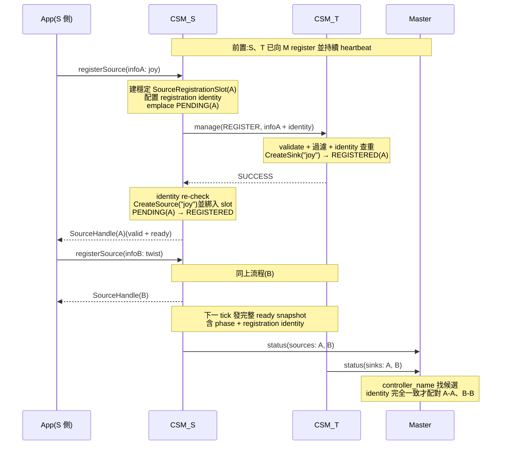
```mermaid
sequenceDiagram
    participant App as App(S 側)
    participant S as CSM_S
    participant T as CSM_T
    participant M as Master

    Note over S,M: 前置:S、T 已向 M register 並持續 heartbeat
    App->>S: registerSource(infoA: joy)
    Note over S: 建穩定 SourceRegistrationSlot(A)<br/>配置 registration identity<br/>emplace PENDING(A)
    S->>T: manage(REGISTER, infoA + identity)
    Note over T: validate + 過濾 + identity 查重<br/>CreateSink("joy") → REGISTERED(A)
    T-->>S: SUCCESS
    Note over S: identity re-check<br/>CreateSource("joy")並綁入 slot<br/>PENDING(A) → REGISTERED
    S-->>App: SourceHandle(A)(valid + ready)

    App->>S: registerSource(infoB: twist)
    Note over S,T: 同上流程(B)
    S-->>App: SourceHandle(B)

    Note over S,T: 下一 tick 發完整 ready snapshot<br/>含 phase + registration identity
    S->>M: status(sources: A, B)
    T->>M: status(sinks: A, B)
    Note over M: controller_name 找候選<br/>identity 完全一致才配對 A-A、B-B
```

函數呼叫流程(單次註冊,詳 A.0 註冊鏈):
1. `registerSource(info)` — 驗證、過濾,建立穩定 slot 與 registration identity 後佔位
2. `manage(REGISTER, identity)` service 呼叫(阻塞至多 timeoutMs)
3. 對側 `_onManage(REGISTER)` — identity 查重、建 Sink、轉正
4. 本側 re-check identity、`CreateSource()` 綁入 slot,回傳 valid + ready Handle

資料流建立後:`App: handle.send(msg)` → `Source::send()`(`recordActivity()` →
`publish`)→ DDS → `Sink::_store()`(`recordActivity()` → 存 `latestMsg_` →
喚醒等待者 → 使用者 callback)。hot path 只記錄,不改狀態(單寫者,D8)；首筆
send / 收訊後,Source 與 Sink 各自由所屬 CSM 於下一 tick 推進 INITIAL → ACTIVE
(`_calcStatus` → table → `_applyStatus`,狀態粒度 = tick,§2.3)——兩側皆自驅,
無 master 參與。任何不同 identity 的既有同名 entry 一律拒絕,並以 typed
`RETRYABLE_CONFLICT` 依 D3 進 RETRY_WAIT；初次 target 不可達 / 結果不明才由
D7 policy 決定是否保留 intent。排入重試後同一 slot 與 SourceHandle 保留(valid 但
not ready),CSM 以 bounded async attempt 重試；成功後替換 endpoint,原 Handle 再次
ready(§8.3/§10)。

##### A.1.1.2 Source 發送間隔超過 timeout 與 disconnect 閾值

情境:App 停止(或過慢)呼叫 `send()`,兩側 elapsed 各自依序越過
`timeout_ns` 與 `disconnect_timeout_ns`。

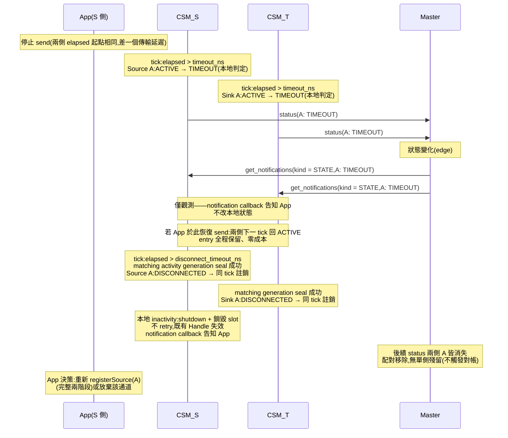
```mermaid
sequenceDiagram
    participant App as App(S 側)
    participant S as CSM_S
    participant T as CSM_T
    participant M as Master

    Note over App: 停止 send(兩側 elapsed 起點相同,差一個傳輸延遲)
    Note over S: tick:elapsed > timeout_ns<br/>Source A:ACTIVE → TIMEOUT(本地判定)
    Note over T: tick:elapsed > timeout_ns<br/>Sink A:ACTIVE → TIMEOUT(本地判定)
    S->>M: status(A: TIMEOUT)
    T->>M: status(A: TIMEOUT)
    Note over M: 狀態變化(edge)
    M->>S: get_notifications(kind = STATE,A: TIMEOUT)
    M->>T: get_notifications(kind = STATE,A: TIMEOUT)
    Note over S,T: 僅觀測——notification callback 告知 App<br/>不改本地狀態

    Note over S,T: 若 App 於此恢復 send:兩側下一 tick 回 ACTIVE<br/>entry 全程保留、零成本

    Note over S: tick:elapsed > disconnect_timeout_ns<br/>matching activity generation seal 成功<br/>Source A:DISCONNECTED → 同 tick 註銷
    Note over T: matching generation seal 成功<br/>Sink A:DISCONNECTED → 同 tick 註銷
    Note over S: 本地 inactivity:shutdown + 銷毀 slot<br/>不 retry,既有 Handle 失效<br/>notification callback 告知 App
    Note over M: 後續 status 兩側 A 皆消失<br/>配對移除,無單側殘留(不觸發對帳)
    Note over App: App 決策:重新 registerSource(A)<br/>(完整兩階段)或放棄該通道
```

要點:兩側各自依本地 elapsed 判定,幾乎同步走完整鏈；master 的 STATE 通知僅為
觀測告知,不是狀態來源。TIMEOUT = 可恢復緩衝:恢復發送即於下一 tick 回 ACTIVE,
不觸發 add/remove；越過 disconnect 閾值 = 確認死亡,兩側各自於同一 tick 內註銷。
終出前必須以計算時觀測到的 activity generation 完成 seal；若其間出現新 send / receive,
seal 失敗並取消該輪註銷。本端 inactivity 或 forced removal 會銷毀 logical slot且
**不**自動 retry(否則形成「重建 → 無活動 → 再註銷」循環),重建由 App 經 callback
決策；Source 仍排入 matching-generation best-effort UNREGISTER 加速清理,但不以其
成功作為正確性前提。若 `disconnect_timeout_ns = 0`,本情境不會自動進入 DISCONNECTED：兩側可
無限期停在 TIMEOUT,直到 forced / explicit unregister 或可靠的遠端生命週期事件提供
其他終止來源,不得宣稱有限時間自動收斂。B channel 不受影響(per-entity 獨立判定)。

##### A.1.1.3 Source CSM crash

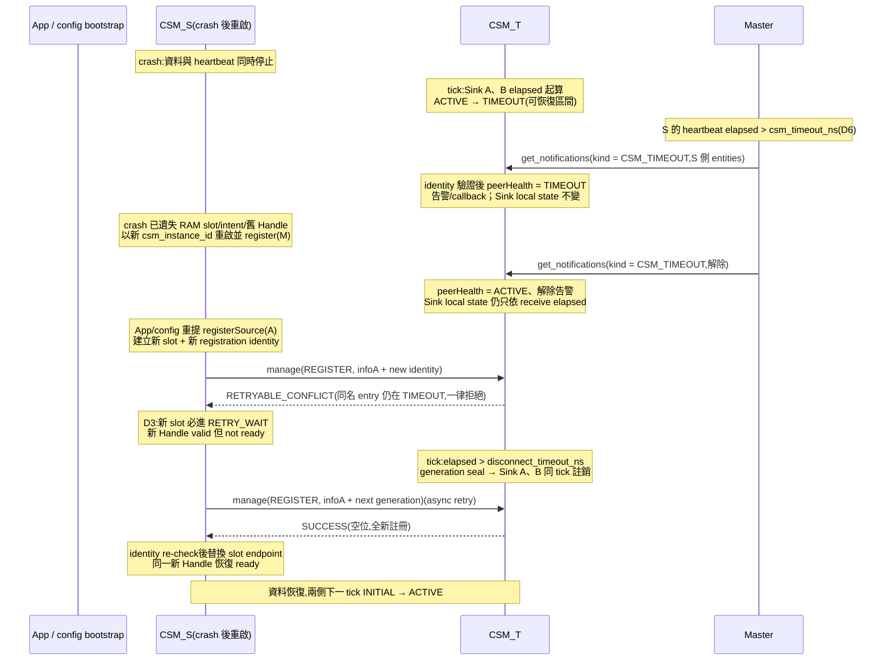
```mermaid
sequenceDiagram
    participant App as App / config bootstrap
    participant S as CSM_S(crash 後重啟)
    participant T as CSM_T
    participant M as Master

    Note over S: crash:資料與 heartbeat 同時停止
    Note over T: tick:Sink A、B elapsed 起算<br/>ACTIVE → TIMEOUT(可恢復區間)
    Note over M: S 的 heartbeat elapsed > csm_timeout_ns(D6)
    M->>T: get_notifications(kind = CSM_TIMEOUT,S 側 entities)
    Note over T: identity 驗證後 peerHealth = TIMEOUT<br/>告警/callback；Sink local state 不變

    Note over S: crash 已遺失 RAM slot/intent/舊 Handle<br/>以新 csm_instance_id 重啟並 register(M)
    M->>T: get_notifications(kind = CSM_TIMEOUT,解除)
    Note over T: peerHealth = ACTIVE、解除告警<br/>Sink local state 仍只依 receive elapsed
    Note over S: App/config 重提 registerSource(A)<br/>建立新 slot + 新 registration identity
    S->>T: manage(REGISTER, infoA + new identity)
    T-->>S: RETRYABLE_CONFLICT(同名 entry 仍在 TIMEOUT,一律拒絕)
    Note over S: D3:新 slot 必進 RETRY_WAIT<br/>新 Handle valid 但 not ready

    Note over T: tick:elapsed > disconnect_timeout_ns<br/>generation seal → Sink A、B 同 tick 註銷
    S->>T: manage(REGISTER, infoA + next generation)(async retry)
    T-->>S: SUCCESS(空位,全新註冊)
    Note over S: identity re-check後替換 slot endpoint<br/>同一新 Handle 恢復 ready
    Note over S,T: 資料恢復,兩側下一 tick INITIAL → ACTIVE
```

要點:T 側 local state 的唯一決策源是 receive activity；CSM_TIMEOUT 僅更新
`peerHealth` 與告警,不得把 Sink 提前標成 TIMEOUT。若 S 失聯超過
`csm_disconnect_timeout_ns`(重啟慢),master 對 T 重送帶 event ID 與完整舊
registration identity 的 DISCONNECTED control event 直到 ACK；T 僅在 identity
仍相符時排 removal,terminal commit 重驗 identity後建立 terminal seal並移除 endpoint。S process
重啟不可能自動恢復 RAM intent,必須由 App/config 重提註冊；新 slot 之後若進
RETRY_WAIT,async retry 成功會讓該次呼叫取得的同一 Handle 恢復 ready。同名查重
無 TIMEOUT 沿用規則(D3)；conflict retry 不設次數上限,D7 僅剩 delay / backoff 數值
未定,加上排程與故障時間不可控,不得給固定收斂上限。
若 entity 或 CSM 的 disconnect 閾值為 0,閾值路徑不保證清除舊 Sink；有限收斂需
依賴 matching DISCONNECTED、full-ready-snapshot 的 level reconciliation / PAIR_MISSING,
或 explicit removal。A、B 各以自身 identity 獨立處理。

##### A.1.1.4 Sink CSM crash

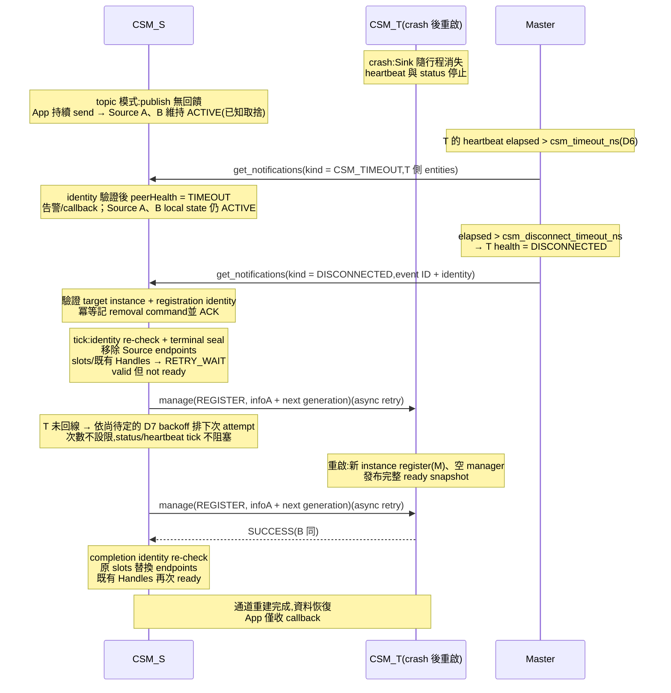
```mermaid
sequenceDiagram
    participant S as CSM_S
    participant T as CSM_T(crash 後重啟)
    participant M as Master

    Note over T: crash:Sink 隨行程消失<br/>heartbeat 與 status 停止
    Note over S: topic 模式:publish 無回饋<br/>App 持續 send → Source A、B 維持 ACTIVE(已知取捨)
    Note over M: T 的 heartbeat elapsed > csm_timeout_ns(D6)
    M->>S: get_notifications(kind = CSM_TIMEOUT,T 側 entities)
    Note over S: identity 驗證後 peerHealth = TIMEOUT<br/>告警/callback；Source A、B local state 仍 ACTIVE

    Note over M: elapsed > csm_disconnect_timeout_ns<br/>→ T health = DISCONNECTED
    M->>S: get_notifications(kind = DISCONNECTED,event ID + identity)
    Note over S: 驗證 target instance + registration identity<br/>冪等記 removal command並 ACK
    Note over S: tick:identity re-check + terminal seal<br/>移除 Source endpoints<br/>slots/既有 Handles → RETRY_WAIT<br/>valid 但 not ready

    S->>T: manage(REGISTER, infoA + next generation)(async retry)
    Note over S: T 未回線 → 依尚待定的 D7 backoff 排下次 attempt<br/>次數不設限,status/heartbeat tick 不阻塞
    Note over T: 重啟:新 instance register(M)、空 manager<br/>發布完整 ready snapshot
    S->>T: manage(REGISTER, infoA + next generation)(async retry)
    T-->>S: SUCCESS(B 同)
    Note over S: completion identity re-check<br/>原 slots 替換 endpoints<br/>既有 Handles 再次 ready
    Note over S,T: 通道重建完成,資料恢復<br/>App 僅收 callback
```

要點:Source 維持 ACTIVE 是狀態自驅的已知取捨(本地事實:有在送)；CSM_TIMEOUT
只把獨立 `peerHealth` 設為 TIMEOUT 並告警。遠端 DISCONNECTED 是可靠 control
event：master 重送至 ACK,CSM 以完整 registration identity 冪等驗證,terminal
seal 後只移除 matching endpoint；logical slot 與原 Handle 保留於
RETRY_WAIT,async retry 成功後同一 Handle 恢復 ready。**快速重啟**時,master 必須
等相關新 incarnation 的 full ready snapshots 齊備；matching PENDING 暫停 missing
grace,避免註冊途中誤判；RETRY_WAIT 不算 live endpoint。若仍持續呈現 Source 單側存在,
level-triggered PAIR_MISSING 會以同一 event ID 重送至 ACK,再走相同移除/retry 流程。
雙閾值與 PENDING-aware reconciliation 互補。若 `csm_disconnect_timeout_ns = 0` 且
T 尚未回線提供 ready snapshot,永久 crash 不保證有限時間自動收斂；D7 數值亦未定案。

##### A.1.1.5 CSM Master crash

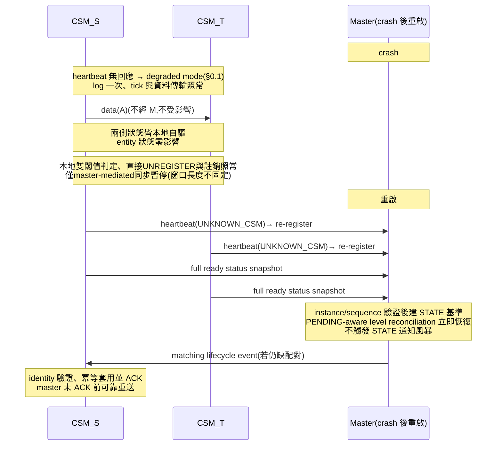
```mermaid
sequenceDiagram
    participant S as CSM_S
    participant T as CSM_T
    participant M as Master(crash 後重啟)

    Note over M: crash
    Note over S,T: heartbeat 無回應 → degraded mode(§0.1)<br/>log 一次、tick 與資料傳輸照常
    S->>T: data(A)(不經 M,不受影響)
    Note over S,T: 兩側狀態皆本地自驅<br/>entity 狀態零影響
    Note over S,T: 本地雙閾值判定、直接UNREGISTER與註銷照常<br/>僅master-mediated同步暫停(窗口長度不固定)

    Note over M: 重啟
    S->>M: heartbeat(UNKNOWN_CSM)→ re-register
    T->>M: heartbeat(UNKNOWN_CSM)→ re-register
    S->>M: full ready status snapshot
    T->>M: full ready status snapshot
    Note over M: instance/sequence 驗證後建 STATE 基準<br/>PENDING-aware level reconciliation 立即恢復<br/>不觸發 STATE 通知風暴
    M->>S: matching lifecycle event(若仍缺配對)
    Note over S: identity 驗證、冪等套用並 ACK<br/>master 未 ACK 前可靠重送
```

要點:資料面完全不受 master 生死影響；v1.1.0 起兩側狀態皆本地自驅,master crash
對 entity 狀態零影響(v1.0.1 的「topic Source 判定凍結」問題消解)。degraded
期間僅 master-mediated 預警、生命週期通知與對帳暫停；直接 UNREGISTER 仍可運作。
本地 inactivity 仍先做 activity-generation guard,
forced terminal 則直接建立 seal；兩者均銷毀 slot且不 retry。既有 RETRY_WAIT 之 async attempt 以對側 CSM 為目標,
不經 master,仍可照常運作。master 回線後不能只把首輪當 edge 基準便停止：必須等待
相關 CSM 的 full ready snapshots,以 PENDING-aware level reconciliation
補發缺失同步；DISCONNECTED / PAIR_MISSING 依 identity 重送至 ACK。若 disconnect
判定設為 0,master outage 期間不保證有限收斂,回線後才由對帳或其他終止來源補收。

#### A.1.2 一對多(1:N)

拓撲:CSM_S 註冊兩個 Source——A(joy,target = CSM_T1)與 B(twist,target = CSM_T2)；
CSM_T1 生成 Sink A、CSM_T2 生成 Sink B。source CSM 同時面對兩個 target,
每個 target CSM 僅持有一條配對；Master 訂閱三個 CSM 的 status,
以 controller_name 建立 A(S–T1)、B(S–T2)兩組配對。

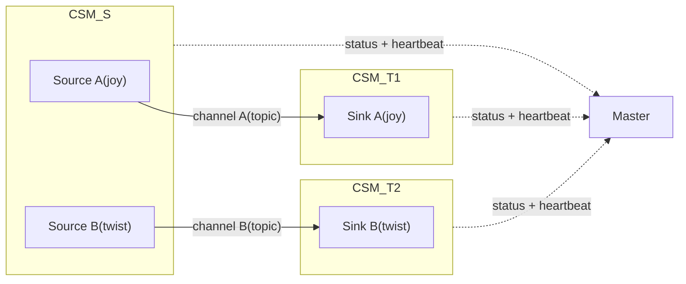
```mermaid
flowchart LR
    subgraph S["CSM_S"]
        SA["Source A(joy)"]
        SB["Source B(twist)"]
    end
    subgraph T1["CSM_T1"]
        KA["Sink A(joy)"]
    end
    subgraph T2["CSM_T2"]
        KB["Sink B(twist)"]
    end
    M["Master"]
    SA -->|"channel A(topic)"| KA
    SB -->|"channel B(topic)"| KB
    S -.->|"status + heartbeat"| M
    T1 -.->|"status + heartbeat"| M
    T2 -.->|"status + heartbeat"| M
```

##### A.1.2.1 註冊至 Sink 生成的完整流程

CSM_S 依序對兩個不同 target 註冊 Source(A:joy → CSM_T1、B:twist → CSM_T2)；
兩條註冊鏈除 target 不同外互相獨立,各自走完整註冊鏈,互不等待、互不影響。

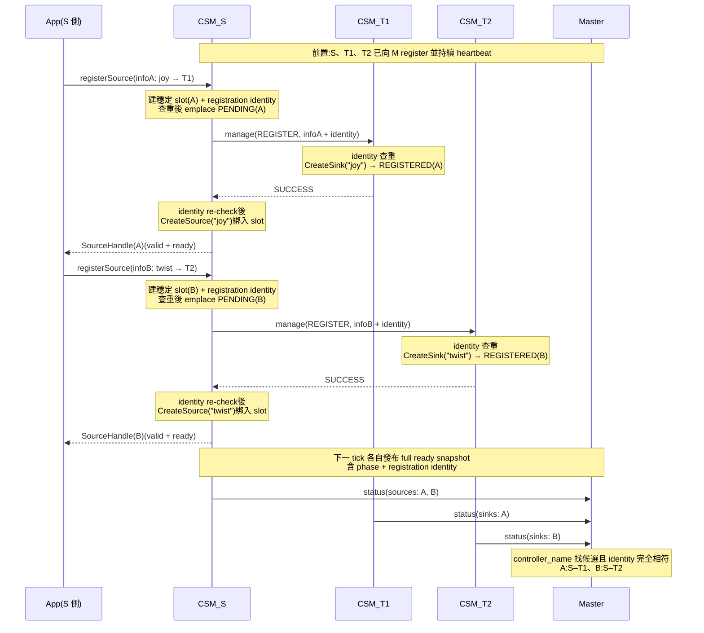
```mermaid
sequenceDiagram
    participant App as App(S 側)
    participant S as CSM_S
    participant T1 as CSM_T1
    participant T2 as CSM_T2
    participant M as Master

    Note over S,M: 前置:S、T1、T2 已向 M register 並持續 heartbeat
    App->>S: registerSource(infoA: joy → T1)
    Note over S: 建穩定 slot(A) + registration identity<br/>查重後 emplace PENDING(A)
    S->>T1: manage(REGISTER, infoA + identity)
    Note over T1: identity 查重<br/>CreateSink("joy") → REGISTERED(A)
    T1-->>S: SUCCESS
    Note over S: identity re-check後<br/>CreateSource("joy")綁入 slot
    S-->>App: SourceHandle(A)(valid + ready)

    App->>S: registerSource(infoB: twist → T2)
    Note over S: 建穩定 slot(B) + registration identity<br/>查重後 emplace PENDING(B)
    S->>T2: manage(REGISTER, infoB + identity)
    Note over T2: identity 查重<br/>CreateSink("twist") → REGISTERED(B)
    T2-->>S: SUCCESS
    Note over S: identity re-check後<br/>CreateSource("twist")綁入 slot
    S-->>App: SourceHandle(B)(valid + ready)

    Note over S,M: 下一 tick 各自發布 full ready snapshot<br/>含 phase + registration identity
    S->>M: status(sources: A, B)
    T1->>M: status(sinks: A)
    T2->>M: status(sinks: B)
    Note over M: controller_name 找候選且 identity 完全相符<br/>A:S–T1、B:S–T2
```

函數呼叫流程(單次註冊,詳 A.0 註冊鏈):
1. `registerSource(info)` — 驗證、過濾,建立穩定 slot 與 identity 後佔位
2. `manage(REGISTER, identity)` 呼叫該筆 info 指定的 target(阻塞至多 timeoutMs)
3. 對側 `_onManage(REGISTER)` — identity 查重、建 Sink、轉正
4. 本側 identity re-check、`CreateSource()` 綁入 slot,回傳 valid + ready Handle

資料流建立後,兩條 channel 各自獨立運作:`App: handleA.send(msg)` →
`Source::send()`(`recordActivity()` 接受後 `rate_.record()` → `publish`)→ DDS →
T1 側 `Sink::_store()`(`recordActivity()` 接受後 `rate_.record()` → 存 `latestMsg_` →
喚醒等待者 → 使用者 callback)；B channel 於 S–T2 間同理。hot path 只記錄、
不改狀態(D8)；兩側皆為狀態自驅——Source A、B 於首次 `send()` 後、Sink A、Sink B
於首筆訊息後,各於所屬 CSM 的下一個 status tick 由 `_calcStatus` → `_applyStatus`
轉 ACTIVE(tick 粒度,§2.3),無外部注入路徑。

要點:兩條註冊鏈唯一的共享狀態是 CSM_S 的 `sources_` 容器(雙鍵查重於同一鎖下
進行)；T1、T2 各自僅認識屬於自己的那條配對。任一條鏈失敗(遠端拒絕/逾時 →
rollback,§2.4)不影響另一條鏈的成敗。typed conflict 依 D3 必 retry；初次 target
不可達 / 結果不明才由 D7 policy 決定。轉入 RETRY_WAIT 後,該通道的穩定 slot /
Handle 保留(valid 但 not ready),bounded async retry 成功後原 Handle 恢復 ready,
另一通道完全不受影響。D7 的 delay、backoff 與 optional initial attempt 上限數值
尚未定案(§8.3/§12 #6)。

##### A.1.2.2 Source 發送間隔超過 timeout 與 disconnect 閾值

情境:App 停止(或過慢)呼叫 Source A 的 `send()`,S 側 Source A 與 T1 側 Sink A
各自依本地 elapsed 推進(起點相同,誤差一個傳輸延遲),依序越過 `timeout_ns` 與
`disconnect_timeout_ns`；Source B 照常發送,B channel 全程不受影響。

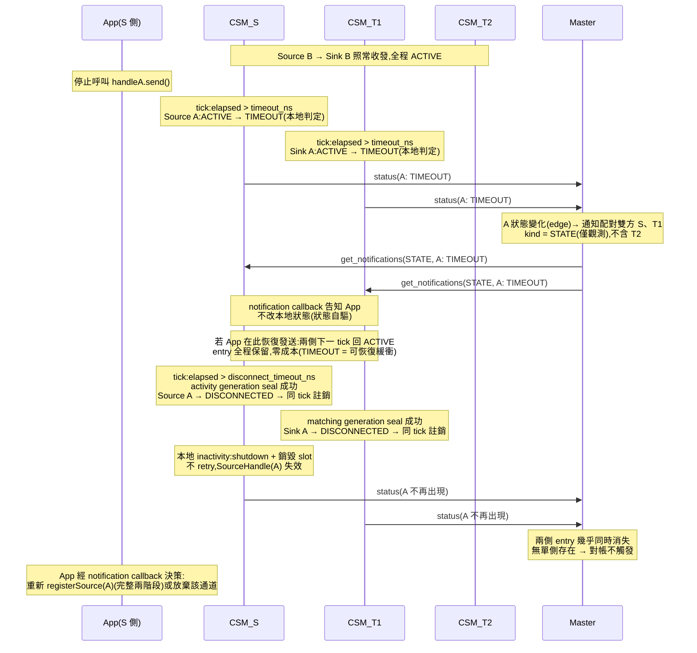
```mermaid
sequenceDiagram
    participant App as App(S 側)
    participant S as CSM_S
    participant T1 as CSM_T1
    participant T2 as CSM_T2
    participant M as Master

    Note over S,T2: Source B → Sink B 照常收發,全程 ACTIVE
    Note over App: 停止呼叫 handleA.send()
    Note over S: tick:elapsed > timeout_ns<br/>Source A:ACTIVE → TIMEOUT(本地判定)
    Note over T1: tick:elapsed > timeout_ns<br/>Sink A:ACTIVE → TIMEOUT(本地判定)
    S->>M: status(A: TIMEOUT)
    T1->>M: status(A: TIMEOUT)
    Note over M: A 狀態變化(edge)→ 通知配對雙方 S、T1<br/>kind = STATE(僅觀測),不含 T2
    M->>S: get_notifications(STATE, A: TIMEOUT)
    M->>T1: get_notifications(STATE, A: TIMEOUT)
    Note over S,T1: notification callback 告知 App<br/>不改本地狀態(狀態自驅)

    Note over S,T1: 若 App 在此恢復發送:兩側下一 tick 回 ACTIVE<br/>entry 全程保留,零成本(TIMEOUT = 可恢復緩衝)

    Note over S: tick:elapsed > disconnect_timeout_ns<br/>activity generation seal 成功<br/>Source A → DISCONNECTED → 同 tick 註銷
    Note over T1: matching generation seal 成功<br/>Sink A → DISCONNECTED → 同 tick 註銷
    Note over S: 本地 inactivity:shutdown + 銷毀 slot<br/>不 retry,SourceHandle(A) 失效
    S->>M: status(A 不再出現)
    T1->>M: status(A 不再出現)
    Note over M: 兩側 entry 幾乎同時消失<br/>無單側存在 → 對帳不觸發
    Note over App: App 經 notification callback 決策:<br/>重新 registerSource(A)(完整兩階段)或放棄該通道
```

要點:逾時判定的作用範圍限於單一配對(S 側 Source A、T1 側 Sink A),兩側同一
起點各自量測、幾乎同步推進——master 的 STATE 通知僅為觀測告知,不是狀態來源；
通知對象由 controller_name 配對決定,T2 全程不會收到任何關於 A 的通知,Sink B
的判定於 T2 本地獨立進行。短暫中斷由 TIMEOUT 區間吸收(恢復即回 ACTIVE,無
add/remove 成本)；越過 disconnect 閾值時,各側均須先以所觀測的 activity generation
執行 terminal seal,seal 成功才同 tick 註銷；計算後若已有新活動則取消本輪。重建
須重新註冊——本地 inactivity 或 forced removal 會銷毀 slot且不 retry,由 App
決策；Source 仍排 matching-generation best-effort UNREGISTER,對側自身判定與對帳
提供正確性保障。若 `disconnect_timeout_ns = 0`,兩側不會由本地 elapsed 自動註銷,可無限期
停在 TIMEOUT；只有 forced / explicit unregister 或可靠遠端 lifecycle event 等
其他終止來源能推進,不得宣稱有限時間收斂。

##### A.1.2.3 Source CSM crash

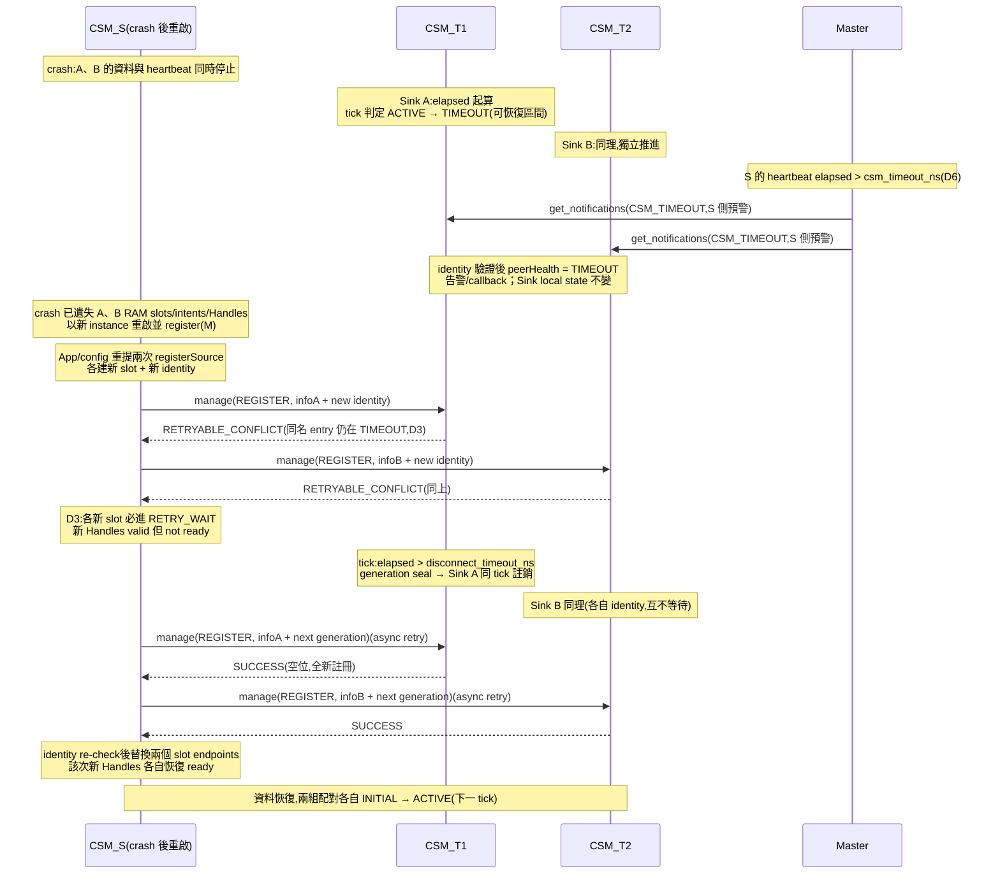
```mermaid
sequenceDiagram
    participant S as CSM_S(crash 後重啟)
    participant T1 as CSM_T1
    participant T2 as CSM_T2
    participant M as Master

    Note over S: crash:A、B 的資料與 heartbeat 同時停止
    Note over T1: Sink A:elapsed 起算<br/>tick 判定 ACTIVE → TIMEOUT(可恢復區間)
    Note over T2: Sink B:同理,獨立推進
    Note over M: S 的 heartbeat elapsed > csm_timeout_ns(D6)
    M->>T1: get_notifications(CSM_TIMEOUT,S 側預警)
    M->>T2: get_notifications(CSM_TIMEOUT,S 側預警)
    Note over T1,T2: identity 驗證後 peerHealth = TIMEOUT<br/>告警/callback；Sink local state 不變

    Note over S: crash 已遺失 A、B RAM slots/intents/Handles<br/>以新 instance 重啟並 register(M)
    Note over S: App/config 重提兩次 registerSource<br/>各建新 slot + 新 identity
    S->>T1: manage(REGISTER, infoA + new identity)
    T1-->>S: RETRYABLE_CONFLICT(同名 entry 仍在 TIMEOUT,D3)
    S->>T2: manage(REGISTER, infoB + new identity)
    T2-->>S: RETRYABLE_CONFLICT(同上)
    Note over S: D3:各新 slot 必進 RETRY_WAIT<br/>新 Handles valid 但 not ready

    Note over T1: tick:elapsed > disconnect_timeout_ns<br/>generation seal → Sink A 同 tick 註銷
    Note over T2: Sink B 同理(各自 identity,互不等待)
    S->>T1: manage(REGISTER, infoA + next generation)(async retry)
    T1-->>S: SUCCESS(空位,全新註冊)
    S->>T2: manage(REGISTER, infoB + next generation)(async retry)
    T2-->>S: SUCCESS
    Note over S: identity re-check後替換兩個 slot endpoints<br/>該次新 Handles 各自恢復 ready
    Note over S,T2: 資料恢復,兩組配對各自 INITIAL → ACTIVE(下一 tick)
```

要點:1:N 拓撲中 source CSM 是全部 target 的共同上游,其 crash 波及 T1 與 T2——
每個 target 的 Sink 只依本地 receive activity 推進；CSM_TIMEOUT 僅更新各 entry
的 `peerHealth` 與告警,不改 local state。S process crash 會摧毀全部 RAM intent,
重啟後必須由 App/config 重提 A、B,各自建立新 slot / identity；typed conflict 依 D3
必進 RETRY_WAIT,async retry 成功會讓該次新 Handle 恢復 ready。若 S 失聯超過
`csm_disconnect_timeout_ns`,master 以完整 identity 對 T1/T2 發可靠 DISCONNECTED,
重送至 ACK；各 target 驗證 identity並建立 terminal seal,只移除 matching Sink。
同名 TIMEOUT entry 不沿用(D3),retryable conflict 不設次數上限。D7 backoff 數值
未定,不得寫固定 retry 間隔或收斂上限；
若 disconnect 閾值為 0,有限收斂需依賴可靠 remote event、full-ready-snapshot 的
level reconciliation / PAIR_MISSING 或 explicit removal。兩條鏈成敗互不影響。

##### A.1.2.4 Sink CSM crash

以 CSM_T1 crash 為例,展示 1:N 拓撲的故障隔離性:Source B 與 CSM_T2 完全不受影響。

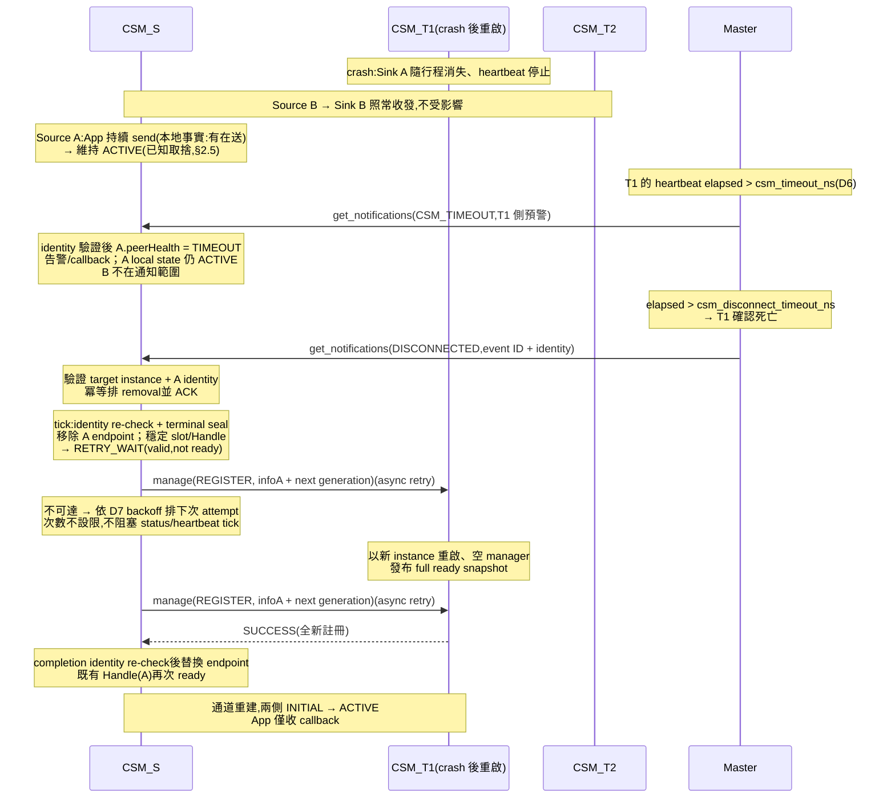
```mermaid
sequenceDiagram
    participant S as CSM_S
    participant T1 as CSM_T1(crash 後重啟)
    participant T2 as CSM_T2
    participant M as Master

    Note over T1: crash:Sink A 隨行程消失、heartbeat 停止
    Note over S,T2: Source B → Sink B 照常收發,不受影響
    Note over S: Source A:App 持續 send(本地事實:有在送)<br/>→ 維持 ACTIVE(已知取捨,§2.5)
    Note over M: T1 的 heartbeat elapsed > csm_timeout_ns(D6)
    M->>S: get_notifications(CSM_TIMEOUT,T1 側預警)
    Note over S: identity 驗證後 A.peerHealth = TIMEOUT<br/>告警/callback；A local state 仍 ACTIVE<br/>B 不在通知範圍

    Note over M: elapsed > csm_disconnect_timeout_ns<br/>→ T1 確認死亡
    M->>S: get_notifications(DISCONNECTED,event ID + identity)
    Note over S: 驗證 target instance + A identity<br/>冪等排 removal並 ACK
    Note over S: tick:identity re-check + terminal seal<br/>移除 A endpoint；穩定 slot/Handle<br/>→ RETRY_WAIT(valid,not ready)

    S->>T1: manage(REGISTER, infoA + next generation)(async retry)
    Note over S: 不可達 → 依 D7 backoff 排下次 attempt<br/>次數不設限,不阻塞 status/heartbeat tick
    Note over T1: 以新 instance 重啟、空 manager<br/>發布 full ready snapshot
    S->>T1: manage(REGISTER, infoA + next generation)(async retry)
    T1-->>S: SUCCESS(全新註冊)
    Note over S: completion identity re-check後替換 endpoint<br/>既有 Handle(A)再次 ready
    Note over S,T1: 通道重建,兩側 INITIAL → ACTIVE<br/>App 僅收 callback
```

要點:Sink CSM 的 crash 只波及以其為 target 的配對——Source B 與 T2 的資料流、
tick 判定、master 通知均照常,此為 1:N 拓撲相對於單一 target 的隔離優勢。topic
模式下 Source A 的 send 活動不受對側生死影響、local state 維持 ACTIVE；
CSM_TIMEOUT 只將 `peerHealth` 設為 TIMEOUT並告警。遠端 DISCONNECTED 經 event ID
可靠重送至 ACK；S 完整比對 registration identity後,建立 terminal seal並移除 A
endpoint,穩定 slot / 原 Handle 進 RETRY_WAIT,async retry 成功後同一 Handle 恢復
ready。若 T1 快速重啟,master 要等 S、T1 目前 incarnation 的 full ready snapshots
齊備；matching PENDING 會暫停 missing grace,RETRY_WAIT 不算 live endpoint。確認 A 持續單側存在後,
level-triggered PAIR_MISSING 才以相同 identity 重送至 ACK並走相同 removal/retry。
若 `csm_disconnect_timeout_ns = 0` 且 T1 尚未回線交付 ready snapshot,永久 crash
不保證有限時間收斂；D7 數值參數亦未定案。

##### A.1.2.5 CSM Master crash

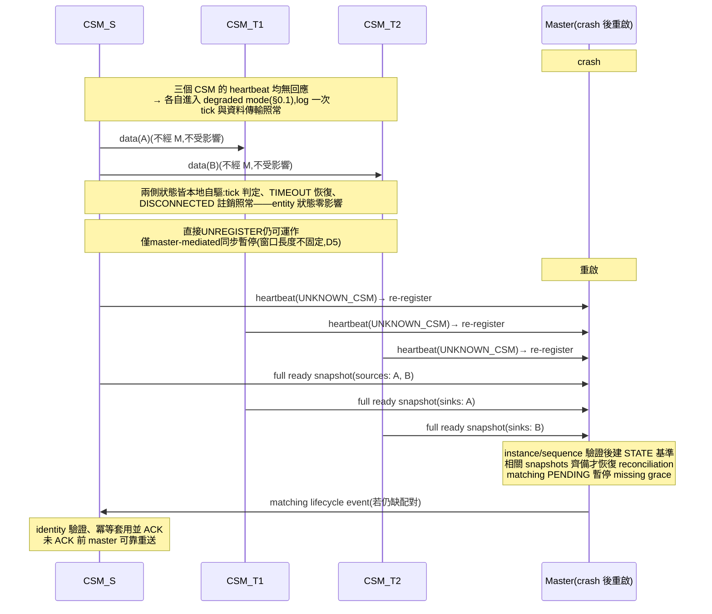
```mermaid
sequenceDiagram
    participant S as CSM_S
    participant T1 as CSM_T1
    participant T2 as CSM_T2
    participant M as Master(crash 後重啟)

    Note over M: crash
    Note over S,T2: 三個 CSM 的 heartbeat 均無回應<br/>→ 各自進入 degraded mode(§0.1),log 一次<br/>tick 與資料傳輸照常
    S->>T1: data(A)(不經 M,不受影響)
    S->>T2: data(B)(不經 M,不受影響)
    Note over S,T2: 兩側狀態皆本地自驅:tick 判定、TIMEOUT 恢復、<br/>DISCONNECTED 註銷照常——entity 狀態零影響
    Note over S,T2: 直接UNREGISTER仍可運作<br/>僅master-mediated同步暫停(窗口長度不固定,D5)

    Note over M: 重啟
    S->>M: heartbeat(UNKNOWN_CSM)→ re-register
    T1->>M: heartbeat(UNKNOWN_CSM)→ re-register
    T2->>M: heartbeat(UNKNOWN_CSM)→ re-register
    S->>M: full ready snapshot(sources: A, B)
    T1->>M: full ready snapshot(sinks: A)
    T2->>M: full ready snapshot(sinks: B)
    Note over M: instance/sequence 驗證後建 STATE 基準<br/>相關 snapshots 齊備才恢復 reconciliation<br/>matching PENDING 暫停 missing grace
    M->>S: matching lifecycle event(若仍缺配對)
    Note over S: identity 驗證、冪等套用並 ACK<br/>未 ACK 前 master 可靠重送
```

要點:degraded 範圍涵蓋全部三個 CSM,但進入與離開 degraded mode 由各 CSM 依
自身 heartbeat response 逾時獨立判定,無互相依賴。兩側狀態皆本地自驅(v1.1.0),
master 生死對 entity 狀態零影響——資料面(A、B 兩條 channel)、本地 tick 判定與
註銷照常；期間僅失去 STATE 觀測、CSM 級預警、master lifecycle 通知與對帳,
直接 matching-generation UNREGISTER 仍可運作。單側註銷後,
對側可能依自身 elapsed 走到 DISCONNECTED,也可能因持續本地活動或停用 disconnect
而保留；不一致窗口長度不固定。本地 inactivity 經 activity-generation guard、
forced removal 直接建立 terminal seal後銷毀 slot且不 retry；既存 RETRY_WAIT 的
async retry 不經 master,照常運作。master 重啟後,各 full ready snapshot 只建立
STATE edge 基準、不引發通知風暴；待相關 snapshots 齊備後立即執行 PENDING-aware
level reconciliation,DISCONNECTED / PAIR_MISSING 以 matching identity 重送至 ACK。
disconnect 判定為 0 時,master outage 期間不保證有限收斂。

---

#### A.1.3 多對一(N:1)

拓撲總覽:CSM_S1 註冊 Source A(joy)、CSM_S2 註冊 Source B(twist),target 皆為 CSM_T；
CSM_T 的 `sinks_` 同時管理來自兩個 source CSM 的 entry,生成 Sink A(joy)與 Sink B(twist)。
App1、App2 分別為 S1、S2 側的使用者應用層；三個 CSM 各自向 master register 並持續 heartbeat。
`controller_name` 全系統唯一,保證兩個來源的 entry 在 CSM_T 上必然不衝突,
master 亦藉此將 A、B 分別配對為 (S1, T) 與 (S2, T) 兩條互相獨立的通知路徑。

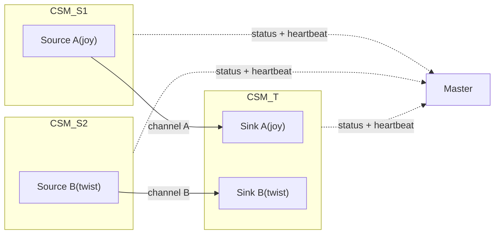
```mermaid
flowchart LR
    subgraph S1["CSM_S1"]
        SA["Source A(joy)"]
    end
    subgraph S2["CSM_S2"]
        SB["Source B(twist)"]
    end
    subgraph T["CSM_T"]
        KA["Sink A(joy)"]
        KB["Sink B(twist)"]
    end
    M["Master"]
    SA -->|"channel A"| KA
    SB -->|"channel B"| KB
    S1 -.->|"status + heartbeat"| M
    S2 -.->|"status + heartbeat"| M
    T -.->|"status + heartbeat"| M
```

##### A.1.3.1 註冊至 Sink 生成的完整流程

CSM_S1 與 CSM_S2 各自向 CSM_T 註冊一個 Source(A:joy、B:twist)；兩條註冊鏈由
不同的 source CSM 發起,於 CSM_T 匯聚。CSM_T 對每筆 REGISTER 分別執行 validate、
過濾與 `sinkMtx_` 下的雙鍵查重——`controller_name` 全域唯一使 A、B 兩筆 entry 互不衝突；
若兩個來源以 identical controller_name 並發註冊(組態錯誤),持鎖查重保證恰一成功,
另一側收到 error 且不留殘餘佔位(§8.4 M4 註冊風暴的多來源版,即整合場景 I7)。

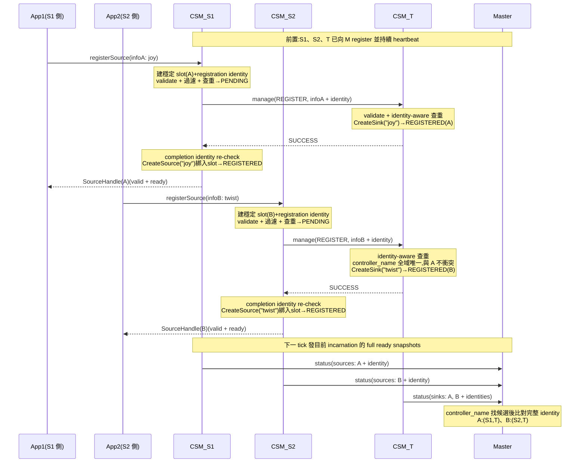
```mermaid
sequenceDiagram
    participant A1 as App1(S1 側)
    participant A2 as App2(S2 側)
    participant S1 as CSM_S1
    participant S2 as CSM_S2
    participant T as CSM_T
    participant M as Master

    Note over S1,M: 前置:S1、S2、T 已向 M register 並持續 heartbeat
    A1->>S1: registerSource(infoA: joy)
    Note over S1: 建穩定 slot(A)+registration identity<br/>validate + 過濾 + 查重→PENDING
    S1->>T: manage(REGISTER, infoA + identity)
    Note over T: validate + identity-aware 查重<br/>CreateSink("joy")→REGISTERED(A)
    T-->>S1: SUCCESS
    Note over S1: completion identity re-check<br/>CreateSource("joy")綁入slot→REGISTERED
    S1-->>A1: SourceHandle(A)(valid + ready)

    A2->>S2: registerSource(infoB: twist)
    Note over S2: 建穩定 slot(B)+registration identity<br/>validate + 過濾 + 查重→PENDING
    S2->>T: manage(REGISTER, infoB + identity)
    Note over T: identity-aware 查重<br/>controller_name 全域唯一,與 A 不衝突<br/>CreateSink("twist")→REGISTERED(B)
    T-->>S2: SUCCESS
    Note over S2: completion identity re-check<br/>CreateSource("twist")綁入slot→REGISTERED
    S2-->>A2: SourceHandle(B)(valid + ready)

    Note over S1,M: 下一 tick 發目前 incarnation 的 full ready snapshots
    S1->>M: status(sources: A + identity)
    S2->>M: status(sources: B + identity)
    T->>M: status(sinks: A, B + identities)
    Note over M: controller_name 找候選後比對完整 identity<br/>A:(S1,T)、B:(S2,T)
```

函數呼叫流程(單次註冊,詳 A.0 註冊鏈):
1. `registerSource(info)` — 驗證、過濾,建立穩定 slot / identity 並 PENDING 佔位
2. `manage(REGISTER, identity)` service 呼叫(首次呼叫阻塞至多 timeoutMs)
3. 對側 `_onManage(REGISTER)` — 完整 identity 查重、建 Sink、轉 REGISTERED
4. 本側 completion identity re-check、`CreateSource()` 綁入 slot、回 valid + ready Handle

資料流建立後:`App1: handleA.send(msg)` 與 `App2: handleB.send(msg)` 各經
`Source::send()`(`recordActivity()` 接受後 `rate_.record()` → `publish`)→ DDS →
對應 `Sink::_store()`(`recordActivity()` 接受後 `rate_.record()` → 存 `latestMsg_` →
使用者 callback),兩條 channel 為完全獨立的 DDS 傳輸,hot path 只記錄、不改狀態。
兩側皆自驅:Source A、B 於首次 send 後、Sink A、B 於首筆訊息後,各於所屬 CSM 的
下一個 status tick 由 INITIAL 轉 ACTIVE(`_calcStatus` → CSM table →
`_applyStatus`,§8.3),master 不參與狀態推進。

要點:CSM_T 的 status tick 以單一 timer 巡覽 A、B 兩個 Sink,但 `_calcStatus`
判定為 per-entity 獨立；S1、S2 兩側的註冊鏈彼此毫無耦合,先後順序與交錯並發皆
不影響結果。唯一的匯聚點是 CSM_T 的持鎖查重,其以 `controller_name` +
`channel_name` 雙鍵與完整 identity 擋下重複或衝突註冊——相同 identity 重送冪等,
不同 identity 的同名 entry 一律以 typed conflict 拒絕(D3,無沿用規則),且新 slot
必進 RETRY_WAIT；只有初次 target 不可達 / 結果不明是否保留 intent 依 D7 policy。
bounded async retry 成功後原 Handle 恢復 ready；D7 的間隔、backoff 與 optional
initial attempt 上限數值尚未定案。

##### A.1.3.2 Source 發送間隔超過 timeout 與 disconnect 閾值

情境:App1 停止(或過慢)呼叫 `send()`,Source A(S1 側)與 Sink A(T 側)各自的
elapsed 依序越過 `timeout_ns` 與 `disconnect_timeout_ns`；App2 持續正常發送,
channel B 全程不受影響。

```mermaid
sequenceDiagram
    participant S1 as CSM_S1
    participant S2 as CSM_S2
    participant T as CSM_T
    participant M as Master

    Note over S2,T: channel B 持續收發,Source B 與 Sink B 維持 ACTIVE
    Note over S1: App1 停止 send,Source A elapsed 起算
    Note over S1: tick:elapsed > timeout_ns<br/>Source A:ACTIVE → TIMEOUT
    Note over T: tick:elapsed > timeout_ns<br/>Sink A:ACTIVE → TIMEOUT(幾乎同步)
    S1->>M: status(A: TIMEOUT)
    T->>M: status(A: TIMEOUT, B: ACTIVE)
    Note over M: A 狀態變化(edge),配對 (S1, T),與 S2 無關
    M->>S1: get_notifications(kind=STATE, A: TIMEOUT)
    M->>T: get_notifications(kind=STATE, A: TIMEOUT)
    Note over S1: 僅觀測:notification callback 告知 App1<br/>不改本地狀態

    Note over S1,T: 若 App1 於此恢復 send:兩側各於下一 tick 回 ACTIVE<br/>entry 全程保留,零成本(本情境未恢復)

    Note over S1: tick:elapsed > disconnect_timeout_ns<br/>activity generation seal 成功<br/>Source A:DISCONNECTED→callback→shutdown→erase<br/>本地原因銷毀 slot,Handle 失效
    Note over T: tick:elapsed > disconnect_timeout_ns<br/>matching generation seal 成功<br/>Sink A:DISCONNECTED → 同 tick 註銷(幾乎同步)
    S1->>M: status(A 不再出現)
    T->>M: status(sinks: B)
    Note over M: A 於兩側幾乎同時消失<br/>無單側殘留,對帳不動作
    Note over S1: 本端原因不入 retry 佇列<br/>App1 經 notification callback 決策<br/>重新 registerSource(A) 重建
```

要點:兩側各依本地 elapsed 的 tick 判定推進,節奏幾乎同步(elapsed 起點相同,
誤差一個傳輸延遲 + tick 相位差)；master 的 STATE 通知僅為觀測(告知 App),
不是狀態來源。TIMEOUT 為可恢復緩衝:恢復 send 後兩側各於下一 tick 回 ACTIVE,
不觸發任何 add/remove；越過 disconnect 閾值即確認死亡,兩側各以所觀測 activity
generation 執行 terminal seal,成功才同 tick 註銷；若計算後已有新活動則取消本輪,
Source 另排入 matching-generation best-effort UNREGISTER 加速對側清理,但正確性仍由
對側自身判定與對帳保障(§8.3)。本端活動停止造成的註銷不自動
retry——重建與否由 App1 決策(重新 registerSource,完整兩階段)。各配對獨立:
master 依 controller_name 將 A 的通知僅推給配對 (S1, T),CSM_S2 全程不收通知,
Sink B 的 tick 判定亦不受 A 的異常影響(per-entity 獨立)。若
`disconnect_timeout_ns = 0`,本地 elapsed 不會移除 A,可長期停在 TIMEOUT；有限
收斂需 forced / explicit unregister 或可靠 remote lifecycle event,不可給固定上限。

##### A.1.3.3 Source CSM crash

以 CSM_S1 crash 為例,展示 N:1 拓撲下 source 側故障的隔離性:
僅配對 A 受影響,Sink B 與 CSM_S2 照常運作。

```mermaid
sequenceDiagram
    participant App1 as App1 / config bootstrap
    participant S1 as CSM_S1(crash 後重啟)
    participant S2 as CSM_S2
    participant T as CSM_T
    participant M as Master

    Note over S1: crash:資料與 heartbeat 同時停止<br/>舊 slot/intent/Handle 隨 process 消失
    Note over S2,T: channel B 收發照常,Sink B 維持 ACTIVE
    Note over T: Sink A elapsed 起算<br/>tick:TIMEOUT(可恢復區間)
    Note over M: S1 heartbeat elapsed > csm_timeout_ns
    M->>T: CSM_TIMEOUT(peer_csm_health=TIMEOUT<br/>event ID + old identity,重送至 ACK)
    Note over T: A.peerHealth=TIMEOUT、告警<br/>Sink A local state 不變；B 不在範圍
    Note over S2: 無任何通知(A 的配對不含 S2)

    Note over S1: 以新 csm_instance_id 重啟並 register(M)
    App1->>S1: 重提 registerSource(A)<br/>建立新 slot + 新 registration identity
    S1->>T: manage(REGISTER, infoA + new identity)
    T-->>S1: RETRYABLE_CONFLICT(舊同名 Sink 仍在 TIMEOUT,D3)
    Note over S1: D3:新 slot 必進 RETRY_WAIT<br/>新 Handle valid但not ready
    alt 舊 Sink 本地越過 disconnect
        Note over T: activity generation seal 成功<br/>Sink A:DISCONNECTED→callback→shutdown→erase
    else S1 舊 instance 越過 CSM disconnect
        M->>T: DISCONNECTED(old identity,event ID,重送至 ACK)
        Note over T: matching-generation terminal removal
    end
    S1->>T: manage(REGISTER, infoA + next generation)(async retry)
    T-->>S1: SUCCESS(空位,全新註冊)
    Note over S1: completion identity re-check後裝入新 slot<br/>同一新 Handle 恢復 ready
    Note over S1,T: 資料恢復,兩側下一 tick INITIAL → ACTIVE
```

要點:S1 失聯的通知對象僅為其 entries 的配對方 CSM_T,CSM_S2 與 channel B
完全隔離,不收通知、狀態不受擾動——故障域以 CSM 為界,是 N:1 拓撲相對於單一
CSM 承載多 Source 的核心優勢。T 側 Sink A 的本地 elapsed 判定為唯一狀態決策源,
master 的 CSM_TIMEOUT 只更新 `peerHealth` 與告警,不改 local state；解除通知亦同。
若 S1 舊 instance 失聯超過 `csm_disconnect_timeout_ns`,master 對 T 可靠重送具完整
舊 identity 的 DISCONNECTED,T 僅移除 matching Sink。S1 process crash 已摧毀 RAM
intent,重啟後必須由 App/config 重提；新 REGISTER 撞上舊 TIMEOUT entry 仍拒絕(D3),
不沿用。typed conflict 依 D3 使新 slot / Handle 在 RETRY_WAIT 保留,async attempt
成功後同一新 Handle 恢復 ready；retryable attempt 不設次數上限。D7 backoff 數值
未決且 disconnect=0 可能使舊 entry
長期存在,不得承諾固定收斂上限；此時須由可靠 remote lifecycle、full-ready-snapshot
對帳 / PAIR_MISSING 或 explicit removal 提供終止來源。

##### A.1.3.4 Sink CSM crash

CSM_T 為兩條 channel 的共同 target,其 crash 同時影響全部 source CSM:
S1、S2 均由 master 雙閾值走「預警 → 註銷指示 → 註銷 + retry」,各自獨立收斂,
T 重啟後各 slot 的非阻塞 retry 獨立重建 endpoint；既有 Handles 不需更換。

```mermaid
sequenceDiagram
    participant S1 as CSM_S1
    participant S2 as CSM_S2
    participant T as CSM_T(crash 後重啟)
    participant M as Master

    Note over T: crash:Sink A、B 消失<br/>heartbeat 與 status 停止
    Note over S1,S2: App1、App2 持續 send<br/>Source A、B 維持 ACTIVE(本地事實:有在送)
    Note over M: T heartbeat elapsed > csm_timeout_ns
    M->>S1: CSM_TIMEOUT(peer_csm_health=TIMEOUT,A identity)
    M->>S2: CSM_TIMEOUT(peer_csm_health=TIMEOUT,B identity)
    Note over S1,S2: peerHealth=TIMEOUT + callback<br/>Source A、B local state 仍 ACTIVE

    Note over M: elapsed > csm_disconnect_timeout_ns<br/>→ T health=DISCONNECTED
    M->>S1: DISCONNECTED(event ID + A identity,重送至 ACK)
    M->>S2: DISCONNECTED(event ID + B identity,重送至 ACK)
    Note over S1: matching terminal seal→callback→shutdown<br/>endpoint reset,slot/Handle→RETRY_WAIT
    Note over S2: B 同理,各自冪等處理

    S1->>T: manage(REGISTER, infoA + next generation)(async,T 未回線)
    Note over S1: 服務不可達 → 依 D7 backoff 排下次 attempt<br/>次數不設限,tick 不阻塞
    Note over T: 新 instance 重啟、空 manager<br/>發布 full ready snapshot
    S1->>T: manage(REGISTER, infoA + next generation)(async)
    T-->>S1: SUCCESS
    S2->>T: manage(REGISTER, infoB + next generation)(async)
    T-->>S2: SUCCESS
    Note over S1,S2: completion identity re-check後<br/>原 slots 裝入新 endpoints,Handles ready
    Note over S1,T: 兩條通道重建完成<br/>App1、App2 沿用 Handles 並收 callback
```

要點:單點 target 的 crash 是 N:1 拓撲的最大衝擊面——全部 source CSM 同時受
影響,但各自的註銷與 retry 狀態完全獨立(attempt、backoff、completion 各自管理),彼此無需
協調。topic 模式下 Source 持續 send 維持 ACTIVE 為已知取捨(狀態反映本端活動,
§2.5)；CSM_TIMEOUT 只更新 peerHealth,不得提前改 local state。確認死亡後的可靠
DISCONNECTED 攜帶 event ID / target instance / registration identity；S1、S2 只移除
matching endpoint,穩定 slot 與既有 Handle 進 RETRY_WAIT,async retry 成功後原 Handle
恢復 ready。D7 delay / backoff 數值尚未裁決,不可指定固定間隔；實際故障時間與
終止來源亦使固定收斂上限不存在。**快速重啟**時,T 以新 instance 發 full ready
empty snapshot；master 等相關 snapshots 齊備且排除 PENDING 註冊交易後
(RETRY_WAIT 不算 live endpoint),對持續單側存在者建立 level-triggered PAIR_MISSING,可靠重送並走
相同 removal/retry。若 CSM disconnect=0 且 T 未能回線提供 ready snapshot,永久 crash
不保證有限時間收斂；雙閾值與對帳各自涵蓋可觀測的慢死亡與快速重啟。

##### A.1.3.5 CSM Master crash

```mermaid
sequenceDiagram
    participant S1 as CSM_S1
    participant S2 as CSM_S2
    participant T as CSM_T
    participant M as Master(crash 後重啟)

    Note over M: crash
    Note over S1,T: 三個 CSM heartbeat 均無回應 → 各自 degraded mode(§0.1)<br/>log 一次、tick 與資料傳輸照常
    S1->>T: data(A)(不經 M,不受影響)
    S2->>T: data(B)(不經 M,不受影響)
    Note over S1,T: 全部 entities 狀態本地自驅,零影響<br/>本地 tick 判定與註銷照常,retry 佇列照常<br/>(重試對象是對側 CSM,不經 M)

    Note over M: 重啟
    S1->>M: heartbeat(UNKNOWN_CSM)→ re-register
    S2->>M: heartbeat(UNKNOWN_CSM)→ re-register
    T->>M: heartbeat(UNKNOWN_CSM)→ re-register
    S1->>M: full ready snapshot(sources: A + identity)
    S2->>M: full ready snapshot(sources: B + identity)
    T->>M: full ready snapshot(sinks: A, B + identities)
    Note over M: instance/sequence 驗證後建 STATE edge 基準<br/>相關 snapshots 齊備即執行 level reconciliation<br/>不觸發 STATE 通知風暴
    M->>S1: matching lifecycle event(若 A 仍缺配對)
    Note over S1: identity 驗證、冪等排入並 ACK<br/>未由 snapshot 證明移除前可重送
```

要點:degraded 範圍涵蓋全部三個 CSM,但 **entity 狀態零影響**——兩側皆由本地
活動自驅,master 不是狀態來源(v1.1.0)；兩條 channel 的資料面照常,本地 tick
判定與 DISCONNECTED 註銷照常。期間僅失去 master-mediated 預警、生命週期通知與
對帳,直接 UNREGISTER 仍可運作:若單側於此期間
註銷,對側可能自行終出,也可能保留至 master 回線；不一致窗口沒有固定上限,
由回線後對帳補收(D5)。既存 RETRY_WAIT attempt 直接呼叫 target CSM,
不依賴 master。master 重啟後須驗證各新 instance 的 full ready snapshot與 sequence,
首輪只建立 STATE edge 基準、不觸發觀測通知風暴；但相關 snapshots 齊備後必須立即
執行 PENDING-aware level reconciliation,並以 matching identity 可靠補送 lifecycle
event。disconnect 判定為 0 時,master outage 期間不保證有限收斂。

---

### A.2 Service 模式

Service 模式下 Source 為 service Client、Sink 為 service Server,資料傳輸為
request/response；`mode = "service"` 時 `timeout_ns` 必須大於 0(§3.2 規則 5),
作為 response 等待上限。每次 `send()` 先記錄本地 send-cadence 活動；
`service_is_ready()` 失敗或 response 逾時則依單調 `requestSequence` 建立或延續
response-health failure streak；只有 sequence 更新的 outcome 可改寫紀錄,任一較新的
response 到達(包含業務層 REJECTED)才清除 streak。streak 開始 / 清除會遞增
failure epoch,同一 streak 的後續失敗則不遞增；response-health 終出以該 epoch
驗證,新的失敗 send 不是恢復證據。
CSM tick 將 send-cadence 與 response-health 兩個子判定取較嚴者,但兩者仍都是 Source
本端可觀測事實。註冊 identity、穩定 SourceRegistrationSlot、可靠 lifecycle 通知、
完整 ready snapshot、level reconciliation 與非阻塞 retry 狀態機均沿用 A.0；
D7 已確立 retry 的結構與方向；delay / backoff / jitter、optional initial retry 的
attempt 上限與旗標歸屬仍待議。D3 conflict及已建立 intent 的 remote-failure retry
不受 attempt 次數上限截斷。以下三個組合各自完整描述。

#### A.2.1 一對一(1:1)

本節為 service 模式的 1:1 拓撲:CSM_S 向 CSM_T 註冊兩個不同型別的 Source——
A(joy,srv = ControlSignalJoy)與 B(twist,srv = ControlSignalTwist),
CSM_T 對應生成 Sink A、B。與 topic 模式的結構差異在於傳輸角色:Source 持
service **Client**、Sink 持 service **Server**,資料傳輸為 request/response 往返。
兩側狀態同為本端活動自驅(§2.3/§2.5):Source 的 send-cadence 活動 = `send()`
呼叫本身,任一 response 則是 response-health 恢復證據；Sink 的活動 = request 到達。
service 模式的差異在 `send()` 回傳值即時反映當次結果(API 層回饋),且 tick 將
failure streak 與 send-cadence 取較嚴者(§5.3)——對側消失時 Source 可自主察覺,
不依賴 master。註冊時
`mode = service`,且 `timeout_ns` 必 > 0(§3.2 規則 5,response 等待上限不可停用)。

```mermaid
flowchart LR
    App["App(S 側)"] -->|"registerSource / send"| CSMS

    subgraph CSMS["CSM_S(source 側)"]
        SA["Source A:joy<br/>Client(ControlSignalJoy)"]
        SB["Source B:twist<br/>Client(ControlSignalTwist)"]
    end

    subgraph CSMT["CSM_T(target 側)"]
        KA["Sink A:joy<br/>Server(ControlSignalJoy)"]
        KB["Sink B:twist<br/>Server(ControlSignalTwist)"]
    end

    CSMS -.->|"manage(REGISTER / UNREGISTER)"| CSMT
    SA <-->|"request / response"| KA
    SB <-->|"request / response"| KB

    CSMS -.->|"status + heartbeat"| M["CSM Master"]
    CSMT -.->|"status + heartbeat"| M
    M -.->|"get_notifications"| CSMS
    M -.->|"get_notifications"| CSMT
```

##### A.2.1.1 註冊至 Sink 生成的完整流程

CSM_S 依序註冊兩個不同型別的 Source(A:joy、B:twist),`mode = service`；
兩次註冊互相獨立,各自走完整註冊鏈。與 topic 模式相比,協定流程完全相同,
差異僅在驗證規則(`timeout_ns` 必 > 0,§3.2 規則 5)與工廠產物
(target 側建 service Server、本側建 service Client)。

```mermaid
sequenceDiagram
    participant App as App(S 側)
    participant S as CSM_S
    participant T as CSM_T
    participant M as Master

    Note over S,M: 前置:S、T 已向 M register 並持續 heartbeat
    App->>S: registerSource(infoA: joy, mode = service)
    Note over S: validate(timeout_ns > 0) + 過濾 + 查重<br/>建立穩定 slot(A),配置 registration_id<br/>與 attempt_generation,phase=PENDING
    S->>T: manage(REGISTER, infoA + identity)
    Note over T: validate + identity-aware 查重<br/>相同世代冪等,不同世代同名拒絕(D3)<br/>CreateSink("joy")(service Server)→ REGISTERED
    T-->>S: SUCCESS
    Note over S: identity re-check<br/>CreateSource<ControlSignalJoy>(service Client)<br/>slot(A)→ REGISTERED
    S-->>App: SourceHandle(A)

    App->>S: registerSource(infoB: twist, mode = service)
    Note over S,T: 同上流程(B:ControlSignalTwist)
    S-->>App: SourceHandle(B)

    Note over S,T: 發布目前 incarnation 的完整 ready snapshot<br/>含 phase、instance、registration identity
    S->>M: ready status(sources: A, B)
    T->>M: ready status(sinks: A, B)
    Note over M: snapshot_seq 驗證後整份替換快取<br/>controller_name 候選再比對 identity<br/>配對 A-A、B-B
```

函數呼叫流程(單次註冊,詳 A.0 註冊鏈):
1. `registerSource(info)` — 驗證、過濾,建立穩定 slot、`registration_id` 與本次
   `attempt_generation`,再以 PENDING 佔位。
2. `manage(REGISTER, identity)` service 呼叫(首次 public API 阻塞至多 timeoutMs)。
3. 對側 `_onManage(REGISTER)` — 驗證完整 identity；相同世代重送冪等,不同世代
   同名衝突拒絕；建 Sink(service Server)並轉 REGISTERED。
4. 本側驗證 completion 仍符合 slot 的 desired/phase/generation後建 Source(service
   Client)、轉 REGISTERED,回傳綁定穩定 slot 的 Handle。

typed `RETRYABLE_CONFLICT` 依 D3 必進 RETRY_WAIT；初次 target 不可達 / 結果不明
才由 D7 policy 決定是否保留 intent。進入 retry 後,tick 只排程 bounded async
attempt,response callback 寫 completion queue,後續 tick 再提交結果。retry 不阻塞
tick,也不沿用對側 TIMEOUT endpoint；延遲 response 或
UNREGISTER 必須完整比對 incarnation / registration / attempt generation。

資料流建立後,單次 `send()` 為一組 request/response 往返:

```mermaid
sequenceDiagram
    participant App as App(S 側)
    participant Src as Source A(Client)
    participant Snk as Sink A(Server)
    participant AppT as App(T 側)

    App->>Src: handle.send(msg)
    Note over Src: recordActivity() 接受後 rate_.record()<br/>(hot path 只記錄)<br/>service_is_ready 失敗→failure streak + NO_TRANSPORT
    Src->>Snk: async_send_request(req.data = msg)
    Note over Snk: _store(req->data):recordActivity() 接受後 rate_.record()<br/>→ 存 latestMsg_ → callback(只記錄,不改狀態)
    Snk->>AppT: 使用者 callback(msg, info)
    Snk-->>Src: response(SRV_RES_SUCCESS)
    Note over Src: 以較新的 requestSequence 清除 failure streak<br/>recordActivity()(response 可達證據)<br/>回 SendResult::OK
    Note over App,AppT: 兩側各自於下一 tick 由 INITIAL 轉 ACTIVE<br/>(所屬 CSM tick:_calcStatus → table → _applyStatus)<br/>狀態自驅,無 master 參與
```

失敗路徑:`service_is_ready()` 檢查失敗 → 以 request sequence 建立 / 延續 failure streak,
回 `SendResult::NO_TRANSPORT`；response 逾時(等待上限 = `timeout_ns`)→ 以相同規則
更新 streak、呼叫 `remove_pending_request()`(防 pending request 洩漏)、回
`SendResult::TIMEOUT`。並發 request 亂序完成時,只有 sequence 較新的 outcome 能更新
ResponseHealth；較舊 timeout 不得覆寫較新的 response。任一 response 到達(包含
REJECTED)會清除 streak並記錄活動。`_calcStatus()` 只讀 ResponseHealth snapshot,
將 failure streak 立即判為 TIMEOUT,持續超過 disconnect 閾值則判為 DISCONNECTED,
再與 send-cadence 子判定取較嚴者(§5.3)。

##### A.2.1.2 Source 發送間隔超過 timeout 與 disconnect 閾值

情境:App 停止(或過慢)呼叫 `send()`,兩側 elapsed 依序越過
`timeout_ns` 與 `disconnect_timeout_ns`。

先澄清一個直覺誤區:表面上看,Sink 可能因收訊頻率過低而逾時,而 Source 因
每次 send 皆有 response 而恆為 ACTIVE,形成持續的兩側不對稱。實際上 Source 於
send 呼叫記錄 cadence,任一 response 到達即清除 failure streak並記錄活動；Sink 於
request 到達時記錄——同一次成功的
send 同步刷新兩側,只要仍有成功的 send,兩側皆活；短暫不一致僅可能來自兩側
tick 相位差(一側 tick 恰在下一次 send 前判定 TIMEOUT,下一次成功 send 後的
tick 隨即拉回)。持續性的逾時只會來自 App 完全停止 send:此時兩側各自 elapsed
越過雙閾值,節奏幾乎同步(elapsed 起點相同,誤差一個傳輸延遲與 tick 相位)。

```mermaid
sequenceDiagram
    participant S as CSM_S
    participant T as CSM_T
    participant M as Master

    Note over S,T: App 停止呼叫 send(),request 流中斷
    Note over S: tick:elapsed > timeout_ns<br/>_calcStatus → Source A:ACTIVE → TIMEOUT
    Note over T: tick:elapsed > timeout_ns<br/>_calcStatus → Sink A:ACTIVE → TIMEOUT
    S->>M: status(A: TIMEOUT)
    T->>M: status(A: TIMEOUT)
    Note over M: A 狀態變化(edge)
    M->>S: get_notifications(kind = STATE, A: TIMEOUT)
    M->>T: get_notifications(kind = STATE, A: TIMEOUT)
    Note over S,T: 僅觀測(notification callback 告知 App)<br/>不改本地狀態(狀態自驅)

    alt App 於 disconnect 閾值內恢復發送
        S->>T: async_send_request(A)
        T-->>S: response(SRV_RES_SUCCESS)
        Note over S,T: 兩側記錄刷新 → 下一 tick TIMEOUT → ACTIVE<br/>entry 全程保留,零成本
    else App 持續停止
        Note over S: tick:elapsed > disconnect_timeout_ns<br/>以 observed activity generation 嘗試 terminal seal<br/>seal 成功→callback→shutdown→移除 endpoint 與 slot<br/>SourceHandle 失效,本端 inactivity 不 retry
        Note over T: tick:elapsed > disconnect_timeout_ns<br/>同樣以 generation seal 提交終出<br/>Sink A 註銷(Server 銷毀)
        Note over S,T: 若活動先於 seal 被接受,generation 已變<br/>本輪終出取消,下一 tick 重新計算
        Note over S: App 決策是否以新 logical intent<br/>重新 registerSource(A)
    end
```

要點:TIMEOUT 為可恢復緩衝——恢復發送後兩側於下一 tick 回 ACTIVE,entry
全程保留,無任何成本,全程無 master 參與(STATE 通知僅觀測,非狀態來源)。
越過 disconnect 閾值即確認死亡:兩側必須先以 `_calcStatus()` 觀測到的 activity
generation 建立 terminal seal；若活動先被接受則取消本輪終出,seal 先成功才依
state callback → shutdown → removal 提交。兩側後續完整 ready snapshot 均不再含 A,
master 以 snapshot sequence 整份替換快取；短暫的單側 omission 若尚未越過 identity-aware
grace即由另一側 disappearance 消除,不產生 lifecycle event。本端 send inactivity
會移除 Source endpoint 與 logical slot,**不**進 remote retry；Handle 隨 slot 失效,
App 若要重建必須提出新的 registration intent。Source 仍排 matching-generation
best-effort UNREGISTER 加速對側清理,但不以送達作為收斂前提。B channel 不受影響
(per-entity 獨立判定)。

##### A.2.1.3 Source CSM crash

```mermaid
sequenceDiagram
    participant App as App / config bootstrap
    participant S as CSM_S(crash 後重啟)
    participant T as CSM_T
    participant M as Master

    Note over S: crash:request 流與 heartbeat 同時停止<br/>舊 SourceRegistrationSlot 隨 process 消失<br/>舊 Handle 失效,registration intent 不會自行持久化
    Note over T: tick:Sink A、B elapsed > timeout_ns<br/>→ TIMEOUT(可恢復區間,entry 保留)
    Note over M: S 的 heartbeat elapsed > csm_timeout_ns(D6)
    M->>T: CSM_TIMEOUT(event ID + old identity,重送至 ACK)
    Note over T: peerHealth(S)=TIMEOUT,告知 App<br/>Sink local state 不變(本地已自行 TIMEOUT)

    Note over S: 以新 csm_instance_id 重啟並向 M register
    App->>S: 重新提交 registerSource(A)(mode=service)
    Note over S: 建立新穩定 slot + 新 registration_id<br/>配置 attempt_generation
    S->>T: manage(REGISTER, infoA + new identity)
    T-->>S: RETRYABLE_CONFLICT(舊 identity 的同名 Sink 仍在 TIMEOUT,D3)
    Note over S: D3:typed conflict 必進 RETRY_WAIT<br/>回有效 Handle(not ready)

    alt 舊 Sink 本地 elapsed 越過 disconnect
        Note over T: generation seal 成功<br/>Sink A:DISCONNECTED→callback→shutdown→移除
    else 舊 S instance 越過 CSM disconnect
        M->>T: DISCONNECTED(old identity,event ID,重送至 ACK)
        Note over T: matching-generation removal<br/>舊 Sink A 移除；新 identity 不受影響
    end
    Note over S: tick 排程 bounded async retry<br/>次數不設限；delay/backoff數值由D7決定
    S->>T: manage(REGISTER, infoA + next generation)
    T-->>S: SUCCESS(全新 Sink Server)
    Note over S: completion於下一 tick identity re-check<br/>新 Source endpoint原子裝入同一新 slot<br/>既有新 Handle ready=true
    Note over S,T: App 恢復 send → response 清 failure streak<br/>兩側下一 tick INITIAL → ACTIVE
```

要點:CSM process crash 會摧毀記憶體內的 slot、Handle 與 registration intent；
CSM 不得假設能自行恢復。S 以新 incarnation 重啟後,必須由 App 或設定 bootstrap
重新提交 A、B；每次重提建立新的 logical identity 與穩定 slot。T 側舊 Sink 的
local state 只由 request 活動決定；CSM_TIMEOUT / ACTIVE 僅更新 `peerHealth` 並可靠
送達,不寫入 `ControlSignalState`。舊 Sink 可由本地 activity-generation terminal seal 或
master 針對舊 identity 的可靠 DISCONNECTED command 移除。

新 REGISTER 撞上不同 identity 的 TIMEOUT entry仍一律拒絕(D3),不沿用 endpoint。
typed conflict 依 D3 使新 slot 保持有效並轉 RETRY_WAIT；後續 bounded async attempt
使用新 `attempt_generation`,成功 completion 只在 identity仍匹配時裝入 endpoint,
同一個**新** Handle 由 not ready 轉 ready。retryable conflict 不設次數上限；D7 的
間隔 / backoff 數值尚未裁決,且 `disconnect_timeout_ns = 0`、master lifecycle
不可用時不得宣稱有限
收斂時間。B channel 採獨立 slot與identity,流程相同。

##### A.2.1.4 Sink CSM crash

```mermaid
sequenceDiagram
    participant App as App(S 側)
    participant S as CSM_S
    participant T as CSM_T(crash 後重啟)
    participant M as Master

    Note over T: crash:service Server 消失、heartbeat 停止
    App->>S: handle.send(A)
    S--xT: service not ready / request 無 response
    Note over S: 依 requestSequence 建立 failure streak<br/>分別回 NO_TRANSPORT / TIMEOUT<br/>timeout另 remove_pending_request
    Note over S: tick:response-health立即TIMEOUT<br/>與send-cadence取較嚴,不依賴master
    Note over M: T 的 heartbeat elapsed > csm_timeout_ns(D6)
    M->>S: CSM_TIMEOUT(event ID + identity,重送至 ACK)
    Note over S: peerHealth(T)=TIMEOUT + event callback<br/>Source local state不變(此時已因failure streak TIMEOUT)

    Note over M: elapsed > csm_disconnect_timeout_ns<br/>→ T 確認死亡
    M->>S: DISCONNECTED(matching identity,event ID,重送至 ACK)
    Note over S: 回 APPLIED / ALREADY_APPLIED<br/>下一 tick matching endpoint shutdown + reset<br/>slot→RETRY_WAIT,原 Handle valid但not ready

    Note over S: bounded async retry attempts<br/>次數不設限,D7 delay/backoff待議<br/>期間 handle.send→RETRYING
    Note over T: 以新 csm_instance_id 重啟<br/>發布 snapshot_ready=true 的完整空 snapshot
    S->>T: manage(REGISTER, infoA + next attempt_generation)
    T-->>S: SUCCESS(B 同理)
    Note over S: completion於tick identity re-check<br/>新 endpoint裝入原 slot,Handle ready=true
    Note over S,T: App沿用原Handle send<br/>response清除failure streak<br/>兩側下一 tick ACTIVE
```

互補路徑——T **快速重啟**(supervisor 於 `csm_disconnect_timeout_ns` 內拉起,
討論稿 §5.3):舊 instance 不得以 heartbeat 復活；T 以新 `csm_instance_id` 註冊後,
發布 `snapshot_ready = true` 的完整空 snapshot。master 驗證 instance / sequence後
整份替換快取,待相關 ready snapshots 齊備,發現 A、B 僅 Source 側存在且 identity
無配對；條件持續超過 `max(pairGraceMs,2 × 雙方 statusInterval,
雙方 registrationGraceNs)` 後建立 PAIR_MISSING
control event。此事件為 level-triggered且重送至 ACK；S 僅在 identity完全匹配時
把 endpoint移除並使 slot轉 RETRY_WAIT,隨後以新 attempt generation向空 T 註冊。

要點:此情境展現 service 模式的自主察覺——Sink CSM crash 後,Source 於下一次
`send()` 即由資料面回饋得知(`NO_TRANSPORT` / response 逾時)；failure streak 使
下一 tick 的 response-health 子判定立即為 TIMEOUT,後續高頻 send 也不能用新的
cadence timestamp掩蓋故障,只有 request sequence 較新的 response 能清除 streak。
CSM_TIMEOUT 同時只改 `peerHealth`,不改 local state。

慢死亡的可靠 DISCONNECTED或快速重啟的 level PAIR_MISSING均攜帶完整 identity,
只移除相符 endpoint；SourceRegistrationSlot與原 Handle保留為 RETRY_WAIT。retry成功
後新 endpoint原子裝入原 slot,原 Handle即可繼續 send,不需取得新 Handle。retry
delay / backoff 數值仍屬 D7 未決。若 response-health 自身先越過 disconnect 閾值,
必須以 observed failure epoch 通過 cause-specific terminal guard；其 cause =
RESPONSE_FAILURE,依 D2/D4 固定讓 slot 轉
RETRY_WAIT。稍後到達的 master event 以 registration ID 去重,不建立第二筆 retry。

##### A.2.1.5 CSM Master crash

```mermaid
sequenceDiagram
    participant S as CSM_S
    participant T as CSM_T
    participant M as Master(crash 後重啟)

    Note over M: crash
    Note over S,T: heartbeat 無回應 → degraded mode(§0.1)<br/>log 一次、tick 與資料傳輸照常
    S->>T: async_send_request(A)(不經 M,不受影響)
    T-->>S: response(SRV_RES_SUCCESS)
    Note over S,T: 兩側照常記錄(recordActivity)<br/>tick 判定、TIMEOUT 恢復與註銷照常<br/>entity 狀態零影響
    Note over S,T: 直接UNREGISTER仍可運作<br/>僅master預警、lifecycle通知與對帳暫停(D5)

    Note over M: 重啟
    S->>M: heartbeat(UNKNOWN_CSM)→ re-register
    T->>M: heartbeat(UNKNOWN_CSM)→ re-register
    S->>M: full ready snapshot(sources + identities)
    T->>M: full ready snapshot(sinks + identities)
    Note over M: instance/sequence 驗證後建立 STATE 基準<br/>snapshots 齊備即執行 level reconciliation<br/>不觸發 STATE 通知風暴
    M->>S: matching lifecycle event(若仍缺配對)
    Note over S: identity 驗證、冪等排入並 ACK
```

要點:v1.1.0 起 master crash 對 **entity 狀態零影響**——兩側皆本端自驅,
service 模式額外保有 `send()` 結果碼回饋,degraded 期間逾時、恢復、註銷與
`send()` 結果碼全部照常。損失僅限 master-mediated 同步,直接 UNREGISTER 仍可運作。
單側註銷後,對側可能自行終出,
也可能因仍有本地活動或停用 disconnect 而保留至 master 回線；不一致窗口沒有固定
上限(D5)。retry 佇列照常運作(重試對象是 CSM_T,不經 master)。
master 回線後 heartbeat 回 UNKNOWN_CSM → re-register → 驗證各 CSM 的 full ready snapshot；
首輪只建立 STATE edge 基準(不觸發觀測通知風暴),但 snapshots 齊備後立即執行
PENDING-aware level reconciliation,以 matching identity 可靠補發 crash 期間缺失的
跨側註銷同步。disconnect 判定為 0 時,master outage 期間不保證有限收斂。

---

#### A.2.2 一對多(1:N)

本節拓撲:CSM_S 對 CSM_T1 註冊 Source A(joy)、對 CSM_T2 註冊 Source B(twist),mode 均為
service——Source 持 `Client<srvT>`,target 側 Sink 為 service Server。兩條 service 通道
各自獨立:A 與 B 的 request/response、逾時判定、註銷與 retry 重建互不相依。master 同時與三個
CSM 維持 register / heartbeat / status 關係,並以 controller_name 跨 CSM 配對
A(S–T1)與 B(S–T2)。

```mermaid
flowchart LR
    subgraph S["CSM_S"]
        SA["Source A(joy,Client)"]
        SB["Source B(twist,Client)"]
    end
    subgraph T1["CSM_T1"]
        KA["Sink A(joy,Server)"]
    end
    subgraph T2["CSM_T2"]
        KB["Sink B(twist,Server)"]
    end
    M["Master"]
    SA -->|"service A:request/response"| KA
    SB -->|"service B:request/response"| KB
    S -.->|"status + heartbeat"| M
    T1 -.->|"status + heartbeat"| M
    T2 -.->|"status + heartbeat"| M
```

##### A.2.2.1 註冊至 Sink 生成的完整流程

CSM_S 依序發起兩次註冊:Source A(joy)以 CSM_T1 為 target、Source B(twist)以
CSM_T2 為 target；兩次註冊互相獨立,各自對不同 target 走完整兩階段註冊鏈。

```mermaid
sequenceDiagram
    participant App as App(S 側)
    participant S as CSM_S
    participant T1 as CSM_T1
    participant T2 as CSM_T2
    participant M as Master

    Note over S,M: 前置:S、T1、T2 已向 M register 並持續 heartbeat
    App->>S: registerSource(infoA: joy, target: T1)
    Note over S: 建穩定 slot(A)+registration identity<br/>validate + 過濾 + 雙鍵查重→PENDING
    S->>T1: manage(REGISTER, infoA + identity)
    Note over T1: validate + identity-aware 查重<br/>CreateSink("joy")(service Server)→REGISTERED
    T1-->>S: SUCCESS
    Note over S: completion identity re-check<br/>CreateSource("joy")綁入slot→REGISTERED
    S-->>App: SourceHandle(A)(valid + ready)

    App->>S: registerSource(infoB: twist, target: T2)
    Note over S: 建穩定 slot(B)+registration identity<br/>validate + 過濾 + 雙鍵查重→PENDING
    S->>T2: manage(REGISTER, infoB + identity)
    Note over T2: validate + identity-aware 查重<br/>CreateSink("twist")(service Server)→REGISTERED
    T2-->>S: SUCCESS
    Note over S: completion identity re-check<br/>CreateSource("twist")綁入slot→REGISTERED
    S-->>App: SourceHandle(B)(valid + ready)

    Note over S,M: 下一 tick 發目前 incarnation 的 full ready snapshots
    S->>M: status(sources: A,B + identities)
    T1->>M: status(sinks: A + identity)
    T2->>M: status(sinks: B + identity)
    Note over M: controller_name 找候選後完整 identity 配對<br/>A:(S,T1)、B:(S,T2)
```

函數呼叫流程(每條通道一次,詳 A.0 註冊鏈):
1. `registerSource(infoA)` — 驗證、過濾,建立穩定 slot / identity並 PENDING 佔位
2. `manage(REGISTER, identity)` 呼叫 CSM_T1(首次 public API 阻塞至多 timeoutMs)
3. CSM_T1 `_onManage(REGISTER)` — identity-aware 查重、建 Sink Server、轉 REGISTERED
4. 本側 completion identity re-check、建 Source Client綁入slot、回 valid + ready Handle
5. Source B 對 CSM_T2 重複步驟 1–4(`CreateSink("twist")` / `CreateSource("twist")`)

資料流建立後:`App: handle.send(msg)` → `Source::send()`(`shutdown_` 檢查 →
`recordActivity()` 接受後 `rate_.record()`(send 呼叫本身即活動)→ `service_is_ready()` →
`async_send_request`,等待 response 至多 `timeout_ns`)→ Sink 側 service callback
`_store(req->data)`(`recordActivity()` 接受後 `rate_.record()` → 存 `latestMsg_` →
使用者 callback)→ 回覆 `SRV_RES_SUCCESS` → Source 側再次 `recordActivity()`
(response 即活動)→ 回 `SendResult::OK`。hot path 只記錄,不改狀態(D8):首筆
request 後 Sink 於 CSM_T1 的下一 tick 轉 ACTIVE,首次成功 response 後 Source 於
CSM_S 的下一 tick 轉 ACTIVE(`_calcStatus` → CSM table → `_applyStatus`,A.0 tick 鏈)
——兩側狀態皆由本端活動自驅,master 通知僅為觀測與預警,不是狀態來源。

要點:兩條註冊鏈除 target 不同外流程一致,但完全獨立——任一失敗(遠端拒絕 / 逾時)
僅回收該 attempt 的 PENDING endpoint並送 matching-generation best-effort UNREGISTER；
遠端 PENDING 另由 TTL 保護。typed conflict 依 D3 必進 RETRY_WAIT；初次 target
不可達 / 結果不明才由 D7 policy 決定是否保留 slot。進入 retry 後,bounded async
attempt 成功使原 Handle ready,且不影響另一通道。不同 identity 的同名 entry 一律
拒絕(D3),相同 identity 重送冪等。master 配對時亦
驗證完整 identity,後續通知分別以(S,T1)與(S,T2)為目標。

##### A.2.2.2 Source 發送間隔超過 timeout 與 disconnect 閾值

情境:App 停止(或過慢)呼叫 channel A 的 `send()`,channel B 照常發送。兩側各自以
自身 elapsed 於所屬 CSM 的 tick 執行雙閾值判定:Source A 的 send 間隔(含 response
記錄)由 CSM_S 的 `_calcStatus` 檢出,Sink A 的收訊間隔由 CSM_T1 檢出,均不依賴
master。

```mermaid
sequenceDiagram
    participant S as CSM_S
    participant T1 as CSM_T1
    participant T2 as CSM_T2
    participant M as Master

    Note over S: App 停止呼叫 send(A)(channel B 照常)
    Note over S: tick:send elapsed > timeout_ns<br/>_calcStatus → Source A:ACTIVE → TIMEOUT
    Note over T1: tick:收訊 elapsed > timeout_ns<br/>_calcStatus → Sink A:ACTIVE → TIMEOUT
    S->>M: status(A: TIMEOUT)
    T1->>M: status(A: TIMEOUT)
    Note over M: A 狀態變化(edge)
    M->>S: get_notifications(kind = STATE、A: TIMEOUT)
    M->>T1: get_notifications(kind = STATE、A: TIMEOUT)
    Note over S,T1: 兩側早已自主判定,STATE 僅觀測<br/>(notification callback 告知 App,不改狀態)

    Note over S: App 短暫恢復 send(A)
    S->>T1: request(A)
    T1-->>S: response(SRV_RES_SUCCESS)
    Note over S: 下一 tick:Source A TIMEOUT → ACTIVE
    Note over T1: 下一 tick:Sink A TIMEOUT → ACTIVE
    Note over S,T1: entry 全程保留,恢復零成本

    Note over S: App 再度停止 send(A) 且持續
    Note over S: tick:elapsed > disconnect_timeout_ns<br/>activity generation seal 成功<br/>Source A:DISCONNECTED→callback→shutdown→erase slot
    Note over T1: tick:elapsed > disconnect_timeout_ns<br/>matching generation seal 成功<br/>Sink A:DISCONNECTED → 同 tick 註銷
    S->>M: status(不含 A)
    T1->>M: status(不含 A)
    Note over M: 兩側同時消失,配對移除<br/>無配對缺失通知
    Note over S: 本端原因不入 retry 佇列<br/>SourceHandle(A) 失效,App 經 callback 決策
    Note over T2: Sink B 全程 ACTIVE,不受影響
```

要點:兩側均以自身 elapsed 自主越過閾值,幾乎同步(elapsed 起點相同,誤差一個傳輸
延遲)；master 的 STATE 通知僅為觀測佐證,非狀態來源。TIMEOUT 為可恢復緩衝:恢復
活動後下一 tick 回 ACTIVE,entry 全程保留、零成本。越過 disconnect 閾值即確認死亡:
兩側各以計算 snapshot 的 activity generation 嘗試 terminal seal；活動先被接受則
取消本輪,seal 成功才依 callback → shutdown → erase 提交。seal 後、erase 前
`send()` 回 `SendResult::DISCONNECTED`,slot 移除後 Handle 失效(§10.3)。本端活動停止造成的註銷
**不**自動 retry——重建由 App 經 notification callback 決策,重新 `registerSource`
走完整兩階段；Source 仍排 matching-generation best-effort UNREGISTER 加速對側
清理,但不以送達作為收斂前提。影響範圍限單一配對:channel B(twist → T2)全程正常,master 的通知
對象亦僅有配對雙方 S 與 T1,T2 不收任何通知。若 `disconnect_timeout_ns = 0`,A
可長期留在 TIMEOUT；有限收斂須有 forced / explicit unregister 或可靠 remote
lifecycle event,不可承諾固定時間。

##### A.2.2.3 Source CSM crash

```mermaid
sequenceDiagram
    participant S as CSM_S(crash 後重啟)
    participant T1 as CSM_T1
    participant T2 as CSM_T2
    participant M as Master

    Note over S: crash:request 與 heartbeat 同時停止<br/>A、B slots/intents/Handles 隨 process 消失
    Note over T1: tick:Sink A elapsed > timeout_ns<br/>→ TIMEOUT(本地判定)
    Note over T2: tick:Sink B elapsed > timeout_ns<br/>→ TIMEOUT(本地判定)
    Note over M: S 的 heartbeat elapsed > csm_timeout_ns(D6)
    M->>T1: CSM_TIMEOUT(peer_csm_health=TIMEOUT,A old identity)
    M->>T2: CSM_TIMEOUT(peer_csm_health=TIMEOUT,B old identity)
    Note over T1,T2: peerHealth=TIMEOUT + callback<br/>Sink local states 不變

    Note over S: 以新 instance 重啟並 register(M)
    App->>S: 重提 registerSource(A、B)<br/>各建新 slot + 新 identity
    S->>T1: manage(REGISTER, infoA + new identity)
    T1-->>S: RETRYABLE_CONFLICT(舊同名 Sink A 尚在 TIMEOUT,D3)
    S->>T2: manage(REGISTER, infoB + new identity)
    T2-->>S: RETRYABLE_CONFLICT(舊同名 Sink B 尚在 TIMEOUT,D3)
    Note over S: D3:兩個 typed conflicts 必進 RETRY_WAIT<br/>新 Handles valid但not ready

    Note over T1: tick:elapsed > disconnect_timeout_ns<br/>generation seal→Sink A callback→shutdown→erase
    Note over T2: Sink B 同理；或 master 以舊 identity<br/>可靠 DISCONNECTED 提前移除
    S->>T1: manage(REGISTER, infoA + next generation)(async)
    T1-->>S: SUCCESS(空位,全新註冊)
    S->>T2: manage(REGISTER, infoB + next generation)(async)
    T2-->>S: SUCCESS
    Note over S: completions identity re-check後裝入各自新 slots<br/>同一批新 Handles 恢復 ready
    S->>T1: request(A)
    T1-->>S: response(SRV_RES_SUCCESS)
    S->>T2: request(B)
    T2-->>S: response(SRV_RES_SUCCESS)
    Note over S,T2: 各配對重建,四個 entity 於各自 CSM<br/>的下一 tick INITIAL → ACTIVE
```

要點:1:N 下 source CSM crash 影響**全部** target,但 T1、T2 的 Sink 各自依本地
request activity 推進；CSM_TIMEOUT 只改 peerHealth,不寫 local state。S process
crash 已摧毀 RAM intent,重啟後必須由 App/config 重提 A、B並取得各自的新 Handle。
新 REGISTER 撞不同 identity 的 TIMEOUT entry仍拒絕(D3),typed conflicts 必使各新
slot獨立執行 bounded async attempt；成功後**同一個新 Handle**由 not ready轉 ready,
retryable attempt不設次數上限。若 S 舊 instance 超過 CSM disconnect,master 對 T1/T2
可靠重送帶舊 identity 的 DISCONNECTED,只移除 matching Sink。D7 delay/backoff數值未決；entity disconnect=0
時亦可能無本地移除,有限收斂須依可靠 lifecycle、full-ready-snapshot reconciliation /
PAIR_MISSING 或 explicit removal,不可寫固定上限。兩通道互不等待。

##### A.2.2.4 Sink CSM crash

以 CSM_T1 crash 為例(CSM_T2 側對稱)。

```mermaid
sequenceDiagram
    participant App as App(S 側)
    participant S as CSM_S
    participant T1 as CSM_T1(crash 後重啟)
    participant T2 as CSM_T2
    participant M as Master

    Note over T1: crash:Sink A 消失、heartbeat 停止
    App->>S: handle.send(msgA)
    Note over S: requestSequence outcome=失敗<br/>service not ready→NO_TRANSPORT<br/>或 timeout→remove_pending_request+TIMEOUT
    S-->>App: SendResult::NO_TRANSPORT / TIMEOUT
    Note over S: tick:_calcStatus 納入 response 中斷(取較嚴)<br/>Source A → TIMEOUT(自主察覺,不依賴 master)
    S->>T2: request(B)
    T2-->>S: response(SRV_RES_SUCCESS)
    Note over T2: channel B 完全隔離,照常運作
    Note over M: T1 heartbeat elapsed > csm_timeout_ns(D6)
    M->>S: CSM_TIMEOUT(peer_csm_health=TIMEOUT<br/>event ID + A identity,重送至 ACK)
    Note over S: A.peerHealth=TIMEOUT + callback<br/>local state不變(已由failure streak TIMEOUT)

    Note over M: elapsed > csm_disconnect_timeout_ns<br/>→ T1 health=DISCONNECTED
    M->>S: DISCONNECTED(event ID + A identity,重送至 ACK)
    Note over S: matching identity 冪等排 removal並 ACK<br/>tick:seal→callback→shutdown→reset endpoint<br/>slot/原Handle→RETRY_WAIT

    S->>T1: manage(REGISTER, infoA + next generation)(async,T1 未回線)
    Note over S: 不可達 → 依 D7 backoff 排下次 attempt<br/>次數不設限,tick/heartbeat 不阻塞
    Note over T1: 新 instance 重啟、空 manager<br/>發布 full ready snapshot
    S->>T1: manage(REGISTER, infoA + next generation)(async)
    T1-->>S: SUCCESS(空 manager,立即成功)
    Note over S: completion identity re-check後<br/>新 endpoint裝入原slot,Handle再次ready
    Note over S,T1: App沿用原Handle恢復send<br/>較新response清streak,下一 tick ACTIVE
```

要點:service 模式的關鍵差異在於 Source A 於**下一次 `send()` 即自主察覺** Sink
消失——`service_is_ready()` 失敗回 `NO_TRANSPORT`,或 response 逾時記錄 +
`remove_pending_request()` 後回 `SendResult::TIMEOUT`——tick 的 `_calcStatus` 將
response 中斷納入判定(取較嚴者),Source A 自行走到 TIMEOUT,不依賴 master。但
remote-failure **註銷 + retry 重建**由 master lifecycle 路徑保證:慢死亡走 CSM 級
雙閾值(CSM_TIMEOUT 只改 peerHealth → 可靠 DISCONNECTED → matching terminal removal →
slot RETRY_WAIT → T1 重啟後 async retry成功)；
快速重啟(heartbeat 中斷 < `csm_disconnect_timeout_ns`、註冊資料已遺失)走對帳——
master 等相關 full ready snapshots 齊備並排除 PENDING transaction後,對持續單側
Source A 發 level-triggered PAIR_MISSING；事件帶 identity且在 snapshot 證明移除前
可靠重送,之後走相同 removal/retry(§9.3)。原 SourceHandle 全程指向穩定 slot,
由 ready→not ready→ready,App 不需換 Handle。若 response-health **先**越過
disconnect,需以 observed failure epoch 通過 cause-specific terminal guard；其
RESPONSE_FAILURE cause 會走同一 slot retry,稍後 master event
依 registration ID 去重。D7 delay / backoff 數值仍未決；固定收斂時間則另受故障
存續、ready snapshot及終止來源約束,不得承諾。T1 crash 僅影響 A,
Source B/T2 全程不受影響。

##### A.2.2.5 CSM Master crash

```mermaid
sequenceDiagram
    participant S as CSM_S
    participant T1 as CSM_T1
    participant T2 as CSM_T2
    participant M as Master(crash 後重啟)

    Note over M: crash
    Note over S,T2: 三個 CSM heartbeat 均無回應<br/>→ 各自進入 degraded mode(§0.1),log 一次<br/>tick 與資料傳輸照常
    S->>T1: request(A)(不經 M,不受影響)
    T1-->>S: response(SRV_RES_SUCCESS)
    S->>T2: request(B)
    T2-->>S: response(SRV_RES_SUCCESS)
    Note over S,T2: 兩側狀態皆本端自驅<br/>entity 狀態零影響
    Note over S,T2: 本地雙閾值判定與同 tick 註銷照常<br/>retry 佇列照常(對象為對側 CSM,不經 M)

    Note over M: 重啟
    S->>M: heartbeat(UNKNOWN_CSM)→ re-register
    T1->>M: heartbeat(UNKNOWN_CSM)→ re-register
    T2->>M: heartbeat(UNKNOWN_CSM)→ re-register
    S->>M: full ready snapshot(sources: A,B + identities)
    T1->>M: full ready snapshot(sinks: A + identity)
    T2->>M: full ready snapshot(sinks: B + identity)
    Note over M: instance/sequence 驗證後建 STATE edge 基準<br/>snapshots 齊備即執行 level reconciliation<br/>不觸發 STATE 通知風暴
    M->>S: matching lifecycle event(若 A 或 B 仍缺配對)
    Note over S: identity 驗證、冪等排入並 ACK
```

要點:資料面(service request/response)完全不受 master 生死影響；**entity 狀態
零影響**——v1.1.0 起兩側狀態皆本端自驅,本地雙閾值判定與同 tick 註銷照常,service
模式對 Sink 消失的自主察覺(send 回饋)亦不依賴 master。degraded 期間僅失去 STATE
觀測、CSM 級預警、master lifecycle 通知與對帳；直接 UNREGISTER 仍可運作。
單側註銷後,對側可能自行終出,
也可能保留至 master 回線,故不一致窗口長度不固定,由回線後對帳補收(D5)。retry
佇列照常運作(重試對象是對側 CSM,不經 master)。
master 重啟後:heartbeat 回 UNKNOWN_CSM → re-register → 以 instance / sequence 驗證並整份替換
各 full ready snapshot。首輪只建立 STATE edge 基準、不發觀測通知風暴；相關
snapshots 齊備後立即執行 PENDING-aware level reconciliation,以 matching identity
可靠補送缺失 lifecycle event。三個 CSM 行為對稱；disconnect 判定為 0 時,
master outage 期間不保證有限收斂。

---

#### A.2.3 多對一(N:1)

Service 模式 N:1:CSM_S1 註冊 Source A(joy)、CSM_S2 註冊 Source B(twist),target 皆為 CSM_T；
CSM_T 於兩次註冊中分別生成 Sink A、Sink B,同時 host 兩個 service Server(channel A、channel B)。
`controller_name` 全系統唯一保證兩個來源 CSM 的 entry 在 CSM_T 的 `sinks_` 內無鍵衝突；
master 以 controller_name 建立 A:(S1, T)、B:(S2, T) 兩組互相獨立的配對。
與 topic 模式 N:1 的結構差異集中於資料通道:Source 為 service Client、Sink 為 service Server,
每次 `send()` 為一次 request/response 往返——`send()` 回傳值即時反映當次結果(API 層回饋),
response 逾時與 `service_is_ready()` 失敗皆為本端可觀測事實,tick 判定將 response 中斷
納入計算(§5.3)。狀態一律由兩側各自的活動自驅(§2.3),master 只承擔預警與
entry 生命週期同步。

```mermaid
flowchart LR
    subgraph S1["CSM_S1"]
        SA["Source A(joy, Client)"]
    end
    subgraph S2["CSM_S2"]
        SB["Source B(twist, Client)"]
    end
    subgraph T["CSM_T"]
        KA["Sink A(Server, channel A)"]
        KB["Sink B(Server, channel B)"]
    end
    M["Master"]
    SA -->|"channel A request/response"| KA
    SB -->|"channel B request/response"| KB
    S1 -.-> M
    S2 -.-> M
    T -.-> M
```

##### A.2.3.1 註冊至 Sink 生成的完整流程

CSM_S1 與 CSM_S2 各自獨立對 CSM_T 發起註冊,兩條註冊鏈互不相依；
CSM_T 在 `sinkMtx_` 下對兩個來源分別執行雙鍵查重,依 `mode = service`
以 factory 生成 service Server 型 Sink。

```mermaid
sequenceDiagram
    participant App1 as App1(S1 側)
    participant App2 as App2(S2 側)
    participant S1 as CSM_S1
    participant S2 as CSM_S2
    participant T as CSM_T
    participant M as Master

    Note over S1,M: 前置:S1、S2、T 已向 M register 並持續 heartbeat
    App1->>S1: registerSource(infoA: joy, mode=service)
    Note over S1: 建穩定 slot(A)+registration identity<br/>validate + 過濾 + 查重→PENDING
    S1->>T: manage(REGISTER, infoA + identity)
    Note over T: validate + identity-aware 查重<br/>CreateSink("joy")→Server(channel A)→REGISTERED
    T-->>S1: SUCCESS
    Note over S1: completion identity re-check<br/>CreateSource("joy")→Client綁入slot→REGISTERED
    S1-->>App1: SourceHandle(A)(valid + ready)

    App2->>S2: registerSource(infoB: twist, mode=service)
    Note over S2: 建穩定 slot(B)+registration identity<br/>validate + 過濾 + 查重→PENDING
    S2->>T: manage(REGISTER, infoB + identity)
    Note over T: 第二來源 identity-aware 查重<br/>controller/channel 與 A 不同→通過<br/>CreateSink("twist")→Server(channel B)→REGISTERED
    T-->>S2: SUCCESS
    Note over S2: completion identity re-check<br/>CreateSource("twist")→Client綁入slot→REGISTERED
    S2-->>App2: SourceHandle(B)(valid + ready)

    Note over S1,M: 下一 tick 發目前 incarnation 的 full ready snapshots
    S1->>M: status(sources: A + identity)
    S2->>M: status(sources: B + identity)
    T->>M: status(sinks: A,B + identities)
    Note over M: controller_name 找候選後完整 identity 配對<br/>A:(S1,T)、B:(S2,T)
```

函數呼叫流程(單一來源之單次註冊,詳 A.0 註冊鏈):
1. `registerSource(info)` — 驗證、過濾,各自建立穩定 slot / identity並 PENDING 佔位
2. `manage(REGISTER, identity)` service 呼叫(首次 public API 阻塞至多 timeoutMs)
3. CSM_T `_onManage(REGISTER)` — 完整 identity 查重、建 Sink Server、轉 REGISTERED
4. 本側 completion identity re-check、建 Source Client綁入slot、回 valid + ready Handle

資料流建立後(以 channel A 為例):`App1: handle.send(msg)` → `Source::send()`
(`recordActivity()` 接受後 `rate_.record()`——send 呼叫本身即活動,hot path 只記錄,§5.3
→ `service_is_ready()` → `async_send_request`)→ `Sink::_store(req->data)`
(`recordActivity()` 接受後 `rate_.record()` → 存 `latestMsg_` → 使用者 callback)→
回覆 `SRV_RES_SUCCESS` → Source 側再次 `recordActivity()`(response 即活動)、
回 `SendResult::OK`。失敗分支:response 逾時(`timeout_ns`)→ 記錄 +
`remove_pending_request()` + 回 `SendResult::TIMEOUT`；`service_is_ready()` 失敗 →
回 `SendResult::NO_TRANSPORT`。channel B 同構。

要點:target 對兩個來源**分別查重**(同名一律拒絕,D3),identical controller_name
的並發註冊由 `sinkMtx_` 下的雙鍵與 identity 查重擋下(M4 註冊風暴的多來源版,
即 I7)；兩條註冊鏈完全獨立,任一失敗不影響另一條。typed conflict 依 D3 必進
RETRY_WAIT；初次 target 不可達 / 結果不明才由 D7 policy 決定是否保留 slot。
進入 retry 後由 bounded async attempt 重試,成功使原 Handle ready。`send()`
回傳值即時反映當次結果(API 層回饋)；
狀態推進統一於 tick——首筆成功 send 後,兩側各自於下一 tick 由 INITIAL 轉 ACTIVE
(狀態粒度 = `statusIntervalMs`,§2.3),全程不需 master 介入。

##### A.2.3.2 Source 發送間隔超過 timeout 與 disconnect 閾值

情境:App1 停止(或過慢)呼叫 `send()`,channel A 兩側的 elapsed 依序越過
`timeout_ns` 與 `disconnect_timeout_ns`；channel B(S2)持續正常收發。
service 模式下 send 即活動、request 到達即活動——App1 停止 send 時兩側
elapsed 起點幾乎相同,各自的 tick 判定幾乎同步推進。

```mermaid
sequenceDiagram
    participant App1 as App1(S1 側)
    participant S1 as CSM_S1
    participant S2 as CSM_S2
    participant T as CSM_T
    participant M as Master

    Note over App1: App1 停止(或過慢)呼叫 send()
    Note over S1: tick:elapsed > timeout_ns<br/>Source A:ACTIVE → TIMEOUT(_calcStatus)
    Note over T: tick:elapsed > timeout_ns<br/>Sink A:ACTIVE → TIMEOUT
    S1->>M: status(A: TIMEOUT)
    T->>M: status(A: TIMEOUT)
    Note over M: A 狀態變化(edge)→ 通知配對雙方<br/>S2 非 A 的配對方,不通知
    M->>S1: get_notifications(kind=STATE, A: TIMEOUT)
    M->>T: get_notifications(kind=STATE, A: TIMEOUT)
    Note over S1,T: 僅觀測(notification callback 告知 App)<br/>不改本地狀態,非狀態來源

    Note over App1: 短暫中斷在此恢復:App1 恢復呼叫 send()
    App1->>S1: handle.send(msg)
    S1->>T: async_send_request(A)
    T-->>S1: response(SRV_RES_SUCCESS)
    Note over S1: send + response 皆記錄活動<br/>下一 tick:TIMEOUT → ACTIVE
    Note over T: request 到達記錄活動<br/>下一 tick:TIMEOUT → ACTIVE
    Note over S1,T: entry 全程保留,零成本(TIMEOUT 可恢復)

    Note over App1: 再度停止,持續越過 disconnect 閾值
    Note over S1: tick:elapsed > disconnect_timeout_ns<br/>activity generation seal成功<br/>Source A→DISCONNECTED→callback→shutdown→erase slot<br/>Handle失效
    Note over T: matching generation seal成功<br/>Sink A→DISCONNECTED→callback→shutdown→erase
    Note over S2: channel B 全程不受影響<br/>send/response 照常、維持 ACTIVE

    Note over S1: 本端原因(自身 elapsed)不自動 retry<br/>App1 經 notification callback 決策
    App1->>S1: registerSource(infoA)(重建,完整兩階段)
    Note over S1,T: 對 T 為全新註冊(原 entry 已註銷,空位)
```

要點:兩側各自依本地 elapsed 的 tick 判定推進,幾乎同步(誤差 = tick 相位差)；
master 的 STATE 通知僅為觀測,不是狀態來源。TIMEOUT 為可恢復緩衝——恢復 send 後
兩側於下一 tick 回 ACTIVE,entry 全程保留、無 add/remove 成本；只有越過
`disconnect_timeout_ns` 的確認死亡才嘗試 terminal seal；活動先被接受則取消本輪,
seal 成功才依 callback → shutdown → erase 執行**同 tick 註銷**,並排入
matching-generation best-effort UNREGISTER 加速對側清理；對側自身 elapsed 與對帳
仍是正確性保障(§8.3)。master 於後續 status 見 A 兩側一併消失時,
不觸發配對缺失。本端活動停止造成的註銷**不**入 retry 佇列(重建只會再次無活動而
註銷),由 App1 經 notification callback 決策重新 registerSource。channel B 不受影響
(per-entity 獨立判定,M 亦僅通知 A 的配對雙方 S1 與 T)。若
`disconnect_timeout_ns = 0`,本地 elapsed 不會終出；有限收斂須有 forced /
explicit unregister 或可靠 remote lifecycle event,不得承諾固定時間。

##### A.2.3.3 Source CSM crash

以 CSM_S1 crash 為例,展示 N:1 的隔離性:僅 channel A 受影響,channel B 照常運作。

```mermaid
sequenceDiagram
    participant App1 as App1 / config bootstrap
    participant S1 as CSM_S1(crash 後重啟)
    participant S2 as CSM_S2
    participant T as CSM_T
    participant M as Master

    Note over S1: crash:Source A(Client)消失<br/>request/heartbeat停止,slot/intent/Handle消失
    Note over T: tick:Sink A elapsed > timeout_ns<br/>ACTIVE → TIMEOUT(本地判定)<br/>Sink B 照常收 request,不受影響
    Note over M: S1 heartbeat elapsed > csm_timeout_ns(D6)
    M->>T: CSM_TIMEOUT(peer_csm_health=TIMEOUT<br/>event ID + A old identity,重送至 ACK)
    Note over T: A.peerHealth=TIMEOUT + callback<br/>Sink A local state 不變
    Note over S2,T: 隔離:channel B 的 send/response 全程照常<br/>M 不通知 S2(非 A 的配對方)

    Note over S1: 以新 instance 重啟並 register(M)
    App1->>S1: 重提 registerSource(infoA)<br/>建立新 slot + 新 identity
    Note over M: S1 heartbeat 恢復(edge)
    M->>T: CSM_TIMEOUT(peer_csm_health=ACTIVE,解除)
    Note over T: peerHealth=ACTIVE；本地判定不受影響
    S1->>T: manage(REGISTER, infoA + new identity)
    T-->>S1: RETRYABLE_CONFLICT(舊同名 Sink A 尚在 TIMEOUT,D3)
    Note over S1: D3:typed conflict 必進 RETRY_WAIT<br/>新 Handle valid但not ready

    Note over T: tick:Sink A elapsed > disconnect_timeout_ns<br/>generation seal→callback→shutdown→erase<br/>或 reliable old-identity DISCONNECTED 提前移除
    S1->>T: manage(REGISTER, infoA + next generation)(async)
    T-->>S1: SUCCESS(空位,全新註冊)
    Note over S1: completion identity re-check後裝入新 slot<br/>同一新 Handle 恢復 ready
    S1->>T: async_send_request(A)
    T-->>S1: response(SRV_RES_SUCCESS)
    Note over S1,T: send 回 OK(即時回饋)<br/>兩側下一 tick INITIAL → ACTIVE
```

要點:N:1 的隔離性——S1 crash 僅影響 A,Sink B / S2 完全不受波及。T 側 Sink A
只由 request activity 決定 local state；CSM_TIMEOUT / ACTIVE 僅更新 peerHealth。
若 S1 舊 instance 超過 CSM disconnect,master 可靠重送具舊 identity 的 DISCONNECTED,
T 僅移除 matching Sink。S1 process crash 不保留 RAM intent,故重啟後須由 App/config
重提並取得新 Handle；新 REGISTER 撞舊 TIMEOUT entry仍拒絕(D3),typed conflict
使新 slot 保持 RETRY_WAIT,bounded async attempt 成功後同一新 Handle恢復 ready；
retryable attempt不設次數上限。D7 backoff數值未決；entity disconnect=0 時有限收斂仍須 reliable lifecycle、
full-ready-snapshot reconciliation / PAIR_MISSING 或 explicit removal,不可寫固定上限。

##### A.2.3.4 Sink CSM crash

CSM_T 為 N:1 的匯聚點,其 crash 影響**全部** source CSM；service 模式下
S1、S2 各自於下一次 `send()` 自主察覺,不依賴 master；remote-failure 的註銷與
retry 由 master lifecycle event 驅動,兩個 source CSM 各自獨立收斂,互不等待。

```mermaid
sequenceDiagram
    participant App1 as App1(S1 側)
    participant App2 as App2(S2 側)
    participant S1 as CSM_S1
    participant S2 as CSM_S2
    participant T as CSM_T(crash 後重啟)
    participant M as Master

    Note over T: crash:Sink A、B(Server)消失<br/>heartbeat 與 status 停止
    App1->>S1: handle.send(msg)(Source A)
    Note over S1: requestSequence outcome=失敗<br/>not ready→NO_TRANSPORT；timeout→<br/>remove_pending_request+TIMEOUT
    App2->>S2: handle.send(msg)(Source B)
    Note over S2: 同理,回傳值即時反映失敗
    Note over S1,S2: tick 判定將 response 中斷納入(取較嚴,§5.3)<br/>Source A、B 各自下一 tick → TIMEOUT<br/>(自主察覺,不依賴 master)

    Note over M: T heartbeat elapsed > csm_timeout_ns(D6)
    M->>S1: CSM_TIMEOUT(peer_csm_health=TIMEOUT,A identity)
    M->>S2: CSM_TIMEOUT(peer_csm_health=TIMEOUT,B identity)
    Note over S1,S2: peerHealth=TIMEOUT + callback<br/>Source local states 不變

    Note over M: elapsed > csm_disconnect_timeout_ns<br/>→ T health=DISCONNECTED
    M->>S1: DISCONNECTED(event ID + A identity,重送至 ACK)
    M->>S2: DISCONNECTED(event ID + B identity,重送至 ACK)
    Note over S1,S2: matching terminal seal→callback→shutdown<br/>reset endpoints；slots/原Handles→RETRY_WAIT

    S1->>T: manage(REGISTER, infoA + next generation)(async,T 未回線)
    Note over S1: 不可達→依D7 backoff排下次attempt<br/>次數不設限,tick/heartbeat不阻塞
    Note over T: 新 instance 重啟、空 manager<br/>發布 full ready snapshot
    S1->>T: manage(REGISTER, infoA + next generation)(async)
    T-->>S1: SUCCESS
    S2->>T: manage(REGISTER, infoB + next generation)(async)
    T-->>S2: SUCCESS
    Note over S1,S2: completion identity re-check<br/>新 endpoints裝入原slots,Handles再次ready
    Note over S1,T: Apps沿用原Handles恢復send<br/>較新responses清除failure streak
```

要點:此為 service 模式差異最明顯的情境——Sink 消失由 Source 的下一次 `send()`
**自主察覺**(`service_is_ready()` 失敗回 `NO_TRANSPORT`,或 response 逾時記錄 +
`remove_pending_request()` 後回 `TIMEOUT`),tick 判定將 response 中斷納入計算後
自行走到 TIMEOUT,不依賴 master。CSM_TIMEOUT 只更新 peerHealth；CSM 雙閾值確認
T 死亡後,master 可靠重送帶完整 identity 的 DISCONNECTED。S1、S2 冪等排入
matching terminal removal,各自保留穩定 slot / 原 Handle 於 RETRY_WAIT,bounded
async retry 在 T 重啟後成功,原 Handle 恢復 ready。
影響範圍為**全部** source CSM(N:1 匯聚點失效),但各 source CSM 的察覺、註銷、
retry 各自獨立進行。若 T 於 `csm_disconnect_timeout_ns` 內**快速重啟**
(heartbeat 中斷未越過 disconnect、註冊資料已遺失),由 master **對帳**接手:
T 以新 instance 發 full ready empty snapshot；相關 snapshots 齊備、PENDING 交易排除
且單側存在超過動態 grace後,master 對 S1/S2 建 level-triggered PAIR_MISSING,
在 snapshot 證明移除前可靠重送,再走相同 removal/retry。D7 delay / backoff 與
optional initial attempt 上限尚未裁決；mandatory remote-failure retry 不受該上限。
固定收斂時間另受故障存續與終止來源約束,不得承諾。若 response-health 先形成
terminal,需以 observed failure epoch 通過 cause-specific guard；RESPONSE_FAILURE
cause 走相同 slot retry,稍後 master event 去重。CSM disconnect=0 且 T 永不回線時,
service response-health 仍可提供終止/retry；若 App 不再呼叫 send 而未形成 failure
streak,則不保證有限收斂。

##### A.2.3.5 CSM Master crash

```mermaid
sequenceDiagram
    participant S1 as CSM_S1
    participant S2 as CSM_S2
    participant T as CSM_T
    participant M as Master(crash 後重啟)

    Note over M: crash
    Note over S1,T: 三個 CSM heartbeat 均無回應<br/>→ 各自 degraded mode(§0.1),log 一次<br/>tick 與資料傳輸照常
    S1->>T: request/response(A)(不經 M,不受影響)
    S2->>T: request/response(B)(不經 M,不受影響)
    Note over S1,S2: 狀態自驅,entity 狀態零影響<br/>send 回傳值照常即時反映結果
    Note over T: Sink A、B 本地 tick 判定照常
    Note over S1,T: 本地雙閾值、直接UNREGISTER與註銷照常<br/>僅master-mediated同步暫停(窗口長度不固定)

    Note over M: 重啟
    S1->>M: heartbeat(UNKNOWN_CSM)→ re-register
    S2->>M: heartbeat(UNKNOWN_CSM)→ re-register
    T->>M: heartbeat(UNKNOWN_CSM)→ re-register
    S1->>M: full ready snapshot(A + identity)
    S2->>M: full ready snapshot(B + identity)
    T->>M: full ready snapshot(A,B + identities)
    Note over M: instance/sequence 驗證後建立 STATE edge 基準<br/>不觸發 STATE 通知風暴
    Note over M: 相關 snapshots 齊備即 level reconciliation<br/>可靠補發 matching lifecycle event(D5)
```

要點:**entity 狀態零影響**——兩側皆自驅,service 模式更有 send 回傳值的即時回饋,
degraded 期間逾時、恢復、`send()` 結果碼、DISCONNECTED 判定與同 tick 註銷全部照常,
retry 佇列亦照常運作(重試對象是 CSM_T,不經 master)；master 失聯只暫停其承載的
預警、lifecycle 通知與對帳,CSM 間直接 UNREGISTER 仍可運作。期間單側註銷後,
對側可能自行終出,也可能保留至
master 回線；不一致窗口長度不固定,殘餘由回線後對帳補收(D5)。master 重啟後三個 CSM heartbeat
恢復並 re-register；各 full ready snapshot 經 instance / sequence 驗證後整份替換。
首輪只建立 STATE edge 基準、不發觀測通知風暴；相關 snapshots 齊備即執行
PENDING-aware level reconciliation,並以 matching identity 可靠補送 lifecycle event。
disconnect 判定為 0 時,master outage 期間不保證有限收斂。
