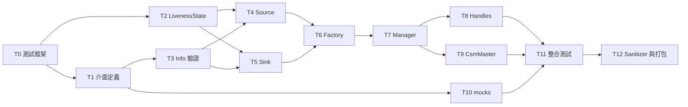

# R1 實作 TODO List(v0.6.0)

> 依據:`r1_design_draft.md` v1.2.2(正式版)。本文件將設計規劃書轉為可逐步執行、可逐項查核的實作清單。
> 文中「§x.y」一律指設計規劃書章節；「T*.n」指本文件的 TODO 項目。

## 0. 版本歷史

| 版本 | 說明 |
|---|---|
| v0.6.0 | **更新 Agent:`coco-codex`**。T10.1–T10.6 完成:`r1_test_mocks` 五個可腳本化 nodes、23 個 smoke gtests、嚴格 `<10%` rate 驗證、接受但不回覆、ACK 串接固定序列與四種 CsmNotify/亂序/舊世代注入；修正 callback lifetime 與跨執行緒計數 race。docker t10 PASS(27-test 彙總),3-agent 最終對抗式複核 0 must-fix。同步修正 §1.3 跨 package 執行位置、T10/T11 的 pre-T1 舊依賴/框架文字與附錄案例數 |
| v0.5.1 | **更新 Agent:`coco-codex`**。新增 §1.4 文件修訂紀錄規範:每次更動 `r1_todo.md` 或 `r1_design_draft.md`,除同步更新文件版本號與版本歷史外,必須於該筆歷史明確標示實際更新 Agent；並補列 Codex 的 agent 身分命名 |
| v0.5.0 | T8.1–T8.4、T9.1–T9.9 完成:`test_handles.cpp`(H1–H8,含 in-flight unregister 不復活與 debug/release 雙模式 H3)、`csm_master.h`(status 唯一訂閱者、identity 配對、CSM 級雙閾值 polling、level reconciliation 含 v1.2.1 absence clock、可靠通知 pump)、`csm_master_node` 執行檔與 CM1–CM13(mock CSM 裸 node)。docker t8 / t9 閘門 PASS。4-agent 對抗式查核 27 項發現、14 must-fix 全修:實作面 6(DISCONNECTED record 之 status 復活防護、same-instance rebuild 保留 seq fence、pending 健康事件按 owner 區分取代、notify RPC in-flight deadline 防 budget 餓死、DISCONNECTED peer 不永久關閉 ready gate、event FIFO);測試面 8(H8 補真 in-flight、CM1 interval/grace 驗證、CM2 訂閱斷言、CM6 stale-status fence、CM11 grace 起點、CM12 STALE settle、CM13 變體 C 無幻影 TIMEOUT)。獨立複核逐項確認 |
| v0.4.0 | T6.1–T6.4、T7.1–T7.14 完成:`control_signal_factory.h` + `src/r1/`(singleton 單一定義、joy/twist/string 註冊)、`source_registration.h`、`control_signal_manager.h`(五階段 tick、兩階段註冊、retry 狀態機、master 互動、通知處理、黑白名單)與 F1–F5、M1–M26 全數實作;`control_signal_handles.h` 為 Manager API 相依提前實作(H1–H8 測試屬 T8)。docker t6 / t7 閘門 PASS。**裁決 §12 #6(D7)提案**:`RetryPolicy::Recommended()` = {initialDelayMs 200, maxDelayMs 5000, jitterRatio 0.2, maxInitialAttempts 3, maxInFlight 4, quarantineThreshold 3},`autoRetryInitial` 旗標歸 RetryPolicy(全域);依 §2.4,typed RETRYABLE_CONFLICT 之 D3 retry 為強制、不受 D7 旗標與 initial cap 約束。5-agent 對抗式查核 43 項發現、25 must-fix 全修:實作面 10(D3/D7 retry 治理、stale completion 世代防護、quarantine 未生效、三處鎖巢套、peer-health 世代驗證、FIFO 冪等快取、sink 清理競態、abort 路徑補 rollback UNREGISTER、tick 執行緒 callback guard、**解構 fence**——manager 中途銷毀時 in-flight async callback UAF,以 alive sentinel + callback 計數 drain 修復);測試面 15(M3 依 §2.4 改判 D3 強制 retry、M4 改 16 執行緒跨 4 真實 targets、M5 補 policy-off 分支、M7 補 in-flight、M8 補 PAIR_MISSING、M14 補 in-callback 半、M16 補 sink rate、M17 補 per-CSM 單筆與 degraded 進出、M18 補覆蓋語意、M24 補 established intent 無上限、M25 碰撞決定化)。M4 併 TSan、M10 併 ASan 維持 T12 |
| v0.3.0 | T3.1–T3.3、T4.1–T4.7、T5.1–T5.6 完成:`control_signal_info.h`(六規則驗證)、`control_signal_source.h`(雙模式、ResponseHealth、RateRecorder、terminal seal 雙 cause)、`control_signal_sink.h`(read / callback / waitForMessage、seal 交錯)與 V1–V11、S1–S16、K1–K16 全數實作。docker t3 / t4 / t5 三閘門 PASS(45 tests)。5-agent 對抗式查核:實作 0 must-fix;測試強度 4 must-fix(S5 遮蔽斷言空洞、S16a 缺 send 交錯、S16c 誤測 preamble 而非 response 路徑、K13/K14 無喚醒延遲上界)已修並複測綠。記錄之實作裁量:`INVALID_CONTEXT` 宣告未回傳(context 偵測待 T7 tick 執行緒);`rateWindowNs` 暫為建構參數(ManagerOptions 屬 T7);`calcHz` 依實際覆蓋時距正規化(消除 partial-bucket 稀釋);S14/S16 之 outcome 以 friend 通道決定性注入;S11 收斂單調性與 K16 TSan 子句移交 T12 sanitizer 矩陣 |
| v0.2.3 | T2.1–T2.6 完成:`liveness_state.h`(單寫者模型、activity-generation terminal seal、純計算 `calcState`)與 L1–L18 全數實作;docker t2 PASS、host TSan(L14 多執行緒)無 race、4-agent 對抗式語意查核 0 must-fix。閾值依 §4.3 為 `calcState` 逐呼叫參數(非建構參數,todo 原文以 §4.3 為準)。T0.5 勾選:framework PR #1 合併後 fresh clone workspace 實測 t0 PASS |
| v0.2.2 | Migrate 分支政策:`rv2_control_signal_transport` 以 `r1` branch 為 R1 新版主 branch(自 rv2 `master` 8bc3662 分出,master 凍結),階段 PR base 改為 `r1`;transport PR #1 與 framework PR 依此建立 |
| v0.2.1 | 新增 §1.4 Git 版控規範:agent 身分命名(`coco-claude` 等)、每階段獨立 branch(`<身分>/<項目>`)、完成後 push + PR + 回報;`r1_test_framework` remote 建立,T0.5 解除阻塞 |
| v0.2.0 | T1.1–T1.6 完成(docker t1 build 通過、`ros2 interface show` 10/10 解析、欄位↔條文逐欄查核通過)。**裁決 §12 #1 結案:新開 `r1_interfaces` package**——rosidl 型別名僅取檔案 basename(子目錄不入 namespace),`ControlSignalInfo`、`ControlSignalInfoReq`、`ControlSignalJoy`、`ControlSignalTwist` 與 `rv2_interfaces` legacy 型別同名衝突,無法照 §2.1 原文放置。框架佈局變更:`r1_test_framework` 自 package 內搬移至 workspace `src/r1_test_framework/`(獨立 repo 與各 package 平行,取代 §11.5.1 巢狀 submodule 模型),package 根目錄 symlink 改為相對路徑 `../r1_test_framework/*.sh`,腳本 `PKG_DIR` 解析順序改為 env → symlink 位置 → CWD;`todo_check.sh t1` 改查 `r1_interfaces`。t0 基線修復:legacy `csm_test_utils.h` `makeInfo()` 補上現行驗證必填之 `controller_name` / `priority` / `controller_priority_type`(t0 重驗 23 gtests 全綠) |
| v0.1.1 | T0.1–T0.4 查核完成勾選。t0 baseline 於 docker 實測通過(28 gtests 全綠,container 自動卸載,host 無殘留)；框架修正:container 內以空 tmpfs 遮蔽 `test_env/`(避免 ament linters 掃到產物之 418 筆誤報)、t0 篩選至既有 gtest 迴歸(legacy lint 一致性不在 R1 範圍;jazzy uncrustify 將 `.h` 以 C 解析致 `constexpr` 報錯,屬既有狀態) |
| v0.1.0 | 初版:大項 T0–T12、依賴序、逐小項查核條件、逐大項語意查核與 docker 實測指令；隨附 `r1_test_framework` 腳本組(test_build / test_deps / test_run / test_packages / test_clean / todo_check)與 package 根目錄接線(symlink、`test_depends.repos`、`.gitignore` 排除 `test_env/`) |

## 1. 使用方式與共通規範

### 1.1 清單結構

- **大項(T0–T12)**:一個可獨立驗收的里程碑,依 §2.1 檔案布局與編譯依賴排序。每個大項最後有「驗證」小節,分為兩部分:
  - **語意查核**:人工(或 code review)對照設計規劃書,確認測試案例所斷言的行為與 § 條文一致。這一步驗證「測試寫對了」,防止測試通過但語意偏離設計。
  - **實際測試**:在 docker 內執行該大項的測試集,以結束碼判定。這一步驗證「程式寫對了」。
- **小項(T*.n)**:一個可在單次工作階段內完成的實作單位。每個小項附**查核**條件:客觀、可觀察的完成判準。勾選 `[x]` 前必須滿足查核條件。
- 測試案例 ID(V/L/S/K/F/M/CM/H/I)沿用設計規劃書各章測試表,為**最低集合**；§11.3 另要求每個 class 的每個 function 皆有對應 unit test。

### 1.2 Docker 測試規範(host 零污染)

全部查核與測試一律在 docker container 內執行(§11.3),規則如下:

| 規則 | 內容 |
|---|---|
| Host 隔離 | 依賴安裝(apt / rosdep)、colcon build、測試執行全部發生在 container 內；host 僅存放原始碼與 `test_env/<distro>/` 產物目錄,不安裝任何測試依賴 |
| Image 共用 | 同一 distro 的所有項目共用**同一個官方 base image**(jazzy 為 `ros:jazzy-ros-base-noble`,§11.5.2),不建自訂 image；可以 `R1_TEST_BASE_IMAGE` 覆蓋 |
| Container 命名 | TODO 查核為 `r1_todo_<item>_<distro>`(例 `r1_todo_t2_jazzy`),標準流程為 `r1_test_<package>_<distro>`,便於識別與清理 |
| 測後卸載 | `todo_check.sh` 於查核結束(無論成敗)自動 `docker rm -f` 該 container；`-k` 可保留供除錯 |
| 產物 | 僅寫入 package 下 `test_env/<distro>/`(已列 `.gitignore`)；因 container 以 root 執行,清除產物用 `./test_clean.sh --purge-env`(經 docker 處理所有權),不需在 host 動用 sudo |
| 磁碟回收 | 需要釋放空間時 `./test_clean.sh --rmi` 移除 base image；下次查核會重新下載 |

### 1.3 查核執行指令

腳本位於各 package 根目錄(symlink 至 workspace sibling `r1_test_framework/`)；必須從
該 item 的目標 package 執行(附錄 B),例如 T0–T9 從 transport package、T10 從
`r1_test_mocks`、T11 從 `r1_integration_tests` 執行:

```bash
cd ~/Workspace/ros2_ws/src/<目標-package>
./todo_check.sh <item>          # 一鍵:建 container → 裝依賴 → build + test → 卸載
./todo_check.sh <item> -k       # 保留 container 供除錯
./todo_check.sh <item> -d humble  # 指定其他 distro
```

分步執行(等同 CI 腳本鏈,§11.3):`./test_build.sh` → `./test_deps.sh` → `./test_run.sh [-f <ctest 過濾>]` → `./test_clean.sh`。

`<item>` 對照表見附錄 B。

### 1.4 Git 版控規範(v0.2.1;v0.2.2 增列 migrate 分支政策;v0.5.1 增列文件修訂署名)

適用於本案全部 repos(`rv2_control_signal_transport`、`r1_test_framework`、`r1_interfaces`,以及日後的 `r1_test_mocks`、`r1_integration_tests`):

| 規則 | 內容 |
|---|---|
| Commit 身分 | AI agent 產出之 commit 以 repo-local `git config user.name` 標示身分,命名 `coco-<agent>`:Codex 為 `coco-codex`、Claude 為 `coco-claude`、ChatGPT 為 `coco-gpt`,依此類推 |
| 文件修訂紀錄 | 每次更動 `r1_todo.md` 或 `r1_design_draft.md` 時,必須同步更新該文件的版本號、於 §0「版本歷史」新增一筆紀錄,並在該筆說明或摘要開頭以 `更新 Agent:coco-<agent>` 明確標示實際更新者(例如 `coco-codex`、`coco-claude`)；不得只修改內文,也不得省略版本號、版本歷史或更新 Agent 中的任一項 |
| 分支模型 | 每個階段(一個或連續數個 TODO 大項)之新增、修改、刪除一律開新 branch,不直接 commit 至主 branch。branch 命名 `<身分>/<項目>`,如 `coco-claude/T0-T1`、`coco-claude/T2` |
| **Migrate 分支政策(v0.2.2)** | 既有 rv2 packages 處於 migrate 階段:R1 新版程式碼以 **`r1` branch 為新版主 branch**,rv2 既有版本(`master`)凍結不動。`rv2_control_signal_transport` 之階段 PR 一律以 `r1` 為 base;純 R1 新 repos(`r1_test_framework`、`r1_interfaces` 等)無 rv2 包袱,主 branch 即 `master` |
| 完成流程 | 階段完成(該大項查核與實測通過)後:push branch → 對主 branch 提出 PR → 回報使用者。PR 合併由使用者裁決 |
| Remote | `r1_test_framework`(private):`git@github.com:cocobird231/r1_test_framework.git`；`r1_test_mocks`:`git@github.com:cocobird231/r1_test_mocks.git`。`r1_interfaces` remote 待建立;建立前 branch 僅存本地 |

### 1.5 前置裁決(開工前決定)

| 裁決點 | 影響大項 | §12 編號 | 暫定預設 |
|---|---|---|---|
| msg/srv 放置於 `rv2_interfaces/msg/r1/` 或新開 `r1_interfaces` | T1 | #1 | **已裁決(v0.2.0):新開 `r1_interfaces`**。rosidl 型別名僅取 basename,四個型別與 legacy 衝突,暫置方案不可行 |
| retry 參數數值與 policy(initial/max delay、initial cap、`auto_retry` 歸屬) | T7.7 | #6 | 實作時提案預設值,寫入 `RetryPolicy` 預設建構並回饋規劃書 |
| `registerSource` async 版本 | T7.4 | #3 | 首版僅同步版,介面預留擴充 |
| 使用者層 forced disconnect API | T8 | #5 | 首版不開放,內部保留 forced 路徑 |

---

## 2. 里程碑總覽與依賴序



| 大項 | 內容 | 產出位置 | 測試案例 |
|---|---|---|---|
| T0 | 測試框架與 docker 環境 | `r1_test_framework/` + package 根目錄 | —(框架自身查核) |
| T1 | msg/srv 介面定義 | `r1_interfaces/msg/`、`srv/`(§12 #1 裁決) | —(build + 欄位對照) |
| T2 | `r1::LivenessState` | `include/.../r1/liveness_state.h` | L1–L18 |
| T3 | Info 與驗證 | `include/.../r1/control_signal_info.h` | V1–V11 |
| T4 | `r1::ControlSignalSource` | `include/.../r1/control_signal_source.h` | S1–S16 |
| T5 | `r1::ControlSignalSink` | `include/.../r1/control_signal_sink.h` | K1–K16 |
| T6 | Factory 與型別註冊 | `include/.../r1/control_signal_factory.h` + `src/r1/` | F1–F5 |
| T7 | `r1::ControlSignalManager` | `include/.../r1/control_signal_manager.h`、`source_registration.h` | M1–M26 |
| T8 | Handles | `include/.../r1/control_signal_handles.h` | H1–H8 |
| T9 | `r1::CsmMaster` + node | `include/.../r1/csm_master.h`、`src/r1/csm_master.cpp` | CM1–CM13 |
| T10 | `r1_test_mocks` package | `ros2_ws/src/r1_test_mocks/` | —(mock 行為 smoke) |
| T11 | `r1_integration_tests` package | `ros2_ws/src/r1_integration_tests/` | I1–I18 |
| T12 | Sanitizer 矩陣、迴歸、打包 | —(建置組態與 `.deb`) | §11.4 矩陣 |

---

## T0 測試框架與 docker 環境(§11.5)

**目標**:建立全案共用的 docker 化測試流程,後續所有大項的「實際測試」都經由本框架執行。
**依賴**:無(最先執行)。

- [x] **T0.1** `r1_test_framework/` 腳本組:`test_build.sh`、`test_deps.sh`、`test_run.sh`、`test_packages.sh`(§11.5.3 四支標準腳本)加上 `test_clean.sh`(卸載)與 `todo_check.sh`(TODO 查核執行器),以獨立 git repo 版控。
  查核:`bash -n` 全數通過；每支腳本有用法說明；`git log` 存在初始 commit。
- [x] **T0.2** package 根目錄接線:六支 symlink、`test_depends.repos`(宣告 `rv2_interfaces`)、`.gitignore` 排除 `test_env/`。
  查核:`ls -l test_*.sh` symlink 有效；`git status` 不出現 `test_env/`。(v0.2.0 重接:框架搬至 `src/r1_test_framework/` 後 symlink 改為 `../r1_test_framework/*.sh`;repos 增列 `r1_interfaces`)
- [x] **T0.3** Container 生命週期驗證:base image 下載、container 建立、掛載(原始碼唯讀、`test_env` 一對一)、卸載。
  查核:`./test_build.sh` 後 `docker ps` 可見 container；container 內 `ls /root/ros2_ws/src/` 見本 package 與 `rv2_interfaces`；`./test_clean.sh` 後 `docker ps -a` 無殘留；host 上除 `test_env/` 外無任何新檔案。
- [x] **T0.4** Baseline 全鏈:以現有 rv2 package 走完 build → deps → run,證明框架可獨立完成一次完整測試。
  查核:`./todo_check.sh t0` 結束碼 0,輸出含 `colcon test` 結果與 `PASS: t0`。
- [x] **T0.5** 框架抽離:`r1_test_framework` 已搬移至 workspace `src/r1_test_framework/` 為獨立平行 repo(v0.2.0,取代 §11.5.1 巢狀 submodule 模型;各 package 以相對 symlink 引用)。remote 已建立並推送,PR #1 已合併至 master(v0.2.3)。
  查核:remote 存在且已 push ✅;fresh clone workspace(framework@master + transport@r1 + 本地 interfaces packages)執行 `./todo_check.sh t0` PASS(23 gtests 全綠)✅。

**驗證**
- 語意查核:逐條對照 §11.5.3 腳本職責表(distro 解析、container 重建、`~/ros2_ws` 結構、唯讀掛載、rosdep `--ignore-src`、結束碼語意、`.deb` 命名)與 §11.5.2 環境策略表；確認 `test_depends.repos` 為宣告式輸入而非流程客製(§11.5.4)。
- 實際測試:`./todo_check.sh t0`(container:`r1_todo_t0_jazzy`)。

---

## T1 介面定義(§2.1、§2.5.1、§2.5.2、§3.1)

**目標**:建立全部 msg/srv 介面,供後續各章編譯。
**依賴**:T0;前置裁決 §12 #1——**已裁決(v0.2.0):新開獨立 `r1_interfaces` package**(`ros2_ws/src/r1_interfaces/`)。rosidl 型別名僅取檔案 basename(子目錄不入 namespace),`ControlSignalInfo` / `ControlSignalInfoReq` / `ControlSignalJoy` / `ControlSignalTwist` 與 `rv2_interfaces` legacy 型別同名衝突,§2.1「暫置 `rv2_interfaces/msg/r1/`」原文不可行;獨立 package 亦免除日後 migrate 搬移。

- [x] **T1.1** `msg/ControlSignalInfo.msg`:8 欄位依 §3.1。
  查核:欄位名稱、型別、順序與 §3.1 表逐欄一致;`ros2 interface show` 輸出正確。✅ 逐欄查核通過;另含 MODE_*(§3.1 要求)與 TYPE_* 常數(加值,§7 型別鍵)。
- [x] **T1.2** `msg/EntryStatus.msg` 與 `msg/ManagerStatus.msg`:依 §2.5.1(EntryStatus 含 manager identity 欄位;ManagerStatus 含 instance / sequence 與完整 entry snapshot)。
  查核:欄位與 §2.5.1 定義逐欄一致;master 對帳所需之 identity(§9.3)欄位齊備。✅ 含 v1.2.1 之 `source_csm_instance_id`;phase / state 常數依 §2.5.1 編號。
- [x] **T1.3** `srv/ControlSignalManage.srv`(op = REGISTER | UNREGISTER)與 `srv/ControlSignalInfoReq.srv`:依 §2.5.2,含 identity 三元組與 typed error(RETRYABLE_CONFLICT、STALE 等)。
  查核:欄位與 §2.5.2 一致;回覆碼列舉涵蓋 §8.3 引用的全部結果類別。✅ 七類回覆碼齊備。
- [x] **T1.4** `srv/CsmRegister.srv`、`srv/CsmHeartbeat.srv`、`srv/CsmNotify.srv`:依 §2.5.2 與 §9.2(CsmRegister 攜帶 CSM 雙閾值、status interval、registration grace;CsmHeartbeat request 攜帶 `csm_name`;CsmNotify 含 kind、event ID、identity、ACK 語意)。
  查核:欄位與 §2.5.2 / §9.2 一致;四種 kind 與 ALREADY_APPLIED / STALE 回覆可表達。✅ kind 編號依 §2.5.2(0–3);heartbeat 非匿名 Trigger。
- [x] **T1.5** 資料通道 srv:`srv/ControlSignalJoy.srv`、`srv/ControlSignalTwist.srv`;String 型別之 service 模式配套依 §7 型別註冊需求確認,若需要則補齊並回饋 §2.1 清單。
  查核:與 §7 註冊型別集合(Joy / Twist / String)對齊,service 模式可用型別無缺漏。✅ §7.2:string 為 topic-only(SrvT = void),無需 ControlSignalString.srv;回覆常數名取 §6.3 字面 `SRV_RES_*`。
- [x] **T1.6** `r1_interfaces` 之 rosidl 產生設定(CMakeLists / package.xml)納入上述檔案。
  查核:`r1_interfaces` 於 docker 內 build 通過。✅ `./todo_check.sh t1` PASS;10/10 介面 `ros2 interface show` 解析正確。

**驗證**
- 語意查核:製作「msg/srv 欄位 ↔ § 條文」對照表逐欄打勾;重點確認三處易錯點——CsmHeartbeat 非匿名 Trigger(v1.0.0 修正)、ManagerStatus 含 PENDING 交易(§2.4)、EntryStatus 可在單側 snapshot 定位預期配對(CM10)。✅ 逐檔對抗式查核完成(0 must-fix),三處易錯點逐一確認。
- 實際測試:`./todo_check.sh t1`(container:`r1_todo_t1_jazzy`;build 驗證,無 gtest)。✅ PASS。

---

## T2 `r1::LivenessState`(§4)

**目標**:純邏輯活性核心:記錄、純計算、被動狀態寫入、terminal seal。無 ROS 依賴,可完整單元測試。
**依賴**:T0(不依賴 T1,純 C++)。

- [x] **T2.1** `liveness_state.h` 骨架:4 態 enum(INITIAL / ACTIVE / TIMEOUT / DISCONNECTED)、雙閾值建構參數(`timeout_ns`、`disconnect_timeout_ns`,0 = 停用,§2.3.1 變體 A–D)。
  查核:單獨 TU 編譯通過且不含任何 rclcpp include；變體 A–D 之閾值組合皆可建構。✅ host `g++ -std=c++17` 單獨 TU 編譯通過,`grep rclcpp` = 0;L11–L13 覆蓋四變體(閾值依 §4.3 為 `calcState` 逐呼叫參數,建構子僅取 `nowNs`)。
- [x] **T2.2** `recordActivity()`:hot path 原子記錄——timestamp 單調不倒退、activity generation 遞增、seal 後拒絕並回傳 false(§4.3、§4.4)。
  查核:對照 §4.3 簽名與回傳型別；L14 之多 writer 亂序語意可滿足。✅ CAS-max timestamp 先於 generation 以 release 發布;L14 以 8 執行緒 × 2000 筆亂序驗證。
- [x] **T2.3** `calcState()` 純計算:依記錄與雙閾值回傳應處狀態,過程不改動任何欄位；嚴格大於判定；「從未活動」規則(停留 INITIAL,僅越過 disconnect 閾值才 DISCONNECTED,L6/L7)；單次跨越兩閾值直接 DISCONNECTED(L5)。
  查核:連續呼叫結果一致(純函數性,L10)；四變體判定表與 §2.3.1 圖一致。✅ const 純函數,現行狀態不參與計算;語意查核逐 cell 枚舉通過。
- [x] **T2.4** `applyState()`:唯一狀態寫入路徑(CSM tick 專用),回傳舊狀態(§4.2 單寫者模型)。
  查核:state 欄位無 CAS(D8:結構上不需要)；與 §4.3 簽名一致。✅ 無條件 exchange 回舊值,無 CAS(L9)。
- [x] **T2.5** Terminal seal:activity-generation CAS——計算期間有新活動則 seal 失敗；seal 勝出後 `recordActivity()` 拒絕(§4.2、L15–L17)。
  查核:seal 只保護活動接受與 terminal linearization,不寫 state(§4 開頭定義)。✅ `trySealActivity(g)` 單發 CAS、失敗零改動(L16);`sealActivity()` 冪等(L17)。
- [x] **T2.6** `test/r1/test_liveness_state.cpp`:L1–L18 全數實作,含假時鐘注入(以參數傳入 now,不依賴系統時鐘)。
  查核:18 案例與 §4.5 表逐列對應,無合併、無跳過。✅ 18/18 PASS;純假時鐘,無系統時鐘、無 rclcpp。

**驗證**
- 語意查核:L 表逐列檢查 assert 內容——特別是 L8(邊界不觸發)、L14(generation = 成功記錄數)、L16(seal 失敗後下一 tick 回 ACTIVE)、L18(INITIAL 直接 apply TIMEOUT 之例外)是否忠實轉譯 §4.4/§4.5 敘述。✅ 4-agent 對抗式查核(介面、memory order、判定表、L 表逐列)0 must-fix;5 nits(註解措辭)已修。
- 實際測試:`./todo_check.sh t2`(container:`r1_todo_t2_jazzy`)；L14 另納入 T12 TSan job。✅ PASS(host TSan 已先行全綠)。

---

## T3 Info 與驗證(§3)

**目標**:`r1::ControlSignalInfo` 別名與 `validateControlSignalInfo()` 六條規則。
**依賴**:T1(msg 型別)。

- [x] **T3.1** `control_signal_info.h`:Info 別名、mode / type 字串常數、驗證結果型別(錯誤訊息含欄位名)。
  查核:除 msg 標頭外無 ROS 依賴；錯誤訊息可定位到具體欄位。✅ 別名指向 `r1_interfaces`(§12 #1);錯誤訊息逐欄具名;除 msg 標頭外零 ROS 依賴。
- [x] **T3.2** `validateControlSignalInfo()`:六條規則依 §3.2,含 priority 0–100 之外拒絕、`timeout_ns = 0` 於 service 模式 invalid、`disconnect_timeout_ns` 須嚴格大於 `timeout_ns` 或為 0、規則 6(`target_manager_name` 於 registerSource 路徑必填)。
  查核:規則逐條與 §3.2 對照；`ManagerOptions` 之 CSM 閾值不混入本驗證(§3.2 末段)。✅ 六規則逐條實作;CSM 閾值驗證未混入。
- [x] **T3.3** `test/r1/test_info_validation.cpp`:V1–V11 全數實作(V5 含 4 子案例)。
  查核:11 案例與 §3.3 表逐列對應。✅ 11 案例(V5 含 4 子案例);docker t3 PASS。

**驗證**
- 語意查核:V 表逐列對照 §3.2 規則來源；確認 V7 的雙面性(topic valid、service invalid)與 V10(變體 C 合法)未被寫成單面 assert。✅ 對抗式查核通過;V7 雙面、V10 變體 C 皆為雙向斷言。
- 實際測試:`./todo_check.sh t3`(container:`r1_todo_t3_jazzy`)。✅ PASS。

---

## T4 `r1::ControlSignalSource`(§5)

**目標**:Source 模板:topic publisher 與 service client 雙模式、send 即活動、ResponseHealth、rate 記錄。
**依賴**:T2、T3。

- [x] **T4.1** `BaseControlSignalSource` 介面:`msgType()`、`sendErased()`、`getState()` / `getStatus()`、`sendRateHz()`、per-state callback slot 註冊(§5.2)。
  查核:介面與 §5.2 宣告一致；`getStatus()` 回 {state, rate} 整合查詢。✅ Base 依 §5.2 程式塊;`getStatus()` 回 {state, rate}。
- [x] **T4.2** `ControlSignalSource<msgT, srvT>` topic 模式:publisher 建立、`send()` 即記錄活動(v1.1.0 自驅語意)。
  查核:send 路徑僅記錄,不寫 state(D8)；shutdown 後回 `NO_TRANSPORT`。✅ send 即記錄,不寫 state;shutdown 後 `NO_TRANSPORT`。
- [x] **T4.3** Service 模式 `send()`:單調 `requestSequence`、`service_is_ready()` 檢查、`async_send_request` + `timeout_ns` 等待(無隱藏 fallback)、逾時呼叫 `remove_pending_request()`、ResponseHealth failure streak / `failureEpoch` 轉換語意、亂序 outcome 只採較新者(§5.3)。
  查核:§5.3 send(service) 段逐句對照——response 到達(含 REJECTED)先清 streak 再 `recordActivity()`；seal 勝出時回 `DISCONNECTED`；`failureEpoch` 僅於 healthy↔failure 轉換遞增。✅ §5.3 逐句:單調 seq、無隱藏 fallback、`remove_pending_request`、response 先清 streak 再 recordActivity、seal 勝出回 DISCONNECTED、epoch 僅轉換時遞增、亂序防護(S14)。`INVALID_CONTEXT` 宣告保留、偵測待 T7。
- [x] **T4.4** `RateRecorder`:N-bucket 環形 rolling window,窗長由 `ManagerOptions.rateWindowNs` 配置(§5.2)。
  查核:視窗行為與 S10/S13 預期一致(停止 1 窗後歸 0)。✅ 8-bucket 環形、單 atomic 打包 {bucketNum,count};calcHz 依實際覆蓋時距正規化;窗長建構參數(ManagerOptions 待 T7)。
- [x] **T4.5** Shutdown 與 RAII:冪等 shutdown、解構釋放 transport entities(§1.5)。
  查核:S6 語意；shutdown 後無殭屍活動(§0.1 定義)。✅ 冪等 shutdown、解構呼叫 shutdown(S6)。
- [x] **T4.6** 測試通道:`_calcStatus()` / `_applyStatus()` 經 `ManagerTestAccess` friend 暴露(§5.2、§8.2)。
  查核:測試不必啟動真 Manager tick 即可驅動狀態轉移。✅ `ManagerTestAccess` 於 test/r1/r1_test_utils.h,僅編入測試 target。
- [x] **T4.7** `test/r1/test_transport.cpp` Source 部分:S1–S16(gtest suite 以 `SourceTest` 命名,與 Sink 區分)。
  查核:16 案例與 §5.4 表逐列對應；S5 涵蓋 NO_TRANSPORT 與 TIMEOUT 兩分支。✅ 16 案例 suite `SourceTest`;S5 三分支(NO_TRANSPORT / TIMEOUT / 遮蔽)全覆蓋。

**驗證**
- 語意查核:S 表逐列對照 §5.3/§5.4——重點 S5(failure streak 不被高頻 send 掩蓋)、S14(epoch 亂序防護)、S15/S16(seal 與活動、與 response-failure 的兩類競合)是否逐字忠實。✅ 5-agent 查核;S5 / S16 測試強度 must-fix 已修(遮蔽斷言以假時鐘置於 cadence-ACTIVE 窗、S16a 補 send 交錯、S16c 改測 in-flight response 路徑)。
- 實際測試:`./todo_check.sh t4`(container:`r1_todo_t4_jazzy`)；S11 併入 T12 TSan。✅ PASS;S11 併入 T12 TSan。

---

## T5 `r1::ControlSignalSink`(§6)

**目標**:Sink 模板:subscription 與 service server 雙模式、收訊記錄、read / callback / waitForMessage。
**依賴**:T2、T3。

- [x] **T5.1** `BaseControlSignalSink` + `ControlSignalSink<msgT, srvT>`:subscription / service server 建立、收訊即記錄(§6.2)。
  查核:介面與 §6.2 宣告一致；service 模式 round-trip 回 SUCCESS(K7)。✅ 雙模式;service round-trip 回 SRV_RES_SUCCESS(K7)。
- [x] **T5.2** `read()` 與訊息 callback:read 之狀態粒度語意(tick 前 read false,K2)、callback replace 語意、無鎖呼叫 callback(K6 之死鎖回歸)。
  查核:§6.3 行為細節逐句對照。✅ read 之 tick 粒度(K2);callback replace 語意、無鎖呼叫(K6)。
- [x] **T5.3** `waitForMessage()`:僅等「呼叫後」新訊息、逾時版 ≈ timeoutNs 返回 false、shutdown 中斷等待且無 UAF(K13–K15)。
  查核:喚醒語意與 §6.3 一致；並發多等待者全部喚醒。✅ 序號 pred、shutdown 持 msgMtx_ 置旗(v1.2.1)、解構 drain waiters_(K15 實測 destroy-while-waiting)。
- [x] **T5.4** 收訊 rate 記錄:rolling window 同 T4.4。
  查核:K11 預期(∈ [18, 22] @ 20 Hz)。✅ 同 T4.4;K11 ∈ [18,22]。
- [x] **T5.5** Terminal seal 與收訊交錯:seal 勝出後不存訊息、不喚醒、不呼叫 callback；活動先勝出則取消本輪 terminal(K8/K16)。
  查核:與 §4.2 seal 語意及 §8.3 同 tick 註銷順序一致。✅ K8 / K16 兩交錯皆斷言(不存訊息、不喚醒、不呼叫 callback)。
- [x] **T5.6** `test/r1/test_transport.cpp` Sink 部分:K1–K16(suite `SinkTest`)。
  查核:16 案例與 §6.4 表逐列對應。✅ 16 案例 suite `SinkTest`;docker t5 PASS。

**驗證**
- 語意查核:K 表逐列對照——重點 K2(粒度語意非 bug 而是設計)、K8(seal 成功才 apply + 註銷)、K14(舊訊息不觸發)是否忠實。✅ K2 粒度、K8 seal 順序、K14 舊訊息不觸發皆忠實;K13/K14 補喚醒延遲上界。
- 實際測試:`./todo_check.sh t5`(container:`r1_todo_t5_jazzy`)；K10 併入 T12 ASan、K12/K16 併入 TSan。✅ PASS;K10 併入 T12 ASan、K12/K16 併入 TSan。

---

## T6 Factory 與型別註冊(§7)

**目標**:singleton registry、`R1_REGISTER_CONTROL_SIGNAL`、Joy / Twist / String 具體型別。
**依賴**:T4、T5(Create 需 Source / Sink 模板)。

- [x] **T6.1** `control_signal_factory.h`:registry、`Register()`(重複註冊回 false)、`CreateSource()` / `CreateSink()`(未註冊型別回 nullptr + errOut 字串,不拋例外)(§7.2)。
  查核:與 §7.2 介面一致；errOut 參數存在(v1.0.0 補完項)。✅ 與 §7.2 一致;errOut 存在;加值 `serviceCapable()` 與 rateWindowNs 參數(ManagerOptions 相依)。
- [x] **T6.2** `R1_REGISTER_CONTROL_SIGNAL` macro 與 typeKey 反查(joy / twist / string)。
  查核:F3 之反查語意；macro 於 header 使用不產生 ODR 問題。✅ macro 以匿名 namespace TU-local static 註冊,header 使用無 ODR 問題;typeKey 反查(F3)。
- [x] **T6.3** `src/r1/control_signal_factory.cpp` + `control_signal_types.cpp`:singleton 單一定義於 shared library、三型別註冊(topic 與 service 模式配套)。
  查核:F5(跨 TU 可見)之結構前提成立；service 模式配套 srv 與 T1.5 對齊。✅ singleton 定義於 shared library `r1_control_signal_transport`;三型別註冊,string topic-only(SrvT=void)。
- [x] **T6.4** `test/r1/test_factory.cpp`:F1–F5。
  查核:5 案例與 §7.3 表逐列對應。✅ 5 案例;F2 同斷 nullptr 與不拋例外。

**驗證**
- 語意查核:F 表對照 §7.3；確認 F2 同時斷言「回 nullptr」與「不拋例外」兩件事。✅ 對抗式查核通過。
- 實際測試:`./todo_check.sh t6`(container:`r1_todo_t6_jazzy`)。✅ PASS。

---

## T7 `r1::ControlSignalManager`(§8)

**目標**:CSM 本體。全案最大的大項,小項依 §8.2 類別架構與 §8.3 行為細節拆分,建議按序實作並隨做隨測。
**依賴**:T1–T6；T7.7 需前置裁決 §12 #6(retry 參數)。

- [x] **T7.1** `source_registration.h`:identity 三元組(`csm_instance_id`、`registration_id`、`attempt_generation`)、registration lifecycle(PENDING / REGISTERED / RETRY_WAIT / REMOVING / ABSENT,§1.3.1)、`SourceRegistrationSlot`(stable slot、`desired` 旗標、slot mutex)。
  查核:namespace-scope 型別定義與 §8.2 一致；lifecycle 與 §1.3.1 三層狀態模型第二層對應。✅ namespace-scope 定義(§8.2/v1.2.1 循環相依考量);lifecycle 對應 §1.3.1 第二層(ABSENT = map 移除)。
- [x] **T7.2** `ManagerOptions` + `RetryPolicy`:含 `statusIntervalMs`、`rateWindowNs`、`maxRegisterTimeoutMs`、CSM 級雙閾值、master 名稱；自身驗證規則(§8.2,不混入 Info 六規則)。
  查核:欄位與 §8.2 宣告一致；非法組態於建構期拒絕。✅ 欄位與 §8.2 一致;`validate()` 建構期拒絕非法組態(含 v1.2.1 heartbeat deadline 規則);D7 提案入 `Recommended()`。
- [x] **T7.3** 本地註冊表:雙鍵(controller_name + channel_name)查重、一律 `emplace` 禁用 `operator[]`(§1.3 對策)、PENDING 佔位原子插入(§2.4)。
  查核:M2 語意(本地重複不發遠端呼叫)；TOCTOU 結構性消除(§1.3 表第一列)。✅ 雙鍵查重、emplace、PENDING 原子佔位(M2/M4 16 執行緒實測)。
- [x] **T7.4** `registerSource()` 兩階段 + rollback + `unregisterSource()`:§8.3 registerSource 段逐句實作——PENDING 佔位、放鎖後同步 REGISTER、成功後 slot lock 下驗證 desired / phase / identity 才轉正、RETRYABLE 轉 RETRY_WAIT 回 `RETRY_SCHEDULED`、永久錯誤移除 slot；unregister 對三種狀態的語意(M7)。
  查核:`timeoutMs` 區間檢查與 registration grace 宣告公式(§8.3)；callback 內呼叫觸發 precondition error(M14)。✅ 兩階段 + slot lock 轉正 + rollback UNREGISTER(含 abort 路徑);D3 conflict 強制 RETRY_WAIT(§2.4);M14 precondition。
- [x] **T7.5** `_onManage()`(REGISTER / UNREGISTER):驗證 → 查重 + 冪等判定 → PENDING emplace → 放鎖建 Sink → unique lock 轉正；PENDING TTL 回收；stale / matching UNREGISTER 處理(§8.3)。
  查核:與正常完成路徑以同一把 unique lock 競爭(§8.3)；M23 stale 語意。✅ 流程逐句;PENDING TTL 與完成路徑同鎖競爭;stale → STALE、清理路徑重驗 identity。
- [x] **T7.6** Status tick 五階段(§8.3,D8 單寫者):snapshot / calculate(鎖外 `_calcStatus`)→ validate / commit non-terminal → terminal seal + 同 tick 註銷 → status 發布 + heartbeat → retry / maintenance。`tickRunning_` 重入防護。
  查核:五階段順序與 §8.3 條列一致；DISCONNECTED 在 seal 前不污染 table；所有 callback / shutdown / ROS 呼叫在 map lock 外；M19(單 tick 跨兩閾值)與 M9(同 tick 完成移除 + Handle 失效 + notification callback)語意成立。✅ 五階段依序;DISCONNECTED seal 前不入 table;callback/shutdown/ROS 呼叫皆鎖外;M19/M9 語意成立;`tickRunning_` 重入防護。
- [x] **T7.7** Retry 佇列:completion queue、bounded `maxInFlight`、exponential backoff + jitter、per-intent 去重、成功 response 只在 desired && identity 相符時替換 endpoint、已成功過的 intent 不設次數上限、`maxInitialAttempts` 僅限 optional initial retry(§8.3 第 5 階段、D2–D4/D7)。
  查核:M24 全部子句；延遲成功不復活已取消 intent(M7)。✅ completion queue、bounded maxInFlight、backoff+jitter、registrationId 去重、desired+identity 才替換、成功後無次數上限、initial cap 僅限 INITIAL_UNREACHABLE(cap 耗盡發 RETRY_FAILED 移除 slot,無殭屍);quarantine 於 enqueue 生效 + SUSPECTED_DATA_PATH_FAULT。
- [x] **T7.8** Master client:`CsmRegister`(宣告雙閾值 + grace)、`CsmHeartbeat` 單筆 in-flight、無回應進 degraded、回線後 UNKNOWN_CSM 觸發 re-register(§2.5、§9.2、M17)。
  查核:heartbeat 舊 completion 不清除新 attempt(M17)；degraded 期間 entity 狀態零影響(§12 結案紀錄)。✅ CsmRegister 攜雙閾值+grace;heartbeat 單筆 in-flight + deadline 釋放 + 世代防護;無回應僅 degraded;UNKNOWN_CSM → re-register(M17 實測含 degraded 進出)。
- [x] **T7.9** `get_notifications` server:四 kind 處理——STATE 僅事件、CSM_TIMEOUT / ACTIVE 只改 peerHealth、DISCONNECTED / PAIR_MISSING 對 matching identity 排一次 removal 由下一 tick 執行；重送回 ALREADY_APPLIED、舊世代回 STALE(§8.2 通知接收、M8)。
  查核:非 tick 來源的狀態變更一律先轉 table 註記(§2.6 單寫者)。✅ 四 kind 處理;peer-health 世代驗證、無匹配回 STALE;removal 一律 table 註記由 tick 執行;event FIFO 冪等快取。
- [x] **T7.10** `ManagerStatus` 發布與 `InfoReq`:完整 snapshot 含 PENDING / RETRY_WAIT phase、endpoint_present、identity、rate(取自 lastStatus table)；InfoReq 僅列已註冊 endpoints(M13/M16)。
  查核:snapshot 欄位足以支撐 master 對帳(§9.3 之資料來源)。✅ 完整 snapshot 含 PENDING/RETRY_WAIT、endpoint_present、identity、rate;InfoReq 僅列已註冊(M13/M16)。
- [x] **T7.11** Callbacks:`registerCallback`(template 與字串版、兩種註冊順序)、per-state callback(`registerSourceStateCallback` / `registerSinkStateCallback`,一律 tick 執行緒觸發)(M12/M18)。
  查核:覆蓋與 nullptr 清除語意；state callback 內 re-enter read API 不死鎖(M21)。✅ template/字串版、兩種順序、覆蓋與 nullptr(M12/M18);state callback 一律 tick 執行緒。
- [x] **T7.12** 黑白名單:雙向套用、enable / disable、空白名單 = 全擋(M11,承襲 rv2 案例組)。
  查核:register 與 _onManage 兩側都過濾(§8.3)。✅ 雙向套用、空白名單全擋(M11)。
- [x] **T7.13** 執行緒模型:tick 於 MutuallyExclusive `tickGroup_`；manage / info_req / get_notifications servers 與 master clients、retry response callback 於 Manager 自建 Reentrant group(§2.6)。
  查核:與使用者 node 預設 group 隔離；同步 registerSource 於 callback 內呼叫之防護(M14)。✅ tick 於 MutuallyExclusive、management 於 Reentrant;tick 執行緒亦設 callback guard(M14 in-callback);解構 fence 防 in-flight callback UAF。
- [x] **T7.14** `test/r1/test_manager.cpp` + `r1_test_utils.h`:M1–M26 全數實作(短週期參數壓縮時間,§8.4；mock master 以裸 service 實作)。
  查核:26 案例與 §8.4 表逐列對應；M4 以 16 執行緒實測。✅ 26 案例;mock master 裸 service;M4 16 執行緒跨 4 targets。

**驗證**
- 語意查核:M 表逐列對照 §8.3/§8.4,重點四處——M6(response 丟失之三層回收)、M8(四 kind 的「只做什麼、不做什麼」)、M20(D3 retry-until-success 含 disconnect=0 不承諾收斂)、M22(activity 與 seal 競合唯一結果)；另確認每個 public function 皆有測試覆蓋(§11.3 要求)。✅ 5-agent 查核 43 項發現、25 must-fix 全修並複核;M6 三層回收之整合部分留 I8。
- 實際測試:`./todo_check.sh t7`(container:`r1_todo_t7_jazzy`,涵蓋 test_manager 與 test_transport)；M4 併入 TSan、M10 併入 ASan。✅ PASS;M4 併 TSan、M10 併 ASan。

---

## T8 Handles(§10)

**目標**:`SourceHandle` / `SinkHandle`:使用者側穩定引用,slot weak 綁定。
**依賴**:T7。

- [x] **T8.1** `SourceHandle`:綁定 `SourceRegistrationSlot`、`valid()` / `ready()` / `state()`(optional)、`send()` 轉發、endpoint 缺席回 `RETRYING`(§10.2/§10.3)。
  查核:retry 期間 valid 恆真、ready 隨 endpoint 起伏(H7)；型別不符依 build 型態回錯誤碼或 assert(H3)。✅ weak slot 綁定、RETRYING 語意(H7);型別不符 debug assert / release NO_TRANSPORT(H3 雙模式)。
- [x] **T8.2** `SinkHandle`:`read()` / `state()` / `waitForMessage()` 轉發。
  查核:與 §10.2 介面一致。✅ read/state/waitForMessage 轉發(H2);erased wait 經 Base 虛擬。
- [x] **T8.3** 失效語意與拷貝:erase / unregister 後全操作失效、拷貝共享失效狀態、in-flight response 不復活已銷毀 slot(H4/H5/H8)。
  查核:§10.3 slot 生命週期逐句對照。✅ H4/H5/H8;in-flight response 不復活以延遲 service 實測。
- [x] **T8.4** `test/r1/test_handles.cpp`:H1–H8。
  查核:8 案例與 §10.4 表逐列對應。✅ 8 案例;H6 併 T12 ASan/TSan。

**驗證**
- 語意查核:H 表對照 §10.3/§10.4；重點 H7 的三段式(true→false→true)與「同一 Handle 換 endpoint 不換 Handle」承諾。✅ 對抗式查核;H7 三段式與「同 Handle 換 endpoint」逐項斷言。
- 實際測試:`./todo_check.sh t8`(container:`r1_todo_t8_jazzy`)；H6 併入 T12 ASan/TSan。✅ PASS;H6 併入 T12 ASan/TSan。

---

## T9 `r1::CsmMaster` 與 `csm_master_node`(§9)

**目標**:集中式通知架構:CSM 註冊 / heartbeat、status 訂閱、配對、雙閾值 polling、level reconciliation、可靠通知。
**依賴**:T1(srv)、T7(協定對手方；master 單元測試用 mock CSM 裸 node,可與 T7 平行開發)。

- [x] **T9.1** `csm_master.h` 骨架:`MasterOptions`、CSM record(instance、雙閾值、interval、grace)、retired instance set(§9.2)。
  查核:與 §9.2 宣告一致；record 欄位覆蓋 CM1 斷言。✅ MasterOptions、CsmRecord(instance、雙閾值、interval、grace)、retired set(CM1)。
- [x] **T9.2** `csm_register` / `csm_heartbeat` servers:instance 取代 → 舊 ID 進 retired set、retired 之 heartbeat / 遲到 register 回 STALE；黑白名單(CM1/CM2)。
  查核:同名新 instance 之 STALE_INSTANCE 全重建路徑(§9.3,v1.2.1 修正項)。✅ 取代 → retired、STALE 語意、黑白名單(CM1/CM2);same-instance DISCONNECTED re-register = 全量重建且保留 seq fence(v1.2.1)。
- [x] **T9.3** Status 訂閱管理:per-CSM 訂閱 `<name>/status`、instance / sequence 驗證、完整 snapshot 原子替換、omission 語意(seq N+1 缺項即移除)、重複 / 逆序 / 舊 instance 拒絕(CM10)。
  查核:§9.2 表 status subscriber 列逐句對照。✅ instance/seq 驗證、整份原子替換、omission、重複/逆序/舊 instance 拒絕(CM10);DISCONNECTED record 之 status 一律丟棄。
- [x] **T9.4** 配對與 STATE 通知:以 controller 配對 Source–Sink、變化偵測、one-shot(同狀態不重發,恢復後再發)、STATE best-effort(CM3/CM4)。
  查核:STATE 不改變 peer local state(§2.5)。✅ identity 配對、edge 偵測、one-shot、tombstone 合成(CM3/CM4/CM10)。
- [x] **T9.5** CSM 級雙閾值 polling:heartbeat 停止 > csm_timeout 發 peerHealth TIMEOUT、> csm_disconnect 發 lifecycle DISCONNECTED + tombstone、僅新 instance register 可恢復(D6,CM5/CM6)。
  查核:polling 於 master tick,判定與通知非阻塞(CM9)。✅ 獨立 HeartbeatTracker、嚴格大於、disconnect 優先(CM5/CM6/CM13);判定與通知非阻塞(CM9)。
- [x] **T9.6** Level reconciliation:ready snapshot gate、registration grace(PENDING 期間暫停 missing grace,CM11)、PAIR_MISSING 判定與重送至 ACK、缺席 CSM 之 per-name absence clock(v1.2.1,§9.3)。
  查核:§9.3 reconciliation 段逐句對照；master 重啟首輪不產生 STATE storm(CM7)。✅ ready gate、PENDING 抑制、per-name absence clock、DISCONNECTED peer 不關閉 gate、PAIR_MISSING level + delivered-awaiting-observation(CM7/CM8/CM11)。
- [x] **T9.7** 通知發送器:`get_notifications` client per CSM、STATE async best-effort、control event 帶 event ID 非阻塞重送至 ACK、duplicate 回 ALREADY_APPLIED / 舊世代回 STALE(CM9/CM12)。
  查核:重送不阻塞 master tick 與 heartbeat polling。✅ per-CSM notify client、STATE best-effort、control event 非阻塞重送至 ACK、per-owner 取代、in-flight deadline(CM9/CM12)。
- [x] **T9.8** `csm_master_node` 執行檔(`src/r1/csm_master.cpp`):參數載入 `MasterOptions`,host `CsmMaster`。
  查核:`ros2 run` 可啟動；參數與 §9.2 對齊。✅ csm_master_node 參數載入 MasterOptions,`ros2 run` 可啟動。
- [x] **T9.9** `test/r1/test_csm_master.cpp`:CM1–CM13,mock CSM 以裸 node 實作(status publisher + get_notifications server + heartbeat / register clients,§9.4)。
  查核:13 案例與 §9.4 表逐列對應,不依賴真 ControlSignalManager。✅ 13 案例,mock CSM 裸 node,不依賴真 Manager。

**驗證**
- 語意查核:CM 表逐列對照 §9.2/§9.3；重點 CM7(ready gate)、CM8(快速重啟 + 空 snapshot)、CM13(disconnect=0 不承諾收斂)三個曾在審核修正的行為。✅ 4-agent 查核 14 must-fix 全修並複核;CM7 ready gate、CM8 空 snapshot、CM13 不承諾收斂逐一確認。
- 實際測試:`./todo_check.sh t9`(container:`r1_todo_t9_jazzy`)。✅ PASS。

---

## T10 `r1_test_mocks` package(§11.1)

**目標**:整合測試所需的可腳本化故障注入 nodes。獨立 package,置於 workspace(`ros2_ws/src/r1_test_mocks/`)。
**依賴**:T1(介面)；與 T7–T9 平行開發可行。

- [x] **T10.1** Package 骨架:ament_cmake、`test_depends.repos` 宣告(`r1_interfaces`)、以相對 symlink 使用 workspace sibling `r1_test_framework`(依 v0.2.0 layout 裁決,首次複用驗證)。
  查核:`./todo_check.sh t10` 可 build；框架未經客製即可運作。✅ sibling framework 六支 symlink、local dependency 掛載與五個 executables 均於原框架流程 build 成功。
- [x] **T10.2** `MockManagerNode`:`control_signal_manage` service 之可腳本化行為——接受、拒絕(指定 reason)、延遲 N ms、**不回覆**、回覆後立刻斷線。
  查核:五種行為逐一可由參數 / service 切換觸發(smoke test)。✅ 五種行為全覆蓋；reject code/reason 與不落 state、delay 先套用、service 真斷線/恢復均有斷言；no-reply REGISTER 先接受後抑制 response。
- [x] **T10.3** `MockSourceNode` / `MockSinkNode`:裸 rclcpp pub / sub / client / server,可設定頻率、突發停止、亂序型別。
  查核:三種擾動逐一可觸發；頻率誤差 < 10%。✅ Joy/Twist/String topic、Joy/Twist service、pause/resume、錯型別隔離均覆蓋；以三秒實際 elapsed 嚴格斷言相對誤差 `< 10%`。
- [x] **T10.4** `MockMasterNode`:register 拒絕、heartbeat 不回應、注入四種 CsmNotify kind、重送 / 亂序 / 舊 generation、攔截 ACK。
  查核:腳本項逐一可觸發；可回放固定序列供 I12/I16 使用。✅ heartbeat future 真 timeout；四種 kind、stable event resend、非單調 generation、舊 instance 與飽和舊世代均覆蓋；具名 immutable sequence 以前一筆 ACK 串接下一筆,並記錄 ACK code。
- [x] **T10.5** `StatusFaultNode`:以代理方式暫停 / 恢復 / 降頻某 CSM 的 status 發布。
  查核:三種操作逐一可觸發且可觀察(`ros2 topic hz`)。✅ pass/pause/resume/throttle 逐項驗證,forwarded/dropped 計數可觀察且跨執行緒安全。
- [x] **T10.6** 各 mock 之 smoke tests(gtest 或 launch_testing)。
  查核:`./todo_check.sh t10` 全綠。✅ 4 個 gtest targets、23 個 cases 全綠。

**驗證**
- 語意查核:mock 能力清單逐項對照 §11.1 表；確認 M5/M6 之整合版(I8)所需行為(接受但不回覆)確實可腳本化。✅ 多輪對抗式查核之 must-fix 全修,3-agent 最終複核 0 must-fix；ASan 定位並修復短生命週期 probe callback UAF,100 次 targeted regression 全綠。
- 實際測試:`cd ~/Workspace/ros2_ws/src/r1_test_mocks && ./todo_check.sh t10`(container:`r1_todo_t10_jazzy`)。✅ PASS:23 個 gtests / 4 個 CTest targets,彙總 27 tests、0 error/failure/skip；container 自動卸載。

---

## T11 `r1_integration_tests` package(§11.2)

**目標**:launch_testing 場景集 I1–I18,含 `csm_master_node` in loop。獨立 package(`ros2_ws/src/r1_integration_tests/`)。
**依賴**:T8、T9、T10。

- [ ] **T11.1** Package 骨架與工具:launch_testing 基架、狀態收斂等待 helper、`ros2 topic` / `service` 探測工具、每場景獨立 `ROS_DOMAIN_ID` 配發(§11.3)；`test_depends.repos` 宣告 transport package、`r1_test_mocks`、`r1_interfaces`。
  查核:單一空場景可於 docker 內 launch_test 通過；兩場景並行不互擾。
- [ ] **T11.2** I1–I4:全流程、多型別多通道、斷線恢復(disconnect=0 不誤移除)、確認死亡 + 重建(同 tick 註銷三要件)。
  查核:各場景驗證欄逐句轉為 assert。
- [ ] **T11.3** I5–I8:CSM 失聯(master 雙閾值 + RETRY_WAIT + Handle 恢復)、target 快速重啟(空 snapshot 對帳)、註冊風暴(100 組並發,成功數 = 唯一名數)、response 丟失(三層回收)。
  查核:同上；I5/I6 使用真 `csm_master_node` 而非 mock。
- [ ] **T11.4** I9–I13:錯誤 payload、壓力 + sanitizer(拉長版 I1)、status 觀測(與 InfoReq 互證)、master 通報鏈(丟包重送 + 冪等)、waitForMessage 端到端。
  查核:同上；I10 之 sanitizer build 由 T12 組態提供。
- [ ] **T11.5** I14–I18:master 失聯 degraded(回線無風暴)、terminal activity race、stale generation、retry 非阻塞與 storm 控制、service response failure 先於 master。
  查核:同上；I15/I16 需 MockMasterNode 之亂序 / 舊 generation 腳本(T10.4)。

**驗證**
- 語意查核:I 表 18 列逐列對照 §11.2 之「步驟 / 驗證」欄；確認每列的驗證欄位全部轉為機器斷言,無「人工觀察」殘留。
- 實際測試:`./todo_check.sh t11`(container:`r1_todo_t11_jazzy`；單 container 內多 node,ROS_DOMAIN_ID 隔離 + docker network 第二層保障)。

---

## T12 Sanitizer 矩陣、迴歸與打包(§11.4、§11.5)

**目標**:三種 sanitizer build 全綠、`.deb` 打包驗證、全量迴歸。
**依賴**:T11。

- [ ] **T12.1** ASan + LSan job:H6 / K10 / M10 / I10(UAF 與 leak 回歸)。
  查核:`./todo_check.sh t12-asan` 全綠,無 leak 報告。
- [ ] **T12.2** TSan job:LivenessState activity seal(L14)、Source / Sink hot path(S11/K12/K16)、tick commit(M22)、Handle replacement(H6)、M4 註冊風暴。
  查核:`./todo_check.sh t12-tsan` 全綠,無 race 報告。
- [ ] **T12.3** UBSan job:全部單元測試。
  查核:`./todo_check.sh t12-ubsan` 全綠。
- [ ] **T12.4** `.deb` 打包:`test_packages.sh` 產出命名符合 §11.5.3 規則(version 段附 timestamp + short hash)之套件,並於乾淨 container 內 `dpkg -i` 安裝驗證。
  查核:`./todo_check.sh t12-pkg` 產出檔名匹配 `ros-<distro>-<pkg>_<version>.<YYYYMMDDHHMMSS>.<hash>_<arch>.deb`。
- [ ] **T12.5** 全量迴歸:t2–t11 連續執行一輪全綠(CI 腳本鏈)。
  查核:單一 shell 迴圈 `for i in t2 t3 ... t11; do ./todo_check.sh $i; done` 結束碼 0。

**驗證**
- 語意查核:§11.4 矩陣三列的目標測試 ID 與 T12.1–T12.3 覆蓋集合一致。
- 實際測試:如各小項查核指令；container 依項目命名(`r1_todo_t12-asan_jazzy` 等),逐一自動卸載。

---

## 附錄 A:TODO 項目 ↔ 測試案例對照

| 大項 | 測試檔(§2.1) | ctest target | 案例 ID | 案例數 |
|---|---|---|---|---|
| T2 | `test/r1/test_liveness_state.cpp` | `test_liveness_state` | L1–L18 | 18 |
| T3 | `test/r1/test_info_validation.cpp` | `test_info_validation` | V1–V11 | 11 |
| T4 | `test/r1/test_transport.cpp`(suite `SourceTest`) | `test_transport` | S1–S16 | 16 |
| T5 | `test/r1/test_transport.cpp`(suite `SinkTest`) | `test_transport` | K1–K16 | 16 |
| T6 | `test/r1/test_factory.cpp` | `test_factory` | F1–F5 | 5 |
| T7 | `test/r1/test_manager.cpp` | `test_manager` | M1–M26 | 26 |
| T8 | `test/r1/test_handles.cpp` | `test_handles` | H1–H8 | 8 |
| T9 | `test/r1/test_csm_master.cpp` | `test_csm_master` | CM1–CM13 | 13 |
| T10 | `r1_test_mocks/test/test_mock_{manager,source_sink,master}.cpp`、`test_status_fault.cpp` | 4 smoke targets | — | 23 |
| T11 | `r1_integration_tests`(launch_testing) | — | I1–I18 | 18 |

單元 + 整合案例合計 154(不含 §11.3 之逐 function 補充案例)。

## 附錄 B:`todo_check.sh` item 對照

| item | 查核內容 | container 名稱 |
|---|---|---|
| `t0` | 框架 baseline(現有 package 全量 build + test) | `r1_todo_t0_jazzy` |
| `t1` | `r1_interfaces` build(msg/srv 定義,§12 #1 裁決) | `r1_todo_t1_jazzy` |
| `t2`–`t9` | 對應大項之 ctest 過濾執行(附錄 A) | `r1_todo_t2_jazzy` 等 |
| `t10` | `r1_test_mocks` build + smoke | `r1_todo_t10_jazzy` |
| `t11` | `r1_integration_tests` 全場景 | `r1_todo_t11_jazzy` |
| `t12-asan` / `t12-tsan` / `t12-ubsan` | sanitizer builds 全測試 | `r1_todo_t12-asan_jazzy` 等 |
| `t12-pkg` | build + test + `.deb` 打包 | `r1_todo_t12-pkg_jazzy` |
