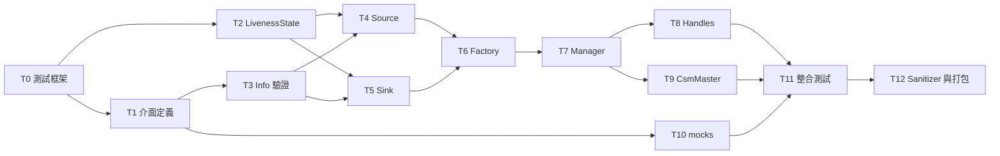

# R1 實作 TODO List(v0.8.17)

> 依據:`r1_design_draft.md` v1.3.16(正式版;T12 已發布 framework 導入與正式驗收)。本文件將設計規劃書轉為可逐步執行、可逐項查核的實作清單。
> 文中「§x.y」一律指設計規劃書章節；「T*.n」指本文件的 TODO 項目。

## 0. 版本歷史

| 版本 | 說明 |
|---|---|
| v0.8.17 | **更新 Agent:`coco-codex`**。使用者已合併 framework PR #7，主線 release `6a04bfe` 與原 v0.3.0 tag `67755d6` tree 完全相同；保留原 tag，四個 consumer 將固定其版本 commit。接續從各自 nested 入口正式執行 sanitizer、打包與 t2–t11 連續鏈，補 M22 決定性交錯測試；既有 diff 保留、package 版本待 PR-ready 才獨立提交、rv2 Doxyfile 不動。TSan 仍需重新證實 runtime 能力，不放寬安全設定、不將平台阻塞當 PASS；尚未取得本輪結果的小項不勾選。 |
| v0.8.16 | **更新 Agent:`coco-codex`**。T12 framework 已實作隔離 run/mount 防護、sanitizer compile/link/ELF 與精確案例 gate、Debian dependency closure/內部版本與乾淨安裝；21 sanitizer unit、16 packaging unit、入口/CMake/既有回歸與全檔 lint PASS。開發預驗證：transport ASan 64、UBSan 84、mocks UBSan 3、I10 ASan 2 cases PASS；transport 完整 134 功能案例 PASS(cppcheck 原生 32 SKIP)。乾淨安裝先抓出缺少 r1_interfaces export，補 CMake 一行後三包 deb/discovery/downstream compile/link/node 啟停 PASS。L14/S11/K12/K15/K16 與 I10 shutdown 測試補強保留 consumer diff；M22 決定性交錯證據仍待補。GCC/Clang TSan 均遇平台啟動阻塞，不放寬安全設定、不勾選正式 T12。framework 功能 commits 後獨立 v0.3.0 commit/tag `67755d6`，已提出 [PR #7](https://github.com/cocobird231/r1_test_framework/pull/7)；待使用者 merge 才可更新 consumer pin，版本/Doxyfile/gitlink 未動。 |
| v0.8.15 | **更新 Agent:`coco-codex`**。T12 開工前核對現行 unit/integration 布局、framework v0.2.1 與 transport v0.1.1；補齊跨 package I10、K15 ASan、K10/I10 TSan、UBSan unit 分類、sanitizer fail-closed/子程序退出與隔離產物要求。打包須使內部 Debian Version 與檔名一致，處理 workspace-local 依賴並在無來源/build overlay 的乾淨容器驗證安裝與下游使用。先實作 framework 並預驗證，待 framework PR 經使用者 merge 才更新 consumer pin、正式驗收；不提前勾選或更改 package 版本、gitlink、rv2 Doxyfile。 |
| v0.8.14 | **更新 Agent:`coco-codex`**。使用者要求修正 transport lint 並確認 unit/integration 通過。先同步規範；複核後保留 flake8/pep257 的非重複檢查，flake8 相容設定只將 Jazzy 原設定的 inline-quotes 對齊 Ruff 雙引號，直接修正三份 launch module docstring 與 CMake 縮排。僅排除由既定 clang-format gate 取代的 uncrustify 註冊；保留 cppcheck/lint_cmake/xmllint、全部 10 個 gtest targets/134 案例與 labels。Docker framework lint、完整 test_run、unit 84/84、integration 50/50 均 PASS；cppcheck 原生 32 SKIP 仍揭露。不改 runtime 邏輯、Doxyfile、package 版本或 gitlink；證據見 T0.7，保留未提交 diff。 |
| v0.8.13 | **更新 Agent:`coco-codex`**。使用者同意使用 Ruff 修正剩餘 Python lint，並確認設定檔。沿用各 package submodule 的 `lint/ruff.toml` 與 Ruff 0.15.7，Docker 內對 owner 選中 Python 執行安全 `check --fix` 與 `format`，不放寬規則或啟用 unsafe fixes。先修文件，保留前輪未提交 C/C++ diff，使用 owner UID/GID 寫回並驗證 AST/非 Python 來源保留；不改 Doxyfile、package 版本、gitlink 或框架。共修正 23 Python，AST 僅 I04 unused `re` import 移除；對齊 gate cwd 後 transport/mocks/integration nested lint 全 PASS，interfaces SKIP。證據見 T0.7，本輪仍保留 diff 供檢視，不 commit/升版/PR。 |
| v0.8.12 | **更新 Agent:`coco-codex`**。使用者同意修正 package lint，先以 clang-format 修正一輪。本輪試行範圍為各 owner lint 選中的 C/C++ 檔案(含 transport legacy 程式碼)，Docker clang-format 18 使用既有 framework v0.2.1 設定，保持 UID/GID/mode；不加入框架自動修正功能、不改 Python/Ruff、Doxyfile、版本或 gitlink。先同步文件，再對 52 檔各格式化一次，實際改動 47 檔；nested lint 的 C/C++ 全過，mocks 整包 PASS，transport/integration 分別剩 3/22 個 Ruff failed checks，interfaces SKIP。本輪保留 diff 供檢視，不 commit、升版或提出 PR，證據見 T0.7。 |
| v0.8.11 | **更新 Agent:`coco-codex`**。使用者已合併 framework PR #6，主線 release SHA 重寫為 `f86fcd9`，其 tree 與既有 v0.2.1 tag commit `3dd3c27` 完全相同；不移動 tag，各 consumer 固定既有版本 commit。本輪保留前次本地 dependency commits 開新分支，四個 gitlink-only commits 已留本地，package.xml、來源與 rv2 Doxyfile 不動。Docker metadata PASS；實際 nested lint：transport 35、mocks 11、integration 26 個 failed checks，interfaces 無支援來源而 SKIP。未 push、附 release commit/tag 或提出 PR；證據及後續條件記於 T0.7。 |
| v0.8.10 | **更新 Agent:`coco-codex`**。依使用者新裁決，C/C++ lint 僅比對 clang-format 18 原生輸出，排除無法由 formatter 自動偵測/修正的額外規則：block comment 強制兩格、空 namespace 缺名、macro/條件編譯名稱推論、formatter-off 強制檢查及 Doxygen/多行註解結構。移除補充詞法檢查與記憶體間距正規化，以原生 formatter 正反例取代專屬回歸；一般格式、可修正 namespace 名稱、Python/Ruff、ShellCheck 與唯讀/錯誤傳遞不變。先修規範再改 framework，Docker 18 tests/入口/路徑與全檔 lint PASS；功能 commit `d3007d4` 後獨立版本 commit/tag v0.2.1 `3dd3c27`，已提出 [PR #6](https://github.com/cocobird231/r1_test_framework/pull/6)。consumer gitlink 與既有來源不動，transport override 預驗證仍有 35 個格式失敗，證據見 T0.7。 |
| v0.8.9 | **更新 Agent:`coco-codex`**。使用者已 rebase merge framework PR #5，並要求各 package 升級 framework。主線 release commit 為 `5316f3e`，既有 v0.2.0 tag 仍指向 `631a85b`，兩者 tree 完全一致；不移動 tag，四個 consumers 固定原 tag 的版本 commit。三個遠端 package 舊 PR 均已合併，本輪從最新 base 建新分支；interfaces 無 remote，維持本地流程。四個 gitlink-only dependency commits 已留本地；Docker lint 三個 package FAIL、interfaces 無支援來源而 SKIP，未 push、附 release commit/tag 或提出 PR。不批次格式化、修改 rv2 Doxyfile 或提前改 package.xml；結果與後續 PR 條件另記於 T0.7。 |
| v0.8.8 | **更新 Agent:`coco-codex`**。使用者確認目前 lint 格式並要求 commit/PR；沿用 120 欄、class 內短函式單行、註解與 Doxygen 規則。framework 先提交格式確認文件，再以獨立 `chore(release): v0.2.0` commit `631a85b` 僅更新 VERSION 與 README 安裝範例的 tag，建立同名 annotated tag，推送並提出 [PR #5](https://github.com/cocobird231/r1_test_framework/pull/5)。本輪全檔 Docker lint 與 release metadata 驗證通過；程式碼/測試未變，沿用 56 個回歸測試結果。T0.7 framework 驗收完成；待使用者以 merge commit 合併，才更新其他 package gitlink，本輪未改其他 package 或 rv2 Doxyfile。 |
| v0.8.7 | **更新 Agent:`coco-codex`**。增加多行區塊註解與 Doxygen JavaDoc-style 文件註解候選：一般說明用 `/* */`、class/function API 說明用 `/** */`，delimiter 獨立成行、星號對齊且區塊不得空白；文件首個非空內容行為有文字的 `@brief`。明訂這些為選自 Doxygen 支援語法的專案慣例，不是 Doxygen 唯一合法格式；lint 驗證結構，不宣稱驗證所有 API 均有文件或參數/回傳描述語意。沿用唯讀 Docker、不碰 rv2 Doxyfile、不定版與不更新 gitlink。 |
| v0.8.6 | **更新 Agent:`coco-codex`**。細化 C/C++ lint 候選：程式碼與行尾註解間兩格、不對齊註解欄；巢狀 namespace 同縮排且逐層標示正確結尾名稱。使用者裁決所有情況均需強制檢查，故增加 token-aware 補充檢查，涵蓋 `/* */` 與空 namespace，formatter-off 不豁免；formatter 的 block comment 間距衝突僅在記憶體比對時調整。120 欄與 class 內短函式單行仍待確認，不附 release commit/tag/PR、不改 package gitlink。 |
| v0.8.5 | **更新 Agent:`coco-codex`**。新增 T0.7 與 PR 前 lint 候選規範：framework 提供唯讀 Docker test_lint.sh、LLVM 基底 Allman .clang-format 與 C/C++ 範例，Python 採 PEP 8/Black 相容 Ruff，Shell 採語法檢查/ShellCheck。使用者要求先討論格式再定版，本輪不附 package 版本 commit/tag、不開 PR、不更新各 package gitlink、不批次格式化舊碼；integration header/source 布局維持不變。 |
| v0.8.4 | **更新 Agent:`coco-codex`**。依使用者裁決排除 rv2 Doxyfile：transport 版本 commit 由 e99c59c amend 為 8b45662，只保留 package.xml 0.1.0；Doxyfile 還原既有 0.0.0，並依本次 amend 同步 transport 的未合併 PR/tag，其他 packages 與 framework tag 不動。§1.4 明訂只同步同一 R1 release 範圍的版本欄位，版本變更不得提早混入功能 commit；mocks/integration 的首次空 release commit 僅本次獲准例外，後續仍遵守 PR-ready 才附獨立版本 commit。 |
| v0.8.3 | **更新 Agent:`coco-codex`**。framework v0.1.0 PR #4 經使用者 merge 後，四個 package 的 gitlink 更新為已發布 tag 所指 `12cc2dd`；GitHub rebase 後主線版本 commit 為 `0bb3228`，兩者 tree 完全相同，不移動既有 tag。transport 以獨立 release commit 同步 package.xml/Doxyfile 為 0.1.0；mocks/integration 的 package.xml 原已為 0.1.0，以空 release commit 記錄首次定版並各自加 v0.1.0 tag，與 gitlink 提交分開。interfaces 無 remote，僅本地更新 gitlink，release commit 依 §1.4 待 PR-ready。Docker 版本/XML、nested owner、shell 語法及框架路徑解析回歸通過；本輪未改腳本或測試、不重跑全功能測試。 |
| v0.8.2 | **更新 Agent:`coco-codex`**。依使用者裁決新增各 package 獨立定版規範：首次 v0.1.0，ROS2 package 同步 package.xml 與既有版本欄位，framework 採 VERSION；準備 PR 時才附獨立版本 commit 並加 vX.Y.Z tag，目前手動、未來由 GitHub Actions 接手。framework 版本 PR 經使用者 merge 後，才允許各 package 更新至該版本 commit；文件修訂版本不重設。 |
| v0.8.1 | **更新 Agent:`coco-codex`**。T0 布局修正完成：四個 package 的 framework gitlink 固定 `f436059`，移除 18 個根目錄腳本 symlink；測試分類、CMake labels 與 Handle H7–H8 拆分完成，既有案例 ID/斷言保留。framework 以實際 CTest discovery 防止 colcon 將空分類誤判成功。Docker T0 PASS、transport unit 84/integration 50 cases 全綠、T10 27-test/T11 39-test 彙總全綠、T1 build及10個介面解析通過；無 sibling framework 的 fresh clone 從其他 CWD 呼叫 nested 腳本亦完成 build。全部驗證容器卸載，T0.2/T0.5/T0.6 勾選；修正 helper 路徑與 T12.5 跨 package 指令。 |
| v0.8.0 | **更新 Agent:`coco-codex`**。先行修訂 T0 規範：依使用者裁決，每個 R1 相關 package 必須於根目錄內嵌 `r1_test_framework` git submodule，直接使用 `./r1_test_framework/*.sh`，取代 v0.2.0 的 sibling/symlink 布局。`test/` 統一分為 `unit/` 與 `integration/`，依單一合約或系統協作分類；新增 T0.6 搬移驗收。既有 T1–T11 通過紀錄保留為歷史證據，新布局須另行 Docker 重驗後勾選 T0.2/T0.5/T0.6。同步依據設計稿 v1.3.0。 |
| v0.7.0 | **更新 Agent:`coco-codex`**。T11.1–T11.5 完成:`r1_integration_tests` launch_testing 基架、I00 空場景/並行實證與 I1–I18 全場景；19 個 CTest targets 以獨立 ROS_DOMAIN_ID(可整段 relocation)及 parallel=2 執行。補齊 real-manager PENDING TTL、master lost-ACK 原 event 重送/冪等、manager/service readiness barrier、雙 ready snapshot gate、真 waiter armed barrier、MockMaster out-of-order/stale generation、process-model crash/restart、producer timestamp 週期/in-flight/backoff、fresh/raw status identity 證據。多輪對抗式查核發現全修，最終 3-agent 分區複核 0 must-fix；`./todo_check.sh t11` docker PASS(39-test 彙總,0 error/failure/skip,container 自動卸載)，受影響 I5/I6/I11/I12/I17 另各連跑 3 次全綠；mock 支援異動另經 t10 27-test regression 全綠。I10 sanitizer 組態依規劃保留至 T12。 |
| v0.6.0 | **更新 Agent:`coco-codex`**。T10.1–T10.6 完成:`r1_test_mocks` 五個可腳本化 nodes、23 個 smoke gtests、嚴格 `<10%` rate 驗證、接受但不回覆、ACK 串接固定序列與四種 CsmNotify/亂序/舊世代注入；修正 callback lifetime 與跨執行緒計數 race。docker t10 PASS(27-test 彙總),3-agent 最終對抗式複核 0 must-fix。同步修正 §1.3 跨 package 執行位置、T10/T11 的 pre-T1 舊依賴/框架文字與附錄案例數 |
| v0.5.1 | **更新 Agent:`coco-codex`**。新增 §1.4 文件修訂紀錄規範:每次更動 `r1_todo.md` 或 `r1_design_draft.md`,除同步更新文件版本號與版本歷史外,必須於該筆歷史明確標示實際更新 Agent；並補列 Codex 的 agent 身分命名 |
| v0.5.0 | T8.1–T8.4、T9.1–T9.9 完成:`test_handles.cpp`(H1–H8,含 in-flight unregister 不復活與 debug/release 雙模式 H3)、`csm_master.h`(status 唯一訂閱者、identity 配對、CSM 級雙閾值 polling、level reconciliation 含 v1.2.1 absence clock、可靠通知 pump)、`csm_master_node` 執行檔與 CM1–CM13(mock CSM 裸 node)。docker t8 / t9 閘門 PASS。4-agent 對抗式查核 27 項發現、14 must-fix 全修:實作面 6(DISCONNECTED record 之 status 復活防護、same-instance rebuild 保留 seq fence、pending 健康事件按 owner 區分取代、notify RPC in-flight deadline 防 budget 餓死、DISCONNECTED peer 不永久關閉 ready gate、event FIFO);測試面 8(H8 補真 in-flight、CM1 interval/grace 驗證、CM2 訂閱斷言、CM6 stale-status fence、CM11 grace 起點、CM12 STALE settle、CM13 變體 C 無幻影 TIMEOUT)。獨立複核逐項確認 |
| v0.4.0 | T6.1–T6.4、T7.1–T7.14 完成:`control_signal_factory.h` + `src/r1/`(singleton 單一定義、joy/twist/string 註冊)、`source_registration.h`、`control_signal_manager.h`(五階段 tick、兩階段註冊、retry 狀態機、master 互動、通知處理、黑白名單)與 F1–F5、M1–M26 全數實作;`control_signal_handles.h` 為 Manager API 相依提前實作(H1–H8 測試屬 T8)。docker t6 / t7 閘門 PASS。**裁決 §12 #6(D7)提案**:`RetryPolicy::Recommended()` = {initialDelayMs 200, maxDelayMs 5000, jitterRatio 0.2, maxInitialAttempts 3, maxInFlight 4, quarantineThreshold 3},`autoRetryInitial` 旗標歸 RetryPolicy(全域);依 §2.4,typed RETRYABLE_CONFLICT 之 D3 retry 為強制、不受 D7 旗標與 initial cap 約束。5-agent 對抗式查核 43 項發現、25 must-fix 全修:實作面 10(D3/D7 retry 治理、stale completion 世代防護、quarantine 未生效、三處鎖巢套、peer-health 世代驗證、FIFO 冪等快取、sink 清理競態、abort 路徑補 rollback UNREGISTER、tick 執行緒 callback guard、**解構 fence**——manager 中途銷毀時 in-flight async callback UAF,以 alive sentinel + callback 計數 drain 修復);測試面 15(M3 依 §2.4 改判 D3 強制 retry、M4 改 16 執行緒跨 4 真實 targets、M5 補 policy-off 分支、M7 補 in-flight、M8 補 PAIR_MISSING、M14 補 in-callback 半、M16 補 sink rate、M17 補 per-CSM 單筆與 degraded 進出、M18 補覆蓋語意、M24 補 established intent 無上限、M25 碰撞決定化)。M4 併 TSan、M10 併 ASan 維持 T12 |
| v0.3.0 | T3.1–T3.3、T4.1–T4.7、T5.1–T5.6 完成:`control_signal_info.h`(六規則驗證)、`control_signal_source.h`(雙模式、ResponseHealth、RateRecorder、terminal seal 雙 cause)、`control_signal_sink.h`(read / callback / waitForMessage、seal 交錯)與 V1–V11、S1–S16、K1–K16 全數實作。docker t3 / t4 / t5 三閘門 PASS(45 tests)。5-agent 對抗式查核:實作 0 must-fix;測試強度 4 must-fix(S5 遮蔽斷言空洞、S16a 缺 send 交錯、S16c 誤測 preamble 而非 response 路徑、K13/K14 無喚醒延遲上界)已修並複測綠。記錄之實作裁量:`INVALID_CONTEXT` 宣告未回傳(context 偵測待 T7 tick 執行緒);`rateWindowNs` 暫為建構參數(ManagerOptions 屬 T7);`calcHz` 依實際覆蓋時距正規化(消除 partial-bucket 稀釋);S14/S16 之 outcome 以 friend 通道決定性注入;S11 收斂單調性與 K16 TSan 子句移交 T12 sanitizer 矩陣 |
| v0.2.3 | T2.1–T2.6 完成:`liveness_state.h`(單寫者模型、activity-generation terminal seal、純計算 `calcState`)與 L1–L18 全數實作;docker t2 PASS、host TSan(L14 多執行緒)無 race、4-agent 對抗式語意查核 0 must-fix。閾值依 §4.3 為 `calcState` 逐呼叫參數(非建構參數,todo 原文以 §4.3 為準)。T0.5 勾選:framework PR #1 合併後 fresh clone workspace 實測 t0 PASS |
| v0.2.2 | Migrate 分支政策:`rv2_control_signal_transport` 以 `r1` branch 為 R1 新版主 branch(自 rv2 `master` 8bc3662 分出,master 凍結),階段 PR base 改為 `r1`;transport PR #1 與 framework PR 依此建立 |
| v0.2.1 | 新增 §1.4 Git 版控規範:agent 身分命名(`coco-claude` 等)、每階段獨立 branch(`<身分>/<項目>`)、完成後 push + PR + 回報;`r1_test_framework` remote 建立,T0.5 解除阻塞 |
| v0.2.0 | T1.1–T1.6 完成(docker t1 build 通過、`ros2 interface show` 10/10 解析、欄位↔條文逐欄查核通過)。**裁決 §12 #1 結案:新開 `r1_interfaces` package**——rosidl 型別名僅取檔案 basename(子目錄不入 namespace),`ControlSignalInfo`、`ControlSignalInfoReq`、`ControlSignalJoy`、`ControlSignalTwist` 與 `rv2_interfaces` legacy 型別同名衝突,無法照 §2.1 原文放置。框架佈局變更:`r1_test_framework` 自 package 內搬移至 workspace `src/r1_test_framework/`(獨立 repo 與各 package 平行,取代 §11.5.1 巢狀 submodule 模型),package 根目錄 symlink 改為相對路徑 `../r1_test_framework/*.sh`,腳本 `PKG_DIR` 解析順序改為 env → symlink 位置 → CWD;`todo_check.sh t1` 改查 `r1_interfaces`。t0 基線修復:legacy `csm_test_utils.h` `makeInfo()` 補上現行驗證必填之 `controller_name` / `priority` / `controller_priority_type`(t0 重驗 23 gtests 全綠) |
| v0.1.1 | T0.1–T0.4 查核完成勾選。t0 baseline 於 docker 實測通過(28 gtests 全綠,container 自動卸載,host 無殘留)；框架修正:container 內以空 tmpfs 遮蔽 `test_env/`(避免 ament linters 掃到產物之 418 筆誤報)、t0 篩選至既有 gtest 迴歸(legacy lint 一致性不在 R1 範圍;jazzy uncrustify 將 `.h` 以 C 解析致 `constexpr` 報錯,屬既有狀態) |
| v0.1.0 | 初版:大項 T0–T12、依賴序、逐小項查核條件、逐大項語意查核與 docker 實測指令；隨附 `r1_test_framework` 腳本組(test_build / test_deps / test_run / test_packages / test_clean / todo_check)與 package 根目錄接線(symlink、`test_depends.repos`、`.gitignore` 排除 `test_env/`) |

## 1. 使用方式與共通規範

### 1.1 清單結構

- **大項(T0–T12)**:一個可獨立驗收的里程碑,依 §2.1 檔案布局與編譯依賴排序。每個大項最後有「驗證」小節,分為兩部分:
  - **語意查核**:人工(或 code review)對照設計規劃書,確認測試案例所斷言的行為與 § 條文一致。這一步驗證「測試寫對了」,防止測試通過但語意偏離設計。
  - **實際測試**:在 docker 內執行該大項的測試集,以結束碼判定。這一步驗證「程式寫對了」。
- **小項(T*.n)**:一個可在單次工作階段內完成的實作單位。每個小項附**查核**條件:客觀、可觀察的完成判準。勾選 `[x]` 前必須滿足查核條件。
- 測試案例 ID(V/L/S/K/F/M/CM/H/I)沿用設計規劃書各章測試表,為**最低集合**；§11.3 另要求每個 class 的每個 function 皆有對應 unit test。

### 1.2 Docker 測試規範(host 零污染)

全部查核與測試一律在 docker container 內執行(§11.3),規則如下:

| 規則 | 內容 |
|---|---|
| Host 隔離 | 依賴安裝(apt / rosdep)、colcon build、測試執行全部發生在 container 內；host 僅存放原始碼與 `test_env/<distro>/` 產物目錄,不安裝任何測試依賴 |
| Image 共用 | 同一 distro 的所有項目共用**同一個官方 base image**(jazzy 為 `ros:jazzy-ros-base-noble`,§11.5.2),不建自訂 image；可以 `R1_TEST_BASE_IMAGE` 覆蓋 |
| Container 命名 | TODO 查核為 `r1_todo_<item>_<distro>`(例 `r1_todo_t2_jazzy`),標準流程為 `r1_test_<package>_<distro>`,便於識別與清理 |
| 測後卸載 | `todo_check.sh` 於查核結束(無論成敗)自動 `docker rm -f` 該 container；`-k` 可保留供除錯 |
| 產物 | 僅寫入 package 下 `test_env/<distro>/`(已列 `.gitignore`)；因 container 以 root 執行,清除產物用 `./r1_test_framework/test_clean.sh --purge-env`(經 docker 處理所有權),不需在 host 動用 sudo |
| 磁碟回收 | 需要釋放空間時 `./r1_test_framework/test_clean.sh --rmi` 移除 base image；下次查核會重新下載 |

### 1.3 查核執行指令

每個 R1 相關 package 均須將 framework 以 git submodule 引入至 `<package>/r1_test_framework/`，直接執行其中腳本。適用範圍包含 `rv2_control_signal_transport`、`r1_interfaces`、`r1_test_mocks`、`r1_integration_tests` 與未來的 R1 packages；framework 自身不必遞迴引入自己。不得依賴 workspace sibling checkout 或根目錄 shell symlink。

從該 item 的目標 package 執行(附錄 B)：T0、T2–T9 從 transport、T1 從 `r1_interfaces`、T10 從 `r1_test_mocks`、T11 從 `r1_integration_tests`。

```bash
cd ~/Workspace/ros2_ws/src/<目標-package>
git submodule update --init --recursive
./r1_test_framework/todo_check.sh <item>          # 一鍵:建 container → 裝依賴 → build + test → 卸載
./r1_test_framework/todo_check.sh <item> -k       # 保留 container 供除錯
./r1_test_framework/todo_check.sh <item> -d humble  # 指定其他 distro
```

分步執行(等同 CI 腳本鏈,§11.3):`./r1_test_framework/test_build.sh` → `./r1_test_framework/test_deps.sh` → `./r1_test_framework/test_run.sh [-f <ctest 過濾>]` → `./r1_test_framework/test_clean.sh`。

`<item>` 對照表見附錄 B。

### 1.3.1 測試目錄與分類

- 所有 package 必須有 `test/unit/` 與 `test/integration/`；無案例的一側以 README 說明，不新增空殼測試。
- `unit/` 驗證單一 function/class 合約，例如 Info 驗證、LivenessState、Source、Sink、Factory、Handle 基本操作、StatusFaultNode 單一代理行為；使用 ROS 或裸 probe 不會自動變成 integration。
- `integration/` 驗證多元件的系統協作，包括單一 package 內的 CSM 註冊、heartbeat、callback 派送、master 對帳及 retry。M1–M26、CM1–CM13、Handle H7–H8、mock 控制/資料通訊 smoke、I00/I1–I18 放在此類。
- 共用 fixture/helper 可留於 `test/`，可執行測試案例必須放入上述兩類。混合單一合約與系統流程的檔案須拆開，保留既有 case ID 與斷言。
- CMake 更新來源/include 路徑，CTest 標示 `unit` / `integration` labels；預設執行兩類，`./r1_test_framework/test_run.sh -s unit` 或 `-s integration` 可分開驗證，指定類別空匹配必須失敗。
- 遷移先修文件，再改各 package；框架先完成版本 PR 並經使用者 merge，package 再 pin 該版本 tag 所指的 commit(§1.4)。workspace sibling framework 可保留作開發 checkout，但不可作 package 執行依賴。

### 1.3.2 PR 前 lint(格式已確認)

- 採用含 lint 的 framework 版本後，每次準備 PR 必須在目標 package 執行 `./r1_test_framework/test_lint.sh`，通過後才附獨立版本 commit；不得把版本欄位提早混入開發 commit。framework 版本 PR 須先經使用者 merge，各 package 才可更新 gitlink。
- lint 為獨立 Docker 唯讀流程，不需先 build/deps，不重用或清除既有測試容器。固定官方 Jazzy base image 與 clang-format 18/Ruff 0.15.7/ShellCheck 工具環境；不安裝 host 依賴、不建客製 image、不自動修正來源。詳細命令與適用範圍見 framework README。
- C/C++ 以 LLVM 為基底，採 Allman、4 spaces、namespace 不縮排、保留 include 順序、120 欄與 class 內短函式單行。Python 為 PEP 8/Black 相容 Ruff format/check；Bash/sh 為語法檢查與 ShellCheck。這不是 C/C++ 編譯或語意分析的替代。
- transport 僅排除 `ament_cmake_uncrustify` 註冊：C/C++ 格式由既定 clang-format gate 負責，不另維護不同 formatter 的規則。保留 flake8/pep257 的額外檢查，因 Ruff E4/E7/E9/F/I 不涵蓋全部 builtins/comprehensions/docstring 規則；`test/ament_flake8.ini` 保留 Jazzy 原有設定，只將 `inline-quotes = double` 對齊共用 Ruff，不新增 rule ignores。三份 launch module docstring 的 raw string/句尾標點與 CMake 縮排直接修正。`cppcheck`、`lint_cmake`、`xmllint` 均保留，工具原生 SKIP 如實回報。`test_run.sh` 與獨立 `test_lint.sh` 都必須成功；不得因此刪減 unit/integration targets、labels 或斷言。
- C/C++ lint 依 v0.8.10 使用者裁決，**僅比對 clang-format 18 原生輸出**，不再加註解/namespace 詞法檢查或修改 formatter 輸出。`//` 前兩格、不對齊註解欄、巢狀 namespace 同縮排不合併、`FixNamespaceComments: true` 與 `ShortNamespaceLines: 0` 保留；formatter 能修正的間距與 namespace 名稱仍須通過。這取代先前「所有情況強制檢查」裁決，不是略過整份含註解或 macro 的檔案。
- 排除 clang-format 無法自動處理的額外要求：`/* */`/`/**< */` 前強制兩格(改採原生間距)、完全空 namespace 缺少結尾名稱、macro/token-paste/跨條件編譯的 namespace 語意推論與額外括號/詞法驗證、`clang-format off` 或 formatter 原生略過區段內的額外檢查、多行 block 的強制星號/獨立 delimiter/非空內容與 Doxygen `@brief`/限定註解型態。formatter 自己仍會調整的部分照常比對，執行失敗仍回傳非零；不額外豁免 C/C++ 一般格式，也不放寬 Python/Ruff 或 ShellCheck。
- lint 失敗時由開發者決定修正，例如明確指定檔案執行 `clang-format-18 --style=file:./r1_test_framework/.clang-format -i <file>`，檢查 diff 後重跑 lint。框架不得自行批次格式化、修改 legacy rv2 文件或改測試斷言。
- v0.8.12 本輪使用者明確授權 clang-format 修正一次：只格式化各 package owner lint 清單內的 C/C++(含 transport legacy)，不碰 generated、vendored、symlink、nested repo 或 submodule。格式化工具仍在 Docker 內執行，以 owner UID/GID 寫回，保留 Python/Shell、Doxyfile、package.xml 與 gitlink；完成後重跑唯讀 lint，剩餘非 C/C++ 違規另行回報，不擴張本輪修改範圍。這是開發者主動修正，不改 `test_lint.sh` 的唯讀性；試行結果先保留 diff，不進行 release/PR。
- v0.8.13 使用者另行授權接續 Python 修正：各 package 使用 `./r1_test_framework/lint/ruff.toml`，相當於 Python 的共用格式/lint 設定；語法目標 `py310`、88 欄、4 spaces、雙引號、LF，啟用 E4/E7/E9/F/I。Ruff 版本由 `lint/requirements.txt` 固定；設定不由 owner 的其他檔案覆蓋。Docker 內明確選定 owner Python 檔案，執行 `ruff check --fix --no-unsafe-fixes --config <共用設定>` 再 `ruff format --config <共用設定>`，之後重跑原唯讀 lint。此為使用者要求的來源修正，不改框架的唯讀合約或先前 C/C++ diff；設定、Doxyfile、package.xml 與 gitlink 不動，本輪保留未提交 diff。
  手動 Ruff 修正須與現有 lint gate 同在 container 的 `/` 工作目錄執行，設定與來源使用絕對路徑，並加 `--no-cache`。顯式 `--config` 下 Ruff 預設以 cwd 推定 first-party imports；若切到 owner 根目錄，transport 的 `launch/` 會改變 import 分組。不另加設定覆蓋來掩蓋差異。
- 多行說明仍建議使用對齊星號的 `/* */`，class/function API 文件仍建議 Doxygen JavaDoc-style `/** */` 與 `@brief`、`@param`、`@return`；這些 formatter 無法保證的文件慣例暫不作 lint gate。`ReflowComments: false` 保留，不產生或改寫文件內容。API 文件覆蓋與描述正確性仍由 review 判斷，不修改 rv2 Doxyfile。
- Framework PR #5 已由使用者 rebase merge，T0.7 framework 驗收完成。已驗證主線 `5316f3e` 與 v0.2.0 tag 所指 `631a85b` 內容一致；consumer gitlink 使用原 tag commit，不重打 tag。package 自身版本與 integration header/source 布局不因本輪 gitlink 升級改動；新版 lint 必須如實回報，未通過時不得自行批次格式化或跳過 PR 閘門。本輪不新增 CI workflow，也不自行合併 PR。
- 本版能力限縮的 framework v0.2.1 [PR #6](https://github.com/cocobird231/r1_test_framework/pull/6) 已由使用者 merge；驗證主線 `f86fcd9` 與既有 tag commit `3dd3c27` tree 相同後，consumer 固定後者，不重打 tag。各 package 必須使用自己的 nested 入口重新驗證，不能用 framework 自身 PASS 或先前 override 預驗證替代；導入結果見 T0.7。

### 1.4 Git 版控規範(v0.2.1;v0.2.2 增列 migrate 分支政策;v0.5.1 增列文件修訂署名;v0.8.2 增列 package 定版)

適用於本案全部 repos(`rv2_control_signal_transport`、`r1_test_framework`、`r1_interfaces`,以及日後的 `r1_test_mocks`、`r1_integration_tests`):

| 規則 | 內容 |
|---|---|
| Commit 身分 | AI agent 產出之 commit 以 repo-local `git config user.name` 標示身分,命名 `coco-<agent>`:Codex 為 `coco-codex`、Claude 為 `coco-claude`、ChatGPT 為 `coco-gpt`,依此類推 |
| 文件修訂紀錄 | 每次更動 `r1_todo.md` 或 `r1_design_draft.md` 時,必須同步更新該文件的版本號、於 §0「版本歷史」新增一筆紀錄,並在該筆說明或摘要開頭以 `更新 Agent:coco-<agent>` 明確標示實際更新者(例如 `coco-codex`、`coco-claude`)；不得只修改內文,也不得省略版本號、版本歷史或更新 Agent 中的任一項 |
| 分支模型 | 每個階段(一個或連續數個 TODO 大項)之新增、修改、刪除一律開新 branch,不直接 commit 至主 branch。branch 命名 `<身分>/<項目>`,如 `coco-claude/T0-T1`、`coco-claude/T2` |
| **Migrate 分支政策(v0.2.2)** | 既有 rv2 packages 處於 migrate 階段:R1 新版程式碼以 **`r1` branch 為新版主 branch**,rv2 既有版本(`master`)凍結不動。`rv2_control_signal_transport` 之階段 PR 一律以 `r1` 為 base;純 R1 新 repos(`r1_test_framework`、`r1_interfaces` 等)無 rv2 包袱,主 branch 即 `master` |
| Package 版本 | 每個 R1 package 獨立管理版本，首次定版從 `v0.1.0` 開始，不要求 packages 同步升版。ROS2 package 以根目錄 `package.xml` 的 `<version>` 為來源，僅同步屬於同一 R1 release 範圍的其他版本欄位；`rv2_control_signal_transport/Doxyfile` 屬於 rv2，維持原內容，不隨 R1 定版修改。非 ROS package 的 `r1_test_framework` 使用根目錄 `VERSION`，不為定版新增 ROS manifest，也不修改測試 fixture 版本。檔案內版本不含 `v` 前綴。文件自身的修訂版本沿用原序列，不屬 package release、不重設 |
| 版本 commit 與 tag | 功能、測試、文件變更先提交，版本欄位不得提前混入這些 commit；完成驗證、準備提出 PR 時才附獨立版本 commit，只含版本欄位變更，訊息包含 `vX.Y.Z`(如 `chore(release): v0.1.0`)，並建立同名 Git tag 指向該 commit。目前手動執行，未來才由 GitHub Actions 產生；本輪不實作 workflow。mocks/integration 已提前有 0.1.0 而使用空 release commit，僅為使用者本次准許的首次定版例外，不作為後續慣例。合併須保留該獨立 commit 與 tag SHA，使用 merge commit，不 squash/rebase 已標記的版本 commit；不得自行移動或覆寫 tag |
| 完成流程 | 階段完成(該大項查核與實測通過)後:附版本 commit/tag → push branch 與 tag → 對主 branch 提出 PR → 回報使用者。PR 合併由使用者裁決；無 remote 的 repo 暫存本地，待具備 PR 條件才附 release commit |
| Framework 升版順序 | 先提交 framework 版本 PR，等待使用者 merge；確認 merge 後才將各 package 的 submodule gitlink 固定到該版本 tag 所指 commit，再推送各 package 的 PR。不得提前更新，也不得改 pin 任意開發 HEAD 或 merge commit |
| Remote | `r1_test_framework`(private):`git@github.com:cocobird231/r1_test_framework.git`；`r1_test_mocks`:`git@github.com:cocobird231/r1_test_mocks.git`。`r1_interfaces` remote 待建立;建立前 branch 僅存本地 |

### 1.5 前置裁決(開工前決定)

| 裁決點 | 影響大項 | §12 編號 | 暫定預設 |
|---|---|---|---|
| msg/srv 放置於 `rv2_interfaces/msg/r1/` 或新開 `r1_interfaces` | T1 | #1 | **已裁決(v0.2.0):新開 `r1_interfaces`**。rosidl 型別名僅取 basename,四個型別與 legacy 衝突,暫置方案不可行 |
| retry 參數數值與 policy(initial/max delay、initial cap、`auto_retry` 歸屬) | T7.7 | #6 | 實作時提案預設值,寫入 `RetryPolicy` 預設建構並回饋規劃書 |
| `registerSource` async 版本 | T7.4 | #3 | 首版僅同步版,介面預留擴充 |
| 使用者層 forced disconnect API | T8 | #5 | 首版不開放,內部保留 forced 路徑 |

---

## 2. 里程碑總覽與依賴序



| 大項 | 內容 | 產出位置 | 測試案例 |
|---|---|---|---|
| T0 | 測試框架與 docker 環境 | `r1_test_framework/` + package 根目錄 | —(框架自身查核) |
| T1 | msg/srv 介面定義 | `r1_interfaces/msg/`、`srv/`(§12 #1 裁決) | —(build + 欄位對照) |
| T2 | `r1::LivenessState` | `include/.../r1/liveness_state.h` | L1–L18 |
| T3 | Info 與驗證 | `include/.../r1/control_signal_info.h` | V1–V11 |
| T4 | `r1::ControlSignalSource` | `include/.../r1/control_signal_source.h` | S1–S16 |
| T5 | `r1::ControlSignalSink` | `include/.../r1/control_signal_sink.h` | K1–K16 |
| T6 | Factory 與型別註冊 | `include/.../r1/control_signal_factory.h` + `src/r1/` | F1–F5 |
| T7 | `r1::ControlSignalManager` | `include/.../r1/control_signal_manager.h`、`source_registration.h` | M1–M26 |
| T8 | Handles | `include/.../r1/control_signal_handles.h` | H1–H8 |
| T9 | `r1::CsmMaster` + node | `include/.../r1/csm_master.h`、`src/r1/csm_master.cpp` | CM1–CM13 |
| T10 | `r1_test_mocks` package | `ros2_ws/src/r1_test_mocks/` | —(mock 行為 smoke) |
| T11 | `r1_integration_tests` package | `ros2_ws/src/r1_integration_tests/` | I1–I18 |
| T12 | Sanitizer 矩陣、迴歸、打包 | —(建置組態與 `.deb`) | §11.4 矩陣 |

---

## T0 測試框架與 docker 環境(§11.5)

**目標**:建立全案共用的 docker 化測試流程,後續所有大項的「實際測試」都經由本框架執行。
**依賴**:無(最先執行)。

- [x] **T0.1** `r1_test_framework/` 腳本組:`test_build.sh`、`test_deps.sh`、`test_run.sh`、`test_packages.sh`(§11.5.3 四支標準腳本)加上 `test_clean.sh`(卸載)與 `todo_check.sh`(TODO 查核執行器),以獨立 git repo 版控。
  查核:`bash -n` 全數通過；每支腳本有用法說明；`git log` 存在初始 commit。
- [x] **T0.2** 各 R1 package 根目錄以 `.gitmodules` + gitlink 引入 `r1_test_framework/`；保留各自 `test_depends.repos` 的 local dependency 宣告，`.gitignore` 排除 `test_env/`，移除舊根目錄腳本 symlink。
  查核：四個現有 R1 packages 的 `git ls-files --stage r1_test_framework` 均為 mode `160000` 且 pin 同一經驗證 commit；`git submodule status` 無未初始化/髒版本；由 package 內直接執行框架腳本可解析正確 PKG_DIR。✅ v0.8.3 四者均固定 framework `v0.1.0` tag 所指 `12cc2dd`，已核對與 merge 後主線 tree 相同；nested 入口、明確 override 與其他 CWD 均經驗證。v0.8.1 移除的 18 個舊 symlink 保留 Git 歷史可供還原。
- [x] **T0.3** Container 生命週期驗證:base image 下載、container 建立、掛載(原始碼唯讀、`test_env` 一對一)、卸載。
  查核:`./r1_test_framework/test_build.sh` 後 `docker ps` 可見 container；container 內 `ls /root/ros2_ws/src/` 見本 package 與 `rv2_interfaces`；`./r1_test_framework/test_clean.sh` 後 `docker ps -a` 無殘留；host 上除 `test_env/` 外無任何新檔案。
- [x] **T0.4** Baseline 全鏈:以現有 rv2 package 走完 build → deps → run,證明框架可獨立完成一次完整測試。
  查核:`./r1_test_framework/todo_check.sh t0` 結束碼 0,輸出含 `colcon test` 結果與 `PASS: t0`。
- [x] **T0.5** 框架獨立版控與可重現引入：framework 維持獨立 remote，各 package 以內嵌 submodule 固定 commit；`git clone` + `git submodule update --init --recursive` 後即可使用。
  查核：在無 sibling framework 的驗證 checkout 中執行 nested 腳本，確認從 package 內及其他 CWD 均解析相同 package；Docker build/test 與測後卸載成功，不自動追遠端 HEAD。✅ `r1_interfaces` fresh clone 從 GitHub 還原框架 gitlink，從 `r1_test_mocks` CWD 以絕對 nested 路徑執行 build→deps→run，容器只掛該 clone 與其 `test_env`；build PASS且測後卸載。
- [x] **T0.6** 全 package 測試分層：依 §1.3.1 搬移測試與更新 CMake/include/helper/文件，保留既有案例覆蓋與 TODO filter；混合 Handle 檔拆分 unit H1–H6 與 integration H7–H8。
  查核：`test/` 頂層無 executable test cases；CTest unit/integration labels、T0–T11 篩選與案例 ID 都保留；transport 兩類、mock 兩類、I00–I18 及 interfaces build/interface gate 均在 Docker 通過。✅ transport 6 unit targets/84 cases與4 integration targets/50 cases全綠；mocks 1 unit/3 integration targets、23 cases(T10彙總27)全綠；T11 19 integration targets(彙總39)全綠；T1 build及10個介面解析通過。框架自身Docker回歸涵蓋精確分類、名稱交集、無CTest與空CTest、失敗傳遞；實際 interfaces `-s unit` 明確拒絕空匹配。
- [x] **T0.7** PR 前 lint gate 與格式定版：獨立 `test_lint.sh`、`.clang-format`、Python/Shell 規則與正反例回歸；使用者已確認並合併 framework PR #5。consumer 導入的 lint 結果與 PR 條件另列下方，不與 framework 自身驗收混為一談。
  查核：Docker 內證明合規 PASS、違規非零、來源唯讀不變、nested/standalone/override 路徑正確、generated/submodule/symlink 排除及工具失敗傳遞；使用者確認格式後才附 framework 版本 commit/tag 與 PR。候選階段不視為已正式啟用於所有 packages。v0.8.5 候選實測：framework 自身 `./test_lint.sh` PASS(C/C++ 2、Python 2、Shell 13 files)；11 個 lint unit regressions、入口整合回歸與既有 package 路徑回歸全過。`.clang-format-ignore` 靜默跳過先實證失敗再以 stdin 修正；ShellCheck 共用來源解析及單一 source annotation 消除跨檔變數誤報，未關閉任何整體規則。當時仍待使用者確認格式，故未勾選。
  v0.8.6 補驗：Docker 內 33 個註解/namespace 詞法測試與 14 個 lint 回歸測試全過，入口整合與既有 package 路徑回歸通過；framework 全檔 lint PASS(C/C++ 2、Python 4、Shell 13 files)。涵蓋兩類註解、連續註解、empty/nested/inline/anonymous namespace、字串/raw string、formatter-off、條件分支、line splice 與可見 token-paste macro；格式違規/名稱缺漏回傳非零，唯讀來源不變。外部 macro 展開語意不在詞法證明範圍。
  v0.8.7 補驗：Docker 內 41 個註解/namespace 測試、15 個 lint 回歸測試、入口整合及 framework 全檔 lint 通過。新增多行 block/Doxygen 正反例、星號縮排、CRLF、空 placeholder、缺少/偽造摘要、inline member doc、formatter-off 與保留 code/list 縮排；空區塊/錯位星號先實證未被舊 lint 攔下，再補規則通過。既有 normalizer 仍只處理行內間距，不掩蓋 block 結構違規；獨立複核無 must-fix。
  v0.8.8 定版：本輪重新執行 framework `./test_lint.sh` PASS(C/C++ 2、Python 4、Shell 13 files)；格式確認只改文件/註解，lint 程式與測試仍為 v0.8.7 已驗證內容，沿用 56 個回歸結果。Docker release metadata 驗證通過。獨立版本 commit/tag `v0.2.0` 指向 `631a85bce7d4b6f1826b06244f9c77b33c6e6f8f`，已推送 [PR #5](https://github.com/cocobird231/r1_test_framework/pull/5)；使用 merge commit 保留 SHA，不 squash/rebase、不移動 tag。各 package 仍 pin 原有 v0.1.0，待使用者 merge 後才升級。

  v0.8.9 consumer 導入：四個 package 均於新分支 `coco-codex/framework-v0.2.0` 建立下列本地 dependency commit，只將 framework gitlink 由 `12cc2dd` 更新至 v0.2.0 的 `631a85b`。各 package 根目錄實際執行 `env -u R1_TEST_PKG_DIR ./r1_test_framework/test_lint.sh`，確認解析自身 package；結果如下，失敗數為檢查數而非檔案數或功能測試案例數。

  | Package | Dependency commit | Docker lint 結果 | 本地 log(相對各 package 根目錄) |
  |---|---|---|---|
  | `rv2_control_signal_transport` | `9dddb72` | FAIL(exit 1)：C/C++ 32、Python 3、Shell 1 files；66 failed checks | `test_env/lint-framework-v0.2.0.GEb4HC.log` |
  | `r1_test_mocks` | `9bb6a65` | FAIL(exit 1)：C/C++ 16 files；11 failed checks | `test_env/lint-framework-v0.2.0.TLzvrv.log` |
  | `r1_integration_tests` | `059da43` | FAIL(exit 1)：C/C++ 4、Python 20 files；28 failed checks | `test_env/lint-framework-v0.2.0.Dh5fVq.log` |
  | `r1_interfaces` | `aaacf4a` | SKIP(exit 0)：無支援的來源檔案；不代表 msg/srv、XML 或 CMake 已通過 lint | `test_env/lint-framework-v0.2.0.GejZwy.log` |

  既有來源不符合新版規則：transport 包含 legacy 與 R1 的 C/C++ 格式、註解間距、Doxygen `@brief`、namespace macro 無法驗證及 Python 格式；mocks 為 C/C++ 格式；integration 為 C/C++ 格式/註解與 Ruff 格式、import 排序及 unused import。namespace macro 限制不是單跑 clang-format 即可解決，後續修正範圍須由使用者裁決。本輪不修來源、不豁免規則；三個 FAIL packages 尚未達 PR-ready，interfaces 另因無 remote 留本地，故四者均未 push、附 package release commit/tag 或提出 PR。

  官方 Jazzy Docker metadata 驗證通過：四個 framework `VERSION=0.2.0`、nested lint 入口存在、四個 `package.xml=0.1.0`。唯讀複核確認各 commit 僅修改 gitlink、來源與 rv2 Doxyfile 未變；v0.1.0 至 v0.2.0 既有 build/test 執行腳本內容相同，本輪未重跑完整功能測試。lint 與 metadata 驗證容器均自動卸載。若需回退，此 gitlink-only commit 可獨立 revert 回原 pin，不涉及格式或資料遷移。

  v0.8.10 原生能力邊界修訂：官方 Jazzy Docker 的 clang-format 18.1.3 以 14 個 stdin 案例盤點能力。新增 5 個 lint 測試方法的 16 個子案例先在舊 checker 證明 FAIL：來源已是 formatter 固定點，仍被補充規則/normalizer 拒絕。移除不再適用的補充 checker 與其 41 個專屬測試，改以實際 formatter 的正反例驗證；完整 `test/unit/test_lint.py` 18 tests PASS，入口整合、package 路徑回歸與 Ruff format/check PASS。framework `./test_lint.sh` 全檔 PASS(C/C++ 2、Python 2、Shell 13 files，0 failed checks)，獨立複核無 must-fix；工具錯誤、唯讀、排除清單及 Python/Shell 規則未放寬。

  transport 以 `R1_TEST_PKG_DIR` 指向原 package、使用 framework 開發 checkout 的 `test_lint.sh` 唯讀預驗證，gitlink 不動：仍 FAIL(exit 1)，C/C++ 32、Python 3、Shell 1 files，35 failed checks(原 v0.2.0 為 66)。已無補充 comment/macro 診斷，剩下 clang-format 與 Ruff 格式差異；本地 log 為 transport `test_env/jazzy/lint-native-framework.383BiG.log`。其他 consumers 不重跑，不能推論已通過；四者來源/版本/gitlink 均未改，本輪未重跑完整功能測試。

  framework 功能 commit `d3007d4` 後，才以獨立 `chore(release): v0.2.1` commit `3dd3c27d1147e96b0c902ffdfa04fff3244a8fab` 更新 VERSION 與 README 安裝 tag，並加同名 annotated tag；已推送 [PR #6](https://github.com/cocobird231/r1_test_framework/pull/6)。Docker release metadata 驗證通過，測試 fixture 維持原有 `0.0.0`，未新增 ROS manifest。所有驗證容器已卸載；等待使用者 merge，才可更新 consumer gitlinks，既有 PR 前 lint 與獨立版本 commit 條件不變。

  v0.8.11 consumer 導入：PR #6 經使用者合併後，四個 package 在新分支 `coco-codex/framework-v0.2.1`，保留前次 v0.2.0 dependency commit，再將 gitlink 由 `631a85b` 更新為 v0.2.1 的 `3dd3c27`。各 package 根目錄實際執行 `env -u R1_TEST_PKG_DIR ./r1_test_framework/test_lint.sh`，確定新版 nested 入口解析自身 package；結果如下，failed checks 不等於檔案數或功能測試案例數。

  | Package | 本地 dependency commit | Docker lint 結果 | 本地 log(相對各 package 根目錄) |
  |---|---|---|---|
  | `rv2_control_signal_transport` | `45c2444` | FAIL(exit 1)：C/C++ 32、Python 3、Shell 1 files；35 failed checks | `test_env/jazzy/lint-framework-v0.2.1.EROzb5.log` |
  | `r1_test_mocks` | `608f2ee` | FAIL(exit 1)：C/C++ 16 files；11 failed checks | `test_env/jazzy/lint-framework-v0.2.1.GYus6B.log` |
  | `r1_integration_tests` | `e2ea1b0` | FAIL(exit 1)：C/C++ 4、Python 20 files；26 failed checks | `test_env/jazzy/lint-framework-v0.2.1.ey24Ov.log` |
  | `r1_interfaces` | `ccfe565` | SKIP(exit 0)：無支援來源，不代表 msg/srv、XML 或 CMake 已通過 lint | `test_env/jazzy/lint-framework-v0.2.1.knzjdC.log` |

  舊補充 comment/namespace gate 已不再啟用，剩餘失敗為既有 C/C++ 格式及 Python/Ruff 格式、import 排序與 unused import；不批次修正來源、不跳過既有 gate。三個 FAIL packages 未達 PR-ready，interfaces 另無 remote，故四者均未 push、附 package release commit/tag 或提出 PR，需使用者裁決後續修正範圍。

  官方 Jazzy Docker metadata PASS：四個 nested framework 的 `VERSION=0.2.1`、lint 入口存在且補充 checker 已移除，四個 `package.xml=0.1.0`。唯讀 audit 確認 consumer 僅此四個、既有 build/deps/run/clean/packages/todo_check/_common 腳本在兩版間內容相同；本輪不重跑完整功能測試。各 dependency commit 僅更動 gitlink，所有來源、Doxyfile 與布局保留，驗證容器均自動卸載。可獨立 revert 本輪 gitlink commit 回原 v0.2.0 pin，不改動既有開發紀錄。

  v0.8.12 clang-format 單輪試行：三個有 C/C++ 的 package 與本文件 repo 開新分支 `coco-codex/clang-format-pass`，interfaces 無 C/C++，保留原分支。以各 owner 的 NUL Git manifest 與原 `select_files()` 選出 32/16/4/0 個 C/C++ 檔；generated、vendored、symlink、nested repo/submodule 均排除。官方 Jazzy Docker 內使用 clang-format 18.1.3、各 package 的既有 `.clang-format`，以 host UID/GID 對每個選中檔案執行一次原生 `-i`。先確認路徑上沒有 `.clang-format-ignore`，逐檔驗證寫回內容等於格式化前來源經 stdin 產生的原生輸出，UID/GID/mode 均保留；沒有額外手動改 C/C++。

  | Package | C/C++ 選檔 / 實際改檔 | 實際 nested lint 結果 | 本地 log(相對各 package 根目錄) |
  |---|---|---|---|
  | `rv2_control_signal_transport` | 32 / 32 | C/C++ 全過；整包 FAIL(exit 1)，只剩 3 個 Python/Ruff 格式檢查 | `test_env/jazzy/lint-clang-format-pass.cfdcpn.log` |
  | `r1_test_mocks` | 16 / 11 | PASS(exit 0)，0 failed checks | `test_env/jazzy/lint-clang-format-pass.VqTiOw.log` |
  | `r1_integration_tests` | 4 / 4 | C/C++ 全過；整包 FAIL(exit 1)，剩 22 個 Python/Ruff 檢查 | `test_env/jazzy/lint-clang-format-pass.SBUXsG.log` |
  | `r1_interfaces` | 0 / 0 | SKIP(exit 0)：無支援來源，不視為介面格式已驗證 | `test_env/jazzy/lint-clang-format-pass.3VcV5X.log` |

  transport 剩下三個 `launch/*.py` 的 Ruff format 差異；integration 剩下 20 個 Python 格式檢查，另 `r1_itest.py` 的 import 排序與 `scenario_i04_confirmed_death_rebuild.py` 的 unused `re` import，共 22 failed checks(不是 22 個檔案)。本輪未執行 Ruff 修正，也未修改 Python/Shell、Doxyfile、CMake、package.xml、.gitmodules 或 gitlink；框架仍 pin v0.2.1、各 package 版本維持 0.1.0。

  所有 C/C++ 差異來自原生 formatter；除空白、換行及註解間距外，formatter 亦依既有預設排序 5 檔的 `using` 宣告(transport 4、integration 1)，不宣稱只變更空白。兩個 agent 分區唯讀詞法/人工 diff 複核無 must-fix：字串/字元內容保留，兩個 factory macro 的函式式定義、token paste 與續行範圍未變，`using` 宣告集合不變；這不是完整編譯或執行期語意證明。`git diff --check` 通過，測試斷言與檔案布局未手動修改；本輪未重跑編譯或功能測試。格式化及四個 lint 容器均已自動卸載；所有改動保留 unstaged diff，不 commit/push、不附 release commit/tag、不開 PR，待使用者檢視試行結果與決定是否接著處理 Ruff。

  v0.8.13 Ruff 接續修正：transport、integration 與本文件 repo 在保留前輪 diff 下開新分支 `coco-codex/ruff-pass`。沿用 owner NUL Git manifest 與 framework `select_files()`，選中 transport 3、integration 20 Python；mocks/interfaces 無 Python。官方 Jazzy Docker 內用固定 Ruff 0.15.7、各自共用 `lint/ruff.toml` 執行安全 `check --fix --no-unsafe-fixes` 與 `format`，未更改規則或 framework。首次在 owner cwd 執行使 transport 的 `launch/` 影響 import 分組，AST guard 偵測後停止；改為現有 gate 的 cwd `/` 重跑，3 個 launch 的 import 順序恢復與修正前一致。

  | Package | 本輪 Python 改檔 | 實際 nested lint 結果 | 本地 log(相對各 package 根目錄) |
  |---|---|---|---|
  | `rv2_control_signal_transport` | 3 | PASS(exit 0)：C/C++ 32、Python 3、Shell 1，0 failed checks | `test_env/jazzy/lint-ruff-fix.gOEQ6z.log` |
  | `r1_test_mocks` | 0 | PASS(exit 0)：C/C++ 16，0 failed checks | `test_env/jazzy/lint-ruff-fix.SELLZt.log` |
  | `r1_integration_tests` | 20 | PASS(exit 0)：C/C++ 4、Python 20，0 failed checks | `test_env/jazzy/lint-ruff-fix.jMcGDE.log` |
  | `r1_interfaces` | 0 | SKIP(exit 0)：無支援來源，不代表 msg/srv、XML 或 CMake 已通過 lint | `test_env/jazzy/lint-ruff-fix.YJRrPN.log` |

  修正前 23 Python 均與 HEAD 相同；Docker 比對修正前後 AST，22 檔完全相同，I04 僅移除已確認未使用的 `import re`。`r1_itest.py` 的 I001 修正為 import 區空行與換行，未改 import 順序；字串值、測試斷言與控制流程均保留。UID/GID/mode 與 93 個非 Python manifest 檔案的內容/metadata 比對通過，前輪 47 個 C/C++ diff 未再變動；證據為 integration 的 `test_env/jazzy/ruff-fix-run.Fp4Mn8.log`。另一 agent 唯讀 diff 複核無 must-fix，`git diff --check` 通過。Doxyfile、CMake、package.xml、.gitmodules、gitlinks 與所有 framework 設定維持原狀；container 均自動卸載，host 未安裝依賴。本輪未重跑 ROS 編譯/功能測試，來源與文件仍為未提交 diff，不 commit/push、升版/tag 或提出 PR。

  v0.8.14 transport lint 修正：前輪完整查核 `test_env/jazzy/full-test.5LpOo6/` 證明 134 個功能案例全過，但舊 flake8/pep257/lint_cmake/uncrustify 使完整 test_run exit 1。transport 與文件 repo 保留既有 diff 開新分支 `coco-codex/transport-lint-gate`；本輪僅新增 flake8 相容 ini、調整 CMake 與三份 launch docstring，不修改 C/C++ 邏輯或測試斷言。獨立複核後採最小保留方案：只排除 uncrustify，以既定 clang-format 取代；flake8/pep257 額外檢查繼續執行。

  本輪證據位於 transport 的 `test_env/jazzy/lint-gate-fix.JvfvRM/`：

  | 驗證 | 結果 | Log / 機器證據 |
  |---|---|---|
  | 新 Docker、deps、乾淨 build | 全 exit 0；3 packages build 33.4s | `01-build-docker.log`、`02-deps.log`、`05-full-build-test.log` |
  | Framework lint | PASS(exit 0)：C/C++ 32、Python 3、Shell 1 | `04-framework-lint.log` |
  | 預設完整 test_run | PASS(exit 0)：15 CTest targets，134 功能案例；flake8/lint_cmake/pep257/xmllint 全過 | `05-full-build-test.log`、`all-proof.json`、`all-results.json` |
  | 獨立 `test_run.sh -k -s unit` | PASS(exit 0)：6 targets、84/84 cases，20.6s | `06-unit.log`、`unit-proof.json` |
  | 獨立 `test_run.sh -k -s integration` | PASS(exit 0)：4 targets、50/50 cases，46.6s | `07-integration.log`、`integration-proof.json` |
  | Config/AST 比對 | PASS：flake8 五項既有設定完全相同、只增加雙引號；launch runtime AST 相同，module doc 只增加 summary 句點 | `03-config-ast-proof.log` |
  | 卸載與保留 | container 已移除；舊產物保存於 `previous/`，原 C/C++ diff 不變 | `08-cleanup.log`、`preserved-cpp-before.diff` / `preserved-cpp-after.diff` |

  與前輪 CTest discovery 比較，僅移除 `uncrustify` target；全部 gtest 案例名稱與 unit/integration labels 相同，分類執行亦核對當次 CTest XML，非空匹配假成功。完整 colcon 彙總為 189 records、0 errors、0 failures、32 skipped，包含 wrappers 與 xUnit，不能視為 189 個功能案例。cppcheck 的 32 SKIP 仍來自既有 2.13.0 效能問題，不宣稱靜態分析通過。分類使用 `-k`，colcon 彙總包含先前未選中測項的 XML，實際分類數量以各 `*-proof.json` 為準。初次臨時 focused helper 未 source ROS setup 而找不到 ament executable；補上環境後三個 focused linters 全 PASS，未以刪除規則處理。完整流程與分類測試皆無失敗或重試。既有 compiler warnings 保留不擴張修復；framework v0.2.1、package.xml 0.1.0、Doxyfile 及 gitlink 不動，未 commit/push、升版/tag 或提出 PR。

**驗證**
- 語意查核:逐條對照 §11.5.3 腳本職責表(distro 解析、container 重建、`~/ros2_ws` 結構、唯讀掛載、rosdep `--ignore-src`、結束碼語意、`.deb` 命名)與 §11.5.2 環境策略表；確認 `test_depends.repos` 為宣告式輸入而非流程客製(§11.5.4)。✅ 分區複核確認搬移未遺失案例，Handle斷言保留、跨binary前綴隔離、labels與文件引用一致；框架的空測試成功漏洞經回歸修正。
- 實際測試:`./r1_test_framework/todo_check.sh t0`(container:`r1_todo_t0_jazzy`)。✅ 新布局 T0 PASS(21 gtests/彙總23)，另依 T0.6 執行全部受影響測試；本輪使用 `-k` 保留供分類及介面檢查，完成後均以 nested `test_clean.sh` 卸載，clone 驗證容器亦已卸載。
- v0.8.3 定版補驗：官方 Jazzy Docker 內驗證四個 package 的 XML 版本 `0.1.0`、transport Doxyfile 版本、四個 nested framework 的 VERSION 與不同 CWD 解析、全部框架腳本語法及路徑解析 unit regression；全數通過且驗證容器自動移除。與 v0.8.1 的 framework `f436059` 比對，版本 tag 只多 README/VERSION；各 package 僅變更 gitlink 與版本資料，因此沿用上述功能測試證據，本次未重跑完整功能測試。

---

## T1 介面定義(§2.1、§2.5.1、§2.5.2、§3.1)

**目標**:建立全部 msg/srv 介面,供後續各章編譯。
**依賴**:T0;前置裁決 §12 #1——**已裁決(v0.2.0):新開獨立 `r1_interfaces` package**(`ros2_ws/src/r1_interfaces/`)。rosidl 型別名僅取檔案 basename(子目錄不入 namespace),`ControlSignalInfo` / `ControlSignalInfoReq` / `ControlSignalJoy` / `ControlSignalTwist` 與 `rv2_interfaces` legacy 型別同名衝突,§2.1「暫置 `rv2_interfaces/msg/r1/`」原文不可行;獨立 package 亦免除日後 migrate 搬移。

- [x] **T1.1** `msg/ControlSignalInfo.msg`:8 欄位依 §3.1。
  查核:欄位名稱、型別、順序與 §3.1 表逐欄一致;`ros2 interface show` 輸出正確。✅ 逐欄查核通過;另含 MODE_*(§3.1 要求)與 TYPE_* 常數(加值,§7 型別鍵)。
- [x] **T1.2** `msg/EntryStatus.msg` 與 `msg/ManagerStatus.msg`:依 §2.5.1(EntryStatus 含 manager identity 欄位;ManagerStatus 含 instance / sequence 與完整 entry snapshot)。
  查核:欄位與 §2.5.1 定義逐欄一致;master 對帳所需之 identity(§9.3)欄位齊備。✅ 含 v1.2.1 之 `source_csm_instance_id`;phase / state 常數依 §2.5.1 編號。
- [x] **T1.3** `srv/ControlSignalManage.srv`(op = REGISTER | UNREGISTER)與 `srv/ControlSignalInfoReq.srv`:依 §2.5.2,含 identity 三元組與 typed error(RETRYABLE_CONFLICT、STALE 等)。
  查核:欄位與 §2.5.2 一致;回覆碼列舉涵蓋 §8.3 引用的全部結果類別。✅ 七類回覆碼齊備。
- [x] **T1.4** `srv/CsmRegister.srv`、`srv/CsmHeartbeat.srv`、`srv/CsmNotify.srv`:依 §2.5.2 與 §9.2(CsmRegister 攜帶 CSM 雙閾值、status interval、registration grace;CsmHeartbeat request 攜帶 `csm_name`;CsmNotify 含 kind、event ID、identity、ACK 語意)。
  查核:欄位與 §2.5.2 / §9.2 一致;四種 kind 與 ALREADY_APPLIED / STALE 回覆可表達。✅ kind 編號依 §2.5.2(0–3);heartbeat 非匿名 Trigger。
- [x] **T1.5** 資料通道 srv:`srv/ControlSignalJoy.srv`、`srv/ControlSignalTwist.srv`;String 型別之 service 模式配套依 §7 型別註冊需求確認,若需要則補齊並回饋 §2.1 清單。
  查核:與 §7 註冊型別集合(Joy / Twist / String)對齊,service 模式可用型別無缺漏。✅ §7.2:string 為 topic-only(SrvT = void),無需 ControlSignalString.srv;回覆常數名取 §6.3 字面 `SRV_RES_*`。
- [x] **T1.6** `r1_interfaces` 之 rosidl 產生設定(CMakeLists / package.xml)納入上述檔案。
  查核:`r1_interfaces` 於 docker 內 build 通過。✅ `./r1_test_framework/todo_check.sh t1` PASS;10/10 介面 `ros2 interface show` 解析正確。

**驗證**
- 語意查核:製作「msg/srv 欄位 ↔ § 條文」對照表逐欄打勾;重點確認三處易錯點——CsmHeartbeat 非匿名 Trigger(v1.0.0 修正)、ManagerStatus 含 PENDING 交易(§2.4)、EntryStatus 可在單側 snapshot 定位預期配對(CM10)。✅ 逐檔對抗式查核完成(0 must-fix),三處易錯點逐一確認。
- 實際測試:`./r1_test_framework/todo_check.sh t1`(container:`r1_todo_t1_jazzy`;build 驗證,無 gtest)。✅ PASS。

---

## T2 `r1::LivenessState`(§4)

**目標**:純邏輯活性核心:記錄、純計算、被動狀態寫入、terminal seal。無 ROS 依賴,可完整單元測試。
**依賴**:T0(不依賴 T1,純 C++)。

- [x] **T2.1** `liveness_state.h` 骨架:4 態 enum(INITIAL / ACTIVE / TIMEOUT / DISCONNECTED)、雙閾值建構參數(`timeout_ns`、`disconnect_timeout_ns`,0 = 停用,§2.3.1 變體 A–D)。
  查核:單獨 TU 編譯通過且不含任何 rclcpp include；變體 A–D 之閾值組合皆可建構。✅ host `g++ -std=c++17` 單獨 TU 編譯通過,`grep rclcpp` = 0;L11–L13 覆蓋四變體(閾值依 §4.3 為 `calcState` 逐呼叫參數,建構子僅取 `nowNs`)。
- [x] **T2.2** `recordActivity()`:hot path 原子記錄——timestamp 單調不倒退、activity generation 遞增、seal 後拒絕並回傳 false(§4.3、§4.4)。
  查核:對照 §4.3 簽名與回傳型別；L14 之多 writer 亂序語意可滿足。✅ CAS-max timestamp 先於 generation 以 release 發布;L14 以 8 執行緒 × 2000 筆亂序驗證。
- [x] **T2.3** `calcState()` 純計算:依記錄與雙閾值回傳應處狀態,過程不改動任何欄位；嚴格大於判定；「從未活動」規則(停留 INITIAL,僅越過 disconnect 閾值才 DISCONNECTED,L6/L7)；單次跨越兩閾值直接 DISCONNECTED(L5)。
  查核:連續呼叫結果一致(純函數性,L10)；四變體判定表與 §2.3.1 圖一致。✅ const 純函數,現行狀態不參與計算;語意查核逐 cell 枚舉通過。
- [x] **T2.4** `applyState()`:唯一狀態寫入路徑(CSM tick 專用),回傳舊狀態(§4.2 單寫者模型)。
  查核:state 欄位無 CAS(D8:結構上不需要)；與 §4.3 簽名一致。✅ 無條件 exchange 回舊值,無 CAS(L9)。
- [x] **T2.5** Terminal seal:activity-generation CAS——計算期間有新活動則 seal 失敗；seal 勝出後 `recordActivity()` 拒絕(§4.2、L15–L17)。
  查核:seal 只保護活動接受與 terminal linearization,不寫 state(§4 開頭定義)。✅ `trySealActivity(g)` 單發 CAS、失敗零改動(L16);`sealActivity()` 冪等(L17)。
- [x] **T2.6** `test/unit/test_liveness_state.cpp`:L1–L18 全數實作,含假時鐘注入(以參數傳入 now,不依賴系統時鐘)。
  查核:18 案例與 §4.5 表逐列對應,無合併、無跳過。✅ 18/18 PASS;純假時鐘,無系統時鐘、無 rclcpp。

**驗證**
- 語意查核:L 表逐列檢查 assert 內容——特別是 L8(邊界不觸發)、L14(generation = 成功記錄數)、L16(seal 失敗後下一 tick 回 ACTIVE)、L18(INITIAL 直接 apply TIMEOUT 之例外)是否忠實轉譯 §4.4/§4.5 敘述。✅ 4-agent 對抗式查核(介面、memory order、判定表、L 表逐列)0 must-fix;5 nits(註解措辭)已修。
- 實際測試:`./r1_test_framework/todo_check.sh t2`(container:`r1_todo_t2_jazzy`)；L14 另納入 T12 TSan job。✅ PASS(host TSan 已先行全綠)。

---

## T3 Info 與驗證(§3)

**目標**:`r1::ControlSignalInfo` 別名與 `validateControlSignalInfo()` 六條規則。
**依賴**:T1(msg 型別)。

- [x] **T3.1** `control_signal_info.h`:Info 別名、mode / type 字串常數、驗證結果型別(錯誤訊息含欄位名)。
  查核:除 msg 標頭外無 ROS 依賴；錯誤訊息可定位到具體欄位。✅ 別名指向 `r1_interfaces`(§12 #1);錯誤訊息逐欄具名;除 msg 標頭外零 ROS 依賴。
- [x] **T3.2** `validateControlSignalInfo()`:六條規則依 §3.2,含 priority 0–100 之外拒絕、`timeout_ns = 0` 於 service 模式 invalid、`disconnect_timeout_ns` 須嚴格大於 `timeout_ns` 或為 0、規則 6(`target_manager_name` 於 registerSource 路徑必填)。
  查核:規則逐條與 §3.2 對照；`ManagerOptions` 之 CSM 閾值不混入本驗證(§3.2 末段)。✅ 六規則逐條實作;CSM 閾值驗證未混入。
- [x] **T3.3** `test/unit/test_info_validation.cpp`:V1–V11 全數實作(V5 含 4 子案例)。
  查核:11 案例與 §3.3 表逐列對應。✅ 11 案例(V5 含 4 子案例);docker t3 PASS。

**驗證**
- 語意查核:V 表逐列對照 §3.2 規則來源；確認 V7 的雙面性(topic valid、service invalid)與 V10(變體 C 合法)未被寫成單面 assert。✅ 對抗式查核通過;V7 雙面、V10 變體 C 皆為雙向斷言。
- 實際測試:`./r1_test_framework/todo_check.sh t3`(container:`r1_todo_t3_jazzy`)。✅ PASS。

---

## T4 `r1::ControlSignalSource`(§5)

**目標**:Source 模板:topic publisher 與 service client 雙模式、send 即活動、ResponseHealth、rate 記錄。
**依賴**:T2、T3。

- [x] **T4.1** `BaseControlSignalSource` 介面:`msgType()`、`sendErased()`、`getState()` / `getStatus()`、`sendRateHz()`、per-state callback slot 註冊(§5.2)。
  查核:介面與 §5.2 宣告一致；`getStatus()` 回 {state, rate} 整合查詢。✅ Base 依 §5.2 程式塊;`getStatus()` 回 {state, rate}。
- [x] **T4.2** `ControlSignalSource<msgT, srvT>` topic 模式:publisher 建立、`send()` 即記錄活動(v1.1.0 自驅語意)。
  查核:send 路徑僅記錄,不寫 state(D8)；shutdown 後回 `NO_TRANSPORT`。✅ send 即記錄,不寫 state;shutdown 後 `NO_TRANSPORT`。
- [x] **T4.3** Service 模式 `send()`:單調 `requestSequence`、`service_is_ready()` 檢查、`async_send_request` + `timeout_ns` 等待(無隱藏 fallback)、逾時呼叫 `remove_pending_request()`、ResponseHealth failure streak / `failureEpoch` 轉換語意、亂序 outcome 只採較新者(§5.3)。
  查核:§5.3 send(service) 段逐句對照——response 到達(含 REJECTED)先清 streak 再 `recordActivity()`；seal 勝出時回 `DISCONNECTED`；`failureEpoch` 僅於 healthy↔failure 轉換遞增。✅ §5.3 逐句:單調 seq、無隱藏 fallback、`remove_pending_request`、response 先清 streak 再 recordActivity、seal 勝出回 DISCONNECTED、epoch 僅轉換時遞增、亂序防護(S14)。`INVALID_CONTEXT` 宣告保留、偵測待 T7。
- [x] **T4.4** `RateRecorder`:N-bucket 環形 rolling window,窗長由 `ManagerOptions.rateWindowNs` 配置(§5.2)。
  查核:視窗行為與 S10/S13 預期一致(停止 1 窗後歸 0)。✅ 8-bucket 環形、單 atomic 打包 {bucketNum,count};calcHz 依實際覆蓋時距正規化;窗長建構參數(ManagerOptions 待 T7)。
- [x] **T4.5** Shutdown 與 RAII:冪等 shutdown、解構釋放 transport entities(§1.5)。
  查核:S6 語意；shutdown 後無殭屍活動(§0.1 定義)。✅ 冪等 shutdown、解構呼叫 shutdown(S6)。
- [x] **T4.6** 測試通道:`_calcStatus()` / `_applyStatus()` 經 `ManagerTestAccess` friend 暴露(§5.2、§8.2)。
  查核:測試不必啟動真 Manager tick 即可驅動狀態轉移。✅ `ManagerTestAccess` 於 `test/r1_test_utils.h`,僅編入測試 target。
- [x] **T4.7** `test/unit/test_transport.cpp` Source 部分:S1–S16(gtest suite 以 `SourceTest` 命名,與 Sink 區分)。
  查核:16 案例與 §5.4 表逐列對應；S5 涵蓋 NO_TRANSPORT 與 TIMEOUT 兩分支。✅ 16 案例 suite `SourceTest`;S5 三分支(NO_TRANSPORT / TIMEOUT / 遮蔽)全覆蓋。

**驗證**
- 語意查核:S 表逐列對照 §5.3/§5.4——重點 S5(failure streak 不被高頻 send 掩蓋)、S14(epoch 亂序防護)、S15/S16(seal 與活動、與 response-failure 的兩類競合)是否逐字忠實。✅ 5-agent 查核;S5 / S16 測試強度 must-fix 已修(遮蔽斷言以假時鐘置於 cadence-ACTIVE 窗、S16a 補 send 交錯、S16c 改測 in-flight response 路徑)。
- 實際測試:`./r1_test_framework/todo_check.sh t4`(container:`r1_todo_t4_jazzy`)；S11 併入 T12 TSan。✅ PASS;S11 併入 T12 TSan。

---

## T5 `r1::ControlSignalSink`(§6)

**目標**:Sink 模板:subscription 與 service server 雙模式、收訊記錄、read / callback / waitForMessage。
**依賴**:T2、T3。

- [x] **T5.1** `BaseControlSignalSink` + `ControlSignalSink<msgT, srvT>`:subscription / service server 建立、收訊即記錄(§6.2)。
  查核:介面與 §6.2 宣告一致；service 模式 round-trip 回 SUCCESS(K7)。✅ 雙模式;service round-trip 回 SRV_RES_SUCCESS(K7)。
- [x] **T5.2** `read()` 與訊息 callback:read 之狀態粒度語意(tick 前 read false,K2)、callback replace 語意、無鎖呼叫 callback(K6 之死鎖回歸)。
  查核:§6.3 行為細節逐句對照。✅ read 之 tick 粒度(K2);callback replace 語意、無鎖呼叫(K6)。
- [x] **T5.3** `waitForMessage()`:僅等「呼叫後」新訊息、逾時版 ≈ timeoutNs 返回 false、shutdown 中斷等待且無 UAF(K13–K15)。
  查核:喚醒語意與 §6.3 一致；並發多等待者全部喚醒。✅ 序號 pred、shutdown 持 msgMtx_ 置旗(v1.2.1)、解構 drain waiters_(K15 實測 destroy-while-waiting)。
- [x] **T5.4** 收訊 rate 記錄:rolling window 同 T4.4。
  查核:K11 預期(∈ [18, 22] @ 20 Hz)。✅ 同 T4.4;K11 ∈ [18,22]。
- [x] **T5.5** Terminal seal 與收訊交錯:seal 勝出後不存訊息、不喚醒、不呼叫 callback；活動先勝出則取消本輪 terminal(K8/K16)。
  查核:與 §4.2 seal 語意及 §8.3 同 tick 註銷順序一致。✅ K8 / K16 兩交錯皆斷言(不存訊息、不喚醒、不呼叫 callback)。
- [x] **T5.6** `test/unit/test_transport.cpp` Sink 部分:K1–K16(suite `SinkTest`)。
  查核:16 案例與 §6.4 表逐列對應。✅ 16 案例 suite `SinkTest`;docker t5 PASS。

**驗證**
- 語意查核:K 表逐列對照——重點 K2(粒度語意非 bug 而是設計)、K8(seal 成功才 apply + 註銷)、K14(舊訊息不觸發)是否忠實。✅ K2 粒度、K8 seal 順序、K14 舊訊息不觸發皆忠實;K13/K14 補喚醒延遲上界。
- 實際測試:`./r1_test_framework/todo_check.sh t5`(container:`r1_todo_t5_jazzy`)；K10 併入 T12 ASan、K12/K16 併入 TSan。✅ PASS;K10 併入 T12 ASan、K12/K16 併入 TSan。

---

## T6 Factory 與型別註冊(§7)

**目標**:singleton registry、`R1_REGISTER_CONTROL_SIGNAL`、Joy / Twist / String 具體型別。
**依賴**:T4、T5(Create 需 Source / Sink 模板)。

- [x] **T6.1** `control_signal_factory.h`:registry、`Register()`(重複註冊回 false)、`CreateSource()` / `CreateSink()`(未註冊型別回 nullptr + errOut 字串,不拋例外)(§7.2)。
  查核:與 §7.2 介面一致；errOut 參數存在(v1.0.0 補完項)。✅ 與 §7.2 一致;errOut 存在;加值 `serviceCapable()` 與 rateWindowNs 參數(ManagerOptions 相依)。
- [x] **T6.2** `R1_REGISTER_CONTROL_SIGNAL` macro 與 typeKey 反查(joy / twist / string)。
  查核:F3 之反查語意；macro 於 header 使用不產生 ODR 問題。✅ macro 以匿名 namespace TU-local static 註冊,header 使用無 ODR 問題;typeKey 反查(F3)。
- [x] **T6.3** `src/r1/control_signal_factory.cpp` + `control_signal_types.cpp`:singleton 單一定義於 shared library、三型別註冊(topic 與 service 模式配套)。
  查核:F5(跨 TU 可見)之結構前提成立；service 模式配套 srv 與 T1.5 對齊。✅ singleton 定義於 shared library `r1_control_signal_transport`;三型別註冊,string topic-only(SrvT=void)。
- [x] **T6.4** `test/unit/test_factory.cpp`:F1–F5。
  查核:5 案例與 §7.3 表逐列對應。✅ 5 案例;F2 同斷 nullptr 與不拋例外。

**驗證**
- 語意查核:F 表對照 §7.3；確認 F2 同時斷言「回 nullptr」與「不拋例外」兩件事。✅ 對抗式查核通過。
- 實際測試:`./r1_test_framework/todo_check.sh t6`(container:`r1_todo_t6_jazzy`)。✅ PASS。

---

## T7 `r1::ControlSignalManager`(§8)

**目標**:CSM 本體。全案最大的大項,小項依 §8.2 類別架構與 §8.3 行為細節拆分,建議按序實作並隨做隨測。
**依賴**:T1–T6；T7.7 需前置裁決 §12 #6(retry 參數)。

- [x] **T7.1** `source_registration.h`:identity 三元組(`csm_instance_id`、`registration_id`、`attempt_generation`)、registration lifecycle(PENDING / REGISTERED / RETRY_WAIT / REMOVING / ABSENT,§1.3.1)、`SourceRegistrationSlot`(stable slot、`desired` 旗標、slot mutex)。
  查核:namespace-scope 型別定義與 §8.2 一致；lifecycle 與 §1.3.1 三層狀態模型第二層對應。✅ namespace-scope 定義(§8.2/v1.2.1 循環相依考量);lifecycle 對應 §1.3.1 第二層(ABSENT = map 移除)。
- [x] **T7.2** `ManagerOptions` + `RetryPolicy`:含 `statusIntervalMs`、`rateWindowNs`、`maxRegisterTimeoutMs`、CSM 級雙閾值、master 名稱；自身驗證規則(§8.2,不混入 Info 六規則)。
  查核:欄位與 §8.2 宣告一致；非法組態於建構期拒絕。✅ 欄位與 §8.2 一致;`validate()` 建構期拒絕非法組態(含 v1.2.1 heartbeat deadline 規則);D7 提案入 `Recommended()`。
- [x] **T7.3** 本地註冊表:雙鍵(controller_name + channel_name)查重、一律 `emplace` 禁用 `operator[]`(§1.3 對策)、PENDING 佔位原子插入(§2.4)。
  查核:M2 語意(本地重複不發遠端呼叫)；TOCTOU 結構性消除(§1.3 表第一列)。✅ 雙鍵查重、emplace、PENDING 原子佔位(M2/M4 16 執行緒實測)。
- [x] **T7.4** `registerSource()` 兩階段 + rollback + `unregisterSource()`:§8.3 registerSource 段逐句實作——PENDING 佔位、放鎖後同步 REGISTER、成功後 slot lock 下驗證 desired / phase / identity 才轉正、RETRYABLE 轉 RETRY_WAIT 回 `RETRY_SCHEDULED`、永久錯誤移除 slot；unregister 對三種狀態的語意(M7)。
  查核:`timeoutMs` 區間檢查與 registration grace 宣告公式(§8.3)；callback 內呼叫觸發 precondition error(M14)。✅ 兩階段 + slot lock 轉正 + rollback UNREGISTER(含 abort 路徑);D3 conflict 強制 RETRY_WAIT(§2.4);M14 precondition。
- [x] **T7.5** `_onManage()`(REGISTER / UNREGISTER):驗證 → 查重 + 冪等判定 → PENDING emplace → 放鎖建 Sink → unique lock 轉正；PENDING TTL 回收；stale / matching UNREGISTER 處理(§8.3)。
  查核:與正常完成路徑以同一把 unique lock 競爭(§8.3)；M23 stale 語意。✅ 流程逐句;PENDING TTL 與完成路徑同鎖競爭;stale → STALE、清理路徑重驗 identity。
- [x] **T7.6** Status tick 五階段(§8.3,D8 單寫者):snapshot / calculate(鎖外 `_calcStatus`)→ validate / commit non-terminal → terminal seal + 同 tick 註銷 → status 發布 + heartbeat → retry / maintenance。`tickRunning_` 重入防護。
  查核:五階段順序與 §8.3 條列一致；DISCONNECTED 在 seal 前不污染 table；所有 callback / shutdown / ROS 呼叫在 map lock 外；M19(單 tick 跨兩閾值)與 M9(同 tick 完成移除 + Handle 失效 + notification callback)語意成立。✅ 五階段依序;DISCONNECTED seal 前不入 table;callback/shutdown/ROS 呼叫皆鎖外;M19/M9 語意成立;`tickRunning_` 重入防護。
- [x] **T7.7** Retry 佇列:completion queue、bounded `maxInFlight`、exponential backoff + jitter、per-intent 去重、成功 response 只在 desired && identity 相符時替換 endpoint、已成功過的 intent 不設次數上限、`maxInitialAttempts` 僅限 optional initial retry(§8.3 第 5 階段、D2–D4/D7)。
  查核:M24 全部子句；延遲成功不復活已取消 intent(M7)。✅ completion queue、bounded maxInFlight、backoff+jitter、registrationId 去重、desired+identity 才替換、成功後無次數上限、initial cap 僅限 INITIAL_UNREACHABLE(cap 耗盡發 RETRY_FAILED 移除 slot,無殭屍);quarantine 於 enqueue 生效 + SUSPECTED_DATA_PATH_FAULT。
- [x] **T7.8** Master client:`CsmRegister`(宣告雙閾值 + grace)、`CsmHeartbeat` 單筆 in-flight、無回應進 degraded、回線後 UNKNOWN_CSM 觸發 re-register(§2.5、§9.2、M17)。
  查核:heartbeat 舊 completion 不清除新 attempt(M17)；degraded 期間 entity 狀態零影響(§12 結案紀錄)。✅ CsmRegister 攜雙閾值+grace;heartbeat 單筆 in-flight + deadline 釋放 + 世代防護;無回應僅 degraded;UNKNOWN_CSM → re-register(M17 實測含 degraded 進出)。
- [x] **T7.9** `get_notifications` server:四 kind 處理——STATE 僅事件、CSM_TIMEOUT / ACTIVE 只改 peerHealth、DISCONNECTED / PAIR_MISSING 對 matching identity 排一次 removal 由下一 tick 執行；重送回 ALREADY_APPLIED、舊世代回 STALE(§8.2 通知接收、M8)。
  查核:非 tick 來源的狀態變更一律先轉 table 註記(§2.6 單寫者)。✅ 四 kind 處理;peer-health 世代驗證、無匹配回 STALE;removal 一律 table 註記由 tick 執行;event FIFO 冪等快取。
- [x] **T7.10** `ManagerStatus` 發布與 `InfoReq`:完整 snapshot 含 PENDING / RETRY_WAIT phase、endpoint_present、identity、rate(取自 lastStatus table)；InfoReq 僅列已註冊 endpoints(M13/M16)。
  查核:snapshot 欄位足以支撐 master 對帳(§9.3 之資料來源)。✅ 完整 snapshot 含 PENDING/RETRY_WAIT、endpoint_present、identity、rate;InfoReq 僅列已註冊(M13/M16)。
- [x] **T7.11** Callbacks:`registerCallback`(template 與字串版、兩種註冊順序)、per-state callback(`registerSourceStateCallback` / `registerSinkStateCallback`,一律 tick 執行緒觸發)(M12/M18)。
  查核:覆蓋與 nullptr 清除語意；state callback 內 re-enter read API 不死鎖(M21)。✅ template/字串版、兩種順序、覆蓋與 nullptr(M12/M18);state callback 一律 tick 執行緒。
- [x] **T7.12** 黑白名單:雙向套用、enable / disable、空白名單 = 全擋(M11,承襲 rv2 案例組)。
  查核:register 與 _onManage 兩側都過濾(§8.3)。✅ 雙向套用、空白名單全擋(M11)。
- [x] **T7.13** 執行緒模型:tick 於 MutuallyExclusive `tickGroup_`；manage / info_req / get_notifications servers 與 master clients、retry response callback 於 Manager 自建 Reentrant group(§2.6)。
  查核:與使用者 node 預設 group 隔離；同步 registerSource 於 callback 內呼叫之防護(M14)。✅ tick 於 MutuallyExclusive、management 於 Reentrant;tick 執行緒亦設 callback guard(M14 in-callback);解構 fence 防 in-flight callback UAF。
- [x] **T7.14** `test/integration/test_manager.cpp` + `r1_test_utils.h`:M1–M26 全數實作(短週期參數壓縮時間,§8.4；mock master 以裸 service 實作)。
  查核:26 案例與 §8.4 表逐列對應；M4 以 16 執行緒實測。✅ 26 案例;mock master 裸 service;M4 16 執行緒跨 4 targets。

**驗證**
- 語意查核:M 表逐列對照 §8.3/§8.4,重點四處——M6(response 丟失之三層回收)、M8(四 kind 的「只做什麼、不做什麼」)、M20(D3 retry-until-success 含 disconnect=0 不承諾收斂)、M22(activity 與 seal 競合唯一結果)；另確認每個 public function 皆有測試覆蓋(§11.3 要求)。✅ 5-agent 查核 43 項發現、25 must-fix 全修並複核;M6 三層回收之整合部分留 I8。
- 實際測試:`./r1_test_framework/todo_check.sh t7`(container:`r1_todo_t7_jazzy`,涵蓋 test_manager 與 test_transport)；M4 併入 TSan、M10 併入 ASan。✅ PASS;M4 併 TSan、M10 併 ASan。

---

## T8 Handles(§10)

**目標**:`SourceHandle` / `SinkHandle`:使用者側穩定引用,slot weak 綁定。
**依賴**:T7。

- [x] **T8.1** `SourceHandle`:綁定 `SourceRegistrationSlot`、`valid()` / `ready()` / `state()`(optional)、`send()` 轉發、endpoint 缺席回 `RETRYING`(§10.2/§10.3)。
  查核:retry 期間 valid 恆真、ready 隨 endpoint 起伏(H7)；型別不符依 build 型態回錯誤碼或 assert(H3)。✅ weak slot 綁定、RETRYING 語意(H7);型別不符 debug assert / release NO_TRANSPORT(H3 雙模式)。
- [x] **T8.2** `SinkHandle`:`read()` / `state()` / `waitForMessage()` 轉發。
  查核:與 §10.2 介面一致。✅ read/state/waitForMessage 轉發(H2);erased wait 經 Base 虛擬。
- [x] **T8.3** 失效語意與拷貝:erase / unregister 後全操作失效、拷貝共享失效狀態、in-flight response 不復活已銷毀 slot(H4/H5/H8)。
  查核:§10.3 slot 生命週期逐句對照。✅ H4/H5/H8;in-flight response 不復活以延遲 service 實測。
- [x] **T8.4** `test/unit/test_handles.cpp`(H1–H6) 與 `test/integration/test_handles_lifecycle.cpp`(H7–H8)。
  查核:8 案例與 §10.4 表逐列對應。✅ 8 案例;H6 併 T12 ASan/TSan。

**驗證**
- 語意查核:H 表對照 §10.3/§10.4；重點 H7 的三段式(true→false→true)與「同一 Handle 換 endpoint 不換 Handle」承諾。✅ 對抗式查核;H7 三段式與「同 Handle 換 endpoint」逐項斷言。
- 實際測試:`./r1_test_framework/todo_check.sh t8`(container:`r1_todo_t8_jazzy`)；H6 併入 T12 ASan/TSan。✅ PASS;H6 併入 T12 ASan/TSan。

---

## T9 `r1::CsmMaster` 與 `csm_master_node`(§9)

**目標**:集中式通知架構:CSM 註冊 / heartbeat、status 訂閱、配對、雙閾值 polling、level reconciliation、可靠通知。
**依賴**:T1(srv)、T7(協定對手方；master 單元測試用 mock CSM 裸 node,可與 T7 平行開發)。

- [x] **T9.1** `csm_master.h` 骨架:`MasterOptions`、CSM record(instance、雙閾值、interval、grace)、retired instance set(§9.2)。
  查核:與 §9.2 宣告一致；record 欄位覆蓋 CM1 斷言。✅ MasterOptions、CsmRecord(instance、雙閾值、interval、grace)、retired set(CM1)。
- [x] **T9.2** `csm_register` / `csm_heartbeat` servers:instance 取代 → 舊 ID 進 retired set、retired 之 heartbeat / 遲到 register 回 STALE；黑白名單(CM1/CM2)。
  查核:同名新 instance 之 STALE_INSTANCE 全重建路徑(§9.3,v1.2.1 修正項)。✅ 取代 → retired、STALE 語意、黑白名單(CM1/CM2);same-instance DISCONNECTED re-register = 全量重建且保留 seq fence(v1.2.1)。
- [x] **T9.3** Status 訂閱管理:per-CSM 訂閱 `<name>/status`、instance / sequence 驗證、完整 snapshot 原子替換、omission 語意(seq N+1 缺項即移除)、重複 / 逆序 / 舊 instance 拒絕(CM10)。
  查核:§9.2 表 status subscriber 列逐句對照。✅ instance/seq 驗證、整份原子替換、omission、重複/逆序/舊 instance 拒絕(CM10);DISCONNECTED record 之 status 一律丟棄。
- [x] **T9.4** 配對與 STATE 通知:以 controller 配對 Source–Sink、變化偵測、one-shot(同狀態不重發,恢復後再發)、STATE best-effort(CM3/CM4)。
  查核:STATE 不改變 peer local state(§2.5)。✅ identity 配對、edge 偵測、one-shot、tombstone 合成(CM3/CM4/CM10)。
- [x] **T9.5** CSM 級雙閾值 polling:heartbeat 停止 > csm_timeout 發 peerHealth TIMEOUT、> csm_disconnect 發 lifecycle DISCONNECTED + tombstone、僅新 instance register 可恢復(D6,CM5/CM6)。
  查核:polling 於 master tick,判定與通知非阻塞(CM9)。✅ 獨立 HeartbeatTracker、嚴格大於、disconnect 優先(CM5/CM6/CM13);判定與通知非阻塞(CM9)。
- [x] **T9.6** Level reconciliation:ready snapshot gate、registration grace(PENDING 期間暫停 missing grace,CM11)、PAIR_MISSING 判定與重送至 ACK、缺席 CSM 之 per-name absence clock(v1.2.1,§9.3)。
  查核:§9.3 reconciliation 段逐句對照；master 重啟首輪不產生 STATE storm(CM7)。✅ ready gate、PENDING 抑制、per-name absence clock、DISCONNECTED peer 不關閉 gate、PAIR_MISSING level + delivered-awaiting-observation(CM7/CM8/CM11)。
- [x] **T9.7** 通知發送器:`get_notifications` client per CSM、STATE async best-effort、control event 帶 event ID 非阻塞重送至 ACK、duplicate 回 ALREADY_APPLIED / 舊世代回 STALE(CM9/CM12)。
  查核:重送不阻塞 master tick 與 heartbeat polling。✅ per-CSM notify client、STATE best-effort、control event 非阻塞重送至 ACK、per-owner 取代、in-flight deadline(CM9/CM12)。
- [x] **T9.8** `csm_master_node` 執行檔(`src/r1/csm_master.cpp`):參數載入 `MasterOptions`,host `CsmMaster`。
  查核:`ros2 run` 可啟動；參數與 §9.2 對齊。✅ csm_master_node 參數載入 MasterOptions,`ros2 run` 可啟動。
- [x] **T9.9** `test/integration/test_csm_master.cpp`:CM1–CM13,mock CSM 以裸 node 實作(status publisher + get_notifications server + heartbeat / register clients,§9.4)。
  查核:13 案例與 §9.4 表逐列對應,不依賴真 ControlSignalManager。✅ 13 案例,mock CSM 裸 node,不依賴真 Manager。

**驗證**
- 語意查核:CM 表逐列對照 §9.2/§9.3；重點 CM7(ready gate)、CM8(快速重啟 + 空 snapshot)、CM13(disconnect=0 不承諾收斂)三個曾在審核修正的行為。✅ 4-agent 查核 14 must-fix 全修並複核;CM7 ready gate、CM8 空 snapshot、CM13 不承諾收斂逐一確認。
- 實際測試:`./r1_test_framework/todo_check.sh t9`(container:`r1_todo_t9_jazzy`)。✅ PASS。

---

## T10 `r1_test_mocks` package(§11.1)

**目標**:整合測試所需的可腳本化故障注入 nodes。獨立 package,置於 workspace(`ros2_ws/src/r1_test_mocks/`)。
**依賴**:T1(介面)；與 T7–T9 平行開發可行。

- [x] **T10.1** Package 骨架:ament_cmake、`test_depends.repos` 宣告(`r1_interfaces`)、package 內嵌 `r1_test_framework` submodule。
  查核:`./r1_test_framework/todo_check.sh t10` 可 build；框架未經客製即可運作。✅ 既有 local dependency 掛載與五個 executables 已於原框架流程 build 成功；v0.8.0 新布局重驗列 T0.2/T0.5/T0.6。
- [x] **T10.2** `MockManagerNode`:`control_signal_manage` service 之可腳本化行為——接受、拒絕(指定 reason)、延遲 N ms、**不回覆**、回覆後立刻斷線。
  查核:五種行為逐一可由參數 / service 切換觸發(smoke test)。✅ 五種行為全覆蓋；reject code/reason 與不落 state、delay 先套用、service 真斷線/恢復均有斷言；no-reply REGISTER 先接受後抑制 response。
- [x] **T10.3** `MockSourceNode` / `MockSinkNode`:裸 rclcpp pub / sub / client / server,可設定頻率、突發停止、亂序型別。
  查核:三種擾動逐一可觸發；頻率誤差 < 10%。✅ Joy/Twist/String topic、Joy/Twist service、pause/resume、錯型別隔離均覆蓋；以三秒實際 elapsed 嚴格斷言相對誤差 `< 10%`。
- [x] **T10.4** `MockMasterNode`:register 拒絕、heartbeat 不回應、注入四種 CsmNotify kind、重送 / 亂序 / 舊 generation、攔截 ACK。
  查核:腳本項逐一可觸發；可回放固定序列供 I12/I16 使用。✅ heartbeat future 真 timeout；四種 kind、stable event resend、非單調 generation、舊 instance 與飽和舊世代均覆蓋；具名 immutable sequence 以前一筆 ACK 串接下一筆,並記錄 ACK code。
- [x] **T10.5** `StatusFaultNode`:以代理方式暫停 / 恢復 / 降頻某 CSM 的 status 發布。
  查核:三種操作逐一可觸發且可觀察(`ros2 topic hz`)。✅ pass/pause/resume/throttle 逐項驗證,forwarded/dropped 計數可觀察且跨執行緒安全。
- [x] **T10.6** 各 mock 之 smoke tests(gtest 或 launch_testing)。
  查核:`./r1_test_framework/todo_check.sh t10` 全綠。✅ 4 個 gtest targets、23 個 cases 全綠。

**驗證**
- 語意查核:mock 能力清單逐項對照 §11.1 表；確認 M5/M6 之整合版(I8)所需行為(接受但不回覆)確實可腳本化。✅ 多輪對抗式查核之 must-fix 全修,3-agent 最終複核 0 must-fix；ASan 定位並修復短生命週期 probe callback UAF,100 次 targeted regression 全綠。
- 實際測試:`cd ~/Workspace/ros2_ws/src/r1_test_mocks && ./r1_test_framework/todo_check.sh t10`(container:`r1_todo_t10_jazzy`)。✅ PASS:23 個 gtests / 4 個 CTest targets,彙總 27 tests、0 error/failure/skip；container 自動卸載。

---

## T11 `r1_integration_tests` package(§11.2)

**目標**:launch_testing 場景集 I1–I18,含 `csm_master_node` in loop。獨立 package(`ros2_ws/src/r1_integration_tests/`)。
**依賴**:T8、T9、T10。

- [x] **T11.1** Package 骨架與工具:launch_testing 基架、狀態收斂等待 helper、`ros2 topic` / `service` 探測工具、每場景獨立 `ROS_DOMAIN_ID` 配發(§11.3)；`test_depends.repos` 宣告 transport package、`r1_test_mocks`、`r1_interfaces`。
  查核:單一空場景可於 docker 內 launch_test 通過；兩場景並行不互擾。✅ CMake 自動註冊 I00 + I1–I18 共 19 個 launch targets；I00 無 ROS node 的 keepalive 場景驗證 launch ready、domain 配發與 parallel live-PID overlap；domain 30–48 唯一且可由 `R1_ITEST_DOMAIN_BASE` 整段 relocation；`todo_check.sh t11` 固定 CTest parallel=2。
- [x] **T11.2** I1–I4:全流程、多型別多通道、斷線恢復(disconnect=0 不誤移除)、確認死亡 + 重建(同 tick 註銷三要件)。
  查核:各場景驗證欄逐句轉為 assert。✅ I1 的 read/callback/payload/雙側 ACTIVE/InfoReq exact list、I2 的 joy/twist/string 與 topic/service 隔離、I3 的 TIMEOUT→ACTIVE 且 disconnect=0 entry 以 2 秒/至少 8 筆 fresh snapshots 證明留存、I4 的雙側各自 terminal、proxy gate、callback-before-notification、同 tick absent snapshot、舊 Handles 失效、無 retry與 App 顯式重建均為機器斷言。
- [x] **T11.3** I5–I8:CSM 失聯(master 雙閾值 + RETRY_WAIT + Handle 恢復)、target 快速重啟(空 snapshot 對帳)、註冊風暴(100 組並發,成功數 = 唯一名數)、response 丟失(三層回收)。
  查核:同上；I5/I6 使用真 `csm_master_node` 而非 mock。✅ I5 以 producer timestamp 驗 600ms/2.5s 雙門檻，並逐筆 fresh snapshot及 state-edge 證明中間 Source 持續 ACTIVE/REGISTERED；I6 以 raw status 精確觀察同 identity 的 RETRY_WAIT/endpoint absent、驗 5.2s dynamic grace下界，且對 PAIR_MISSING 首 ACK 丟失驗證同 event 重送、APPLIED→ALREADY_APPLIED、ACK quiet及 App exactly-once。I7 以 barrier 同時送出 60+40=100 attempts、producer interval overlap，並驗成功數=60 unique names、三側無 PENDING。I8 先 warm subscription，再以 integration-only blocking Sink 在真 Manager 決定性驗證 PENDING producer-time 0.35–1.0s、500ms TTL 回收與 late completion STALE，另驗已 REGISTERED entry 由 matching UNREGISTER 回收及舊世代不傷 successor。
- [x] **T11.4** I9–I13:錯誤 payload、壓力 + sanitizer(拉長版 I1)、status 觀測(與 InfoReq 互證)、master 通報鏈(丟包重送 + 冪等)、waitForMessage 端到端。
  查核:同上；I10 之 sanitizer build 由 T12 組態提供。✅ I9 DDS 型別隔離、I10 manager/service readiness 後執行三型別 100Hz×8s 壓力、I11 readiness 後以 status/InfoReq/Handle exact metadata/state/rate互證、I12 readiness 與明確 proxy arm 後驗 STATE exact payload/雙方 local row 不受 peer observation 改寫及 reliable lost-ACK same-event APPLIED→ALREADY_APPLIED、I13 即時/約1s timeout/真 waiter-count armed 後 unregister 喚醒均為機器斷言；I10 sanitizer build 依原規劃明確留待 T12。
- [x] **T11.5** I14–I18:master 失聯 degraded(回線無風暴)、terminal activity race、stale generation、retry 非阻塞與 storm 控制、service response failure 先於 master。
  查核:同上；I15/I16 需 MockMasterNode 之亂序 / 舊 generation 腳本(T10.4)。✅ I14 以雙 status proxy 分段放行 post-restart ready snapshots、驗第二側前零對帳及回線後 bounded STATE burst/次窗零新增；I15 以 MockMaster 將 DISCONNECTED 與舊 STATE 亂序送入高頻接收，逐列核對 Source ownership並驗 seal 後零資料；I16 對 late G+1 response、G UNREGISTER/DISCONNECTED 逐項驗 STALE/ignore 且 G+2 持續；I17 三 targets process-model crash/restart、producer steady timestamp 量測 bounded in-flight/週期/backoff+jitter，以新 instance/fresh snapshots/完整 identity及 settle 後重驗封住 stale cache，並對相異 event immediate replay驗 whole-history dedup；I18 response epoch terminal、matching G 在 RETRY_WAIT 回 APPLIED並觸發 matching UNREGISTER、唯一 G+1 mandatory retry及晚到 G 回 STALE且不重複 enqueue。

**驗證**
- 語意查核:I 表 18 列逐列對照 §11.2 之「步驟 / 驗證」欄；確認每列的驗證欄位全部轉為機器斷言,無「人工觀察」殘留。✅ 多輪對抗式查核修正 PENDING TTL 空洞、DDS arrival-time 偽時序、ready/startup gate、waiter pre-call race、late exact-one、stale status cache、門檻間暫態與 status/InfoReq partial compare；全部發現修正後由 3 agents 依 T11.1/I1–I6、I7–I12、I13–I18 分區重審，最終 0 must-fix。
- 實際測試:`./r1_test_framework/todo_check.sh t11`(container:`r1_todo_t11_jazzy`；單 container 內多 node,ROS_DOMAIN_ID 隔離 + docker network 第二層保障)。✅ 最終 clean PASS:19 個 CTest launch targets、39 筆 xUnit 彙總,0 error/failure/skip；CTest parallel=2，I00 machine-assert 實際 overlap；container 自動卸載。受影響 I5/I6/I11/I12/I17 另以 `--repeat until-fail:3` 全綠；I10 startup gate另連跑 5 次全綠。另因 T11 擴充 mock crash/restart 與 producer timestamp，`./r1_test_framework/todo_check.sh t10` regression PASS(27 tests)。

---

## T12 Sanitizer 矩陣、迴歸與打包(§11.4、§11.5)

**目標**:三種 sanitizer build 全綠、`.deb` 打包驗證、全量迴歸。
**依賴**:T11。

**正式導入開工(v0.8.17)**：framework PR #7 已合併；主線 `6a04bfe913f9a07862020e270d263b8db7d6f08f` 與原 tag commit `67755d663922c55a15d50933ef083def4d92c964` 的 tree 同為 `e50f516813aa5701cb5137ae360db259be85ff67`。依既有 rebase 處理方式，四個 consumer pin 原 tag commit，不移動 tag。以下 v0.8.15–v0.8.16 為歷史預驗證紀錄，不代表目前仍待 framework 合併。本輪從各 owner nested 入口重跑並保留獨立產物；先補 M22 calc→activity→commit 的確定性交錯，再執行 transport 矩陣/完整鏈。不得把前輪預驗證當本輪結果；TSan 平台阻塞如實保留。前輪 mocks/integration 格式化差異不因 pin 升級自行丟棄或混入 gitlink-only commit。

**現況校準(v0.8.15)**：transport PR #7 已合併，來源版本為 0.1.1；各 consumer 仍 pin framework v0.2.1 tag `3dd3c27`，不移動既有 tag。舊 T12 入口只有 CXX/EXE flags，沒有跨 package I10、runtime fail-closed、隔離產物或乾淨安裝驗證，故不可視為已實作。mocks/integration 前輪格式化 diff 保留，不混入框架變更。

**導入順序**：先修 framework 並以明確 `R1_TEST_PKG_DIR` 作開發預驗證，產物需標示未發布框架與來源 SHA/dirty 狀態；consumer 的既有 nested checkout/gitlink 不動。framework 自身回歸與 lint 通過後，依 §1.4 獨立版本 commit/tag → PR → 等待使用者 merge。之後才固定該 tag 的版本 commit，從各 owner nested 入口正式執行下列查核。預驗證不等同正式驗收；未完成的小項保持未勾選。

**開發進度(v0.8.16)**：framework 的 `73798d2`(sanitizer)、`3514ccb`(packaging)、`2f0af43`(README) 後，附只改 VERSION/安裝 tag 的版本 commit `67755d663922c55a15d50933ef083def4d92c964`／annotated tag `v0.3.0`；[PR #7](https://github.com/cocobird231/r1_test_framework/pull/7) base 為 `master`，尚待使用者 merge。consumer 仍固定 v0.2.1 `3dd3c27`，不移動 tag；本節全部結果均為開發 checkout 預驗證，並非新版 nested 入口的正式驗收。

| 開發預驗證 | 結果 | 證據(相對 owner 的 test_env/jazzy/) |
|---|---|---|
| Framework 回歸與 lint | sanitizer unit 21、packaging unit 16 PASS；實際 CMake/入口/失敗傳遞及既有 owner/selector 回歸 PASS；lint C/C++ 3、Python 8、Shell 14 PASS | transport `runs/framework-T12-check/framework-new-regression.log`、`framework-matrix-final.log`、`framework-existing.log`、`framework-lint-final.log` |
| transport ASan/LSan | 3 targets、64 cases PASS，無 report | transport `runs/framework-T12-check/transport-asan.log`、`log/sanitizer-build.json`、`log/sanitizer-results.json` |
| I10 ASan/LSan | 1 target、2 cases PASS(原壓力案例 + 新增三個 C++ 子程序正常 shutdown gate) | integration `runs/i10-T12-check/i10-asan.log`、`log/sanitizer-results.json` |
| transport UBSan | 6 unit targets、84 cases PASS | transport `T12-ubsan-development.50GyoJ.log`、`runs/t12-ubsan-20260911T095418-3712962/log/sanitizer-results.json` |
| mocks UBSan | 1 unit target、3 cases PASS | mocks `T12-ubsan-development.oWKiKk.log`、`runs/t12-ubsan-20260911T095806-3733003/log/sanitizer-results.json` |
| transport 一般全量回歸 | 15 targets、134 功能 cases PASS；原生 cppcheck 32 SKIP，colcon 彙總 189 records 非唯一案例數 | transport `runs/package-T12-check/full-regression.log`、`export-fix-regression.log` |
| Debian build + 乾淨安裝 | 三包 metadata/檔名一致、dpkg/discovery/公開 header 下游編譯連結/master 啟停 PASS；修正前因缺少 r1_interfaces export 明確 FAIL | transport `runs/package-T12-check/packages/run.limlfN/`；負例 `packages/run.yVaSsH/verify.log` |
| TSan | **BLOCKED**：GCC clean probe unexpected memory mapping；Clang 18 clean 第一次 0、第二次 139(personality runtime CHECK)，未將偶發啟動當成功 | transport `runs/framework-T12-check/log/preflight-tsan/`、`clang-tsan-diagnostic.log` |

consumer 保留待提交差異：transport 補 `ament_export_dependencies(... r1_interfaces)`，並補 L14 真 activity/seal 並發、S11 停流收斂、K12 非空 intake、K15 真 waiter fence、K16 receive/seal 競爭；integration 僅新增 I10 三個實際子程序的正常退出與 diagnostic gate，前輪格式化 diff 仍保留。未更改 runtime 邏輯、package.xml、Doxyfile 或任何 gitlink。既有 M22 是真 Manager 的週期並發，尚非 calc→activity→commit barrier 證據，T12.2 驗收前須補足，不宣稱已完成決定性交錯驗證。

尚未完成：framework merge 後的 consumer pin/新 nested 入口正式矩陣、支援的 TSan runner 與 M22 補驗、T12.5 指定 t2–t11 連續鏈。沒有以本輪部分/歷史結果勾選 T12.1–T12.5；總報告見 transport `runs/framework-T12-check/T12-development-report.md`。

- [ ] **T12.1** ASan + LSan job:H6 / K10 / K15 / M10 / I10(UAF、shutdown 與 leak 回歸)。
  查核：transport 執行 `./r1_test_framework/todo_check.sh t12-asan`；`r1_integration_tests` 執行相同 item 跑 I10，且實際 instrument transport 與 C++ 場景 nodes。兩份皆全綠、正常 shutdown、無 sanitizer/leak 報告。
- [ ] **T12.2** TSan job:LivenessState 並發活動與 terminal seal(L14–L18)、Source / Sink hot path(S11/K10/K12/K16)、tick commit(M22)、Handle replacement(H6)、M4 註冊風暴及 I10。
  查核：transport 與 `r1_integration_tests` 各執行 `./r1_test_framework/todo_check.sh t12-tsan`，覆蓋以上案例，無 race 報告。runtime/平台不支援須回非零並記為阻塞，不可跳過後宣稱 PASS；不得更改 host sysctl 或自動加入 suppressions。
- [ ] **T12.3** UBSan job:全部單元測試。
  查核：transport 與 `r1_test_mocks` 各執行 `./r1_test_framework/todo_check.sh t12-ubsan`，精確匹配 `unit` label 且實際測試非空，diagnostic 必須使 job 非零。interfaces/integration 無 unit cases，明示不適用，不用空集合充當成功。
- [ ] **T12.4** `.deb` 打包:`test_packages.sh` 產出命名符合 §11.5.3 規則(version 段附 timestamp + short hash)之套件,並於乾淨 container 內 `dpkg -i` 安裝驗證。
  查核：transport 的 `./r1_test_framework/todo_check.sh t12-pkg` 產出檔名匹配 `ros-<distro>-<pkg>_<version>.<YYYYMMDDHHMMSS>.<hash>_<arch>.deb`，且 `dpkg-deb -f` 的 Package/Version/Architecture 完全相符。建置並攜帶必要 workspace-local 依賴；以同官方 base 的新容器安裝外部依賴及產出 deb，不掛載來源/build/install overlay，驗 `dpkg -i`、ROS package discovery、公開 R1 header/link 與 node 啟動。禁止只改檔名、忽略未解析依賴、複製整個含 test_env 的 repo、或只驗 dpkg metadata。timestamp/hash 是測試產物版本，不修改 package.xml、不代替 PR 前版本 commit。
- [ ] **T12.5** 全量迴歸:t2–t11 連續執行一輪全綠(CI 腳本鏈)。
  查核:從 workspace 根目錄依目標 package 分派以下指令，全部結束碼為 0：

  ```bash
  (cd src/rv2_control_signal_transport &&
    for i in t2 t3 t4 t5 t6 t7 t8 t9; do
      ./r1_test_framework/todo_check.sh "$i" || exit
    done) &&
  (cd src/r1_test_mocks && ./r1_test_framework/todo_check.sh t10) &&
  (cd src/r1_integration_tests && ./r1_test_framework/todo_check.sh t11)
  ```

**驗證**
- 語意查核:§11.4 矩陣三列的目標測試 ID 與 T12.1–T12.3 覆蓋集合一致。
- 實際測試:如各小項查核指令；container 依項目命名(`r1_todo_t12-asan_jazzy` 等)，同 item 的不同 owner 依序執行，逐一自動卸載。每次查核使用 `test_env/<distro>/` 下獨立 run 目錄保留 build/install/log、來源與工具組態、測試選集與結果；不覆蓋先前一般/其他 sanitizer 產物。ASan/TSan/UBSan 分開乾淨建置，不能混用或沿用 unsanitized build；Python orchestration 與 distro 預編譯 ROS/DDS 不宣稱已 instrument。I10 需檢查 C++ 子程序正常退出及 sanitizer diagnostics，不能只憑 Python assertions PASS；無案例、runtime 啟動失敗、diagnostics、異常退出均須失敗。不關閉 leak detection 或以 suppressions 掩蓋失敗，第三方報告亦保留並另行裁決。

---

## 附錄 A:TODO 項目 ↔ 測試案例對照

| 大項 | 測試檔(§2.1) | ctest target | 案例 ID | 案例數 |
|---|---|---|---|---|
| T2 | `test/unit/test_liveness_state.cpp` | `test_liveness_state` | L1–L18 | 18 |
| T3 | `test/unit/test_info_validation.cpp` | `test_info_validation` | V1–V11 | 11 |
| T4 | `test/unit/test_transport.cpp`(suite `SourceTest`) | `test_transport` | S1–S16 | 16 |
| T5 | `test/unit/test_transport.cpp`(suite `SinkTest`) | `test_transport` | K1–K16 | 16 |
| T6 | `test/unit/test_factory.cpp` | `test_factory` | F1–F5 | 5 |
| T7 | `test/integration/test_manager.cpp` | `test_manager` | M1–M26 | 26 |
| T8 | `test/unit/test_handles.cpp`、`test/integration/test_handles_lifecycle.cpp` | `test_handles`、`test_handles_lifecycle` | H1–H8 | 8 |
| T9 | `test/integration/test_csm_master.cpp` | `test_csm_master` | CM1–CM13 | 13 |
| T10 | `r1_test_mocks/test/integration/test_mock_{manager,source_sink,master}.cpp`、`test/unit/test_status_fault.cpp` | 4 smoke targets | — | 23 |
| T11 | `r1_integration_tests/test/integration/`(launch_testing) | 19 launch targets | I1–I18(+I00 harness smoke) | 18(+1 framework smoke) |

單元 + 整合案例合計 154(不含 §11.3 之逐 function 補充案例)。

## 附錄 B:`todo_check.sh` item 對照

| item | 查核內容 | container 名稱 |
|---|---|---|
| `t0` | 框架 baseline(現有 package 全量 build + test) | `r1_todo_t0_jazzy` |
| `t1` | `r1_interfaces` build(msg/srv 定義,§12 #1 裁決) | `r1_todo_t1_jazzy` |
| `t2`–`t9` | 對應大項之 ctest 過濾執行(附錄 A) | `r1_todo_t2_jazzy` 等 |
| `t10` | `r1_test_mocks` build + smoke | `r1_todo_t10_jazzy` |
| `t11` | `r1_integration_tests` 全場景 | `r1_todo_t11_jazzy` |
| `t12-asan` / `t12-tsan` | transport 核心測試 + integration owner 的 I10，分別執行 | `r1_todo_t12-asan_jazzy` 等 |
| `t12-ubsan` | transport / mocks owner 的全部 unit，分別執行 | `r1_todo_t12-ubsan_jazzy` |
| `t12-pkg` | build + test + `.deb` 打包 | `r1_todo_t12-pkg_jazzy` |
